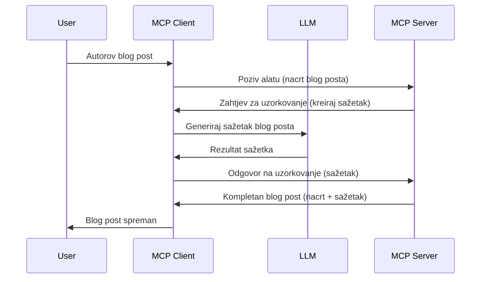

# Uzorčenje - delegiranje značajki klijentu

> **Obavijest o zastarjelosti:** kandidacijska specifikacija MCP iz `2026-07-28` označava uzorčenje kao zastarjelo u korist izravne integracije s API-jima pružatelja LLM. Uzorčenje i dalje funkcionira u `2025-11-25` i barem godinu dana nakon formalne zastarjelosti, tako da je sve u ovoj lekciji i dalje valjano — ali novi dizajni poslužitelja trebaju razmotriti zamjenski obrazac. Pogledajte [Što se mijenja u MCP: Kandidacijska verzija iz 2026-07-28](../../01-CoreConcepts/mcp-2026-07-28-release-candidate.md).

Ponekad je potrebno da MCP Klijent i MCP Poslužitelj surađuju kako bi postigli zajednički cilj. Možda imate situaciju u kojoj Poslužitelj treba pomoć LLM-a koji se nalazi na klijentu. Za takvu situaciju, uzorčenje je ono što trebate koristiti.

Istražimo nekoliko primjera upotrebe i kako izgraditi rješenje koje uključuje uzorčenje.

## Pregled

U ovoj lekciji fokusiramo se na objašnjenje kada i gdje koristiti Uzorčenje i kako ga konfigurirati.

## Ciljevi učenja

U ovom poglavlju ćemo:

- Objasniti što je Uzorčenje i kada ga koristiti.
- Pokazati kako konfigurirati Uzorčenje u MCP-u.
- Dati primjere uzorčenja u praksi.

## Što je Uzorčenje i zašto ga koristiti?

Uzorčenje je napredna značajka koja funkcionira na sljedeći način:



### Zahtjev za uzorčenje

Ok, sada kada imamo pregled vjerodostojnog scenarija, razgovarajmo o zahtjevu za uzorčenje koji poslužitelj šalje natrag klijentu. Evo kako takav zahtjev može izgledati u JSON-RPC formatu:

```json
{
  "jsonrpc": "2.0",
  "id": 1,
  "method": "sampling/createMessage",
  "params": {
    "messages": [
      {
        "role": "user",
        "content": {
          "type": "text",
          "text": "Create a blog post summary of the following blog post: <BLOG POST>"
        }
      }
    ],
    "modelPreferences": {
      "hints": [
        {
          "name": "claude-3-sonnet"
        }
      ],
      "intelligencePriority": 0.8,
      "speedPriority": 0.5
    },
    "systemPrompt": "You are a helpful assistant.",
    "maxTokens": 100
  }
}
```

Vrijedi istaknuti nekoliko stvari ovdje:

- Prompt, unutar content -> text, je naš prompt koji je uputa LLM-u da sažme sadržaj blog posta.

- **modelPreferences**. Ovaj dio je upravo to, preferencija, preporuka kakvu konfiguraciju koristiti za LLM. Korisnik može odlučiti hoće li prihvatiti te preporuke ili ih promijeniti. U ovom slučaju postoje preporuke o modelu za korištenje te prioritetu brzine i inteligencije.
- **systemPrompt**, ovo je vaš uobičajeni sistemski prompt koji daje LLM-u osobnost i sadrži upute.
- **maxTokens**, ovo je još jedna svojstvo koja govori koliko tokena se preporučuje koristiti za ovaj zadatak.

### Odgovor na uzorčenje

Ovaj odgovor MCP Klijent vraća MCP Poslužitelju kao rezultat poziva LLM-u, čekanja tog odgovora i zatim sastavljanja ove poruke. Evo kako može izgledati u JSON-RPC formatu:

```json
{
  "jsonrpc": "2.0",
  "id": 1,
  "result": {
    "role": "assistant",
    "content": {
      "type": "text",
      "text": "Here's your abstract <ABSTRACT>"
    },
    "model": "gpt-5",
    "stopReason": "endTurn"
  }
}
```

Primijetite kako je odgovor sažetak blog posta upravo kako smo tražili. Također primijetite kako korišteni `model` nije onaj koji smo zatražili, nego "gpt-5" umjesto "claude-3-sonnet". To ilustrira da korisnik može promijeniti odluku o korištenju i da je vaš zahtjev za uzorčenje preporuka.

Ok, sada kad razumijemo glavni tijek i korisnu svrhu "kreiranje blog posta + sažetak", pogledajmo što trebamo napraviti da bi to funkcioniralo.

### Vrste poruka

Poruke za uzorčenje nisu ograničene samo na tekst nego možete slati i slike te zvuk. Evo kako JSON-RPC izgleda u različitim slučajevima:

**Tekst**

```json
{
  "type": "text",
  "text": "The message content"
}
```

**Sadržaj slike**

```json
{
  "type": "image",
  "data": "base64-encoded-image-data",
  "mimeType": "image/jpeg"
}
```

**Sadržaj zvuka**

```json
{
  "type": "audio",
  "data": "base64-encoded-audio-data",
  "mimeType": "audio/wav"
}
```

> NAPOMENA: za detaljnije informacije o Uzorčenju, pogledajte [službenu dokumentaciju](https://modelcontextprotocol.io/specification/2025-11-25/client/sampling)

## Kako konfigurirati Uzorčenje u Klijentu

> Napomena: ako gradite samo poslužitelj, ne morate raditi mnogo ovdje.

U klijentu trebate specificirati sljedeću značajku na sljedeći način:

```json
{
  "capabilities": {
    "sampling": {}
  }
}
```

Ovo će se zatim prepoznati kada vaš odabrani klijent inicijalizira vezu s poslužiteljem.

## Primjer uzorčenja u praksi - Kreiranje blog posta

Kodirajmo zajedno uzorčni poslužitelj, trebamo učiniti sljedeće:

1. Kreirati alat na poslužitelju.
1. Taj alat treba kreirati zahtjev za uzorčenje.
1. Alat treba čekati da klijent odgovori na zahtjev za uzorčenje.
1. Zatim treba proizvesti rezultat alata.

Pogledajmo kod korak po korak:

### -1- Kreirajte alat

**python**

```python
@mcp.tool()
async def create_blog(title: str, content: str, ctx: Context[ServerSession, None]) -> str:
    """Create a blog post and generate a summary"""

```

### -2- Kreirajte zahtjev za uzorčenje

Proširite alat sljedećim kodom:

**python**

```python
post = BlogPost(
        id=len(posts) + 1,
        title=title,
        content=content,
        abstract=""
    )

prompt = f"Create an abstract of the following blog post: title: {title} and draft: {content} "

result = await ctx.session.create_message(
        messages=[
            SamplingMessage(
                role="user",
                content=TextContent(type="text", text=prompt),
            )
        ],
        max_tokens=100,
)

```

### -3- Čekajte odgovor i vratite odgovor

**python**

```python
post.abstract = result.content.text

posts.append(post)

# vrati kompletan proizvod
return json.dumps({
    "id": post.title,
    "abstract": post.abstract
})
```

### -4- Cijeli kod

**python**

```python
from starlette.applications import Starlette
from starlette.routing import Mount, Host

from mcp.server.fastmcp import Context, FastMCP

from mcp.server.session import ServerSession
from mcp.types import SamplingMessage, TextContent

import json


from uuid import uuid4
from typing import List
from pydantic import BaseModel


mcp = FastMCP("Blog post generator")

# app = FastAPI()

posts = []

class BlogPost(BaseModel):
    id: int
    title: str
    content: str
    abstract: str

posts: List[BlogPost] = []

@mcp.tool()
async def create_blog(title: str, content: str, ctx: Context[ServerSession, None]) -> str:
    """Create a blog post and generate a summary"""

    post = BlogPost(
        id=len(posts) + 1,
        title=title,
        content=content,
        abstract=""
    )

    prompt = f"Create an abstract of the following blog post: title: {title} and draft: {content} "

    result = await ctx.session.create_message(
        messages=[
            SamplingMessage(
                role="user",
                content=TextContent(type="text", text=prompt),
            )
        ],
        max_tokens=100,
    )

    post.abstract = result.content.text

    posts.append(post)

    # vrati cijeli blog post
    return json.dumps({
        "id": post.title,
        "abstract": post.abstract
    })

if __name__ == "__main__":
    print("Starting server...")
    # mcp.run()
    mcp.run(transport="streamable-http")

# pokreni aplikaciju s: python server.py
```

### -5- Testiranje u Visual Studio Codeu

Da biste ovo testirali u Visual Studio Codeu, učinite slijedeće:

1. Pokrenite poslužitelj u terminalu
1. Dodajte ga u *mcp.json* (i provjerite da je pokrenut), primjerice ovako:

   ```json
   "servers": {
      "blog-server": {
        "type": "http",
        "url": "http://localhost:8000/mcp"
      }
   }
   ```

1. Upisati prompt:

   ```text
   create a blog post named "Where Python comes from", the content is "Python is actually named after Monty Python Flying Circus"
   ```

1. Dopustite da se dogodi uzorčenje. Prvi put kada ovo testirate, prikazat će vam se dodatni dijalog koji morate prihvatiti, zatim će se pojaviti uobičajeni dijalog za pokretanje alata.

1. Pregledajte rezultate. Rezultate ćete vidjeti lijepo prikazane u GitHub Copilot Chatu ali možete pregledati i sirovi JSON odgovor.

**Bonus**. Visual Studio Code alati imaju odličnu podršku za uzorčenje. Možete konfigurirati pristup uzorčenju za vaš instalirani poslužitelj tako da odete ovako:

1. Idite u dio za proširenja.
1. Odaberite ikonu zupčanika za vaš instalirani poslužitelj u sekciji "MCP SERVERS - INSTALLED".
1 Odaberite "Configure Model Access", ovdje možete odabrati koje modele GitHub Copilot smije koristiti pri uzorkovanju. Također možete vidjeti sve nedavne zahtjeve za uzorčenje odabirom "Show Sampling requests".

## Zadatak

U ovom zadatku izgradit ćete nešto drugačiji oblik uzorčenja, naime integraciju za uzorčenje koja podržava generiranje opisa proizvoda. Evo vašeg scenarija:

**Scenarij**: Radnik u back officeu e-trgovine treba pomoć, previše vremena mu treba za generiranje opisa proizvoda. Stoga trebate izgraditi rješenje gdje možete pozvati alat "create_product" s argumentima "title" i "keywords" i alat bi trebao proizvesti kompletan proizvod uključujući polje "description" koje bi trebao popuniti LLM klijenta.

SAVJET: koristite ono što ste ranije naučili da konstruirate ovaj poslužitelj i njegov alat koristeći zahtjev za uzorčenje.

## Rješenje

[Rješenje](./solution/README.md)

## Ključne spoznaje

Uzorčenje je moćna značajka koja omogućuje poslužitelju da delegira zadatke klijentu kada mu treba pomoć LLM-a.

## Što slijedi

- [Poglavlje 4 - Praktična implementacija](../../04-PracticalImplementation/README.md)

---

<!-- CO-OP TRANSLATOR DISCLAIMER START -->
**Napomena**:
Ovaj dokument je preveden korištenjem AI prevoditeljskog servisa [Co-op Translator](https://github.com/Azure/co-op-translator). Iako težimo točnosti, imajte na umu da automatski prijevodi mogu sadržavati greške ili netočnosti. Izvorni dokument na izvornom jeziku treba smatrati autoritativnim izvorom. Za važne informacije preporuča se profesionalni ljudski prijevod. Nismo odgovorni za bilo kakva nesporazumevanja ili pogrešne interpretacije koje proizlaze iz korištenja ovog prijevoda.
<!-- CO-OP TRANSLATOR DISCLAIMER END -->