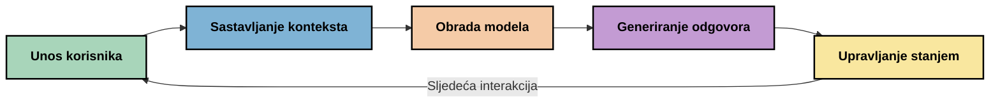
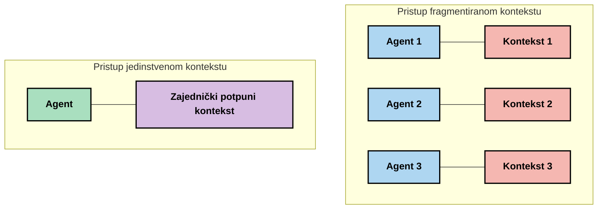
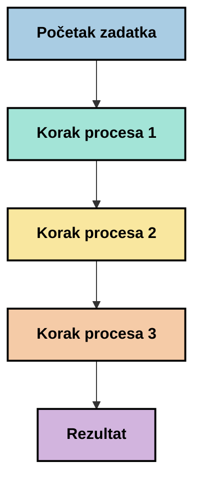
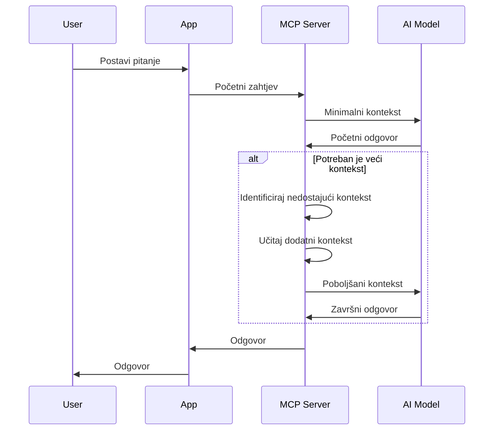
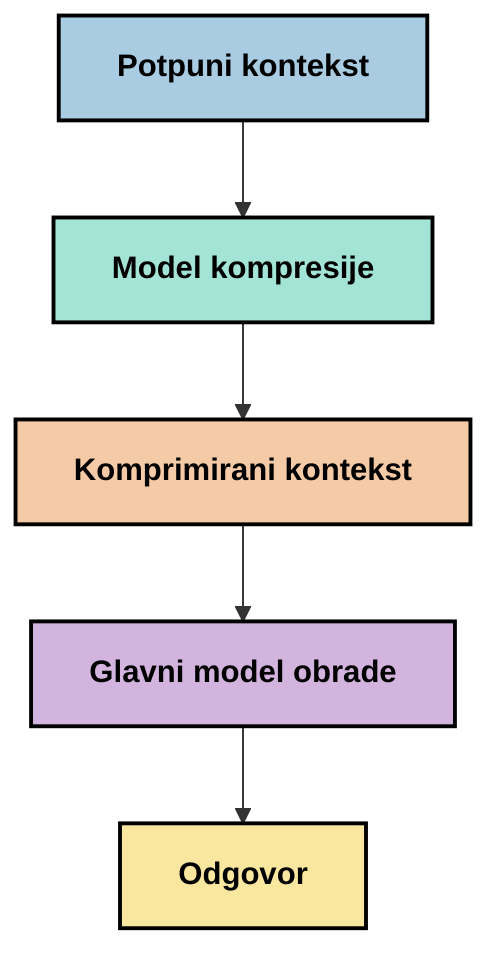
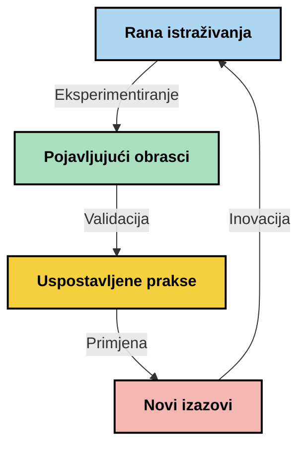

# Inženjering Konteksta: Novi Koncept u MCP Ekosustavu

## Pregled

Inženjering konteksta je novi koncept u području umjetne inteligencije koji istražuje kako se informacije strukturiraju, dostavljaju i održavaju tijekom interakcija između klijenata i AI usluga. Kako ekosustav Protokola za Model Konteksta (MCP) evoluira, razumijevanje kako učinkovito upravljati kontekstom postaje sve važnije. Ovaj modul uvodi pojam inženjeringa konteksta i istražuje njegove potencijalne primjene u MCP implementacijama.

## Ciljevi Učenja

Do kraja ovog modula bit ćete u stanju:

- Razumjeti novi koncept inženjeringa konteksta i njegovu potencijalnu ulogu u MCP aplikacijama
- Identificirati ključne izazove u upravljanju kontekstom koje MCP protokol dizajn rješava
- Istražiti tehnike za poboljšanje performansi modela boljim upravljanjem kontekstom
- Razmotriti pristupe za mjerenje i evaluaciju učinkovitosti konteksta
- Primijeniti ove nove koncepte za poboljšanje AI iskustava kroz MCP okvir

## Uvod u Inženjering Konteksta

Inženjering konteksta je novi koncept fokusiran na namjerno dizajniranje i upravljanje protokom informacija između korisnika, aplikacija i AI modela. Za razliku od uspostavljenih područja poput inženjeringa promptova, inženjering konteksta još uvijek definiraju praktičari dok rade na rješavanju jedinstvenih izazova pružanja pravih informacija AI modelima u pravom trenutku.

Kako su veliki jezični modeli (LLM) evoluirali, važnost konteksta postaje sve očitija. Kvaliteta, relevantnost i struktura konteksta koji pružamo izravno utječu na rezultate modela. Inženjering konteksta istražuje ovaj odnos i nastoji razviti principe za učinkovito upravljanje kontekstom.

> "Godine 2025. modeli su izuzetno inteligentni. Ali čak ni najsvjesniji čovjek neće moći učinkovito obavljati svoj posao bez konteksta onoga što se od njega traži... 'Inženjering konteksta' je sljedeća razina inženjeringa prompta. Radi se o automatskom upravljanju u dinamičkom sustavu." — Walden Yan, Cognition AI

Inženjering konteksta može uključivati:

1. **Odabir Konteksta**: Određivanje koje su informacije relevantne za određeni zadatak
2. **Strukturiranje Konteksta**: Organiziranje informacija za maksimalno razumijevanje modela
3. **Dostava Konteksta**: Optimizacija načina i vremena slanja informacija modelima
4. **Održavanje Konteksta**: Upravljanje stanjem i evolucijom konteksta tijekom vremena
5. **Evaluacija Konteksta**: Mjerenje i poboljšanje učinkovitosti konteksta

Ova područja fokusiranja su posebno relevantna za MCP ekosustav, koji pruža standardiziran način aplikacijama za dostavu konteksta LLM modelima.


## Perspektiva Putovanja Konteksta

Jedan način za vizualizaciju inženjeringa konteksta je pratiti put informacije kroz MCP sustav:



### Ključne Faze u Putovanju Konteksta:

1. **Unos Korisnika**: Sirove informacije od korisnika (tekst, slike, dokumenti)
2. **Sastavljanje Konteksta**: Kombiniranje korisničkog unosa sa sistemskim kontekstom, poviješću razgovora i drugim dohvaćenim informacijama
3. **Obrada Modela**: AI model obrađuje sastavljeni kontekst
4. **Generiranje Odgovora**: Model proizvodi izlaze na temelju pruženog konteksta
5. **Upravljanje Stanjem**: Sustav ažurira svoj interni status na temelju interakcije

Ova perspektiva ističe dinamičku prirodu konteksta u AI sustavima i postavlja važne upite o najboljem upravljanju informacijama u svakoj fazi.

## Novi Principi u Inženjeringu Konteksta

Kako se područje inženjeringa konteksta oblikuje, neke početne smjernice počinju izlaziti od praktičara. Ti principi mogu pomoći ubirati smjernice za MCP implementacije:

### Princip 1: Dijelite Kontekst Potpuno

Kontekst treba dijeliti potpuno između svih komponenti sustava, a ne fragmentirano kroz više agenata ili procesa. Kada je kontekst raspoređen, odluke donesene u jednom dijelu sustava mogu biti u sukobu s onima donesnima drugdje.



U MCP aplikacijama, to sugerira dizajn sustava gdje kontekst teče besprijekorno kroz cijeli procesni lanac, umjesto da je podijeljen u zasebne dijelove.

### Princip 2: Prepoznajte da Akcije Nose Implicitne Odluke

Svaka akcija koju model poduzme uključuje implicitne odluke o tome kako interpretirati kontekst. Kada više komponenti djeluje na različitim kontekstima, te implicitne odluke mogu biti u sukobu, što dovodi do nedosljednih rezultata.

Ovaj princip ima važne implikacije za MCP aplikacije:
- Preferirati linearno procesiranje složenih zadataka nad paralelnim izvođenjem s fragmentiranim kontekstom
- Osigurati da sve odluke imaju pristup istim kontekstualnim informacijama
- Dizajnirati sustave gdje kasniji koraci mogu vidjeti puni kontekst ranijih odluka

### Princip 3: Uravnotežite Dubinu Konteksta s Ograničenjima Prozora

Kako razgovori i procesi postaju dulji, kontekstualni prozori na kraju prelaze svoj kapacitet. Učinkovit inženjering konteksta istražuje pristupe za upravljanje tim napetostima između sveobuhvatnog konteksta i tehničkih ograničenja.

Potencijalni pristupi koji se istražuju uključuju:
- Kompresiju konteksta koja zadržava bitne informacije dok smanjuje korištenje tokena
- Postepeno učitavanje konteksta prema relevantnosti trenutnim potrebama
- Sažimanje prethodnih interakcija uz očuvanje ključnih odluka i činjenica

## Izazovi Konteksta i Dizajn MCP Protokola

Protokol Model Konteksta (MCP) dizajniran je s osviještenošću o jedinstvenim izazovima upravljanja kontekstom. Razumijevanje ovih izazova pomaže objasniti ključne aspekte dizajna MCP protokola:


### Izazov 1: Ograničenja Prozora Konteksta
Većina AI modela ima fiksne veličine prozora konteksta, što ograničava koliko informacija mogu obraditi odjednom.

**Odgovor MCP dizajna:** 
- Protokol podržava strukturirani, resursno bazirani kontekst koji se može učinkovito referencirati
- Resursi se mogu paginirati i učitavati postupno

### Izazov 2: Određivanje Relevantnosti
Teško je utvrditi koje su informacije najrelevantnije za uključivanje u kontekst.

**Odgovor MCP dizajna:**
- Fleksibilni alati omogućuju dinamično dohvaćanje informacija prema potrebi
- Strukturirani promptovi omogućuju dosljednu organizaciju konteksta

### Izazov 3: Postojanost Konteksta
Upravljanje stanjem kroz interakcije zahtijeva pažljivo praćenje konteksta.

**Odgovor MCP dizajna:**
- Standardizirano upravljanje sesijama
- Jasno definirani obrasci interakcija za evoluciju konteksta

### Izazov 4: Višedimenzionalni Kontekst
Različite vrste podataka (tekst, slike, strukturirani podaci) zahtijevaju različito postupanje.

**Odgovor MCP dizajna:**
- Dizajn protokola prilagođava se različitim vrstama sadržaja
- Standardizirana reprezentacija višemodalnih informacija

### Izazov 5: Sigurnost i Privatnost
Kontekst često sadrži osjetljive informacije koje je potrebno zaštititi.

**Odgovor MCP dizajna:**
- Jasne granice između odgovornosti klijenta i servera
- Opcije lokalne obrade radi smanjenja izloženosti podataka

Razumijevanje ovih izazova i načina na koji ih MCP rješava pruža temelj za istraživanje naprednijih tehnika inženjeringa konteksta.

## Novi Pristupi u Inženjeringu Konteksta

Kako se područje inženjeringa konteksta razvija, pojavljuju se nekoliko obećavajućih pristupa. Oni predstavljaju trenutno razmišljanje, a ne uspostavljene prakse, i vjerojatno će se razvijati kako stječemo više iskustva s MCP implementacijama.

### 1. Jednolančano Linearno Procesiranje

Za razliku od višestrukih agentnih arhitektura koje distribuiraju kontekst, neki praktičari otkrivaju da jednolančano linearno procesiranje daje dosljednije rezultate. To je u skladu s principom održavanja jedinstvenog konteksta.



Iako ovaj pristup može djelovati manje učinkovit od paralelnog procesiranja, često daje koherentnije i pouzdanije rezultate jer svaki korak gradi na potpunom razumijevanju prethodnih odluka.

### 2. Razdvajanje i Prioritizacija Konteksta

Razbijanje velikih konteksta na upravljive dijelove i prioritiziranje onoga što je najvažnije.

```python
# Konceptualni primjer: Razdvajanje i prioritetizacija konteksta
def process_with_chunked_context(documents, query):
    # 1. Podijelite dokumente na manje dijelove
    chunks = chunk_documents(documents)
    
    # 2. Izračunajte ocjene relevantnosti za svaki dio
    scored_chunks = [(chunk, calculate_relevance(chunk, query)) for chunk in chunks]
    
    # 3. Sortirajte dijelove prema ocjeni relevantnosti
    sorted_chunks = sorted(scored_chunks, key=lambda x: x[1], reverse=True)
    
    # 4. Koristite najrelevantnije dijelove kao kontekst
    context = create_context_from_chunks([chunk for chunk, score in sorted_chunks[:5]])
    
    # 5. Obradite s prioritetiziranim kontekstom
    return generate_response(context, query)
```

Gornji koncept ilustrira kako možemo razbiti velike dokumente na upravljive dijelove i odabrati samo najrelevantnije dijelove za kontekst. Ovaj pristup može pomoći u radu unutar ograničenja kontekstualnog prozora, dok se i dalje koristi velika baza znanja.

### 3. Postepeno Učitavanje Konteksta

Učitavanje konteksta postepeno prema potrebi, umjesto odjednom.



Postepeno učitavanje konteksta započinje s minimalnim kontekstom i proširuje se samo kada je potrebno. Ovo može značajno smanjiti korištenje tokena za jednostavne upite, dok se i dalje može nositi s kompleksnim pitanjima.

### 4. Kompresija i Sažimanje Konteksta

Smanjenje veličine konteksta uz očuvanje bitnih informacija.



Kompresija konteksta fokusira se na:
- Uklanjanje suvišnih informacija
- Sažimanje dugog sadržaja
- Izdvajanje ključnih činjenica i detalja
- Očuvanje kritičnih elemenata konteksta
- Optimizaciju za učinkovitost tokena

Ovaj pristup može biti posebno vrijedan za održavanje dugih razgovora u okviru ograničenja kontekstualnih prozora ili za učinkovitu obradu velikih dokumenata. Neki praktičari koriste specijalizirane modele posebno za kompresiju konteksta i sažimanje povijesti razgovora.


## Razmatranja u Eksploratornom Inženjeringu Konteksta

Dok istražujemo područje inženjeringa konteksta, vrijedi imati na umu nekoliko razmatranja kod rada s MCP implementacijama. Ovo nisu propisane najbolje prakse, već područja istraživanja koja mogu donijeti poboljšanja u vašem konkretnom slučaju upotrebe.

### Razmislite o Svojim Ciljevima Konteksta

Prije implementacije složenih rješenja upravljanja kontekstom, jasno artikulirajte što želite postići:
- Koje specifične informacije model treba za uspjeh?
- Koje su informacije bitne, a koje dodatne?
- Koja su vaša ograničenja performansi (latencija, ograničenja tokena, troškovi)?

### Istražite Slojevite Pristupe Kontekstu

Neki praktičari nalaze uspjeh s kontekstom organiziranim u konceptualne slojeve:
- **Osnovni sloj**: Bitne informacije koje model uvijek treba
- **Situacijski sloj**: Kontekst specifičan za trenutnu interakciju
- **Pomoćni sloj**: Dodatne informacije koje mogu biti korisne
- **Sloj za rezervu**: Informacije do kojih se pristupa samo po potrebi

### Istražite Strategije Dohvata

Učinkovitost vašeg konteksta često ovisi o načinu na koji dohvaćate informacije:
- Semantičko pretraživanje i ugrađivanja za pronalazak konceptualno relevantnih podataka
- Pretraživanje temeljeno na ključnim riječima za specifične činjenice
- Hibridni pristupi koji kombiniraju više metoda dohvaćanja
- Filtriranje metapodataka za sužavanje opsega prema kategorijama, datumima ili izvorima

### Eksperimentirajte s Koherencijom Konteksta

Struktura i protok vašeg konteksta mogu utjecati na razumijevanje modela:
- Grupiranje povezanih informacija zajedno
- Korištenje dosljednog oblikovanja i organizacije
- Održavanje logičkog ili kronološkog redoslijeda gdje je prikladno
- Izbjegavanje kontradiktornih informacija

### Procijenite Kompromise Više-Agentnih Arhitektura

Dok su više-agentne arhitekture popularne u mnogim AI okvirima, one donose značajne izazove u upravljanju kontekstom:
- Fragmentacija konteksta može dovesti do nedosljednih odluka među agentima
- Paralelna obrada može uvesti sukobe koje je teško pomiriti
- Troškovi komunikacije između agenata mogu poništiti dobivene performanse
- Za održavanje koherencije potrebna je složena kontrola stanja

U mnogim slučajevima, pristup jednim agentom s cjelovitim upravljanjem kontekstom može dati pouzdanije rezultate nego višestruki specijalizirani agenti s fragmentiranim kontekstom.

### Razvijajte Metode Evaluacije

Kako biste poboljšali inženjering konteksta tijekom vremena, razmislite kako ćete mjeriti uspjeh:
- A/B testiranje različitih struktura konteksta
- Praćenje korištenja tokena i vremena odgovora
- Praćenje zadovoljstva korisnika i stope dovršenja zadataka
- Analiza kada i zašto strategije konteksta ne uspijevaju

Ova razmatranja predstavljaju aktivna područja istraživanja u prostoru inženjeringa konteksta. Kako se područje razvija, vjerojatno će se pojaviti jasniji obrasci i prakse.

## Mjerenje Učinkovitosti Konteksta: Razvijajući Okvir

Kako inženjering konteksta izlazi kao koncept, praktičari počinju istraživati kako bismo mogli mjeriti njegovu učinkovitost. Još ne postoji uspostavljeni okvir, ali razni metrički pokazatelji se razmatraju za vođenje budućeg rada.

### Potencijalne Dimenzije Mjerenja


#### 1. Razmatranja Učinkovitosti Unosa

- **Omjer Kontekst-Odgovor**: Koliko konteksta je potrebno u odnosu na veličinu odgovora?
- **Iskorištenje Tokena**: Koji postotak tokena pruženog konteksta utječe na odgovor?
- **Smanjenje Konteksta**: Koliko učinkovito možemo komprimirati sirove informacije?

#### 2. Razmatranja Performansi

- **Utjecaj na Latenciju**: Kako upravljanje kontekstom utječe na vrijeme odgovora?
- **Ekonomija Tokena**: Optimiziramo li učinkovito korištenje tokena?
- **Preciznost Dohvata**: Koliko je relevantna dohvaćena informacija?
- **Korištenje Resursa**: Koji su potrebni računalni resursi?

#### 3. Razmatranja Kvalitete

- **Relevantnost Odgovora**: Koliko dobro odgovor zadovoljava upit?
- **Činjenicna Točnost**: Poboljšava li upravljanje kontekstom točnost činjenica?
- **Dosljednost**: Jesu li odgovori dosljedni za slične upite?
- **Stopa Halucinacija**: Smanjuje li bolji kontekst halucinacije modela?

#### 4. Razmatranja Korisničkog Iskustva

- **Stopa Praćenja**: Koliko često korisnici traže pojašnjenja?
- **Dovršenje Zadataka**: Hoće li korisnici uspješno ostvariti svoje ciljeve?
- **Pokazatelji Zadovoljstva**: Kako korisnici ocjenjuju svoje iskustvo?

### Eksploratorni Pristupi Mjerenju

Dok eksperimentirate s inženjeringom konteksta u MCP implementacijama, razmislite o ovim istraživačkim pristupima:

1. **Usporedbe s Bazom**: Uspostavite osnovnu liniju s jednostavnim pristupima kontekstu prije testiranja složenijih metoda

2. **Postepene Promjene**: Mijenjajte jedan aspekt upravljanja kontekstom u isto vrijeme kako biste izolirali njegove učinke

3. **Evaluacija Usmjerena na Korisnika**: Kombinirajte kvantitativne metrike s kvalitativnim povratnim informacijama korisnika

4. **Analiza Neuspjeha**: Istražite slučajeve kada strategije konteksta ne funkcioniraju da biste razumjeli potencijalna poboljšanja

5. **Višedimenzionalna Procjena**: Razmotrite kompromise između učinkovitosti, kvalitete i korisničkog iskustva

Ovaj eksperimentalni, višestruki pristup mjerenju usklađuje se s novim karakterom inženjeringa konteksta.

## Završne Misli

Inženjering konteksta je novo područje istraživanja koje bi moglo biti ključno za učinkovite MCP aplikacije. Pažljivim razmatranjem protoka informacija kroz vaš sustav, možete potencijalno stvoriti AI doživljaje koji su učinkovitiji, točniji i vrijedniji za korisnike.

Tehnike i pristupi opisani u ovom modulu predstavljaju početna razmišljanja u ovom području, a ne utvrđene prakse. Inženjering konteksta mogao bi se razviti u definiranu disciplinu kako AI mogućnosti rastu i naše razumijevanje produbljuje. Za sada, eksperimentiranje u kombinaciji s pažljivim mjerenjem čini se najproduktivnijim pristupom.

## Potencijalni Budući Smjerovi

Područje inženjeringa konteksta još je u ranoj fazi, ali pojavljuju se nekoliko obećavajućih smjerova:

- Principi inženjeringa konteksta mogli bi značajno utjecati na performanse modela, učinkovitost, korisničko iskustvo i pouzdanost
- Jednolančani pristupi s cjelovitim upravljanjem kontekstom mogli bi nadmašiti višestruke agente u mnogim slučajevima upotrebe
- Specijalizirani modeli za kompresiju konteksta mogli bi postati standardni dijelovi AI lanaca
- Napetost između potpunosti konteksta i ograničenja tokena vjerojatno će potaknuti inovacije u upravljanju kontekstom
- Kako modeli postaju sposobniji za učinkovitu komunikaciju nalik ljudskoj, prava suradnja više agenata mogla bi postati izvedivija
- MCP implementacije mogli bi se razviti u standardizirane obrasce upravljanja kontekstom koji proizlaze iz trenutnog eksperimentiranja



## Resursi

### Službeni MCP Resursi
- [Model Context Protocol Website](https://modelcontextprotocol.io/)
- [Model Context Protocol Specification](https://github.com/modelcontextprotocol/modelcontextprotocol)

- [MCP Dokumentacija](https://modelcontextprotocol.io/docs)
- [MCP C# SDK](https://github.com/modelcontextprotocol/csharp-sdk)
- [MCP Python SDK](https://github.com/modelcontextprotocol/python-sdk)
- [MCP TypeScript SDK](https://github.com/modelcontextprotocol/typescript-sdk)
- [MCP Inspector](https://github.com/modelcontextprotocol/inspector) - Vizualni alat za testiranje MCP servera

### Članci o kontekstualnom inženjerstvu
- [Ne gradite višestruke agente: Principi kontekstualnog inženjerstva](https://cognition.ai/blog/dont-build-multi-agents) - Walden Yanovi uvidi o principima kontekstualnog inženjerstva
- [Praktični vodič za izgradnju agenata](https://cdn.openai.com/business-guides-and-resources/a-practical-guide-to-building-agents.pdf) - OpenAI vodič za učinkoviti dizajn agenata
- [Izgradnja učinkovitih agenata](https://www.anthropic.com/engineering/building-effective-agents) - Anthropicov pristup razvoju agenata

### Povezana istraživanja
- [Dinamička nadopuna pretraživanja za velike jezične modele](https://arxiv.org/abs/2310.01487) - Istraživanje o dinamičkim pristupima pretraživanju
- [Izgubljeni usred: Kako jezični modeli koriste dug kontekst](https://arxiv.org/abs/2307.03172) - Važno istraživanje o obrascima obrade konteksta
- [Hijerarhijska generacija slika uvjetovana tekstom s CLIP latentima](https://arxiv.org/abs/2204.06125) - DALL-E 2 rad s uvidima o strukturiranju konteksta
- [Istraživanje uloge konteksta u arhitekturama velikih jezičnih modela](https://aclanthology.org/2023.findings-emnlp.124/) - Najnovije istraživanje o rukovanju kontekstom
- [Suradnja višestrukih agenata: Pregled](https://arxiv.org/abs/2304.03442) - Istraživanje o sustavima višestrukih agenata i njihovim izazovima

### Dodatni resursi
- [Tehnike optimizacije kontekstnog prozora](https://learn.microsoft.com/en-us/azure/ai-services/openai/concepts/context-window)
- [Napredne RAG tehnike](https://www.microsoft.com/en-us/research/blog/retrieval-augmented-generation-rag-and-frontier-models/)
- [Dokumentacija Semantic Kernel](https://github.com/microsoft/semantic-kernel)
- [AI Toolkit za upravljanje kontekstom](https://github.com/microsoft/aitoolkit)

## Što slijedi

- [5.15 MCP Custom Transport](../mcp-transport/README.md)

---

<!-- CO-OP TRANSLATOR DISCLAIMER START -->
**Napomena**:
Ovaj dokument je preveden korištenjem AI prevoditeljskog servisa [Co-op Translator](https://github.com/Azure/co-op-translator). Iako težimo točnosti, imajte na umu da automatski prijevodi mogu sadržavati greške ili netočnosti. Izvorni dokument na izvornom jeziku treba smatrati autoritativnim izvorom. Za važne informacije preporuča se profesionalni ljudski prijevod. Nismo odgovorni za bilo kakva nesporazumevanja ili pogrešne interpretacije koje proizlaze iz korištenja ovog prijevoda.
<!-- CO-OP TRANSLATOR DISCLAIMER END -->