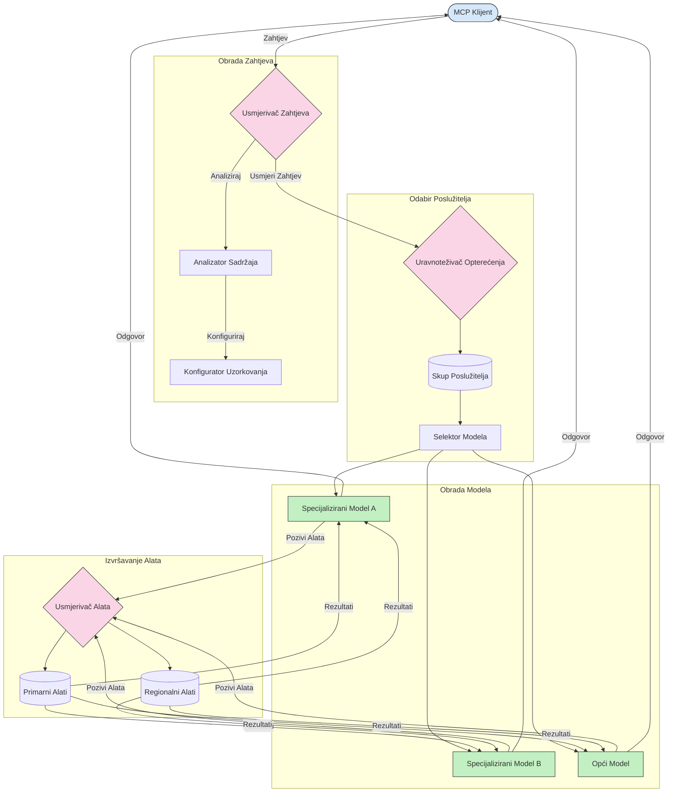

# Usmjeravanje u Protokolu Konteksta Modela

Usmjeravanje je ključno za usmjeravanje zahtjeva prema odgovarajućim modelima, alatima ili uslugama unutar MCP ekosustava.

## Uvod

Usmjeravanje u Protokolu Konteksta Modela (MCP) uključuje usmjeravanje zahtjeva na najprikladnije modele ili usluge temeljem različitih kriterija poput vrste sadržaja, konteksta korisnika i opterećenja sustava. To osigurava učinkovitu obradu i optimalno korištenje resursa.

## Ciljevi učenja

Na kraju ovog lekcija moći ćete:

- Razumjeti principe usmjeravanja u MCP-u.
- Implementirati usmjeravanje temeljeno na sadržaju za usmjeravanje zahtjeva prema specijaliziranim uslugama.
- Primijeniti inteligentne strategije balansiranja opterećenja za optimizaciju korištenja resursa.
- Implementirati dinamičko usmjeravanje alata temeljeno na kontekstu zahtjeva.

## Usmjeravanje Temeljeno na Sadržaju

Usmjeravanje temeljeno na sadržaju usmjerava zahtjeve prema specijaliziranim uslugama na temelju sadržaja zahtjeva. Na primjer, zahtjevi povezani s generiranjem koda mogu se usmjeriti prema specijaliziranom modelu za kod, dok se zahtjevi za kreativno pisanje mogu poslati kreativnom modelu pisanja.

Pogledajmo primjer implementacije na različitim programskim jezicima.

<details>
<summary>.NET</summary>

```csharp
// .NET Example: Content-based routing in MCP
public class ContentBasedRouter
{
    private readonly Dictionary<string, McpClient> _specializedClients;
    private readonly RoutingClassifier _classifier;
    
    public ContentBasedRouter()
    {
        // Initialize specialized clients for different domains
        _specializedClients = new Dictionary<string, McpClient>
        {
            ["code"] = new McpClient("https://code-specialized-mcp.com"),
            ["creative"] = new McpClient("https://creative-specialized-mcp.com"),
            ["scientific"] = new McpClient("https://scientific-specialized-mcp.com"),
            ["general"] = new McpClient("https://general-mcp.com")
        };
        
        // Initialize content classifier
        _classifier = new RoutingClassifier();
    }
    
    public async Task<McpResponse> RouteAndProcessAsync(string prompt, IDictionary<string, object> parameters = null)
    {
        // Classify the prompt to determine the best specialized service
        string category = await _classifier.ClassifyPromptAsync(prompt);
        
        // Get the appropriate client or fall back to general
        var client = _specializedClients.ContainsKey(category) 
            ? _specializedClients[category] 
            : _specializedClients["general"];
            
        Console.WriteLine($"Routing request to {category} specialized service");
        
        // Send request to the selected service
        return await client.SendPromptAsync(prompt, parameters);
    }
    
    // Simple classifier for routing decisions
    private class RoutingClassifier
    {
        public Task<string> ClassifyPromptAsync(string prompt)
        {
            prompt = prompt.ToLowerInvariant();
            
            if (prompt.Contains("code") || prompt.Contains("function") || 
                prompt.Contains("program") || prompt.Contains("algorithm"))
            {
                return Task.FromResult("code");
            }
            
            if (prompt.Contains("story") || prompt.Contains("creative") || 
                prompt.Contains("imagine") || prompt.Contains("design"))
            {
                return Task.FromResult("creative");
            }
            
            if (prompt.Contains("science") || prompt.Contains("research") || 
                prompt.Contains("analyze") || prompt.Contains("study"))
            {
                return Task.FromResult("scientific");
            }
            
            return Task.FromResult("general");
        }
    }
}
```

U prethodnom kodu smo:

- Stvorili klasu `ContentBasedRouter` koja usmjerava zahtjeve temeljem sadržaja upita.
- Inicijalizirali specijalizirane klijente za različite domene (kod, kreativno, znanstveno, opće).
- Implementirali jednostavan klasifikator koji određuje kategoriju upita i usmjerava ga na odgovarajuću specijaliziranu uslugu.
- Koristili mehanizam rezervnog rješenja za usmjeravanje zahtjeva prema općoj usluzi ako nema dostupne specijalizirane usluge.
- Implementirali asinkronu obradu za učinkovito rukovanje zahtjevima.
- Koristili rječnik za mapiranje kategorija sadržaja na specijalizirane MCP klijente.
- Implementirali jednostavan klasifikator koji analizira upit i vraća odgovarajuću kategoriju.
- Koristili specijaliziranog klijenta za slanje zahtjeva i primanje odgovora.
- Rukovali slučajevima kada upit ne odgovara nijednoj specijaliziranoj kategoriji usmjeravanjem na opću uslugu.

</details>

## Inteligentno Balansiranje Opterećenja

Balansiranje opterećenja optimizira korištenje resursa i osigurava visoku dostupnost MCP usluga. Postoje različiti načini implementacije balansiranja opterećenja, poput round-robin, ponderirano vrijeme odgovora ili strategije svjesne sadržaja.

Pogledajmo sljedeći primjer implementacije koji koristi sljedeće strategije:

- **Round Robin**: Ravnomjerno raspoređuje zahtjeve preko dostupnih servera.
- **Ponderirano Vrijeme Odgovora**: Usmjerava zahtjeve prema serverima temeljem njihovog prosječnog vremena odgovora.
- **Svijest o Sadržaju**: Usmjerava zahtjeve prema specijaliziranim serverima na temelju sadržaja zahtjeva.

<details>
<summary>Java</summary>

```java
// Java primjer: Inteligentno balansiranje opterećenja za MCP servere
public class McpLoadBalancer {
    private final List<McpServerNode> serverNodes;
    private final LoadBalancingStrategy strategy;
    
    public McpLoadBalancer(List<McpServerNode> nodes, LoadBalancingStrategy strategy) {
        this.serverNodes = new ArrayList<>(nodes);
        this.strategy = strategy;
    }
    
    public McpResponse processRequest(McpRequest request) {
        // Odaberi najbolji server na temelju strategije
        McpServerNode selectedNode = strategy.selectNode(serverNodes, request);
        
        try {
            // Usmjeri zahtjev prema odabranom čvoru
            return selectedNode.processRequest(request);
        } catch (Exception e) {
            // Obradi neuspjeh - implementiraj logiku ponovnog pokušaja ili rezervni plan
            System.err.println("Error processing request on node " + selectedNode.getId() + ": " + e.getMessage());
            
            // Označi čvor kao potencijalno nezdrav
            selectedNode.recordFailure();
            
            // Pokušaj sljedeći najbolji čvor kao rezervu
            List<McpServerNode> remainingNodes = new ArrayList<>(serverNodes);
            remainingNodes.remove(selectedNode);
            
            if (!remainingNodes.isEmpty()) {
                McpServerNode fallbackNode = strategy.selectNode(remainingNodes, request);
                return fallbackNode.processRequest(request);
            } else {
                throw new RuntimeException("All MCP server nodes failed to process the request");
            }
        }
    }
    
    // Zadaci za provjeru zdravlja čvora
    public void startHealthChecks(Duration interval) {
        ScheduledExecutorService scheduler = Executors.newScheduledThreadPool(1);
        scheduler.scheduleAtFixedRate(() -> {
            for (McpServerNode node : serverNodes) {
                try {
                    boolean isHealthy = node.checkHealth();
                    System.out.println("Node " + node.getId() + " health status: " + 
                                      (isHealthy ? "HEALTHY" : "UNHEALTHY"));
                } catch (Exception e) {
                    System.err.println("Health check failed for node " + node.getId());
                    node.setHealthy(false);
                }
            }
        }, 0, interval.toMillis(), TimeUnit.MILLISECONDS);
    }
    
    // Sučelje za strategije balansiranja opterećenja
    public interface LoadBalancingStrategy {
        McpServerNode selectNode(List<McpServerNode> nodes, McpRequest request);
    }
    
    // Round-robin strategija
    public static class RoundRobinStrategy implements LoadBalancingStrategy {
        private AtomicInteger counter = new AtomicInteger(0);
        
        @Override
        public McpServerNode selectNode(List<McpServerNode> nodes, McpRequest request) {
            List<McpServerNode> healthyNodes = nodes.stream()
                .filter(McpServerNode::isHealthy)
                .collect(Collectors.toList());
            
            if (healthyNodes.isEmpty()) {
                throw new RuntimeException("No healthy nodes available");
            }
            
            int index = counter.getAndIncrement() % healthyNodes.size();
            return healthyNodes.get(index);
        }
    }
    
    // Strategija ponderiranog vremena odziva
    public static class ResponseTimeStrategy implements LoadBalancingStrategy {
        @Override
        public McpServerNode selectNode(List<McpServerNode> nodes, McpRequest request) {
            return nodes.stream()
                .filter(McpServerNode::isHealthy)
                .min(Comparator.comparing(McpServerNode::getAverageResponseTime))
                .orElseThrow(() -> new RuntimeException("No healthy nodes available"));
        }
    }
    
    // Strategija osviještena o sadržaju
    public static class ContentAwareStrategy implements LoadBalancingStrategy {
        @Override
        public McpServerNode selectNode(List<McpServerNode> nodes, McpRequest request) {
            // Odredi karakteristike zahtjeva
            boolean isCodeRequest = request.getPrompt().contains("code") || 
                                   request.getAllowedTools().contains("codeInterpreter");
            
            boolean isCreativeRequest = request.getPrompt().contains("creative") || 
                                       request.getPrompt().contains("story");
            
            // Pronađi specijalizirane čvorove
            Optional<McpServerNode> specializedNode = nodes.stream()
                .filter(McpServerNode::isHealthy)
                .filter(node -> {
                    if (isCodeRequest && node.getSpecialization().equals("code")) {
                        return true;
                    }
                    if (isCreativeRequest && node.getSpecialization().equals("creative")) {
                        return true;
                    }
                    return false;
                })
                .findFirst();
            
            // Vrati specijalizirani čvor ili najmanje opterećeni čvor
            return specializedNode.orElse(
                nodes.stream()
                    .filter(McpServerNode::isHealthy)
                    .min(Comparator.comparing(McpServerNode::getCurrentLoad))
                    .orElseThrow(() -> new RuntimeException("No healthy nodes available"))
            );
        }
    }
}
```

U prethodnom kodu smo:

- Stvorili klasu `McpLoadBalancer` koja upravlja listom MCP serverskih čvorova i usmjerava zahtjeve temeljem odabrane strategije balansiranja opterećenja.
- Implementirali različite strategije balansiranja opterećenja: `RoundRobinStrategy`, `ResponseTimeStrategy` i `ContentAwareStrategy`.
- Koristili `ScheduledExecutorService` za periodičnu provjeru zdravlja serverskih čvorova.
- Implementirali mehanizam provjere zdravlja koji označava čvorove kao zdrave ili nezdrave temeljem njihovih odgovora na provjere zdravlja.
- Rukovali obradom zahtjeva s upravljanjem pogreškama i logikom rezervnog rješenja za osiguranje visoke dostupnosti.
- Koristili klasu `McpServerNode` za predstavljanje pojedinačnih MCP serverskih čvorova, uključujući njihov status zdravlja, prosječno vrijeme odgovora i trenutačno opterećenje.
- Implementirali klasu `McpRequest` za enkapsulaciju detalja zahtjeva poput upita i dopuštenih alata.
- Koristili Java Streams za filtriranje i odabir čvorova prema statusu zdravlja i specijalizaciji.

</details>

## Dinamičko Usmjeravanje Alata

Usmjeravanje alata osigurava da se pozivi alata usmjeravaju prema najprikladnijoj usluzi prema kontekstu. Na primjer, poziv vremenskog alata može trebati biti usmjeren prema regionalnoj točki pristupa temeljem lokacije korisnika, ili kalkulator može trebati koristiti posebnu verziju API-ja.

Pogledajmo primjer implementacije koji demonstrira dinamičko usmjeravanje alata temeljem analize zahtjeva, regionalnih točaka pristupa i podrške za verzioniranje.

<details>
<summary>Python</summary>

```python
# Python primjer: Dinamičko usmjeravanje alata na temelju analize zahtjeva
class McpToolRouter:
    def __init__(self):
        # Registrirajte dostupne krajnje točke alata
        self.tool_endpoints = {
            "weatherTool": "https://weather-service.example.com/api",
            "calculatorTool": "https://calculator-service.example.com/compute",
            "databaseTool": "https://database-service.example.com/query",
            "searchTool": "https://search-service.example.com/search"
        }
        
        # Regionalne krajnje točke za globalnu distribuciju
        self.regional_endpoints = {
            "us": {
                "weatherTool": "https://us-west.weather-service.example.com/api",
                "searchTool": "https://us.search-service.example.com/search"
            },
            "europe": {
                "weatherTool": "https://eu.weather-service.example.com/api",
                "searchTool": "https://eu.search-service.example.com/search"
            },
            "asia": {
                "weatherTool": "https://asia.weather-service.example.com/api",
                "searchTool": "https://asia.search-service.example.com/search"
            }
        }
        
        # Podrška za verzioniranje alata
        self.tool_versions = {
            "weatherTool": {
                "default": "v2",
                "v1": "https://weather-service.example.com/api/v1",
                "v2": "https://weather-service.example.com/api/v2",
                "beta": "https://weather-service.example.com/api/beta"
            }
        }
    
    async def route_tool_request(self, tool_name, parameters, user_context=None):
        """Route a tool request to the appropriate endpoint based on context"""
        endpoint = self._select_endpoint(tool_name, parameters, user_context)
        
        if not endpoint:
            raise ValueError(f"No endpoint available for tool: {tool_name}")
        
        # Izvršite stvarni zahtjev prema odabranoj krajnjoj točki
        return await self._execute_tool_request(endpoint, tool_name, parameters)
    
    def _select_endpoint(self, tool_name, parameters, user_context=None):
        """Select the most appropriate endpoint based on context"""
        # Osnovna krajnja točka iz registra
        if tool_name not in self.tool_endpoints:
            return None
            
        base_endpoint = self.tool_endpoints[tool_name]
        
        # Provjerite treba li koristiti određenu verziju alata
        if tool_name in self.tool_versions:
            version_info = self.tool_versions[tool_name]
            
            # Koristite navedenu verziju ili zadanu
            requested_version = parameters.get("_version", version_info["default"])
            if requested_version in version_info:
                base_endpoint = version_info[requested_version]
        
        # Provjerite regionalno usmjeravanje ako je regija korisnika poznata
        if user_context and "region" in user_context:
            user_region = user_context["region"]
            
            if user_region in self.regional_endpoints:
                regional_tools = self.regional_endpoints[user_region]
                
                if tool_name in regional_tools:
                    # Koristite krajnju točku specifičnu za regiju
                    return regional_tools[tool_name]
        
        # Provjerite zahtjeve za čuvanje podataka
        if user_context and "data_residency" in user_context:
            # Ovo bi implementiralo logiku za osiguranje da podaci ostanu u određenoj jurisdikciji
            pass
        
        # Provjerite usmjeravanje na temelju latencije
        if user_context and "latency_sensitive" in user_context and user_context["latency_sensitive"]:
            # Ovo bi implementiralo logiku za odabir krajnje točke s najmanjom latencijom
            pass
            
        return base_endpoint
        
    async def _execute_tool_request(self, endpoint, tool_name, parameters):
        """Execute the actual tool request to the selected endpoint"""
        try:
            async with aiohttp.ClientSession() as session:
                async with session.post(
                    endpoint,
                    json={"toolName": tool_name, "parameters": parameters},
                    headers={"Content-Type": "application/json"}
                ) as response:
                    if response.status == 200:
                        result = await response.json()
                        return result
                    else:
                        error_text = await response.text()
                        raise Exception(f"Tool execution failed: {error_text}")
        except Exception as e:
            # Implementirajte logiku ponovnog pokušaja ili strategiju rezervne opcije
            print(f"Error executing tool {tool_name} at {endpoint}: {str(e)}")
            raise
```

U prethodnom kodu smo:

- Stvorili klasu `McpToolRouter` koja upravlja usmjeravanjem alata temeljem analize zahtjeva, regionalnih točaka pristupa i podrške za verzioniranje.
- Registrirali dostupne točke pristupa alata i regionalne točke pristupa za globalnu distribuciju.
- Implementirali dinamičku logiku usmjeravanja koja odabire odgovarajuću točku pristupa temeljem konteksta korisnika, poput regije i zahtjeva za rezidencijom podataka.
- Implementirali podršku za verzioniranje alata, omogućujući korisnicima određivanje verzije alata koju žele koristiti.
- Koristili asinkrone HTTP zahtjeve za izvršenje poziva alata i rukovanje odgovorima.

</details>

## Arhitektura Uzorkovanja i Usmjeravanja u MCP-u

Uzorkovanje je ključna komponenta Protokola Konteksta Modela (MCP) koja omogućava učinkovitu obradu i usmjeravanje zahtjeva. Uključuje analizu dolaznih zahtjeva kako bi se odredio najprikladniji model ili usluga za njihovo rukovanje, temeljem različitih kriterija kao što su tip sadržaja, kontekst korisnika i opterećenje sustava.

Uzorkovanje i usmjeravanje mogu se kombinirati u robusnu arhitekturu koja optimizira korištenje resursa i osigurava visoku dostupnost. Proces uzorkovanja može se koristiti za klasifikaciju zahtjeva, dok ih usmjeravanje usmjerava prema odgovarajućim modelima ili uslugama.

Dijagram ispod ilustrira kako uzorkovanje i usmjeravanje djeluju zajedno u cjelovitoj MCP arhitekturi:



## Što slijedi

- [5.6 Uzorkovanje](../mcp-sampling/README.md)

---

<!-- CO-OP TRANSLATOR DISCLAIMER START -->
**Napomena**:
Ovaj dokument je preveden korištenjem AI prevoditeljskog servisa [Co-op Translator](https://github.com/Azure/co-op-translator). Iako težimo točnosti, imajte na umu da automatski prijevodi mogu sadržavati greške ili netočnosti. Izvorni dokument na izvornom jeziku treba smatrati autoritativnim izvorom. Za važne informacije preporuča se profesionalni ljudski prijevod. Nismo odgovorni za bilo kakva nesporazumevanja ili pogrešne interpretacije koje proizlaze iz korištenja ovog prijevoda.
<!-- CO-OP TRANSLATOR DISCLAIMER END -->