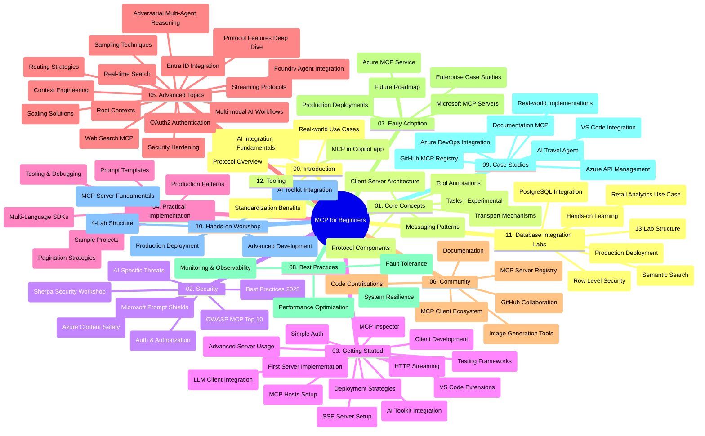

# Model Context Protocol (MCP) za početnike - Vodič za učenje

Ovaj vodič za učenje pruža pregled strukture i sadržaja spremišta za nastavnu jedinicu "Model Context Protocol (MCP) za početnike". Koristite ovaj vodič za učinkovito snalaženje u spremištu i maksimalno iskorištavanje dostupnih resursa.

## Pregled spremišta

Model Context Protocol (MCP) je standardizirani okvir za interakcije između AI modela i klijentskih aplikacija. Izvorno ga je stvorio Anthropic, a sada ga održava šira MCP zajednica kroz službenu GitHub organizaciju. Ovo spremište pruža sveobuhvatni kurikulum s praktičnim primjerima koda u C#, Javi, JavaScriptu, Pythonu i TypeScriptu, namijenjen AI developerima, sustavnim arhitektima i softverskim inženjerima.

## Vizualna karta kurikuluma

## Struktura spremišta

Spremište je organizirano u dvanaest glavnih odjeljaka, od kojih se svaki usredotočuje na različite aspekte MCP-a:

1. **Uvod (00-Introduction/)**
   - Pregled Model Context Protocola
   - Zašto je standardizacija važna u AI procesima
   - Praktične upotrebe i prednosti

2. **Temeljni pojmovi (01-CoreConcepts/)**
   - Klijent-poslužitelj arhitektura
   - Ključne komponente protokola
   - Obrasci poruka u MCP-u
   - Pogled u budućnost: [Što se mijenja u MCP-u: Kandidat za izdanje 2026-07-28](./01-CoreConcepts/mcp-2026-07-28-release-candidate.md) — besdržavni jezgra protokola, okvir za ekstenzije i predviđene deprecijacije Roots/Sampling/Logging u sljedećoj verziji specifikacije

3. **Sigurnost (02-Security/)**
   - Sigurnosne prijetnje u sustavima baziranim na MCP-u
   - Najbolje prakse za osiguranje implementacija
   - Strategije autentikacije i autorizacije
   - **Sveobuhvatna sigurnosna dokumentacija**:
     - Najbolje prakse sigurnosti MCP-a 2025
     - Vodič za implementaciju Azure Content Safety
     - Kontrole i tehnike sigurnosti MCP-a
     - Brzi pregled najboljih praksi MCP-a
   - **Ključne sigurnosne teme**:
     - Napadi ubrizgavanja promptova i trovanja alata
     - Otmičarenje sesija i problemi s nejasnim punomoćem (confused deputy)
     - Ranljivosti kod prijenosa tokena
     - Pretjerane dozvole i kontrola pristupa
     - Sigurnost opskrbnog lanca za AI komponente
     - Integracija Microsoft Prompt Shields

4. **Početak rada (03-GettingStarted/)**
   - Postavljanje i konfiguracija okruženja
   - Kreiranje osnovnih MCP poslužitelja i klijenata
   - Integracija sa postojećim aplikacijama
   - Uključuje odjeljke za:
     - Prvu implementaciju poslužitelja
     - Razvoj klijenta
     - Integraciju LLM klijenta
     - Integraciju u VS Code
     - Poslužitelj sa Server-Sent Events (SSE)
     - Naprednu uporabu poslužitelja
     - HTTP streaming
     - Integraciju AI Toolkit-a
     - Strategije testiranja
     - Smjernice za implementaciju

5. **Praktična implementacija (04-PracticalImplementation/)**
   - Korištenje SDK-ova u različitim programskim jezicima
   - Tehnike otklanjanja pogrešaka, testiranja i validacije
   - Izrada ponovljivih predložaka promptova i tijekova rada
   - Primjeri projekata s implementacijom

6. **Napredne teme (05-AdvancedTopics/)**
   - Tehnike inženjeringa konteksta
   - Integracija Foundry agenta
   - Multi-modalni AI tijekovi rada
   - Demo primjeri OAuth2 autentikacije
   - Mogućnosti pretraživanja u stvarnom vremenu
   - Streaming u stvarnom vremenu
   - Implementacija root konteksta
   - Strategije usmjeravanja
   - Tehnike uzorkovanja
   - Pristupi skaliranju
   - Sigurnosna razmatranja
   - Integracija Entra ID sigurnosti
   - Integracija web pretraživanja
   - Adversarial multi-agent rasuđivanje (obračunski obrasci)

7. **Doprinos zajednice (06-CommunityContributions/)**
   - Kako doprinositi kodu i dokumentaciji
   - Suradnja putem GitHub-a
   - Poboljšanja i povratne informacije vođene zajednicom
   - Korištenje raznih MCP klijenata (Claude Desktop, Cline, VSCode)
   - Rad sa popularnim MCP poslužiteljima uključujući generiranje slika

8. **Lekcije iz ranog usvajanja (07-LessonsfromEarlyAdoption/)**
   - Implementacije iz stvarnog svijeta i uspješne priče
   - Izgradnja i implementacija rješenja baziranih na MCP-u
   - Trendovi i buduća karta puta
   - **Vodič za Microsoft MCP poslužitelje**: Sveobuhvatan vodič za 10 proizvodno spremnih Microsoft MCP poslužitelja uključujući:
     - Microsoft Learn Docs MCP Server
     - Azure MCP Server (15+ specijaliziranih konektora)
     - GitHub MCP Server
     - Azure DevOps MCP Server
     - MarkItDown MCP Server
     - SQL Server MCP Server
     - Playwright MCP Server
     - Dev Box MCP Server
     - Microsoft Foundry MCP Server
     - Microsoft 365 Agents Toolkit MCP Server

9. **Najbolje prakse (08-BestPractices/)**
   - Podešavanje performansi i optimizacija
   - Dizajniranje otpornog MCP sustava
   - Strategije testiranja i otpornosti

10. **Studije slučaja (09-CaseStudy/)**
    - **Sedam sveobuhvatnih studija slučaja** koje pokazuju svestranost MCP-a u različitim scenarijima:
    - **Azure AI agents za putovanja**: višestruka agentna orkestracija s Azure OpenAI i AI Search
    - **Azure DevOps integracija**: automatizacija tijekova rada s YouTube podacima
    - **Dohvat dokumentacije u stvarnom vremenu**: Python konzolni klijent s HTTP streamingom
    - **Interaktivni generator plana učenja**: Chainlit web aplikacija s konverzacijskim AI-jem
    - **Dokumentacija u uređivaču**: VS Code integracija s GitHub Copilot tijekovima rada
    - **Azure API upravljanje**: enterprise integracija API-ja s kreiranjem MCP poslužitelja
    - **GitHub MCP registar**: razvoj ekosustava i agentna platforma za integraciju
    - Primjeri implementacije koji obuhvaćaju enterprise integraciju, produktivnost developera i razvoj ekosustava

11. **Praktična radionica (10-StreamliningAIWorkflowsBuildingAnMCPServerWithAIToolkit/)**
    - Sveobuhvatna praktična radionica koja kombinira MCP s AI Toolkit-om
    - Izgradnja inteligentnih aplikacija koje povezuju AI modele sa stvarnim alatima
    - Praktični moduli koji pokrivaju osnove, razvoj prilagođenih poslužitelja i strategije implementacije u produkciju
    - **Struktura laboratorija**:
      - Laboratorij 1: Osnove MCP poslužitelja
      - Laboratorij 2: Napredni razvoj MCP poslužitelja
      - Laboratorij 3: Integracija AI Toolkit-a
      - Laboratorij 4: Implementacija u produkciju i skaliranje
    - Pristup učenju temeljen na laboratorijima s uputama korak po korak

12. **MCP Server Labs za integraciju baze podataka (11-MCPServerHandsOnLabs/)**
    - **Sveobuhvatni put učenja kroz 13 laboratorija** za izgradnju proizvodno spremnih MCP poslužitelja s integracijom PostgreSQL-a
    - **Implementacija analitike u maloprodaji iz stvarnog svijeta** koristeći Zava Retail slučaj
    - **Enterprise obrasci** uključujući sigurnost na razini redaka (RLS), semantičko pretraživanje i pristup podacima za više najmodavaca
    - **Potpuna struktura laboratorija**:
      - **Laboratoriji 00-03: Osnove** - Uvod, arhitektura, sigurnost, postavljanje okruženja
      - **Laboratoriji 04-06: Izgradnja MCP poslužitelja** - Dizajn baze podataka, implementacija MCP poslužitelja, razvoj alata
      - **Laboratoriji 07-09: Napredne značajke** - Semantičko pretraživanje, testiranje i otklanjanje grešaka, integracija VS Code-a
      - **Laboratoriji 10-12: Produkcija i najbolje prakse** - Implementacija, nadzor, optimizacija
    - **Obuhvaćene tehnologije**: FastMCP okvir, PostgreSQL, Azure OpenAI, Azure Container Apps, Application Insights
    - **Ishodi učenja**: proizvodno spremni MCP poslužitelji, obrasci integracije baza podataka, AI vođena analitika, sigurnost na enterprise razini

13. **Alati (12-tooling/)**
    - Naučite kako koristiti MCP u Copilot aplikaciji i drugim alatima

## Dodatni resursi

Spremište uključuje pomoćne resurse:

- **Mapa slika**: Sadrži dijagrame i ilustracije korištene kroz cijeli kurikulum
- **Prijevodi**: Podrška za više jezika s automatiziranim prijevodima dokumentacije
- **Službeni MCP resursi**:
  - [MCP Dokumentacija](https://modelcontextprotocol.io/)
  - [MCP Specifikacija](https://spec.modelcontextprotocol.io/)
  - [MCP GitHub spremište](https://github.com/modelcontextprotocol)

## Kako koristiti ovo spremište

1. **Sekvencijalno učenje**: Slijedite poglavlja redoslijedom (00 do 11) za strukturirano učenje.
2. **Fokus na određeni jezik**: Ako ste zainteresirani za određeni programski jezik, istražite direktorije uzoraka za implementacije na vašem preferiranom jeziku.
3. **Praktična implementacija**: Počnite s odjeljkom "Početak rada" da postavite svoje okruženje i kreirate svoj prvi MCP poslužitelj i klijent.
4. **Napredna istraživanja**: Kad se osjećate ugodno s osnovama, uronite u napredne teme za proširenje znanja.
5. **Angažman zajednice**: Pridružite se MCP zajednici putem GitHub rasprava i Discord kanala da biste se povezali s ekspertima i drugim developerima.

## MCP klijenti i alati

Kurikulum pokriva različite MCP klijente i alate:

1. **Službeni klijenti**:
   - Visual Studio Code
   - MCP u Visual Studio Codeu
   - Claude Desktop
   - Claude u VSCode-u
   - Claude API

2. **Klijenti iz zajednice**:
   - Cline (terminalski)
   - Cursor (uređivač koda)
   - ChatMCP
   - Windsurf

3. **Alati za upravljanje MCP-om**:
   - MCP CLI
   - MCP Manager
   - MCP Linker
   - MCP Router

## Popularni MCP poslužitelji

Spremište predstavlja različite MCP poslužitelje, uključujući:

1. **Službeni Microsoft MCP poslužitelji**:
   - Microsoft Learn Docs MCP Server
   - Azure MCP Server (15+ specijaliziranih konektora)
   - GitHub MCP Server
   - Azure DevOps MCP Server
   - MarkItDown MCP Server
   - SQL Server MCP Server
   - Playwright MCP Server
   - Dev Box MCP Server
   - Microsoft Foundry MCP Server
   - Microsoft 365 Agents Toolkit MCP Server

2. **Službeni referentni poslužitelji**:
   - Filesystem
   - Fetch
   - Memory
   - Sequential Thinking

3. **Generiranje slika**:
   - Azure OpenAI DALL-E 3
   - Stable Diffusion WebUI
   - Replicate

4. **Alati za razvoj**:
   - Git MCP
   - Terminal Control
   - Code Assistant

5. **Specijalizirani poslužitelji**:
   - Salesforce
   - Microsoft Teams
   - Jira & Confluence

## Doprinos

Ovo spremište poziva doprinos iz zajednice. Pogledajte odjeljak Doprinos zajednice za upute kako učinkovito doprinijeti MCP ekosustavu.

----

*Ovaj vodič za učenje je zadnji put ažuriran 5. veljače 2026., odražavajući najnoviju MCP Specifikaciju 2025-11-25 i pruža pregled spremišta na taj datum. Sadržaj spremišta može biti ažuriran nakon tog datuma.*

*Dodatak (2. srpnja 2026.): lekcija o `2026-07-28` kandidatu MCP specifikacije za izdanje dodana je u [01-CoreConcepts](./01-CoreConcepts/mcp-2026-07-28-release-candidate.md); bazni kurikulum ostaje 2025-11-25 dok nova specifikacija ne bude izdana.*

---

<!-- CO-OP TRANSLATOR DISCLAIMER START -->
**Napomena**:
Ovaj dokument je preveden korištenjem AI prevoditeljskog servisa [Co-op Translator](https://github.com/Azure/co-op-translator). Iako težimo točnosti, imajte na umu da automatski prijevodi mogu sadržavati greške ili netočnosti. Izvorni dokument na izvornom jeziku treba smatrati autoritativnim izvorom. Za važne informacije preporuča se profesionalni ljudski prijevod. Nismo odgovorni za bilo kakva nesporazumevanja ili pogrešne interpretacije koje proizlaze iz korištenja ovog prijevoda.
<!-- CO-OP TRANSLATOR DISCLAIMER END -->