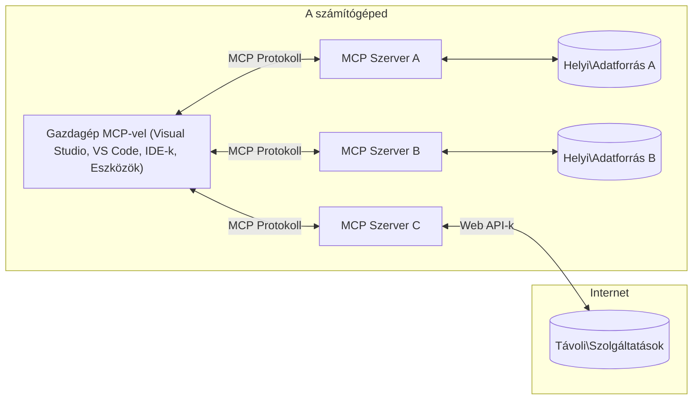

# MCP Alapfogalmak: A Model Context Protocol elsajátítása az AI integrációhoz

[](https://youtu.be/earDzWGtE84)

_(Kattintson a fenti képre a lecke videójának megtekintéséhez)_

A [Model Context Protocol (MCP)](https://github.com/modelcontextprotocol) egy erőteljes, szabványosított keretrendszer, amely optimalizálja a kommunikációt a nagy nyelvi modellek (LLM-ek) és külső eszközök, alkalmazások, valamint adatforrások között.
Ez az útmutató végigvezeti Önt az MCP alapfogalmain. Megismeri a kliens-szerver architektúrát, az alapvető összetevőket, a kommunikáció mechanizmusait és a megvalósítás legjobb gyakorlatait.

- **Explicit felhasználói hozzájárulás**: Minden adat-hozzáférés és művelet végrehajtása előtt szükséges az egyértelmű felhasználói jóváhagyás. A felhasználóknak világosan érteniük kell, milyen adatokhoz férnek hozzá, és milyen műveletek történnek, miközben részletes ellenőrzést kapnak az engedélyek és jogosultságok felett.

- **Adatvédelmi védelem**: A felhasználói adatok csak kifejezett hozzájárulással kerülhetnek bemutatásra, és az egész interakciós életciklus során erős hozzáférés-vezérléssel kell védeni őket. A megvalósításoknak meg kell akadályozniuk az illetéktelen adattovábbítást és szigorú adatvédelmi határokat kell fenntartaniuk.

- **Eszközvégrehajtás biztonsága**: Minden eszközhívás egyértelmű felhasználói hozzájárulást igényel, amelynek során a felhasználó világosan megérti az eszköz működését, paramétereit és lehetséges hatásait. Erős biztonsági határokat kell alkalmazni, hogy megakadályozzák a nem szándékos, nem biztonságos vagy rosszindulatú eszközvégrehajtást.

- **Átvitelréteg-biztonság**: Minden kommunikációs csatornán megfelelő titkosítást és hitelesítési mechanizmusokat kell használni. A távoli kapcsolatoknak biztonságos átvitelprotokollokat és megfelelő hitelesítő adatkezelést kell alkalmazniuk.

#### Megvalósítási irányelvek:

- **Engedélykezelés**: Valósítson meg finoman szabályozott engedélyrendszert, amely lehetővé teszi a felhasználók számára, hogy szabályozzák, mely szerverek, eszközök és erőforrások érhetők el
- **Hitelesítés és jogosultságkezelés**: Használjon biztonságos hitelesítési módszereket (OAuth, API kulcsok) megfelelő tokenkezeléssel és lejárattal
- **Bemenet-ellenőrzés**: Ellenőrizze az összes paramétert és adatbevitelt a definiált sémáknak megfelelően, hogy megakadályozza a beágyazásos támadásokat
- **Auditnaplózás**: Tartson fenn átfogó naplókat minden műveletről a biztonsági megfigyelés és megfelelőség érdekében

## Áttekintés

Ez a lecke megvizsgálja a Model Context Protocol (MCP) ökoszisztéma alapvető architektúráját és összetevőit. Megtanulja a kliens-szerver architektúrát, a kulcsfontosságú elemeket és a kommunikációs mechanizmusokat, amelyek az MCP interakciókat működtetik.

## Fő tanulási célok

A lecke végére Ön:

- Megérti az MCP kliens-szerver architektúrát.
- Azonosítja a Hosztok, Kliens és Szerver szerepeit és felelősségeit.
- Elemzi az MCP-t rugalmas integrációs réteggé tévő fő jellemzőket.
- Megtanulja, hogyan áramlik az információ az MCP ökoszisztémán belül.
- Gyakorlati betekintést nyer a kódpéldák révén .NET-ben, Java-ban, Python-ban és JavaScript-ben.

## MCP Architektúra: Mélyebb betekintés

Az MCP ökoszisztéma kliens-szerver modellen alapul. Ez a moduláris struktúra lehetővé teszi az AI alkalmazások számára, hogy hatékonyan működjenek együtt eszközökkel, adatbázisokkal, API-kkal és kontextuális erőforrásokkal. Nézzük meg ezt az architektúrát az alapvető komponensekre bontva.

Alapjában véve az MCP követi a kliens-szerver architektúrát, ahol egy hoszt alkalmazás több szerverhez tud kapcsolódni:



- **MCP Hosztok**: Programok, mint a VSCode, Claude Desktop, IDE-k vagy AI eszközök, amelyek MCP-n keresztül szeretnének adatokat elérni
- **MCP Kliens**: Protokoll kliensek, amelyek 1:1 kapcsolatokat tartanak fenn a szerverekkel
- **MCP Szerverek**: Könnyű programok, amelyek szabványosított Model Context Protocol segítségével bizonyos képességeket tesznek elérhetővé
- **Helyi adatforrások**: Számítógépének fájljai, adatbázisai és szolgáltatásai, amelyekhez az MCP szerverek biztonságosan hozzáférhetnek
- **Távoli szolgáltatások**: Interneten elérhető külső rendszerek, amelyekhez az MCP szerverek API-kon keresztül csatlakozhatnak

Az MCP Protokoll egy fejlődő szabvány, dátumalapú verziókezeléssel (YYYY-MM-DD formátumban). A jelenlegi protokollverzió a **2025-11-25**. A legfrissebb frissítéseket a [protokoll specifikációban](https://modelcontextprotocol.io/specification/2025-11-25/) tekintheti meg.

> **Előre tekintve:** a következő specifikációs verzió, a **2026-07-28** kiadási jelöltjét 2026 májusában jelentették be, és 2026. július 28-án tervezik megjelentetni. Ez a protokollt állapotmentessé teszi az átvitel rétegben (eltávolítva az `initialize` kézfogást és munkamenet-azonosítókat), formalizálja a Bővítmények keretrendszerét és elavulttá teszi a Gyökereket, Mintavételezést és Naplózást egy újabb mintázat javára. Teljes bontást lásd a [Mi változik az MCP-ben: a 2026-07-28 kiadási jelölt](./mcp-2026-07-28-release-candidate.md) dokumentumban.

### 1. Hosztok

A Model Context Protocolban (MCP) a **Hosztok** azok az AI alkalmazások, amelyek a protokoll elsődleges felhasználói interfészeként szolgálnak. A hosztok koordinálják és kezelik a kapcsolatokat több MCP szerverrel azáltal, hogy minden szerverkapcsolathoz dedikált MCP klienset hoznak létre. A hosztok példái közé tartoznak:

- **AI alkalmazások**: Claude Desktop, Visual Studio Code, Claude Code
- **Fejlesztői környezetek**: IDE-k és kódszerkesztők MCP integrációval
- **Egyedi alkalmazások**: Célzott AI ügynökök és eszközök

A **Hosztok** azok az alkalmazások, amelyek koordinálják az AI modellekkel való interakciókat. Ezek:

- **AI modellek irányítása**: Lefuttatják vagy interakcióba lépnek az LLM-ekkel válaszgenerálás és AI munkafolyamatok koordinálása céljából
- **Klienskapcsolatok kezelése**: Létrehoznak és fenntartanak egy MCP klienst minden MCP szerverkapcsolathoz
- **Felhasználói felület irányítása**: Kezelik a beszélgetések folyamatát, a felhasználói interakciókat és a válaszok megjelenítését
- **Biztonság érvényesítése**: Szabályozzák az engedélyeket, biztonsági korlátokat és hitelesítést
- **Felhasználói hozzájárulás kezelése**: Kezelik az adatmegosztásra és eszközvégrehajtásra vonatkozó felhasználói jóváhagyásokat


### 2. Kliensek

A **Kliensek** alapvető összetevők, amelyek fenntartják az egyéni, egy-egy kapcsolatokat a hosztok és az MCP szerverek között. Minden MCP kliens a hoszt által jön létre egy adott MCP szerverhez való csatlakozáshoz, biztosítva a szervezett és biztonságos kommunikációs csatornákat. Több kliens lehetővé teszi, hogy a hoszt egyszerre több szerverhez is kapcsolódjon.

A **Kliensek** a hoszt alkalmazáson belüli csatlakozó komponensek. Ezek:

- **Protokollkommunikáció**: JSON-RPC 2.0 kéréseket küldenek a szervereknek utasításokkal és promptokkal
- **Képességek egyeztetése**: A kezdeti szakaszban tárgyalják a támogatott funkciókat és protokoll verziókat a szerverekkel
- **Eszközvégrehajtás**: Kezelik a modellektől érkező eszközvégrehajtási kéréseket és feldolgozzák a válaszokat
- **Valós idejű frissítések**: Kezelik a szerverektől érkező értesítéseket és valós idejű frissítéseket
- **Válaszfeldolgozás**: Feldolgozzák és formázzák a szerver válaszokat a felhasználók számára való megjelenítéshez

### 3. Szerverek

A **Szerverek** olyan programok, amelyek kontextust, eszközöket és képességeket biztosítanak az MCP klienseknek. Lehetnek helyileg (ugyanazon a gépen, mint a hoszt) vagy távolról (külső platformokon) futtatottak, és felelősek a klienskérések kezelése és strukturált válaszok biztosítása iránt. A szerverek a Model Context Protocolon keresztül specifikus funkcionalitást nyújtanak.

A **Szerverek** szolgáltatások, amelyek kontextust és képességeket biztosítanak. Ezek:

- **Funkcióregisztráció**: Regisztrálják és elérhetővé teszik a rendelkezésre álló primitíveket (erőforrások, promptok, eszközök) a kliensek számára
- **Kérés feldolgozás**: Fogadják és végrehajtják az eszközhívásokat, erőforrás-kéréseket és promptkérelmeket a kliensektől
- **Kontextus biztosítása**: Kontextuális információt és adatot szolgáltatnak a modellek válaszainak javításához
- **Állapotkezelés**: Fenntartják a munkamenet állapotát és végrehajtják az állapotfüggő interakciókat, amikor szükséges
- **Valós idejű értesítések**: Értesítéseket küldenek a képességek változásairól és frissítésekről a kapcsolódó klienseknek

A szervereket bárki fejlesztheti azzal a céllal, hogy a modellek képességeit speciális funkciókkal bővítse, és támogatnak helyi és távoli telepítési forgatókönyveket egyaránt.

### 4. Szerver Primitívek

Az MCP szerverek három alapvető **primitívet** kínálnak, amelyek meghatározzák az ügyfelek, hosztok és nyelvi modellek közötti gazdag interakciók alapvető építőköveit. Ezek a primitívek specifikálják a protokollon keresztül elérhető kontextuális információk és cselekvések típusait.

Az MCP szerverek a következő három fő primitív bármely kombinációját kinyithatják:

#### Erőforrások

Az **Erőforrások** adatforrások, amelyek kontextuális információkat szolgáltatnak az AI alkalmazások számára. Statikus vagy dinamikus tartalmat képviselnek, amelyek elősegítik a modell megértését és döntéshozatalát:

- **Kontextuális adatok**: Strukturált információ és kontextus az AI modell számára
- **Tudásbázisok**: Dokumentum tárak, cikkek, kézikönyvek és kutatási anyagok
- **Helyi adatforrások**: Fájlok, adatbázisok és helyi rendszerinformációk
- **Külső adatok**: API válaszok, webszolgáltatások és távoli rendszeradatok
- **Dinamikus tartalom**: Valós idejű adatok, amelyek külső feltételek alapján frissülnek

Az erőforrásokat URI-k azonosítják, és támogatják a felfedezést a `resources/list` és az elérését a `resources/read` metódusokon keresztül:

```text
file://documents/project-spec.md
database://production/users/schema
api://weather/current
```

#### Promptok

A **Promptok** újrafelhasználható sablonok, amelyek segítik a nyelvi modellekkel való interakciókat strukturálni. Szabványosított interakciós mintákat és sablonozott munkafolyamatokat biztosítanak:

- **Sablonalapú interakciók**: Előre strukturált üzenetek és beszélgetésindítók
- **Munkafolyamat-sablonok**: Szabványosított sorozatok közös feladatokhoz és interakciókhoz
- **Pár példás minták**: Példa alapú sablonok modellutasításhoz
- **Rendszerpromptok**: Alapvető promptok, amelyek meghatározzák a modell viselkedését és kontextusát
- **Dinamikus sablonok**: Paraméterezett promptok, amelyek alkalmazkodnak specifikus kontextusokhoz

A promptok támogatják a változóhelyettesítést, felfedezhetők a `prompts/list` és lekérhetők a `prompts/get` metódusokon keresztül:

```markdown
Generate a {{task_type}} for {{product}} targeting {{audience}} with the following requirements: {{requirements}}
```

#### Eszközök

Az **Eszközök** végrehajtható funkciók, amelyeket az AI modellek meghívhatnak bizonyos műveletek végrehajtására. Megtestesítik az MCP ökoszisztéma "ige" elemeit, lehetővé téve a modellek számára, hogy külső rendszerekkel lépjenek interakcióba:

- **Végrehajtható műveletek**: Elkülönült műveletek, amelyeket a modellek meghívhatnak specifikus paraméterekkel
- **Külső rendszer integráció**: API hívások, adatbázis lekérdezések, fájlműveletek, számítások
- **Egyedi azonosító**: Minden eszköznek egyedi neve, leírása és paramétersémája van
- **Strukturált bemenet/kimenet**: Az eszközök ellenőrzött paramétereket fogadnak és strukturált, típusos válaszokat adnak vissza
- **Akciós képességek**: Lehetővé teszi, hogy a modellek valós cselekvéseket hajtsanak végre és élő adatokat szerezzenek

Az eszközöket JSON Sémával definiálják a paraméterek validálásához, felfedezhetők a `tools/list` útvonalon és végrehajthatók a `tools/call` metódussal. Az eszközök tartalmazhatnak **ikonokat** is, mint kiegészítő metaadatokat a jobb felhasználói felület megjelenítéséhez.

**Eszközannotációk**: Az eszközök támogatják a viselkedési annotációkat (pl. `readOnlyHint`, `destructiveHint`), amelyek leírják, hogy egy eszköz csak olvasható-e vagy destruktív, segítve a klienseket az eszközvégrehajtással kapcsolatos tájékozott döntések meghozatalában.

Példa eszközdefinícióra:

```typescript
server.tool(
  "search_products", 
  {
    query: z.string().describe("Search query for products"),
    category: z.string().optional().describe("Product category filter"),
    max_results: z.number().default(10).describe("Maximum results to return")
  }, 
  async (params) => {
    // Hajtsa végre a keresést, és adja vissza a strukturált eredményeket
    return await productService.search(params);
  }
);
```

## Kliens Primitívek

A Model Context Protocolban (MCP) a **kliensek** exponálhatnak olyan primitíveket, amelyek lehetővé teszik a szerverek számára, hogy további képességeket kérjenek a hoszt alkalmazástól. Ezek a kliensoldali primitívek gazdagabb, interaktívabb szervermegvalósításokat tesznek lehetővé, amelyek hozzáférhetnek AI modellképességekhez és felhasználói interakciókhoz.

### Mintavételezés (Sampling)

> **Elavulási értesítés:** a `2026-07-28` kiadási jelölt a Mintavételezést elavulttá nyilvánítja az LLM szolgáltató API-k közvetlen integrációja javára. Ez továbbra is működik a `2025-11-25` verzióban és legalább egy évig az elavulás után, de az új terveknek az új mintázatot kell preferálniuk. Lásd a [Mi változik az MCP-ben: a 2026-07-28 kiadási jelölt](./mcp-2026-07-28-release-candidate.md) dokumentumot.

A **Mintavételezés** lehetővé teszi, hogy a szerverek a kliens AI alkalmazásától kérjenek nyelvi modell befejezéseket. Ez a primitív lehetővé teszi, hogy a szerverek modellfüggőségek beágyazása nélkül hozzáférjenek az LLM képességekhez:

- **Modelltől független hozzáférés**: A szerverek kérelmezhetnek befejezéseket anélkül, hogy LLM SDK-kat vagy modellhozzáférést kellene kezelniük
- **Szerver által indított AI**: Lehetővé teszi, hogy a szerverek önállóan hozzanak létre tartalmat a kliens AI modellje segítségével
- **Rekurzív LLM interakciók**: Támogatja az összetett helyzeteket, ahol a szerverek AI segítségre szorulnak a feldolgozáshoz
- **Dinamikus tartalmú válaszok létrehozása**: Lehetővé teszi, hogy a szerverek kontextuális válaszokat generáljanak a hoszt modellje használatával
- **Eszközhívás támogatás**: A szerverek tartalmazhatnak `tools` és `toolChoice` paramétereket, hogy a kliens modelljének meghívhatóak legyenek eszközök mintavételezés során

A mintavételezés a `sampling/complete` metóduson keresztül indul, ahol a szerverek befejezési kérelmeket küldenek a klienseknek.

### Gyökerek (Roots)

> **Elavulási értesítés:** a `2026-07-28` kiadási jelölt a Gyökereket elavulttá nyilvánítja az eszközparaméterek, erőforrás URI-k vagy szerverkonfiguráció javára. Ez továbbra is működik a `2025-11-25` verzióban és legalább egy évig az elavulás után. Lásd a [Mi változik az MCP-ben: a 2026-07-28 kiadási jelölt](./mcp-2026-07-28-release-candidate.md) dokumentumot.

A **Gyökerek** szabványos módot biztosítanak arra, hogy a kliensek fájlrendszer határokat tegyenek elérhetővé a szervereknek, segítve a szervereket megérteni, hogy mely könyvtárakhoz és fájlokhoz férnek hozzá:

- **Fájlrendszer határok**: Meghatározzák a határokat, ahol a szerverek működhetnek a fájlrendszeren belül
- **Hozzáférés-vezérlés**: Segítik a szervereket megérteni, mely könyvtárakhoz és fájlokhoz van jogosultságuk hozzáférni
- **Dinamikus frissítések**: A kliensek értesíthetik a szervereket, ha a gyökerek listája változik
- **URI-alapú azonosítás**: A gyökerek `file://` URI-k segítségével azonosítják az elérhető könyvtárakat és fájlokat

A gyökereket a `roots/list` metódussal lehet felfedezni, a kliensek `notifications/roots/list_changed` értesítést küldenek a gyökerek változásakor.

### Információkérés (Elicitation)

Az **Információkérés** lehetővé teszi a szerverek számára, hogy további információkat vagy megerősítést kérjenek a felhasználóktól a kliens interfészen keresztül:

- **Felhasználói bemenet kérése**: A szerverek további információkat kérhetnek, amikor az eszközvégrehajtáshoz szükséges
- **Megerősítő párbeszédek**: Felhasználói jóváhagyás kérése érzékeny vagy befolyásoló műveletekhez
- **Interaktív munkafolyamatok**: Lehetővé teszi, hogy a szerverek lépésről lépésre felhasználói interakciókat hozzanak létre
- **Dinamikus paramétergyűjtés**: A hiányzó vagy opcionális paramétereket gyűjti eszközvégrehajtás során

Az információkéréseket az `elicitation/request` metódussal lehet kezdeményezni, hogy a kliens felhasználói felületén keresztül gyűjtsék az adatokat.

**URL módú információkérés**: A szerverek URL alapú felhasználói interakciókat is kérhetnek, lehetővé téve, hogy a felhasználókat külső weboldalakra irányítsák hitelesítésre, megerősítésre vagy adatbevitelre.

### Naplózás (Logging)


> **Elavulási figyelmeztetés:** a `2026-07-28` kiadásra jelölt verzió a Loggingot elavultnak nyilvánítja a stdio szállítások esetén a `stderr`, valamint a struktúrált megfigyelhetőséghez az OpenTelemetry javára. A `2025-11-25` verzióban és az elavulás utáni legalább egy évig továbbra is működik. Lásd: [Mi változik az MCP-ben: A 2026-07-28 kiadásra jelölt verzió](./mcp-2026-07-28-release-candidate.md).

**Logging** lehetővé teszi a szerverek számára, hogy strukturált naplóüzeneteket küldjenek az ügyfeleknek hibakereséshez, monitorozáshoz és működési átláthatósághoz:

- **Hibakeresési támogatás**: Lehetővé teszi a szervereknek, hogy részletes végrehajtási naplókat biztosítsanak a problémamegoldáshoz
- **Üzemeltetési megfigyelés**: Állapotfrissítések és teljesítménymutatók küldése az ügyfeleknek
- **Hibajelentés**: Részletes hibakörnyezet és diagnosztikai információ biztosítása
- **Audit nyomok**: Átfogó naplók létrehozása a szerver műveleteiről és döntéseiről

A naplózási üzenetek az ügyfelek felé kerülnek küldésre, hogy átláthatóságot biztosítsanak a szerver műveleteiben és elősegítsék a hibakeresést.

## Információáramlás az MCP-ben

A Model Context Protocol (MCP) meghatározza az információ strukturált áramlását a hosztok, ügyfelek, szerverek és modellek között. Ennek megértése segít tisztázni, hogyan dolgozzák fel a felhasználói kéréseket és hogyan integrálódnak külső eszközök és adatok a modell válaszaiba.

- **A hoszt kezdeményezi a kapcsolatot**  
  A hoszt alkalmazás (például egy IDE vagy csevegőfelület) kapcsolatot létesít egy MCP szerverrel, általában STDIO, WebSocket vagy más támogatott szállítón keresztül.

- **Képesség egyeztetés**  
  Az ügyfél (a hosztba ágyazva) és a szerver információt cserél a támogatott funkcióikról, eszközeikről, erőforrásaikról és protokoll verzióikról. Ez biztosítja, hogy mindkét fél értse, milyen képességek állnak rendelkezésre a munkamenet során.

- **Felhasználói kérés**  
  A felhasználó interakcióba lép a hoszttal (pl. beír egy promptot vagy parancsot). A hoszt összegyűjti ezt a bemenetet és továbbítja az ügyfélnek feldolgozásra.

- **Erőforrás vagy eszköz használata**  
  - Az ügyfél további kontextust vagy erőforrásokat kérhet a szervertől (például fájlokat, adatbázis-bejegyzéseket vagy tudásbázis cikkeket), hogy gazdagítsa a modell megértését.
  - Ha a modell úgy ítéli meg, hogy eszközre van szükség (pl. adatlekéréshez, számításhoz vagy API híváshoz), az ügyfél eszközmeghívási kérést küld a szervernek, megadva az eszköz nevét és paramétereit.

- **Szerver végrehajtás**  
  A szerver megkapja az erőforrás- vagy eszközkérést, végrehajtja a szükséges műveleteket (pl. függvény futtatása, adatbázis lekérdezés vagy fájl lekérése), és strukturált formátumban visszaküldi az eredményeket az ügyfélnek.

- **Válasz generálás**  
  Az ügyfél integrálja a szerver válaszait (erőforrás adatokat, eszköz kimeneteket stb.) a folyamatban lévő modell interakcióba. A modell ezt az információt használja fel átfogó és kontextusban releváns válasz előállítására.

- **Eredmény bemutatása**  
  A hoszt megkapja az ügyféltől a végső eredményt, és megjeleníti a felhasználónak, gyakran a modell által generált szöveg mellett az eszközök vagy erőforrás lekérdezések eredményeit is.

Ez az áramlás lehetővé teszi, hogy az MCP támogassa a fejlett, interaktív és kontextusérzékeny AI alkalmazásokat azáltal, hogy zökkenőmentesen kapcsolja össze a modelleket külső eszközökkel és adatforrásokkal.

## Protokoll architektúra és rétegek

Az MCP két különálló architekturális rétegből áll, amelyek együttműködve biztosítják a teljes kommunikációs keretrendszert:

### Adat réteg

A **Data Layer** valósítja meg az MCP protokoll magját **JSON-RPC 2.0** alapokon. Ez a réteg definiálja az üzenetszerkezetet, szemantikát és az interakciós mintákat:

#### Alapvető összetevők:

- **JSON-RPC 2.0 Protokoll**: Minden kommunikáció a szabványosított JSON-RPC 2.0 üzenetformátumot használja metódushívások, válaszok és értesítések számára
- **Élettartam-kezelés**: Kezeli a kapcsolat inicializálását, képesség egyeztetést és munkamenet lezárást az ügyfelek és szerverek között
- **Szerver primitívek**: Lehetővé teszi a szerverek számára, hogy alapvető funkciókat biztosítsanak eszközök, erőforrások és promptok révén
- **Ügyfél primitívek**: Lehetővé teszi a szervereknek, hogy mintavételezést kérjenek LLM-ektől, felhasználói bevitelre tegyenek javaslatot, és naplóüzeneteket küldjenek
- **Valós idejű értesítések**: Támogatja az aszinkron értesítéseket dinamikus frissítésekhez polling nélkül

#### Főbb jellemzők:

- **Protokoll verzió egyeztetés**: Dátum alapú verziókezelést használ (ÉÉÉÉ-HH-NN), hogy biztosítsa a kompatibilitást
- **Képesség felfedezés**: Az ügyfelek és szerverek kezdeti információcseréje a támogatott funkciókról
- **Állapotkövető munkamenetek**: A kapcsolat állapotának fenntartása több interakción keresztül a kontextus folytonosságához

### Szállítási réteg

A **Transport Layer** kezeli a kommunikációs csatornákat, az üzenetkeretezést és az autentikációt az MCP résztvevők között:

#### Támogatott szállítási mechanizmusok:

1. **STDIO Szállítás**:
   - Standard bemeneti/kimeneti adatfolyamokat használ közvetlen folyamatkommunikációhoz
   - Optimális a helyi folyamatok számára azonos gépen hálózati többletterhelés nélkül
   - Gyakran használják helyi MCP szerver implementációkhoz

2. **Streamelhető HTTP Szállítás**:
   - HTTP POST-ot használ ügyfélből szerver irányba küldött üzenetekhez  
   - Opcionális Server-Sent Events (SSE) a szerverből ügyfél felé irányuló streameléshez
   - Lehetővé teszi távoli szerverekkel való kommunikációt hálózatokon keresztül
   - Támogatja a szabványos HTTP hitelesítést (bearer tokenek, API kulcsok, egyéni fejléc)
   - Az MCP az OAuth használatát ajánlja a biztonságos token alapú azonosításhoz

#### Szállítási absztrakció:

A szállítási réteg elrejti a kommunikáció részleteit az adat réteg elől, lehetővé téve azonos JSON-RPC 2.0 üzenetformátum használatát minden szállítási mechanizmus esetén. Ez az absztrakció lehetővé teszi alkalmazások számára a helyi és távoli szerverek közötti zökkenőmentes váltást.

### Biztonsági megfontolások

Az MCP megvalósításoknak számos kritikus biztonsági elvet kell követniük a biztonságos, megbízható és védett interakciók érdekében az összes protokoll művelet során:

- **Felhasználói beleegyezés és kontroll**: A felhasználóknak kifejezett beleegyezést kell adniuk bármilyen adat elérése vagy művelet végrehajtása előtt. Világos irányítást kell biztosítani arról, hogy milyen adatokat osztanak meg és mely műveletek engedélyezettek, melyet intuitív felhasználói felületekkel támogatnak a tevékenységek áttekintéséhez és jóváhagyásához.

- **Adatvédelem**: A felhasználói adatok csak kifejezett beleegyezéssel legyenek elérhetők, és megfelelő hozzáférés-ellenőrzés védi őket. Az MCP megvalósításoknak meg kell akadályozniuk az illetéktelen adatátvitelt, és biztosítaniuk kell a magánszféra fenntartását az összes interakció során.

- **Eszközbiztonság**: Minden eszköz meghívása előtt kifejezett felhasználói beleegyezés szükséges. A felhasználóknak világosan érteniük kell az egyes eszközök működését, és szigorú biztonsági határokat kell érvényesíteni a nem kívánt vagy veszélyes eszközvégrehajtás megakadályozására.

Ezeknek a biztonsági elveknek a követésével az MCP biztosítja a felhasználói bizalmat, adatvédelmet és biztonságot az összes protokoll interakcióban, miközben lehetővé teszi a hatékony AI integrációkat.

## Kódpéldák: Kulcsfontosságú összetevők

Az alábbiakban több népszerű programozási nyelvben találhatók kódpéldák, amelyek bemutatják, hogyan valósíthatók meg az MCP szerver kulcsfontosságú összetevői és eszközei.

### .NET példa: Egyszerű MCP szerver eszközökkel

Itt egy gyakorlati .NET kódpélda, amely bemutatja, hogyan lehet megvalósítani egy egyszerű MCP szervert egyedi eszközökkel. Ez a példa bemutatja az eszközök definiálását és regisztrálását, a kérések kezelését, és a szerver csatlakoztatását a Model Context Protocol segítségével.

```csharp
using System;
using System.Threading.Tasks;
using ModelContextProtocol.Server;
using ModelContextProtocol.Server.Transport;
using ModelContextProtocol.Server.Tools;

public class WeatherServer
{
    public static async Task Main(string[] args)
    {
        // Create an MCP server
        var server = new McpServer(
            name: "Weather MCP Server",
            version: "1.0.0"
        );
        
        // Register our custom weather tool
        server.AddTool<string, WeatherData>("weatherTool", 
            description: "Gets current weather for a location",
            execute: async (location) => {
                // Call weather API (simplified)
                var weatherData = await GetWeatherDataAsync(location);
                return weatherData;
            });
        
        // Connect the server using stdio transport
        var transport = new StdioServerTransport();
        await server.ConnectAsync(transport);
        
        Console.WriteLine("Weather MCP Server started");
        
        // Keep the server running until process is terminated
        await Task.Delay(-1);
    }
    
    private static async Task<WeatherData> GetWeatherDataAsync(string location)
    {
        // This would normally call a weather API
        // Simplified for demonstration
        await Task.Delay(100); // Simulate API call
        return new WeatherData { 
            Temperature = 72.5,
            Conditions = "Sunny",
            Location = location
        };
    }
}

public class WeatherData
{
    public double Temperature { get; set; }
    public string Conditions { get; set; }
    public string Location { get; set; }
}
```

### Java példa: MCP szerver összetevők

Ez a példa ugyanazt az MCP szerver és eszköz regisztrációt mutatja be, mint a fent említett .NET példa, de Java nyelven megvalósítva.

```java
import io.modelcontextprotocol.server.McpServer;
import io.modelcontextprotocol.server.McpToolDefinition;
import io.modelcontextprotocol.server.transport.StdioServerTransport;
import io.modelcontextprotocol.server.tool.ToolExecutionContext;
import io.modelcontextprotocol.server.tool.ToolResponse;

public class WeatherMcpServer {
    public static void main(String[] args) throws Exception {
        // MCP szerver létrehozása
        McpServer server = McpServer.builder()
            .name("Weather MCP Server")
            .version("1.0.0")
            .build();
            
        // Időjárás eszköz regisztrálása
        server.registerTool(McpToolDefinition.builder("weatherTool")
            .description("Gets current weather for a location")
            .parameter("location", String.class)
            .execute((ToolExecutionContext ctx) -> {
                String location = ctx.getParameter("location", String.class);
                
                // Időjárási adatok lekérése (egyszerűsített)
                WeatherData data = getWeatherData(location);
                
                // Formázott válasz visszaadása
                return ToolResponse.content(
                    String.format("Temperature: %.1f°F, Conditions: %s, Location: %s", 
                    data.getTemperature(), 
                    data.getConditions(), 
                    data.getLocation())
                );
            })
            .build());
        
        // A szerver csatlakoztatása stdio szállításon keresztül
        try (StdioServerTransport transport = new StdioServerTransport()) {
            server.connect(transport);
            System.out.println("Weather MCP Server started");
            // A szerver futtatása a folyamat leállításáig
            Thread.currentThread().join();
        }
    }
    
    private static WeatherData getWeatherData(String location) {
        // A megvalósítás egy időjárás API hívását tartalmazná
        // Egyszerűsítve példa célokra
        return new WeatherData(72.5, "Sunny", location);
    }
}

class WeatherData {
    private double temperature;
    private String conditions;
    private String location;
    
    public WeatherData(double temperature, String conditions, String location) {
        this.temperature = temperature;
        this.conditions = conditions;
        this.location = location;
    }
    
    public double getTemperature() {
        return temperature;
    }
    
    public String getConditions() {
        return conditions;
    }
    
    public String getLocation() {
        return location;
    }
}
```

### Python példa: MCP szerver építése

Ez a példa a fastmcp-t használja, kérjük, előtte telepítsd:

```python
pip install fastmcp
```
Kódminta:

```python
#!/usr/bin/env python3
import asyncio
from fastmcp import FastMCP
from fastmcp.transports.stdio import serve_stdio

# FastMCP szerver létrehozása
mcp = FastMCP(
    name="Weather MCP Server",
    version="1.0.0"
)

@mcp.tool()
def get_weather(location: str) -> dict:
    """Gets current weather for a location."""
    return {
        "temperature": 72.5,
        "conditions": "Sunny",
        "location": location
    }

# Alternatív megközelítés osztály használatával
class WeatherTools:
    @mcp.tool()
    def forecast(self, location: str, days: int = 1) -> dict:
        """Gets weather forecast for a location for the specified number of days."""
        return {
            "location": location,
            "forecast": [
                {"day": i+1, "temperature": 70 + i, "conditions": "Partly Cloudy"}
                for i in range(days)
            ]
        }

# Osztály eszközök regisztrálása
weather_tools = WeatherTools()

# A szerver indítása
if __name__ == "__main__":
    asyncio.run(serve_stdio(mcp))
```

### JavaScript példa: MCP szerver létrehozása

Ez a példa bemutatja, hogyan lehet MCP szervert létrehozni JavaScript-ben és hogyan regisztrálhatók két időjárással kapcsolatos eszköz.

```javascript
// Az hivatalos Model Context Protocol SDK használata
import { McpServer } from "@modelcontextprotocol/sdk/server/mcp.js";
import { StdioServerTransport } from "@modelcontextprotocol/sdk/server/stdio.js";
import { z } from "zod"; // Paraméter ellenőrzéshez

// MCP szerver létrehozása
const server = new McpServer({
  name: "Weather MCP Server",
  version: "1.0.0"
});

// Egy időjárás eszköz definiálása
server.tool(
  "weatherTool",
  {
    location: z.string().describe("The location to get weather for")
  },
  async ({ location }) => {
    // Ez normálisan egy időjárás API-t hívna meg
    // Egyszerűsítve a bemutató kedvéért
    const weatherData = await getWeatherData(location);
    
    return {
      content: [
        { 
          type: "text", 
          text: `Temperature: ${weatherData.temperature}°F, Conditions: ${weatherData.conditions}, Location: ${weatherData.location}` 
        }
      ]
    };
  }
);

// Egy előrejelző eszköz definiálása
server.tool(
  "forecastTool",
  {
    location: z.string(),
    days: z.number().default(3).describe("Number of days for forecast")
  },
  async ({ location, days }) => {
    // Ez normálisan egy időjárás API-t hívna meg
    // Egyszerűsítve a bemutató kedvéért
    const forecast = await getForecastData(location, days);
    
    return {
      content: [
        { 
          type: "text", 
          text: `${days}-day forecast for ${location}: ${JSON.stringify(forecast)}` 
        }
      ]
    };
  }
);

// Segédfüggvények
async function getWeatherData(location) {
  // API hívás szimulálása
  return {
    temperature: 72.5,
    conditions: "Sunny",
    location: location
  };
}

async function getForecastData(location, days) {
  // API hívás szimulálása
  return Array.from({ length: days }, (_, i) => ({
    day: i + 1,
    temperature: 70 + Math.floor(Math.random() * 10),
    conditions: i % 2 === 0 ? "Sunny" : "Partly Cloudy"
  }));
}

// A szerver csatlakoztatása stdio átvitel használatával
const transport = new StdioServerTransport();
server.connect(transport).catch(console.error);

console.log("Weather MCP Server started");
```

Ez a JavaScript példa megmutatja, hogyan lehet MCP szervert létrehozni a Model Context Protocol SDK segítségével. Bemutatja, hogyan regisztrálhatók két `weatherTool` és `forecastTool` nevű eszköz, és hogyan tehetők elérhetővé az MCP ügyfelek számára a `StdioServerTransport`-on keresztül.

## Biztonság és jogosultság

Az MCP számos beépített koncepciót és mechanizmust tartalmaz a biztonság és jogosultság kezelésére az egész protokoll során:

1. **Eszközengedélyek szabályozása**:  
  Az ügyfelek megadhatják, hogy mely eszközöket használhatja egy modell egy munkamenet során. Ez biztosítja, hogy csak kifejezetten engedélyezett eszközök legyenek elérhetők, csökkentve a nem kívánt vagy veszélyes műveletek kockázatát. Az engedélyek dinamikusan konfigurálhatók a felhasználói preferenciák, szervezeti irányelvek vagy az interakció kontextusa alapján.

2. **Hitelesítés**:  
  A szerverek hitelesítést kérhetnek az eszközök, erőforrások vagy érzékeny műveletek eléréséhez. Ez magában foglalhat API kulcsokat, OAuth tokeneket vagy más hitelesítési módszereket. A megfelelő hitelesítés biztosítja, hogy csak megbízható ügyfelek és felhasználók hívhassák meg a szerveroldali képességeket.

3. **Érvényesítés**:  
  Minden eszközmeghívásnál kötelező a paraméterek érvényesítése. Minden eszköz definiálja a várt típusokat, formátumokat és korlátokat paramétereihez, és a szerver ennek megfelelően ellenőrzi a bejövő kéréseket. Ez megakadályozza, hogy hibás vagy rosszindulatú bemenetek jussanak az eszköz implementációkhoz, és segíti a műveletek integritásának megőrzését.

4. **Korlátozott hívásszám**:  
  Az erőforrások túlzott használatának megelőzése és a tisztességes hozzáférés biztosítása érdekében az MCP szerverek korlátozhatják az eszközhívások és erőforrás hozzáférések gyakoriságát. A korlátokat alkalmazhatják felhasználónként, munkamenetenként vagy globálisan, ezzel védve a szervert a túlterheléses támadásoktól és túlzott erőforrás-fogyasztástól.

Ezeknek a mechanizmusoknak a kombinációja révén az MCP biztonságos alapot nyújt a nyelvi modellek integrálásához külső eszközökkel és adatforrásokkal, miközben finomhangolt kontrollt ad a felhasználóknak és fejlesztőknek a hozzáférés és használat felett.

## Protokoll üzenetek és kommunikációs folyamat

Az MCP kommunikáció strukturált **JSON-RPC 2.0** üzeneteket használ a világos és megbízható interakciók elősegítésére hosztok, ügyfelek és szerverek között. A protokoll meghatároz különböző üzenetmintákat a különféle műveletekhez:

### Alapvető üzenettípusok:

#### **Inicializációs üzenetek**
- **`initialize` kérés**: Kapcsolat létesítése és a protokoll verzió, képességek egyeztetése
- **`initialize` válasz**: A támogatott funkciók és szerver információk megerősítése  
- **`notifications/initialized`**: Jelzés, hogy az inicializáció befejeződött és a munkamenet készen áll

#### **Felfedezési üzenetek**
- **`tools/list` kérés**: Elérhető eszközök felfedezése a szerverről
- **`resources/list` kérés**: Elérhető erőforrások (adatforrások) felsorolása
- **`prompts/list` kérés**: Elérhető prompt sablonok lekérdezése

#### **Végrehajtási üzenetek**  
- **`tools/call` kérés**: Egy adott eszköz végrehajtása a megadott paraméterekkel
- **`resources/read` kérés**: Tartalom lekérése egy adott erőforrásból
- **`prompts/get` kérés**: Prompt sablon lekérése opcionális paraméterekkel

#### **Ügyfél oldali üzenetek**
- **`sampling/complete` kérés**: A szerver mintavételezést kér az ügyféltől (LLM befejezés)
- **`elicitation/request`**: A szerver felhasználói bevitel kérése az ügyfél felületén keresztül
- **Naplózó üzenetek**: A szerver strukturált naplóüzeneteket küld az ügyfélnek

#### **Értesítési üzenetek**
- **`notifications/tools/list_changed`**: A szerver értesíti az ügyfelet az eszközök változásáról
- **`notifications/resources/list_changed`**: A szerver értesíti az ügyfelet az erőforrások változásáról  
- **`notifications/prompts/list_changed`**: A szerver értesíti az ügyfelet a prompt változásokról

### Üzenet szerkezet:

Minden MCP üzenet a JSON-RPC 2.0 formátumot követi:
- **Kérés üzenetek**: Tartalmazzák az `id`, `method` és opcionális `params` mezőket
- **Válasz üzenetek**: Tartalmazzák az `id` mezőt és vagy a `result`, vagy az `error` mezőt  
- **Értesítési üzenetek**: Tartalmazzák a `method` mezőt és opcionális `params`-t (nem tartalmaznak `id`-t, válasz nem várható)

Ez a strukturált kommunikáció biztosítja a megbízható, nyomon követhető és bővíthető interakciókat, támogatva fejlett forgatókönyveket, mint például valós idejű frissítések, eszköz láncolás és robosztus hibakezelés.

### Feladatok (kísérleti)

> **Előretekintve:** a `2026-07-28` kiadásra jelölt verzió a Feladatokat kísérleti alapszabályból egy dedikált Feladat kiterjesztésbe helyezi át újratervezett életciklussal (`tasks/get`, `tasks/update`, `tasks/cancel`; `tasks/list` eltávolítva). Ha az alábbi kísérleti API-ra építesz, tervezz migrációt. Lásd: [Mi változik az MCP-ben: A 2026-07-28 kiadásra jelölt verzió](./mcp-2026-07-28-release-candidate.md).

A **Feladatok** egy kísérleti funkció, amely tartós végrehajtási burkolókat biztosít az MCP kérésekhez késleltetett eredmény lekéréshez és állapotkövetéshez:

- **Hosszú futású műveletek**: Költséges számítások, munkafolyamat automatizálás és kötegelt feldolgozás nyomon követése
- **Késleltetett eredmények**: Feladat állapotának meghatározása és eredmények lekérése művelet befejeződésekor
- **Állapotkövetés**: Követi a feladat előrehaladását a meghatározott életciklus állapotokon keresztül
- **Többlépéses műveletek**: Komplex munkafolyamatok támogatása több interakción átívelően

A feladatok az MCP standard kéréseit burkolják be, lehetővé téve aszinkron végrehajtási mintákat az azonnal nem befejezhető műveletekhez.

## Főbb tanulságok

- **Architektúra**: Az MCP kliens-szerver architektúrát használ, ahol a hosztok több klienskapcsolatot kezelnek a szerverekhez
- **Résztvevők**: Az ökoszisztéma magában foglalja a hosztokat (AI alkalmazások), ügyfeleket (protokoll kapcsolók) és szervereket (képesség szolgáltatók)
- **Szállítási mechanizmusok**: Kommunikáció támogatja a STDIO-t (helyi) és a streamelhető HTTP-t opcionális SSE-vel (távoli)
- **Alap primitívek**: A szerverek bemutatják az eszközöket (végrehajtható függvények), erőforrásokat (adatforrások), és promptokat (sablonok)
- **Ügyfél primitívek**: A szerverek kérhetnek mintavételezést (LLM befejezések eszközhívási támogatással), felhasználói bevitel gyűjtést (URL móddal együtt), gyökérkönyvtárakat (fájlrendszer határokat), és naplózást az ügyfelektől
- **Kísérleti funkciók**: A Feladatok tartós végrehajtási burkolókat biztosítanak hosszú futású műveletekhez
- **Protokoll alap**: JSON-RPC 2.0-ra épül dátum alapú verziókezeléssel (aktuális: 2025-11-25)
- **Valós idejű képességek**: Támogatja az értesítéseket dinamikus frissítésekhez és azonnali szinkronizációhoz
- **Biztonság előtérben**: Kifejezett felhasználói beleegyezés, adatvédelem és biztonságos szállítás alapkövetelmények

## Gyakorlat

Tervezzen egy egyszerű MCP eszközt, amely hasznos lenne az Ön területén. Határozza meg:
1. Mi lenne az eszköz neve
2. Milyen paramétereket fogadna el
3. Milyen kimenetet adna vissza
4. Hogyan használhatná a modell ezt az eszközt a felhasználói problémák megoldására


---

## Mi következik

Következő: [2. fejezet: Biztonság](../02-Security/README.md)


Kíváncsi, mi következik `2025-11-25` után? Olvassa el a [Mi változik az MCP-ben: A 2026-07-28 kiadásra jelölt verzió](./mcp-2026-07-28-release-candidate.md) című részt.

---

<!-- CO-OP TRANSLATOR DISCLAIMER START -->
**Jogi nyilatkozat**:
Ez a dokumentum az AI fordítási szolgáltatás, a [Co-op Translator](https://github.com/Azure/co-op-translator) segítségével készült. Bár az pontosságra törekszünk, kérjük, vegye figyelembe, hogy az automatikus fordítások hibákat vagy pontatlanságokat tartalmazhatnak. Az eredeti dokumentum az anyanyelvén tekintendő hiteles forrásnak. Fontos információk esetén professzionális emberi fordítást javasolunk. Nem vállalunk felelősséget semmilyen félreértésért vagy téves értelmezésért, amely ebből a fordításból ered.
<!-- CO-OP TRANSLATOR DISCLAIMER END -->