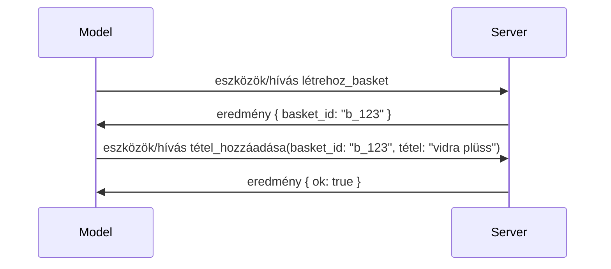

# Mi változik az MCP-ben: a 2026-07-28-as kiadásjelölt

> **Állapot:** Kiadásjelölt. A `2026-07-28` specifikáció még nem végleges a szerkesztés idején. 2026. május 21-én jelentették be, és 2026. július 28-án kerül bevezetésre. Minden ebben a leckében szereplő információ a kiadásjelöltet írja le; az építés előtt ellenőrizze a [vázlatos specifikációt](https://modelcontextprotocol.io/specification/draft) és annak [változásnaplóját](https://modelcontextprotocol.io/specification/draft/changelog) a legfrissebb állapotért. A tananyag többi része a jelenlegi stabil kiadásra, a **MCP Specification 2025-11-25**-re épül, és frissül majd, amikor a `2026-07-28` megjelenik.

## Áttekintés

A `2026-07-28` az MCP legnagyobb átdolgozása az indulása óta. Hat Specification Enhancement Proposal (SEP) eltávolítja a protokolszintű munkameneteket, így az MCP állapotmentessé válik az átvitel szintjén, a bővítmények elsőrendű, verziózott mechanizmussá válnak, és több, korábban tanult funkció (Roots, Sampling, Logging) elavultként van jelölve egy új életciklus-politika keretében. Ez a lecke összefoglalja, mi változik, miért fontos, és mit jelent ez a már a `2025-11-25`-re írt kódod számára.

Forrás: [The 2026-07-28 MCP Specification Release Candidate](https://blog.modelcontextprotocol.io/posts/2026-07-28-release-candidate/) (Model Context Protocol Blog, David Soria Parra és Den Delimarsky).

## Tanulási célok

A lecke végére képes leszel:

- Megmagyarázni, miért vált MCP stateless protokolllá, és milyen problémát old meg ez a horizontálisan skálázott telepítéseknél.
- Leírni, hogyan helyettesítik az `initialize`/`initialized` kézfogás és az `Mcp-Session-Id` fejlécet.
- Azonosítani az új `Mcp-Method` és `Mcp-Name` fejléceket, valamint a `ttlMs`/`cacheScope` cache metaadatokat.
- Felismerni a Extensions keretrendszert és a kiadással együtt érkező két bővítményt: MCP Apps és Tasks.
- Felsorolni a hat jogosultságkezelési SEP-et, amelyek szigorítják az OAuth 2.0 / OIDC összhangot.
- Megállapítani, mely alapkód funkciók (Roots, Sampling, Logging) váltak elavulttá, és mit jelent ez a gyakorlatban.
- Elmagyarázni a Full JSON Schema 2020-12 változást az eszközök `inputSchema`/`outputSchema` esetén.

## Állapotmentes protokoll

A fő változás: az MCP állapotmentessé válik a protokolszinten.

### Előtte (2025-11-25): a munkamenetek egy szerverpéldányhoz kötnek

Egy eszköz hívása Streamable HTTP-n az `initialize` kézfogással kezdődik. A szerver válaszol egy `Mcp-Session-Id` fejlécet, amelyet minden további kérésnek tartalmaznia kell:

```http
POST /mcp HTTP/1.1
Mcp-Session-Id: 1868a90c-3a3f-4f5b
Content-Type: application/json

{"jsonrpc":"2.0","id":2,"method":"tools/call",
 "params":{"name":"search","arguments":{"q":"otters"}}}
```

Mivel a munkamenet ahhoz a szerverpéldányhoz kötött, amely azt kibocsátotta, a horizontálisan skálázott telepítések **ragadós útvonalválasztást** igényelnek a terheléselosztónál és **megosztott munkamenettárolót** a példányok között.

### Utána (2026-07-28): minden kérés önálló

```http
POST /mcp HTTP/1.1
MCP-Protocol-Version: 2026-07-28
Mcp-Method: tools/call
Mcp-Name: search
Content-Type: application/json

{"jsonrpc":"2.0","id":1,"method":"tools/call",
 "params":{"name":"search","arguments":{"q":"otters"},
           "_meta":{"io.modelcontextprotocol/clientInfo":{"name":"my-app","version":"1.0"}}}}
```

Bármely szerverpéldány kezelheti ezt a kérést. Fontos változások:

- **Az `initialize`/`initialized` kézfogás eltávolításra került** ([SEP-2575](https://github.com/modelcontextprotocol/modelcontextprotocol/pull/2575)). A protokoll verzió, kliensinformációk és képességek minden kérés `_meta` részébe kerülnek. Az új `server/discover` metódus lehetővé teszi, hogy a kliens előzetesen lekérje a szerver képességeit, amikor szüksége van rájuk.
- **Az `Mcp-Session-Id` fejléc és a protokolszintű munkamenet eltávolításra került** ([SEP-2567](https://github.com/modelcontextprotocol/modelcontextprotocol/pull/2567)). A ragadós útvonalválasztás és a megosztott munkamenettárolók már nem szükségesek a protokolszinten.

### Állapotmentes protokoll, állapotful alkalmazások

A protokolszintű munkamenet eltávolítása nem jelenti azt, hogy a szervered ne lehetne állapotful. Az ajánlott minta ugyanaz, amit a HTTP API-k mindig használtak: generálj egy explicit azonosítót (például `basket_id`, `browser_id`) egy eszközhívásból, és a modell ezt az azonosítót adja vissza mint normál argumentum a későbbi hívásoknál.



Ez átláthatóvá és értelmezhetővé teszi az állapotot a modell számára, ahelyett hogy az átvitel metaadataiban rejtené el, és lehetővé teszi, hogy bármely szerverpéldány bármilyen hívást kezeljen.

### Szerver-kliens kérés, átalakítva

Az állapotmentes protokollnak még mindig szüksége van egy módra, hogy a szerver közben (például egy kérdezés közben) kérjen valamit a klienstől (például egy válaszadási promptot):

- **A szerver által kezdeményezett kérések csak akkor indíthatók, amikor a szerver aktívan feldolgoz egy klienskérést** ([SEP-2260](https://github.com/modelcontextprotocol/modelcontextprotocol/pull/2260)) — korábban csak ajánlás, most kötelező. A felhasználó sosem kap váratlan promptot.
- **Többrészes kérések (Multi Round-Trip Requests)** ([SEP-2322](https://github.com/modelcontextprotocol/modelcontextprotocol/pull/2322)) helyettesítik az SSE stream nyitva tartását. Ehelyett a szerver `InputRequiredResult`-et ad vissza:

  ```json
  {
    "resultType": "inputRequired",
    "inputRequests": {
      "confirm": {
        "type": "elicitation",
        "message": "Delete 3 files?",
        "schema": { "type": "boolean" }
      }
    },
    "requestState": "eyJzdGVwIjoxLCJmaWxlcyI6WyJhIiwiYiIsImMiXX0="
  }
  ```

  A kliens összegyűjti a válaszokat, majd újraindítja az eredeti hívást az `inputResponses` és az visszhangzott `requestState` paraméterekkel. Bármely szerverpéldány vállalhatja az újrapróbálkozást, mert minden szükséges adat a terhelésben van.

### Útvonalválasztható, cache-elhető, nyomon követhető

Három kisebb változtatás könnyíti meg az állapotmentes forgalom üzemeltetését:

- **`Mcp-Method` és `Mcp-Name` fejlécek kötelezőek a Streamable HTTP-n** ([SEP-2243](https://github.com/modelcontextprotocol/modelcontextprotocol/pull/2243)), hogy a terheléselosztók, átjárók és sebességkorlátozók a művelet alapján irányíthassanak a JSON test átvizsgálása nélkül. A szerverek elutasítják azokat a kéréseket, ahol a fejlécek és a test nem egyezik.
- **`tools/list` és az erőforrás olvasási eredmények `ttlMs` és `cacheScope` metaadatot visznek** ([SEP-2549](https://github.com/modelcontextprotocol/modelcontextprotocol/pull/2549)), az HTTP `Cache-Control` mintájára. A kliensek tudják, meddig friss egy lista eredmény, és biztonságos-e megosztani a felhasználók között anélkül, hogy hosszú életű SSE streamre lenne szükség a változások nyomon követéséhez.
- **Dokumentált a W3C Trace Context propagáció az `_meta`-ban** ([SEP-414](https://github.com/modelcontextprotocol/modelcontextprotocol/pull/414)), javítva a `traceparent`, `tracestate` és `baggage` kulcsneveket, hogy a disztribút trace követni tudja a hívást a kliens SDK, az MCP szerver és a downstream rendszerek között egy [OpenTelemetry](https://opentelemetry.io/) kompatibilis háttérben.

## A bővítmények elsőrendűsége

A bővítmények  informálisan jelen voltak a `2025-11-25` verzióban. A [SEP-2133](https://github.com/modelcontextprotocol/modelcontextprotocol/pull/2133) formalizálja őket:

- A bővítményeket fordított DNS azonosítókkal jelölik.
- Ezek kliens- és szerverképességek `extensions` térképen keresztül kerülnek tárgyalásra.
- Saját, `ext-*` repositoryban laknak, hozzárendelt karbantartókkal és független verziózással a mag specifikációtól.
- Egy új Extensions Track az SEP folyamatban lehetővé teszi számukra, hogy az experimentális szintről hivatalos funkcióvá váljanak.

Ez a kiadás két hivatalos bővítményt szállít.

### MCP Apps: szerver által renderelt felhasználói felületek

Az [MCP Apps](https://blog.modelcontextprotocol.io/posts/2026-01-26-mcp-apps/) ([SEP-1865](https://github.com/modelcontextprotocol/modelcontextprotocol/pull/1865)) lehetővé teszi a szerverek számára, hogy interaktív HTML felületeket küldjenek, amelyeket a hostok sandboxolt iframe-ben renderelnek. Az eszközök előre deklarálják felhasználói felület sablonjaikat, így a hostok előtölthetik, cache-elhetik és biztonsági szempontból áttekinthetik őket, mielőtt bármi futna. Ezt már részletesen tárgyaltad a [15. lecke: MCP Apps](../03-GettingStarted/15-mcp-apps/README.md) anyagban — az Extensions keretrendszer alatt az MCP Apps most formálisan egy bővítmény, nem pedig kísérleti mag funkció.

### A Tasks bővítménnyé válik

A Tasks kísérleti mag funkcióként debütált a `2025-11-25` verzióban. A termelési használat olyan átdolgozást hozott, hogy a legjobb helye egy bővítmény: a [Tasks bővítmény](https://github.com/modelcontextprotocol/modelcontextprotocol/pull/2663) az állapotmentes modell köré szervezi az életciklust — a szerver a `tools/call`-ra válaszul adhat feladatkezelőt, a kliens pedig `tasks/get`, `tasks/update` és `tasks/cancel` hívásokkal vezeti azt. A feladat létrehozását a szerver kezeli: a kliens meghirdeti a bővítményt, és a szerver dönt arról, hogy mikor használjon hívást feladatként. A `tasks/list` teljes egészében eltávolításra került, mert biztonságosan nem lehet keretek közé szorítani munkamenetek nélkül.

> **Migrációs megjegyzés:** Ha implementáltad a kísérleti `2025-11-25` Tasks API-t, át kell térned az új bővítmény életciklusra — nem kompatibilis visszafelé.

## Jogosultságkezelés megerősítése

Hat SEP szigorítja az [engedélyezési specifikációt](https://modelcontextprotocol.io/specification/draft/basic/authorization) az OAuth 2.0 / OpenID Connect valós telepítésekhez való jobb igazodás érdekében:

| SEP | Változás |
|---|---|
| [SEP-2468](https://github.com/modelcontextprotocol/modelcontextprotocol/pull/2468) | A klienseknek ellenőrizniük kell az `iss` paramétert az engedélyezési válaszokon az [RFC 9207](https://www.rfc-editor.org/rfc/rfc9207) szerint, így csökkentik az MCP egyklienses, sokszerveres mintára jellemző összekeverési támadásokat. Egy későbbi verzió elvárja majd az `iss` nélküli válaszok elutasítását. |
| [SEP-837](https://github.com/modelcontextprotocol/modelcontextprotocol/pull/837) | A kliensek dinamikus regisztráció alatt megadják OpenID Connect-ben az `application_type`-ot, így a jogosultságkezelő szerverek nem állítanak be alapértelmezetten asztali/CLI kliensnek `"web"` típust és nem utasítják el a localhost redirect URI-t. |
| [SEP-2352](https://github.com/modelcontextprotocol/modelcontextprotocol/pull/2352) | A kliensek kötnek regisztrált azonosítókat az engedélyező szerver `issuer`-éhez, és újraregisztrálnak, ha egy erőforrás engedélyező szerver között vándorol. |
| [SEP-2207](https://github.com/modelcontextprotocol/modelcontextprotocol/pull/2207) | Dokumentálja, hogyan kérjenek frissítő tokeneket OpenID Connect típusú engedélyezési szerverektől. |
| [SEP-2350](https://github.com/modelcontextprotocol/modelcontextprotocol/pull/2350) | Tisztázza a lépcsőzetes (step-up) engedélyezési jogosultságnövelés során bekövetkező jogosultságok összevonását. |
| [SEP-2351](https://github.com/modelcontextprotocol/modelcontextprotocol/pull/2351) | Tisztázza a `.well-known` felfedezési suffix-et. |

Ha ma engedélyező szervert fejlesztesz MCP-hez, már most kezd el szolgáltatni az `iss` paramétert az engedélyezési válaszokon — lásd a jelenlegi engedélyezési útmutatót a [02-Security](../02-Security/README.md) tananyagban.

## A Roots, Sampling és Logging elavult

Az új [funkció életciklus politika](https://github.com/modelcontextprotocol/modelcontextprotocol/pull/2577) ([SEP-2577](https://github.com/modelcontextprotocol/modelcontextprotocol/pull/2577)) értelmében három alapkliens primitív, amiket a [Core Concepts](./README.md#roots) leckében tanultál, **elavult** státuszba kerül:

| Funkció | Ajánlott helyettesítő |
|---|---|
| Roots | Eszközparaméterek, erőforrás URI-k vagy szerverkonfiguráció |
| Sampling | Közvetlen integráció LLM szolgáltató API-kkal |
| Logging | `stderr` a stdio átvitelnél; OpenTelemetry a strukturált megfigyelhetőséghez |

Ezek **csak annotációs elavult jelzések**: a metódusok, típusok és képességflagok ebben a kiadásban és az azt követő egy éven belül kiadott specifikáció verziókban még működnek. Bármi eltávolítása külön SEP-et igényel az életciklus politika szerint — azaz a jelenlegi [Sampling](../03-GettingStarted/14-sampling/README.md) példák még nem törnek, de az új szerverek jobban teszik, ha az ajánlott mintákat követik.

## Full JSON Schema 2020-12 az eszközökhöz

Az eszközök `inputSchema` és `outputSchema` átlépnek a teljes [JSON Schema 2020-12](https://json-schema.org/draft/2020-12) szabványra ([SEP-2106](https://github.com/modelcontextprotocol/modelcontextprotocol/pull/2106)):

- A bemeneti sémák megtartják a `type: "object"` gyökérfeltételt, de most már engedélyezik a kompozíciót (`oneOf`, `anyOf`, `allOf`), feltételes elemeket és hivatkozásokat (`$ref`, `$defs`).
- A kimeneti sémák korlátozás nélküliek, és a `structuredContent` bármilyen JSON érték lehet, nem csak objektum.
- A megvalósítások nem dereferálhatnak automatikusan külső `$ref` URI-kat, és érdemes korlátozni a séma mélységét és validációs idejét (ez egy szolgáltatásmegtagadásra alkalmas támadási forma, amit figyelembe kell venni, ha a szerveren validálsz).

Különösen a hiányzó erőforrás hibakódja változik a MCP egyedi `-32002`-ről a JSON-RPC szabványos `-32602` (Érvénytelen paraméterek) kódra ([SEP-2164](https://github.com/modelcontextprotocol/modelcontextprotocol/pull/2164)). Ha a kliensed ennek az értéknek az alapján működik, frissítened kell.

## Hogyan fejlődik tovább a protokoll?

Ez a kiadás törő változásokat tartalmaz, amiket az MCP fenntartói nem terveznek rendszeressé tenni a jövőben. Három kormányzati SEP-vel igyekeznek ezt megelőzni:

- A **funkció életciklus politika** minden funkciónak aktív → elavult → eltávolított állapotú utat ad legalább tizenkét hónap eltéréssel az elavult és az eltávolítási lépés között.
- Az **Extensions keretrendszer** lehetővé teszi, hogy új képességek opcionális bővítményként jelenjenek meg, és stabilizálódjanak ott, mielőtt (ha valaha) mag specifikációvá válnának.

- Egy Standards Track SEP már nem érheti el a Végleges státuszt, amíg egy hozzá illeszkedő forgatókönyv nem kerül be a [konformitási csomagba](https://github.com/modelcontextprotocol/conformance) ([SEP-2484](https://github.com/modelcontextprotocol/modelcontextprotocol/pull/2484)) — ugyanabba a csomagba, amelyet a [SDK szint rendszer](https://github.com/modelcontextprotocol/modelcontextprotocol/pull/1777) használ az hivatalos SDK-k értékelésére.

## Kiadási ütemterv és érvényesítés

- A kiadásra jelölt verziót 2026. május 21-én rögzítették.
- A végleges specifikáció megjelenése 2026. július 28-ra van ütemezve.
- A két dátum közti tízhetes időablak lehetőséget ad az SDK karbantartóknak és a kliens megvalósítóknak, hogy valós terhelések alapján validálják a változásokat; az 1. szintű SDK-k várhatóan ebben az időablakban támogatást fognak szállítani az [SDK szint rendszer](https://modelcontextprotocol.io/docs/sdk) szerint.
- Kövesd nyomon a teljes változáskészletet a [tervezet specifikációban](https://modelcontextprotocol.io/specification/draft) és annak [változásnaplójában](https://modelcontextprotocol.io/specification/draft/changelog).

## Mit jelent ez a tananyag számára

Minden, amit eddig ebben a kurzusban megtanultál, a **2025-11-25**-i állapotot célozza, amely a jelenlegi stabil specifikáció marad egészen a `2026-07-28`-i kiadásig. Konkrétan:

- **A munkamenetek és az `initialize` kézfogás** (amely a [Core Concepts](./README.md) és a [6. lecke: HTTP streaming](../03-GettingStarted/06-http-streaming/README.md) anyagában szerepel) továbbra is a ma dokumentált módon működik, de számíts rá, hogy lecserélik őket a fentebb vázolt állapot nélküli kérésmodellre, amint `2026-07-28`-kompatibilis SDK-kra frissítesz.
- **A mintavételezés és a gyökerek** (szintén a [Core Concepts](./README.md) részben) teljes mértékben működnek, de elavultak — az új terveknek az itt felsorolt cseremintákat kell előnyben részesíteniük.
- **A kísérleti Tasks funkció**, ha használtad, át kell állítani a Tasks kiterjesztés új életciklusára.
- **MCP alkalmazások** ([15. lecke](../03-GettingStarted/15-mcp-apps/README.md)) a gyakorlatban változatlanok; csupán az hivatalos Kiterjesztések keretrendszer alá kerülnek.

## További források

- [2026-07-28 MCP Specifikáció Kiadási Jelölt (blogbejegyzés)](https://blog.modelcontextprotocol.io/posts/2026-07-28-release-candidate/)
- [Az MCP szállítások jövője](https://blog.modelcontextprotocol.io/posts/2025-12-19-mcp-transport-future/)
- [MCP Tervezet Specifikáció](https://modelcontextprotocol.io/specification/draft)
- [MCP Tervezet Változásnapló](https://modelcontextprotocol.io/specification/draft/changelog)
- [SEP Útmutatók](https://modelcontextprotocol.io/community/sep-guidelines)
- [MCP SDK Szint Rendszer](https://modelcontextprotocol.io/docs/sdk)

## Következő lépések

Menj vissza a [Core Concepts](./README.md) oldalra vagy folytasd a [Security](../02-Security/README.md) témakörrel, hogy megtudd, miként illeszkedik a mai `2025-11-25`-i útmutatás a közelgő változásokhoz.

---

<!-- CO-OP TRANSLATOR DISCLAIMER START -->
**Jogi nyilatkozat**:
Ez a dokumentum az AI fordítási szolgáltatás, a [Co-op Translator](https://github.com/Azure/co-op-translator) segítségével készült. Bár az pontosságra törekszünk, kérjük, vegye figyelembe, hogy az automatikus fordítások hibákat vagy pontatlanságokat tartalmazhatnak. Az eredeti dokumentum az anyanyelvén tekintendő hiteles forrásnak. Fontos információk esetén professzionális emberi fordítást javasolunk. Nem vállalunk felelősséget semmilyen félreértésért vagy téves értelmezésért, amely ebből a fordításból ered.
<!-- CO-OP TRANSLATOR DISCLAIMER END -->