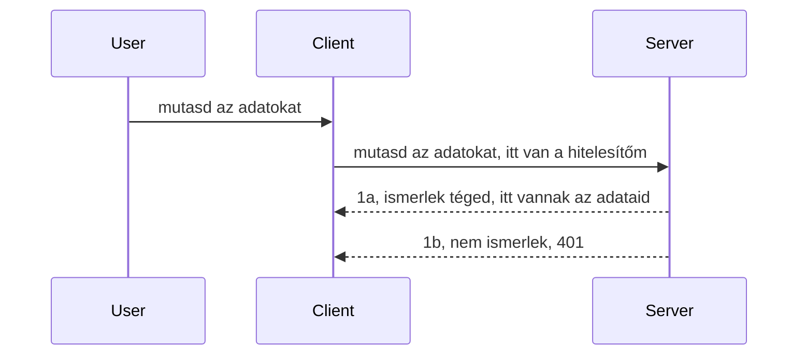

# Egyszerű hitelesítés

Az MCP SDK-k támogatják az OAuth 2.1 használatát, ami őszintén szólva eléggé összetett folyamat, amely olyan fogalmakat foglal magában, mint hitelesítési szerver, erőforrás-szerver, hitelesítő adatok elküldése, kód megszerzése, a kód cseréje hordozó tokenre, amíg végül hozzáférhetünk az erőforrás-adatainkhoz. Ha nem vagyunk hozzászokva az OAuth használatához, ami egy nagyszerű dolog, érdemes valamilyen alapvető hitelesítéssel kezdeni, és fokozatosan építeni egyre jobb biztonság felé. Ezért létezik ez a fejezet, hogy segítsen egy fejlettebb hitelesítés felé haladni.

## Hitelesítés, mit is értünk ezen?

A hitelesítés az authentikáció és a jogosultság-ellenőrzés rövidítése. Az a gondolat, hogy két dolgot kell tennünk:

- **Authentikáció**, ami annak a kiderítése, hogy beengedjük-e egy embert a házunkba, jogosult-e "itt" lenni, azaz hogy hozzáférése van-e az erőforrás-szerverünkhöz, ahol az MCP szerver funkciói találhatók.
- **Jogosultság-ellenőrzés**, az a folyamat, amely megállapítja, hogy egy felhasználónak van-e hozzáférése a konkrét erőforrásokhoz, amiket kér, például ezekhez a megrendelésekhez vagy termékekhez, vagy hogy olvashatja-e a tartalmat, de például nem törölheti azt.

## Hitelesítő adatok: hogyan mondjuk meg a rendszernek, kik vagyunk

Nos, a legtöbb webfejlesztő úgy gondol a hitelesítésre, hogy egy hitelesítő adatot kell szolgáltatnia a szervernek, általában egy titkot, ami megmondja, hogy jogosult-e "itt" lenni - azaz hitelesítés. Ez a hitelesítő adat általában egy base64 kódolt felhasználónév és jelszó, vagy egy API kulcs, amely egyedi módon azonosít egy adott felhasználót.

Ez azt jelenti, hogy ezt egy "Authorization" nevű fejlécen keresztül küldjük el így:

```json
{ "Authorization": "secret123" }
```

Ezt általában alapvető hitelesítésnek (basic authentication) nevezik. Az egész folyamat működése a következő:



Most, hogy megértettük a folyamatot, hogyan valósítjuk ezt meg? Nos, a legtöbb webszerver rendelkezik egy middleware nevű fogalommal, egy kódrészlettel, ami a kérés részeként fut, képes ellenőrizni a hitelesítő adatokat, és ha azok érvényesek, engedi a kérés továbblépését. Ha a kérés nem rendelkezik érvényes hitelesítő adatokkal, akkor hitelesítési hibát kapunk. Nézzük meg, hogyan lehet ezt megvalósítani:

**Python**

```python
class AuthMiddleware(BaseHTTPMiddleware):
    async def dispatch(self, request, call_next):

        has_header = request.headers.get("Authorization")
        if not has_header:
            print("-> Missing Authorization header!")
            return Response(status_code=401, content="Unauthorized")

        if not valid_token(has_header):
            print("-> Invalid token!")
            return Response(status_code=403, content="Forbidden")

        print("Valid token, proceeding...")
       
        response = await call_next(request)
        # adj hozzá bármilyen ügyfél fejlécet vagy módosíts valahogy a választ
        return response


starlette_app.add_middleware(CustomHeaderMiddleware)
```

Itt létrehoztunk:

- Egy middleware komponenst `AuthMiddleware` néven, melynek `dispatch` metódusát a webszerver hívja meg.
- Hozzáadtuk ezt a middleware-t a webszerverhez:

    ```python
    starlette_app.add_middleware(AuthMiddleware)
    ```

- Írtunk egy érvényesítési logikát, ami ellenőrzi, hogy az Authorization fejléc jelen van-e és hogy a küldött titok érvényes-e:

    ```python
    has_header = request.headers.get("Authorization")
    if not has_header:
        print("-> Missing Authorization header!")
        return Response(status_code=401, content="Unauthorized")

    if not valid_token(has_header):
        print("-> Invalid token!")
        return Response(status_code=403, content="Forbidden")
    ```

Ha a titok jelen van és érvényes, akkor meghívjuk a `call_next` metódust, hogy a kérés továbbhaladjon, és visszaadjuk a választ.

    ```python
    response = await call_next(request)
    # adj hozzá bármilyen egyedi fejlécet vagy módosíts valamit a válaszban
    return response
    ```

A működés lényege, hogy ha webes kérelem érkezik a szerver felé, a middleware végre lesz hajtva, és annak implementációja szerint vagy engedi tovább a kérelmet, vagy hibát ad vissza, jelezve, hogy a kliens nem folytathatja.

**TypeScript**

Itt egy middleware-t hozunk létre a népszerű Express keretrendszerrel, amely elkapja a kérést, mielőtt az MCP szerverhez jutna. Íme a kód:

```typescript
function isValid(secret) {
    return secret === "secret123";
}

app.use((req, res, next) => {
    // 1. Az Authorization fejléc jelen van?
    if(!req.headers["Authorization"]) {
        res.status(401).send('Unauthorized');
    }
    
    let token = req.headers["Authorization"];

    // 2. Ellenőrizze az érvényességet.
    if(!isValid(token)) {
        res.status(403).send('Forbidden');
    }

   
    console.log('Middleware executed');
    // 3. Továbbadja a kérést a kérés feldolgozási lépésének következő részére.
    next();
});
```

Ebben a kódban:

1. Ellenőrizzük, hogy az Authorization fejléc jelen van-e; ha nem, 401-es hibát küldünk.
2. Biztosítjuk, hogy a hitelesítő adat/token érvényes legyen; ha nem, 403-as hibát küldünk.
3. Végül továbbengedjük a kérést a kérelmi csővezetéken, és visszaadjuk a kért erőforrást.

## Gyakorlat: Hitelesítés megvalósítása

Vegyük az eddigi tudásunkat, és próbáljuk megvalósítani. Íme a terv:

Szerver

- Hozzunk létre egy webszervert és MCP példányt.
- Valósítsunk meg egy middleware-t a szerverhez.

Kliens

- Küldjünk webes kérelmet hitelesítő adatokkal, fejlécen keresztül.

### -1- Webszerver és MCP példány létrehozása

> **Előretekintés:** az alábbi TypeScript példa HTTP átviteleket követ egy `transports` térképen, amelynek kulcsa `mcp-session-id`, az **MCP Specification 2025-11-25** szerint. A `2026-07-28` kiadás jelölt eltávolítja az `initialize` kézfogást és a munkamenet azonosítót, ezért ez a munkamenetek szerinti átvitel térkép megszűnik és helyette állapotmentes, önálló kérések lesznek. Lásd: [Mi változik az MCP-ben: A 2026-07-28 kiadás jelölt](../../01-CoreConcepts/mcp-2026-07-28-release-candidate.md).

Az első lépésként létre kell hoznunk a webszerver példányt és az MCP szervert.

**Python**

Itt létrehozzuk az MCP szerver példányt, létrehozunk egy starlette webalkalmazást, és uvicorn-nal hosztoljuk.

```python
# MCP szerver létrehozása

app = FastMCP(
    name="MCP Resource Server",
    instructions="Resource Server that validates tokens via Authorization Server introspection",
    host=settings["host"],
    port=settings["port"],
    debug=True
)

# starlette webalkalmazás létrehozása
starlette_app = app.streamable_http_app()

# alkalmazás szolgáltatása uvicorn-on keresztül
async def run(starlette_app):
    import uvicorn
    config = uvicorn.Config(
            starlette_app,
            host=app.settings.host,
            port=app.settings.port,
            log_level=app.settings.log_level.lower(),
        )
    server = uvicorn.Server(config)
    await server.serve()

run(starlette_app)
```

Ebben a kódban:

- Létrehozzuk az MCP szervert.
- Felépítjük a starlette webalkalmazást az MCP szerverből, `app.streamable_http_app()`.
- Hosztoljuk és szervereljük a webalkalmazást uvicorn-nal `server.serve()`.

**TypeScript**

Itt létrehozunk egy MCP szerver példányt.

```typescript
const server = new McpServer({
      name: "example-server",
      version: "1.0.0"
    });

    // ... szerver erőforrások, eszközök és promptok beállítása ...
```

Ennek az MCP szerver létrehozásnak a POST /mcp útvonalegyüttesen belül kell történnie, így az előző kódot áthelyezzük így:

```typescript
import express from "express";
import { randomUUID } from "node:crypto";
import { McpServer } from "@modelcontextprotocol/sdk/server/mcp.js";
import { StreamableHTTPServerTransport } from "@modelcontextprotocol/sdk/server/streamableHttp.js";
import { isInitializeRequest } from "@modelcontextprotocol/sdk/types.js"

const app = express();
app.use(express.json());

// Térkép a szállítások tárolására munkamenet azonosító szerint
const transports: { [sessionId: string]: StreamableHTTPServerTransport } = {};

// POST kérések kezelése kliens-szerver kommunikációhoz
app.post('/mcp', async (req, res) => {
  // Ellenőrizze a meglévő munkamenet azonosítót
  const sessionId = req.headers['mcp-session-id'] as string | undefined;
  let transport: StreamableHTTPServerTransport;

  if (sessionId && transports[sessionId]) {
    // Létező szállítás újrafelhasználása
    transport = transports[sessionId];
  } else if (!sessionId && isInitializeRequest(req.body)) {
    // Új inicializációs kérés
    transport = new StreamableHTTPServerTransport({
      sessionIdGenerator: () => randomUUID(),
      onsessioninitialized: (sessionId) => {
        // Szállítás tárolása munkamenet azonosító szerint
        transports[sessionId] = transport;
      },
      // A DNS újracímzés elleni védelem alapértelmezés szerint ki van kapcsolva a visszamenőleges kompatibilitás érdekében. Ha helyben futtatja ezt a szervert
      // győződjön meg róla, hogy beállította:
      // enableDnsRebindingProtection: true,
      // allowedHosts: ['127.0.0.1'],
    });

    // Szállítás takarítása bezáráskor
    transport.onclose = () => {
      if (transport.sessionId) {
        delete transports[transport.sessionId];
      }
    };
    const server = new McpServer({
      name: "example-server",
      version: "1.0.0"
    });

    // ... szerver erőforrások, eszközök és felhívások beállítása ...

    // Kapcsolódás az MCP szerverhez
    await server.connect(transport);
  } else {
    // Érvénytelen kérés
    res.status(400).json({
      jsonrpc: '2.0',
      error: {
        code: -32000,
        message: 'Bad Request: No valid session ID provided',
      },
      id: null,
    });
    return;
  }

  // Kérés kezelése
  await transport.handleRequest(req, res, req.body);
});

// Újrahasználható kezelő GET és DELETE kérésekhez
const handleSessionRequest = async (req: express.Request, res: express.Response) => {
  const sessionId = req.headers['mcp-session-id'] as string | undefined;
  if (!sessionId || !transports[sessionId]) {
    res.status(400).send('Invalid or missing session ID');
    return;
  }
  
  const transport = transports[sessionId];
  await transport.handleRequest(req, res);
};

// GET kérések kezelése szerver-kliens értesítésekhez SSE-n keresztül
app.get('/mcp', handleSessionRequest);

// DELETE kérések kezelése munkamenet megszüntetéséhez
app.delete('/mcp', handleSessionRequest);

app.listen(3000);
```

Most látjuk, hogy az MCP szerver létrehozása átkerült az `app.post("/mcp")` részbe.

Térjünk rá a következő lépésre, hogy létrehozzuk a middleware-t, amely ellenőrzi a bejövő hitelesítő adatokat.

### -2- Middleware implementálása a szerverhez

Nézzük a middleware részt. Itt olyan middleware-t hozunk létre, amely keresi a hitelesítő adatot az `Authorization` fejlécben és ellenőrzi azt. Ha elfogadható, akkor a kérés továbbléphet, és végrehajtja azt, amire szüksége van (pl. eszközök listázása, erőforrás olvasása vagy bármely MCP funkció, amit a kliens kért).

**Python**

A middleware létrehozásához egy olyan osztályt kell létrehozni, amely a `BaseHTTPMiddleware`-ből származik. Két fontos elem van:

- A kérés (`request`), amelynek fejléc adatait olvassuk.
- `call_next`, a visszahívás, amelyet akkor hívunk meg, ha a kliens bemutatott egy elfogadott hitelesítő adatot.

Először kezelni kell az esetet, ha az `Authorization` fejléc hiányzik:

```python
has_header = request.headers.get("Authorization")

# nincs fejléc, 401-el hibára fut, különben folytatódik.
if not has_header:
    print("-> Missing Authorization header!")
    return Response(status_code=401, content="Unauthorized")
```

Itt egy 401-es "unauthorized" üzenetet küldünk, mert a kliens nem valósította meg a hitelesítést.

Ezután, ha megadtak hitelesítő adatot, ellenőrizni kell annak érvényességét így:

```python
 if not valid_token(has_header):
    print("-> Invalid token!")
    return Response(status_code=403, content="Forbidden")
```

Észrevehető, hogy itt 403-as "forbidden" üzenetet küldünk. Nézzük a teljes middleware-t alább, amely mindent megvalósít, amit eddig említettünk:

```python
class AuthMiddleware(BaseHTTPMiddleware):
    async def dispatch(self, request, call_next):

        has_header = request.headers.get("Authorization")
        if not has_header:
            print("-> Missing Authorization header!")
            return Response(status_code=401, content="Unauthorized")

        if not valid_token(has_header):
            print("-> Invalid token!")
            return Response(status_code=403, content="Forbidden")

        print("Valid token, proceeding...")
        print(f"-> Received {request.method} {request.url}")
        response = await call_next(request)
        response.headers['Custom'] = 'Example'
        return response

```

Nagyszerű, de mi a helyzet a `valid_token` függvénnyel? Íme alább:

```python
# NE használd éles környezetben - fejleszd tovább !!
def valid_token(token: str) -> bool:
    # távolítsd el a "Bearer " előtagot
    if token.startswith("Bearer "):
        token = token[7:]
        return token == "secret-token"
    return False
```

Ez nyilvánvalóan fejlesztésre szorul.

FONTOS: SOHA nem szabad ilyen titkokat kódban tárolni. Ideális esetben az összehasonlításra használt értéket valamilyen adatforrásból vagy egy IDP-től (azonosító szolgáltató) kell lekérni, vagy még jobb, ha maga az IDP végzi az érvényesítést.

**TypeScript**

Az Express esetében a `use` metódust kell hívni, amely middleware függvényeket fogad.

Nekünk kell:

- A kérés objektummal interakciózni, hogy ellenőrizzük az `Authorization` tulajdonságban átadott hitelesítő adatot.
- Érvényesíteni a hitelesítő adatot, és ha elfogadható, akkor engedni a kérés továbblépését, és végrehajtani, amit a kliens MCP kérése igényel (például eszközök listázása, erőforrás olvasása vagy egyéb MCP-hez kapcsolódó dolgok).

Itt ellenőrizzük, hogy az `Authorization` fejléc jelen van-e, ha nem, a kérést leállítjuk:

```typescript
if(!req.headers["authorization"]) {
    res.status(401).send('Unauthorized');
    return;
}
```

Ha a fejléc nincs elküldve, 401-et kapunk.

Ezután megvizsgáljuk, hogy az hitelesítő adat érvényes-e, ha nem, akkor ismét leállítjuk a kérést, de más üzenettel:

```typescript
if(!isValid(token)) {
    res.status(403).send('Forbidden');
    return;
} 
```

Itt az látszik, hogy most 403-as hibát kapunk.

Íme a teljes kód:

```typescript
app.use((req, res, next) => {
    console.log('Request received:', req.method, req.url, req.headers);
    console.log('Headers:', req.headers["authorization"]);
    if(!req.headers["authorization"]) {
        res.status(401).send('Unauthorized');
        return;
    }
    
    let token = req.headers["authorization"];

    if(!isValid(token)) {
        res.status(403).send('Forbidden');
        return;
    }  

    console.log('Middleware executed');
    next();
});
```

A webszervert úgy állítottuk be, hogy middleware-t fogadjon, amely ellenőrzi a kliens által remélhetőleg elküldött hitelesítő adatokat. Mi a helyzet a klienssel magával?

### -3- Webes kérés elküldése hitelesítő adattal a fejlécben

Biztosítani kell, hogy a kliens a hitelesítő adatot a fejlécen keresztül továbbítsa. Mivel MCP klienst fogunk használni, ki kell találni, hogyan történik ez.

**Python**

A klienshez egy fejlécet kell átadnunk a hitelesítő adatunkkal így:

```python
# NE keménykódolja az értéket, legalább környezeti változóban vagy biztonságosabb tárolóban legyen
token = "secret-token"

async with streamablehttp_client(
        url = f"http://localhost:{port}/mcp",
        headers = {"Authorization": f"Bearer {token}"}
    ) as (
        read_stream,
        write_stream,
        session_callback,
    ):
        async with ClientSession(
            read_stream,
            write_stream
        ) as session:
            await session.initialize()
      
            # TODO, amit a kliensben el akarsz végezni, pl. eszközök listázása, eszközök meghívása stb.
```

Megfigyelhető, hogy a `headers` tulajdonságot így töltjük fel: ` headers = {"Authorization": f"Bearer {token}"}`.

**TypeScript**

Ezt két lépésben oldhatjuk meg:

1. Kitöltünk egy konfigurációs objektumot a hitelesítő adatunkkal.
2. Átadjuk a konfigurációs objektumot az átvitelhez.

```typescript

// NE kódolj be itt látható módon értéket. Legalább legyen környezeti változóként kezelve, és használj valami olyasmit, mint a dotenv (fejlesztési módban).
let token = "secret123"

// definiálj egy kliens transzport opció objektumot
let options: StreamableHTTPClientTransportOptions = {
  sessionId: sessionId,
  requestInit: {
    headers: {
      "Authorization": "secret123"
    }
  }
};

// add át az opciók objektumot a transzportnak
async function main() {
   const transport = new StreamableHTTPClientTransport(
      new URL(serverUrl),
      options
   );
```

Az előző példán látható, hogy létrehoztunk egy `options` objektumot és ebbe helyeztük a `headers` tulajdonságot a `requestInit` alatt.

FONTOS: Hogyan javíthatjuk ezt tovább? Nos, a jelenlegi megvalósításnak vannak problémái. Először is, ha így adunk át hitelesítő adatot, az elég kockázatos, hacsak nincs HTTPS legalább. Még akkor is, a hitelesítő adat ellopható, ezért szükséges egy olyan rendszer, ahol könnyedén visszavonhatjuk a tokeneket, és további ellenőrzéseket adhatunk hozzá, például honnan érkezik a token, túl gyakran történik-e a kérés (bot-szerű viselkedés), szóval számos aggodalom van.

Azonban el kell mondani, hogy nagyon egyszerű API-k esetén, ahol nem szeretnénk, hogy bárki be tudja hívni az API-t autentikáció nélkül, amit itt mutatunk, egy jó kezdet.

Ezzel együtt próbáljuk meg kicsit megerősíteni a biztonságot egy szabványosított formátum, a JSON Web Token, más néven JWT vagy "JOT" token használatával.

## JSON Web Tokenek, JWT

Szóval, próbáljuk javítani, hogy ne egyszerű hitelesítő adatokat küldjünk. Milyen azonnali előnyöket ad a JWT bevezetése?

- **Biztonsági fejlesztések**. Az alapvető hitelesítésben a felhasználónevet és jelszót base64 kódolt tokenként (vagy API kulcsként) ismételten elküldjük, ami növeli a kockázatot. JWT esetén egyszer elküldjük a felhasználónevet és jelszót, és token érkezik vissza, amely időhöz kötött, vagyis lejár. A JWT lehetővé teszi a finomhangolt hozzáférés-szabályozást szerepek, jogosultságok segítségével.
- **Állapotmentesség és skálázhatóság**. A JWT-k önállóak, magukban hordozzák az összes felhasználói info-t, így nincs szükség szerver oldali munkamenet tárolásra. A token helyben is érvényesíthető.
- **Interoperabilitás és rendszerek közötti együttműködés**. A JWT az Open ID Connect központi eleme, és ismert azonosító szolgáltatókkal használatos, mint az Entra ID, Google Identity, Auth0. Lehetővé teszi az egységes bejelentkezést és még sok más, így vállalati szintű.
- **Modularitás és rugalmasság**. A JWT-k használhatók API átjárókkal, mint az Azure API Management, NGINX és egyéb. Támogatják a felhasználói hitelesítést és szerver-szerviz kommunikációt, beleértve az álcázási és delegálási eseteket is.
- **Teljesítmény és gyorsítótárazás**. A JWT-k dekódolás után gyorsítótárazhatók, ami csökkenti a feldolgozási igényt. Ez főleg nagy forgalmú alkalmazásoknál hasznos, mert javítja a feldolgozási sebességet és csökkenti az infrastruktúra terhelését.
- **Fejlettebb funkciók**. Támogatja a introspekciót (érvényesség ellenőrzést a szerveren) és visszavonást (token érvénytelenítést).

Ezen előnyökkel nézzük meg, hogyan tudjuk megemelni a megvalósítás szintjét.

## Alap hitelesítés átalakítása JWT-re

Tehát nagy vonalakban az alábbi változtatásokat kell tennünk:

- **Megtanulni egy JWT token összeállítását**, hogy készen álljon a kliens és szerver közötti küldésre.
- **Token validálása**, és ha érvényes, engedni a kliensnek az erőforrások elérését.
- **Biztonságos token tárolás**. Hogy tároljuk ezt a tokent.
- **Az útvonalak védelme**. Meg kell védenünk az útvonalakat, esetünkben a MCP funkciókat.
- **Frissítő tokenek hozzáadása**. Győződjünk meg arról, hogy rövid életű tokeneket készítünk, de legyenek hosszú életű frissítő tokenek, amelyekkel új tokent szerezhetünk, ha lejárnak. Legyen frissítő végpont és forgatási stratégia.

### -1- JWT token összeállítása

Először egy JWT token az alábbi részekből áll:

- **fejléc (header)**, az algoritmus és a token típusa.
- **tartalom (payload)**, igények, mint pl. sub (a token által képviselt felhasználó vagy entitás, auth esetén tipikusan user id), exp (lejárati idő), role (szerepkör).
- **aláírás (signature)**, amely egy titkos vagy privát kulccsal készül.

Ehhez össze kell állítanunk a fejlécet, a tartalmat és az kódolt tokent.

**Python**

```python

import jwt
import jwt
from jwt.exceptions import ExpiredSignatureError, InvalidTokenError
import datetime

# A JWT aláírásához használt titkos kulcs
secret_key = 'your-secret-key'

header = {
    "alg": "HS256",
    "typ": "JWT"
}

# a felhasználói információ és annak állításai, valamint lejárati ideje
payload = {
    "sub": "1234567890",               # Alany (felhasználói azonosító)
    "name": "User Userson",                # Egyedi állítás
    "admin": True,                     # Egyedi állítás
    "iat": datetime.datetime.utcnow(),# Kiadás ideje
    "exp": datetime.datetime.utcnow() + datetime.timedelta(hours=1)  # Lejárat
}

# kódolás
encoded_jwt = jwt.encode(payload, secret_key, algorithm="HS256", headers=header)
```

Ebben a kódban:

- Meghatároztunk egy fejléce, ahol az algoritmus HS256 és a típus JWT.
- Összeállítottunk egy tartalmat, amely tartalmaz egy tárgyat vagy felhasználói azonosítót, egy felhasználónevet, szerepet, mikor adták ki és mikor jár le, így megvalósítva a fent említett időhöz kötöttséget.

**TypeScript**

Ehhez néhány függőségre lesz szükségünk, amelyek segítenek a JWT token összeállításában.

Függőségek

```sh

npm install jsonwebtoken
npm install --save-dev @types/jsonwebtoken
```

Most, hogy ez megvan, hozzuk létre a fejlécet, tartalmat, és ezen keresztül a kódolt tokent.

```typescript
import jwt from 'jsonwebtoken';

const secretKey = 'your-secret-key'; // Használj környezeti változókat éles környezetben

// Határozd meg a teher adatait
const payload = {
  sub: '1234567890',
  name: 'User usersson',
  admin: true,
  iat: Math.floor(Date.now() / 1000), // Kiadva
  exp: Math.floor(Date.now() / 1000) + 60 * 60 // 1 órán belül lejár
};

// Határozd meg a fejlécet (opcionális, a jsonwebtoken alapértelmezett értékeket állít be)
const header = {
  alg: 'HS256',
  typ: 'JWT'
};

// Készítsd el a tokent
const token = jwt.sign(payload, secretKey, {
  algorithm: 'HS256',
  header: header
});

console.log('JWT:', token);
```

Ez a token:

HS256-tal aláírva
1 óráig érvényes
Tartalmazza az aligényeket, mint sub, name, admin, iat, és exp.

### -2- Token validálása

Szintén szükséges a token validálása, ezt a szerveren kell megtennünk, hogy biztosak legyünk benne, amit a kliens küld, az tényleg érvényes. Sok ellenőrzést kell végezni, a struktúra és az érvényesség megerősítésétől kezdve. Ajánlott további ellenőrzéseket hozzáadni, például, hogy a felhasználó szerepel-e a rendszerben, stb.

A token validálásához dekódolni kell, hogy el tudjuk olvasni, majd elkezdjük az érvényességét ellenőrizni:

**Python**

```python

# JWT dekódolása és ellenőrzése
try:
    decoded = jwt.decode(token, secret_key, algorithms=["HS256"])
    print("✅ Token is valid.")
    print("Decoded claims:")
    for key, value in decoded.items():
        print(f"  {key}: {value}")
except ExpiredSignatureError:
    print("❌ Token has expired.")
except InvalidTokenError as e:
    print(f"❌ Invalid token: {e}")

```


Ebben a kódban a `jwt.decode`-et hívjuk meg a tokennel, a titkos kulccsal és a választott algoritmussal bemenetként. Figyeld meg, hogy try-catch szerkezetet használunk, mivel a sikertelen érvényesítés hibát vált ki.

**TypeScript**

Itt a `jwt.verify`-t kell meghívnunk, hogy egy visszafejtett token verziót kapjunk, amit tovább elemezhetünk. Ha ez a hívás meghiúsul, akkor a token szerkezete helytelen, vagy már nem érvényes.

```typescript

try {
  const decoded = jwt.verify(token, secretKey);
  console.log('Decoded Payload:', decoded);
} catch (err) {
  console.error('Token verification failed:', err);
}
```

MEGJEGYZÉS: ahogy korábban említettük, további ellenőrzéseket kell végeznünk, hogy biztosítsuk, ez a token egy felhasználóra mutat a rendszerünkben, és a felhasználónak valóban megvannak a kijelentett jogosultságai.

Nézzük meg most a szerepalapú hozzáférés-vezérlést, más néven RBAC-ot.

## Szerepalapú hozzáférés-vezérlés hozzáadása

Az elképzelés az, hogy különböző szerepekhez különböző jogosultságok tartoznak. Például feltételezzük, hogy egy admin mindent megtehet, egy normál felhasználó olvashat/írhat, egy vendég pedig csak olvashat. Így néhány lehetséges jogosultsági szint:

- Admin.Write
- User.Read
- Guest.Read

Nézzük meg, hogyan valósíthatunk meg ilyen vezérlést middleware-rel. Middlewares hozzáadhatók útvonalanként, valamint az összes útvonalra is.

**Python**

```python
from starlette.middleware.base import BaseHTTPMiddleware
from starlette.responses import JSONResponse
import jwt

# NE legyen a titok a kódban, ez csak bemutató célt szolgál. Olvasd be egy biztonságos helyről.
SECRET_KEY = "your-secret-key" # tedd környezeti változóba
REQUIRED_PERMISSION = "User.Read"

class JWTPermissionMiddleware(BaseHTTPMiddleware):
    async def dispatch(self, request, call_next):
        auth_header = request.headers.get("Authorization")
        if not auth_header or not auth_header.startswith("Bearer "):
            return JSONResponse({"error": "Missing or invalid Authorization header"}, status_code=401)

        token = auth_header.split(" ")[1]
        try:
            decoded = jwt.decode(token, SECRET_KEY, algorithms=["HS256"])
        except jwt.ExpiredSignatureError:
            return JSONResponse({"error": "Token expired"}, status_code=401)
        except jwt.InvalidTokenError:
            return JSONResponse({"error": "Invalid token"}, status_code=401)

        permissions = decoded.get("permissions", [])
        if REQUIRED_PERMISSION not in permissions:
            return JSONResponse({"error": "Permission denied"}, status_code=403)

        request.state.user = decoded
        return await call_next(request)


```

Többféle módja is van a middleware hozzáadásának, az alábbihoz hasonlóan:

```python

# 1. lehetőség: köztes szoftver hozzáadása a starlette alkalmazás építése közben
middleware = [
    Middleware(JWTPermissionMiddleware)
]

app = Starlette(routes=routes, middleware=middleware)

# 2. lehetőség: köztes szoftver hozzáadása a starlette alkalmazás már elkészülte után
starlette_app.add_middleware(JWTPermissionMiddleware)

# 3. lehetőség: köztes szoftver hozzáadása útvonalanként
routes = [
    Route(
        "/mcp",
        endpoint=..., # kezelő
        middleware=[Middleware(JWTPermissionMiddleware)]
    )
]
```

**TypeScript**

Használhatjuk az `app.use`-t és egy middleware-t, ami minden kérésnél fut.

```typescript
app.use((req, res, next) => {
    console.log('Request received:', req.method, req.url, req.headers);
    console.log('Headers:', req.headers["authorization"]);

    // 1. Ellenőrizze, hogy az engedélyezési fejléc elküldésre került-e

    if(!req.headers["authorization"]) {
        res.status(401).send('Unauthorized');
        return;
    }
    
    let token = req.headers["authorization"];

    // 2. Ellenőrizze, hogy a token érvényes-e
    if(!isValid(token)) {
        res.status(403).send('Forbidden');
        return;
    }  

    // 3. Ellenőrizze, hogy a token felhasználó létezik-e a rendszerünkben
    if(!isExistingUser(token)) {
        res.status(403).send('Forbidden');
        console.log("User does not exist");
        return;
    }
    console.log("User exists");

    // 4. Ellenőrizze, hogy a token megfelelő jogosultságokkal rendelkezik-e
    if(!hasScopes(token, ["User.Read"])){
        res.status(403).send('Forbidden - insufficient scopes');
    }

    console.log("User has required scopes");

    console.log('Middleware executed');
    next();
});

```

Számos dolgot bízhatunk a middleware-re, és amit annak KELL tennie, nevezetesen:

1. Ellenőrizni, hogy van-e authorization header
2. Ellenőrizni, hogy a token érvényes-e, ehhez meghívjuk az `isValid` metódust, amit írtunk, és ami ellenőrzi a JWT token integritását és érvényességét.
3. Meggyőződni róla, hogy a felhasználó létezik a rendszerünkben, ezt ellenőrizni kell.

   ```typescript
    // felhasználók az adatbázisban
   const users = [
     "user1",
     "User usersson",
   ]

   function isExistingUser(token) {
     let decodedToken = verifyToken(token);

     // TEENDŐ, ellenőrizd, hogy a felhasználó létezik-e az adatbázisban
     return users.includes(decodedToken?.name || "");
   }
   ```

   Fent egy egyszerű `users` listát készítettünk, ami nyilvánvalóan egy adatbázisban lenne.

4. Továbbá meg kell néznünk, hogy a token rendelkezik-e a megfelelő jogosultságokkal.

   ```typescript
   if(!hasScopes(token, ["User.Read"])){
        res.status(403).send('Forbidden - insufficient scopes');
   }
   ```

   A fenti middleware kódban megnézzük, hogy a token tartalmazza-e a User.Read jogosultságot, ha nem, 403-as hibát küldünk. Lent a `hasScopes` segédfüggvény található.

   ```typescript
   function hasScopes(scope: string, requiredScopes: string[]) {
     let decodedToken = verifyToken(scope);
    return requiredScopes.every(scope => decodedToken?.scopes.includes(scope));
  }
   ```

Have a think which additional checks you should be doing, but these are the absolute minimum of checks you should be doing.

Using Express as a web framework is a common choice. There are helpers library when you use JWT so you can write less code.

- `express-jwt`, helper library that provides a middleware that helps decode your token.
- `express-jwt-permissions`, this provides a middleware `guard` that helps check if a certain permission is on the token.

Here's what these libraries can look like when used:

```typescript
const express = require('express');
const jwt = require('express-jwt');
const guard = require('express-jwt-permissions')();

const app = express();
const secretKey = 'your-secret-key'; // put this in env variable

// Decode JWT and attach to req.user
app.use(jwt({ secret: secretKey, algorithms: ['HS256'] }));

// Check for User.Read permission
app.use(guard.check('User.Read'));

// multiple permissions
// app.use(guard.check(['User.Read', 'Admin.Access']));

app.get('/protected', (req, res) => {
  res.json({ message: `Welcome ${req.user.name}` });
});

// Error handler
app.use((err, req, res, next) => {
  if (err.code === 'permission_denied') {
    return res.status(403).send('Forbidden');
  }
  next(err);
});

```

Most, hogy láttad, hogyan használható middleware hitelesítésre és engedélyezésre, mi a helyzet az MCP-vel? Megváltoztatja-e az autentikáció módját? Nézzük meg a következő részben.

### -3- RBAC hozzáadása MCP-hez

Eddig láttad, hogyan adható RBAC middleware-rel, azonban MCP esetén nincs egyszerű mód funkciónkénti RBAC hozzáadására, tehát mit tehetünk? Egyszerűen hozzáadunk egy kódot, ami például ellenőrzi, hogy az ügyfél jogosult-e egy adott eszköz használatára:

Többféle választásod van, hogyan valósítsd meg az egyes funkciókra vonatkozó RBAC-ot, itt van néhány:

- Adj egy ellenőrzést minden egyes eszközhöz, erőforráshoz, prompt-hez, ahol szükséges a jogosultsági szint vizsgálata.

   **python**

   ```python
   @tool()
   def delete_product(id: int):
      try:
          check_permissions(role="Admin.Write", request)
      catch:
        pass # ügyfél nem sikerült azonosítás, engedélyezési hiba kiváltása
   ```

   **typescript**

   ```typescript
   server.registerTool(
    "delete-product",
    {
      title: Delete a product",
      description: "Deletes a product",
      inputSchema: { id: z.number() }
    },
    async ({ id }) => {
      
      try {
        checkPermissions("Admin.Write", request);
        // teendő, küldd el az azonosítót a productService-nek és a távoli belépéshez
      } catch(Exception e) {
        console.log("Authorization error, you're not allowed");  
      }

      return {
        content: [{ type: "text", text: `Deletected product with id ${id}` }]
      };
    }
   );
   ```


- Használj fejlettebb szerverközelítést és kéréskezelőket, hogy minimalizáld az ellenőrzés helyeinek számát.

   **Python**

   ```python
   
   tool_permission = {
      "create_product": ["User.Write", "Admin.Write"],
      "delete_product": ["Admin.Write"]
   }

   def has_permission(user_permissions, required_permissions) -> bool:
      # user_permissions: a felhasználó jogosultságainak listája
      # required_permissions: az eszközhöz szükséges jogosultságok listája
      return any(perm in user_permissions for perm in required_permissions)

   @server.call_tool()
   async def handle_call_tool(
     name: str, arguments: dict[str, str] | None
   ) -> list[types.TextContent]:
    # Felteszi, hogy a request.user.permissions a felhasználó jogosultságainak listája
     user_permissions = request.user.permissions
     required_permissions = tool_permission.get(name, [])
     if not has_permission(user_permissions, required_permissions):
        # Hibát dob "Nincs jogosultságod a(z) {name} eszköz használatához"
        raise Exception(f"You don't have permission to call tool {name}")
     # folytatja és meghívja az eszközt
     # ...
   ```   
   

   **TypeScript**

   ```typescript
   function hasPermission(userPermissions: string[], requiredPermissions: string[]): boolean {
       if (!Array.isArray(userPermissions) || !Array.isArray(requiredPermissions)) return false;
       // Igaz értékkel tér vissza, ha a felhasználónak legalább egy szükséges engedélye van
       
       return requiredPermissions.some(perm => userPermissions.includes(perm));
   }
  
   server.setRequestHandler(CallToolRequestSchema, async (request) => {
      const { params: { name } } = request;
  
      let permissions = request.user.permissions;
  
      if (!hasPermission(permissions, toolPermissions[name])) {
         return new Error(`You don't have permission to call ${name}`);
      }
  
      // folytassa..
   });
   ```

   Megjegyzés: biztosítanod kell, hogy a middleware hozzárendeljen egy visszafejtett tokent a kérés user tulajdonságához, így a fentiek egyszerűbben megvalósíthatók.

### Összefoglalás

Most, hogy megbeszéltük az RBAC általános és MCP-specifikus támogatásának hozzáadását, ideje megpróbálnod saját magad megvalósítani a biztonságot, hogy biztosan megértetted az itt bemutatott fogalmakat.

## Feladat 1: Építs egy MCP szervert és MCP klienst egyszerű hitelesítéssel

Itt a tanultakat alkalmazhatod arra, hogyan küldjük el a hitelesítő adatokat headereken keresztül.

## Megoldás 1

[Megoldás 1](./code/basic/README.md)

## Feladat 2: Fejleszd tovább az 1. feladat megoldását JWT használatára

Vedd az első megoldást, de javítsuk tovább.

Ahelyett, hogy Basic Autht használnánk, használjunk JWT-t.

## Megoldás 2

[Megoldás 2](./solution/jwt-solution/README.md)

## Kihívás

Add hozzá a funkciónkénti RBAC-ot, amit az "Add RBAC to MCP" szakaszban írtunk le.

## Összegzés

Remélhetőleg sokat tanultál ebben a fejezetben a biztonság nélküli állapottól kezdve az alapvető biztonságon át a JWT-ig és annak MCP-be való integrációjáig.

Egy szilárd alapot építettünk egyedi JWT-kkel, de ahogy skálázunk, egy szabványalapú identitásmodell felé haladunk. Egy IdP, például az Entra vagy Keycloak elfogadása lehetővé teszi, hogy a token kiadását, érvényesítését és életciklus-kezelését egy megbízható platformra bízzuk — így mi az alkalmazás logikájára és a felhasználói élményre koncentrálhatunk.

Ehhez egy [haladóbb fejezetünk az Entráról](../../05-AdvancedTopics/mcp-security-entra/README.md) áll rendelkezésre.

## Mi következik

- Következő: [MCP hosztok beállítása](../12-mcp-hosts/README.md)

---

<!-- CO-OP TRANSLATOR DISCLAIMER START -->
**Jogi nyilatkozat**:
Ez a dokumentum az AI fordítási szolgáltatás, a [Co-op Translator](https://github.com/Azure/co-op-translator) segítségével készült. Bár az pontosságra törekszünk, kérjük, vegye figyelembe, hogy az automatikus fordítások hibákat vagy pontatlanságokat tartalmazhatnak. Az eredeti dokumentum az anyanyelvén tekintendő hiteles forrásnak. Fontos információk esetén professzionális emberi fordítást javasolunk. Nem vállalunk felelősséget semmilyen félreértésért vagy téves értelmezésért, amely ebből a fordításból ered.
<!-- CO-OP TRANSLATOR DISCLAIMER END -->