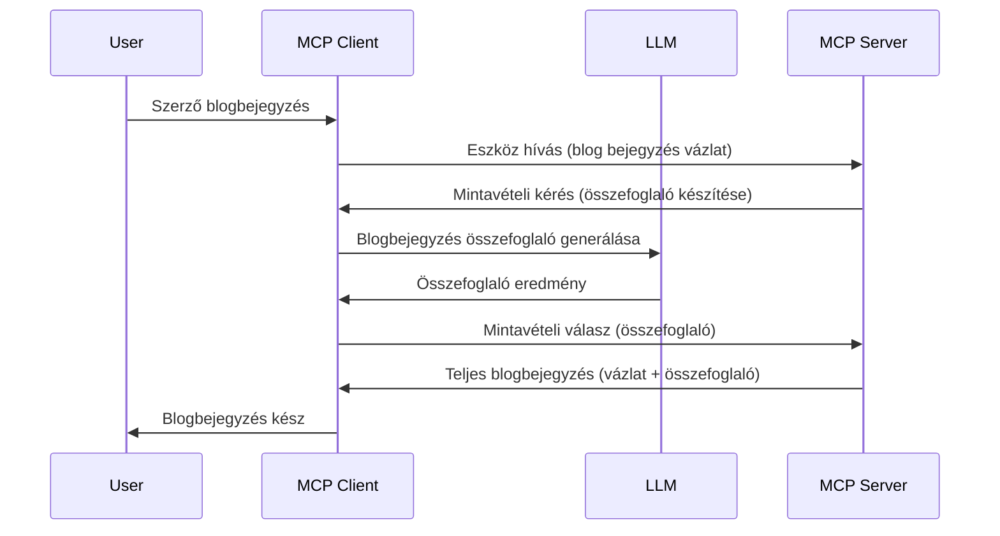

# Mintavételezés - képességek delegálása az Ügyfélnek

> **Elavulási értesítés:** a `2026-07-28` MCP specifikáció kiadási jelöltje a mintavételezést elavultnak jelöli az LLM szolgáltató API-kkal való közvetlen integráció javára. A mintavételezés továbbra is működik a `2025-11-25` verzióban és legalább egy évig bármilyen hivatalos elavulás után, így minden ebben a leckében szereplő információ érvényes marad — de az új szerverterveknek értékelniük kell a helyettesítő mintát. Lásd: [Mi változik az MCP-ben: a 2026-07-28 kiadási jelölt](../../01-CoreConcepts/mcp-2026-07-28-release-candidate.md).

Néha az MCP Ügyfélnek és az MCP Szervernek együtt kell működnie egy közös cél eléréséhez. Lehet olyan eset, amikor a Szervernek egy, az ügyfélen lévő LLM segítségére van szüksége. Ilyen helyzetekre kell használni a mintavételezést.

Nézzük meg néhány használati esetet és azt, hogyan építhetünk megoldást a mintavételezés alkalmazásával.

## Áttekintés

Ebben a leckében arra koncentrálunk, hogy mikor és hol érdemes a mintavételezést alkalmazni, és hogyan kell konfigurálni.

## Tanulási célok

Ebben a fejezetben:

- Elmagyarázzuk, mi az a mintavételezés és mikor használjuk.
- Bemutatjuk, hogyan kell konfigurálni a mintavételezést az MCP-ben.
- Példákat adunk a mintavételezés gyakorlati használatára.

## Mi az a mintavételezés és miért használjuk?

A mintavételezés egy fejlett funkció, amely a következőképpen működik:



### Mintavételezési kérés

Rendben, most, hogy átfogó képet kaptunk egy hihető forgatókönyvről, beszéljünk a szerver által az ügyfélnek küldött mintavételezési kérésről. Íme, hogyan nézhet ki egy ilyen kérés JSON-RPC formátumban:

```json
{
  "jsonrpc": "2.0",
  "id": 1,
  "method": "sampling/createMessage",
  "params": {
    "messages": [
      {
        "role": "user",
        "content": {
          "type": "text",
          "text": "Create a blog post summary of the following blog post: <BLOG POST>"
        }
      }
    ],
    "modelPreferences": {
      "hints": [
        {
          "name": "claude-3-sonnet"
        }
      ],
      "intelligencePriority": 0.8,
      "speedPriority": 0.5
    },
    "systemPrompt": "You are a helpful assistant.",
    "maxTokens": 100
  }
}
```

Érdemes kiemelni néhány dolgot:

- A prompt, a content -> text alatt, a kérést jelenti, amely egy utasítás az LLM-nek, hogy foglalja össze a blogbejegyzés tartalmát.

- **modelPreferences**. Ez a rész csak egy preferencia, egy ajánlás arra, hogy milyen konfigurációt érdemes az LLM-mel használni. A felhasználó eldöntheti, hogy követi-e ezeket az ajánlásokat vagy módosítja azokat. Ebben az esetben javasolt modell, valamint sebesség és intelligencia prioritás van megadva.
- **systemPrompt**, ez a szokásos rendszer prompt, amely személyiséget ad az LLM-nek és tartalmaz útmutató utasításokat.
- **maxTokens**, ez egy másik tulajdonság, amely jelzi, hogy hány token használata ajánlott ehhez a feladathoz.

### Mintavételezési válasz

Ez a válasz az, amit az MCP Ügyfél visszaküld a MCP Szervernek, és az ügyfél által az LLM hívásának eredménye, várt választ, majd ennek az üzenetnek az összeállítása. Íme hogyan nézhet ki JSON-RPC formátumban:

```json
{
  "jsonrpc": "2.0",
  "id": 1,
  "result": {
    "role": "assistant",
    "content": {
      "type": "text",
      "text": "Here's your abstract <ABSTRACT>"
    },
    "model": "gpt-5",
    "stopReason": "endTurn"
  }
}
```

Figyelje meg, hogy a válasz a blogbejegyzés kivonata, ahogy kértük. Vegyük észre azt is, hogy a használt `model` nem az, amit kértünk, hanem a "gpt-5" a "claude-3-sonnet" helyett. Ez azt illusztrálja, hogy a felhasználó megváltoztathatja döntését a használni kívánt modellről, és hogy a mintavételezési kérés egy ajánlás.

Rendben, most, hogy megértettük a fő folyamatot, és hasznos feladatnak tűnik a "blogbejegyzés készítés + kivonat", nézzük meg, mit kell tennünk a működéshez.

### Üzenettípusok

A mintavételezési üzenetek nemcsak szövegre korlátozódnak, hanem képek és hang is küldhető. Íme, hogyan néz ki másként a JSON-RPC:

**Szöveg**

```json
{
  "type": "text",
  "text": "The message content"
}
```

**Kép tartalom**

```json
{
  "type": "image",
  "data": "base64-encoded-image-data",
  "mimeType": "image/jpeg"
}
```

**Hang tartalom**

```json
{
  "type": "audio",
  "data": "base64-encoded-audio-data",
  "mimeType": "audio/wav"
}
```

> MEGJEGYZÉS: a mintavételezésről részletesebb információkat talál a [hivatalos dokumentációban](https://modelcontextprotocol.io/specification/2025-11-25/client/sampling)

## Hogyan konfiguráljuk a mintavételezést az Ügyfélben

> Megjegyzés: ha csak szervert épít, akkor itt nem kell sok mindent tennie.

Egy ügyfélben a következőképpen kell megadni a funkciót:

```json
{
  "capabilities": {
    "sampling": {}
  }
}
```

Ezt azután a kiválasztott ügyfél veszi fel, amikor inicializálódik a szerverrel.

## Példa működés közbeni mintavételezésre - Blogbejegyzés létrehozása

Írjunk együtt egy mintavételezési szervert, a következőket kell megtennünk:

1. Hozzon létre egy eszközt a Szerveren.
1. Az eszköznek mintavételezési kérést kell létrehoznia.
1. Az eszköznek várnia kell az ügyfél mintavételezési kérésének válaszára.
1. Ezután létre kell hozni az eszköz eredményét.

Nézzük meg a kódot lépésről lépésre:

### -1- Az eszköz létrehozása

**python**

```python
@mcp.tool()
async def create_blog(title: str, content: str, ctx: Context[ServerSession, None]) -> str:
    """Create a blog post and generate a summary"""

```

### -2- Mintavételezési kérés létrehozása

Bővítse az eszközt a következő kóddal:

**python**

```python
post = BlogPost(
        id=len(posts) + 1,
        title=title,
        content=content,
        abstract=""
    )

prompt = f"Create an abstract of the following blog post: title: {title} and draft: {content} "

result = await ctx.session.create_message(
        messages=[
            SamplingMessage(
                role="user",
                content=TextContent(type="text", text=prompt),
            )
        ],
        max_tokens=100,
)

```

### -3- Várakozás a válaszra és válasz visszaadása

**python**

```python
post.abstract = result.content.text

posts.append(post)

# add vissza a teljes terméket
return json.dumps({
    "id": post.title,
    "abstract": post.abstract
})
```

### -4- Teljes kód

**python**

```python
from starlette.applications import Starlette
from starlette.routing import Mount, Host

from mcp.server.fastmcp import Context, FastMCP

from mcp.server.session import ServerSession
from mcp.types import SamplingMessage, TextContent

import json


from uuid import uuid4
from typing import List
from pydantic import BaseModel


mcp = FastMCP("Blog post generator")

# app = FastAPI()

posts = []

class BlogPost(BaseModel):
    id: int
    title: str
    content: str
    abstract: str

posts: List[BlogPost] = []

@mcp.tool()
async def create_blog(title: str, content: str, ctx: Context[ServerSession, None]) -> str:
    """Create a blog post and generate a summary"""

    post = BlogPost(
        id=len(posts) + 1,
        title=title,
        content=content,
        abstract=""
    )

    prompt = f"Create an abstract of the following blog post: title: {title} and draft: {content} "

    result = await ctx.session.create_message(
        messages=[
            SamplingMessage(
                role="user",
                content=TextContent(type="text", text=prompt),
            )
        ],
        max_tokens=100,
    )

    post.abstract = result.content.text

    posts.append(post)

    # adja vissza a teljes blogbejegyzést
    return json.dumps({
        "id": post.title,
        "abstract": post.abstract
    })

if __name__ == "__main__":
    print("Starting server...")
    # mcp.futtatás()
    mcp.run(transport="streamable-http")

# indítsa az alkalmazást a következővel: python server.py
```

### -5- Tesztelés Visual Studio Code-ban

A Visual Studio Code-ban való teszteléshez tegye a következőket:

1. Indítsa el a szervert a terminálban
1. Adja hozzá az *mcp.json*-hez (és győződjön meg róla, hogy elindult), például így:

   ```json
   "servers": {
      "blog-server": {
        "type": "http",
        "url": "http://localhost:8000/mcp"
      }
   }
   ```

1. Írjon be egy promptot:

   ```text
   create a blog post named "Where Python comes from", the content is "Python is actually named after Monty Python Flying Circus"
   ```

1. Engedje meg a mintavételezés megtörténtét. Első alkalommal, amikor ezt teszteli, egy további párbeszédablak jelenik meg, amit el kell fogadnia, majd a normál párbeszéd lesz, amely eszköz futtatására kér.

1. Vizsgálja meg az eredményeket. Láthatja az eredményeket szépen megjelenítve a GitHub Copilot Chat-ben, de a nyers JSON válasz is megtekinthető.

**Bónusz**. A Visual Studio Code eszköztár nagyszerű támogatást nyújt a mintavételezéshez. A telepített szerveren a mintavételezés hozzáférését így konfigurálhatja:

1. Navigáljon a bővítmény szekcióhoz.
1. Válassza ki a fogaskerék ikont a telepített szervernél az "MCP SZERVEREK - TELEPÍTVE" részben.
1 Válassza a "Modell hozzáférés konfigurálása" opciót, ahol kiválaszthatja, hogy a GitHub Copilot mely modelleket használhat a mintavételezés során. Itt láthatja az összes legutóbbi mintavételezési kérést is, ha kiválasztja a "Mintavételezési kérések megjelenítése" opciót.

## Feladat

Ebben a feladatban egy kissé eltérő mintavételezést fog építeni, nevezetesen egy olyan mintavételezési integrációt, amely termékleírás generálását támogatja. Íme a forgatókönyv:

**Forgatókönyv**: Egy e-kereskedelmi back office munkatársnak segítségre van szüksége, mert túl sok idő termékleírásokat generálni. Ezért egy olyan megoldást kell készítenie, ahol meghívhat egy "create_product" eszközt "title" és "keywords" argumentumokkal, és az eszköznek egy teljes terméket kell előállítania, beleértve egy "description" mezőt is, amelyet az ügyfél LLM-je tölt ki.

TIP: használja a korábban tanultakat, hogy ezt a szervert és az eszközét mintavételezési kéréssel építse fel.

## Megoldás

[Megoldás](./solution/README.md)

## Fontos tanulságok

A mintavételezés egy erőteljes funkció, amely lehetővé teszi, hogy a szerver feladatokat delegáljon az ügyfélnek, amikor LLM segítsége szükséges.

## Mi következik

- [4. fejezet - Gyakorlati megvalósítás](../../04-PracticalImplementation/README.md)

---

<!-- CO-OP TRANSLATOR DISCLAIMER START -->
**Jogi nyilatkozat**:
Ez a dokumentum az AI fordítási szolgáltatás, a [Co-op Translator](https://github.com/Azure/co-op-translator) segítségével készült. Bár az pontosságra törekszünk, kérjük, vegye figyelembe, hogy az automatikus fordítások hibákat vagy pontatlanságokat tartalmazhatnak. Az eredeti dokumentum az anyanyelvén tekintendő hiteles forrásnak. Fontos információk esetén professzionális emberi fordítást javasolunk. Nem vállalunk felelősséget semmilyen félreértésért vagy téves értelmezésért, amely ebből a fordításból ered.
<!-- CO-OP TRANSLATOR DISCLAIMER END -->