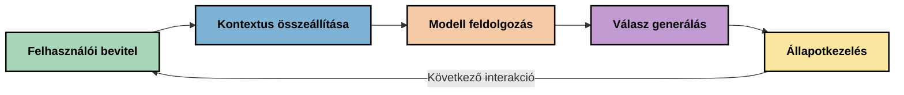
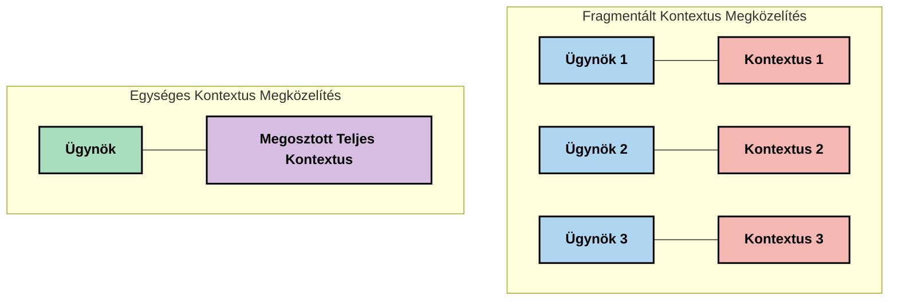
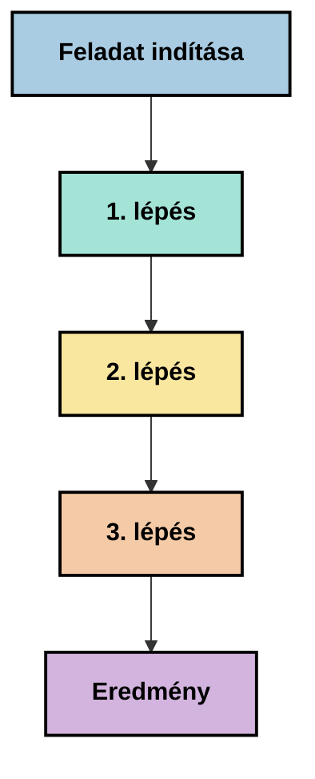
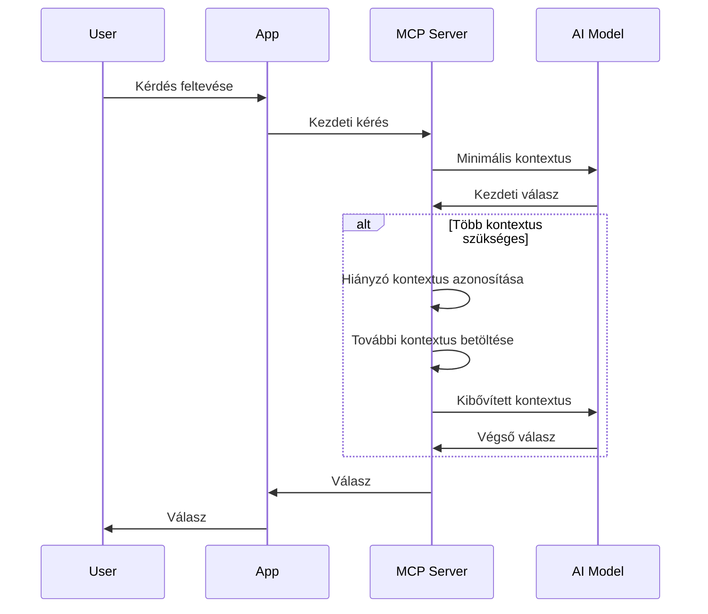
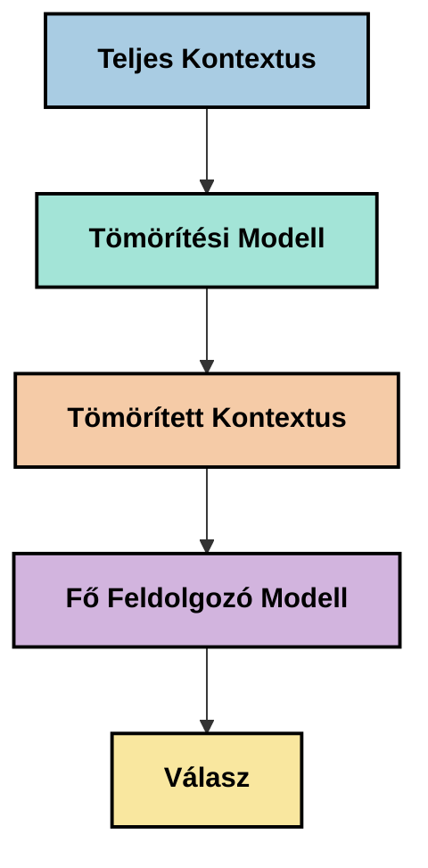
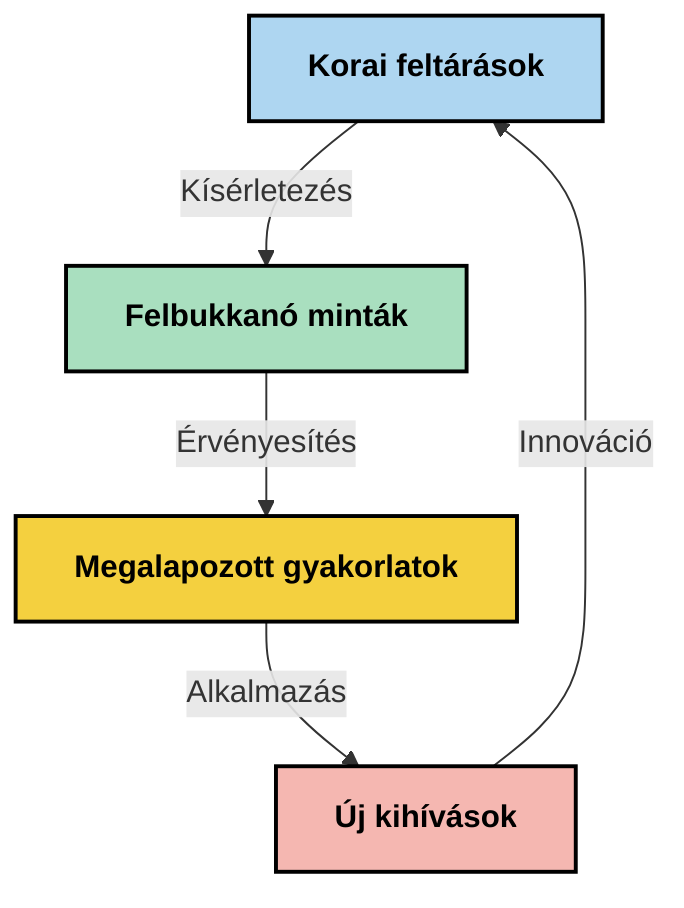

# Kontextusmérnökség: Egy felmerülő fogalom az MCP ökoszisztémában

## Áttekintés

A kontextusmérnökség egy felmerülő fogalom a mesterséges intelligencia területén, amely azt vizsgálja, hogyan struktúrálják, továbbítják és tartják fenn az információkat az ügyfelek és az MI szolgáltatások közötti interakciók során. Ahogy a Model Context Protocol (MCP) ökoszisztéma fejlődik, egyre fontosabbá válik a kontextus hatékony kezelése. Ez a modul bevezeti a kontextusmérnökség fogalmát, és feltérképezi annak potenciális alkalmazásait az MCP megvalósításokban.

## Tanulási célok

A modul végére képes leszel:

- Megérteni a felmerülő kontextusmérnökség fogalmát és annak potenciális szerepét az MCP alkalmazásokban
- Azonosítani a kontextuskezelés kulcsfontosságú kihívásait, amelyeket az MCP protokoll tervezése kezel
- Feltárni technikákat a modell teljesítményének javítására jobb kontextuskezeléssel
- Megfontolni a kontextus hatékonyságának mérésére és értékelésére szolgáló megközelítéseket
- Alkalmazni ezeket a felmerülő fogalmakat az MI élmények javítására az MCP keretrendszeren keresztül

## Bevezetés a Kontextusmérnökségbe

A kontextusmérnökség egy felmerülő fogalom, amely az információáramlás szándékos tervezésére és kezelésére összpontosít a felhasználók, alkalmazások és MI modellek között. Ellentétben a jól bevált területekkel, mint a promptmérnökség, a kontextusmérnökség még formálódik a szakemberek által, akik az MI modellek számára megfelelő információk időzítésének és biztosításának egyedi kihívásait próbálják megoldani.

Ahogy a nagyméretű nyelvi modellek (LLM-ek) fejlődtek, a kontextus jelentősége egyre nyilvánvalóbbá vált. A kontextus minősége, relevanciája és struktúrája közvetlenül befolyásolja a modell kimeneteit. A kontextusmérnökség ezt a kapcsolatot vizsgálja, és arra törekszik, hogy elveket dolgozzon ki a hatékony kontextuskezelés érdekében.

> „2025-ben a modellek rendkívül intelligensek. De még a legokosabb ember sem lesz képes hatékonyan végezni a munkáját anélkül, hogy ismerné a kontextust, amit a végrehajtásra kérnek... A 'kontextusmérnökség' a promptmérnökség következő szintje. Ez arról szól, hogy ezt automatikusan, dinamikus rendszerben végezzük.” — Walden Yan, Cognition AI

A kontextusmérnökség magában foglalhatja:

1. **Kontextus Kiválasztás**: Meghatározni, hogy mely információk relevánsak egy adott feladathoz
2. **Kontextus Struktúrálás**: Az információk rendszerezése a modell jobb megértésének érdekében
3. **Kontextus Szállítás**: Az információk továbbításának optimalizálása, miként és mikor
4. **Kontextus Fenntartás**: A kontextus állapotának és fejlődésének kezelése az idő múlásával
5. **Kontextus Értékelés**: A kontextus hatékonyságának mérése és javítása

Ezek a fókuszterületek különösen relevánsak az MCP ökoszisztéma számára, amely szabványosított módot biztosít az alkalmazásoknak arra, hogy kontextust nyújtsanak az LLM-eknek.


## A Kontextus Útja Perspektíva

Egy módja a kontextusmérnökség vizualizálásának, hogy követjük az információ útját egy MCP rendszerben:



### A Kontextus Útjának Kulcsfontosságú Szakaszai:

1. **Felhasználói Bemenet**: Nyers információ a felhasználótól (szöveg, képek, dokumentumok)
2. **Kontextus Összeállítás**: A felhasználói bemenet kombinálása a rendszer kontextusával, a beszélgetés előzményeivel és más lekért adatokkal
3. **Modell Feldolgozás**: Az MI modell feldolgozza az összeállított kontextust
4. **Válaszgenerálás**: A modell a megadott kontextus alapján állítja elő a válaszokat
5. **Állapotkezelés**: A rendszer frissíti belső állapotát az interakció alapján

Ez a perspektíva kiemeli a kontextus dinamikus jellegét az MI rendszerekben, és fontos kérdéseket vet fel arról, hogyan kezeljük legjobban az információt minden szakaszban.

## Felmerülő Elvek a Kontextusmérnökségben

Ahogy a kontextusmérnökség területe formálódik, néhány korai elv kezd kirajzolódni a szakemberek tapasztalatai alapján. Ezek az elvek segíthetnek az MCP megvalósítási döntéseinek meghozatalában:

### 1. Elv: Oszd meg a Kontextust Teljes mértékben

A kontextust teljes egészében meg kell osztani a rendszer összes alkotóeleme között, nem szabad széttagolni több ügynök vagy folyamat között. Amikor a kontextus szétoszlik, az egyik rendszerrészen hozott döntések ellentmondásba kerülhetnek egy másik részen hozottakkal.



Az MCP alkalmazásokban ez azt javasolja, hogy olyan rendszereket tervezzünk, ahol a kontextus zökkenőmentesen áramlik az egész feldolgozási csövön, ahelyett, hogy elkülönített lenne.

### 2. Elv: Ismerd Fel, Hogy a Műveletek Implicit Döntéseket Rejtnek

Minden tett, amit egy modell végrehajt, implicit döntéseket foglal magában arról, hogyan értelmezi a kontextust. Amikor több komponens különböző kontextusokra alapozva cselekszik, ezek az implicit döntések összeférhetetlenek lehetnek, ami következetlen eredményekhez vezet.

Ennek az elvnek fontos következményei vannak az MCP alkalmazásokra:
- Inkább részesítsük előnyben az összetett feladatok lineáris feldolgozását a párhuzamos feldolgozás helyett, ahol a kontextus széttagolt
- Biztosítsuk, hogy minden döntéspont ugyanahhoz a kontextuális információhoz férjen hozzá
- Olyan rendszereket tervezzünk, ahol a későbbi lépések látják a korábbi döntések teljes kontextusát

### 3. Elv: Egyensúlyt Találni a Kontextus Mélysége és az Ablak Korlátok Között

Ahogy a beszélgetések és folyamatok egyre hosszabbak lesznek, a kontextus ablakok végül túlcsordulnak. A hatékony kontextusmérnökség azt kutatja, hogyan kezelhető ez a feszültség az átfogó kontextus és a technikai korlátok között.

Potenciális megközelítések, amelyeket vizsgálnak:
- Kontextus tömörítés, amely megtartja a lényeges információkat, miközben csökkenti a token-használatot
- Kontextus progresszív betöltése a relevancia alapján az aktuális igényekhez
- Korábbi interakciók összefoglalása, miközben megőrzi a kulcsfontosságú döntéseket és tényeket

## Kontextus Kihívások és az MCP Protokoll Tervezése

A Model Context Protocol (MCP) a kontextuskezelés egyedi kihívásainak tudatában lett megtervezve. E kihívások megértése segít megmagyarázni az MCP protokoll tervezésének kulcsfontosságú elemeit:


### Kihívás 1: Kontextus Ablak Korlátok
A legtöbb MI modellnek fix méretű kontextus ablakai vannak, amelyek korlátozzák, hogy egyszerre mennyi információt képesek feldolgozni.

**MCP Tervezési Válasz:** 
- A protokoll támogatja a strukturált, erőforrás-alapú kontextust, amely hatékonyan hivatkozható
- Az erőforrások lapozhatóak és progresszíven tölthetőek be

### Kihívás 2: Relevancia Meghatározása
Nehéz megállapítani, mely információk a leginkább relevánsak a kontextusba való bevonáshoz.

**MCP Tervezési Válasz:**
- Rugalmas eszközök dinamikus információlekéréshez szükség szerint
- Strukturált promptok az egységes kontextus szervezéséhez

### Kihívás 3: Kontextus Tartósság
Az interakciók közti állapot kezelése precíz nyomonkövetést igényel.

**MCP Tervezési Válasz:**
- Szabványosított munkamenet-kezelés
- Világosan meghatározott interakciós minták a kontextus fejlődéséhez

### Kihívás 4: Többmodális Kontextus
Különféle adat típusok (szöveg, képek, strukturált adatok) eltérő kezelést igényelnek.

**MCP Tervezési Válasz:**
- A protokoll tervezése támogat különféle tartalomtípusokat
- Többmodális információk szabványosított ábrázolása

### Kihívás 5: Biztonság és Adatvédelem
A kontextus gyakran tartalmaz érzékeny információkat, amelyeket védeni kell.

**MCP Tervezési Válasz:**
- Tiszta határok az ügyfél és a szerver felelősségei között
- Helyi feldolgozási lehetőségek az adatkitettség minimalizálására

E kihívások és az MCP megoldásainak megértése alapot teremt a fejlettebb kontextusmérnökségi technikák feltérképezéséhez.

## Felmerülő Kontextusmérnökségi Megközelítések

Ahogy a kontextusmérnökség területe fejlődik, több ígéretes megközelítés kezd kirajzolódni. Ezek a jelenlegi gondolkodást tükrözik, nem pedig megszilárdult bevált gyakorlatokat, és valószínűleg tovább fejlődnek az MCP megvalósítások tapasztalatainak bővülésével.

### 1. Egyszálú Lineáris Feldolgozás

Azokon az architektúrákon kívül, amelyek több ügynök között osztják el a kontextust, néhány szakember azt találja, hogy az egyszálú lineáris feldolgozás következetesebb eredményeket ad. Ez összhangban van az egységes kontextus fenntartásának elvével.



Bár ez a megközelítés kevésbé hatékonynak tűnhet, mint a párhuzamos feldolgozás, gyakran összefüggőbb és megbízhatóbb eredményeket produkál, mert minden lépés az előző döntések teljes megértésére épít.

### 2. Kontextus Darabolás és Prioritizálás

Nagy kontextusokat kisebb, kezelhető darabokra bontani és kiemelni a legfontosabbakat.

```python
# Fogalmi példa: Kontextus darabolása és priorizálása
def process_with_chunked_context(documents, query):
    # 1. Tördeld a dokumentumokat kisebb darabokra
    chunks = chunk_documents(documents)
    
    # 2. Számold ki az egyes darabok relevancia pontszámát
    scored_chunks = [(chunk, calculate_relevance(chunk, query)) for chunk in chunks]
    
    # 3. Rendezze a darabokat relevancia pontszám szerint
    sorted_chunks = sorted(scored_chunks, key=lambda x: x[1], reverse=True)
    
    # 4. Használd a legrelevánsabb darabokat kontextusként
    context = create_context_from_chunks([chunk for chunk, score in sorted_chunks[:5]])
    
    # 5. Feldolgozás a priorizált kontextussal
    return generate_response(context, query)
```

A fenti koncepció szemlélteti, hogyan bonthatunk nagy dokumentumokat kezelhető részekre, és választhatjuk ki csak a legrelevánsabb részeket a kontextus számára. Ez a megközelítés segíthet a kontextus ablak korlátokon belül maradni, miközben kihasználhatók a nagy tudásbázisok.

### 3. Progresszív Kontextus Betöltés

Kontekstust fokozatosan betölteni szükség szerint, nem egyszerre.



A progresszív kontextus betöltés minimális kontextussal kezdődik, és csak akkor bővül, ha szükséges. Ez jelentősen csökkentheti a token használatot egyszerű lekérdezéseknél, miközben megőrzi a képességet összetett kérdések kezelésére.

### 4. Kontextus Tömörítés és Összefoglalás

A kontextus méretének csökkentése lényeges információk megőrzése mellett.



A kontextus tömörítés fókuszai:
- A redundáns információk eltávolítása
- Hosszú tartalmak összefoglalása
- Kulcsfontosságú tények és részletek kivonása
- Kritikus kontextuselemek megőrzése
- Token-hatékonyság optimalizálása

Ez a megközelítés különösen értékes lehet hosszú beszélgetések fennmaradásához a kontextus ablakokon belül vagy nagy dokumentumok hatékony feldolgozásához. Néhány szakember speciális modelleket használ kifejezetten a beszélgetéstörténet kontextus tömörítésére és összefoglalására.


## Feltáró Kontextusmérnökségi Megfontolások

Amint felfedezzük a kontextusmérnökség felmerülő területét, több megfontolás érdemes figyelembe vételre az MCP megvalósításokkal dolgozva. Ezek nem előíró jellegű legjobb gyakorlatok, hanem inkább kutatási területek, amelyek javulást hozhatnak a konkrét felhasználási esetekben.

### Gondold Át a Kontextus Céljaidat

Mielőtt bonyolult kontextuskezelési megoldásokat valósítanál meg, tisztázd, mit szeretnél elérni:
- Milyen konkrét információkra van szüksége a modellnek a sikerhez?
- Mely információk létfontosságúak, és melyek kiegészítőek?
- Mik a teljesítménykorlátaid (késleltetés, tokenkorlátok, költségek)?

### Fedezd Fel a Rétegzett Kontextus Megközelítéseket

Néhány szakember sikerrel alkalmaz kontextust elképzelési rétegekbe rendezve:
- **Alapréteg**: Lényeges információk, amelyek a modellnek mindig kellenek
- **Helyzeti Réteg**: A jelenlegi interakcióhoz specifikus kontextus
- **Támogató Réteg**: További információk, amelyek hasznosak lehetnek
- **Visszahívó Réteg**: Csak szükség esetén elérhető információk

### Vizsgáld Meg a Lekérési Stratégiákat

A kontextus hatékonysága gyakran attól függ, hogyan szerzed be az információt:
- Fogalmi keresés és beágyazások fogalmi relevanciájú információkhoz
- Kulcsszavas keresés konkrét tényadatokhoz
- Hibridek, amelyek több lekérési módszert kombinálnak
- Metaadat szűrés a kategóriák, dátumok vagy források alapján a szűkítéshez

### Kísérletezz a Kontextus Koherenciájával

A kontextus szerkezete és áramlása befolyásolhatja a modell megértését:
- Kapcsolódó információk csoportosítása együtt
- Következetes formázás és szervezés használata
- Logikus vagy időrendi sorrend fenntartása, ahol indokolt
- Ellentmondó információk elkerülése

### Mérlegeld a Több Ügynök Architektúrák Hátrányait

Bár a több ügynök architektúrák népszerűek sok MI keretrendszerben, komoly kihívásokat jelentenek a kontextuskezelésben:
- A kontextusszéttagolódás következetlen döntésekhez vezethet az ügynökök között
- A párhuzamos feldolgozás konfliktusokat idézhet elő, amelyek nehezen egyeztethetők össze
- Kommunikációs többletterhelés ellensúlyozhatja a teljesítménynyereséget
- Komplex állapotkezelés szükséges a koherencia fenntartásához

Sok esetben az egyszemélyes megközelítés átfogó kontextuskezeléssel megbízhatóbb eredményeket adhat, mint több specializált ügynök széttagolt kontextussal.

### Fejlessz Ki Értékelési Módszereket

Ahhoz, hogy idővel javítsd a kontextusmérnökséget, fontold meg, hogyan méred a sikert:
- A/B tesztelés különböző kontextus struktúrákkal
- Token felhasználás és válaszidők nyomon követése
- Felhasználói elégedettség és feladat teljesítési arányok mérés
- Elemzés, mikor és miért hibásodnak meg a kontextus stratégiák

Ezek a megfontolások aktív kutatási területeket képviselnek a kontextusmérnökségben. Ahogy a terület érlelődik, valószínűleg egyértelműbb mintázatok és gyakorlatok alakulnak ki.

## A Kontextus Hatékonyságának Mérése: Egy Fejlődő Keretrendszer

Ahogy a kontextusmérnökség egy koncepcióként kibontakozik, a szakemberek elkezdik feltárni, hogyan lehet mérni annak hatékonyságát. Még nincs megszilárdult keretrendszer, de különböző mutatókat vizsgálnak, amelyek segíthetik a jövőbeli munkát.

### Potenciális Mérési Dimenziók


#### 1. Bemeneti Hatékonyság Megfontolások

- **Kontextus-válasz arány**: Mennyire sok kontextus szükséges a válasz méretéhez képest?
- **Token kihasználás**: A megadott kontextus tokenek hány százaléka tűnik hatással a válaszra?
- **Kontextus csökkentés**: Mennyire hatékonyan tudjuk tömöríteni a nyers információkat?

#### 2. Teljesítmény Megfontolások

- **Késleltetés hatás**: Hogyan befolyásolja a kontextuskezelés a válaszidőt?
- **Token gazdaságosság**: Optimalizáljuk-e hatékonyan a token használatot?
- **Lekérés pontossága**: Mennyire releváns a lekért információ?
- **Erőforrás kihasználás**: Milyen számítási erőforrásokat igényel?

#### 3. Minőségi Megfontolások

- **Válasz relevancia**: Mennyire válaszol a válasz jól a lekérdezésre?
- **Ténybeli pontosság**: Javítja-e a kontextuskezelés a ténybeli helyességet?
- **Következetesség**: Válaszok következetesek-e hasonló lekérdezéseknél?
- **Hallucináció arány**: Csökkenti-e a jobb kontextus a modell hallucinációit?

#### 4. Felhasználói Élmény Megfontolások

- **Utánkövetési arány**: Milyen gyakran van szükség pontosításra a felhasználóknál?
- **Feladat teljesítés**: Sikerülnek-e a felhasználóknak elérni céljaikat?
- **Elégedettségi mutatók**: Hogyan értékelik a felhasználók az élményüket?

### Feltáró Mérési Megközelítések

Amikor MCP megvalósításokban kísérletezel a kontextusmérnökséggel, fontold meg a következő feltáró megközelítéseket:

1. **Alapvonal összehasonlítások**: Egyszerű kontextus megközelítések alapvonalának megállapítása mielőtt fejlettebb módszereket tesztelnél

2. **Fokozatos változások**: Egy-egy kontextuskezelési aspektus megváltoztatása a hatások elkülönítéséhez

3. **Felhasználó-központú értékelés**: Kvantitatív mutatók kombinálása kvalitatív felhasználói visszacsatolással

4. **Hibaelemzés**: Vizsgáld meg azokat az eseteket, amikor a kontextus stratégiák kudarcot vallanak, hogy megértsd a potenciális javításokat

5. **Többdimenziós értékelés**: Mérlegeld a hatékonyság, minőség és felhasználói élmény közötti kompromisszumokat

Ez a kísérleti, többoldalú mérési megközelítés összhangban áll a kontextusmérnökség felmerülő jellegével.

## Záró Gondolatok

A kontextusmérnökség egy felmerülő kutatási terület, amely központi szerepet játszhat a hatékony MCP alkalmazásokban. Az információáramlás átgondolt kezelése révén potenciálisan olyan MI élményeket teremthetsz, amelyek hatékonyabbak, pontosabbak és értékesebbek a felhasználók számára.

Ebben a modulban felvázolt technikák és megközelítések a kezdeti gondolkodást tükrözik ezen a téren, nem pedig állandó gyakorlatokat. A kontextusmérnökség valószínűleg fejlődik egy kidolgozottabb diszciplínává, ahogy az MI képességek fejlődnek és mélyül a megértésünk. Egyelőre a kísérletezés és a gondos mérés tűnik a leghatékonyabb útnak.

## Potenciális Jövőbeli Irányok

A kontextusmérnökség területe még kezdeti stádiumban van, de több ígéretes irány rajzolódik ki:

- A kontextusmérnökségi elvek jelentősen befolyásolhatják a modell teljesítményét, hatékonyságát, felhasználói élményét és megbízhatóságát
- Az egyszálú megközelítések átfogó kontextuskezeléssel sok esetben felülmúlhatják a több ügynök architektúrákat
- Specializált kontextus tömörítő modellek szabványos komponensekké válhatnak az MI adatfeldolgozási csövekben
- A kontextus teljessége és a token korlátok közötti feszültség valószínűleg innovációt hajt majd a kontextuskezelésben
- Ahogy a modellek képessé válnak hatékony, emberihez hasonló kommunikációra, az igazi több ügynökös együttműködés is életképesebbé válhat
- Az MCP megvalósítások fejlődhetnek az aktuális kísérletezésből származó kontextuskezelési minták szabványosítására



## Források

### Hivatalos MCP Források
- [Model Context Protocol Honlap](https://modelcontextprotocol.io/)
- [Model Context Protocol Specifikáció](https://github.com/modelcontextprotocol/modelcontextprotocol)

- [MCP Dokumentáció](https://modelcontextprotocol.io/docs)
- [MCP C# SDK](https://github.com/modelcontextprotocol/csharp-sdk)
- [MCP Python SDK](https://github.com/modelcontextprotocol/python-sdk)
- [MCP TypeScript SDK](https://github.com/modelcontextprotocol/typescript-sdk)
- [MCP Inspector](https://github.com/modelcontextprotocol/inspector) - Vizuális tesztelő eszköz MCP szerverekhez

### Kontextusmérnöki Cikkek
- [Ne Építs Többügynökös Rendszereket: A Kontextusmérnökség Elvei](https://cognition.ai/blog/dont-build-multi-agents) - Walden Yan meglátásai a kontextusmérnökség elveiről
- [Gyakorlati Útmutató Az Ügynökök Építéséhez](https://cdn.openai.com/business-guides-and-resources/a-practical-guide-to-building-agents.pdf) - OpenAI útmutató a hatékony ügynöktervezéshez
- [Hatékony Ügynökök Építése](https://www.anthropic.com/engineering/building-effective-agents) - Az Anthropic megközelítése az ügynökfejlesztéshez

### Kapcsolódó Kutatások
- [Dinamikus Lekérdezés-Növelés Nagy Nyelvi Modellekhez](https://arxiv.org/abs/2310.01487) - Kutatás a dinamikus lekérdezési megközelítésekről
- [Elveszve A Közepén: Hogyan Használják a Nyelvi Modellek a Hosszú Kontextusokat](https://arxiv.org/abs/2307.03172) - Fontos kutatás a kontextusfeldolgozási mintákról
- [Hierarchikus Szöveg-Alapú Képalkotás CLIP Latensekkel](https://arxiv.org/abs/2204.06125) - DALL-E 2 publikáció betekintéssel a kontextus szerkezetépítésébe
- [A Kontextus Szerepének Vizsgálata a Nagy Nyelvi Modellek Architektúrájában](https://aclanthology.org/2023.findings-emnlp.124/) - Legújabb kutatás a kontextuskezelésről
- [Többügynökös Együttműködés: Áttekintés](https://arxiv.org/abs/2304.03442) - Kutatás a többügynökös rendszerekről és kihívásaikról

### További Források
- [Kontextus Ablak Optimalizációs Technikák](https://learn.microsoft.com/en-us/azure/ai-services/openai/concepts/context-window)
- [Haladó RAG Technikák](https://www.microsoft.com/en-us/research/blog/retrieval-augmented-generation-rag-and-frontier-models/)
- [Semantic Kernel Dokumentáció](https://github.com/microsoft/semantic-kernel)
- [AI Eszköztár Kontextuskezeléshez](https://github.com/microsoft/aitoolkit)

## Mi következik

- [5.15 MCP Egyedi Szállítás](../mcp-transport/README.md)

---

<!-- CO-OP TRANSLATOR DISCLAIMER START -->
**Jogi nyilatkozat**:
Ez a dokumentum az AI fordítási szolgáltatás, a [Co-op Translator](https://github.com/Azure/co-op-translator) segítségével készült. Bár az pontosságra törekszünk, kérjük, vegye figyelembe, hogy az automatikus fordítások hibákat vagy pontatlanságokat tartalmazhatnak. Az eredeti dokumentum az anyanyelvén tekintendő hiteles forrásnak. Fontos információk esetén professzionális emberi fordítást javasolunk. Nem vállalunk felelősséget semmilyen félreértésért vagy téves értelmezésért, amely ebből a fordításból ered.
<!-- CO-OP TRANSLATOR DISCLAIMER END -->