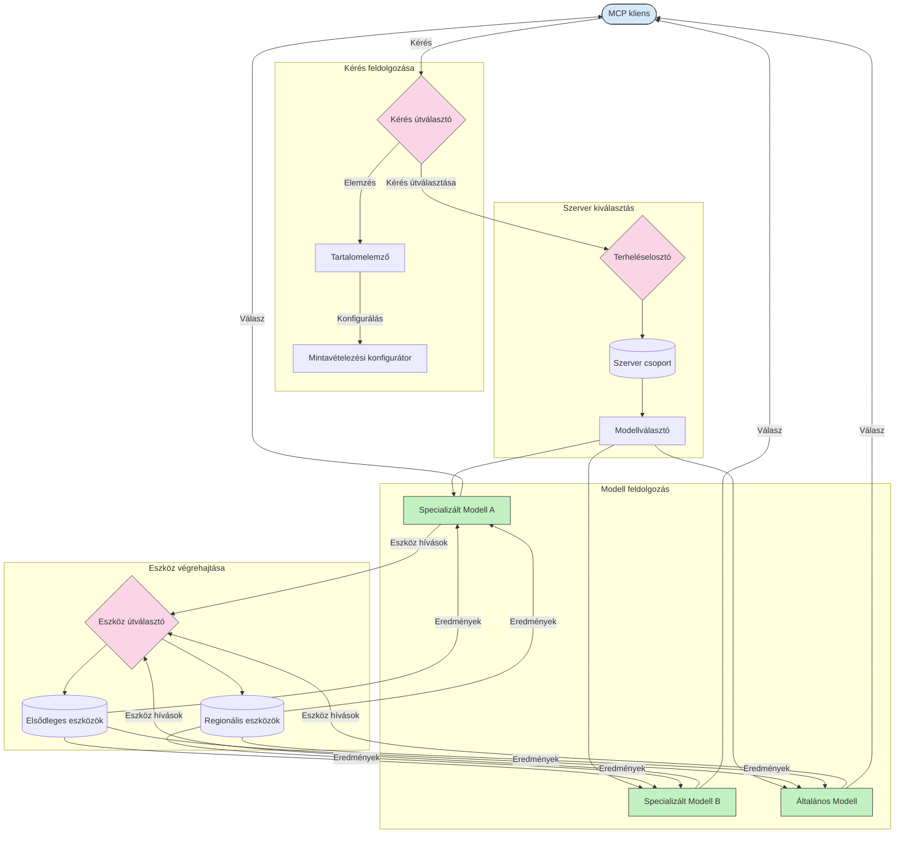

# Routing a Model Context Protocolban

A routing elengedhetetlen a kérelmek megfelelő modellekhez, eszközökhöz vagy szolgáltatásokhoz irányításához egy MCP ökoszisztémán belül.

## Bevezetés

A Model Context Protocol (MCP) routingja magában foglalja a kérelmek irányítását a legmegfelelőbb modellekhez vagy szolgáltatásokhoz különféle kritériumok alapján, mint például tartalomtípus, felhasználói kontextus és rendszerterhelés. Ez biztosítja a hatékony feldolgozást és az optimális erőforrás-kihasználást.

## Tanulási célok

Ezen lecke végére képes leszel:

- Megérteni az MCP routing alapelveit.
- Tartalom alapú routingot megvalósítani a kérések szakosított szolgáltatásokhoz irányításához.
- Intelligens terheléselosztási stratégiákat alkalmazni az erőforrás-kihasználás optimalizálásához.
- Dinamikus eszköz routingot megvalósítani a kérés kontextusa alapján.

## Tartalom alapú routing

A tartalom alapú routing a kéréseket a kérés tartalma alapján szakosított szolgáltatásokhoz irányítja. Például a kódgenerálási kéréseket egy specializált kódmodulhoz lehet irányítani, míg a kreatív írási kéréseket egy kreatív írási modellhez lehet küldeni.

Nézzünk egy példát különböző programozási nyelveken történő megvalósításra.

<details>
<summary>.NET</summary>

```csharp
// .NET Example: Content-based routing in MCP
public class ContentBasedRouter
{
    private readonly Dictionary<string, McpClient> _specializedClients;
    private readonly RoutingClassifier _classifier;
    
    public ContentBasedRouter()
    {
        // Initialize specialized clients for different domains
        _specializedClients = new Dictionary<string, McpClient>
        {
            ["code"] = new McpClient("https://code-specialized-mcp.com"),
            ["creative"] = new McpClient("https://creative-specialized-mcp.com"),
            ["scientific"] = new McpClient("https://scientific-specialized-mcp.com"),
            ["general"] = new McpClient("https://general-mcp.com")
        };
        
        // Initialize content classifier
        _classifier = new RoutingClassifier();
    }
    
    public async Task<McpResponse> RouteAndProcessAsync(string prompt, IDictionary<string, object> parameters = null)
    {
        // Classify the prompt to determine the best specialized service
        string category = await _classifier.ClassifyPromptAsync(prompt);
        
        // Get the appropriate client or fall back to general
        var client = _specializedClients.ContainsKey(category) 
            ? _specializedClients[category] 
            : _specializedClients["general"];
            
        Console.WriteLine($"Routing request to {category} specialized service");
        
        // Send request to the selected service
        return await client.SendPromptAsync(prompt, parameters);
    }
    
    // Simple classifier for routing decisions
    private class RoutingClassifier
    {
        public Task<string> ClassifyPromptAsync(string prompt)
        {
            prompt = prompt.ToLowerInvariant();
            
            if (prompt.Contains("code") || prompt.Contains("function") || 
                prompt.Contains("program") || prompt.Contains("algorithm"))
            {
                return Task.FromResult("code");
            }
            
            if (prompt.Contains("story") || prompt.Contains("creative") || 
                prompt.Contains("imagine") || prompt.Contains("design"))
            {
                return Task.FromResult("creative");
            }
            
            if (prompt.Contains("science") || prompt.Contains("research") || 
                prompt.Contains("analyze") || prompt.Contains("study"))
            {
                return Task.FromResult("scientific");
            }
            
            return Task.FromResult("general");
        }
    }
}
```

Az előző kódban:

- Létrehoztunk egy `ContentBasedRouter` osztályt, amely a kérés tartalma alapján irányítja azokat.
- Inicializáltunk specializált klienseket különböző területekhez (kód, kreatív, tudományos, általános).
- Megvalósítottunk egy egyszerű osztályozót, amely meghatározza a kérés kategóriáját, és a megfelelő specializált szolgáltatáshoz irányítja.
- Használtunk visszaesési mechanizmust a kérések általános szolgáltatáshoz irányításához, ha nincs elérhető specializált szolgáltatás.
- Megvalósítottunk aszinkron feldolgozást a kérelmek hatékony kezelésére.
- Egy szótárt használtunk a tartalom kategóriák és a specializált MCP kliensek hozzárendelésére.
- Megvalósítottunk egy egyszerű osztályozót, amely elemzi a kérést és visszaadja a megfelelő kategóriát.
- A specializált klienst használtuk a kérés elküldésére és válasz fogadására.
- Kezeltük azokat az eseteket, amikor a kérés nem illeszkedik egyik specializált kategóriához sem, és általános szolgáltatáshoz irányítottunk.

</details>

## Intelligens terheléselosztás

A terheléselosztás optimalizálja az erőforrások kihasználását és biztosítja az MCP szolgáltatások magas rendelkezésre állását. Különböző módszerek léteznek a terheléselosztás megvalósítására, mint a körbeforgás (round-robin), súlyozott válaszidő, vagy tartalomérzékeny stratégiák.

Nézzük meg az alábbi példa megvalósítást, amely a következő stratégiákat használja:

- **Körbeforgás (Round Robin)**: Egyenletesen osztja szét a kéréseket az elérhető szerverek között.
- **Súlyozott válaszidő**: A szerverek átlagos válaszideje alapján irányítja a kéréseket.
- **Tartalomérzékeny**: A kérés tartalma alapján szakosított szerverekhez irányítja a kéréseket.

<details>
<summary>Java</summary>

```java
// Java példa: Intelligens terheléselosztás MCP szerverekhez
public class McpLoadBalancer {
    private final List<McpServerNode> serverNodes;
    private final LoadBalancingStrategy strategy;
    
    public McpLoadBalancer(List<McpServerNode> nodes, LoadBalancingStrategy strategy) {
        this.serverNodes = new ArrayList<>(nodes);
        this.strategy = strategy;
    }
    
    public McpResponse processRequest(McpRequest request) {
        // Válassza ki a legjobb szervert a stratégia alapján
        McpServerNode selectedNode = strategy.selectNode(serverNodes, request);
        
        try {
            // Irányítsa a kérést a kiválasztott csomóponthoz
            return selectedNode.processRequest(request);
        } catch (Exception e) {
            // Hibakezelés - valósítson meg újrapróbálkozási vagy visszaesési logikát
            System.err.println("Error processing request on node " + selectedNode.getId() + ": " + e.getMessage());
            
            // Jelölje meg a csomópontot potenciálisan egészségtelennek
            selectedNode.recordFailure();
            
            // Próbálja a következő legjobb csomópontot visszaesésként
            List<McpServerNode> remainingNodes = new ArrayList<>(serverNodes);
            remainingNodes.remove(selectedNode);
            
            if (!remainingNodes.isEmpty()) {
                McpServerNode fallbackNode = strategy.selectNode(remainingNodes, request);
                return fallbackNode.processRequest(request);
            } else {
                throw new RuntimeException("All MCP server nodes failed to process the request");
            }
        }
    }
    
    // Csomópont egészségellenőrző feladat
    public void startHealthChecks(Duration interval) {
        ScheduledExecutorService scheduler = Executors.newScheduledThreadPool(1);
        scheduler.scheduleAtFixedRate(() -> {
            for (McpServerNode node : serverNodes) {
                try {
                    boolean isHealthy = node.checkHealth();
                    System.out.println("Node " + node.getId() + " health status: " + 
                                      (isHealthy ? "HEALTHY" : "UNHEALTHY"));
                } catch (Exception e) {
                    System.err.println("Health check failed for node " + node.getId());
                    node.setHealthy(false);
                }
            }
        }, 0, interval.toMillis(), TimeUnit.MILLISECONDS);
    }
    
    // Terheléselosztási stratégiák interfésze
    public interface LoadBalancingStrategy {
        McpServerNode selectNode(List<McpServerNode> nodes, McpRequest request);
    }
    
    // Körkörös stratégia
    public static class RoundRobinStrategy implements LoadBalancingStrategy {
        private AtomicInteger counter = new AtomicInteger(0);
        
        @Override
        public McpServerNode selectNode(List<McpServerNode> nodes, McpRequest request) {
            List<McpServerNode> healthyNodes = nodes.stream()
                .filter(McpServerNode::isHealthy)
                .collect(Collectors.toList());
            
            if (healthyNodes.isEmpty()) {
                throw new RuntimeException("No healthy nodes available");
            }
            
            int index = counter.getAndIncrement() % healthyNodes.size();
            return healthyNodes.get(index);
        }
    }
    
    // Súlyozott válaszidő stratégia
    public static class ResponseTimeStrategy implements LoadBalancingStrategy {
        @Override
        public McpServerNode selectNode(List<McpServerNode> nodes, McpRequest request) {
            return nodes.stream()
                .filter(McpServerNode::isHealthy)
                .min(Comparator.comparing(McpServerNode::getAverageResponseTime))
                .orElseThrow(() -> new RuntimeException("No healthy nodes available"));
        }
    }
    
    // Tartalomérzékeny stratégia
    public static class ContentAwareStrategy implements LoadBalancingStrategy {
        @Override
        public McpServerNode selectNode(List<McpServerNode> nodes, McpRequest request) {
            // Határozza meg a kérés jellemzőit
            boolean isCodeRequest = request.getPrompt().contains("code") || 
                                   request.getAllowedTools().contains("codeInterpreter");
            
            boolean isCreativeRequest = request.getPrompt().contains("creative") || 
                                       request.getPrompt().contains("story");
            
            // Keresse meg a speciális csomópontokat
            Optional<McpServerNode> specializedNode = nodes.stream()
                .filter(McpServerNode::isHealthy)
                .filter(node -> {
                    if (isCodeRequest && node.getSpecialization().equals("code")) {
                        return true;
                    }
                    if (isCreativeRequest && node.getSpecialization().equals("creative")) {
                        return true;
                    }
                    return false;
                })
                .findFirst();
            
            // Adja vissza a speciális vagy a legkevésbé terhelt csomópontot
            return specializedNode.orElse(
                nodes.stream()
                    .filter(McpServerNode::isHealthy)
                    .min(Comparator.comparing(McpServerNode::getCurrentLoad))
                    .orElseThrow(() -> new RuntimeException("No healthy nodes available"))
            );
        }
    }
}
```

Az előző kódban:

- Létrehoztunk egy `McpLoadBalancer` osztályt, amely kezeli az MCP szervercsomópontokat, és a kijelölt terheléselosztási stratégia alapján irányítja a kéréseket.
- Megvalósítottunk különböző terheléselosztási stratégiákat: `RoundRobinStrategy`, `ResponseTimeStrategy`, és `ContentAwareStrategy`.
- Egy `ScheduledExecutorService` segítségével időszakosan ellenőrizzük a szervercsomópontok állapotát.
- Megvalósítottunk egy egészségellenőrző mechanizmust, amely az állapotuk alapján egészséges vagy nem egészséges jelzéssel látja el a csomópontokat.
- A kérések kezelését hibakezeléssel és visszaesési logikával valósítottuk meg, hogy biztosítsuk a magas rendelkezésre állást.
- Egy `McpServerNode` osztályt használtunk az egyes MCP szervercsomópontok reprezentálására, beleértve egészségügyi állapotukat, átlagos válaszidejüket, és aktuális terhelésüket.
- Megvalósítottunk egy `McpRequest` osztályt a kérés részleteinek, mint a prompt vagy engedélyezett eszközök, kapszulázására.
- Java Stream-eket használtunk az egészségi állapot és szakosodás szerint történő szűréshez és kiválasztáshoz.

</details>

## Dinamikus eszköz routing

Az eszköz routing biztosítja, hogy az eszköz hívásokat a legmegfelelőbb szolgáltatásba irányítsuk a kontextus alapján. Például egy időjárás eszköz hívást regionális végpontra irányíthatunk a felhasználó helyzete alapján, vagy egy számológép eszköz egy adott API verziót használhat.

Nézzük meg egy példát, amely bemutatja a dinamikus eszköz routing megvalósítását kérés elemzés, regionális végpontok és verziókezelés alapján.

<details>
<summary>Python</summary>

```python
# Python példa: Dinamikus eszközirányítás kérés elemzése alapján
class McpToolRouter:
    def __init__(self):
        # Regisztrálja az elérhető eszköz végpontokat
        self.tool_endpoints = {
            "weatherTool": "https://weather-service.example.com/api",
            "calculatorTool": "https://calculator-service.example.com/compute",
            "databaseTool": "https://database-service.example.com/query",
            "searchTool": "https://search-service.example.com/search"
        }
        
        # Regionális végpontok globális elosztáshoz
        self.regional_endpoints = {
            "us": {
                "weatherTool": "https://us-west.weather-service.example.com/api",
                "searchTool": "https://us.search-service.example.com/search"
            },
            "europe": {
                "weatherTool": "https://eu.weather-service.example.com/api",
                "searchTool": "https://eu.search-service.example.com/search"
            },
            "asia": {
                "weatherTool": "https://asia.weather-service.example.com/api",
                "searchTool": "https://asia.search-service.example.com/search"
            }
        }
        
        # Eszköz verziókezelési támogatás
        self.tool_versions = {
            "weatherTool": {
                "default": "v2",
                "v1": "https://weather-service.example.com/api/v1",
                "v2": "https://weather-service.example.com/api/v2",
                "beta": "https://weather-service.example.com/api/beta"
            }
        }
    
    async def route_tool_request(self, tool_name, parameters, user_context=None):
        """Route a tool request to the appropriate endpoint based on context"""
        endpoint = self._select_endpoint(tool_name, parameters, user_context)
        
        if not endpoint:
            raise ValueError(f"No endpoint available for tool: {tool_name}")
        
        # A tényleges kérés végrehajtása a kiválasztott végpontra
        return await self._execute_tool_request(endpoint, tool_name, parameters)
    
    def _select_endpoint(self, tool_name, parameters, user_context=None):
        """Select the most appropriate endpoint based on context"""
        # Alapértelmezett végpont a regisztrációból
        if tool_name not in self.tool_endpoints:
            return None
            
        base_endpoint = self.tool_endpoints[tool_name]
        
        # Ellenőrizze, hogy szükséges-e specifikus eszköz verzió használata
        if tool_name in self.tool_versions:
            version_info = self.tool_versions[tool_name]
            
            # Használja a megadott verziót vagy az alapértelmezettet
            requested_version = parameters.get("_version", version_info["default"])
            if requested_version in version_info:
                base_endpoint = version_info[requested_version]
        
        # Ellenőrizze a regionális irányítást, ha ismert a felhasználó régiója
        if user_context and "region" in user_context:
            user_region = user_context["region"]
            
            if user_region in self.regional_endpoints:
                regional_tools = self.regional_endpoints[user_region]
                
                if tool_name in regional_tools:
                    # Használja a régió-specifikus végpontot
                    return regional_tools[tool_name]
        
        # Ellenőrizze az adat-helymegtartási követelményeket
        if user_context and "data_residency" in user_context:
            # Ez megvalósítaná az adat megőrzésének logikáját a megadott joghatóság alatt
            pass
        
        # Ellenőrizze a késleltetés-alapú irányítást
        if user_context and "latency_sensitive" in user_context and user_context["latency_sensitive"]:
            # Ez megvalósítaná a legkisebb késleltetésű végpont kiválasztásának logikáját
            pass
            
        return base_endpoint
        
    async def _execute_tool_request(self, endpoint, tool_name, parameters):
        """Execute the actual tool request to the selected endpoint"""
        try:
            async with aiohttp.ClientSession() as session:
                async with session.post(
                    endpoint,
                    json={"toolName": tool_name, "parameters": parameters},
                    headers={"Content-Type": "application/json"}
                ) as response:
                    if response.status == 200:
                        result = await response.json()
                        return result
                    else:
                        error_text = await response.text()
                        raise Exception(f"Tool execution failed: {error_text}")
        except Exception as e:
            # Valósítson meg újrapróbálkozási logikát vagy tartalék stratégiát
            print(f"Error executing tool {tool_name} at {endpoint}: {str(e)}")
            raise
```

Az előző kódban:

- Létrehoztunk egy `McpToolRouter` osztályt, amely kezeli az eszköz routingot kérés elemzés, regionális végpontok és verziókezelés alapján.
- Regisztráltuk az elérhető eszköz végpontokat és regionális végpontokat globális elosztáshoz.
- Megvalósítottunk dinamikus routing logikát, amely a felhasználói kontextus, például régió és adat tartózkodási követelmények alapján választja ki a megfelelő végpontot.
- Verziókezelési támogatást implementáltunk az eszközök számára, így a felhasználók megadhatják, melyik verziót szeretnék használni.
- Aszinkron HTTP kéréseket használtunk az eszköz hívások végrehajtásához és válaszok kezeléséhez.

</details>

## Mintavételezés és routing architektúra az MCP-ben

A mintavételezés kritikus része a Model Context Protocolnak (MCP), amely lehetővé teszi a hatékony kérésfeldolgozást és routingot. Elemzi a bejövő kérelmeket annak meghatározására, hogy melyik modell vagy szolgáltatás a legalkalmasabb a kezelésükre, különböző kritériumok alapján, például tartalomtípus, felhasználói kontextus és rendszerterhelés.

A mintavételezés és a routing kombinálható egy erős architektúra létrehozásához, amely optimalizálja az erőforrások kihasználását és biztosítja a magas rendelkezésre állást. A mintavételezési folyamat használható a kérések osztályozására, míg a routing a megfelelő modellekhez vagy szolgáltatásokhoz irányítja azokat.

Az alábbi ábra bemutatja, hogyan működnek együtt a mintavételezés és a routing egy átfogó MCP architektúrában:



## Mi következik

- [5.6 Mintavételezés](../mcp-sampling/README.md)

---

<!-- CO-OP TRANSLATOR DISCLAIMER START -->
**Jogi nyilatkozat**:
Ez a dokumentum az AI fordítási szolgáltatás, a [Co-op Translator](https://github.com/Azure/co-op-translator) segítségével készült. Bár az pontosságra törekszünk, kérjük, vegye figyelembe, hogy az automatikus fordítások hibákat vagy pontatlanságokat tartalmazhatnak. Az eredeti dokumentum az anyanyelvén tekintendő hiteles forrásnak. Fontos információk esetén professzionális emberi fordítást javasolunk. Nem vállalunk felelősséget semmilyen félreértésért vagy téves értelmezésért, amely ebből a fordításból ered.
<!-- CO-OP TRANSLATOR DISCLAIMER END -->