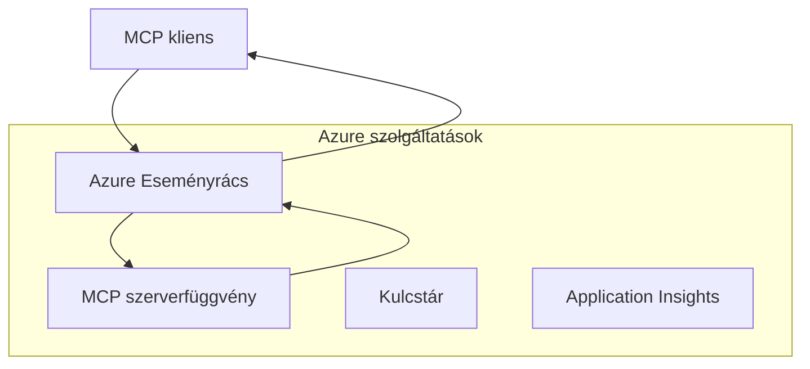
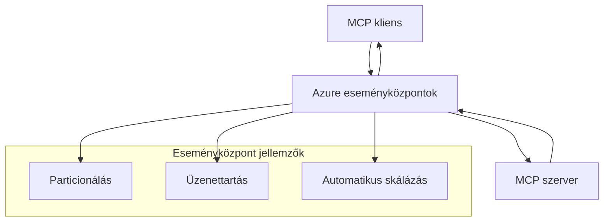

# MCP Egyedi Átvitelek - Haladó Megvalósítási Útmutató

A Model Context Protocol (MCP) rugalmasságot biztosít az átvitel mechanizmusok terén, lehetővé téve az egyedi megvalósításokat speciális vállalati környezetek számára. Ez a haladó útmutató az egyedi átvitelek megvalósítását tárgyalja az Azure Event Grid és az Azure Event Hubs felhasználásával, gyakorlati példaként bemutatva skálázható, felhőnatív MCP megoldások építését.

> **Előre tekintve:** ez az útmutató az **MCP Specifikáció 2025-11-25** verziójára van alapozva, ahol az ülések sorrendjét ülések szerint kell megőrizni (lásd alább az Üzenet Protokollt). A `2026-07-28` kiadás jelöltje teljesen eltávolítja az ülésszintű protokollt, és megköveteli a `Mcp-Method`/`Mcp-Name` fejléceket, hogy a kapuk és egyedi átvitelek kérésenként tudjanak útvonalat választani az ülések helyett. Lásd: [Mi változik az MCP-ben: A 2026-07-28 kiadás jelöltje](../../01-CoreConcepts/mcp-2026-07-28-release-candidate.md).

## Bevezetés

Míg az MCP szabványos átvitelei (stdio és HTTP streaming) a legtöbb esetet lefedik, a vállalati környezetek gyakran igényelnek speciális átvitel mechanizmusokat a jobb skálázhatóság, megbízhatóság és a meglévő felhő infrastruktúrával való jobb integráció érdekében. Az egyedi átvitelek lehetővé teszik, hogy az MCP felhőnatív üzenetküldő szolgáltatásokat használjon aszinkron kommunikációra, eseményvezérelt architektúrákra és elosztott feldolgozásra.

Ez a lecke a legújabb MCP specifikáción (2025-11-25), az Azure üzenetküldő szolgáltatásain és jól bevált vállalati integrációs mintákon alapuló haladó átvitel megvalósításokat tárgyalja.

### **MCP Átvitel Architektúra**

**Az MCP Specifikációból (2025-11-25):**

- **Szabványos Átvitelek**: stdio (ajánlott), HTTP streaming (távoli forgatókönyvekhez)
- **Egyedi Átvitelek**: Bármilyen átvitel, amely megvalósítja az MCP üzenetcsere protokollt
- **Üzenetformátum**: JSON-RPC 2.0 MCP-specifikus kiterjesztésekkel
- **Kétirányú Kommunikáció**: Teljes duplex kommunikáció szükséges értesítésekhez és válaszokhoz

## Tanulási Célok

Ennek a haladó leckének a végére képes leszel:

- **Megérteni az Egyedi Átvitel Követelményeit**: MCP protokoll megvalósítása bármilyen átvitel rétegen, miközben megfelel a specifikációnak
- **Azure Event Grid Átvitel Készítése**: Eseményvezérelt MCP szerverek létrehozása az Azure Event Grid segítségével szerver nélküli skálázáshoz
- **Azure Event Hubs Átvitel Megvalósítása**: Nagy áteresztőképességű MCP megoldások tervezése Azure Event Hubs-al valós idejű streaminghez
- **Vállalati Minták Alkalmazása**: Egyedi átvitelek integrálása meglévő Azure infrastruktúrával és biztonsági modellekkel
- **Átvitel Megbízhatóság Kezelése**: Üzenet-tartósság, sorrendiség és hibakezelés megvalósítása vállalati forgatókönyvekhez
- **Teljesítmény Optimalizálás**: Átvitel megoldások tervezése skálázhatóság, késleltetés és áteresztőképesség szempontjából

## **Átvitel Követelmények**

### **MCP Specifikáció alapvető követelményei (2025-11-25):**

```yaml
Message Protocol:
  format: "JSON-RPC 2.0 with MCP extensions"
  bidirectional: "Full duplex communication required"
  ordering: "Message ordering must be preserved per session"
  
Transport Layer:
  reliability: "Transport MUST handle connection failures gracefully"
  security: "Transport MUST support secure communication"
  identification: "Each session MUST have unique identifier"
  
Custom Transport:
  compliance: "MUST implement complete MCP message exchange"
  extensibility: "MAY add transport-specific features"
  interoperability: "MUST maintain protocol compatibility"
```

## **Azure Event Grid Átvitel Megvalósítása**

Az Azure Event Grid egy szerver nélküli eseményirányító szolgáltatás, ideális eseményvezérelt MCP architektúrákhoz. Ez a megvalósítás bemutatja, hogyan lehet skálázható, laza kapcsolódású MCP rendszereket építeni.

### **Architektúra áttekintése**



### **C# megvalósítás - Event Grid Átvitel**

```csharp
using Azure.Messaging.EventGrid;
using Microsoft.Extensions.Azure;
using System.Text.Json;

public class EventGridMcpTransport : IMcpTransport
{
    private readonly EventGridPublisherClient _publisher;
    private readonly string _topicEndpoint;
    private readonly string _clientId;
    
    public EventGridMcpTransport(string topicEndpoint, string accessKey, string clientId)
    {
        _publisher = new EventGridPublisherClient(
            new Uri(topicEndpoint), 
            new AzureKeyCredential(accessKey));
        _topicEndpoint = topicEndpoint;
        _clientId = clientId;
    }
    
    public async Task SendMessageAsync(McpMessage message)
    {
        var eventGridEvent = new EventGridEvent(
            subject: $"mcp/{_clientId}",
            eventType: "MCP.MessageReceived",
            dataVersion: "1.0",
            data: JsonSerializer.Serialize(message))
        {
            Id = Guid.NewGuid().ToString(),
            EventTime = DateTimeOffset.UtcNow
        };
        
        await _publisher.SendEventAsync(eventGridEvent);
    }
    
    public async Task<McpMessage> ReceiveMessageAsync(CancellationToken cancellationToken)
    {
        // Event Grid is push-based, so implement webhook receiver
        // This would typically be handled by Azure Functions trigger
        throw new NotImplementedException("Use EventGridTrigger in Azure Functions");
    }
}

// Azure Function for receiving Event Grid events
[FunctionName("McpEventGridReceiver")]
public async Task<IActionResult> HandleEventGridMessage(
    [EventGridTrigger] EventGridEvent eventGridEvent,
    ILogger log)
{
    try
    {
        var mcpMessage = JsonSerializer.Deserialize<McpMessage>(
            eventGridEvent.Data.ToString());
        
        // Process MCP message
        var response = await _mcpServer.ProcessMessageAsync(mcpMessage);
        
        // Send response back via Event Grid
        await _transport.SendMessageAsync(response);
        
        return new OkResult();
    }
    catch (Exception ex)
    {
        log.LogError(ex, "Error processing Event Grid MCP message");
        return new BadRequestResult();
    }
}
```

### **TypeScript megvalósítás - Event Grid Átvitel**

```typescript
import { EventGridPublisherClient, AzureKeyCredential } from "@azure/eventgrid";
import { McpTransport, McpMessage } from "./mcp-types";

export class EventGridMcpTransport implements McpTransport {
    private publisher: EventGridPublisherClient;
    private clientId: string;
    
    constructor(
        private topicEndpoint: string,
        private accessKey: string,
        clientId: string
    ) {
        this.publisher = new EventGridPublisherClient(
            topicEndpoint,
            new AzureKeyCredential(accessKey)
        );
        this.clientId = clientId;
    }
    
    async sendMessage(message: McpMessage): Promise<void> {
        const event = {
            id: crypto.randomUUID(),
            source: `mcp-client-${this.clientId}`,
            type: "MCP.MessageReceived",
            time: new Date(),
            data: message
        };
        
        await this.publisher.sendEvents([event]);
    }
    
    // Eseményvezérelt fogadás Azure Functions segítségével
    onMessage(handler: (message: McpMessage) => Promise<void>): void {
        // A megvalósítás Azure Functions Event Grid trigger használatával történik
        // Ez egy koncepcionális interfész a webhook fogadóhoz
    }
}

// Azure Functions megvalósítás
import { app, InvocationContext, EventGridEvent } from "@azure/functions";

app.eventGrid("mcpEventGridHandler", {
    handler: async (event: EventGridEvent, context: InvocationContext) => {
        try {
            const mcpMessage = event.data as McpMessage;
            
            // MCP üzenet feldolgozása
            const response = await mcpServer.processMessage(mcpMessage);
            
            // Válasz küldése Event Grid-en keresztül
            await transport.sendMessage(response);
            
        } catch (error) {
            context.error("Error processing MCP message:", error);
            throw error;
        }
    }
});
```

### **Python megvalósítás - Event Grid Átvitel**

```python
from azure.eventgrid import EventGridPublisherClient, EventGridEvent
from azure.core.credentials import AzureKeyCredential
import asyncio
import json
from typing import Callable, Optional
import uuid
from datetime import datetime

class EventGridMcpTransport:
    def __init__(self, topic_endpoint: str, access_key: str, client_id: str):
        self.client = EventGridPublisherClient(
            topic_endpoint, 
            AzureKeyCredential(access_key)
        )
        self.client_id = client_id
        self.message_handler: Optional[Callable] = None
    
    async def send_message(self, message: dict) -> None:
        """Send MCP message via Event Grid"""
        event = EventGridEvent(
            data=message,
            subject=f"mcp/{self.client_id}",
            event_type="MCP.MessageReceived",
            data_version="1.0"
        )
        
        await self.client.send(event)
    
    def on_message(self, handler: Callable[[dict], None]) -> None:
        """Register message handler for incoming events"""
        self.message_handler = handler

# Azure Functions megvalósítás
import azure.functions as func
import logging

def main(event: func.EventGridEvent) -> None:
    """Azure Functions Event Grid trigger for MCP messages"""
    try:
        # MCP üzenet elemzése az Event Grid eseményből
        mcp_message = json.loads(event.get_body().decode('utf-8'))
        
        # MCP üzenet feldolgozása
        response = process_mcp_message(mcp_message)
        
        # Válasz visszaküldése Event Grid-en keresztül
        # (A megvalósítás új Event Grid klienst hozna létre)
        
    except Exception as e:
        logging.error(f"Error processing MCP Event Grid message: {e}")
        raise
```

## **Azure Event Hubs Átvitel Megvalósítása**

Az Azure Event Hubs magas átviteli sebességű, valós idejű streaming képességeket biztosít az MCP használati esetekhez, amelyek alacsony késleltetést és magas üzenetforgalmat igényelnek.

### **Architektúra áttekintése**



### **C# megvalósítás - Event Hubs Átvitel**

```csharp
using Azure.Messaging.EventHubs;
using Azure.Messaging.EventHubs.Producer;
using Azure.Messaging.EventHubs.Consumer;
using System.Text;

public class EventHubsMcpTransport : IMcpTransport, IDisposable
{
    private readonly EventHubProducerClient _producer;
    private readonly EventHubConsumerClient _consumer;
    private readonly string _consumerGroup;
    private readonly CancellationTokenSource _cancellationTokenSource;
    
    public EventHubsMcpTransport(
        string connectionString, 
        string eventHubName,
        string consumerGroup = "$Default")
    {
        _producer = new EventHubProducerClient(connectionString, eventHubName);
        _consumer = new EventHubConsumerClient(
            consumerGroup, 
            connectionString, 
            eventHubName);
        _consumerGroup = consumerGroup;
        _cancellationTokenSource = new CancellationTokenSource();
    }
    
    public async Task SendMessageAsync(McpMessage message)
    {
        var messageBody = JsonSerializer.Serialize(message);
        var eventData = new EventData(Encoding.UTF8.GetBytes(messageBody));
        
        // Add MCP-specific properties
        eventData.Properties.Add("MessageType", message.Method ?? "response");
        eventData.Properties.Add("MessageId", message.Id);
        eventData.Properties.Add("Timestamp", DateTimeOffset.UtcNow);
        
        await _producer.SendAsync(new[] { eventData });
    }
    
    public async Task StartReceivingAsync(
        Func<McpMessage, Task> messageHandler)
    {
        await foreach (PartitionEvent partitionEvent in _consumer.ReadEventsAsync(
            _cancellationTokenSource.Token))
        {
            try
            {
                var messageBody = Encoding.UTF8.GetString(
                    partitionEvent.Data.EventBody.ToArray());
                var mcpMessage = JsonSerializer.Deserialize<McpMessage>(messageBody);
                
                await messageHandler(mcpMessage);
            }
            catch (Exception ex)
            {
                // Handle deserialization or processing errors
                Console.WriteLine($"Error processing message: {ex.Message}");
            }
        }
    }
    
    public void Dispose()
    {
        _cancellationTokenSource?.Cancel();
        _producer?.DisposeAsync().AsTask().Wait();
        _consumer?.DisposeAsync().AsTask().Wait();
        _cancellationTokenSource?.Dispose();
    }
}
```

### **TypeScript megvalósítás - Event Hubs Átvitel**

```typescript
import { 
    EventHubProducerClient, 
    EventHubConsumerClient, 
    EventData 
} from "@azure/event-hubs";

export class EventHubsMcpTransport implements McpTransport {
    private producer: EventHubProducerClient;
    private consumer: EventHubConsumerClient;
    private isReceiving = false;
    
    constructor(
        private connectionString: string,
        private eventHubName: string,
        private consumerGroup: string = "$Default"
    ) {
        this.producer = new EventHubProducerClient(
            connectionString, 
            eventHubName
        );
        this.consumer = new EventHubConsumerClient(
            consumerGroup,
            connectionString,
            eventHubName
        );
    }
    
    async sendMessage(message: McpMessage): Promise<void> {
        const eventData: EventData = {
            body: JSON.stringify(message),
            properties: {
                messageType: message.method || "response",
                messageId: message.id,
                timestamp: new Date().toISOString()
            }
        };
        
        await this.producer.sendBatch([eventData]);
    }
    
    async startReceiving(
        messageHandler: (message: McpMessage) => Promise<void>
    ): Promise<void> {
        if (this.isReceiving) return;
        
        this.isReceiving = true;
        
        const subscription = this.consumer.subscribe({
            processEvents: async (events, context) => {
                for (const event of events) {
                    try {
                        const messageBody = event.body as string;
                        const mcpMessage: McpMessage = JSON.parse(messageBody);
                        
                        await messageHandler(mcpMessage);
                        
                        // Ellenőrzőpont frissítése legalább egyszeri kézbesítéshez
                        await context.updateCheckpoint(event);
                    } catch (error) {
                        console.error("Error processing Event Hubs message:", error);
                    }
                }
            },
            processError: async (err, context) => {
                console.error("Event Hubs error:", err);
            }
        });
    }
    
    async close(): Promise<void> {
        this.isReceiving = false;
        await this.producer.close();
        await this.consumer.close();
    }
}
```

### **Python megvalósítás - Event Hubs Átvitel**

```python
from azure.eventhub import EventHubProducerClient, EventHubConsumerClient
from azure.eventhub import EventData
import json
import asyncio
from typing import Callable, Dict, Any
import logging

class EventHubsMcpTransport:
    def __init__(
        self, 
        connection_string: str, 
        eventhub_name: str,
        consumer_group: str = "$Default"
    ):
        self.producer = EventHubProducerClient.from_connection_string(
            connection_string, 
            eventhub_name=eventhub_name
        )
        self.consumer = EventHubConsumerClient.from_connection_string(
            connection_string,
            consumer_group=consumer_group,
            eventhub_name=eventhub_name
        )
        self.is_receiving = False
    
    async def send_message(self, message: Dict[str, Any]) -> None:
        """Send MCP message via Event Hubs"""
        event_data = EventData(json.dumps(message))
        
        # Adjon hozzá MCP-specifikus tulajdonságokat
        event_data.properties = {
            "messageType": message.get("method", "response"),
            "messageId": message.get("id"),
            "timestamp": "2025-01-14T10:30:00Z"  # Használja a tényleges időbélyeget
        }
        
        async with self.producer:
            event_data_batch = await self.producer.create_batch()
            event_data_batch.add(event_data)
            await self.producer.send_batch(event_data_batch)
    
    async def start_receiving(
        self, 
        message_handler: Callable[[Dict[str, Any]], None]
    ) -> None:
        """Start receiving MCP messages from Event Hubs"""
        if self.is_receiving:
            return
        
        self.is_receiving = True
        
        async with self.consumer:
            await self.consumer.receive(
                on_event=self._on_event_received(message_handler),
                starting_position="-1"  # Kezdje az elejétől
            )
    
    def _on_event_received(self, handler: Callable):
        """Internal event handler wrapper"""
        async def handle_event(partition_context, event):
            try:
                # Elemezze az MCP üzenetet az Event Hubs eseményből
                message_body = event.body_as_str(encoding='UTF-8')
                mcp_message = json.loads(message_body)
                
                # Feldolgozza az MCP üzenetet
                await handler(mcp_message)
                
                # Frissítse a jelzőpontot legalább egyszeri kézbesítéshez
                await partition_context.update_checkpoint(event)
                
            except Exception as e:
                logging.error(f"Error processing Event Hubs message: {e}")
        
        return handle_event
    
    async def close(self) -> None:
        """Clean up transport resources"""
        self.is_receiving = False
        await self.producer.close()
        await self.consumer.close()
```

## **Haladó Átvitel Minták**

### **Üzenet Tartósság és Megbízhatóság**

```csharp
// Implementing message durability with retry logic
public class ReliableTransportWrapper : IMcpTransport
{
    private readonly IMcpTransport _innerTransport;
    private readonly RetryPolicy _retryPolicy;
    
    public async Task SendMessageAsync(McpMessage message)
    {
        await _retryPolicy.ExecuteAsync(async () =>
        {
            try
            {
                await _innerTransport.SendMessageAsync(message);
            }
            catch (TransportException ex) when (ex.IsRetryable)
            {
                // Log and retry
                throw;
            }
        });
    }
}
```

### **Átvitel Biztonsági Integráció**

```csharp
// Integrating Azure Key Vault for transport security
public class SecureTransportFactory
{
    private readonly SecretClient _keyVaultClient;
    
    public async Task<IMcpTransport> CreateEventGridTransportAsync()
    {
        var accessKey = await _keyVaultClient.GetSecretAsync("EventGridAccessKey");
        var topicEndpoint = await _keyVaultClient.GetSecretAsync("EventGridTopic");
        
        return new EventGridMcpTransport(
            topicEndpoint.Value.Value,
            accessKey.Value.Value,
            Environment.MachineName
        );
    }
}
```

### **Átvitel Megfigyelés és Láthatóság**

```csharp
// Adding telemetry to custom transports
public class ObservableTransport : IMcpTransport
{
    private readonly IMcpTransport _transport;
    private readonly ILogger _logger;
    private readonly TelemetryClient _telemetryClient;
    
    public async Task SendMessageAsync(McpMessage message)
    {
        using var activity = Activity.StartActivity("MCP.Transport.Send");
        activity?.SetTag("transport.type", "EventGrid");
        activity?.SetTag("message.method", message.Method);
        
        var stopwatch = Stopwatch.StartNew();
        
        try
        {
            await _transport.SendMessageAsync(message);
            
            _telemetryClient.TrackDependency(
                "EventGrid",
                "SendMessage",
                DateTime.UtcNow.Subtract(stopwatch.Elapsed),
                stopwatch.Elapsed,
                true
            );
        }
        catch (Exception ex)
        {
            _telemetryClient.TrackException(ex);
            throw;
        }
    }
}
```

## **Vállalati Integrációs Forgatókönyvek**

### **Forgatókönyv 1: Elosztott MCP Feldolgozás**

Több feldolgozó csomópont között az MCP kérések elosztása Azure Event Grid használatával:

```yaml
Architecture:
  - MCP Client sends requests to Event Grid topic
  - Multiple Azure Functions subscribe to process different tool types
  - Results aggregated and returned via separate response topic
  
Benefits:
  - Horizontal scaling based on message volume
  - Fault tolerance through redundant processors
  - Cost optimization with serverless compute
```

### **Forgatókönyv 2: Valós idejű MCP Streaming**

Magas gyakoriságú MCP interakciók Azure Event Hubs használatával:

```yaml
Architecture:
  - MCP Client streams continuous requests via Event Hubs
  - Stream Analytics processes and routes messages
  - Multiple consumers handle different aspect of processing
  
Benefits:
  - Low latency for real-time scenarios
  - High throughput for batch processing
  - Built-in partitioning for parallel processing
```

### **Forgatókönyv 3: Hibrid Átvitel Architektúra**

Több átvitel kombinálása különböző használati esetekhez:

```csharp
public class HybridMcpTransport : IMcpTransport
{
    private readonly IMcpTransport _realtimeTransport; // Event Hubs
    private readonly IMcpTransport _batchTransport;    // Event Grid
    private readonly IMcpTransport _fallbackTransport; // HTTP Streaming
    
    public async Task SendMessageAsync(McpMessage message)
    {
        // Route based on message characteristics
        var transport = message.Method switch
        {
            "tools/call" when IsRealtime(message) => _realtimeTransport,
            "resources/read" when IsBatch(message) => _batchTransport,
            _ => _fallbackTransport
        };
        
        await transport.SendMessageAsync(message);
    }
}
```

## **Teljesítmény Optimalizálás**

### **Üzenetcsomagolás az Event Gridhez**

```csharp
public class BatchingEventGridTransport : IMcpTransport
{
    private readonly List<McpMessage> _messageBuffer = new();
    private readonly Timer _flushTimer;
    private const int MaxBatchSize = 100;
    
    public async Task SendMessageAsync(McpMessage message)
    {
        lock (_messageBuffer)
        {
            _messageBuffer.Add(message);
            
            if (_messageBuffer.Count >= MaxBatchSize)
            {
                _ = Task.Run(FlushMessages);
            }
        }
    }
    
    private async Task FlushMessages()
    {
        List<McpMessage> toSend;
        lock (_messageBuffer)
        {
            toSend = new List<McpMessage>(_messageBuffer);
            _messageBuffer.Clear();
        }
        
        if (toSend.Any())
        {
            var events = toSend.Select(CreateEventGridEvent);
            await _publisher.SendEventsAsync(events);
        }
    }
}
```

### **Partícionálási Stratégia az Event Hubs-hoz**

```csharp
public class PartitionedEventHubsTransport : IMcpTransport
{
    public async Task SendMessageAsync(McpMessage message)
    {
        // Partition by client ID for session affinity
        var partitionKey = ExtractClientId(message);
        
        var eventData = new EventData(JsonSerializer.SerializeToUtf8Bytes(message))
        {
            PartitionKey = partitionKey
        };
        
        await _producer.SendAsync(new[] { eventData });
    }
}
```

## **Egyedi Átvitelek Tesztelése**

### **Egységtesztelés Teszt Duplumokkal**

```csharp
[Test]
public async Task EventGridTransport_SendMessage_PublishesCorrectEvent()
{
    // Arrange
    var mockPublisher = new Mock<EventGridPublisherClient>();
    var transport = new EventGridMcpTransport(mockPublisher.Object);
    var message = new McpMessage { Method = "tools/list", Id = "test-123" };
    
    // Act
    await transport.SendMessageAsync(message);
    
    // Assert
    mockPublisher.Verify(
        x => x.SendEventAsync(
            It.Is<EventGridEvent>(e => 
                e.EventType == "MCP.MessageReceived" &&
                e.Subject == "mcp/test-client"
            )
        ),
        Times.Once
    );
}
```

### **Integrációs Tesztelés Azure Test Containers használatával**

```csharp
[Test]
public async Task EventHubsTransport_IntegrationTest()
{
    // Using Testcontainers for integration testing
    var eventHubsContainer = new EventHubsContainer()
        .WithEventHub("test-hub");
    
    await eventHubsContainer.StartAsync();
    
    var transport = new EventHubsMcpTransport(
        eventHubsContainer.GetConnectionString(),
        "test-hub"
    );
    
    // Test message round-trip
    var sentMessage = new McpMessage { Method = "test", Id = "123" };
    McpMessage receivedMessage = null;
    
    await transport.StartReceivingAsync(msg => {
        receivedMessage = msg;
        return Task.CompletedTask;
    });
    
    await transport.SendMessageAsync(sentMessage);
    await Task.Delay(1000); // Allow for message processing
    
    Assert.That(receivedMessage?.Id, Is.EqualTo("123"));
}
```

## **Legjobb Gyakorlatok és Irányelvek**

### **Átvitel Tervezési Alapelvek**

1. **Idempotencia**: Biztosítsd, hogy az üzenetfeldolgozás idempotens legyen az ismétlődő üzenetek kezeléséhez
2. **Hibakezelés**: Valósíts meg átfogó hibakezelést és holt levél sorokat
3. **Megfigyelés**: Adj részletes telemetriát és egészségügyi ellenőrzéseket
4. **Biztonság**: Használj kezelt identitásokat és legkisebb jogosultság elvét
5. **Teljesítmény**: Tervezd meg a késleltetésre és áteresztőképességre vonatkozó specifikus igényeid szerint

### **Azure-specifikus Ajánlások**

1. **Használj Kezelt Identitást**: Kerüld a kapcsolati karakterláncokat éles környezetben
2. **Valósíts meg Áramkör-megszakítókat**: Védelem az Azure szolgáltatáskiesések ellen
3. **Költségek Monitorozása**: Kövesd az üzenetforgalmat és feldolgozási költségeket
4. **Skálázás Tervezése**: Korán tervezz partícionálást és skálázási stratégiákat
5. **Alapos Tesztelés**: Használj Azure DevTest Labs-et átfogó tesztelésre

## **Összefoglalás**

Az egyedi MCP átvitelek hatékony vállalati forgatókönyveket tesznek lehetővé az Azure üzenetküldő szolgáltatásainak használatával. Az Event Grid vagy Event Hubs átvitelek megvalósításával skálázható, megbízható MCP megoldásokat építhetsz, amelyek zökkenőmentesen integrálódnak a meglévő Azure infrastruktúrával.

A bemutatott példák termelési környezetben használható mintákat mutatnak be egyedi átvitelek megvalósítására, miközben megőrzik az MCP protokoll szerinti kompatibilitást és az Azure legjobb gyakorlatait.

## **További Források**

- [MCP Specifikáció 2025-11-25](https://modelcontextprotocol.io/specification/2025-11-25/)
- [Azure Event Grid Dokumentáció](https://docs.microsoft.com/azure/event-grid/)
- [Azure Event Hubs Dokumentáció](https://docs.microsoft.com/azure/event-hubs/)
- [Azure Functions Event Grid Trigger](https://docs.microsoft.com/azure/azure-functions/functions-bindings-event-grid)
- [Azure SDK .NET-hez](https://github.com/Azure/azure-sdk-for-net)
- [Azure SDK TypeScripthez](https://github.com/Azure/azure-sdk-for-js)
- [Azure SDK Pythonhoz](https://github.com/Azure/azure-sdk-for-python)

---

> *Ez az útmutató a gyakorlati megvalósítási mintákra fókuszál produkciós MCP rendszerekhez. Mindig ellenőrizd az átvitel megvalósításokat a saját követelményeidnek és az Azure szolgáltatás korlátainak megfelelően.*
> **Jelenlegi Szabvány**: Ez az útmutató az [MCP Specifikáció 2025-11-25](https://modelcontextprotocol.io/specification/2025-11-25/) átvitel követelményeit és haladó vállalati átvitel mintákat tükrözi.


## Mi következik
- [6. Közösségi hozzájárulások](../../06-CommunityContributions/README.md)

---

<!-- CO-OP TRANSLATOR DISCLAIMER START -->
**Jogi nyilatkozat**:
Ez a dokumentum az AI fordítási szolgáltatás, a [Co-op Translator](https://github.com/Azure/co-op-translator) segítségével készült. Bár az pontosságra törekszünk, kérjük, vegye figyelembe, hogy az automatikus fordítások hibákat vagy pontatlanságokat tartalmazhatnak. Az eredeti dokumentum az anyanyelvén tekintendő hiteles forrásnak. Fontos információk esetén professzionális emberi fordítást javasolunk. Nem vállalunk felelősséget semmilyen félreértésért vagy téves értelmezésért, amely ebből a fordításból ered.
<!-- CO-OP TRANSLATOR DISCLAIMER END -->