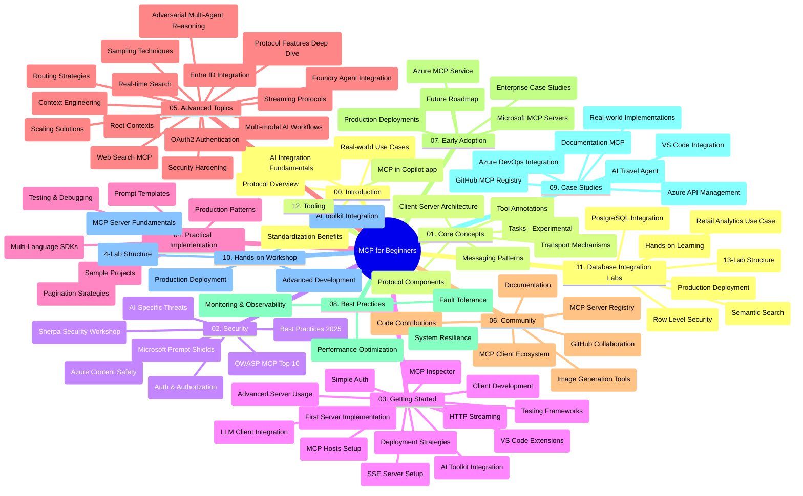

# Model Context Protocol (MCP) kezdőknek – Tanulmányi útmutató

Ez a tanulmányi útmutató áttekintést nyújt a "Model Context Protocol (MCP) kezdőknek" tananyag tárolószerkezetéről és tartalmáról. Használja ezt az útmutatót a tárhely hatékony navigálásához és a rendelkezésre álló erőforrások maximális kihasználásához.

## Tároló áttekintése

A Model Context Protocol (MCP) egy szabványosított keretrendszer az MI modellek és kliensalkalmazások közötti interakciókhoz. Eredetileg az Anthropic hozta létre, az MCP közösség most a hivatalos GitHub szervezet révén tartja karban. Ez a tárhely átfogó tananyagot kínál kézzelfogható kódpéldákkal C#, Java, JavaScript, Python és TypeScript nyelveken, amelyeket MI fejlesztőknek, rendszertervezőknek és szoftvermérnököknek szántak.

## Vizualizált tanterv térkép

## Tároló szerkezet

A tároló tizenkét fő részre van bontva, amelyek mindegyike az MCP különböző aspektusaira összpontosít:

1. **Bevezetés (00-Introduction/)**
   - A Model Context Protocol áttekintése
   - Miért fontos a szabványosítás az MI-pipeline-okban
   - Gyakorlati alkalmazási esetek és előnyök

2. **Alapfogalmak (01-CoreConcepts/)**
   - Kliens-szerver architektúra
   - Kulcsfontosságú protokoll komponensek
   - Üzenetküldési minták az MCP-ben
   - Előretekintés: [Mi változik az MCP-ben: a 2026-07-28-as kiadás jelölt](./01-CoreConcepts/mcp-2026-07-28-release-candidate.md) — az állapotmentes protokollmag, kiterjesztések keretrendszere, valamint a Roots/Sampling/Logging elavulttá válása a következő specifikációs verzióban várható

3. **Biztonság (02-Security/)**
   - Biztonsági fenyegetések MCP-alapú rendszerekben
   - Legjobb gyakorlatok a megvalósítások biztonságossá tételéhez
   - Hitelesítési és jogosultságkezelési stratégiák
   - **Átfogó biztonsági dokumentáció**:
     - MCP Biztonsági Legjobb Gyakorlatok 2025
     - Azure Tartalombiztonsági Megvalósítási Útmutató
     - MCP Biztonsági Szabályozások és Technikák
     - MCP Legjobb Gyakorlatok Gyorsreferencia
   - **Kulcsfontosságú biztonsági témák**:
     - Prompt injekció és eszközmérgezéses támadások
     - Munkamenet eltérítés és összezavart helyettes problémák
     - Token átengedési sérülékenységek
     - Túlzott jogosultságok és hozzáférés-ellenőrzés
     - AI komponensek beszállítói lánc biztonsága
     - Microsoft Prompt Shields integráció

4. **Kezdőknek (03-GettingStarted/)**
   - Környezet beállítása és konfigurálása
   - Alap MCP szerverek és kliensek létrehozása
   - Integráció meglévő alkalmazásokkal
   - Tartalmazza a részeket:
     - Első szerver implementáció
     - Kliens fejlesztés
     - LLM kliens integráció
     - VS Code integráció
     - Server-Sent Events (SSE) szerver
     - Fejlett szerver használat
     - HTTP streaming
     - AI Toolkit integráció
     - Tesztelési stratégiák
     - Telepítési irányelvek

5. **Gyakorlati megvalósítás (04-PracticalImplementation/)**
   - SDK-k használata különböző programozási nyelveken
   - Hibakeresési, tesztelési és ellenőrzési technikák
   - Újrafelhasználható prompt sablonok és munkafolyamatok kidolgozása
   - Minta projektek megvalósítási példákkal

6. **Haladó témák (05-AdvancedTopics/)**
   - Kontextus mérnökségi technikák
   - Foundry ügynök integráció
   - Többmodalitású MI munkafolyamatok
   - OAuth2 hitelesítési demók
   - Valós idejű keresési képességek
   - Valós idejű streaming
   - Root kontextusok megvalósítása
   - Útválasztási stratégiák
   - Mintavételi technikák
   - Skálázási megközelítések
   - Biztonsági megfontolások
   - Entra ID biztonsági integráció
   - Web keresési integráció
   - Ellenséges többügynökös érvelés (vita minták)

7. **Közösségi hozzájárulások (06-CommunityContributions/)**
   - Hogyan járulhat hozzá kódokkal és dokumentációval
   - Együttműködés GitHub-on keresztül
   - Közösségi alapú fejlesztések és visszajelzések
   - Különféle MCP kliensek használata (Claude Desktop, Cline, VSCode)
   - Népszerű MCP szerverekkel való munka, beleértve a kép generálást is

8. **Korai alkalmazási tapasztalatok (07-LessonsfromEarlyAdoption/)**
   - Valós megvalósítások és sikertörténetek
   - MCP-alapú megoldások építése és telepítése
   - Trendek és jövőbeli ütemterv
   - **Microsoft MCP szerverek útmutatója**: Átfogó útmutató 10 gyártásra kész Microsoft MCP szerverhez, többek között:
     - Microsoft Learn Docs MCP szerver
     - Azure MCP szerver (15+ specializált csatlakozó)
     - GitHub MCP szerver
     - Azure DevOps MCP szerver
     - MarkItDown MCP szerver
     - SQL Server MCP szerver
     - Playwright MCP szerver
     - Dev Box MCP szerver
     - Microsoft Foundry MCP szerver
     - Microsoft 365 Agents Toolkit MCP szerver

9. **Legjobb gyakorlatok (08-BestPractices/)**
   - Teljesítményhangolás és optimalizáció
   - Hibabiztos MCP rendszerek tervezése
   - Tesztelési és ellenállóképességi stratégiák

10. **Esettanulmányok (09-CaseStudy/)**
    - **Hét átfogó esettanulmány** az MCP sokoldalúságának bemutatására különböző helyzetekben:
    - **Azure AI Utazási Ügynökök**: Többügynökös összehangolás Azure OpenAI és AI Kereséssel
    - **Azure DevOps integráció**: Munkafolyamat automatizálás YouTube adatfrissítésekkel
    - **Valós idejű dokumentáció lekérés**: Python konzol kliens HTTP streaminggel
    - **Interaktív tanulmányi terv generátor**: Chainlit webalkalmazás beszélgető MI-vel
    - **Szerkesztői dokumentáció**: VS Code integráció GitHub Copilot munkafolyamatokkal
    - **Azure API menedzsment**: Vállalati API integráció MCP szerver létrehozással
    - **GitHub MCP Registry**: Ökoszisztéma fejlesztés és agentikus integrációs platform
    - Megvalósítási példák kiterjedtek vállalati integrációra, fejlesztői produktivitásra és ökoszisztéma fejlesztésre

11. **Gyakorlati műhely (10-StreamliningAIWorkflowsBuildingAnMCPServerWithAIToolkit/)**
    - Átfogó gyakorlati műhely MCP és AI Toolkit kombinációjával
    - Intelligens alkalmazások építése az MI modellek és valós eszközök között
    - Gyakorlati modulok a alapoktól az egyedi szerverfejlesztésig és gyártásbeli telepítési stratégiákig
    - **Labor struktúra**:
      - Labor 1: MCP szerver alapjai
      - Labor 2: Haladó MCP szerver fejlesztés
      - Labor 3: AI Toolkit integráció
      - Labor 4: Gyártásbeli telepítés és skálázás
    - Labor alapú tanulási megközelítés lépésről lépésre

12. **MCP szerver adatbázis integrációs laborok (11-MCPServerHandsOnLabs/)**
    - **Átfogó 13-laboros tanulási út** gyártásra kész MCP szerverek építésére PostgreSQL integrációval
    - **Valós kiskereskedelmi elemzési megvalósítás** a Zava Retail használati esettel
    - **Vállalati szintű minták** köztük Row Level Security (RLS), szemantikus keresés és többbérlős adat-hozzáférés
    - **Teljes labor struktúra**:
      - **Laborok 00-03: Alapok** - Bevezetés, Architektúra, Biztonság, Környezet beállítása
      - **Laborok 04-06: MCP szerver építése** - Adatbázis tervezés, MCP szerver implementáció, Eszköz fejlesztés
      - **Laborok 07-09: Haladó funkciók** - Szemantikus keresés, Tesztelés és hibakeresés, VS Code integráció
      - **Laborok 10-12: Gyártás és legjobb gyakorlatok** - Telepítés, Monitoring, Optimalizáció
    - **Foglalt technológiák**: FastMCP keretrendszer, PostgreSQL, Azure OpenAI, Azure Container Apps, Application Insights
    - **Tanulási eredmények**: Gyártásra kész MCP szerverek, adatbázis integrációs minták, MI-alapú elemzés, vállalati biztonság

13. **Eszközök (12-tooling/)**
    - Ismerje meg az MCP használatát a Copilot alkalmazásban és egyéb eszközökben

## További erőforrások

A tároló támogatói erőforrásokat tartalmaz:

- **Képek mappa**: Tartalmazza a tananyag egészében használt diagramokat és illusztrációkat
- **Fordítások**: Többnyelvű támogatás automatikus dokumentáció fordításokkal
- **Hivatalos MCP erőforrások**:
  - [MCP Dokumentáció](https://modelcontextprotocol.io/)
  - [MCP Specifikáció](https://spec.modelcontextprotocol.io/)
  - [MCP GitHub tárhely](https://github.com/modelcontextprotocol)

## Hogyan használja ezt a tárolót

1. **Sorrendben tanulás**: Kövesse a fejezeteket sorban (00-tól 11-ig), hogy strukturált tanulási élményben legyen része.
2. **Nyelvspecifikus fókusz**: Ha egy adott programozási nyelv érdekli, böngéssze a mintakönyvtárakat a preferált nyelven készült megvalósításokért.
3. **Gyakorlati megvalósítás**: Kezdje a „Kezdőknek” résszel a környezet beállításához és első MCP szerver és kliens létrehozásához.
4. **Haladó feltárás**: Amint megismerkedett az alapokkal, merüljön el a haladó témákban tudása bővítése érdekében.
5. **Közösségi részvétel**: Csatlakozzon az MCP közösséghez GitHub beszélgetések és Discord csatornák révén, hogy szakértőkkel és fejlesztőtársakkal léphessen kapcsolatba.

## MCP kliensek és eszközök

A tananyag különféle MCP klienseket és eszközöket fed le:

1. **Hivatalos kliensek**:
   - Visual Studio Code
   - MCP a Visual Studio Code-ban
   - Claude Desktop
   - Claude a VSCode-ban
   - Claude API

2. **Közösségi kliensek**:
   - Cline (terminál alapú)
   - Cursor (kódszerkesztő)
   - ChatMCP
   - Windsurf

3. **MCP menedzsment eszközök**:
   - MCP CLI
   - MCP Manager
   - MCP Linker
   - MCP Router

## Népszerű MCP szerverek

A tárhely többféle MCP szervert mutat be, többek között:

1. **Hivatalos Microsoft MCP szerverek**:
   - Microsoft Learn Docs MCP szerver
   - Azure MCP szerver (15+ specializált csatlakozó)
   - GitHub MCP szerver
   - Azure DevOps MCP szerver
   - MarkItDown MCP szerver
   - SQL Server MCP szerver
   - Playwright MCP szerver
   - Dev Box MCP szerver
   - Microsoft Foundry MCP szerver
   - Microsoft 365 Agents Toolkit MCP szerver

2. **Hivatalos referenciaszerverek**:
   - Fájlrendszer
   - Fetch
   - Memória
   - Szekvenciális gondolkodás

3. **Kép generálás**:
   - Azure OpenAI DALL-E 3
   - Stable Diffusion WebUI
   - Replicate

4. **Fejlesztői eszközök**:
   - Git MCP
   - Terminál vezérlés
   - Kódtámogató

5. **Specializált szerverek**:
   - Salesforce
   - Microsoft Teams
   - Jira és Confluence

## Hozzájárulás

Ez a tárhely üdvözli a közösség hozzájárulásait. Lásd a Közösségi hozzájárulások részt, hogy útmutatást kapjon az MCP ökoszisztéma hatékony támogatásához.

----

*Ez a tanulmányi útmutató utoljára 2026. február 5-én frissült, tükrözve a legfrissebb MCP Specifikációt 2025-11-25, és az adott dátum szerinti tároló áttekintést nyújt. A tárhely tartalma a továbbiakban frissülhet.*

*Kiegészítés (2026. július 2.): Egy lecke a `2026-07-28`-i MCP Specifikáció kiadás jelöltről hozzáadásra került a [01-CoreConcepts](./01-CoreConcepts/mcp-2026-07-28-release-candidate.md) alá; a tananyag bázisvonal marad 2025-11-25 amíg az új specifikáció meg nem jelenik.*

---

<!-- CO-OP TRANSLATOR DISCLAIMER START -->
**Jogi nyilatkozat**:
Ez a dokumentum az AI fordítási szolgáltatás, a [Co-op Translator](https://github.com/Azure/co-op-translator) segítségével készült. Bár az pontosságra törekszünk, kérjük, vegye figyelembe, hogy az automatikus fordítások hibákat vagy pontatlanságokat tartalmazhatnak. Az eredeti dokumentum az anyanyelvén tekintendő hiteles forrásnak. Fontos információk esetén professzionális emberi fordítást javasolunk. Nem vállalunk felelősséget semmilyen félreértésért vagy téves értelmezésért, amely ebből a fordításból ered.
<!-- CO-OP TRANSLATOR DISCLAIMER END -->