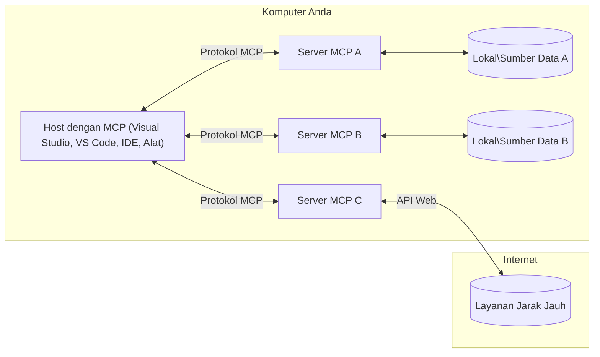

# Konsep Inti MCP: Menguasai Model Context Protocol untuk Integrasi AI

[](https://youtu.be/earDzWGtE84)

_(Klik gambar di atas untuk melihat video pelajaran ini)_

[Model Context Protocol (MCP)](https://github.com/modelcontextprotocol) adalah kerangka kerja standar yang kuat yang mengoptimalkan komunikasi antara Large Language Models (LLM) dan alat eksternal, aplikasi, serta sumber data. 
Panduan ini akan membimbing Anda melalui konsep inti MCP. Anda akan mempelajari arsitektur klien-servernya, komponen penting, mekanisme komunikasi, dan praktik terbaik dalam implementasi.

- **Persetujuan Pengguna yang Eksplisit**: Semua akses data dan operasi memerlukan persetujuan eksplisit dari pengguna sebelum dijalankan. Pengguna harus memahami dengan jelas data apa yang akan diakses dan tindakan apa yang akan dilakukan, dengan kontrol granular atas izin dan otorisasi.

- **Perlindungan Privasi Data**: Data pengguna hanya diungkapkan dengan persetujuan eksplisit dan harus dilindungi oleh kontrol akses yang kuat selama siklus interaksi. Implementasi harus mencegah transmisi data tanpa izin dan menjaga batas privasi yang ketat.

- **Keamanan Eksekusi Alat**: Setiap pemanggilan alat memerlukan persetujuan pengguna dengan pemahaman yang jelas tentang fungsi alat, parameter, dan dampak potensial. Batas keamanan yang kuat harus mencegah eksekusi alat yang tidak terduga, tidak aman, atau berbahaya.

- **Keamanan Lapisan Transport**: Semua saluran komunikasi harus menggunakan mekanisme enkripsi dan autentikasi yang sesuai. Koneksi jarak jauh harus menggunakan protokol transportasi yang aman dan pengelolaan kredensial yang tepat.

#### Panduan Implementasi:

- **Manajemen Izin**: Terapkan sistem izin yang sangat rinci yang memungkinkan pengguna mengontrol server, alat, dan sumber daya yang dapat diakses
- **Autentikasi & Otorisasi**: Gunakan metode autentikasi yang aman (OAuth, API key) dengan pengelolaan token dan masa kedaluwarsa yang tepat  
- **Validasi Masukan**: Validasi semua parameter dan input data sesuai dengan skema yang ditentukan untuk mencegah serangan injeksi
- **Pencatatan Audit**: Pertahankan log komprehensif dari semua operasi untuk pemantauan keamanan dan kepatuhan

## Ikhtisar

Pelajaran ini mengeksplorasi arsitektur dasar dan komponen yang membentuk ekosistem Model Context Protocol (MCP). Anda akan mempelajari arsitektur klien-server, komponen kunci, dan mekanisme komunikasi yang menggerakkan interaksi MCP.

## Tujuan Pembelajaran Utama

Pada akhir pelajaran ini, Anda akan:

- Memahami arsitektur klien-server MCP.
- Mengidentifikasi peran dan tanggung jawab Host, Client, dan Server.
- Menganalisis fitur inti yang membuat MCP menjadi lapisan integrasi yang fleksibel.
- Mempelajari bagaimana aliran informasi dalam ekosistem MCP.
- Mendapatkan wawasan praktis melalui contoh kode dalam .NET, Java, Python, dan JavaScript.

## Arsitektur MCP: Pandangan Lebih Dalam

Ekosistem MCP dibangun berdasarkan model klien-server. Struktur modular ini memungkinkan aplikasi AI berinteraksi dengan alat, basis data, API, dan sumber daya kontekstual secara efisien. Mari kita uraikan arsitektur ini menjadi komponen inti.

Pada intinya, MCP mengikuti arsitektur klien-server di mana aplikasi host dapat terhubung ke beberapa server:



- **MCP Hosts**: Program seperti VSCode, Claude Desktop, IDE, atau alat AI yang ingin mengakses data melalui MCP
- **MCP Clients**: Klien protokol yang mempertahankan koneksi 1:1 dengan server
- **MCP Servers**: Program ringan yang masing-masing menyediakan kemampuan tertentu melalui Model Context Protocol yang terstandarisasi
- **Sumber Data Lokal**: File, basis data, dan layanan komputer Anda yang dapat diakses dengan aman oleh server MCP
- **Layanan Jarak Jauh**: Sistem eksternal yang tersedia melalui internet yang dapat dihubungkan oleh server MCP melalui API

Protokol MCP adalah standar yang terus berkembang menggunakan versi berdasarkan tanggal (format YYYY-MM-DD). Versi protokol saat ini adalah **2025-11-25**. Anda dapat melihat pembaruan terbaru pada [spesifikasi protokol](https://modelcontextprotocol.io/specification/2025-11-25/)

> **Melihat ke depan:** kandidat rilis untuk versi spesifikasi berikutnya, **2026-07-28**, diumumkan pada Mei 2026 dan dijadwalkan dirilis pada 28 Juli 2026. Versi ini membuat protokol menjadi tanpa status pada lapisan transport (menghapus handshake `initialize` dan ID sesi), memformalkan kerangka kerja Extensions, serta menghentikan Roots, Sampling, dan Logging demi pola yang lebih baru. Lihat [Apa yang Berubah di MCP: Kandidat Rilis 2026-07-28](./mcp-2026-07-28-release-candidate.md) untuk penjelasan lengkap.

### 1. Hosts

Dalam Model Context Protocol (MCP), **Hosts** adalah aplikasi AI yang berfungsi sebagai antarmuka utama bagi pengguna untuk berinteraksi dengan protokol. Hosts mengkoordinasikan dan mengelola koneksi ke banyak server MCP dengan membuat klien MCP khusus untuk setiap koneksi server. Contoh Hosts meliputi:

- **Aplikasi AI**: Claude Desktop, Visual Studio Code, Claude Code
- **Lingkungan Pengembangan**: IDE dan editor kode dengan integrasi MCP  
- **Aplikasi Kustom**: Agen dan alat AI yang dibangun untuk tujuan khusus

**Hosts** adalah aplikasi yang mengkoordinasikan interaksi model AI. Mereka:

- **Mengatur Model AI**: Menjalankan atau berinteraksi dengan LLM untuk menghasilkan respons dan mengkoordinasikan alur kerja AI
- **Mengelola Koneksi Klien**: Membuat dan memelihara satu klien MCP per koneksi server MCP
- **Mengontrol Antarmuka Pengguna**: Menangani alur percakapan, interaksi pengguna, dan penyajian respons  
- **Menegakkan Keamanan**: Mengontrol izin, batasan keamanan, dan autentikasi
- **Mengelola Persetujuan Pengguna**: Mengatur persetujuan pengguna untuk berbagi data dan eksekusi alat


### 2. Clients

**Clients** adalah komponen penting yang mempertahankan koneksi satu-ke-satu khusus antara Hosts dan server MCP. Setiap klien MCP dibuat oleh Host untuk terhubung dengan server MCP tertentu, memastikan saluran komunikasi yang terorganisir dan aman. Banyak klien memungkinkan Host terhubung ke berbagai server secara bersamaan.

**Clients** adalah komponen penghubung dalam aplikasi host. Mereka:

- **Komunikasi Protokol**: Mengirim permintaan JSON-RPC 2.0 ke server dengan prompt dan instruksi
- **Negosiasi Kapabilitas**: Merundingkan fitur dan versi protokol yang didukung dengan server saat inisialisasi
- **Eksekusi Alat**: Mengelola permintaan eksekusi alat dari model dan memproses respons
- **Pembaruan Waktu Nyata**: Menangani notifikasi dan pembaruan real-time dari server
- **Pemrosesan Respons**: Memproses dan memformat respons server untuk ditampilkan ke pengguna

### 3. Servers

**Servers** adalah program yang menyediakan konteks, alat, dan kemampuan kepada klien MCP. Mereka dapat dijalankan secara lokal (mesin yang sama dengan Host) atau jarak jauh (di platform eksternal), bertanggung jawab menangani permintaan klien dan memberikan respons terstruktur. Server mengekspos fungsionalitas tertentu melalui Model Context Protocol yang terstandarisasi.

**Servers** adalah layanan yang menyediakan konteks dan kemampuan. Mereka:

- **Pendaftaran Fitur**: Mendaftarkan dan mengekspos primitif yang tersedia (sumber daya, prompt, alat) ke klien
- **Pemrosesan Permintaan**: Menerima dan menjalankan pemanggilan alat, permintaan sumber daya, dan permintaan prompt dari klien
- **Penyediaan Konteks**: Menyediakan informasi dan data kontekstual untuk meningkatkan respons model
- **Manajemen Status**: Memelihara status sesi dan menangani interaksi yang berstatus bila diperlukan
- **Notifikasi Real-time**: Mengirim notifikasi tentang perubahan kapabilitas dan pembaruan ke klien yang terhubung

Server dapat dikembangkan oleh siapa saja untuk memperluas kapabilitas model dengan fungsi khusus, dan mereka mendukung skenario penyebaran lokal serta jarak jauh.

### 4. Primitif Server

Server dalam Model Context Protocol (MCP) menyediakan tiga **primitif** inti yang menetapkan blok bangunan fundamental untuk interaksi kaya antara klien, host, dan model bahasa. Primitif ini mendefinisikan tipe informasi kontekstual dan tindakan yang tersedia melalui protokol.

Server MCP dapat mengekspos kombinasi dari tiga primitif inti berikut:

#### Sumber Daya

**Sumber Daya** adalah sumber data yang menyediakan informasi kontekstual kepada aplikasi AI. Mereka mewakili konten statis atau dinamis yang dapat meningkatkan pemahaman dan pengambilan keputusan model:

- **Data Kontekstual**: Informasi terstruktur dan konteks untuk konsumsi model AI
- **Basis Pengetahuan**: Repositori dokumen, artikel, manual, dan makalah penelitian
- **Sumber Data Lokal**: File, basis data, dan informasi sistem lokal  
- **Data Eksternal**: Respons API, layanan web, dan data sistem jarak jauh
- **Konten Dinamis**: Data waktu nyata yang diperbarui berdasarkan kondisi eksternal

Sumber daya diidentifikasi dengan URI dan mendukung penemuan melalui metode `resources/list` dan pengambilan melalui `resources/read`:

```text
file://documents/project-spec.md
database://production/users/schema
api://weather/current
```

#### Prompt

**Prompt** adalah template yang dapat digunakan kembali untuk membantu membentuk interaksi dengan model bahasa. Mereka menyediakan pola interaksi standar dan alur kerja bertemplat:

- **Interaksi Berbasis Template**: Pesan terstruktur dan pembuka percakapan
- **Template Alur Kerja**: Urutan standar untuk tugas dan interaksi umum
- **Contoh Few-shot**: Template berbasis contoh untuk instruksi model
- **Prompt Sistem**: Prompt dasar yang mendefinisikan perilaku model dan konteksnya
- **Template Dinamis**: Prompt parameterisasi yang beradaptasi dengan konteks spesifik

Prompt mendukung substitusi variabel dan dapat ditemukan melalui `prompts/list` serta diambil menggunakan `prompts/get`:

```markdown
Generate a {{task_type}} for {{product}} targeting {{audience}} with the following requirements: {{requirements}}
```

#### Alat

**Alat** adalah fungsi yang dapat dieksekusi yang dapat dipanggil oleh model AI untuk melakukan tindakan spesifik. Mereka mewakili "kata kerja" dalam ekosistem MCP, memungkinkan model berinteraksi dengan sistem eksternal:

- **Fungsi yang Dapat Dieksekusi**: Operasi terpisah yang dapat dipanggil model dengan parameter tertentu
- **Integrasi Sistem Eksternal**: Pemanggilan API, kueri basis data, operasi file, perhitungan
- **Identitas Unik**: Setiap alat memiliki nama, deskripsi, dan skema parameter yang berbeda
- **I/O Terstruktur**: Alat menerima parameter yang tervalidasi dan mengembalikan respons terstruktur dan bertipe
- **Kapabilitas Aksi**: Memungkinkan model melakukan tindakan dunia nyata dan mengambil data langsung

Alat didefinisikan dengan JSON Schema untuk validasi parameter dan ditemukan melalui `tools/list` serta dieksekusi lewat `tools/call`. Alat juga dapat menyertakan **ikon** sebagai metadata tambahan untuk presentasi UI yang lebih baik.

**Anotasi Alat**: Alat mendukung anotasi perilaku (misal `readOnlyHint`, `destructiveHint`) yang menjelaskan apakah alat tersebut hanya baca atau destruktif, membantu klien membuat keputusan yang tepat tentang eksekusi alat.

Contoh definisi alat:

```typescript
server.tool(
  "search_products", 
  {
    query: z.string().describe("Search query for products"),
    category: z.string().optional().describe("Product category filter"),
    max_results: z.number().default(10).describe("Maximum results to return")
  }, 
  async (params) => {
    // Melaksanakan pencarian dan mengembalikan hasil terstruktur
    return await productService.search(params);
  }
);
```

## Primitif Klien

Dalam Model Context Protocol (MCP), **klien** dapat mengekspos primitif yang memungkinkan server meminta kapabilitas tambahan dari aplikasi host. Primitif sisi klien ini memungkinkan implementasi server yang lebih kaya dan interaktif yang dapat mengakses kapabilitas model AI dan interaksi pengguna.

### Sampling

> **Pemberitahuan penghentian:** kandidat rilis `2026-07-28` menandai Sampling sebagai deprecated demi integrasi langsung dengan API penyedia LLM. Sampling tetap berfungsi di versi `2025-11-25` dan setidaknya satu tahun setelah penghentian, tetapi desain baru sebaiknya memilih pola pengganti. Lihat [Apa yang Berubah di MCP: Kandidat Rilis 2026-07-28](./mcp-2026-07-28-release-candidate.md).

**Sampling** memungkinkan server meminta penyelesaian model bahasa dari aplikasi AI klien. Primitif ini memungkinkan server mengakses kapabilitas LLM tanpa menyertakan dependensi model mereka sendiri:

- **Akses Independen Model**: Server dapat meminta penyelesaian tanpa menyertakan SDK LLM atau mengelola akses model
- **AI yang Diinisiasi Server**: Memungkinkan server menghasilkan konten secara mandiri menggunakan model AI klien
- **Interaksi LLM Rekursif**: Mendukung skenario kompleks di mana server membutuhkan bantuan AI untuk pemrosesan
- **Pembuatan Konten Dinamis**: Memungkinkan server membuat respons kontekstual menggunakan model host
- **Dukungan Pemanggilan Alat**: Server dapat menyertakan parameter `tools` dan `toolChoice` untuk memungkinkan model klien memanggil alat selama sampling

Sampling diinisiasi melalui metode `sampling/complete`, di mana server mengirim permintaan penyelesaian ke klien.

### Roots

> **Pemberitahuan penghentian:** kandidat rilis `2026-07-28` menandai Roots sebagai deprecated demi parameter alat, URI sumber daya, atau konfigurasi server. Roots tetap berfungsi di versi `2025-11-25` dan setidaknya selama satu tahun setelah penghentian. Lihat [Apa yang Berubah di MCP: Kandidat Rilis 2026-07-28](./mcp-2026-07-28-release-candidate.md).

**Roots** menyediakan cara standar bagi klien untuk mengekspos batasan sistem berkas ke server, membantu server memahami direktori dan file mana yang dapat mereka akses:

- **Batasan Sistem Berkas**: Mendefinisikan batasan di mana server dapat beroperasi dalam sistem berkas
- **Kontrol Akses**: Membantu server memahami direktori dan file mana yang boleh diakses
- **Pembaruan Dinamis**: Klien dapat memberitahukan server ketika daftar roots berubah
- **Identifikasi Berbasis URI**: Roots menggunakan URI `file://` untuk mengidentifikasi direktori dan file yang dapat diakses

Roots ditemukan melalui metode `roots/list`, dengan klien mengirim `notifications/roots/list_changed` saat roots berubah.

### Elicitation  

**Elicitation** memungkinkan server meminta informasi tambahan atau konfirmasi dari pengguna melalui antarmuka klien:

- **Permintaan Input Pengguna**: Server dapat meminta informasi tambahan saat diperlukan untuk eksekusi alat
- **Dialog Konfirmasi**: Meminta persetujuan pengguna untuk operasi sensitif atau berdampak besar
- **Alur Kerja Interaktif**: Memungkinkan server membuat interaksi pengguna bertahap
- **Pengumpulan Parameter Dinamis**: Mengumpulkan parameter yang hilang atau opsional selama eksekusi alat

Permintaan elicitation dilakukan dengan metode `elicitation/request` untuk mengumpulkan input pengguna melalui antarmuka klien.

**Elicitation Mode URL**: Server juga dapat meminta interaksi pengguna berbasis URL, memungkinkan server mengarahkan pengguna ke halaman web eksternal untuk autentikasi, konfirmasi, atau pengisian data.

### Logging


> **Pemberitahuan deprecasi:** kandidat rilis `2026-07-28` menandai Logging sebagai deprecated dan digantikan oleh `stderr` untuk transport stdio dan OpenTelemetry untuk observabilitas terstruktur. Logging masih berfungsi pada `2025-11-25` dan setidaknya selama satu tahun setelah deprecasi. Lihat [Apa yang Berubah di MCP: Kandidat Rilis 2026-07-28](./mcp-2026-07-28-release-candidate.md).

**Logging** memungkinkan server mengirim pesan log terstruktur ke klien untuk debugging, pemantauan, dan visibilitas operasional:

- **Dukungan Debugging**: Memungkinkan server menyediakan log eksekusi rinci untuk pemecahan masalah
- **Pemantauan Operasional**: Mengirim pembaruan status dan metrik kinerja ke klien
- **Pelaporan Kesalahan**: Menyediakan konteks kesalahan rinci dan informasi diagnostik
- **Audit Trail**: Membuat log komprehensif dari operasi dan keputusan server

Pesan logging dikirim ke klien untuk memberikan transparansi atas operasi server dan memudahkan debugging.

## Aliran Informasi di MCP

Model Context Protocol (MCP) mendefinisikan aliran informasi terstruktur antara host, klien, server, dan model. Memahami aliran ini membantu menjelaskan bagaimana permintaan pengguna diproses dan bagaimana alat serta data eksternal diintegrasikan ke dalam respons model.

- **Host Memulai Koneksi**  
  Aplikasi host (seperti IDE atau antarmuka chat) membuat koneksi ke server MCP, biasanya melalui STDIO, WebSocket, atau transport lain yang didukung.

- **Negosiasi Kapabilitas**  
  Klien (tertanam dalam host) dan server bertukar informasi tentang fitur, alat, sumber daya, dan versi protokol yang didukung. Ini memastikan kedua pihak memahami kapabilitas yang tersedia selama sesi.

- **Permintaan Pengguna**  
  Pengguna berinteraksi dengan host (misalnya memasukkan prompt atau perintah). Host mengumpulkan input ini dan meneruskannya ke klien untuk diproses.

- **Penggunaan Sumber Daya atau Alat**  
  - Klien dapat meminta konteks tambahan atau sumber daya dari server (seperti file, entri basis data, atau artikel basis pengetahuan) untuk memperkaya pemahaman model.
  - Jika model menentukan bahwa alat diperlukan (misalnya untuk mengambil data, melakukan perhitungan, atau memanggil API), klien mengirim permintaan pemanggilan alat ke server, menyebutkan nama alat dan parameter.

- **Eksekusi Server**  
  Server menerima permintaan sumber daya atau alat, menjalankan operasi yang diperlukan (seperti menjalankan fungsi, query basis data, atau mengambil file), dan mengembalikan hasil ke klien dalam format terstruktur.

- **Pembuatan Respons**  
  Klien mengintegrasikan respons server (data sumber daya, keluaran alat, dll.) ke dalam interaksi model yang sedang berlangsung. Model menggunakan informasi ini untuk menghasilkan respons yang komprehensif dan relevan secara kontekstual.

- **Penyajian Hasil**  
  Host menerima keluaran akhir dari klien dan menyajikannya kepada pengguna, sering kali termasuk teks yang dihasilkan model dan hasil eksekusi alat atau pencarian sumber daya.

Aliran ini memungkinkan MCP mendukung aplikasi AI yang canggih, interaktif, dan sadar konteks dengan menghubungkan model secara mulus dengan alat dan sumber data eksternal.

## Arsitektur & Lapisan Protokol

MCP terdiri dari dua lapisan arsitektural berbeda yang bekerja sama menyediakan kerangka komunikasi lengkap:

### Lapisan Data

**Lapisan Data** mengimplementasikan protokol inti MCP menggunakan **JSON-RPC 2.0** sebagai fondasinya. Lapisan ini mendefinisikan struktur pesan, semantik, dan pola interaksi:

#### Komponen Inti:

- **Protokol JSON-RPC 2.0**: Semua komunikasi menggunakan format pesan JSON-RPC 2.0 standar untuk panggilan metode, respons, dan notifikasi
- **Manajemen Siklus Hidup**: Mengelola inisialisasi koneksi, negosiasi kapabilitas, dan terminasi sesi antara klien dan server
- **Primitif Server**: Memungkinkan server menyediakan fungsi inti melalui alat, sumber daya, dan prompt
- **Primitif Klien**: Memungkinkan server meminta sampling dari LLM, meminta input pengguna, dan mengirim pesan log
- **Notifikasi Real-time**: Mendukung notifikasi asinkron untuk pembaruan dinamis tanpa polling

#### Fitur Utama:

- **Negosiasi Versi Protokol**: Menggunakan versi berbasis tanggal (YYYY-MM-DD) untuk memastikan kompatibilitas
- **Penemuan Kapabilitas**: Klien dan server bertukar info fitur yang didukung saat inisialisasi
- **Sesi Stateful**: Mempertahankan status koneksi sepanjang banyak interaksi untuk kontinuitas konteks

### Lapisan Transport

**Lapisan Transport** mengelola saluran komunikasi, framing pesan, dan autentikasi antar partisipan MCP:

#### Mekanisme Transport yang Didukung:

1. **Transport STDIO**:
   - Menggunakan aliran input/output standar untuk komunikasi proses langsung
   - Optimal untuk proses lokal pada mesin yang sama tanpa overhead jaringan
   - Umum digunakan untuk implementasi server MCP lokal

2. **Transport HTTP Streamable**:
   - Menggunakan HTTP POST untuk pesan klien-ke-server  
   - Opsional Server-Sent Events (SSE) untuk streaming server-ke-klien
   - Memungkinkan komunikasi server jarak jauh melalui jaringan
   - Mendukung autentikasi HTTP standar (token bearer, kunci API, header kustom)
   - MCP merekomendasikan OAuth untuk autentikasi berbasis token yang aman

#### Abstraksi Transport:

Lapisan transport mengabstraksi detail komunikasi dari lapisan data, memungkinkan format pesan JSON-RPC 2.0 yang sama digunakan di semua mekanisme transport. Abstraksi ini memungkinkan aplikasi beralih mulus antara server lokal dan jarak jauh.

### Pertimbangan Keamanan

Implementasi MCP harus mematuhi beberapa prinsip keamanan penting untuk memastikan interaksi yang aman, terpercaya, dan terlindungi di seluruh operasi protokol:

- **Persetujuan dan Kontrol Pengguna**: Pengguna harus memberikan persetujuan eksplisit sebelum data diakses atau operasi dilakukan. Mereka harus memiliki kontrol jelas atas data yang dibagikan dan tindakan yang diotorisasi, dengan antarmuka pengguna intuitif untuk meninjau dan menyetujui aktivitas.

- **Privasi Data**: Data pengguna hanya boleh diakses dengan persetujuan eksplisit dan harus dilindungi oleh kontrol akses yang tepat. Implementasi MCP harus melindungi dari transmisi data yang tidak sah dan memastikan privasi terjaga selama seluruh interaksi.

- **Keamanan Alat**: Sebelum memanggil alat apa pun, diperlukan persetujuan eksplisit dari pengguna. Pengguna harus memahami fungsi masing-masing alat, dan batas keamanan yang ketat harus ditegakkan untuk mencegah eksekusi alat yang tidak diinginkan atau berbahaya.

Dengan mengikuti prinsip keamanan ini, MCP memastikan kepercayaan pengguna, privasi, dan keamanan terjaga di seluruh interaksi protokol sekaligus memungkinkan integrasi AI yang kuat.

## Contoh Kode: Komponen Utama

Berikut adalah contoh kode dalam beberapa bahasa pemrograman populer yang menggambarkan bagaimana mengimplementasikan komponen server MCP dan alat kunci.

### Contoh .NET: Membuat Server MCP Sederhana dengan Alat

Berikut adalah contoh kode .NET praktis yang menunjukkan cara mengimplementasikan server MCP sederhana dengan alat kustom. Contoh ini memperlihatkan cara mendefinisikan dan mendaftarkan alat, menangani permintaan, dan menghubungkan server menggunakan Model Context Protocol.

```csharp
using System;
using System.Threading.Tasks;
using ModelContextProtocol.Server;
using ModelContextProtocol.Server.Transport;
using ModelContextProtocol.Server.Tools;

public class WeatherServer
{
    public static async Task Main(string[] args)
    {
        // Create an MCP server
        var server = new McpServer(
            name: "Weather MCP Server",
            version: "1.0.0"
        );
        
        // Register our custom weather tool
        server.AddTool<string, WeatherData>("weatherTool", 
            description: "Gets current weather for a location",
            execute: async (location) => {
                // Call weather API (simplified)
                var weatherData = await GetWeatherDataAsync(location);
                return weatherData;
            });
        
        // Connect the server using stdio transport
        var transport = new StdioServerTransport();
        await server.ConnectAsync(transport);
        
        Console.WriteLine("Weather MCP Server started");
        
        // Keep the server running until process is terminated
        await Task.Delay(-1);
    }
    
    private static async Task<WeatherData> GetWeatherDataAsync(string location)
    {
        // This would normally call a weather API
        // Simplified for demonstration
        await Task.Delay(100); // Simulate API call
        return new WeatherData { 
            Temperature = 72.5,
            Conditions = "Sunny",
            Location = location
        };
    }
}

public class WeatherData
{
    public double Temperature { get; set; }
    public string Conditions { get; set; }
    public string Location { get; set; }
}
```

### Contoh Java: Komponen Server MCP

Contoh ini menunjukkan server MCP dan pendaftaran alat yang sama seperti contoh .NET di atas, tetapi diimplementasikan dalam Java.

```java
import io.modelcontextprotocol.server.McpServer;
import io.modelcontextprotocol.server.McpToolDefinition;
import io.modelcontextprotocol.server.transport.StdioServerTransport;
import io.modelcontextprotocol.server.tool.ToolExecutionContext;
import io.modelcontextprotocol.server.tool.ToolResponse;

public class WeatherMcpServer {
    public static void main(String[] args) throws Exception {
        // Buat server MCP
        McpServer server = McpServer.builder()
            .name("Weather MCP Server")
            .version("1.0.0")
            .build();
            
        // Daftarkan alat cuaca
        server.registerTool(McpToolDefinition.builder("weatherTool")
            .description("Gets current weather for a location")
            .parameter("location", String.class)
            .execute((ToolExecutionContext ctx) -> {
                String location = ctx.getParameter("location", String.class);
                
                // Dapatkan data cuaca (disederhanakan)
                WeatherData data = getWeatherData(location);
                
                // Kembalikan respons yang diformat
                return ToolResponse.content(
                    String.format("Temperature: %.1f°F, Conditions: %s, Location: %s", 
                    data.getTemperature(), 
                    data.getConditions(), 
                    data.getLocation())
                );
            })
            .build());
        
        // Sambungkan server menggunakan transport stdio
        try (StdioServerTransport transport = new StdioServerTransport()) {
            server.connect(transport);
            System.out.println("Weather MCP Server started");
            // Biarkan server berjalan sampai proses dihentikan
            Thread.currentThread().join();
        }
    }
    
    private static WeatherData getWeatherData(String location) {
        // Implementasi akan memanggil API cuaca
        // Disederhanakan untuk tujuan contoh
        return new WeatherData(72.5, "Sunny", location);
    }
}

class WeatherData {
    private double temperature;
    private String conditions;
    private String location;
    
    public WeatherData(double temperature, String conditions, String location) {
        this.temperature = temperature;
        this.conditions = conditions;
        this.location = location;
    }
    
    public double getTemperature() {
        return temperature;
    }
    
    public String getConditions() {
        return conditions;
    }
    
    public String getLocation() {
        return location;
    }
}
```

### Contoh Python: Membangun Server MCP

Contoh ini menggunakan fastmcp, jadi harap pastikan Anda menginstalnya terlebih dahulu:

```python
pip install fastmcp
```
Code Sample:

```python
#!/usr/bin/env python3
import asyncio
from fastmcp import FastMCP
from fastmcp.transports.stdio import serve_stdio

# Membuat server FastMCP
mcp = FastMCP(
    name="Weather MCP Server",
    version="1.0.0"
)

@mcp.tool()
def get_weather(location: str) -> dict:
    """Gets current weather for a location."""
    return {
        "temperature": 72.5,
        "conditions": "Sunny",
        "location": location
    }

# Pendekatan alternatif menggunakan kelas
class WeatherTools:
    @mcp.tool()
    def forecast(self, location: str, days: int = 1) -> dict:
        """Gets weather forecast for a location for the specified number of days."""
        return {
            "location": location,
            "forecast": [
                {"day": i+1, "temperature": 70 + i, "conditions": "Partly Cloudy"}
                for i in range(days)
            ]
        }

# Daftarkan alat kelas
weather_tools = WeatherTools()

# Mulai server
if __name__ == "__main__":
    asyncio.run(serve_stdio(mcp))
```

### Contoh JavaScript: Membuat Server MCP

Contoh ini menunjukkan pembuatan server MCP dalam JavaScript dan cara mendaftarkan dua alat terkait cuaca.

```javascript
// Menggunakan SDK Protokol Konteks Model resmi
import { McpServer } from "@modelcontextprotocol/sdk/server/mcp.js";
import { StdioServerTransport } from "@modelcontextprotocol/sdk/server/stdio.js";
import { z } from "zod"; // Untuk validasi parameter

// Membuat server MCP
const server = new McpServer({
  name: "Weather MCP Server",
  version: "1.0.0"
});

// Mendefinisikan alat cuaca
server.tool(
  "weatherTool",
  {
    location: z.string().describe("The location to get weather for")
  },
  async ({ location }) => {
    // Ini biasanya memanggil API cuaca
    // Disederhanakan untuk demonstrasi
    const weatherData = await getWeatherData(location);
    
    return {
      content: [
        { 
          type: "text", 
          text: `Temperature: ${weatherData.temperature}°F, Conditions: ${weatherData.conditions}, Location: ${weatherData.location}` 
        }
      ]
    };
  }
);

// Mendefinisikan alat prakiraan
server.tool(
  "forecastTool",
  {
    location: z.string(),
    days: z.number().default(3).describe("Number of days for forecast")
  },
  async ({ location, days }) => {
    // Ini biasanya memanggil API cuaca
    // Disederhanakan untuk demonstrasi
    const forecast = await getForecastData(location, days);
    
    return {
      content: [
        { 
          type: "text", 
          text: `${days}-day forecast for ${location}: ${JSON.stringify(forecast)}` 
        }
      ]
    };
  }
);

// Fungsi pembantu
async function getWeatherData(location) {
  // Mensimulasikan panggilan API
  return {
    temperature: 72.5,
    conditions: "Sunny",
    location: location
  };
}

async function getForecastData(location, days) {
  // Mensimulasikan panggilan API
  return Array.from({ length: days }, (_, i) => ({
    day: i + 1,
    temperature: 70 + Math.floor(Math.random() * 10),
    conditions: i % 2 === 0 ? "Sunny" : "Partly Cloudy"
  }));
}

// Menghubungkan server menggunakan transportasi stdio
const transport = new StdioServerTransport();
server.connect(transport).catch(console.error);

console.log("Weather MCP Server started");
```

Contoh JavaScript ini menunjukkan bagaimana membuat server MCP menggunakan Model Context Protocol SDK. Ini memperlihatkan cara mendaftarkan dua alat bernama `weatherTool` dan `forecastTool` dan membuatnya tersedia bagi klien MCP melalui `StdioServerTransport`.

## Keamanan dan Otorisasi

MCP mencakup beberapa konsep dan mekanisme bawaan untuk mengelola keamanan dan otorisasi selama protokol:

1. **Kontrol Izin Alat**:  
  Klien dapat menentukan alat apa yang diizinkan digunakan model selama sesi. Ini memastikan hanya alat yang secara eksplisit diotorisasi yang dapat diakses, mengurangi risiko operasi yang tidak diinginkan atau berbahaya. Izin dapat dikonfigurasi secara dinamis berdasarkan preferensi pengguna, kebijakan organisasi, atau konteks interaksi.

2. **Autentikasi**:  
  Server dapat mensyaratkan autentikasi sebelum memberikan akses ke alat, sumber daya, atau operasi sensitif. Ini dapat melibatkan kunci API, token OAuth, atau skema autentikasi lainnya. Autentikasi yang tepat memastikan hanya klien dan pengguna tepercaya yang dapat memanggil kemampuan sisi server.

3. **Validasi**:  
  Validasi parameter ditegakkan untuk semua pemanggilan alat. Setiap alat mendefinisikan tipe, format, dan batasan yang diharapkan untuk parameternya, dan server memvalidasi permintaan yang masuk sesuai. Ini mencegah input yang tidak valid atau berbahaya mencapai implementasi alat dan membantu menjaga integritas operasi.

4. **Pembatasan Laju (Rate Limiting)**:  
  Untuk mencegah penyalahgunaan dan memastikan penggunaan sumber daya server yang adil, server MCP dapat menerapkan pembatasan laju untuk panggilan alat dan akses sumber daya. Batasan ini dapat diterapkan per pengguna, per sesi, atau secara global, dan membantu melindungi dari serangan denial-of-service atau konsumsi sumber daya berlebihan.

Dengan menggabungkan mekanisme ini, MCP menyediakan dasar yang aman untuk mengintegrasikan model bahasa dengan alat dan sumber data eksternal, sambil memberikan pengguna dan pengembang kontrol granular atas akses dan penggunaan.

## Pesan Protokol & Aliran Komunikasi

Komunikasi MCP menggunakan pesan terstruktur **JSON-RPC 2.0** untuk memfasilitasi interaksi yang jelas dan andal antar host, klien, dan server. Protokol mendefinisikan pola pesan spesifik untuk berbagai jenis operasi:

### Jenis Pesan Inti:

#### **Pesan Inisialisasi**
- **Permintaan `initialize`**: Membangun koneksi dan menegosiasikan versi protokol serta kapabilitas
- **Respons `initialize`**: Mengonfirmasi fitur yang didukung dan informasi server  
- **`notifications/initialized`**: Menandakan bahwa inisialisasi selesai dan sesi siap

#### **Pesan Penemuan**
- **Permintaan `tools/list`**: Menemukan alat yang tersedia dari server
- **Permintaan `resources/list`**: Mendaftar sumber daya yang tersedia (sumber data)
- **Permintaan `prompts/list`**: Mengambil template prompt yang tersedia

#### **Pesan Eksekusi**  
- **Permintaan `tools/call`**: Menjalankan alat tertentu dengan parameter yang diberikan
- **Permintaan `resources/read`**: Mengambil konten dari sumber daya tertentu
- **Permintaan `prompts/get`**: Mengambil template prompt dengan parameter opsional

#### **Pesan Sisi Klien**
- **Permintaan `sampling/complete`**: Server meminta penyelesaian LLM dari klien
- **Permintaan `elicitation/request`**: Server meminta input pengguna melalui antarmuka klien
- **Pesan Logging**: Server mengirim pesan log terstruktur ke klien

#### **Pesan Notifikasi**
- **`notifications/tools/list_changed`**: Server memberi tahu klien tentang perubahan alat
- **`notifications/resources/list_changed`**: Server memberi tahu klien tentang perubahan sumber daya  
- **`notifications/prompts/list_changed`**: Server memberi tahu klien tentang perubahan prompt

### Struktur Pesan:

Semua pesan MCP mengikuti format JSON-RPC 2.0 dengan:
- **Pesan Permintaan**: Memuat `id`, `method`, dan `params` opsional
- **Pesan Respons**: Memuat `id` dan `result` atau `error`  
- **Pesan Notifikasi**: Memuat `method` dan `params` opsional (tanpa `id` dan tidak menunggu respons)

Komunikasi terstruktur ini menjamin interaksi yang andal, dapat dilacak, dan dapat diperluas mendukung skenario lanjutan seperti pembaruan real-time, chaining alat, dan penanganan kesalahan yang tangguh.

### Tugas (Eksperimental)

> **Melihat ke depan:** kandidat rilis `2026-07-28` memindahkan Tugas dari spesifikasi inti eksperimental ke ekstensi khusus dengan siklus hidup yang didesain ulang (`tasks/get`, `tasks/update`, `tasks/cancel`; `tasks/list` dihapus). Jika Anda membangun berdasarkan API eksperimental di bawah ini, rencanakan migrasi. Lihat [Apa yang Berubah di MCP: Kandidat Rilis 2026-07-28](./mcp-2026-07-28-release-candidate.md).

**Tugas** adalah fitur eksperimental yang menyediakan pembungkus eksekusi tahan lama memungkinkan pengambilan hasil tertunda dan pelacakan status untuk permintaan MCP:

- **Operasi Berjalan Lama**: Melacak komputasi mahal, otomatisasi alur kerja, dan pemrosesan batch
- **Hasil Tertunda**: Melakukan polling status tugas dan mengambil hasil saat operasi selesai
- **Pelacakan Status**: Memantau kemajuan tugas melalui status siklus hidup yang ditetapkan
- **Operasi Multi-langkah**: Mendukung alur kerja kompleks yang mencakup banyak interaksi

Tugas membungkus permintaan MCP standar untuk memungkinkan pola eksekusi asinkron untuk operasi yang tidak dapat selesai segera.

## Pokok-Pokok Penting

- **Arsitektur**: MCP menggunakan arsitektur klien-server di mana host mengelola banyak koneksi klien ke server
- **Partisipan**: Ekosistem mencakup host (aplikasi AI), klien (penghubung protokol), dan server (penyedia kapabilitas)
- **Mekanisme Transport**: Komunikasi mendukung STDIO (lokal) dan HTTP Streamable dengan SSE opsional (jarak jauh)
- **Primitif Inti**: Server mengekspos alat (fungsi yang dapat dieksekusi), sumber daya (sumber data), dan prompt (template)
- **Primitif Klien**: Server dapat meminta sampling (penyelesaian LLM dengan dukungan pemanggilan alat), elicitation (input pengguna termasuk mode URL), roots (batas sistem file), dan logging dari klien
- **Fitur Eksperimental**: Tugas menyediakan pembungkus eksekusi tahan lama untuk operasi berjalan lama
- **Fondasi Protokol**: Dibangun di atas JSON-RPC 2.0 dengan versi berbasis tanggal (terkini: 2025-11-25)
- **Kapabilitas Real-time**: Mendukung notifikasi untuk pembaruan dinamis dan sinkronisasi real-time
- **Keamanan Utama**: Persetujuan pengguna eksplisit, perlindungan privasi data, dan transport aman adalah persyaratan inti

## Latihan

Rancang alat MCP sederhana yang berguna dalam domain Anda. Definisikan:
1. Nama alat tersebut
2. Parameter apa yang akan diterima
3. Output apa yang akan dikembalikan
4. Bagaimana model dapat menggunakan alat ini untuk menyelesaikan masalah pengguna


---

## Selanjutnya

Selanjutnya: [Bab 2: Keamanan](../02-Security/README.md)


Penasaran apa yang akan datang setelah `2025-11-25`? Baca [Apa yang Berubah di MCP: Kandidat Rilis 2026-07-28](./mcp-2026-07-28-release-candidate.md).

---

<!-- CO-OP TRANSLATOR DISCLAIMER START -->
**Penafian**:
Dokumen ini telah diterjemahkan menggunakan layanan terjemahan AI [Co-op Translator](https://github.com/Azure/co-op-translator). Meskipun kami berupaya untuk mencapai akurasi, harap diketahui bahwa terjemahan otomatis mungkin mengandung kesalahan atau ketidakakuratan. Dokumen asli dalam bahasa aslinya harus dianggap sebagai sumber yang sah. Untuk informasi penting, disarankan menggunakan terjemahan profesional oleh manusia. Kami tidak bertanggung jawab atas kesalahpahaman atau penafsiran yang keliru yang timbul dari penggunaan terjemahan ini.
<!-- CO-OP TRANSLATOR DISCLAIMER END -->