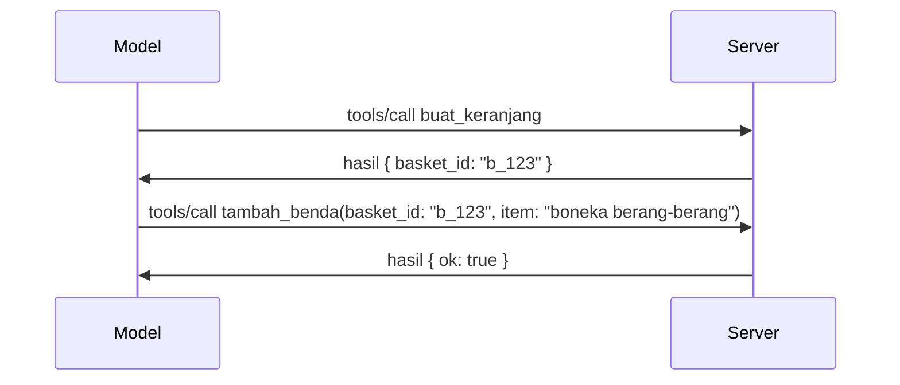

# Apa yang Berubah di MCP: Kandidat Rilis 2026-07-28

> **Status:** Kandidat Rilis. Spesifikasi `2026-07-28` belum final saat penulisan. Pengumuman dilakukan pada 21 Mei 2026, dan dijadwalkan rilis pada 28 Juli 2026. Semua yang ada di pelajaran ini menjelaskan kandidat rilis; periksa [spesifikasi draf](https://modelcontextprotocol.io/specification/draft) dan [catatan perubahan](https://modelcontextprotocol.io/specification/draft/changelog) untuk status terkini sebelum Anda membangun berdasarkan itu. Sisa kurikulum ini ditulis berdasarkan rilis stabil saat ini, **Spesifikasi MCP 2025-11-25**, dan akan diperbarui setelah `2026-07-28` dirilis.

## Ikhtisar

`2026-07-28` adalah revisi terbesar MCP sejak diluncurkan. Enam Proposal Peningkatan Spesifikasi (SEP) menghapus sesi tingkat protokol dan menjadikan MCP tanpa status pada lapisan transport, ekstensi menjadi mekanisme versi kelas utama, dan beberapa fitur yang telah Anda pelajari sebelumnya di kurikulum ini (Roots, Sampling, Logging) ditandai usang di bawah kebijakan siklus hidup baru. Pelajaran ini merangkum apa yang berubah, mengapa itu penting, dan apa artinya bagi kode yang sudah Anda tulis berdasarkan `2025-11-25`.

Sumber: [Kandidat Rilis Spesifikasi MCP 2026-07-28](https://blog.modelcontextprotocol.io/posts/2026-07-28-release-candidate/) (Blog Model Context Protocol, David Soria Parra dan Den Delimarsky).

## Tujuan Pembelajaran

Pada akhir pelajaran ini, Anda akan dapat:

- Menjelaskan mengapa MCP beralih ke inti protokol tanpa status dan masalah apa yang diselesaikannya untuk penyebaran berskala horizontal.
- Mendeskripsikan bagaimana jabat tangan `initialize`/`initialized` dan header `Mcp-Session-Id` digantikan.
- Mengidentifikasi header baru `Mcp-Method` dan `Mcp-Name` serta metadata caching `ttlMs`/`cacheScope`.
- Mengenali kerangka Ekstensi dan dua ekstensi yang disertakan dengan rilis ini: MCP Apps dan Tasks.
- Melist enam SEP otorisasi yang memperkuat penyelarasan OAuth 2.0 / OIDC.
- Mengidentifikasi fitur inti mana (Roots, Sampling, Logging) yang kini sudah usang, dan apa artinya dalam praktik.
- Menjelaskan perubahan Full JSON Schema 2020-12 untuk `inputSchema`/`outputSchema` alat.

## Protokol Tanpa Status

Perubahan utama: MCP menjadi tanpa status di lapisan protokol.

### Sebelumnya (2025-11-25): sesi mengikat Anda ke satu instance server

Memanggil alat melalui Streamable HTTP dimulai dengan jabat tangan `initialize`. Server merespon dengan header `Mcp-Session-Id` yang harus dibawa oleh setiap permintaan berikutnya:

```http
POST /mcp HTTP/1.1
Mcp-Session-Id: 1868a90c-3a3f-4f5b
Content-Type: application/json

{"jsonrpc":"2.0","id":2,"method":"tools/call",
 "params":{"name":"search","arguments":{"q":"otters"}}}
```

Karena sesi terikat pada instance server yang mengeluarkannya, penyebaran berskala horizontal memerlukan **routing lengket** di load balancer dan **penyimpanan sesi bersama** di antara instance.

### Sesudah (2026-07-28): setiap permintaan berdiri sendiri

```http
POST /mcp HTTP/1.1
MCP-Protocol-Version: 2026-07-28
Mcp-Method: tools/call
Mcp-Name: search
Content-Type: application/json

{"jsonrpc":"2.0","id":1,"method":"tools/call",
 "params":{"name":"search","arguments":{"q":"otters"},
           "_meta":{"io.modelcontextprotocol/clientInfo":{"name":"my-app","version":"1.0"}}}}
```

Instance server mana pun dapat menangani permintaan ini. Perubahan utama:

- **Jabat tangan `initialize`/`initialized` dihapus** ([SEP-2575](https://github.com/modelcontextprotocol/modelcontextprotocol/pull/2575)). Versi protokol, info klien, dan kemampuan klien dipindahkan ke `_meta` pada setiap permintaan. Metode baru `server/discover` memungkinkan klien mengambil kemampuan server di awal saat membutuhkannya.
- **Header `Mcp-Session-Id` dan sesi tingkat protokol dihapus** ([SEP-2567](https://github.com/modelcontextprotocol/modelcontextprotocol/pull/2567)). Routing lengket dan penyimpanan sesi bersama tidak lagi diperlukan di lapisan protokol.

### Protokol tanpa status, aplikasi stateful

Menghapus sesi tingkat protokol tidak berarti server Anda tidak bisa bersifat stateful. Pola yang direkomendasikan sama dengan yang selalu digunakan API HTTP: buat pegangan eksplisit (seperti `basket_id`, `browser_id`) dari satu panggilan alat, dan biarkan model melewatkan pegangan itu sebagai argumen biasa pada panggilan berikutnya.



Ini membuat status terlihat dan masuk akal bagi model daripada menyembunyikannya dalam metadata transport, dan memungkinkan instance server apa pun menangani panggilan apa pun.

### Permintaan server-ke-klien, disusun ulang

Protokol tanpa status masih membutuhkan cara agar server dapat meminta sesuatu dari klien saat panggilan berlangsung (misalnya, prompt elisitasi):

- **Permintaan yang diinisiasi server hanya boleh dikeluarkan saat server sedang memproses permintaan klien secara aktif** ([SEP-2260](https://github.com/modelcontextprotocol/modelcontextprotocol/pull/2260)) — sebelumnya rekomendasi, sekarang diwajibkan. Pengguna tidak pernah diprompt tanpa sebab.
- **Permintaan Multi Round-Trip** ([SEP-2322](https://github.com/modelcontextprotocol/modelcontextprotocol/pull/2322)) menggantikan pemeliharaan streaming SSE terbuka. Sebaliknya, server mengembalikan `InputRequiredResult`:

  ```json
  {
    "resultType": "inputRequired",
    "inputRequests": {
      "confirm": {
        "type": "elicitation",
        "message": "Delete 3 files?",
        "schema": { "type": "boolean" }
      }
    },
    "requestState": "eyJzdGVwIjoxLCJmaWxlcyI6WyJhIiwiYiIsImMiXX0="
  }
  ```

  Klien mengumpulkan jawaban dan mengulang panggilan asli dengan `inputResponses` plus `requestState` yang dikembalikan echo. Instance server mana pun dapat melanjutkan ulangan karena semua yang dibutuhkan ada di payload.

### Bisa diarahkan, di-cache, terlacak

Tiga perubahan kecil membuat lalu lintas tanpa status lebih mudah dioperasikan:

- **Header `Mcp-Method` dan `Mcp-Name` diwajibkan pada Streamable HTTP** ([SEP-2243](https://github.com/modelcontextprotocol/modelcontextprotocol/pull/2243)), sehingga load balancer, gateway, dan pembatas laju dapat mengarahkan berdasarkan operasi tanpa memeriksa isi JSON. Server menolak permintaan bila header dan isi tidak cocok.
- **`tools/list` dan hasil baca resource membawa `ttlMs` dan `cacheScope`** ([SEP-2549](https://github.com/modelcontextprotocol/modelcontextprotocol/pull/2549)), dimodelkan berdasarkan HTTP `Cache-Control`. Klien tahu berapa lama hasil daftar masih segar dan apakah aman dibagikan antar pengguna, tanpa perlu streaming SSE jangka panjang untuk mengetahui perubahan.
- **Propagasi W3C Trace Context dalam `_meta` didokumentasikan** ([SEP-414](https://github.com/modelcontextprotocol/modelcontextprotocol/pull/414)), memperbaiki nama kunci `traceparent`, `tracestate`, dan `baggage` sehingga jejak distribusi bisa mengikuti panggilan antar SDK klien, server MCP, dan sistem hilir di backend kompatibel [OpenTelemetry](https://opentelemetry.io/).

## Ekstensi Menjadi Kelas Utama

Ekstensi ada secara informal di `2025-11-25`. [SEP-2133](https://github.com/modelcontextprotocol/modelcontextprotocol/pull/2133) meresmikannya:

- Ekstensi diidentifikasi dengan ID DNS terbalik.
- Mereka dinegosiasikan melalui peta `extensions` pada kemampuan klien dan server.
- Mereka ditempatkan dalam repositori `ext-*` sendiri dengan pengelola delegasi dan versi terpisah dari spesifikasi inti.
- Jalur baru Ekstensi dalam proses SEP memberi mereka jalan dari eksperimen menjadi resmi.

Rilis ini menyertakan dua ekstensi resmi.

### MCP Apps: antarmuka pengguna yang dirender server

[MCP Apps](https://blog.modelcontextprotocol.io/posts/2026-01-26-mcp-apps/) ([SEP-1865](https://github.com/modelcontextprotocol/modelcontextprotocol/pull/1865)) memungkinkan server mengirim antarmuka HTML interaktif yang di-render host dalam iframe sandboxed. Alat mendeklarasikan template UI mereka sebelumnya agar host dapat memfetch awal, menyimpan cache, dan meninjaunya secara keamanan sebelum dijalankan. Anda sudah mempelajari dasarnya di [Pelajaran 15: MCP Apps](../03-GettingStarted/15-mcp-apps/README.md) — di bawah kerangka Ekstensi, MCP Apps kini secara resmi menjadi ekstensi bukan fitur inti eksperimental.

### Tasks naik kelas menjadi ekstensi

Tasks dikirim sebagai fitur inti eksperimen di `2025-11-25`. Penggunaan produksi menunjukkan perlu desain ulang sehingga tempat yang tepat untuknya adalah ekstensi: [ekstensi Tasks](https://github.com/modelcontextprotocol/modelcontextprotocol/pull/2663) membentuk ulang siklus hidup di sekitar model tanpa status — server bisa menjawab `tools/call` dengan pegangan tugas, dan klien menggerakkannya dengan `tasks/get`, `tasks/update`, dan `tasks/cancel`. Pembuatan tugas dikendalikan server: klien mengiklankan ekstensi, dan server memutuskan kapan panggilan harus dijalankan sebagai tugas. `tasks/list` dihapus sepenuhnya karena tidak bisa dijamin keamanannya tanpa sesi.

> **Catatan migrasi:** jika Anda mengimplementasikan API Tasks eksperimental `2025-11-25`, Anda perlu bermigrasi ke siklus hidup ekstensi baru — tidak kompatibel mundur.

## Penguatan Otorisasi

Enam SEP memperkuat [spesifikasi otorisasi](https://modelcontextprotocol.io/specification/draft/basic/authorization) agar lebih sesuai dengan penyebaran OAuth 2.0 / OpenID Connect nyata:

| SEP | Perubahan |
|---|---|
| [SEP-2468](https://github.com/modelcontextprotocol/modelcontextprotocol/pull/2468) | Klien harus memvalidasi parameter `iss` pada respon otorisasi sesuai [RFC 9207](https://www.rfc-editor.org/rfc/rfc9207), mengurangi serangan campur aduk yang umum pada pola MCP satu klien, banyak server. Versi mendatang akan mewajibkan penolakan respon tanpa `iss`. |
| [SEP-837](https://github.com/modelcontextprotocol/modelcontextprotocol/pull/837) | Klien mendeklarasikan `application_type` OpenID Connect mereka selama Pendaftaran Klien Dinamis, menghindari server otorisasi menetapkan klien desktop/CLI sebagai `"web"` dan menolak URI pengalihan localhost-nya. |
| [SEP-2352](https://github.com/modelcontextprotocol/modelcontextprotocol/pull/2352) | Klien mengikat kredensial terdaftar ke `issuer` server otorisasi penerbit dan mendaftar ulang saat sumber daya berpindah antar server otorisasi. |
| [SEP-2207](https://github.com/modelcontextprotocol/modelcontextprotocol/pull/2207) | Menerangkan cara meminta token refresh dari server otorisasi bergaya OpenID Connect. |
| [SEP-2350](https://github.com/modelcontextprotocol/modelcontextprotocol/pull/2350) | Menjelaskan akumulasi lingkup selama otorisasi step-up. |
| [SEP-2351](https://github.com/modelcontextprotocol/modelcontextprotocol/pull/2351) | Menjelaskan sufiks penemuan `.well-known`. |

Jika Anda membangun server otorisasi untuk MCP hari ini, mulai kirimkan `iss` pada respon otorisasi sekarang — lihat [02-Security](../02-Security/README.md) untuk panduan otorisasi saat ini yang akan menjadi dasar.

## Roots, Sampling, dan Logging Ditandai Usang

Di bawah [kebijakan siklus hidup fitur](https://github.com/modelcontextprotocol/modelcontextprotocol/pull/2577) baru ([SEP-2577](https://github.com/modelcontextprotocol/modelcontextprotocol/pull/2577)), tiga primitif klien inti yang Anda pelajari di [Konsep Inti](./README.md#roots) berpindah ke status **Usang**:

| Fitur | Pengganti yang direkomendasikan |
|---|---|
| Roots | Parameter alat, URI sumber daya, atau konfigurasi server |
| Sampling | Integrasi langsung dengan API penyedia LLM |
| Logging | `stderr` untuk transport stdio; OpenTelemetry untuk observabilitas terstruktur |

Ini adalah **penanda usang hanya anotasi**: metode, tipe, dan flag kapabilitas tetap berfungsi di rilis ini dan setiap versi spesifikasi yang diterbitkan dalam satu tahun setelahnya. Menghapus salah satunya secara langsung akan memerlukan SEP terpisah di bawah kebijakan siklus hidup — jadi tidak ada yang rusak pada contoh [Sampling](../03-GettingStarted/14-sampling/README.md) Anda saat ini, tapi server baru harus menggunakan pola pengganti di atas.

## Full JSON Schema 2020-12 untuk Alat

`inputSchema` dan `outputSchema` alat ditingkatkan ke [JSON Schema 2020-12](https://json-schema.org/draft/2020-12) penuh ([SEP-2106](https://github.com/modelcontextprotocol/modelcontextprotocol/pull/2106)):

- Skema input tetap dengan batas `type: "object"` di akar tetapi sekarang mengizinkan komposisi (`oneOf`, `anyOf`, `allOf`), kondisi, dan referensi (`$ref`, `$defs`).
- Skema output tanpa batasan, dan `structuredContent` kini dapat berupa nilai JSON apa pun bukan hanya objek.
- Implementasi tidak boleh otomatis dereferensi URI eksternal `$ref` dan sebaiknya membatasi kedalaman skema dan waktu validasi (pertimbangan denial-of-service bila Anda memvalidasi skema di sisi server).

Terpisah, kode error untuk sumber daya yang hilang berubah dari MCP-khusus `-32002` ke standar JSON-RPC `-32602` (Invalid Params) ([SEP-2164](https://github.com/modelcontextprotocol/modelcontextprotocol/pull/2164)). Jika klien Anda mencocokkan nilai literal `-32002`, Anda perlu memperbaruinya.

## Bagaimana Protokol Berkembang Dari Sini

Rilis ini mengandung perubahan yang memecah kompatibilitas, yang tidak dimaksudkan pemelihara MCP menjadi norma ke depan. Tiga SEP tata kelola bertujuan mencegah pengulangan:

- **Kebijakan siklus hidup fitur** memberi setiap fitur jalur Aktif → Usang → Dihapus dengan minimal dua belas bulan antara usang dan penghapusan paling awal.
- **Kerangka Ekstensi** memungkinkan kapabilitas baru dikirim sebagai ekstensi opt-in dan distabilkan di sana sebelum (jika pernah) masuk ke spesifikasi inti.

- SEP Jalur Standar tidak dapat mencapai status Final sampai skenario yang cocok masuk ke dalam [paket konformansi](https://github.com/modelcontextprotocol/conformance) ([SEP-2484](https://github.com/modelcontextprotocol/modelcontextprotocol/pull/2484)) — paket yang sama dengan yang digunakan oleh [sistem tingkatan SDK](https://github.com/modelcontextprotocol/modelcontextprotocol/pull/1777) untuk menilai SDK resmi.

## Garis Waktu Rilis dan Validasi

- Kandidat rilis dikunci pada 21 Mei 2026.
- Spesifikasi final dijadwalkan pada 28 Juli 2026.
- Jendela sepuluh minggu di antara keduanya memungkinkan pemelihara SDK dan pengembang klien memvalidasi perubahan terhadap beban kerja nyata; SDK Tingkat 1 diharapkan mengirim dukungan dalam jendela ini sesuai dengan [sistem tingkatan SDK](https://modelcontextprotocol.io/docs/sdk).
- Pantau seluruh set perubahan dalam [spesifikasi draf](https://modelcontextprotocol.io/specification/draft) dan [log perubahan](https://modelcontextprotocol.io/specification/draft/changelog) terkait.

## Apa Artinya Ini untuk Kurikulum Ini

Semua yang Anda pelajari sejauh ini dalam kursus ini menargetkan **2025-11-25**, yang tetap menjadi spesifikasi stabil saat ini sampai `2026-07-28` dirilis. Secara konkret:

- **Sesi dan jabat tangan `initialize`** (dibahas di [Konsep Inti](./README.md) dan [Pelajaran 6: Streaming HTTP](../03-GettingStarted/06-http-streaming/README.md)) masih berfungsi seperti yang didokumentasikan saat ini, tapi harapkan akan digantikan oleh model permintaan tanpa status di atas setelah Anda memperbarui ke SDK yang kompatibel dengan `2026-07-28`.
- **Sampling dan Roots** (juga dibahas di [Konsep Inti](./README.md)) tetap berfungsi penuh tetapi sudah usang — desain baru sebaiknya memilih pola pengganti yang tercantum di atas.
- **Fitur Tasks eksperimental**, jika Anda sudah menggunakannya, perlu migrasi ke siklus hidup baru ekstensi Tasks.
- **Aplikasi MCP** ([Pelajaran 15](../03-GettingStarted/15-mcp-apps/README.md)) tidak terpengaruh secara praktik; hanya berpindah di bawah kerangka Ekstensi formal.

## Sumber Daya Tambahan

- [Kandidat Rilis Spesifikasi MCP 2026-07-28 (posting blog)](https://blog.modelcontextprotocol.io/posts/2026-07-28-release-candidate/)
- [Masa Depan Transport MCP](https://blog.modelcontextprotocol.io/posts/2025-12-19-mcp-transport-future/)
- [Spesifikasi Draf MCP](https://modelcontextprotocol.io/specification/draft)
- [Log Perubahan Draf MCP](https://modelcontextprotocol.io/specification/draft/changelog)
- [Panduan SEP](https://modelcontextprotocol.io/community/sep-guidelines)
- [Sistem Tingkatan SDK MCP](https://modelcontextprotocol.io/docs/sdk)

## Langkah Selanjutnya

Kembali ke [Konsep Inti](./README.md) atau lanjutkan ke [Keamanan](../02-Security/README.md) untuk melihat bagaimana panduan `2025-11-25` hari ini dipetakan ke hal yang akan datang.

---

<!-- CO-OP TRANSLATOR DISCLAIMER START -->
**Penafian**:
Dokumen ini telah diterjemahkan menggunakan layanan terjemahan AI [Co-op Translator](https://github.com/Azure/co-op-translator). Meskipun kami berupaya untuk mencapai akurasi, harap diketahui bahwa terjemahan otomatis mungkin mengandung kesalahan atau ketidakakuratan. Dokumen asli dalam bahasa aslinya harus dianggap sebagai sumber yang sah. Untuk informasi penting, disarankan menggunakan terjemahan profesional oleh manusia. Kami tidak bertanggung jawab atas kesalahpahaman atau penafsiran yang keliru yang timbul dari penggunaan terjemahan ini.
<!-- CO-OP TRANSLATOR DISCLAIMER END -->