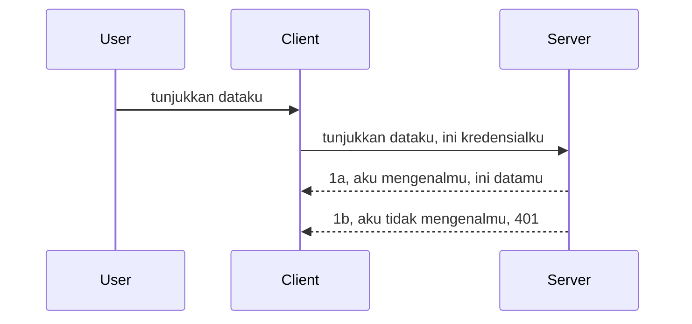

# Autentikasi sederhana

SDK MCP mendukung penggunaan OAuth 2.1 yang sebenarnya adalah proses yang cukup rumit melibatkan konsep seperti server autentikasi, server sumber daya, pengiriman kredensial, mendapatkan kode, menukarkan kode tersebut dengan token pembawa sampai akhirnya Anda bisa mendapatkan data sumber daya. Jika Anda belum terbiasa dengan OAuth yang merupakan hal bagus untuk diimplementasikan, ada baiknya memulai dengan tingkat autentikasi dasar dan membangun keamanan yang lebih baik secara bertahap. Itulah mengapa bab ini ada, untuk membimbing Anda menuju autentikasi yang lebih maju.

## Autentikasi, maksudnya apa?

Autentikasi adalah singkatan dari authentication dan authorization. Gagasan dasarnya adalah kita perlu melakukan dua hal:

- **Authentication**, yaitu proses menentukan apakah kita akan mengizinkan seseorang masuk ke rumah kita, bahwa mereka memiliki hak untuk "di sini" yaitu memiliki akses ke server sumber daya kita tempat fitur MCP Server kita berada.
- **Authorization**, adalah proses menentukan apakah pengguna harus memiliki akses ke sumber daya spesifik yang mereka minta, misalnya pesanan atau produk tertentu atau apakah mereka hanya diizinkan membaca konten tapi tidak menghapus misalnya.

## Kredensial: bagaimana kita memberi tahu sistem siapa kita

Nah, kebanyakan pengembang web mulai berpikir dalam hal menyediakan kredensial ke server, biasanya sebuah rahasia yang menyatakan apakah mereka diizinkan "Authentication" untuk berada di sini. Kredensial ini biasanya berupa versi username dan password yang di-encode base64 atau kunci API yang mengidentifikasi pengguna spesifik. 

Ini melibatkan pengirimannya lewat header bernama "Authorization" seperti berikut:

```json
{ "Authorization": "secret123" }
```

Ini biasanya disebut sebagai autentikasi dasar. Cara alurnya bekerja secara keseluruhan adalah seperti berikut:



Sekarang setelah kita memahami bagaimana cara kerjanya dari sudut pandang alur, bagaimana kita mengimplementasikannya? Nah, kebanyakan server web memiliki konsep yang disebut middleware, sebuah potongan kode yang dijalankan sebagai bagian dari permintaan yang dapat memverifikasi kredensial, dan jika kredensial valid dapat membiarkan permintaan melewati. Jika permintaan tidak memiliki kredensial yang valid maka Anda akan mendapatkan error autentikasi. Mari kita lihat bagaimana ini bisa diimplementasikan:

**Python**

```python
class AuthMiddleware(BaseHTTPMiddleware):
    async def dispatch(self, request, call_next):

        has_header = request.headers.get("Authorization")
        if not has_header:
            print("-> Missing Authorization header!")
            return Response(status_code=401, content="Unauthorized")

        if not valid_token(has_header):
            print("-> Invalid token!")
            return Response(status_code=403, content="Forbidden")

        print("Valid token, proceeding...")
       
        response = await call_next(request)
        # tambahkan header pelanggan apa pun atau ubah respons dengan cara tertentu
        return response


starlette_app.add_middleware(CustomHeaderMiddleware)
```

Di sini kita memiliki: 

- Membuat middleware bernama `AuthMiddleware` di mana metode `dispatch`-nya dipanggil oleh server web. 
- Menambahkan middleware ke server web:

    ```python
    starlette_app.add_middleware(AuthMiddleware)
    ```

- Menulis logika validasi yang memeriksa apakah header Authorization ada dan apakah rahasia yang dikirim valid:

    ```python
    has_header = request.headers.get("Authorization")
    if not has_header:
        print("-> Missing Authorization header!")
        return Response(status_code=401, content="Unauthorized")

    if not valid_token(has_header):
        print("-> Invalid token!")
        return Response(status_code=403, content="Forbidden")
    ```

    jika rahasia ada dan valid maka kita membiarkan permintaan melewati dengan memanggil `call_next` dan mengembalikan respons.

    ```python
    response = await call_next(request)
    # tambahkan header pelanggan apa pun atau ubah respons dengan cara tertentu
    return response
    ```

Cara kerjanya adalah jika permintaan web dibuat ke server, middleware akan dipanggil dan dengan implementasinya akan membiarkan permintaan melewati atau mengembalikan error yang menunjukkan klien tidak diizinkan melanjutkan.

**TypeScript**

Di sini kita membuat middleware dengan framework populer Express dan mencegat permintaan sebelum mencapai MCP Server. Berikut kodenya:

```typescript
function isValid(secret) {
    return secret === "secret123";
}

app.use((req, res, next) => {
    // 1. Header otorisasi ada?
    if(!req.headers["Authorization"]) {
        res.status(401).send('Unauthorized');
    }
    
    let token = req.headers["Authorization"];

    // 2. Periksa keabsahan.
    if(!isValid(token)) {
        res.status(403).send('Forbidden');
    }

   
    console.log('Middleware executed');
    // 3. Meneruskan permintaan ke langkah berikutnya dalam jalur permintaan.
    next();
});
```

Dalam kode ini kita:

1. Memeriksa apakah header Authorization ada, jika tidak, kita kirim error 401.
2. Memastikan kredensial/token valid, jika tidak, kita kirim error 403.
3. Akhirnya meneruskan permintaan dalam alur permintaan dan mengembalikan sumber daya yang diminta.

## Latihan: Implementasikan autentikasi

Mari kita gunakan pengetahuan kita dan coba implementasi. Berikut rencananya:

Server

- Membuat server web dan instance MCP.
- Mengimplementasikan middleware untuk server.

Client 

- Mengirim permintaan web dengan kredensial melalui header.

### -1- Membuat server web dan instance MCP

> **Melihat ke depan:** contoh TypeScript di bawah melacak transport HTTP dalam peta `transports` yang dikunci oleh `mcp-session-id`, sesuai **Spesifikasi MCP 2025-11-25**. Kandidat rilis `2026-07-28` menghapus handshake `initialize` dan ID sesi sepenuhnya, jadi peta transport per-sesi ini akan hilang demi permintaan yang stateless dan mandiri. Lihat [Apa yang Berubah di MCP: Kandidat Rilis 2026-07-28](../../01-CoreConcepts/mcp-2026-07-28-release-candidate.md).

Di langkah pertama kita perlu membuat instance server web dan MCP Server.

**Python**

Di sini kita membuat instance MCP server, membuat aplikasi web starlette dan meng-host-nya dengan uvicorn.

```python
# membuat Server MCP

app = FastMCP(
    name="MCP Resource Server",
    instructions="Resource Server that validates tokens via Authorization Server introspection",
    host=settings["host"],
    port=settings["port"],
    debug=True
)

# membuat aplikasi web starlette
starlette_app = app.streamable_http_app()

# melayani aplikasi melalui uvicorn
async def run(starlette_app):
    import uvicorn
    config = uvicorn.Config(
            starlette_app,
            host=app.settings.host,
            port=app.settings.port,
            log_level=app.settings.log_level.lower(),
        )
    server = uvicorn.Server(config)
    await server.serve()

run(starlette_app)
```

Dalam kode ini kita:

- Membuat MCP Server.
- Membangun aplikasi web starlette dari MCP Server, `app.streamable_http_app()`.
- Meng-host dan melayani aplikasi web menggunakan uvicorn `server.serve()`.

**TypeScript**

Di sini kita membuat instance MCP Server.

```typescript
const server = new McpServer({
      name: "example-server",
      version: "1.0.0"
    });

    // ... siapkan sumber daya server, alat, dan prompt ...
```

Pembuatan MCP Server ini perlu dilakukan dalam definisi route POST /mcp kita, jadi mari kita ambil kode di atas dan pindahkan seperti ini:

```typescript
import express from "express";
import { randomUUID } from "node:crypto";
import { McpServer } from "@modelcontextprotocol/sdk/server/mcp.js";
import { StreamableHTTPServerTransport } from "@modelcontextprotocol/sdk/server/streamableHttp.js";
import { isInitializeRequest } from "@modelcontextprotocol/sdk/types.js"

const app = express();
app.use(express.json());

// Peta untuk menyimpan transport berdasarkan ID sesi
const transports: { [sessionId: string]: StreamableHTTPServerTransport } = {};

// Tangani permintaan POST untuk komunikasi klien-ke-server
app.post('/mcp', async (req, res) => {
  // Periksa apakah ID sesi sudah ada
  const sessionId = req.headers['mcp-session-id'] as string | undefined;
  let transport: StreamableHTTPServerTransport;

  if (sessionId && transports[sessionId]) {
    // Gunakan kembali transport yang sudah ada
    transport = transports[sessionId];
  } else if (!sessionId && isInitializeRequest(req.body)) {
    // Permintaan inisialisasi baru
    transport = new StreamableHTTPServerTransport({
      sessionIdGenerator: () => randomUUID(),
      onsessioninitialized: (sessionId) => {
        // Simpan transport berdasarkan ID sesi
        transports[sessionId] = transport;
      },
      // Perlindungan DNS rebinding dinonaktifkan secara default untuk kompatibilitas mundur. Jika Anda menjalankan server ini
      // secara lokal, pastikan untuk mengatur:
      // enableDnsRebindingProtection: true,
      // allowedHosts: ['127.0.0.1'],
    });

    // Bersihkan transport saat ditutup
    transport.onclose = () => {
      if (transport.sessionId) {
        delete transports[transport.sessionId];
      }
    };
    const server = new McpServer({
      name: "example-server",
      version: "1.0.0"
    });

    // ... atur sumber daya server, alat, dan prompt ...

    // Sambungkan ke server MCP
    await server.connect(transport);
  } else {
    // Permintaan tidak valid
    res.status(400).json({
      jsonrpc: '2.0',
      error: {
        code: -32000,
        message: 'Bad Request: No valid session ID provided',
      },
      id: null,
    });
    return;
  }

  // Tangani permintaan
  await transport.handleRequest(req, res, req.body);
});

// Penangan yang dapat digunakan ulang untuk permintaan GET dan DELETE
const handleSessionRequest = async (req: express.Request, res: express.Response) => {
  const sessionId = req.headers['mcp-session-id'] as string | undefined;
  if (!sessionId || !transports[sessionId]) {
    res.status(400).send('Invalid or missing session ID');
    return;
  }
  
  const transport = transports[sessionId];
  await transport.handleRequest(req, res);
};

// Tangani permintaan GET untuk notifikasi server-ke-klien melalui SSE
app.get('/mcp', handleSessionRequest);

// Tangani permintaan DELETE untuk penghentian sesi
app.delete('/mcp', handleSessionRequest);

app.listen(3000);
```

Sekarang Anda lihat bagaimana pembuatan MCP Server dipindahkan ke dalam `app.post("/mcp")`.

Mari lanjut ke langkah berikutnya membuat middleware agar kita bisa memvalidasi kredensial masuk.

### -2- Mengimplementasikan middleware untuk server

Selanjutnya kita ke bagian middleware. Di sini kita akan membuat middleware yang mencari kredensial di header `Authorization` dan memvalidasinya. Jika bisa diterima maka permintaan akan dilanjutkan untuk melakukan apa yang diperlukan (misal listing tools, membaca sumber daya atau fungsi MCP apa pun yang diminta client).

**Python**

Untuk membuat middleware, kita perlu membuat kelas yang mewarisi dari `BaseHTTPMiddleware`. Ada dua bagian menarik:

- Permintaan `request`, dari mana kita membaca info header.
- `call_next` callback yang harus kita panggil jika klien membawa kredensial yang kita terima.

Pertama, kita harus menangani kasus jika header `Authorization` hilang:

```python
has_header = request.headers.get("Authorization")

# tidak ada header, gagal dengan 401, jika tidak lanjutkan.
if not has_header:
    print("-> Missing Authorization header!")
    return Response(status_code=401, content="Unauthorized")
```

Di sini kita mengirim pesan 401 unauthorized karena klien gagal autentikasi.

Selanjutnya, jika kredensial dikirim, kita perlu memeriksa validitasnya seperti ini:

```python
 if not valid_token(has_header):
    print("-> Invalid token!")
    return Response(status_code=403, content="Forbidden")
```

Perhatikan bahwa kita mengirim pesan 403 forbidden di atas. Mari lihat keseluruhan middleware di bawah yang mengimplementasikan semua yang disebutkan tadi:

```python
class AuthMiddleware(BaseHTTPMiddleware):
    async def dispatch(self, request, call_next):

        has_header = request.headers.get("Authorization")
        if not has_header:
            print("-> Missing Authorization header!")
            return Response(status_code=401, content="Unauthorized")

        if not valid_token(has_header):
            print("-> Invalid token!")
            return Response(status_code=403, content="Forbidden")

        print("Valid token, proceeding...")
        print(f"-> Received {request.method} {request.url}")
        response = await call_next(request)
        response.headers['Custom'] = 'Example'
        return response

```

Bagus, tapi bagaimana dengan fungsi `valid_token`? Berikut ini:

```python
# JANGAN digunakan untuk produksi - tingkatkan !!
def valid_token(token: str) -> bool:
    # hapus awalan "Bearer "
    if token.startswith("Bearer "):
        token = token[7:]
        return token == "secret-token"
    return False
```

Ini jelas perlu diperbaiki lebih lanjut. 

PENTING: Anda TIDAK PERNAH boleh menyimpan rahasia seperti ini di kode. Idealnya ambil nilai pembanding dari sumber data atau dari IDP (penyedia layanan identitas) atau lebih baik lagi, biarkan IDP yang melakukan validasi.

**TypeScript**

Untuk mengimplementasikan ini dengan Express, kita perlu memanggil metode `use` yang menerima fungsi middleware.

Kita harus:

- Berinteraksi dengan variabel permintaan untuk memeriksa kredensial yang diteruskan di properti `Authorization`.
- Memvalidasi kredensial, dan jika valid membiarkan permintaan dilanjutkan agar permintaan MCP klien bisa melakukan tugasnya (misal list tools, baca sumber daya atau lainnya).

Di sini, kita memeriksa apakah header `Authorization` ada dan jika tidak, kita hentikan permintaan:

```typescript
if(!req.headers["authorization"]) {
    res.status(401).send('Unauthorized');
    return;
}
```

Jika header tidak dikirim dari awal, Anda menerima 401.

Selanjutnya, kita periksa apakah kredensial valid, jika tidak kita kembali hentikan permintaan tapi dengan pesan yang sedikit berbeda:

```typescript
if(!isValid(token)) {
    res.status(403).send('Forbidden');
    return;
} 
```

Perhatikan sekarang Anda mendapat error 403.

Berikut kode lengkapnya:

```typescript
app.use((req, res, next) => {
    console.log('Request received:', req.method, req.url, req.headers);
    console.log('Headers:', req.headers["authorization"]);
    if(!req.headers["authorization"]) {
        res.status(401).send('Unauthorized');
        return;
    }
    
    let token = req.headers["authorization"];

    if(!isValid(token)) {
        res.status(403).send('Forbidden');
        return;
    }  

    console.log('Middleware executed');
    next();
});
```

Kita sudah menyiapkan server web untuk menerima middleware memeriksa kredensial yang semoga dikirim klien. Bagaimana dengan kliennya sendiri?

### -3- Mengirim permintaan web dengan kredensial melalui header

Kita perlu memastikan klien mengirim kredensial lewat header. Karena kita akan menggunakan klien MCP, kita harus mencari tahu cara melakukannya.

**Python**

Untuk klien, kita harus mengirim header dengan kredensial seperti ini:

```python
# JANGAN menuliskan nilai secara langsung, simpan setidaknya dalam variabel lingkungan atau penyimpanan yang lebih aman
token = "secret-token"

async with streamablehttp_client(
        url = f"http://localhost:{port}/mcp",
        headers = {"Authorization": f"Bearer {token}"}
    ) as (
        read_stream,
        write_stream,
        session_callback,
    ):
        async with ClientSession(
            read_stream,
            write_stream
        ) as session:
            await session.initialize()
      
            # TODO, apa yang ingin kamu lakukan di klien, misalnya daftar alat, panggil alat, dll.
```

Perhatikan bagaimana bagian `headers` diisi seperti ini `headers = {"Authorization": f"Bearer {token}"}`.

**TypeScript**

Kita bisa menyelesaikan ini dengan dua langkah:

1. Mengisi objek konfigurasi dengan kredensial kita.
2. Mengoper objek konfigurasi ke transport.

```typescript

// JANGAN hardcode nilai seperti yang ditunjukkan di sini. Minimal jadikan sebagai variabel env dan gunakan sesuatu seperti dotenv (dalam mode pengembangan).
let token = "secret123"

// definisikan objek opsi transport klien
let options: StreamableHTTPClientTransportOptions = {
  sessionId: sessionId,
  requestInit: {
    headers: {
      "Authorization": "secret123"
    }
  }
};

// lewati objek opsi ke transportasi
async function main() {
   const transport = new StreamableHTTPClientTransport(
      new URL(serverUrl),
      options
   );
```

Di sini Anda lihat di atas bagaimana kita membuat objek `options` dan menaruh headers kita dalam properti `requestInit`.

PENTING: Lalu bagaimana kita perbaiki dari sini? Implementasi sekarang menghadapi masalah. Pertama, mengirim kredensial seperti ini cukup berisiko kecuali setidaknya menggunakan HTTPS. Bahkan begitu, kredensial bisa dicuri, jadi Anda butuh sistem untuk mudah mencabut token dan menambah pemeriksaan seperti dari mana permintaan berasal di dunia, apakah permintaan terjadi terlalu sering (perilaku bot), singkatnya banyak hal yang perlu diperhatikan. 

Namun harus dikatakan, untuk API sangat sederhana di mana Anda tidak ingin siapa pun memanggil API tanpa autentikasi dan apa yang kita miliki di sini adalah awal yang baik. 

Dengan itu, mari coba tingkatkan keamanannya sedikit menggunakan format standar seperti JSON Web Token, yang juga dikenal sebagai JWT atau token "JOT".

## JSON Web Tokens, JWT

Jadi, kita mencoba memperbaiki dari mengirim kredensial sederhana. Apa peningkatan langsung yang kita dapat dengan mengadopsi JWT?

- **Peningkatan keamanan**. Dalam autentikasi dasar, Anda mengirim username dan password sebagai token base64 (atau kunci API) berulang kali yang meningkatkan risiko. Dengan JWT, Anda mengirim username dan password dan mendapatkan token sebagai gantinya dan token ini juga terbatas waktu sehingga berlaku sampai kadaluarsa. JWT memungkinkan kontrol akses yang lebih terperinci menggunakan peran, lingkup, dan izin.
- **Stateless dan skalabilitas**. JWT mandiri, membawa semua info pengguna dan menghilangkan kebutuhan penyimpanan sesi di server. Token juga bisa divalidasi secara lokal.
- **Interoperabilitas dan federasi**. JWT pusat dari Open ID Connect dan digunakan dengan penyedia identitas seperti Entra ID, Google Identity dan Auth0. Mereka juga memungkinkan single sign on dan banyak lagi, sehingga cocok untuk tingkat enterprise.
- **Modularitas dan fleksibilitas**. JWT juga bisa digunakan dengan API Gateway seperti Azure API Management, NGINX dan lainnya. Mendukung skenario autentikasi dan komunikasi server-ke-layanan termasuk pemalsuan dan delegasi.
- **Performa dan caching**. JWT bisa di-cache setelah decoding yang mengurangi kebutuhan parsing. Ini membantu terutama dengan aplikasi lalu lintas tinggi karena meningkatkan throughput dan mengurangi beban infrastruktur.
- **Fitur maju**. Mendukung introspeksi (pemeriksaan validitas di server) dan pencabutan (membuat token tidak valid).

Dengan semua manfaat ini, mari kita lihat bagaimana kita bisa mengambil implementasi kita ke level berikutnya.

## Mengubah autentikasi dasar menjadi JWT

Jadi, perubahan yang perlu kita buat pada tingkat tinggi adalah:

- **Belajar membangun token JWT** dan membuatnya siap dikirim dari klien ke server.
- **Memvalidasi token JWT**, dan jika valid, biarkan klien mengakses sumber daya kita.
- **Penyimpanan token yang aman**. Bagaimana kita menyimpan token ini.
- **Melindungi route**. Kita perlu melindungi route, dalam kasus kita, melindungi route dan fitur MCP spesifik.
- **Menambahkan refresh token**. Pastikan kita membuat token yang masa hidupnya pendek tetapi ada refresh token yang masa hidupnya panjang yang bisa digunakan untuk mendapatkan token baru jika token utama kadaluarsa. Juga pastikan ada endpoint refresh dan strategi rotasi.

### -1- Membangun token JWT

Pertama, token JWT memiliki bagian-bagian berikut:

- **header**, algoritma yang digunakan dan tipe token.
- **payload**, klaim, seperti sub (pengguna atau entitas yang diwakili token. Dalam skenario autentikasi ini biasanya userid), exp (waktu kedaluwarsa), role (peran)
- **signature**, ditandatangani dengan rahasia atau kunci privat.

Untuk ini, kita perlu membangun header, payload dan token yang ter-encode.

**Python**

```python

import jwt
import jwt
from jwt.exceptions import ExpiredSignatureError, InvalidTokenError
import datetime

# Kunci rahasia yang digunakan untuk menandatangani JWT
secret_key = 'your-secret-key'

header = {
    "alg": "HS256",
    "typ": "JWT"
}

# info pengguna dan klaim serta waktu kedaluwarsanya
payload = {
    "sub": "1234567890",               # Subjek (ID pengguna)
    "name": "User Userson",                # Klaim khusus
    "admin": True,                     # Klaim khusus
    "iat": datetime.datetime.utcnow(),# Diterbitkan pada
    "exp": datetime.datetime.utcnow() + datetime.timedelta(hours=1)  # Kedaluwarsa
}

# enkode itu
encoded_jwt = jwt.encode(payload, secret_key, algorithm="HS256", headers=header)
```

Dalam kode di atas kita sudah:

- Mendefinisikan header menggunakan algoritma HS256 dan tipe JWT.
- Membuat payload yang berisi subjek atau id pengguna, username, role, waktu penerbitan dan waktu kadaluarsa sehingga mengimplementasikan aspek terbatas waktu yang kita sebut sebelumnya.

**TypeScript**

Di sini kita perlu beberapa dependensi yang membantu kita membangun token JWT.

Dependensi

```sh

npm install jsonwebtoken
npm install --save-dev @types/jsonwebtoken
```

Sekarang setelah itu siap, mari buat header, payload dan dari situ buat token ter-encode.

```typescript
import jwt from 'jsonwebtoken';

const secretKey = 'your-secret-key'; // Gunakan variabel lingkungan di produksi

// Definisikan payload
const payload = {
  sub: '1234567890',
  name: 'User usersson',
  admin: true,
  iat: Math.floor(Date.now() / 1000), // Diterbitkan pada
  exp: Math.floor(Date.now() / 1000) + 60 * 60 // Berakhir dalam 1 jam
};

// Definisikan header (opsional, jsonwebtoken mengatur default)
const header = {
  alg: 'HS256',
  typ: 'JWT'
};

// Buat token
const token = jwt.sign(payload, secretKey, {
  algorithm: 'HS256',
  header: header
});

console.log('JWT:', token);
```

Token ini adalah:

Ditandatangani dengan HS256
Berlaku selama 1 jam
Memiliki klaim seperti sub, name, admin, iat, dan exp.

### -2- Memvalidasi token

Kita juga perlu memvalidasi token, ini yang harus dilakukan server untuk memastikan apa yang dikirim klien memang valid. Ada banyak pemeriksaan yang harus kita lakukan dari validasi struktur sampai validitas token. Anda juga dianjurkan menambahkan pemeriksaan lain seperti apakah pengguna ada dalam sistem Anda dan lainnya.

Untuk memvalidasi token, kita perlu mendekodenya agar bisa membacanya dan mulai memeriksa validitasnya:

**Python**

```python

# Dekode dan verifikasi JWT
try:
    decoded = jwt.decode(token, secret_key, algorithms=["HS256"])
    print("✅ Token is valid.")
    print("Decoded claims:")
    for key, value in decoded.items():
        print(f"  {key}: {value}")
except ExpiredSignatureError:
    print("❌ Token has expired.")
except InvalidTokenError as e:
    print(f"❌ Invalid token: {e}")

```


Dalam kode ini, kita memanggil `jwt.decode` menggunakan token, kunci rahasia, dan algoritma yang dipilih sebagai input. Perhatikan bagaimana kita menggunakan konstruksi try-catch karena kegagalan validasi menyebabkan error muncul.

**TypeScript**

Di sini kita perlu memanggil `jwt.verify` untuk mendapatkan versi token yang sudah didekode yang bisa kita analisis lebih lanjut. Jika panggilan ini gagal, itu berarti struktur token salah atau token sudah tidak valid lagi.

```typescript

try {
  const decoded = jwt.verify(token, secretKey);
  console.log('Decoded Payload:', decoded);
} catch (err) {
  console.error('Token verification failed:', err);
}
```

CATATAN: seperti yang disebutkan sebelumnya, kita harus melakukan pemeriksaan tambahan untuk memastikan token ini menunjukkan pengguna dalam sistem kita dan memastikan pengguna memiliki hak yang diklaim.

Selanjutnya, mari kita lihat kontrol akses berbasis peran, juga dikenal sebagai RBAC.

## Menambahkan kontrol akses berbasis peran

Idenya adalah kita ingin menyatakan bahwa peran yang berbeda memiliki izin yang berbeda. Misalnya, kita menganggap admin bisa melakukan semuanya, pengguna biasa bisa melakukan baca/tulis dan tamu hanya bisa membaca. Oleh karena itu, berikut beberapa tingkat izin yang mungkin:

- Admin.Tulis
- Pengguna.Baca
- Tamu.Baca

Mari kita lihat bagaimana kita bisa menerapkan kontrol seperti ini dengan middleware. Middleware bisa ditambahkan per rute maupun untuk semua rute.

**Python**

```python
from starlette.middleware.base import BaseHTTPMiddleware
from starlette.responses import JSONResponse
import jwt

# JANGAN menyimpan rahasia dalam kode seperti ini, ini hanya untuk tujuan demonstrasi. Baca dari tempat yang aman.
SECRET_KEY = "your-secret-key" # letakkan ini di variabel lingkungan
REQUIRED_PERMISSION = "User.Read"

class JWTPermissionMiddleware(BaseHTTPMiddleware):
    async def dispatch(self, request, call_next):
        auth_header = request.headers.get("Authorization")
        if not auth_header or not auth_header.startswith("Bearer "):
            return JSONResponse({"error": "Missing or invalid Authorization header"}, status_code=401)

        token = auth_header.split(" ")[1]
        try:
            decoded = jwt.decode(token, SECRET_KEY, algorithms=["HS256"])
        except jwt.ExpiredSignatureError:
            return JSONResponse({"error": "Token expired"}, status_code=401)
        except jwt.InvalidTokenError:
            return JSONResponse({"error": "Invalid token"}, status_code=401)

        permissions = decoded.get("permissions", [])
        if REQUIRED_PERMISSION not in permissions:
            return JSONResponse({"error": "Permission denied"}, status_code=403)

        request.state.user = decoded
        return await call_next(request)


```

Ada beberapa cara berbeda untuk menambahkan middleware seperti di bawah ini:

```python

# Alt 1: tambahkan middleware saat membangun aplikasi starlette
middleware = [
    Middleware(JWTPermissionMiddleware)
]

app = Starlette(routes=routes, middleware=middleware)

# Alt 2: tambahkan middleware setelah aplikasi starlette sudah dibangun
starlette_app.add_middleware(JWTPermissionMiddleware)

# Alt 3: tambahkan middleware per rute
routes = [
    Route(
        "/mcp",
        endpoint=..., # penangkap
        middleware=[Middleware(JWTPermissionMiddleware)]
    )
]
```

**TypeScript**

Kita bisa menggunakan `app.use` dan middleware yang akan berjalan untuk semua permintaan.

```typescript
app.use((req, res, next) => {
    console.log('Request received:', req.method, req.url, req.headers);
    console.log('Headers:', req.headers["authorization"]);

    // 1. Periksa apakah header otorisasi telah dikirim

    if(!req.headers["authorization"]) {
        res.status(401).send('Unauthorized');
        return;
    }
    
    let token = req.headers["authorization"];

    // 2. Periksa apakah token valid
    if(!isValid(token)) {
        res.status(403).send('Forbidden');
        return;
    }  

    // 3. Periksa apakah pengguna token ada dalam sistem kami
    if(!isExistingUser(token)) {
        res.status(403).send('Forbidden');
        console.log("User does not exist");
        return;
    }
    console.log("User exists");

    // 4. Verifikasi token memiliki izin yang benar
    if(!hasScopes(token, ["User.Read"])){
        res.status(403).send('Forbidden - insufficient scopes');
    }

    console.log("User has required scopes");

    console.log('Middleware executed');
    next();
});

```

Ada beberapa hal yang bisa kita biarkan middleware lakukan dan yang middleware HARUS lakukan, yaitu:

1. Memeriksa apakah header otorisasi ada
2. Memeriksa apakah token valid, kita memanggil `isValid` yang merupakan metode yang kita buat untuk memeriksa integritas dan validitas token JWT.
3. Memverifikasi pengguna ada dalam sistem kita, kita harus memeriksa ini.

   ```typescript
    // pengguna di DB
   const users = [
     "user1",
     "User usersson",
   ]

   function isExistingUser(token) {
     let decodedToken = verifyToken(token);

     // TODO, periksa apakah pengguna ada di DB
     return users.includes(decodedToken?.name || "");
   }
   ```

   Di atas, kita telah membuat daftar `users` yang sangat sederhana, yang sebenarnya seharusnya berada dalam database.

4. Selain itu, kita juga harus memeriksa token memiliki izin yang tepat.

   ```typescript
   if(!hasScopes(token, ["User.Read"])){
        res.status(403).send('Forbidden - insufficient scopes');
   }
   ```

   Dalam kode di atas dari middleware, kita memeriksa bahwa token mengandung izin User.Read, jika tidak kita mengirimkan error 403. Di bawah ini adalah metode pembantu `hasScopes`.

   ```typescript
   function hasScopes(scope: string, requiredScopes: string[]) {
     let decodedToken = verifyToken(scope);
    return requiredScopes.every(scope => decodedToken?.scopes.includes(scope));
  }
   ```

Have a think which additional checks you should be doing, but these are the absolute minimum of checks you should be doing.

Using Express as a web framework is a common choice. There are helpers library when you use JWT so you can write less code.

- `express-jwt`, helper library that provides a middleware that helps decode your token.
- `express-jwt-permissions`, this provides a middleware `guard` that helps check if a certain permission is on the token.

Here's what these libraries can look like when used:

```typescript
const express = require('express');
const jwt = require('express-jwt');
const guard = require('express-jwt-permissions')();

const app = express();
const secretKey = 'your-secret-key'; // put this in env variable

// Decode JWT and attach to req.user
app.use(jwt({ secret: secretKey, algorithms: ['HS256'] }));

// Check for User.Read permission
app.use(guard.check('User.Read'));

// multiple permissions
// app.use(guard.check(['User.Read', 'Admin.Access']));

app.get('/protected', (req, res) => {
  res.json({ message: `Welcome ${req.user.name}` });
});

// Error handler
app.use((err, req, res, next) => {
  if (err.code === 'permission_denied') {
    return res.status(403).send('Forbidden');
  }
  next(err);
});

```

Sekarang Anda telah melihat bagaimana middleware dapat digunakan untuk otentikasi dan otorisasi, bagaimana dengan MCP, apakah itu mengubah cara kita melakukan otentikasi? Mari kita cari tahu di bagian berikutnya.

### -3- Tambahkan RBAC ke MCP

Anda telah melihat sejauh ini bagaimana Anda dapat menambahkan RBAC melalui middleware, namun, untuk MCP tidak ada cara mudah untuk menambahkan RBAC per fitur MCP, jadi apa yang kita lakukan? Yah, kita hanya harus menambahkan kode seperti ini yang memeriksa dalam kasus ini apakah klien memiliki hak untuk memanggil alat tertentu:

Anda memiliki beberapa pilihan berbeda tentang bagaimana mencapai RBAC per fitur, berikut beberapa di antaranya:

- Tambahkan pemeriksaan untuk setiap alat, sumber daya, prompt di mana Anda perlu memeriksa tingkat izin.

   **python**

   ```python
   @tool()
   def delete_product(id: int):
      try:
          check_permissions(role="Admin.Write", request)
      catch:
        pass # klien gagal otorisasi, naikkan kesalahan otorisasi
   ```

   **typescript**

   ```typescript
   server.registerTool(
    "delete-product",
    {
      title: Delete a product",
      description: "Deletes a product",
      inputSchema: { id: z.number() }
    },
    async ({ id }) => {
      
      try {
        checkPermissions("Admin.Write", request);
        // todo, kirim id ke productService dan remote entry
      } catch(Exception e) {
        console.log("Authorization error, you're not allowed");  
      }

      return {
        content: [{ type: "text", text: `Deletected product with id ${id}` }]
      };
    }
   );
   ```


- Gunakan pendekatan server canggih dan pengelola permintaan sehingga Anda meminimalkan berapa banyak tempat yang perlu Anda periksa.

   **Python**

   ```python
   
   tool_permission = {
      "create_product": ["User.Write", "Admin.Write"],
      "delete_product": ["Admin.Write"]
   }

   def has_permission(user_permissions, required_permissions) -> bool:
      # user_permissions: daftar izin yang dimiliki pengguna
      # required_permissions: daftar izin yang diperlukan untuk alat
      return any(perm in user_permissions for perm in required_permissions)

   @server.call_tool()
   async def handle_call_tool(
     name: str, arguments: dict[str, str] | None
   ) -> list[types.TextContent]:
    # Anggap request.user.permissions adalah daftar izin untuk pengguna
     user_permissions = request.user.permissions
     required_permissions = tool_permission.get(name, [])
     if not has_permission(user_permissions, required_permissions):
        # Beri kesalahan "Anda tidak memiliki izin untuk memanggil alat {name}"
        raise Exception(f"You don't have permission to call tool {name}")
     # lanjutkan dan panggil alat
     # ...
   ```   
   

   **TypeScript**

   ```typescript
   function hasPermission(userPermissions: string[], requiredPermissions: string[]): boolean {
       if (!Array.isArray(userPermissions) || !Array.isArray(requiredPermissions)) return false;
       // Kembalikan true jika pengguna memiliki setidaknya satu izin yang diperlukan
       
       return requiredPermissions.some(perm => userPermissions.includes(perm));
   }
  
   server.setRequestHandler(CallToolRequestSchema, async (request) => {
      const { params: { name } } = request;
  
      let permissions = request.user.permissions;
  
      if (!hasPermission(permissions, toolPermissions[name])) {
         return new Error(`You don't have permission to call ${name}`);
      }
  
      // lanjutkan..
   });
   ```

   Catatan, Anda perlu memastikan middleware Anda menetapkan token yang sudah didekode ke properti user pada request sehingga kode di atas menjadi mudah.

### Menyimpulkan

Sekarang setelah kita membahas bagaimana menambahkan dukungan untuk RBAC secara umum dan untuk MCP secara khusus, saatnya mencoba mengimplementasikan keamanan sendiri untuk memastikan Anda memahami konsep yang disajikan kepada Anda.

## Tugas 1: Bangun server MCP dan klien MCP menggunakan otentikasi dasar

Di sini Anda akan mengambil apa yang telah Anda pelajari mengenai pengiriman kredensial melalui header.

## Solusi 1

[Solusi 1](./code/basic/README.md)

## Tugas 2: Tingkatkan solusi dari Tugas 1 untuk menggunakan JWT

Ambil solusi pertama tetapi kali ini, mari kita tingkatkan.

Alih-alih menggunakan Basic Auth, kita gunakan JWT.

## Solusi 2

[Solusi 2](./solution/jwt-solution/README.md)

## Tantangan

Tambahkan RBAC per alat yang kami jelaskan di bagian "Tambahkan RBAC ke MCP".

## Ringkasan

Semoga Anda telah banyak belajar di bab ini, dari tanpa keamanan sama sekali, ke keamanan dasar, ke JWT dan bagaimana hal itu dapat ditambahkan ke MCP.

Kami telah membangun fondasi yang kuat dengan JWT khusus, tetapi saat skala meningkat, kami bergerak menuju model identitas berbasis standar. Mengadopsi IdP seperti Entra atau Keycloak memungkinkan kami memindahkan penerbitan token, validasi, dan manajemen siklus hidup ke platform tepercaya — membebaskan kami untuk fokus pada logika aplikasi dan pengalaman pengguna.

Untuk itu, kami memiliki bab yang lebih [lanjutan tentang Entra](../../05-AdvancedTopics/mcp-security-entra/README.md)

## Apa Selanjutnya

- Berikutnya: [Menyiapkan Host MCP](../12-mcp-hosts/README.md)

---

<!-- CO-OP TRANSLATOR DISCLAIMER START -->
**Penafian**:
Dokumen ini telah diterjemahkan menggunakan layanan terjemahan AI [Co-op Translator](https://github.com/Azure/co-op-translator). Meskipun kami berupaya untuk mencapai akurasi, harap diketahui bahwa terjemahan otomatis mungkin mengandung kesalahan atau ketidakakuratan. Dokumen asli dalam bahasa aslinya harus dianggap sebagai sumber yang sah. Untuk informasi penting, disarankan menggunakan terjemahan profesional oleh manusia. Kami tidak bertanggung jawab atas kesalahpahaman atau penafsiran yang keliru yang timbul dari penggunaan terjemahan ini.
<!-- CO-OP TRANSLATOR DISCLAIMER END -->