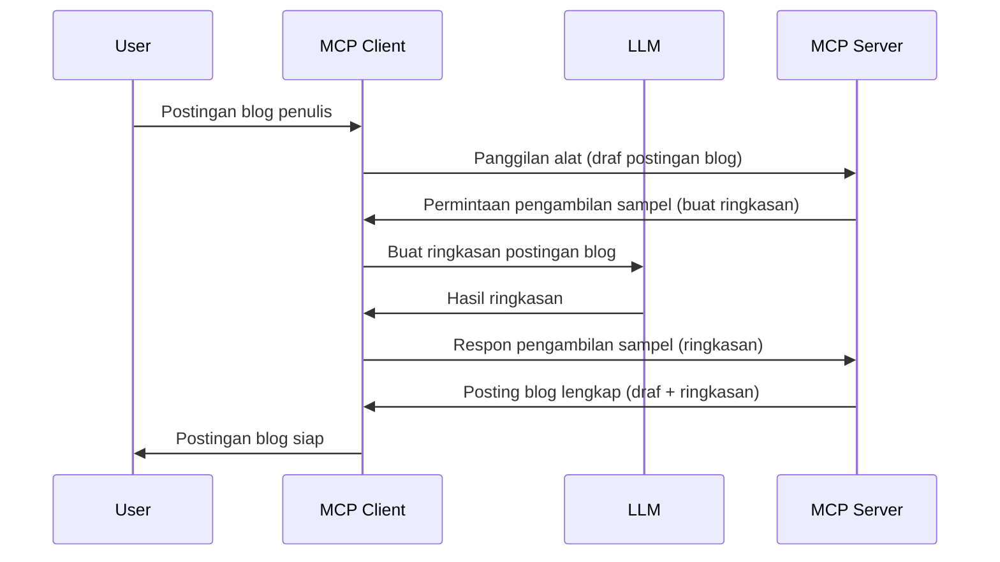

# Sampling - mendelegasikan fitur ke Klien

> **Pemberitahuan deprekasi:** kandidat rilis spesifikasi MCP `2026-07-28` menandai Sampling sebagai fitur yang sudah tidak digunakan lagi demi integrasi langsung dengan API penyedia LLM. Sampling tetap berfungsi dalam versi `2025-11-25` dan setidaknya setahun setelah deprekasi formal, jadi semua yang ada di pelajaran ini tetap valid — tetapi desain server baru harus mengevaluasi pola penggantinya. Lihat [Apa yang Berubah di MCP: Kandidat Rilis 2026-07-28](../../01-CoreConcepts/mcp-2026-07-28-release-candidate.md).

Terkadang, Anda membutuhkan Klien MCP dan Server MCP untuk berkolaborasi mencapai tujuan bersama. Anda mungkin memiliki kasus di mana Server membutuhkan bantuan LLM yang berjalan di klien. Untuk situasi ini, sampling adalah yang harus Anda gunakan.

Mari kita jelajahi beberapa kasus penggunaan dan bagaimana membangun solusi yang melibatkan sampling.

## Ikhtisar

Dalam pelajaran ini, kami fokus menjelaskan kapan dan di mana menggunakan Sampling serta cara mengkonfigurasinya.

## Tujuan Pembelajaran

Dalam bab ini, kita akan:

- Menjelaskan apa itu Sampling dan kapan menggunakannya.
- Menunjukkan cara mengkonfigurasi Sampling di MCP.
- Memberikan contoh Sampling dalam praktik.

## Apa itu Sampling dan mengapa menggunakannya?

Sampling adalah fitur canggih yang bekerja dengan cara berikut:



### Permintaan Sampling

Baik, sekarang kita punya gambaran besar tentang skenario yang dapat dipercaya, mari kita bahas permintaan sampling yang dikirim server ke klien. Berikut contoh permintaan dalam format JSON-RPC:

```json
{
  "jsonrpc": "2.0",
  "id": 1,
  "method": "sampling/createMessage",
  "params": {
    "messages": [
      {
        "role": "user",
        "content": {
          "type": "text",
          "text": "Create a blog post summary of the following blog post: <BLOG POST>"
        }
      }
    ],
    "modelPreferences": {
      "hints": [
        {
          "name": "claude-3-sonnet"
        }
      ],
      "intelligencePriority": 0.8,
      "speedPriority": 0.5
    },
    "systemPrompt": "You are a helpful assistant.",
    "maxTokens": 100
  }
}
```

Ada beberapa hal yang patut disorot:

- Prompt, di bawah content -> text, adalah instruksi kami agar LLM meringkas isi postingan blog.

- **modelPreferences**. Bagian ini adalah preferensi, rekomendasi konfigurasi LLM. Pengguna bisa memilih mengikuti rekomendasi ini atau mengubahnya. Di sini ada rekomendasi model, kecepatan, dan prioritas kecerdasan.
- **systemPrompt**, ini adalah prompt sistem normal yang memberi LLM kepribadian dan berisi instruksi panduan.
- **maxTokens**, properti lain untuk menyatakan jumlah token yang direkomendasikan untuk tugas ini.

### Respons Sampling

Respons ini adalah apa yang dikirim balik oleh Klien MCP ke Server MCP sebagai hasil klien memanggil LLM, menunggu respons tersebut, lalu menyusun pesan ini. Berikut contoh dalam JSON-RPC:

```json
{
  "jsonrpc": "2.0",
  "id": 1,
  "result": {
    "role": "assistant",
    "content": {
      "type": "text",
      "text": "Here's your abstract <ABSTRACT>"
    },
    "model": "gpt-5",
    "stopReason": "endTurn"
  }
}
```

Perhatikan bagaimana respons merupakan abstrak dari postingan blog seperti yang diminta. Perhatikan juga model yang digunakan bukan yang ditanyakan tapi "gpt-5" menggantikan "claude-3-sonnet". Ini untuk menunjukkan pengguna bisa berubah pikiran tentang apa yang dipakai dan permintaan sampling Anda hanya sebuah rekomendasi.

Baik, sekarang setelah kita paham alur utamanya, dan tugas berguna untuk "pembuatan posting blog + abstrak", mari kita lihat apa yang perlu dilakukan agar ini berfungsi.

### Jenis pesan

Pesan sampling tidak hanya terbatas pada teks tapi juga bisa mengirim gambar dan audio. Berikut bagaimana JSON-RPC terlihat berbeda:

**Teks**

```json
{
  "type": "text",
  "text": "The message content"
}
```

**Isi gambar**

```json
{
  "type": "image",
  "data": "base64-encoded-image-data",
  "mimeType": "image/jpeg"
}
```

**Isi audio**

```json
{
  "type": "audio",
  "data": "base64-encoded-audio-data",
  "mimeType": "audio/wav"
}
```

> CATATAN: untuk info lebih detail tentang Sampling, lihat [dokumen resmi](https://modelcontextprotocol.io/specification/2025-11-25/client/sampling)

## Cara Mengkonfigurasi Sampling di Klien

> Catatan: jika Anda hanya membangun server, Anda tidak perlu banyak melakukan di sini.

Di klien, Anda perlu menentukan fitur berikut seperti ini:

```json
{
  "capabilities": {
    "sampling": {}
  }
}
```

Ini akan diambil saat klien pilihan Anda memulai koneksi dengan server.

## Contoh Sampling dalam Praktik - Membuat Postingan Blog

Mari kita coding server sampling bersama, kita harus melakukan berikut:

1. Membuat sebuah tool di Server.
1. Tool tersebut harus membuat permintaan sampling.
1. Tool harus menunggu jawaban atas permintaan sampling klien.
1. Kemudian hasil tool tersebut diproduksi.

Mari lihat kode langkah demi langkah:

### -1- Membuat tool

**python**

```python
@mcp.tool()
async def create_blog(title: str, content: str, ctx: Context[ServerSession, None]) -> str:
    """Create a blog post and generate a summary"""

```

### -2- Membuat permintaan sampling

Perluas tool Anda dengan kode berikut:

**python**

```python
post = BlogPost(
        id=len(posts) + 1,
        title=title,
        content=content,
        abstract=""
    )

prompt = f"Create an abstract of the following blog post: title: {title} and draft: {content} "

result = await ctx.session.create_message(
        messages=[
            SamplingMessage(
                role="user",
                content=TextContent(type="text", text=prompt),
            )
        ],
        max_tokens=100,
)

```

### -3- Tunggu respons dan kembalikan respons

**python**

```python
post.abstract = result.content.text

posts.append(post)

# kembalikan produk lengkap
return json.dumps({
    "id": post.title,
    "abstract": post.abstract
})
```

### -4- Kode penuh

**python**

```python
from starlette.applications import Starlette
from starlette.routing import Mount, Host

from mcp.server.fastmcp import Context, FastMCP

from mcp.server.session import ServerSession
from mcp.types import SamplingMessage, TextContent

import json


from uuid import uuid4
from typing import List
from pydantic import BaseModel


mcp = FastMCP("Blog post generator")

# app = FastAPI()

posts = []

class BlogPost(BaseModel):
    id: int
    title: str
    content: str
    abstract: str

posts: List[BlogPost] = []

@mcp.tool()
async def create_blog(title: str, content: str, ctx: Context[ServerSession, None]) -> str:
    """Create a blog post and generate a summary"""

    post = BlogPost(
        id=len(posts) + 1,
        title=title,
        content=content,
        abstract=""
    )

    prompt = f"Create an abstract of the following blog post: title: {title} and draft: {content} "

    result = await ctx.session.create_message(
        messages=[
            SamplingMessage(
                role="user",
                content=TextContent(type="text", text=prompt),
            )
        ],
        max_tokens=100,
    )

    post.abstract = result.content.text

    posts.append(post)

    # mengembalikan pos blog lengkap
    return json.dumps({
        "id": post.title,
        "abstract": post.abstract
    })

if __name__ == "__main__":
    print("Starting server...")
    # mcp.run()
    mcp.run(transport="streamable-http")

# jalankan aplikasi dengan: python server.py
```

### -5- Mengujinya di Visual Studio Code

Untuk menguji ini di Visual Studio Code, lakukan langkah berikut:

1. Mulai server di terminal
1. Tambahkan pada *mcp.json* (dan pastikan server berjalan) seperti ini contohnya:

   ```json
   "servers": {
      "blog-server": {
        "type": "http",
        "url": "http://localhost:8000/mcp"
      }
   }
   ```

1. Ketik sebuah prompt:

   ```text
   create a blog post named "Where Python comes from", the content is "Python is actually named after Monty Python Flying Circus"
   ```

1. Izinkan sampling terjadi. Saat pertama kali menguji, Anda akan melihat dialog tambahan yang harus Anda setujui, lalu dialog biasa untuk menjalankan tool.

1. Periksa hasil. Anda akan melihat hasilnya dirender rapi di GitHub Copilot Chat dan juga dapat memeriksa respons JSON mentahnya.

**Bonus**. Tooling Visual Studio Code mendukung sampling dengan baik. Anda dapat mengkonfigurasi akses Sampling di server terinstall dengan cara:

1. Navigasi ke bagian ekstensi.
1. Pilih ikon roda gigi untuk server yang terinstall di bagian "MCP SERVERS - INSTALLED".
1 Pilih "Configure Model Access", di sini Anda bisa memilih model mana yang diizinkan GitHub Copilot gunakan saat sampling. Anda juga bisa melihat semua permintaan sampling yang terjadi baru-baru ini dengan memilih "Show Sampling requests".

## Tugas

Dalam tugas ini, Anda akan membangun Sampling yang sedikit berbeda yaitu integrasi sampling yang mendukung pembuatan deskripsi produk. Berikut skenarionya:

**Skenario**: Pekerja back office di e-commerce membutuhkan bantuan, proses pembuatan deskripsi produk sangat memakan waktu. Oleh karena itu, Anda akan membangun solusi di mana Anda bisa memanggil tool "create_product" dengan argumen "title" dan "keywords" yang harus menghasilkan produk lengkap termasuk field "description" yang diisi oleh LLM klien.

TIP: gunakan apa yang telah Anda pelajari sebelumnya untuk membangun server dan tool ini menggunakan permintaan sampling.

## Solusi

[Solusi](./solution/README.md)

## Poin-Poin Penting

Sampling adalah fitur kuat yang memungkinkan server mendelegasikan tugas ke klien ketika membutuhkan bantuan LLM.

## Berikutnya

- [Bab 4 - Implementasi Praktis](../../04-PracticalImplementation/README.md)

---

<!-- CO-OP TRANSLATOR DISCLAIMER START -->
**Penafian**:
Dokumen ini telah diterjemahkan menggunakan layanan terjemahan AI [Co-op Translator](https://github.com/Azure/co-op-translator). Meskipun kami berupaya untuk mencapai akurasi, harap diketahui bahwa terjemahan otomatis mungkin mengandung kesalahan atau ketidakakuratan. Dokumen asli dalam bahasa aslinya harus dianggap sebagai sumber yang sah. Untuk informasi penting, disarankan menggunakan terjemahan profesional oleh manusia. Kami tidak bertanggung jawab atas kesalahpahaman atau penafsiran yang keliru yang timbul dari penggunaan terjemahan ini.
<!-- CO-OP TRANSLATOR DISCLAIMER END -->