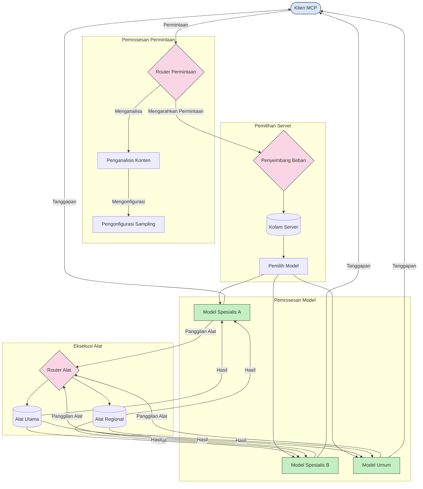

# Routing dalam Model Context Protocol

Routing sangat penting untuk mengarahkan permintaan ke model, alat, atau layanan yang tepat dalam ekosistem MCP.

## Pendahuluan

Routing dalam Model Context Protocol (MCP) melibatkan pengarahan permintaan ke model atau layanan yang paling sesuai berdasarkan berbagai kriteria seperti jenis konten, konteks pengguna, dan beban sistem. Ini memastikan pemrosesan yang efisien dan pemanfaatan sumber daya yang optimal.

## Tujuan Pembelajaran

Pada akhir pelajaran ini, Anda akan dapat:

- Memahami prinsip routing dalam MCP.
- Menerapkan routing berbasis konten untuk mengarahkan permintaan ke layanan khusus.
- Menerapkan strategi penyeimbangan beban cerdas untuk mengoptimalkan pemanfaatan sumber daya.
- Menerapkan routing alat dinamis berdasarkan konteks permintaan.

## Routing Berbasis Konten

Routing berbasis konten mengarahkan permintaan ke layanan khusus berdasarkan isi permintaan. Misalnya, permintaan terkait pembuatan kode dapat diarahkan ke model kode khusus, sementara permintaan penulisan kreatif dapat dikirim ke model penulisan kreatif.

Mari kita lihat contoh implementasi dalam berbagai bahasa pemrograman.

<details>
<summary>.NET</summary>

```csharp
// .NET Example: Content-based routing in MCP
public class ContentBasedRouter
{
    private readonly Dictionary<string, McpClient> _specializedClients;
    private readonly RoutingClassifier _classifier;
    
    public ContentBasedRouter()
    {
        // Initialize specialized clients for different domains
        _specializedClients = new Dictionary<string, McpClient>
        {
            ["code"] = new McpClient("https://code-specialized-mcp.com"),
            ["creative"] = new McpClient("https://creative-specialized-mcp.com"),
            ["scientific"] = new McpClient("https://scientific-specialized-mcp.com"),
            ["general"] = new McpClient("https://general-mcp.com")
        };
        
        // Initialize content classifier
        _classifier = new RoutingClassifier();
    }
    
    public async Task<McpResponse> RouteAndProcessAsync(string prompt, IDictionary<string, object> parameters = null)
    {
        // Classify the prompt to determine the best specialized service
        string category = await _classifier.ClassifyPromptAsync(prompt);
        
        // Get the appropriate client or fall back to general
        var client = _specializedClients.ContainsKey(category) 
            ? _specializedClients[category] 
            : _specializedClients["general"];
            
        Console.WriteLine($"Routing request to {category} specialized service");
        
        // Send request to the selected service
        return await client.SendPromptAsync(prompt, parameters);
    }
    
    // Simple classifier for routing decisions
    private class RoutingClassifier
    {
        public Task<string> ClassifyPromptAsync(string prompt)
        {
            prompt = prompt.ToLowerInvariant();
            
            if (prompt.Contains("code") || prompt.Contains("function") || 
                prompt.Contains("program") || prompt.Contains("algorithm"))
            {
                return Task.FromResult("code");
            }
            
            if (prompt.Contains("story") || prompt.Contains("creative") || 
                prompt.Contains("imagine") || prompt.Contains("design"))
            {
                return Task.FromResult("creative");
            }
            
            if (prompt.Contains("science") || prompt.Contains("research") || 
                prompt.Contains("analyze") || prompt.Contains("study"))
            {
                return Task.FromResult("scientific");
            }
            
            return Task.FromResult("general");
        }
    }
}
```

Dalam kode sebelumnya, kami telah:

- Membuat kelas `ContentBasedRouter` yang mengarahkan permintaan berdasarkan isi prompt.
- Menginisialisasi klien khusus untuk domain yang berbeda (kode, kreatif, ilmiah, umum).
- Menerapkan classifier sederhana yang menentukan kategori prompt dan mengarahkannya ke layanan khusus yang sesuai.
- Menggunakan mekanisme fallback untuk mengarahkan permintaan ke layanan umum jika layanan khusus tidak tersedia.
- Menerapkan pemrosesan asynchronous untuk menangani permintaan secara efisien.
- Menggunakan dictionary untuk memetakan kategori konten ke klien MCP khusus.
- Menerapkan classifier sederhana yang menganalisis prompt dan mengembalikan kategori yang sesuai.
- Menggunakan klien khusus untuk mengirim permintaan dan menerima respons.
- Menangani kasus di mana prompt tidak cocok dengan kategori khusus manapun dengan mengarahkan ke layanan umum.

</details>

## Penyeimbangan Beban Cerdas

Penyeimbangan beban mengoptimalkan pemanfaatan sumber daya dan memastikan ketersediaan tinggi untuk layanan MCP. Ada berbagai cara untuk menerapkan penyeimbangan beban, seperti round-robin, waktu respons berbobot, atau strategi yang sadar konten.

Mari kita lihat contoh implementasi berikut yang menggunakan strategi berikut ini:

- **Round Robin**: Mendistribusikan permintaan secara merata ke server yang tersedia.
- **Waktu Respons Berbobot**: Mengarahkan permintaan ke server berdasarkan rata-rata waktu respons mereka.
- **Sadar Konten**: Mengarahkan permintaan ke server khusus berdasarkan isi permintaan.

<details>
<summary>Java</summary>

```java
// Contoh Java: Penyeimbangan beban cerdas untuk server MCP
public class McpLoadBalancer {
    private final List<McpServerNode> serverNodes;
    private final LoadBalancingStrategy strategy;
    
    public McpLoadBalancer(List<McpServerNode> nodes, LoadBalancingStrategy strategy) {
        this.serverNodes = new ArrayList<>(nodes);
        this.strategy = strategy;
    }
    
    public McpResponse processRequest(McpRequest request) {
        // Pilih server terbaik berdasarkan strategi
        McpServerNode selectedNode = strategy.selectNode(serverNodes, request);
        
        try {
            // Rute permintaan ke node yang dipilih
            return selectedNode.processRequest(request);
        } catch (Exception e) {
            // Tangani kegagalan - terapkan logika ulang coba atau cadangan
            System.err.println("Error processing request on node " + selectedNode.getId() + ": " + e.getMessage());
            
            // Tandai node sebagai berpotensi tidak sehat
            selectedNode.recordFailure();
            
            // Coba node terbaik berikutnya sebagai cadangan
            List<McpServerNode> remainingNodes = new ArrayList<>(serverNodes);
            remainingNodes.remove(selectedNode);
            
            if (!remainingNodes.isEmpty()) {
                McpServerNode fallbackNode = strategy.selectNode(remainingNodes, request);
                return fallbackNode.processRequest(request);
            } else {
                throw new RuntimeException("All MCP server nodes failed to process the request");
            }
        }
    }
    
    // Tugas pemeriksaan kesehatan node
    public void startHealthChecks(Duration interval) {
        ScheduledExecutorService scheduler = Executors.newScheduledThreadPool(1);
        scheduler.scheduleAtFixedRate(() -> {
            for (McpServerNode node : serverNodes) {
                try {
                    boolean isHealthy = node.checkHealth();
                    System.out.println("Node " + node.getId() + " health status: " + 
                                      (isHealthy ? "HEALTHY" : "UNHEALTHY"));
                } catch (Exception e) {
                    System.err.println("Health check failed for node " + node.getId());
                    node.setHealthy(false);
                }
            }
        }, 0, interval.toMillis(), TimeUnit.MILLISECONDS);
    }
    
    // Antarmuka untuk strategi penyeimbangan beban
    public interface LoadBalancingStrategy {
        McpServerNode selectNode(List<McpServerNode> nodes, McpRequest request);
    }
    
    // Strategi round-robin
    public static class RoundRobinStrategy implements LoadBalancingStrategy {
        private AtomicInteger counter = new AtomicInteger(0);
        
        @Override
        public McpServerNode selectNode(List<McpServerNode> nodes, McpRequest request) {
            List<McpServerNode> healthyNodes = nodes.stream()
                .filter(McpServerNode::isHealthy)
                .collect(Collectors.toList());
            
            if (healthyNodes.isEmpty()) {
                throw new RuntimeException("No healthy nodes available");
            }
            
            int index = counter.getAndIncrement() % healthyNodes.size();
            return healthyNodes.get(index);
        }
    }
    
    // Strategi waktu respons berbobot
    public static class ResponseTimeStrategy implements LoadBalancingStrategy {
        @Override
        public McpServerNode selectNode(List<McpServerNode> nodes, McpRequest request) {
            return nodes.stream()
                .filter(McpServerNode::isHealthy)
                .min(Comparator.comparing(McpServerNode::getAverageResponseTime))
                .orElseThrow(() -> new RuntimeException("No healthy nodes available"));
        }
    }
    
    // Strategi sadar konten
    public static class ContentAwareStrategy implements LoadBalancingStrategy {
        @Override
        public McpServerNode selectNode(List<McpServerNode> nodes, McpRequest request) {
            // Tentukan karakteristik permintaan
            boolean isCodeRequest = request.getPrompt().contains("code") || 
                                   request.getAllowedTools().contains("codeInterpreter");
            
            boolean isCreativeRequest = request.getPrompt().contains("creative") || 
                                       request.getPrompt().contains("story");
            
            // Temukan node khusus
            Optional<McpServerNode> specializedNode = nodes.stream()
                .filter(McpServerNode::isHealthy)
                .filter(node -> {
                    if (isCodeRequest && node.getSpecialization().equals("code")) {
                        return true;
                    }
                    if (isCreativeRequest && node.getSpecialization().equals("creative")) {
                        return true;
                    }
                    return false;
                })
                .findFirst();
            
            // Kembalikan node khusus atau node dengan beban paling ringan
            return specializedNode.orElse(
                nodes.stream()
                    .filter(McpServerNode::isHealthy)
                    .min(Comparator.comparing(McpServerNode::getCurrentLoad))
                    .orElseThrow(() -> new RuntimeException("No healthy nodes available"))
            );
        }
    }
}
```

Dalam kode sebelumnya, kami telah:

- Membuat kelas `McpLoadBalancer` yang mengelola daftar node server MCP dan mengarahkan permintaan berdasarkan strategi penyeimbangan beban yang dipilih.
- Menerapkan berbagai strategi penyeimbangan beban: `RoundRobinStrategy`, `ResponseTimeStrategy`, dan `ContentAwareStrategy`.
- Menggunakan `ScheduledExecutorService` untuk secara berkala memeriksa kesehatan node server.
- Menerapkan mekanisme pemeriksaan kesehatan yang menandai node sebagai sehat atau tidak sehat berdasarkan responsnya terhadap pemeriksaan kesehatan.
- Menangani pemrosesan permintaan dengan penanganan kesalahan dan logika fallback untuk memastikan ketersediaan tinggi.
- Menggunakan kelas `McpServerNode` untuk merepresentasikan node server MCP individual, termasuk status kesehatannya, rata-rata waktu respons, dan beban saat ini.
- Menerapkan kelas `McpRequest` untuk mengemas detail permintaan seperti prompt dan alat yang diperbolehkan.
- Menggunakan Java Streams untuk memfilter dan memilih node berdasarkan status kesehatan dan spesialisasi.

</details>

## Routing Alat Dinamis

Routing alat memastikan bahwa panggilan alat diarahkan ke layanan yang paling tepat berdasarkan konteks. Misalnya, panggilan alat cuaca mungkin perlu diarahkan ke endpoint regional berdasarkan lokasi pengguna, atau alat kalkulator mungkin perlu menggunakan versi API tertentu.

Mari kita lihat contoh implementasi yang menunjukkan routing alat dinamis berdasarkan analisis permintaan, endpoint regional, dan dukungan versi.

<details>
<summary>Python</summary>

```python
# Contoh Python: Pengarahan alat dinamis berdasarkan analisis permintaan
class McpToolRouter:
    def __init__(self):
        # Daftarkan endpoint alat yang tersedia
        self.tool_endpoints = {
            "weatherTool": "https://weather-service.example.com/api",
            "calculatorTool": "https://calculator-service.example.com/compute",
            "databaseTool": "https://database-service.example.com/query",
            "searchTool": "https://search-service.example.com/search"
        }
        
        # Endpoint regional untuk distribusi global
        self.regional_endpoints = {
            "us": {
                "weatherTool": "https://us-west.weather-service.example.com/api",
                "searchTool": "https://us.search-service.example.com/search"
            },
            "europe": {
                "weatherTool": "https://eu.weather-service.example.com/api",
                "searchTool": "https://eu.search-service.example.com/search"
            },
            "asia": {
                "weatherTool": "https://asia.weather-service.example.com/api",
                "searchTool": "https://asia.search-service.example.com/search"
            }
        }
        
        # Dukungan versi alat
        self.tool_versions = {
            "weatherTool": {
                "default": "v2",
                "v1": "https://weather-service.example.com/api/v1",
                "v2": "https://weather-service.example.com/api/v2",
                "beta": "https://weather-service.example.com/api/beta"
            }
        }
    
    async def route_tool_request(self, tool_name, parameters, user_context=None):
        """Route a tool request to the appropriate endpoint based on context"""
        endpoint = self._select_endpoint(tool_name, parameters, user_context)
        
        if not endpoint:
            raise ValueError(f"No endpoint available for tool: {tool_name}")
        
        # Lakukan permintaan sebenarnya ke endpoint yang dipilih
        return await self._execute_tool_request(endpoint, tool_name, parameters)
    
    def _select_endpoint(self, tool_name, parameters, user_context=None):
        """Select the most appropriate endpoint based on context"""
        # Endpoint dasar dari registri
        if tool_name not in self.tool_endpoints:
            return None
            
        base_endpoint = self.tool_endpoints[tool_name]
        
        # Periksa apakah kita perlu menggunakan versi alat tertentu
        if tool_name in self.tool_versions:
            version_info = self.tool_versions[tool_name]
            
            # Gunakan versi yang ditentukan atau default
            requested_version = parameters.get("_version", version_info["default"])
            if requested_version in version_info:
                base_endpoint = version_info[requested_version]
        
        # Periksa pengarah regional jika wilayah pengguna diketahui
        if user_context and "region" in user_context:
            user_region = user_context["region"]
            
            if user_region in self.regional_endpoints:
                regional_tools = self.regional_endpoints[user_region]
                
                if tool_name in regional_tools:
                    # Gunakan endpoint khusus wilayah
                    return regional_tools[tool_name]
        
        # Periksa persyaratan residensi data
        if user_context and "data_residency" in user_context:
            # Ini akan mengimplementasikan logika untuk memastikan data tetap di yurisdiksi yang ditentukan
            pass
        
        # Periksa pengarah berbasis latensi
        if user_context and "latency_sensitive" in user_context and user_context["latency_sensitive"]:
            # Ini akan mengimplementasikan logika untuk memilih endpoint dengan latensi terendah
            pass
            
        return base_endpoint
        
    async def _execute_tool_request(self, endpoint, tool_name, parameters):
        """Execute the actual tool request to the selected endpoint"""
        try:
            async with aiohttp.ClientSession() as session:
                async with session.post(
                    endpoint,
                    json={"toolName": tool_name, "parameters": parameters},
                    headers={"Content-Type": "application/json"}
                ) as response:
                    if response.status == 200:
                        result = await response.json()
                        return result
                    else:
                        error_text = await response.text()
                        raise Exception(f"Tool execution failed: {error_text}")
        except Exception as e:
            # Terapkan logika percobaan ulang atau strategi cadangan
            print(f"Error executing tool {tool_name} at {endpoint}: {str(e)}")
            raise
```

Dalam kode sebelumnya, kami telah:

- Membuat kelas `McpToolRouter` yang mengelola routing alat berdasarkan analisis permintaan, endpoint regional, dan dukungan versi.
- Mendaftarkan endpoint alat yang tersedia dan endpoint regional untuk distribusi global.
- Menerapkan logika routing dinamis yang memilih endpoint yang sesuai berdasarkan konteks pengguna, seperti wilayah dan persyaratan penyimpanan data.
- Menerapkan dukungan versi untuk alat, memungkinkan pengguna menentukan versi alat yang ingin mereka gunakan.
- Menggunakan permintaan HTTP asynchronous untuk mengeksekusi panggilan alat dan menangani respons.

</details>

## Arsitektur Sampling dan Routing dalam MCP

Sampling adalah komponen penting dari Model Context Protocol (MCP) yang memungkinkan pemrosesan dan routing permintaan secara efisien. Ini melibatkan analisis permintaan masuk untuk menentukan model atau layanan yang paling tepat untuk menanganinya, berdasarkan berbagai kriteria seperti jenis konten, konteks pengguna, dan beban sistem.

Sampling dan routing dapat digabungkan untuk menciptakan arsitektur yang kokoh yang mengoptimalkan pemanfaatan sumber daya dan memastikan ketersediaan tinggi. Proses sampling dapat digunakan untuk mengklasifikasikan permintaan, sementara routing mengarahkannya ke model atau layanan yang sesuai.

Diagram di bawah ini menggambarkan bagaimana sampling dan routing bekerja bersama dalam arsitektur MCP yang komprehensif:



## Apa Selanjutnya

- [5.6 Sampling](../mcp-sampling/README.md)

---

<!-- CO-OP TRANSLATOR DISCLAIMER START -->
**Penafian**:
Dokumen ini telah diterjemahkan menggunakan layanan terjemahan AI [Co-op Translator](https://github.com/Azure/co-op-translator). Meskipun kami berupaya untuk mencapai akurasi, harap diketahui bahwa terjemahan otomatis mungkin mengandung kesalahan atau ketidakakuratan. Dokumen asli dalam bahasa aslinya harus dianggap sebagai sumber yang sah. Untuk informasi penting, disarankan menggunakan terjemahan profesional oleh manusia. Kami tidak bertanggung jawab atas kesalahpahaman atau penafsiran yang keliru yang timbul dari penggunaan terjemahan ini.
<!-- CO-OP TRANSLATOR DISCLAIMER END -->