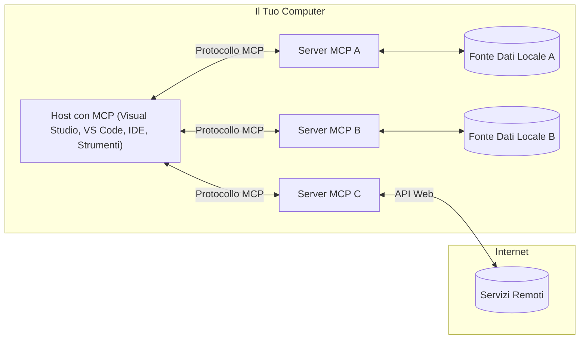

# Concetti Fondamentali MCP: Padroneggiare il Model Context Protocol per l'Integrazione AI

[](https://youtu.be/earDzWGtE84)

_(Clicca sull'immagine sopra per vedere il video di questa lezione)_

Il [Model Context Protocol (MCP)](https://github.com/modelcontextprotocol) è un potente framework standardizzato che ottimizza la comunicazione tra i Large Language Models (LLM) e strumenti, applicazioni e fonti di dati esterni.  
Questa guida ti guiderà attraverso i concetti fondamentali di MCP. Imparerai la sua architettura client-server, i componenti essenziali, le meccaniche di comunicazione e le best practice di implementazione.

- **Consenso Esplicito dell'Utente**: Tutti gli accessi ai dati e le operazioni richiedono l'approvazione esplicita dell'utente prima dell'esecuzione. Gli utenti devono comprendere chiaramente quali dati verranno accessi e quali azioni verranno eseguite, con controllo granulare sulle autorizzazioni e permessi.

- **Protezione della Privacy dei Dati**: I dati degli utenti sono esposti solo con consenso esplicito e devono essere protetti da solidi controlli di accesso per tutta la durata dell'interazione. Le implementazioni devono prevenire la trasmissione non autorizzata dei dati e mantenere rigidi confini di privacy.

- **Sicurezza nell'Esecuzione degli Strumenti**: Ogni invocazione di uno strumento richiede consenso esplicito con comprensione chiara della funzionalità dello strumento, dei parametri e dell'impatto potenziale. Confini di sicurezza robusti devono prevenire esecuzioni non intenzionali, non sicure o malevole.

- **Sicurezza del Livello di Trasporto**: Tutti i canali comunicativi devono utilizzare meccanismi adeguati di crittografia e autenticazione. Le connessioni remote devono implementare protocolli di trasporto sicuri e una corretta gestione delle credenziali.

#### Linee Guida per l'Implementazione:

- **Gestione dei Permessi**: Implementare sistemi di permessi granulati che consentano agli utenti di controllare quali server, strumenti e risorse sono accessibili  
- **Autenticazione e Autorizzazione**: Usare metodi di autenticazione sicuri (OAuth, chiavi API) con corretta gestione ed expirazione dei token  
- **Validazione degli Input**: Validare tutti i parametri e gli input dati secondo schemi definiti per prevenire attacchi di injection  
- **Audit Logging**: Mantenere registri completi di tutte le operazioni per il monitoraggio della sicurezza e la conformità

## Panoramica

Questa lezione esplora l'architettura fondamentale e i componenti che costituiscono l'ecosistema Model Context Protocol (MCP). Imparerai l'architettura client-server, i componenti chiave e i meccanismi di comunicazione che alimentano le interazioni MCP.

## Obiettivi di Apprendimento Principali

Al termine di questa lezione, sarai in grado di:

- Comprendere l'architettura client-server di MCP.  
- Identificare ruoli e responsabilità di Host, Client e Server.  
- Analizzare le caratteristiche principali che rendono MCP uno strato di integrazione flessibile.  
- Imparare come fluisce l'informazione all'interno dell'ecosistema MCP.  
- Ottenere approfondimenti pratici attraverso esempi di codice in .NET, Java, Python e JavaScript.

## Architettura MCP: Uno Sguardo Approfondito

L'ecosistema MCP si basa su un modello client-server. Questa struttura modulare permette alle applicazioni AI di interagire efficientemente con strumenti, database, API e risorse contestuali. Analizziamo questa architettura nei suoi componenti fondamentali.

Alla base, MCP segue un'architettura client-server in cui un'applicazione host può connettersi a molteplici server:



- **Host MCP**: Programmi come VSCode, Claude Desktop, IDE o strumenti AI che vogliono accedere ai dati tramite MCP  
- **Client MCP**: Client del protocollo che mantengono connessioni uno-a-uno con i server  
- **Server MCP**: Programmi leggeri che espongono funzionalità specifiche attraverso il Model Context Protocol standardizzato  
- **Fonti di Dati Locali**: File, database e servizi del tuo computer cui i server MCP possono accedere in modo sicuro  
- **Servizi Remoti**: Sistemi esterni disponibili su internet a cui i server MCP si possono connettere tramite API.

Il Protocollo MCP è uno standard in evoluzione che utilizza versioni basate su data (formato YYYY-MM-DD). La versione attuale del protocollo è **2025-11-25**. Puoi consultare gli ultimi aggiornamenti nella [specifica del protocollo](https://modelcontextprotocol.io/specification/2025-11-25/).

> **Uno sguardo al futuro:** un candidato alla release per la prossima versione della specifica, **2026-07-28**, è stato annunciato a maggio 2026 e il rilascio è previsto per il 28 luglio 2026. Questa versione rende il protocollo stateless a livello di trasporto (rimuovendo il handshake `initialize` e gli ID di sessione), formalizza un framework di Estensioni, e depreca Roots, Sampling e Logging in favore di nuovi pattern. Consulta [Cosa cambia in MCP: Il candidato alla release 2026-07-28](./mcp-2026-07-28-release-candidate.md) per una panoramica completa.

### 1. Host

Nel Model Context Protocol (MCP), gli **Host** sono applicazioni AI che fungono da interfaccia primaria con cui gli utenti interagiscono con il protocollo. Gli Host coordinano e gestiscono connessioni verso molteplici server MCP creando client MCP dedicati per ogni connessione server. Alcuni esempi di Host includono:

- **Applicazioni AI**: Claude Desktop, Visual Studio Code, Claude Code  
- **Ambientidi Sviluppo**: IDE e editor di codice con integrazione MCP  
- **Applicazioni Personalizzate**: Agenti AI e strumenti costruiti su misura

Gli **Host** sono applicazioni che coordinano le interazioni con il modello AI. Essi:

- **Orchestrano i Modelli AI**: Eseguono o interagiscono con LLM per generare risposte e coordinare workflow AI  
- **Gestiscono le Connessioni Client**: Creano e mantengono un client MCP per ogni connessione server MCP  
- **Controllano l’Interfaccia Utente**: Gestiscono il flusso delle conversazioni, le interazioni con l’utente e la presentazione delle risposte  
- **Applicano Sicurezza**: Controllano permessi, vincoli di sicurezza e autenticazione  
- **Gestiscono il Consenso Utente**: Amministrano l’approvazione degli utenti sulla condivisione dei dati e l’esecuzione di strumenti

### 2. Client

I **Client** sono componenti essenziali che mantengono connessioni dedicate uno-a-uno tra Host e server MCP. Ogni client MCP è istanziato dall’Host per connettersi a un server MCP specifico, assicurando canali di comunicazione organizzati e sicuri. Molteplici client permettono agli Host di connettersi contemporaneamente a più server.

I **Client** sono componenti connettori all’interno dell’applicazione host. Essi:

- **Comunicazione del Protocollo**: Inviano richieste JSON-RPC 2.0 ai server con prompt e istruzioni  
- **Negoziazione delle Capacità**: Negoziano caratteristiche supportate e versioni di protocollo con i server durante l’inizializzazione  
- **Esecuzione degli Strumenti**: Gestiscono richieste di esecuzione strumenti dai modelli e processano le risposte  
- **Aggiornamenti in Tempo Reale**: Gestiscono notifiche e aggiornamenti in tempo reale dai server  
- **Elaborazione delle Risposte**: Processano e formattano le risposte del server per la visualizzazione agli utenti

### 3. Server

I **Server** sono programmi che forniscono contesto, strumenti e capacità ai client MCP. Possono essere eseguiti localmente (sulla stessa macchina dell’Host) o da remoto (su piattaforme esterne), e sono responsabili di gestire le richieste dei client fornendo risposte strutturate. I server espongono funzionalità specifiche tramite il Model Context Protocol standardizzato.

I **Server** sono servizi che offrono contesto e capacità. Essi:

- **Registrazione delle Funzionalità**: Registrano ed espongono primitive disponibili (risorse, prompt, strumenti) ai client  
- **Elaborazione delle Richieste**: Ricevono ed eseguono chiamate a strumenti, richieste di risorse e prompt dai client  
- **Fornitura del Contesto**: Forniscono informazioni contestuali e dati per arricchire le risposte del modello  
- **Gestione dello Stato**: Mantengono lo stato della sessione e gestiscono interazioni stateful quando necessario  
- **Notifiche in Tempo Reale**: Invia notifiche su cambiamenti di capacità e aggiornamenti ai client connessi

I server possono essere sviluppati da chiunque per estendere le capacità del modello con funzionalità specializzate e supportano sia scenari di deployment locale che remoto.

### 4. Primitive dei Server

I server nel Model Context Protocol (MCP) forniscono tre **primitive** fondamentali che definiscono i blocchi base per interazioni ricche tra client, host e modelli di linguaggio. Queste primitive specificano i tipi di informazioni contestuali e azioni disponibili tramite il protocollo.

I server MCP possono esporre qualsiasi combinazione delle seguenti tre primitive core:

#### Risorse

Le **Risorse** sono fonti di dati che forniscono informazioni contestuali alle applicazioni AI. Rappresentano contenuti statici o dinamici che possono migliorare la comprensione del modello e il processo decisionale:

- **Dati Contestuali**: Informazioni strutturate e contesto per il consumo del modello AI  
- **Basi di Conoscenza**: Repository di documenti, articoli, manuali e pubblicazioni scientifiche  
- **Fonti di Dati Locali**: File, database e informazioni di sistema locali  
- **Dati Esterni**: Risposte API, servizi web e dati di sistemi remoti  
- **Contenuto Dinamico**: Dati in tempo reale che si aggiornano in base a condizioni esterne

Le risorse sono identificate da URI e supportano la scoperta tramite i metodi `resources/list` e il recupero tramite `resources/read`:

```text
file://documents/project-spec.md
database://production/users/schema
api://weather/current
```

#### Prompt

I **Prompt** sono template riutilizzabili che aiutano a strutturare le interazioni con i modelli di linguaggio. Forniscono schemi di interazione standardizzati e workflow templati:

- **Interazioni Basate su Modelli**: Messaggi pre-strutturati e iniziatori di conversazione  
- **Template di Workflow**: Sequenze standardizzate per compiti comuni e interazioni  
- **Esempi Few-shot**: Template basati su esempi per istruire il modello  
- **Prompt di Sistema**: Prompt fondamentali che definiscono il comportamento e il contesto del modello  
- **Template Dinamici**: Prompt parametrizzati che si adattano a contesti specifici

I prompt supportano la sostituzione di variabili e possono essere scoperti tramite `prompts/list` e recuperati con `prompts/get`:

```markdown
Generate a {{task_type}} for {{product}} targeting {{audience}} with the following requirements: {{requirements}}
```

#### Strumenti

Gli **Strumenti** sono funzioni eseguibili che i modelli AI possono invocare per compiere azioni specifiche. Rappresentano i "verbi" dell’ecosistema MCP, permettendo ai modelli di interagire con sistemi esterni:

- **Funzioni Eseguibili**: Operazioni discrete che i modelli possono invocare con parametri specifici  
- **Integrazione con Sistemi Esterni**: Chiamate API, query a database, operazioni su file, calcoli  
- **Identità Unica**: Ogni strumento ha nome, descrizione e schema di parametri distinti  
- **I/O Strutturato**: Gli strumenti accettano parametri validati e restituiscono risposte strutturate e tipizzate  
- **Capacità d’Azione**: Consentono ai modelli di compiere azioni reali e recuperare dati live

Gli strumenti sono definiti con JSON Schema per la validazione dei parametri, scoperti tramite `tools/list` e eseguiti via `tools/call`. Gli strumenti possono anche includere **icone** come metadati addizionali per una migliore presentazione UI.

**Annotazioni degli Strumenti**: Gli strumenti supportano annotazioni comportamentali (es. `readOnlyHint`, `destructiveHint`) che indicano se uno strumento è di sola lettura o distruttivo, aiutando i client a prendere decisioni informate sull’esecuzione.

Esempio di definizione di uno strumento:

```typescript
server.tool(
  "search_products", 
  {
    query: z.string().describe("Search query for products"),
    category: z.string().optional().describe("Product category filter"),
    max_results: z.number().default(10).describe("Maximum results to return")
  }, 
  async (params) => {
    // Esegui la ricerca e restituisci i risultati strutturati
    return await productService.search(params);
  }
);
```

## Primitive Client

Nel Model Context Protocol (MCP), i **client** possono esporre primitive che permettono ai server di richiedere capacità aggiuntive all'applicazione host. Queste primitive lato client consentono implementazioni server più ricche e interattive che possono accedere alle capacità del modello AI e alle interazioni utente.

### Sampling

> **Avviso di deprecazione:** il candidato alla release `2026-07-28` segna la deprecazione del Sampling in favore dell’integrazione diretta con le API dei provider LLM. Continua a funzionare in `2025-11-25` e per almeno un anno dopo la deprecazione, ma i nuovi design dovrebbero preferire il pattern di sostituzione. Consulta [Cosa cambia in MCP: Il candidato alla release 2026-07-28](./mcp-2026-07-28-release-candidate.md).

Il **Sampling** permette ai server di richiedere completamenti del modello linguistico dall'applicazione AI client. Questa primitiva permette ai server di accedere alle capacità LLM senza incorporare direttamente dipendenze del modello:

- **Accesso Indipendente dal Modello**: I server possono richiedere completamenti senza includere SDK LLM o gestire l’accesso al modello  
- **AI Iniziata dal Server**: Consente ai server di generare autonomamente contenuti usando il modello AI del client  
- **Interazioni LLM Ricorsive**: Supporta scenari complessi dove i server necessitano assistenza AI per l’elaborazione  
- **Generazione Dinamica di Contenuto**: Permette ai server di creare risposte contestuali usando il modello host  
- **Supporto per Chiamata Strumenti**: I server possono includere parametri `tools` e `toolChoice` per permettere al modello client di invocare strumenti durante il sampling

Il sampling è avviato tramite il metodo `sampling/complete`, dove i server inviano richieste di completamento ai client.

### Roots

> **Avviso di deprecazione:** il candidato alla release `2026-07-28` segna la deprecazione delle Roots in favore di parametri di strumenti, URI di risorse o configurazione del server. Continua a funzionare in `2025-11-25` e per almeno un anno dopo la deprecazione. Consulta [Cosa cambia in MCP: Il candidato alla release 2026-07-28](./mcp-2026-07-28-release-candidate.md).

Le **Roots** forniscono un modo standardizzato per i client di esporre i confini del filesystem ai server, aiutando i server a capire quali directory e file sono accessibili:

- **Confini del Filesystem**: Definiscono i limiti entro cui i server possono operare nel filesystem  
- **Controllo degli Accessi**: Aiutano i server a comprendere quali directory e file possono accedere  
- **Aggiornamenti Dinamici**: I client possono notificare i server quando la lista delle roots cambia  
- **Identificazione Basata su URI**: Le roots usano URI `file://` per identificare directory e file accessibili

Le roots sono scoperte tramite il metodo `roots/list`, con i client che inviano `notifications/roots/list_changed` quando le roots cambiano.

### Elicitation  

L'**Elicitation** abilita i server a richiedere informazioni aggiuntive o conferme dagli utenti tramite l’interfaccia client:

- **Richieste di Input Utente**: I server possono chiedere informazioni aggiuntive quando necessarie per l’esecuzione di uno strumento  
- **Dialoghi di Conferma**: Richiedono l'approvazione dell’utente per operazioni sensibili o impattanti  
- **Workflow Interattivi**: Permettono ai server di creare interazioni utente passo dopo passo  
- **Raccolta Dinamica di Parametri**: Raccoglie parametri mancanti o opzionali durante l’esecuzione dello strumento

Le richieste di elicitation si effettuano usando il metodo `elicitation/request` per raccogliere input attraverso l’interfaccia del client.

**Elicitation in Modalità URL**: I server possono anche richiedere interazioni utente basate su URL, permettendo ai server di indirizzare gli utenti a pagine web esterne per autenticazione, conferma o inserimento dati.

### Logging
> **Avviso di deprecazione:** il candidato alla release `2026-07-28` segna Logging come deprecato a favore di `stderr` per i trasporti stdio e OpenTelemetry per l'osservabilità strutturata. Continua a funzionare in `2025-11-25` e per almeno un anno dopo qualsiasi deprecazione. Vedi [Cosa cambia in MCP: il candidato alla release 2026-07-28](./mcp-2026-07-28-release-candidate.md).

**Logging** consente ai server di inviare messaggi di log strutturati ai client per debugging, monitoraggio e visibilità operativa:

- **Supporto al Debugging**: consente ai server di fornire registri dettagliati di esecuzione per il troubleshooting
- **Monitoraggio Operativo**: invia aggiornamenti di stato e metriche di performance ai client
- **Segnalazione Errori**: fornisce contesto dettagliato sugli errori e informazioni diagnostiche
- **Tracce di Audit**: crea registri completi delle operazioni e decisioni del server

I messaggi di logging vengono inviati ai client per fornire trasparenza sulle operazioni del server e facilitare il debugging.

## Flusso di Informazioni in MCP

Il Model Context Protocol (MCP) definisce un flusso strutturato di informazioni tra host, client, server e modelli. Comprendere questo flusso aiuta a chiarire come vengono gestite le richieste utente e come strumenti e dati esterni si integrano nelle risposte del modello.

- **Host Avvia la Connessione**  
  L'applicazione host (come un IDE o interfaccia chat) stabilisce una connessione a un server MCP, tipicamente tramite STDIO, WebSocket o altro trasporto supportato.

- **Negoziazione delle Capacità**  
  Il client (incorporato nell'host) e il server scambiano informazioni sulle funzionalità, strumenti, risorse e versioni di protocollo supportate. Questo garantisce che entrambe le parti comprendano quali capacità sono disponibili per la sessione.

- **Richiesta Utente**  
  L'utente interagisce con l'host (ad esempio, inserisce un prompt o un comando). L'host raccoglie questo input e lo passa al client per l'elaborazione.

- **Uso di Risorse o Strumenti**  
  - Il client può richiedere ulteriori contesti o risorse al server (come file, voci di database o articoli di una base di conoscenza) per arricchire la comprensione del modello.  
  - Se il modello determina che è necessario uno strumento (ad esempio per recuperare dati, eseguire un calcolo o chiamare un'API), il client invia una richiesta di invocazione dello strumento al server, specificando nome e parametri.

- **Esecuzione sul Server**  
  Il server riceve la richiesta di risorsa o strumento, esegue le operazioni necessarie (come eseguire una funzione, interrogare un database o recuperare un file) e restituisce i risultati al client in formato strutturato.

- **Generazione della Risposta**  
  Il client integra le risposte del server (dati risorse, output strumenti, ecc.) nell'interazione in corso con il modello. Il modello usa queste informazioni per generare una risposta completa e contestualmente rilevante.

- **Presentazione del Risultato**  
  L'host riceve l'output finale dal client e lo presenta all'utente, includendo spesso sia il testo generato dal modello sia eventuali risultati da esecuzioni di strumenti o ricerche in risorse.

Questo flusso permette a MCP di supportare applicazioni AI avanzate, interattive e consapevoli del contesto collegando senza soluzione di continuità modelli con strumenti e fonti dati esterni.

## Architettura del Protocollo & Livelli

MCP consiste di due livelli architetturali distinti che collaborano per fornire un framework di comunicazione completo:

### Livello Dati

Il **Livello Dati** implementa il nucleo del protocollo MCP usando **JSON-RPC 2.0** come base. Questo livello definisce struttura dei messaggi, semantica e schemi di interazione:

#### Componenti Principali:

- **Protocollo JSON-RPC 2.0**: tutta la comunicazione usa un formato standardizzato per chiamate di metodo, risposte e notifiche  
- **Gestione del Ciclo di Vita**: gestisce inizializzazione della connessione, negoziazione delle capacità e terminazione della sessione tra client e server  
- **Primitivi Server**: permette ai server di fornire funzionalità base tramite strumenti, risorse e prompt  
- **Primitivi Client**: permette ai server di richiedere campionamenti da LLM, sollecitare input utente e inviare messaggi di log  
- **Notifiche in Tempo Reale**: supporta notifiche asincrone per aggiornamenti dinamici senza polling

#### Caratteristiche Chiave:

- **Negoziazione Versione Protocollo**: utilizza versionamento basato su data (YYYY-MM-DD) per assicurare compatibilità  
- **Scoperta Capacità**: client e server si scambiano informazioni sulle funzionalità supportate durante l’inizializzazione  
- **Sessioni Stateful**: mantiene stato di connessione attraverso interazioni multiple per continuità di contesto

### Livello Trasporto

Il **Livello Trasporto** gestisce canali di comunicazione, incorniciatura dei messaggi e autenticazione tra i partecipanti MCP:

#### Meccanismi di Trasporto Supportati:

1. **Trasporto STDIO**:
   - Usa flussi standard input/output per comunicazione diretta tra processi  
   - Ottimale per processi locali sulla stessa macchina senza overhead di rete  
   - Comunemente usato per implementazioni locali di server MCP

2. **Trasporto HTTP Streamable**:
   - Usa HTTP POST per messaggi client-to-server  
   - Eventi Server-Sent (SSE) opzionali per streaming server-to-client  
   - Consente comunicazione remota attraverso reti  
   - Supporta autenticazione HTTP standard (token bearer, chiavi API, header personalizzati)  
   - MCP raccomanda OAuth per autenticazione sicura basata su token

#### Astrazione del Trasporto:

Il livello trasporto astrae i dettagli di comunicazione dal livello dati, permettendo lo stesso formato messaggi JSON-RPC 2.0 su tutti i trasporti. Questa astrazione consente alle applicazioni di passare senza problemi tra server locali e remoti.

### Considerazioni di Sicurezza

Le implementazioni MCP devono aderire a principi di sicurezza critici per garantire interazioni sicure, affidabili e protette in tutte le operazioni del protocollo:

- **Consenso e Controllo Utente**: gli utenti devono fornire consenso esplicito prima che dati siano accessi o operazioni effettuate. Devono avere un controllo chiaro su quali dati condividere e quali azioni autorizzare, supportati da interfacce utente intuitive per revisionare e approvare attività.

- **Privacy dei Dati**: i dati degli utenti devono essere esposti solo con consenso esplicito e protetti da adeguati controlli di accesso. Le implementazioni MCP devono proteggere contro trasmissioni non autorizzate e garantire la privacy in tutte le interazioni.

- **Sicurezza degli Strumenti**: prima di invocare qualsiasi strumento è richiesto consenso esplicito dell’utente. Gli utenti devono comprendere chiaramente la funzionalità di ogni strumento e devono essere applicati confini di sicurezza rigorosi per prevenire esecuzioni accidentali o non sicure.

Seguendo questi principi di sicurezza, MCP garantisce fiducia, privacy e sicurezza degli utenti in tutte le interazioni del protocollo, pur permettendo potenti integrazioni AI.

## Esempi di Codice: Componenti Chiave

Di seguito esempi di codice in diversi linguaggi popolari che illustrano come implementare componenti server MCP chiave e strumenti.

### Esempio .NET: Creazione di un Semplice Server MCP con Strumenti

Ecco un esempio pratico in .NET che dimostra come implementare un server MCP semplice con strumenti personalizzati. Questo esempio mostra come definire e registrare strumenti, gestire richieste e connettere il server usando il Model Context Protocol.

```csharp
using System;
using System.Threading.Tasks;
using ModelContextProtocol.Server;
using ModelContextProtocol.Server.Transport;
using ModelContextProtocol.Server.Tools;

public class WeatherServer
{
    public static async Task Main(string[] args)
    {
        // Create an MCP server
        var server = new McpServer(
            name: "Weather MCP Server",
            version: "1.0.0"
        );
        
        // Register our custom weather tool
        server.AddTool<string, WeatherData>("weatherTool", 
            description: "Gets current weather for a location",
            execute: async (location) => {
                // Call weather API (simplified)
                var weatherData = await GetWeatherDataAsync(location);
                return weatherData;
            });
        
        // Connect the server using stdio transport
        var transport = new StdioServerTransport();
        await server.ConnectAsync(transport);
        
        Console.WriteLine("Weather MCP Server started");
        
        // Keep the server running until process is terminated
        await Task.Delay(-1);
    }
    
    private static async Task<WeatherData> GetWeatherDataAsync(string location)
    {
        // This would normally call a weather API
        // Simplified for demonstration
        await Task.Delay(100); // Simulate API call
        return new WeatherData { 
            Temperature = 72.5,
            Conditions = "Sunny",
            Location = location
        };
    }
}

public class WeatherData
{
    public double Temperature { get; set; }
    public string Conditions { get; set; }
    public string Location { get; set; }
}
```

### Esempio Java: Componenti Server MCP

Questo esempio dimostra lo stesso server MCP e la registrazione strumenti come nell’esempio .NET sopra, ma implementato in Java.

```java
import io.modelcontextprotocol.server.McpServer;
import io.modelcontextprotocol.server.McpToolDefinition;
import io.modelcontextprotocol.server.transport.StdioServerTransport;
import io.modelcontextprotocol.server.tool.ToolExecutionContext;
import io.modelcontextprotocol.server.tool.ToolResponse;

public class WeatherMcpServer {
    public static void main(String[] args) throws Exception {
        // Crea un server MCP
        McpServer server = McpServer.builder()
            .name("Weather MCP Server")
            .version("1.0.0")
            .build();
            
        // Registra uno strumento meteo
        server.registerTool(McpToolDefinition.builder("weatherTool")
            .description("Gets current weather for a location")
            .parameter("location", String.class)
            .execute((ToolExecutionContext ctx) -> {
                String location = ctx.getParameter("location", String.class);
                
                // Ottieni dati meteorologici (semplificato)
                WeatherData data = getWeatherData(location);
                
                // Restituisci risposta formattata
                return ToolResponse.content(
                    String.format("Temperature: %.1f°F, Conditions: %s, Location: %s", 
                    data.getTemperature(), 
                    data.getConditions(), 
                    data.getLocation())
                );
            })
            .build());
        
        // Connetti il server usando il trasporto stdio
        try (StdioServerTransport transport = new StdioServerTransport()) {
            server.connect(transport);
            System.out.println("Weather MCP Server started");
            // Mantieni il server attivo fino alla terminazione del processo
            Thread.currentThread().join();
        }
    }
    
    private static WeatherData getWeatherData(String location) {
        // L'implementazione chiamerebbe un'API meteo
        // Semplificato per scopi di esempio
        return new WeatherData(72.5, "Sunny", location);
    }
}

class WeatherData {
    private double temperature;
    private String conditions;
    private String location;
    
    public WeatherData(double temperature, String conditions, String location) {
        this.temperature = temperature;
        this.conditions = conditions;
        this.location = location;
    }
    
    public double getTemperature() {
        return temperature;
    }
    
    public String getConditions() {
        return conditions;
    }
    
    public String getLocation() {
        return location;
    }
}
```

### Esempio Python: Costruire un Server MCP

Questo esempio utilizza fastmcp, pertanto assicurati di installarlo prima:

```python
pip install fastmcp
```
Codice di esempio:

```python
#!/usr/bin/env python3
import asyncio
from fastmcp import FastMCP
from fastmcp.transports.stdio import serve_stdio

# Crea un server FastMCP
mcp = FastMCP(
    name="Weather MCP Server",
    version="1.0.0"
)

@mcp.tool()
def get_weather(location: str) -> dict:
    """Gets current weather for a location."""
    return {
        "temperature": 72.5,
        "conditions": "Sunny",
        "location": location
    }

# Approccio alternativo usando una classe
class WeatherTools:
    @mcp.tool()
    def forecast(self, location: str, days: int = 1) -> dict:
        """Gets weather forecast for a location for the specified number of days."""
        return {
            "location": location,
            "forecast": [
                {"day": i+1, "temperature": 70 + i, "conditions": "Partly Cloudy"}
                for i in range(days)
            ]
        }

# Registra gli strumenti della classe
weather_tools = WeatherTools()

# Avvia il server
if __name__ == "__main__":
    asyncio.run(serve_stdio(mcp))
```

### Esempio JavaScript: Creare un Server MCP

Questo esempio mostra la creazione di un server MCP in JavaScript e come registrare due strumenti relativi al meteo.

```javascript
// Utilizzo dell'SDK ufficiale del Model Context Protocol
import { McpServer } from "@modelcontextprotocol/sdk/server/mcp.js";
import { StdioServerTransport } from "@modelcontextprotocol/sdk/server/stdio.js";
import { z } from "zod"; // Per la convalida dei parametri

// Creare un server MCP
const server = new McpServer({
  name: "Weather MCP Server",
  version: "1.0.0"
});

// Definire uno strumento meteo
server.tool(
  "weatherTool",
  {
    location: z.string().describe("The location to get weather for")
  },
  async ({ location }) => {
    // Normalmente chiamerebbe un'API meteo
    // Semplificato per la dimostrazione
    const weatherData = await getWeatherData(location);
    
    return {
      content: [
        { 
          type: "text", 
          text: `Temperature: ${weatherData.temperature}°F, Conditions: ${weatherData.conditions}, Location: ${weatherData.location}` 
        }
      ]
    };
  }
);

// Definire uno strumento di previsione
server.tool(
  "forecastTool",
  {
    location: z.string(),
    days: z.number().default(3).describe("Number of days for forecast")
  },
  async ({ location, days }) => {
    // Normalmente chiamerebbe un'API meteo
    // Semplificato per la dimostrazione
    const forecast = await getForecastData(location, days);
    
    return {
      content: [
        { 
          type: "text", 
          text: `${days}-day forecast for ${location}: ${JSON.stringify(forecast)}` 
        }
      ]
    };
  }
);

// Funzioni di supporto
async function getWeatherData(location) {
  // Simulare la chiamata API
  return {
    temperature: 72.5,
    conditions: "Sunny",
    location: location
  };
}

async function getForecastData(location, days) {
  // Simulare la chiamata API
  return Array.from({ length: days }, (_, i) => ({
    day: i + 1,
    temperature: 70 + Math.floor(Math.random() * 10),
    conditions: i % 2 === 0 ? "Sunny" : "Partly Cloudy"
  }));
}

// Collegare il server utilizzando il trasporto stdio
const transport = new StdioServerTransport();
server.connect(transport).catch(console.error);

console.log("Weather MCP Server started");
```

Questo esempio in JavaScript dimostra come creare un server MCP usando l’SDK Model Context Protocol. Mostra come registrare due strumenti chiamati `weatherTool` e `forecastTool` e renderli disponibili ai client MCP tramite il `StdioServerTransport`.

## Sicurezza e Autorizzazione

MCP include diversi concetti e meccanismi integrati per gestire sicurezza e autorizzazione lungo tutto il protocollo:

1. **Controllo Permessi Strumenti**:  
  I client possono specificare quali strumenti un modello è autorizzato a utilizzare durante una sessione. Questo garantisce che solo strumenti esplicitamente autorizzati siano accessibili, riducendo il rischio di operazioni indesiderate o non sicure. I permessi possono essere configurati dinamicamente in base a preferenze utente, politiche organizzative o contesto dell’interazione.

2. **Autenticazione**:  
  I server possono richiedere autenticazione prima di concedere accesso a strumenti, risorse o operazioni sensibili. Questo può coinvolgere chiavi API, token OAuth o altri schemi di autenticazione. Una corretta autenticazione assicura che solo client e utenti fidati possano invocare capacità lato server.

3. **Validazione**:  
  Viene applicata validazione dei parametri per tutte le invocazioni di strumenti. Ciascuno strumento definisce tipi, formati e vincoli attesi per i suoi parametri, e il server valida le richieste in ingresso di conseguenza. Ciò previene input malformati o malevoli di raggiungere implementazioni di strumenti e aiuta a mantenere l’integrità delle operazioni.

4. **Limitazione delle Richieste (Rate Limiting)**:  
  Per prevenire abusi e garantire un uso equo delle risorse server, i server MCP possono applicare limitazioni al numero di chiamate di strumenti e accessi a risorse. I limiti possono essere applicati per utente, per sessione o globalmente e aiutano a proteggere da attacchi di denial-of-service o consumo eccessivo di risorse.

Combinando questi meccanismi, MCP fornisce una base sicura per integrare modelli linguistici con strumenti esterni e fonti dati, offrendo al contempo utenti e sviluppatori un controllo granulare su accesso e utilizzo.

## Messaggi del Protocollo & Flusso di Comunicazione

La comunicazione MCP usa messaggi strutturati **JSON-RPC 2.0** per facilitare interazioni chiare e affidabili tra host, client e server. Il protocollo definisce schemi specifici di messaggi per diversi tipi di operazioni:

### Tipi di Messaggi Core:

#### **Messaggi di Inizializzazione**
- Richiesta `initialize`: stabilisce la connessione e negozia versione protocollo e capacità  
- Risposta `initialize`: conferma funzionalità supportate e informazioni server  
- `notifications/initialized`: segnala che l’inizializzazione è completa e la sessione è pronta

#### **Messaggi di Scoperta**
- Richiesta `tools/list`: scopre strumenti disponibili dal server  
- Richiesta `resources/list`: elenca risorse disponibili (fonti dati)  
- Richiesta `prompts/list`: recupera modelli di prompt disponibili

#### **Messaggi di Esecuzione**  
- Richiesta `tools/call`: esegue uno strumento specifico con parametri forniti  
- Richiesta `resources/read`: recupera contenuti da una risorsa specifica  
- Richiesta `prompts/get`: ottiene un modello di prompt con parametri opzionali

#### **Messaggi Lato Client**
- Richiesta `sampling/complete`: il server richiede completion da LLM al client  
- `elicitation/request`: il server richiede input utente tramite interfaccia client  
- Messaggi di Logging: il server invia messaggi di log strutturati al client

#### **Messaggi di Notifica**
- `notifications/tools/list_changed`: il server notifica al client cambiamenti negli strumenti  
- `notifications/resources/list_changed`: il server notifica al client cambiamenti nelle risorse  
- `notifications/prompts/list_changed`: il server notifica al client cambiamenti nei prompt

### Struttura del Messaggio:

Tutti i messaggi MCP seguono il formato JSON-RPC 2.0 con:  
- Messaggi di richiesta: includono `id`, `method` e parametri opzionali `params`  
- Messaggi di risposta: includono `id` e o `result` o `error`  
- Messaggi di notifica: includono `method` e parametri opzionali (nessun `id` né risposta attesa)

Questa comunicazione strutturata assicura interazioni affidabili, tracciabili ed estensibili supportando scenari avanzati come aggiornamenti in tempo reale, concatenamento di strumenti e robusta gestione errori.

### Tasks (Sperimentale)

> **Guardando avanti:** il candidato alla release `2026-07-28` promuove Tasks fuori dalla specifica core sperimentale in un’estensione dedicata Tasks con ciclo di vita ridisegnato (`tasks/get`, `tasks/update`, `tasks/cancel`; `tasks/list` è rimosso). Se stai sviluppando con l’API sperimentale descritta di seguito, pianifica la migrazione. Vedi [Cosa cambia in MCP: il candidato alla release 2026-07-28](./mcp-2026-07-28-release-candidate.md).

**Tasks** sono una funzionalità sperimentale che fornisce wrapper di esecuzione duratura consentendo il recupero differito dei risultati e il tracciamento dello stato per richieste MCP:

- **Operazioni di Lunga Durata**: traccia calcoli onerosi, automazione workflow e elaborazioni batch  
- **Risultati Differiti**: polling sullo stato del task e recupero risultati al completamento  
- **Tracciamento Stato**: monitora progressi del task tramite stati di ciclo di vita definiti  
- **Operazioni Multi-Fase**: supporta workflow complessi che si estendono su più interazioni

Tasks avvolgono le richieste standard MCP per abilitare schemi di esecuzione asincrona per operazioni che non possono completarsi immediatamente.

## Punti Chiave

- **Architettura**: MCP usa un’architettura client-server dove gli host gestiscono multiple connessioni client verso server  
- **Partecipanti**: l’ecosistema include host (app AI), client (connettori protocollo) e server (provider di capacità)  
- **Meccanismi di Trasporto**: comunicazione supporta STDIO (locale) e HTTP streamable con SSE opzionale (remoto)  
- **Primitivi Core**: i server espongono strumenti (funzioni eseguibili), risorse (fonti dati) e prompt (template)  
- **Primitivi Client**: i server possono richiedere campionamenti (completion LLM con supporto chiamata a strumenti), sollecitazioni (input utente incluso modalità URL), radici (limiti filesystem) e logging dai client  
- **Funzionalità Sperimentali**: Tasks forniscono wrapper di esecuzione duratura per operazioni di lunga durata  
- **Fondamento Protocollo**: costruito su JSON-RPC 2.0 con versionamento basato su data (corrente: 2025-11-25)  
- **Capacità in Tempo Reale**: supporta notifiche per aggiornamenti dinamici e sincronizzazione real-time  
- **Sicurezza Prima di Tutto**: consenso esplicito utente, protezione privacy dati e trasporto sicuro sono requisiti fondamentali

## Esercizio

Progetta uno strumento MCP semplice che sarebbe utile nel tuo dominio. Definisci:  
1. Come si chiamerebbe lo strumento  
2. Quali parametri accetterebbe  
3. Quale output restituirebbe  
4. Come un modello potrebbe usare questo strumento per risolvere problemi utente


---

## Prossimi Passi

Successivo: [Capitolo 2: Sicurezza](../02-Security/README.md)
Curioso di sapere cosa succede dopo `2025-11-25`? Leggi [Cosa cambia in MCP: Il candidato alla release del 2026-07-28](./mcp-2026-07-28-release-candidate.md).

---

<!-- CO-OP TRANSLATOR DISCLAIMER START -->
**Disclaimer**:
Questo documento è stato tradotto utilizzando il servizio di traduzione AI [Co-op Translator](https://github.com/Azure/co-op-translator). Sebbene ci impegniamo per garantire la precisione, si prega di notare che le traduzioni automatizzate possono contenere errori o imprecisioni. Il documento originale nella sua lingua nativa deve essere considerato la fonte autorevole. Per informazioni critiche, si raccomanda una traduzione professionale effettuata da un essere umano. Non siamo responsabili per eventuali malintesi o interpretazioni errate derivanti dall’uso di questa traduzione.
<!-- CO-OP TRANSLATOR DISCLAIMER END -->