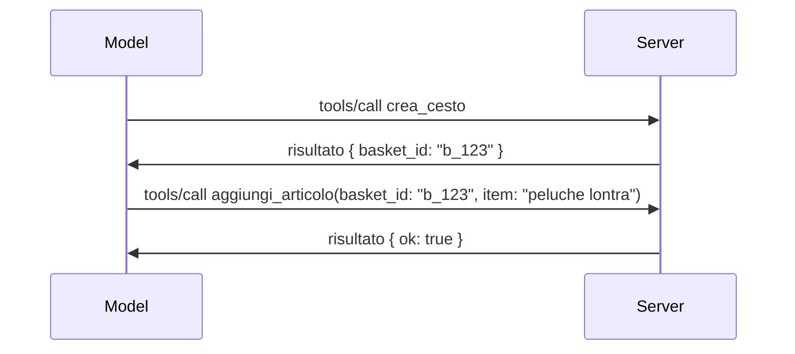

# Cosa Cambia in MCP: Il Release Candidate del 2026-07-28

> **Stato:** Release Candidate. La specifica `2026-07-28` non è definitiva al momento della stesura. È stata annunciata il 21 maggio 2026 e la sua distribuzione è prevista per il 28 luglio 2026. Tutto quanto in questa lezione descrive il release candidate; consulta la [specifica in bozza](https://modelcontextprotocol.io/specification/draft) e il suo [registro delle modifiche](https://modelcontextprotocol.io/specification/draft/changelog) per lo stato più aggiornato prima di sviluppare contro di essa. Il resto di questo curriculum è scritto contro la versione stabile attuale, **Specificazione MCP 2025-11-25**, e sarà aggiornato una volta che `2026-07-28` sarà distribuito.

## Panoramica

`2026-07-28` è la revisione più ampia di MCP da quando è stato lanciato. Sei Proposte di Miglioramento della Specifica (SEP) rimuovono le sessioni a livello di protocollo e rendono MCP senza stato al livello di trasporto, le estensioni diventano un meccanismo di prima classe e versionato, e diverse funzionalità imparate precedentemente in questo curriculum (Roots, Sampling, Logging) sono marcate come deprecate sotto una nuova politica di ciclo di vita. Questa lezione riassume cosa cambia, perché è importante e cosa significa per il codice che hai già scritto contro `2025-11-25`.

Fonte: [The 2026-07-28 MCP Specification Release Candidate](https://blog.modelcontextprotocol.io/posts/2026-07-28-release-candidate/) (Blog Model Context Protocol, David Soria Parra e Den Delimarsky).

## Obiettivi di Apprendimento

Al termine di questa lezione, potrai:

- Spiegare perché MCP sta passando a un core di protocollo senza stato e quale problema risolve per le distribuzioni scalate orizzontalmente.
- Descrivere come la stretta di mano `initialize`/`initialized` e l’header `Mcp-Session-Id` sono sostituiti.
- Identificare i nuovi header `Mcp-Method` e `Mcp-Name` e i metadati di caching `ttlMs`/`cacheScope`.
- Riconoscere il framework Extensions e le due estensioni incluse in questa release: MCP Apps e Tasks.
- Elencare le sei SEP di autorizzazione che rafforzano l’allineamento con OAuth 2.0 / OIDC.
- Identificare quali funzionalità core (Roots, Sampling, Logging) sono ora deprecate e cosa significa in pratica.
- Spiegare il cambiamento Full JSON Schema 2020-12 per `inputSchema`/`outputSchema` degli strumenti.

## Un Protocollo Senza Stato

La modifica principale: MCP diventa senza stato al livello di protocollo.

### Prima (2025-11-25): le sessioni ti legano a un’istanza del server

Chiamare uno strumento tramite Streamable HTTP inizia con una stretta di mano `initialize`. Il server risponde con un header `Mcp-Session-Id` che ogni richiesta successiva deve riportare:

```http
POST /mcp HTTP/1.1
Mcp-Session-Id: 1868a90c-3a3f-4f5b
Content-Type: application/json

{"jsonrpc":"2.0","id":2,"method":"tools/call",
 "params":{"name":"search","arguments":{"q":"otters"}}}
```

Poiché la sessione è legata all’istanza del server che l’ha emessa, le distribuzioni scalate orizzontalmente necessitano di **sticky routing** al bilanciatore di carico e di un **archivio sessione condiviso** tra le istanze.

### Dopo (2026-07-28): ogni richiesta è autonoma

```http
POST /mcp HTTP/1.1
MCP-Protocol-Version: 2026-07-28
Mcp-Method: tools/call
Mcp-Name: search
Content-Type: application/json

{"jsonrpc":"2.0","id":1,"method":"tools/call",
 "params":{"name":"search","arguments":{"q":"otters"},
           "_meta":{"io.modelcontextprotocol/clientInfo":{"name":"my-app","version":"1.0"}}}}
```

Qualsiasi istanza del server può gestire questa richiesta. Cambiamenti chiave:

- **La stretta di mano `initialize`/`initialized` è rimossa** ([SEP-2575](https://github.com/modelcontextprotocol/modelcontextprotocol/pull/2575)). La versione del protocollo, le informazioni e le capacità del client si spostano in `_meta` di ogni richiesta. Un nuovo metodo `server/discover` consente a un client di recuperare le capacità del server all’inizio quando necessario.
- **L’header `Mcp-Session-Id` e la sessione a livello di protocollo sono rimossi** ([SEP-2567](https://github.com/modelcontextprotocol/modelcontextprotocol/pull/2567)). Sticky routing e archivi sessione condivisi non sono più richiesti a livello di protocollo.

### Protocollo senza stato, applicazioni con stato

Rimuovere la sessione a livello di protocollo non significa che il tuo server non possa mantenere stato. Il modello consigliato è lo stesso che le API HTTP hanno sempre usato: generare un handle esplicito (un `basket_id`, un `browser_id`) da una chiamata a uno strumento e far passare quel handle al modello come argomento ordinario nelle chiamate successive.



Questo rende lo stato visibile e ragionevole per il modello invece di nasconderlo nei metadati di trasporto, e permette a qualsiasi istanza di server di gestire qualsiasi chiamata.

### Richieste da server a client, ristrutturate

Un protocollo senza stato ha comunque bisogno di un modo per far sì che un server chieda qualcosa al client a metà di una chiamata (per esempio, un prompt di elicitation):

- **Le richieste avviate dal server possono essere eseguite solo mentre il server sta attivamente processando una richiesta del client** ([SEP-2260](https://github.com/modelcontextprotocol/modelcontextprotocol/pull/2260)) — prima era solo una raccomandazione, ora è obbligatorio. Un utente non viene mai interpellato dal nulla.
- **Multi Round-Trip Requests** ([SEP-2322](https://github.com/modelcontextprotocol/modelcontextprotocol/pull/2322)) sostituiscono il mantenere aperto uno stream SSE. Invece, il server restituisce un `InputRequiredResult`:

  ```json
  {
    "resultType": "inputRequired",
    "inputRequests": {
      "confirm": {
        "type": "elicitation",
        "message": "Delete 3 files?",
        "schema": { "type": "boolean" }
      }
    },
    "requestState": "eyJzdGVwIjoxLCJmaWxlcyI6WyJhIiwiYiIsImMiXX0="
  }
  ```

  Il client raccoglie le risposte e riemette la chiamata originale con `inputResponses` più lo stato `requestState` riportato. Qualsiasi istanza del server può riprendere il retry perché tutto ciò che serve è nel payload.

### Instradabile, cacheabile, tracciabile

Tre cambiamenti minori rendono il traffico senza stato più facile da operare:

- **Gli header `Mcp-Method` e `Mcp-Name` sono obbligatori su Streamable HTTP** ([SEP-2243](https://github.com/modelcontextprotocol/modelcontextprotocol/pull/2243)), così bilanciatori di carico, gateway e limitatori di velocità possono instradare in base all’operazione senza ispezionare il corpo JSON. I server rifiutano richieste in cui header e corpo non corrispondono.
- **`tools/list` e i risultati di lettura delle risorse riportano `ttlMs` e `cacheScope`** ([SEP-2549](https://github.com/modelcontextprotocol/modelcontextprotocol/pull/2549)), modellati su HTTP `Cache-Control`. I client sanno per quanto tempo un risultato di lista è valido e se è sicuro condividerlo tra utenti, senza necessità di uno stream SSE persistente per apprendere modifiche.
- **La propagazione del W3C Trace Context in `_meta` è documentata** ([SEP-414](https://github.com/modelcontextprotocol/modelcontextprotocol/pull/414)), sistemando i nomi chiave `traceparent`, `tracestate` e `baggage` così che un trace distribuito possa seguire una chiamata attraverso client SDK, server MCP e sistemi a valle in un backend compatibile [OpenTelemetry](https://opentelemetry.io/).

## Le Estensioni Diventano di Prima Classe

Le estensioni esistevano informalmente in `2025-11-25`. [SEP-2133](https://github.com/modelcontextprotocol/modelcontextprotocol/pull/2133) le formalizza:

- Le estensioni sono identificate da ID DNS inversi.
- Sono negoziate tramite una mappa `extensions` nelle capacità del client e del server.
- Vivono in propri repository `ext-*` con manutentori delegati e versionano indipendentemente dalla specifica core.
- Una nuova Track Extensions nel processo SEP dà loro una strada dall’esperimento all’ufficialità.

Questa release include due estensioni ufficiali.

### MCP Apps: interfacce utente renderizzate dal server

[MCP Apps](https://blog.modelcontextprotocol.io/posts/2026-01-26-mcp-apps/) ([SEP-1865](https://github.com/modelcontextprotocol/modelcontextprotocol/pull/1865)) consente ai server di spedire interfacce HTML interattive che gli host renderizzano in un iframe sandboxato. Gli strumenti dichiarano i loro template UI in anticipo così gli host possono pre-caricarli, metterli in cache e revisionarli per la sicurezza prima di farli eseguire. Hai già visto i fondamenti in [Lezione 15: MCP Apps](../03-GettingStarted/15-mcp-apps/README.md) — sotto il framework Extensions, MCP Apps è ora formalmente un’estensione e non più una funzionalità core sperimentale.

### Tasks diventa un’estensione

Tasks è stata distribuita come funzionalità core sperimentale in `2025-11-25`. L’uso in produzione ha evidenziato tante riprogettazioni che la sua giusta collocazione è come estensione: l’[estensione Tasks](https://github.com/modelcontextprotocol/modelcontextprotocol/pull/2663) ristruttura il ciclo di vita attorno al modello senza stato — un server può rispondere a `tools/call` con un handle di task, e il client lo guida avanti con `tasks/get`, `tasks/update` e `tasks/cancel`. La creazione del task è diretta dal server: il client pubblicizza l’estensione e il server decide quando una chiamata deve essere eseguita come task. `tasks/list` è completamente rimosso perché non può essere definito in modo sicuro senza sessioni.

> **Nota di migrazione:** se hai implementato l’API experimental `2025-11-25` di Tasks, dovrai migrare al nuovo ciclo di vita dell’estensione — non è retrocompatibile.

## Rafforzamento dell’Autorizzazione

Sei SEP rafforzano la [specifica di autorizzazione](https://modelcontextprotocol.io/specification/draft/basic/authorization) per allinearsi più strettamente alle distribuzioni reali OAuth 2.0 / OpenID Connect:

| SEP | Modifica |
|---|---|
| [SEP-2468](https://github.com/modelcontextprotocol/modelcontextprotocol/pull/2468) | I client devono validare il parametro `iss` nelle risposte di autorizzazione secondo [RFC 9207](https://www.rfc-editor.org/rfc/rfc9207), mitigando attacchi mix-up comuni nel modello MCP con un solo client e molti server. Una versione futura richiederà di rifiutare risposte senza `iss`. |
| [SEP-837](https://github.com/modelcontextprotocol/modelcontextprotocol/pull/837) | I client dichiarano il proprio `application_type` OpenID Connect durante la Registrazione Dinamica del Client, evitando che i server di autorizzazione impostino di default un client desktop/CLI su `"web"` e rifiutino il suo redirect URI localhost. |
| [SEP-2352](https://github.com/modelcontextprotocol/modelcontextprotocol/pull/2352) | I client vincolano le credenziali registrate al `issuer` del server di autorizzazione emittente e si ri-registrano quando una risorsa migra tra server di autorizzazione. |
| [SEP-2207](https://github.com/modelcontextprotocol/modelcontextprotocol/pull/2207) | Documenta come richiedere token di refresh da server di autorizzazione in stile OpenID Connect. |
| [SEP-2350](https://github.com/modelcontextprotocol/modelcontextprotocol/pull/2350) | Chiarisce l’accumulo di scope durante l’autorizzazione step-up. |
| [SEP-2351](https://github.com/modelcontextprotocol/modelcontextprotocol/pull/2351) | Chiarisce il suffisso di discovery `.well-known`. |

Se oggi stai costruendo un server di autorizzazione per MCP, inizia a fornire `iss` nelle risposte di autorizzazione — vedi [02-Security](../02-Security/README.md) per la guida attuale all’autorizzazione su cui questo si basa.

## Roots, Sampling e Logging Sono Deprecati

Secondo la nuova [politica di ciclo di vita delle funzionalità](https://github.com/modelcontextprotocol/modelcontextprotocol/pull/2577) ([SEP-2577](https://github.com/modelcontextprotocol/modelcontextprotocol/pull/2577)), tre primitive client core che hai imparato in [Concetti Core](./README.md#roots) passano a stato **Deprecated**:

| Funzionalità | Sostituzione consigliata |
|---|---|
| Roots | Parametri degli strumenti, URI delle risorse o configurazioni server |
| Sampling | Integrazione diretta con API di provider LLM |
| Logging | `stderr` per trasporti stdio; OpenTelemetry per osservabilità strutturata |

Si tratta di **deprecazioni solo di annotazione**: metodi, tipi e flag di capacità continuano a funzionare in questa release e in ogni versione della specifica pubblicata entro un anno da questa. Rimuoverli completamente richiederà una SEP separata conforme alla politica di ciclo di vita — quindi oggi nessun tuo esempio [Sampling](../03-GettingStarted/14-sampling/README.md) si rompe, ma i nuovi server dovrebbero preferire i modelli sostitutivi indicati sopra.

## Full JSON Schema 2020-12 per gli Strumenti

`inputSchema` e `outputSchema` degli strumenti sono portati all’intero [JSON Schema 2020-12](https://json-schema.org/draft/2020-12) ([SEP-2106](https://github.com/modelcontextprotocol/modelcontextprotocol/pull/2106)):

- Gli schemi di input mantengono il vincolo root `type: "object"` ma ora consentono composizione (`oneOf`, `anyOf`, `allOf`), condizionali e riferimenti (`$ref`, `$defs`).
- Gli schemi di output non hanno restrizioni, e `structuredContent` può ora essere qualsiasi valore JSON anziché solo un oggetto.
- Le implementazioni non devono dereferenziare automaticamente URI `$ref` esterni e dovrebbero limitare la profondità e il tempo di validazione dello schema (una considerazione anti-denial-of-service da considerare se validi gli schemi server-side).

Separatamente, il codice errore per una risorsa mancante cambia dal custom MCP `-32002` allo standard JSON-RPC `-32602` (Invalid Params) ([SEP-2164](https://github.com/modelcontextprotocol/modelcontextprotocol/pull/2164)). Se il tuo client fa matching sul valore letterale `-32002`, dovrai aggiornarlo.

## Come Evolverà il Protocollo Da Qui

Questa release contiene cambiamenti di rottura, che i manutentori MCP non intendono rendere la norma in futuro. Tre SEP di governance mirano a prevenirli:

- La **politica di ciclo di vita delle funzionalità** dà a ogni funzionalità un percorso Attiva → Deprecata → Rimossa con almeno dodici mesi tra la deprecazione e la prima possibile rimozione.
- Il **framework Extensions** permette a nuove capacità di essere distribuite come estensioni opt-in e stabilizzarsi lì prima di (eventualmente) entrare nella specifica core.
- Un SEP del percorso Standard non può più raggiungere lo stato Finale fino a quando non viene inserito nello [scenario di conformità](https://github.com/modelcontextprotocol/conformance) ([SEP-2484](https://github.com/modelcontextprotocol/modelcontextprotocol/pull/2484)) — la stessa suite per cui il [sistema di livelli SDK](https://github.com/modelcontextprotocol/modelcontextprotocol/pull/1777) valuta gli SDK ufficiali.

## Cronologia del rilascio e convalida

- Il candidato alla release è stato bloccato il 21 maggio 2026.
- La specifica finale è programmata per il 28 luglio 2026.
- La finestra di dieci settimane tra le due date consente ai manutentori degli SDK e agli implementatori client di convalidare le modifiche con carichi di lavoro reali; ci si aspetta che gli SDK di livello 1 forniscano supporto entro questa finestra secondo il [sistema di livelli SDK](https://modelcontextprotocol.io/docs/sdk).
- Segui l’insieme completo delle modifiche nella [specifica bozza](https://modelcontextprotocol.io/specification/draft) e nel relativo [registro delle modifiche](https://modelcontextprotocol.io/specification/draft/changelog).

## Cosa significa per questo curriculum

Tutto ciò che hai imparato finora in questo corso si riferisce a **2025-11-25**, che rimane la specifica stabile corrente fino al rilascio del `2026-07-28`. In concreto:

- **Sessioni e handshake `initialize`** (coperti in [Concetti di Base](./README.md) e [Lezione 6: Streaming HTTP](../03-GettingStarted/06-http-streaming/README.md)) funzionano ancora come documentato oggi, ma aspettati che vengano sostituiti dal modello di richiesta senza stato descritto sopra una volta aggiornati gli SDK compatibili con `2026-07-28`.
- **Campionamento e Radici** (anch’essi trattati in [Concetti di Base](./README.md)) restano pienamente funzionali ma sono deprecati — i nuovi progetti dovrebbero preferire i pattern sostitutivi elencati sopra.
- **La funzionalità sperimentale Tasks**, se l’hai usata, dovrà essere migrata al nuovo ciclo di vita dell’estensione Tasks.
- **Le app MCP** ([Lezione 15](../03-GettingStarted/15-mcp-apps/README.md)) non subiscono modifiche pratiche; vengono semplicemente inserite nel quadro formale delle Estensioni.

## Risorse aggiuntive

- [Il candidato alla release della specifica MCP 2026-07-28 (post sul blog)](https://blog.modelcontextprotocol.io/posts/2026-07-28-release-candidate/)
- [Il futuro dei trasporti MCP](https://blog.modelcontextprotocol.io/posts/2025-12-19-mcp-transport-future/)
- [Bozza della specifica MCP](https://modelcontextprotocol.io/specification/draft)
- [Registro delle modifiche della bozza MCP](https://modelcontextprotocol.io/specification/draft/changelog)
- [Linee guida SEP](https://modelcontextprotocol.io/community/sep-guidelines)
- [Sistema di livelli SDK MCP](https://modelcontextprotocol.io/docs/sdk)

## Prossimi passi

Torna a [Concetti di Base](./README.md) oppure continua con [Sicurezza](../02-Security/README.md) per vedere come le linee guida di oggi `2025-11-25` si traducono in ciò che sta arrivando.

---

<!-- CO-OP TRANSLATOR DISCLAIMER START -->
**Disclaimer**:
Questo documento è stato tradotto utilizzando il servizio di traduzione AI [Co-op Translator](https://github.com/Azure/co-op-translator). Sebbene ci impegniamo per garantire la precisione, si prega di notare che le traduzioni automatizzate possono contenere errori o imprecisioni. Il documento originale nella sua lingua nativa deve essere considerato la fonte autorevole. Per informazioni critiche, si raccomanda una traduzione professionale effettuata da un essere umano. Non siamo responsabili per eventuali malintesi o interpretazioni errate derivanti dall’uso di questa traduzione.
<!-- CO-OP TRANSLATOR DISCLAIMER END -->