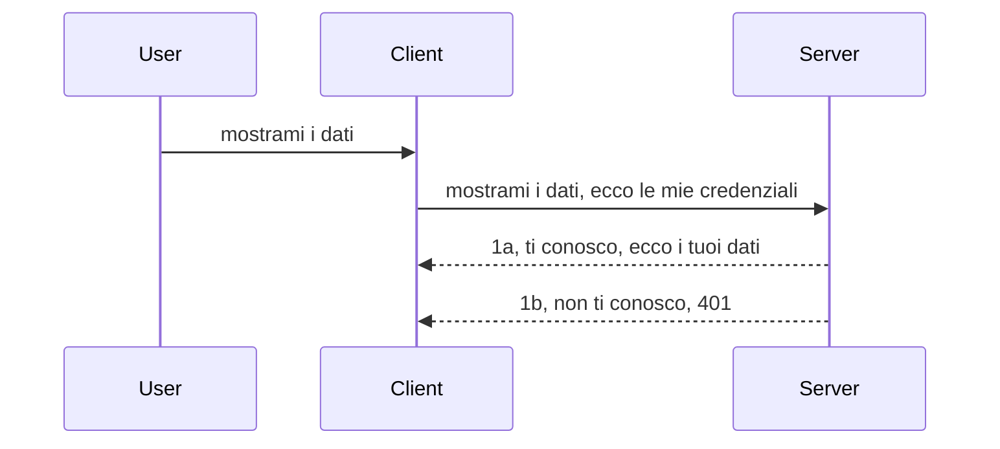

# Autenticazione semplice

Gli SDK MCP supportano l'uso di OAuth 2.1 che, a dire il vero, è un processo piuttosto complesso che coinvolge concetti come server di autenticazione, server di risorse, invio delle credenziali, ottenimento di un codice, scambio del codice con un token bearer fino a poter finalmente ottenere i dati della risorsa. Se non sei abituato a OAuth, che è una cosa ottima da implementare, è una buona idea iniziare con un livello base di autenticazione e poi migliorare la sicurezza progressivamente. Ecco perché questo capitolo esiste, per aiutarti a costruire progressivamente un'autenticazione più avanzata.

## Autenticazione, cosa intendiamo?

Auth è l'abbreviazione di autenticazione e autorizzazione. L'idea è che dobbiamo fare due cose:

- **Autenticazione**, che è il processo di capire se lasciamo entrare una persona nella nostra casa, che ha il diritto di essere "qui", cioè ha accesso al nostro server di risorse dove vivono le funzionalità del nostro MCP Server.
- **Autorizzazione**, è il processo di verificare se un utente dovrebbe avere accesso a risorse specifiche che sta chiedendo, ad esempio questi ordini o questi prodotti o se è autorizzato a leggere il contenuto ma non a cancellarlo, come altro esempio.

## Credenziali: come diciamo al sistema chi siamo

Bene, la maggior parte degli sviluppatori web inizia pensando in termini di fornire una credenziale al server, di solito un segreto che dice se sono autorizzati a essere qui "Autenticazione". Questa credenziale è solitamente una versione codificata base64 di username e password o una chiave API che identifica un utente specifico.

Questo implica inviarla tramite un header chiamato "Authorization" in questo modo:

```json
{ "Authorization": "secret123" }
```

Questo viene solitamente chiamato autenticazione di base. Come funziona il flusso generale è nel modo seguente:



Ora che abbiamo capito come funziona dal punto di vista del flusso, come lo implementiamo? Bene, la maggior parte dei web server ha un concetto chiamato middleware, un pezzo di codice che viene eseguito come parte della richiesta e può verificare le credenziali, e se le credenziali sono valide può lasciare passare la richiesta. Se la richiesta non ha credenziali valide, si ottiene un errore di autenticazione. Vediamo come può essere implementato:

**Python**

```python
class AuthMiddleware(BaseHTTPMiddleware):
    async def dispatch(self, request, call_next):

        has_header = request.headers.get("Authorization")
        if not has_header:
            print("-> Missing Authorization header!")
            return Response(status_code=401, content="Unauthorized")

        if not valid_token(has_header):
            print("-> Invalid token!")
            return Response(status_code=403, content="Forbidden")

        print("Valid token, proceeding...")
       
        response = await call_next(request)
        # aggiungere eventuali intestazioni del cliente o modificare la risposta in qualche modo
        return response


starlette_app.add_middleware(CustomHeaderMiddleware)
```

Qui abbiamo: 

- Creato un middleware chiamato `AuthMiddleware` dove il suo metodo `dispatch` viene invocato dal web server.
- Aggiunto il middleware al web server:

    ```python
    starlette_app.add_middleware(AuthMiddleware)
    ```

- Scritto una logica di validazione che verifica se l'header Authorization è presente e se il segreto inviato è valido:

    ```python
    has_header = request.headers.get("Authorization")
    if not has_header:
        print("-> Missing Authorization header!")
        return Response(status_code=401, content="Unauthorized")

    if not valid_token(has_header):
        print("-> Invalid token!")
        return Response(status_code=403, content="Forbidden")
    ```

    se il segreto è presente e valido, lasciamo passare la richiesta chiamando `call_next` e restituiamo la risposta.

    ```python
    response = await call_next(request)
    # aggiungi eventuali intestazioni personalizzate o modifica in qualche modo la risposta
    return response
    ```

Come funziona è che se viene effettuata una richiesta web verso il server, il middleware viene invocato e, dato il suo funzionamento, lascerà passare la richiesta o finirà per restituire un errore che indica che il client non è autorizzato a procedere.

**TypeScript**

Qui creiamo un middleware con il popolare framework Express e intercettiamo la richiesta prima che raggiunga l'MCP Server. Ecco il codice per questo:

```typescript
function isValid(secret) {
    return secret === "secret123";
}

app.use((req, res, next) => {
    // 1. Intestazione di autorizzazione presente?
    if(!req.headers["Authorization"]) {
        res.status(401).send('Unauthorized');
    }
    
    let token = req.headers["Authorization"];

    // 2. Verificare la validità.
    if(!isValid(token)) {
        res.status(403).send('Forbidden');
    }

   
    console.log('Middleware executed');
    // 3. Passa la richiesta al passaggio successivo nella pipeline della richiesta.
    next();
});
```

In questo codice:

1. Verifichiamo se l'header Authorization è presente, se no mandiamo un errore 401.
2. Assicuriamo che la credenziale/token sia valido, se no mandiamo un errore 403.
3. Infine passa la richiesta nel pipeline delle richieste e restituisce la risorsa richiesta.

## Esercizio: implementare l'autenticazione

Prendiamo la nostra conoscenza e proviamo a implementarla. Ecco il piano:

Server

- Creare un web server e un'istanza MCP.
- Implementare un middleware per il server.

Client

- Inviare una richiesta web, con credenziali, tramite header.

### -1- Creare un web server e un'istanza MCP

> **Guardando avanti:** l'esempio TypeScript sotto traccia i trasporti HTTP in una mappa `transports` indicizzata da `mcp-session-id`, secondo la **Specificazione MCP 2025-11-25**. La versione candidata al rilascio `2026-07-28` rimuove completamente il handshake `initialize` e l'ID sessione, perciò questa mappa dei trasporti per sessione scompare a favore di richieste stateless e autonome. Vedi [Cosa cambia in MCP: la release candidate 2026-07-28](../../01-CoreConcepts/mcp-2026-07-28-release-candidate.md).

Nel nostro primo passo, dobbiamo creare l'istanza del web server e l'MCP Server.

**Python**

Qui creiamo un'istanza di MCP Server, creiamo una app starlette e la ospitiamo con uvicorn.

```python
# creazione del server MCP

app = FastMCP(
    name="MCP Resource Server",
    instructions="Resource Server that validates tokens via Authorization Server introspection",
    host=settings["host"],
    port=settings["port"],
    debug=True
)

# creazione dell'app web starlette
starlette_app = app.streamable_http_app()

# servendo l'app tramite uvicorn
async def run(starlette_app):
    import uvicorn
    config = uvicorn.Config(
            starlette_app,
            host=app.settings.host,
            port=app.settings.port,
            log_level=app.settings.log_level.lower(),
        )
    server = uvicorn.Server(config)
    await server.serve()

run(starlette_app)
```

In questo codice:

- Creiamo l'MCP Server.
- Costruiamo l'app starlette da MCP Server, `app.streamable_http_app()`.
- Ospitiamo e serviamo l'app usando uvicorn `server.serve()`.

**TypeScript**

Qui creiamo un'istanza di MCP Server.

```typescript
const server = new McpServer({
      name: "example-server",
      version: "1.0.0"
    });

    // ... configura risorse del server, strumenti e prompt ...
```

La creazione dell'MCP Server dovrà avvenire entro la definizione della route POST /mcp, quindi prendiamo il codice sopra e lo spostiamo così:

```typescript
import express from "express";
import { randomUUID } from "node:crypto";
import { McpServer } from "@modelcontextprotocol/sdk/server/mcp.js";
import { StreamableHTTPServerTransport } from "@modelcontextprotocol/sdk/server/streamableHttp.js";
import { isInitializeRequest } from "@modelcontextprotocol/sdk/types.js"

const app = express();
app.use(express.json());

// Mappa per memorizzare i trasporti per ID sessione
const transports: { [sessionId: string]: StreamableHTTPServerTransport } = {};

// Gestire le richieste POST per la comunicazione client-server
app.post('/mcp', async (req, res) => {
  // Controlla se esiste già un ID sessione
  const sessionId = req.headers['mcp-session-id'] as string | undefined;
  let transport: StreamableHTTPServerTransport;

  if (sessionId && transports[sessionId]) {
    // Riutilizza il trasporto esistente
    transport = transports[sessionId];
  } else if (!sessionId && isInitializeRequest(req.body)) {
    // Nuova richiesta di inizializzazione
    transport = new StreamableHTTPServerTransport({
      sessionIdGenerator: () => randomUUID(),
      onsessioninitialized: (sessionId) => {
        // Memorizza il trasporto per ID sessione
        transports[sessionId] = transport;
      },
      // La protezione contro il DNS rebinding è disabilitata di default per compatibilità retroattiva. Se stai eseguendo questo server
      // localmente, assicurati di impostare:
      // enableDnsRebindingProtection: true,
      // allowedHosts: ['127.0.0.1'],
    });

    // Pulisci il trasporto quando viene chiuso
    transport.onclose = () => {
      if (transport.sessionId) {
        delete transports[transport.sessionId];
      }
    };
    const server = new McpServer({
      name: "example-server",
      version: "1.0.0"
    });

    // ... configura risorse del server, strumenti e prompt ...

    // Connetti al server MCP
    await server.connect(transport);
  } else {
    // Richiesta non valida
    res.status(400).json({
      jsonrpc: '2.0',
      error: {
        code: -32000,
        message: 'Bad Request: No valid session ID provided',
      },
      id: null,
    });
    return;
  }

  // Gestisci la richiesta
  await transport.handleRequest(req, res, req.body);
});

// Gestore riutilizzabile per richieste GET e DELETE
const handleSessionRequest = async (req: express.Request, res: express.Response) => {
  const sessionId = req.headers['mcp-session-id'] as string | undefined;
  if (!sessionId || !transports[sessionId]) {
    res.status(400).send('Invalid or missing session ID');
    return;
  }
  
  const transport = transports[sessionId];
  await transport.handleRequest(req, res);
};

// Gestisci le richieste GET per notifiche server-to-client via SSE
app.get('/mcp', handleSessionRequest);

// Gestisci le richieste DELETE per la terminazione della sessione
app.delete('/mcp', handleSessionRequest);

app.listen(3000);
```

Ora vedi come la creazione dell'MCP Server è stata spostata dentro `app.post("/mcp")`.

Passiamo al passo successivo di creare il middleware così da poter validare la credenziale in ingresso.

### -2- Implementare un middleware per il server

Procediamo con la parte del middleware. Qui creeremo un middleware che cerca una credenziale nell'header `Authorization` e la valida. Se è accettabile, la richiesta proseguirà per fare ciò che deve (ad esempio elencare strumenti, leggere una risorsa o qualunque funzionalità MCP richiesta dal client).

**Python**

Per creare il middleware, dobbiamo creare una classe che erediti da `BaseHTTPMiddleware`. Ci sono due elementi interessanti:

- La richiesta `request`, da cui leggiamo le informazioni dell'header.
- `call_next`, la callback da invocare se il client ha fornito una credenziale che accettiamo.

Per prima cosa, dobbiamo gestire il caso in cui l'header `Authorization` manchi:

```python
has_header = request.headers.get("Authorization")

# nessun header presente, fallire con 401, altrimenti procedere.
if not has_header:
    print("-> Missing Authorization header!")
    return Response(status_code=401, content="Unauthorized")
```

Qui inviamo un messaggio 401 non autorizzato perché il client fallisce nell'autenticazione.

Poi, se è stata inviata una credenziale, dobbiamo verificarne la validità così:

```python
 if not valid_token(has_header):
    print("-> Invalid token!")
    return Response(status_code=403, content="Forbidden")
```

Nota come sopra inviamo un messaggio 403 proibito. Vediamo il middleware completo qui sotto che implementa tutto quanto detto:

```python
class AuthMiddleware(BaseHTTPMiddleware):
    async def dispatch(self, request, call_next):

        has_header = request.headers.get("Authorization")
        if not has_header:
            print("-> Missing Authorization header!")
            return Response(status_code=401, content="Unauthorized")

        if not valid_token(has_header):
            print("-> Invalid token!")
            return Response(status_code=403, content="Forbidden")

        print("Valid token, proceeding...")
        print(f"-> Received {request.method} {request.url}")
        response = await call_next(request)
        response.headers['Custom'] = 'Example'
        return response

```

Ottimo, ma che fine fa la funzione `valid_token`? Eccola qui sotto:

```python
# NON usare per la produzione - miglioralo !!
def valid_token(token: str) -> bool:
    # rimuovi il prefisso "Bearer "
    if token.startswith("Bearer "):
        token = token[7:]
        return token == "secret-token"
    return False
```

Ovviamente questa dovrebbe essere migliorata.

IMPORTANTE: Non dovresti MAI avere segreti così nel codice. Idealmente dovresti recuperare il valore con cui confrontare da una fonte dati o da un IDP (provider di servizi identità) o ancor meglio, lasciare che sia l'IDP a fare la validazione.

**TypeScript**

Per implementare questo con Express, dobbiamo chiamare il metodo `use` che prende funzioni middleware.

Dobbiamo:

- Interagire con la variabile request per controllare la credenziale passata nella proprietà `Authorization`.
- Validare la credenziale e, se valida, lasciare continuare la richiesta e far sì che la richiesta MCP del client faccia ciò che deve (ad esempio elencare strumenti, leggere risorse o altre funzionalità MCP).

Qui controlliamo se l'header `Authorization` è presente e se no, fermiamo la richiesta:

```typescript
if(!req.headers["authorization"]) {
    res.status(401).send('Unauthorized');
    return;
}
```

Se l'header non viene inviato, ottieni un 401.

Poi verifichiamo se la credenziale è valida, se no fermiamo la richiesta nuovamente ma con un messaggio diverso:

```typescript
if(!isValid(token)) {
    res.status(403).send('Forbidden');
    return;
} 
```

Nota che ora ricevi un errore 403.

Ecco il codice completo:

```typescript
app.use((req, res, next) => {
    console.log('Request received:', req.method, req.url, req.headers);
    console.log('Headers:', req.headers["authorization"]);
    if(!req.headers["authorization"]) {
        res.status(401).send('Unauthorized');
        return;
    }
    
    let token = req.headers["authorization"];

    if(!isValid(token)) {
        res.status(403).send('Forbidden');
        return;
    }  

    console.log('Middleware executed');
    next();
});
```

Abbiamo predisposto il web server per accettare un middleware che verifica la credenziale che il client ci sta inviando. E il client stesso?

### -3- Inviare una richiesta web con credenziale tramite header

Dobbiamo assicurarci che il client stia passando la credenziale tramite l'header. Poiché useremo un client MCP per questo, dobbiamo capire come farlo.

**Python**

Per il client, dobbiamo passare un header con la nostra credenziale così:

```python
# NON inserire il valore direttamente nel codice, almeno mettilo in una variabile d'ambiente o in un archivio più sicuro
token = "secret-token"

async with streamablehttp_client(
        url = f"http://localhost:{port}/mcp",
        headers = {"Authorization": f"Bearer {token}"}
    ) as (
        read_stream,
        write_stream,
        session_callback,
    ):
        async with ClientSession(
            read_stream,
            write_stream
        ) as session:
            await session.initialize()
      
            # DA FARE, cosa vuoi che venga fatto nel client, es. elenco strumenti, chiamata strumenti ecc.
```

Nota come popola la proprietà `headers` così ` headers = {"Authorization": f"Bearer {token}"}`.

**TypeScript**

Possiamo risolvere questo in due passi:

1. Popolare un oggetto di configurazione con la nostra credenziale.
2. Passare l'oggetto di configurazione al trasporto.

```typescript

// NON codificare il valore direttamente come mostrato qui. Al minimo usalo come una variabile d'ambiente e utilizza qualcosa come dotenv (in modalità sviluppo).
let token = "secret123"

// definire un oggetto opzioni per il trasporto client
let options: StreamableHTTPClientTransportOptions = {
  sessionId: sessionId,
  requestInit: {
    headers: {
      "Authorization": "secret123"
    }
  }
};

// passare l'oggetto opzioni al trasporto
async function main() {
   const transport = new StreamableHTTPClientTransport(
      new URL(serverUrl),
      options
   );
```

Qui sopra vedi come abbiamo dovuto creare un oggetto `options` e mettere i nostri header sotto la proprietà `requestInit`.

IMPORTANTE: Come miglioriamo da qui? Beh, l'implementazione attuale ha alcuni problemi. Passare una credenziale così è abbastanza rischioso a meno che tu non abbia almeno HTTPS. Anche in quel caso, la credenziale può essere rubata, quindi serve un sistema che permetta di revocare facilmente il token e aggiungere ulteriori controlli come da dove nel mondo arriva, se la richiesta avviene troppo spesso (comportamento da bot), insomma, ci sono molte preoccupazioni.

Detto questo, per API molto semplici dove non vuoi che nessuno chiami la tua API senza autenticazione, ciò che abbiamo qui è un buon inizio.

Detto ciò, proviamo a rafforzare la sicurezza un po' usando un formato standardizzato come JSON Web Token, noto anche come JWT o token "JOT".

## JSON Web Tokens, JWT

Quindi, stiamo cercando di migliorare le cose rispetto all'invio di credenziali molto semplici. Quali sono i miglioramenti immediati che otteniamo adottando JWT?

- **Miglioramenti di sicurezza**. Nell'autenticazione base, invii nome utente e password come token codificato base64 (o una chiave API) ripetutamente aumentando il rischio. Con JWT, invii nome utente e password e ricevi un token in cambio che è anche limitato nel tempo, quindi scade. JWT ti permette di usare facilmente un controllo degli accessi a grana fine usando ruoli, scope e permessi.
- **Statelessness e scalabilità**. I JWT sono autonomi, portano tutte le info dell'utente e eliminano la necessità di sessioni lato server. I token possono anche essere validati localmente.
- **Interoperabilità e federazione**. I JWT sono centrali in Open ID Connect e usati con provider d'identità noti come Entra ID, Google Identity e Auth0. Permettono anche il single sign-on e molto altro rendendoli di livello enterprise.
- **Modularità e flessibilità**. I JWT possono essere usati con API Gateway come Azure API Management, NGINX e altri. Supportano scenari di autenticazione utente e comunicazione server-to-service inclusi scenari di impersonificazione e delega.
- **Performance e caching**. I JWT possono essere memorizzati nella cache dopo la decodifica, riducendo la necessità di parsing. Questo aiuta applicazioni con alto traffico migliorando il throughput e riducendo il carico sull'infrastruttura scelta.
- **Funzionalità avanzate**. Supportano anche introspezione (controllo di validità sul server) e revoca (rendere un token invalido).

Con tutti questi vantaggi, vediamo come portare la nostra implementazione al livello successivo.

## Trasformare l'autenticazione base in JWT

Quindi, le modifiche che dobbiamo fare a grandi linee sono:

- **Imparare a costruire un token JWT** e renderlo pronto per essere inviato dal client al server.
- **Validare un token JWT** e se valido, consentire al client di avere le nostre risorse.
- **Conservazione sicura del token**. Come conserviamo questo token.
- **Proteggere le rotte**. Dobbiamo proteggere le rotte, nel nostro caso dobbiamo proteggere rotte e funzionalità MCP specifiche.
- **Aggiungere token di refresh**. Assicurarci di creare token a breve durata ma con token di refresh a lunga durata che possano essere usati per acquisire nuovi token se scadono. Assicurarci anche di avere un endpoint di refresh e una strategia di rotazione.

### -1- Costruire un token JWT

Per prima cosa, un token JWT ha le seguenti parti:

- **header**, algoritmo usato e tipo token.
- **payload**, claim, come sub (l'utente o entità che il token rappresenta. In uno scenario di autenticazione è tipicamente l'ID utente), exp (quando scade), role (il ruolo)
- **signature**, firmata con un segreto o chiave privata.

Per questo, dobbiamo costruire header, payload e il token codificato.

**Python**

```python

import jwt
import jwt
from jwt.exceptions import ExpiredSignatureError, InvalidTokenError
import datetime

# Chiave segreta usata per firmare il JWT
secret_key = 'your-secret-key'

header = {
    "alg": "HS256",
    "typ": "JWT"
}

# le informazioni dell'utente, le sue rivendicazioni e il tempo di scadenza
payload = {
    "sub": "1234567890",               # Soggetto (ID utente)
    "name": "User Userson",                # Rivendicazione personalizzata
    "admin": True,                     # Rivendicazione personalizzata
    "iat": datetime.datetime.utcnow(),# Emesso il
    "exp": datetime.datetime.utcnow() + datetime.timedelta(hours=1)  # Scadenza
}

# codificalo
encoded_jwt = jwt.encode(payload, secret_key, algorithm="HS256", headers=header)
```

Nel codice sopra abbiamo:

- Definito un header usando HS256 come algoritmo e tipo JWT.
- Costruito un payload che contiene un soggetto o ID utente, un nome utente, un ruolo, quando è stato emesso e quando scade implementando così l'aspetto di limitazione temporale menzionato prima.

**TypeScript**

Qui avremo bisogno di alcune dipendenze che ci aiutano a costruire il token JWT.

Dipendenze

```sh

npm install jsonwebtoken
npm install --save-dev @types/jsonwebtoken
```

Ora che abbiamo questo in posto, creiamo header, payload e tramite quello creiamo il token codificato.

```typescript
import jwt from 'jsonwebtoken';

const secretKey = 'your-secret-key'; // Usa variabili d'ambiente in produzione

// Definisci il payload
const payload = {
  sub: '1234567890',
  name: 'User usersson',
  admin: true,
  iat: Math.floor(Date.now() / 1000), // Emesso a
  exp: Math.floor(Date.now() / 1000) + 60 * 60 // Scade in 1 ora
};

// Definisci l'intestazione (opzionale, jsonwebtoken imposta i valori predefiniti)
const header = {
  alg: 'HS256',
  typ: 'JWT'
};

// Crea il token
const token = jwt.sign(payload, secretKey, {
  algorithm: 'HS256',
  header: header
});

console.log('JWT:', token);
```

Questo token è:

Firmato usando HS256  
Valido per 1 ora  
Include claim come sub, name, admin, iat e exp.

### -2- Validare un token

Avremo anche bisogno di validare un token, cosa che dobbiamo fare sul server per assicurarci che ciò che il client ci invia sia effettivamente valido. Ci sono molti controlli da fare, dalla struttura alla validità. Sei anche incoraggiato a fare altri controlli per vedere se l'utente è nel tuo sistema e altro.

Per validare un token, dobbiamo decodificarlo così possiamo leggerlo e poi iniziare a verificarne la validità:

**Python**

```python

# Decodifica e verifica il JWT
try:
    decoded = jwt.decode(token, secret_key, algorithms=["HS256"])
    print("✅ Token is valid.")
    print("Decoded claims:")
    for key, value in decoded.items():
        print(f"  {key}: {value}")
except ExpiredSignatureError:
    print("❌ Token has expired.")
except InvalidTokenError as e:
    print(f"❌ Invalid token: {e}")

```

In questo codice, chiamiamo `jwt.decode` utilizzando il token, la chiave segreta e l'algoritmo scelto come input. Nota come usiamo una struttura try-catch poiché una validazione fallita porta a un errore.

**TypeScript**

Qui dobbiamo chiamare `jwt.verify` per ottenere una versione decodificata del token che possiamo analizzare ulteriormente. Se questa chiamata fallisce, significa che la struttura del token è errata o non è più valido.

```typescript

try {
  const decoded = jwt.verify(token, secretKey);
  console.log('Decoded Payload:', decoded);
} catch (err) {
  console.error('Token verification failed:', err);
}
```

NOTE: come detto in precedenza, dovremmo eseguire controlli aggiuntivi per assicurarci che questo token indichi un utente nel nostro sistema e che l'utente abbia i diritti che dichiara di avere.

Passiamo ora a esaminare il controllo degli accessi basato sui ruoli, noto anche come RBAC.

## Aggiungere il controllo degli accessi basato sui ruoli

L'idea è che vogliamo esprimere che ruoli diversi hanno permessi diversi. Ad esempio, assumiamo che un amministratore possa fare tutto, un utente normale possa leggere/scrivere e un ospite possa solo leggere. Pertanto, ecco alcuni possibili livelli di permesso:

- Admin.Write
- User.Read
- Guest.Read

Vediamo come possiamo implementare tale controllo con un middleware. I middleware possono essere aggiunti per singola route o per tutte le route.

**Python**

```python
from starlette.middleware.base import BaseHTTPMiddleware
from starlette.responses import JSONResponse
import jwt

# NON mettere il segreto nel codice come questo, è solo a scopo dimostrativo. Leggilo da un posto sicuro.
SECRET_KEY = "your-secret-key" # mettilo in una variabile d'ambiente
REQUIRED_PERMISSION = "User.Read"

class JWTPermissionMiddleware(BaseHTTPMiddleware):
    async def dispatch(self, request, call_next):
        auth_header = request.headers.get("Authorization")
        if not auth_header or not auth_header.startswith("Bearer "):
            return JSONResponse({"error": "Missing or invalid Authorization header"}, status_code=401)

        token = auth_header.split(" ")[1]
        try:
            decoded = jwt.decode(token, SECRET_KEY, algorithms=["HS256"])
        except jwt.ExpiredSignatureError:
            return JSONResponse({"error": "Token expired"}, status_code=401)
        except jwt.InvalidTokenError:
            return JSONResponse({"error": "Invalid token"}, status_code=401)

        permissions = decoded.get("permissions", [])
        if REQUIRED_PERMISSION not in permissions:
            return JSONResponse({"error": "Permission denied"}, status_code=403)

        request.state.user = decoded
        return await call_next(request)


```

Ci sono diversi modi per aggiungere il middleware come mostrato di seguito:

```python

# Alternativa 1: aggiungi middleware durante la costruzione dell'app starlette
middleware = [
    Middleware(JWTPermissionMiddleware)
]

app = Starlette(routes=routes, middleware=middleware)

# Alternativa 2: aggiungi middleware dopo che l'app starlette è già stata costruita
starlette_app.add_middleware(JWTPermissionMiddleware)

# Alternativa 3: aggiungi middleware per ogni route
routes = [
    Route(
        "/mcp",
        endpoint=..., # gestore
        middleware=[Middleware(JWTPermissionMiddleware)]
    )
]
```

**TypeScript**

Possiamo usare `app.use` e un middleware che verrà eseguito per tutte le richieste.

```typescript
app.use((req, res, next) => {
    console.log('Request received:', req.method, req.url, req.headers);
    console.log('Headers:', req.headers["authorization"]);

    // 1. Verifica se l'intestazione di autorizzazione è stata inviata

    if(!req.headers["authorization"]) {
        res.status(401).send('Unauthorized');
        return;
    }
    
    let token = req.headers["authorization"];

    // 2. Verifica se il token è valido
    if(!isValid(token)) {
        res.status(403).send('Forbidden');
        return;
    }  

    // 3. Verifica se l'utente del token esiste nel nostro sistema
    if(!isExistingUser(token)) {
        res.status(403).send('Forbidden');
        console.log("User does not exist");
        return;
    }
    console.log("User exists");

    // 4. Verifica che il token abbia le autorizzazioni corrette
    if(!hasScopes(token, ["User.Read"])){
        res.status(403).send('Forbidden - insufficient scopes');
    }

    console.log("User has required scopes");

    console.log('Middleware executed');
    next();
});

```

Ci sono diverse cose che possiamo lasciare fare al nostro middleware e che il nostro middleware DOVREBBE fare, ovvero:

1. Controllare se è presente l'header di autorizzazione
2. Controllare se il token è valido, chiamiamo `isValid` che è un metodo che abbiamo scritto e che verifica l'integrità e la validità del token JWT.
3. Verificare che l'utente esista nel nostro sistema, questo controllo dovremmo farlo.

   ```typescript
    // utenti nel DB
   const users = [
     "user1",
     "User usersson",
   ]

   function isExistingUser(token) {
     let decodedToken = verifyToken(token);

     // DA FARE, verifica se l'utente esiste nel DB
     return users.includes(decodedToken?.name || "");
   }
   ```

   Sopra, abbiamo creato una lista molto semplice `users`, che ovviamente dovrebbe essere in un database.

4. Inoltre, dovremmo anche verificare che il token abbia i permessi corretti.

   ```typescript
   if(!hasScopes(token, ["User.Read"])){
        res.status(403).send('Forbidden - insufficient scopes');
   }
   ```

   Nel codice sopra del middleware, controlliamo che il token contenga il permesso User.Read, altrimenti inviamo un errore 403. Di seguito è riportato il metodo di aiuto `hasScopes`.

   ```typescript
   function hasScopes(scope: string, requiredScopes: string[]) {
     let decodedToken = verifyToken(scope);
    return requiredScopes.every(scope => decodedToken?.scopes.includes(scope));
  }
   ```

Have a think which additional checks you should be doing, but these are the absolute minimum of checks you should be doing.

Using Express as a web framework is a common choice. There are helpers library when you use JWT so you can write less code.

- `express-jwt`, helper library that provides a middleware that helps decode your token.
- `express-jwt-permissions`, this provides a middleware `guard` that helps check if a certain permission is on the token.

Here's what these libraries can look like when used:

```typescript
const express = require('express');
const jwt = require('express-jwt');
const guard = require('express-jwt-permissions')();

const app = express();
const secretKey = 'your-secret-key'; // put this in env variable

// Decode JWT and attach to req.user
app.use(jwt({ secret: secretKey, algorithms: ['HS256'] }));

// Check for User.Read permission
app.use(guard.check('User.Read'));

// multiple permissions
// app.use(guard.check(['User.Read', 'Admin.Access']));

app.get('/protected', (req, res) => {
  res.json({ message: `Welcome ${req.user.name}` });
});

// Error handler
app.use((err, req, res, next) => {
  if (err.code === 'permission_denied') {
    return res.status(403).send('Forbidden');
  }
  next(err);
});

```

Ora che hai visto come il middleware può essere usato sia per l'autenticazione che per l'autorizzazione, che dire dell'MCP? Cambia il modo in cui facciamo l'autenticazione? Scopriamolo nella prossima sezione.

### -3- Aggiungere RBAC a MCP

Hai visto finora come puoi aggiungere RBAC tramite middleware, tuttavia, per MCP non esiste un modo semplice per aggiungere un RBAC per singola funzionalità MCP, quindi cosa facciamo? Bene, dobbiamo semplicemente aggiungere del codice come questo che controlla in questo caso se il client ha i diritti per chiamare uno strumento specifico:

Hai alcune scelte diverse su come realizzare un RBAC per funzionalità, eccone alcune:

- Aggiungere un controllo per ogni strumento, risorsa, prompt dove devi verificare il livello di permesso.

   **python**

   ```python
   @tool()
   def delete_product(id: int):
      try:
          check_permissions(role="Admin.Write", request)
      catch:
        pass # il client non ha superato l'autorizzazione, genera un errore di autorizzazione
   ```

   **typescript**

   ```typescript
   server.registerTool(
    "delete-product",
    {
      title: Delete a product",
      description: "Deletes a product",
      inputSchema: { id: z.number() }
    },
    async ({ id }) => {
      
      try {
        checkPermissions("Admin.Write", request);
        // da fare, inviare l'id a productService e all'entry remota
      } catch(Exception e) {
        console.log("Authorization error, you're not allowed");  
      }

      return {
        content: [{ type: "text", text: `Deletected product with id ${id}` }]
      };
    }
   );
   ```


- Usare un approccio server avanzato e i gestori di richieste così minimizzi i posti in cui devi fare il controllo.

   **Python**

   ```python
   
   tool_permission = {
      "create_product": ["User.Write", "Admin.Write"],
      "delete_product": ["Admin.Write"]
   }

   def has_permission(user_permissions, required_permissions) -> bool:
      # user_permissions: lista dei permessi che l'utente ha
      # required_permissions: lista dei permessi richiesti per lo strumento
      return any(perm in user_permissions for perm in required_permissions)

   @server.call_tool()
   async def handle_call_tool(
     name: str, arguments: dict[str, str] | None
   ) -> list[types.TextContent]:
    # Si presume che request.user.permissions sia una lista di permessi per l'utente
     user_permissions = request.user.permissions
     required_permissions = tool_permission.get(name, [])
     if not has_permission(user_permissions, required_permissions):
        # Genera errore "Non hai il permesso di usare lo strumento {name}"
        raise Exception(f"You don't have permission to call tool {name}")
     # continua e chiama lo strumento
     # ...
   ```   
   

   **TypeScript**

   ```typescript
   function hasPermission(userPermissions: string[], requiredPermissions: string[]): boolean {
       if (!Array.isArray(userPermissions) || !Array.isArray(requiredPermissions)) return false;
       // Restituisce true se l'utente ha almeno un permesso richiesto
       
       return requiredPermissions.some(perm => userPermissions.includes(perm));
   }
  
   server.setRequestHandler(CallToolRequestSchema, async (request) => {
      const { params: { name } } = request;
  
      let permissions = request.user.permissions;
  
      if (!hasPermission(permissions, toolPermissions[name])) {
         return new Error(`You don't have permission to call ${name}`);
      }
  
      // continua..
   });
   ```

   Nota, dovrai assicurarti che il middleware assegni un token decodificato alla proprietà user della richiesta in modo che il codice sopra sia semplice.

### Riepilogo

Ora che abbiamo discusso come aggiungere il supporto per RBAC in generale e per MCP in particolare, è ora di provare a implementare la sicurezza da solo per assicurarti di aver capito i concetti che ti sono stati presentati.

## Assegnazione 1: Costruire un server MCP e un client MCP usando l'autenticazione di base

Qui metterai in pratica ciò che hai imparato riguardo l'invio delle credenziali tramite header.

## Soluzione 1

[Solution 1](./code/basic/README.md)

## Assegnazione 2: Aggiorna la soluzione della Assegnazione 1 per usare JWT

Prendi la prima soluzione ma questa volta miglioriamola.

Invece di usare Basic Auth, usiamo JWT.

## Soluzione 2

[Solution 2](./solution/jwt-solution/README.md)

## Sfida

Aggiungi il RBAC per ogni strumento come descritto nella sezione "Aggiungere RBAC a MCP".

## Sommario

Speriamo che tu abbia imparato molto in questo capitolo, dalla completa assenza di sicurezza, alla sicurezza base, a JWT e a come può essere aggiunto a MCP.

Abbiamo costruito una solida base con JWT personalizzati, ma man mano che cresciamo, ci stiamo spostando verso un modello di identità basato su standard. Adottare un IdP come Entra o Keycloak ci permette di scaricare l'emissione, la convalida e la gestione del ciclo di vita del token su una piattaforma affidabile — liberandoci per concentrarci sulla logica dell'app e sull'esperienza utente.

Per questo, abbiamo un capitolo più [avanzato su Entra](../../05-AdvancedTopics/mcp-security-entra/README.md)

## Cosa c'è dopo

- Successivo: [Configurazione degli host MCP](../12-mcp-hosts/README.md)

---

<!-- CO-OP TRANSLATOR DISCLAIMER START -->
**Disclaimer**:
Questo documento è stato tradotto utilizzando il servizio di traduzione AI [Co-op Translator](https://github.com/Azure/co-op-translator). Sebbene ci impegniamo per garantire la precisione, si prega di notare che le traduzioni automatizzate possono contenere errori o imprecisioni. Il documento originale nella sua lingua nativa deve essere considerato la fonte autorevole. Per informazioni critiche, si raccomanda una traduzione professionale effettuata da un essere umano. Non siamo responsabili per eventuali malintesi o interpretazioni errate derivanti dall’uso di questa traduzione.
<!-- CO-OP TRANSLATOR DISCLAIMER END -->