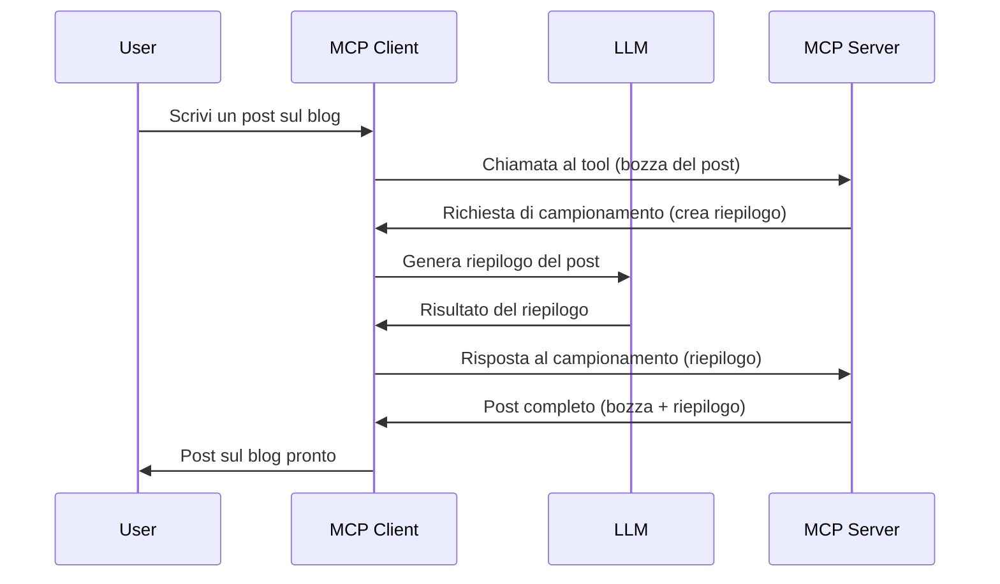

# Sampling - delegare funzionalità al Client

> **Avviso di deprecazione:** il candidato alla specifica MCP `2026-07-28` segna Sampling come deprecato a favore dell'integrazione diretta con le API del provider LLM. Sampling continua a funzionare in `2025-11-25` e per almeno un anno dopo qualsiasi deprecazione formale, quindi tutto in questa lezione rimane valido — ma i nuovi progetti di server dovrebbero valutare il modello sostitutivo. Vedi [Cosa cambia in MCP: Il candidato alla release 2026-07-28](../../01-CoreConcepts/mcp-2026-07-28-release-candidate.md).

A volte, è necessario che il Cliente MCP e il Server MCP collaborino per raggiungere un obiettivo comune. Potresti avere un caso in cui il Server richieda l'aiuto di un LLM che risiede sul client. Per questa situazione, Sampling è ciò che dovresti utilizzare.

Esploriamo alcuni casi d'uso e come costruire una soluzione che coinvolga Sampling.

## Panoramica

In questa lezione, ci concentriamo su quando e dove usare Sampling e su come configurarlo.

## Obiettivi di apprendimento

In questo capitolo, spiegheremo:

- Cos'è Sampling e quando usarlo.
- Come configurare Sampling in MCP.
- Fornire esempi pratici di Sampling.

## Cos'è Sampling e perché usarlo?

Sampling è una funzionalità avanzata che funziona nel seguente modo:


  
### Richiesta di Sampling

Ok, ora abbiamo una visione d'insieme di uno scenario credibile, parliamo della richiesta di sampling che il server invia al client. Ecco come può apparire tale richiesta in formato JSON-RPC:

```json
{
  "jsonrpc": "2.0",
  "id": 1,
  "method": "sampling/createMessage",
  "params": {
    "messages": [
      {
        "role": "user",
        "content": {
          "type": "text",
          "text": "Create a blog post summary of the following blog post: <BLOG POST>"
        }
      }
    ],
    "modelPreferences": {
      "hints": [
        {
          "name": "claude-3-sonnet"
        }
      ],
      "intelligencePriority": 0.8,
      "speedPriority": 0.5
    },
    "systemPrompt": "You are a helpful assistant.",
    "maxTokens": 100
  }
}
```
  
Ci sono alcune cose da evidenziare:

- Prompt, sotto content -> text, è il nostro prompt che è un'istruzione per l'LLM per riassumere il contenuto di un post del blog.

- **modelPreferences**. Questa sezione è proprio questo, una preferenza, una raccomandazione sulla configurazione da usare con l'LLM. L'utente può scegliere se seguire queste raccomandazioni o cambiarle. In questo caso ci sono raccomandazioni sul modello da usare e sulla priorità di velocità e intelligenza.
- **systemPrompt**, questo è il normale prompt di sistema che assegna una personalità all'LLM e contiene istruzioni guida.
- **maxTokens**, questa è un'altra proprietà usata per indicare quanti token si raccomanda di usare per questo compito.

### Risposta di Sampling

Questa risposta è ciò che il Cliente MCP invia indietro al Server MCP ed è il risultato della chiamata dell'LLM da parte del client, l'attesa di quella risposta e poi la costruzione di questo messaggio. Ecco come può apparire in JSON-RPC:

```json
{
  "jsonrpc": "2.0",
  "id": 1,
  "result": {
    "role": "assistant",
    "content": {
      "type": "text",
      "text": "Here's your abstract <ABSTRACT>"
    },
    "model": "gpt-5",
    "stopReason": "endTurn"
  }
}
```
  
Nota come la risposta sia un abstract del post del blog proprio come abbiamo chiesto. Nota anche come il modello usato non sia quello richiesto ma "gpt-5" invece di "claude-3-sonnet". Questo serve a illustrare che l'utente può cambiare idea su cosa usare e che la tua richiesta di sampling è una raccomandazione.

Ok, ora che capiamo il flusso principale, e un compito utile su cui usarlo "creazione + abstract di un post del blog", vediamo cosa dobbiamo fare perché funzioni.

### Tipi di messaggi

I messaggi di Sampling non sono limitati al solo testo ma puoi anche inviare immagini e audio. Ecco come cambia il JSON-RPC:

**Testo**

```json
{
  "type": "text",
  "text": "The message content"
}
```
  
**Contenuto immagine**

```json
{
  "type": "image",
  "data": "base64-encoded-image-data",
  "mimeType": "image/jpeg"
}
```
  
**Contenuto audio**

```json
{
  "type": "audio",
  "data": "base64-encoded-audio-data",
  "mimeType": "audio/wav"
}
```
  
> NOTE: per maggiori informazioni su Sampling, consulta la [documentazione ufficiale](https://modelcontextprotocol.io/specification/2025-11-25/client/sampling)

## Come configurare Sampling nel Client

> Nota: se stai solo costruendo un server, non devi fare molto qui.

Nel client, devi specificare la seguente funzionalità così:

```json
{
  "capabilities": {
    "sampling": {}
  }
}
```
  
Questa sarà poi rilevata quando il client scelto viene inizializzato con il server.

## Esempio di Sampling in azione - Creare un post sul blog

Scriviamo insieme un server di sampling, dovremo fare quanto segue:

1. Creare uno strumento sul Server.
2. Questo strumento dovrebbe creare una richiesta di sampling.
3. Lo strumento dovrebbe attendere una risposta alla richiesta di sampling del client.
4. Successivamente il risultato dello strumento deve essere prodotto.

Vediamo il codice passo-passo:

### -1- Creare lo strumento

**python**

```python
@mcp.tool()
async def create_blog(title: str, content: str, ctx: Context[ServerSession, None]) -> str:
    """Create a blog post and generate a summary"""

```
  
### -2- Creare una richiesta di sampling

Estendi il tuo strumento con il seguente codice:

**python**

```python
post = BlogPost(
        id=len(posts) + 1,
        title=title,
        content=content,
        abstract=""
    )

prompt = f"Create an abstract of the following blog post: title: {title} and draft: {content} "

result = await ctx.session.create_message(
        messages=[
            SamplingMessage(
                role="user",
                content=TextContent(type="text", text=prompt),
            )
        ],
        max_tokens=100,
)

```
  
### -3- Attendere la risposta e restituirla

**python**

```python
post.abstract = result.content.text

posts.append(post)

# restituisci il prodotto completo
return json.dumps({
    "id": post.title,
    "abstract": post.abstract
})
```
  
### -4- Codice completo

**python**

```python
from starlette.applications import Starlette
from starlette.routing import Mount, Host

from mcp.server.fastmcp import Context, FastMCP

from mcp.server.session import ServerSession
from mcp.types import SamplingMessage, TextContent

import json


from uuid import uuid4
from typing import List
from pydantic import BaseModel


mcp = FastMCP("Blog post generator")

# app = FastAPI()

posts = []

class BlogPost(BaseModel):
    id: int
    title: str
    content: str
    abstract: str

posts: List[BlogPost] = []

@mcp.tool()
async def create_blog(title: str, content: str, ctx: Context[ServerSession, None]) -> str:
    """Create a blog post and generate a summary"""

    post = BlogPost(
        id=len(posts) + 1,
        title=title,
        content=content,
        abstract=""
    )

    prompt = f"Create an abstract of the following blog post: title: {title} and draft: {content} "

    result = await ctx.session.create_message(
        messages=[
            SamplingMessage(
                role="user",
                content=TextContent(type="text", text=prompt),
            )
        ],
        max_tokens=100,
    )

    post.abstract = result.content.text

    posts.append(post)

    # restituisci il post completo del blog
    return json.dumps({
        "id": post.title,
        "abstract": post.abstract
    })

if __name__ == "__main__":
    print("Starting server...")
    # mcp.run()
    mcp.run(transport="streamable-http")

# esegui l'app con: python server.py
```
  
### -5- Testarlo in Visual Studio Code

Per testarlo in Visual Studio Code, fai quanto segue:

1. Avvia il server nel terminale  
2. Aggiungilo a *mcp.json* (e assicurati che sia avviato), qualcosa di simile a:

   ```json
   "servers": {
      "blog-server": {
        "type": "http",
        "url": "http://localhost:8000/mcp"
      }
   }
   ```
  
3. Digita un prompt:

   ```text
   create a blog post named "Where Python comes from", the content is "Python is actually named after Monty Python Flying Circus"
   ```
  
4. Permetti il sampling. La prima volta che testi questo, ti sarà presentato un dialogo aggiuntivo che dovrai accettare, poi vedrai il dialogo normale per chiederti di eseguire uno strumento.

5. Esamina i risultati. Vedrai i risultati sia renderizzati ordinatamente in GitHub Copilot Chat ma puoi anche esaminare la risposta JSON grezza.

**Bonus**. Gli strumenti di Visual Studio Code hanno un ottimo supporto per Sampling. Puoi configurare l'accesso a Sampling sul server installato navigando così:

1. Naviga alla sezione estensioni.  
2. Seleziona l'icona dell'ingranaggio per il server installato nella sezione "MCP SERVERS - INSTALLED".  
3. Seleziona "Configure Model Access", qui puoi scegliere quali Modelli GitHub Copilot può usare durante il sampling. Puoi anche vedere tutte le richieste di sampling avvenute recentemente selezionando "Show Sampling requests".

## Compito

In questo compito costruirai un Sampling leggermente diverso, cioè un'integrazione di sampling che supporta la generazione di una descrizione prodotto. Ecco il tuo scenario:

**Scenario**: L'impiegato del back office di un e-commerce ha bisogno di aiuto, ci vuole troppo tempo per generare descrizioni prodotto. Pertanto, devi costruire una soluzione in cui puoi chiamare uno strumento "create_product" con "title" e "keywords" come argomenti e dovrebbe produrre un prodotto completo incluso un campo "description" che deve essere popolato dall'LLM del client.

TIP: usa ciò che hai imparato prima per costruire questo server e il suo strumento usando una richiesta di sampling.

## Soluzione

[Soluzione](./solution/README.md)

## Principali concetti da ricordare

Sampling è una funzionalità potente che permette al server di delegare compiti al client quando ha bisogno dell'aiuto di un LLM.

## Cosa c’è dopo

- [Capitolo 4 - Implementazione pratica](../../04-PracticalImplementation/README.md)

---

<!-- CO-OP TRANSLATOR DISCLAIMER START -->
**Disclaimer**:
Questo documento è stato tradotto utilizzando il servizio di traduzione AI [Co-op Translator](https://github.com/Azure/co-op-translator). Sebbene ci impegniamo per garantire la precisione, si prega di notare che le traduzioni automatizzate possono contenere errori o imprecisioni. Il documento originale nella sua lingua nativa deve essere considerato la fonte autorevole. Per informazioni critiche, si raccomanda una traduzione professionale effettuata da un essere umano. Non siamo responsabili per eventuali malintesi o interpretazioni errate derivanti dall’uso di questa traduzione.
<!-- CO-OP TRANSLATOR DISCLAIMER END -->