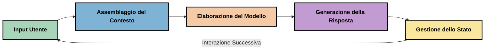
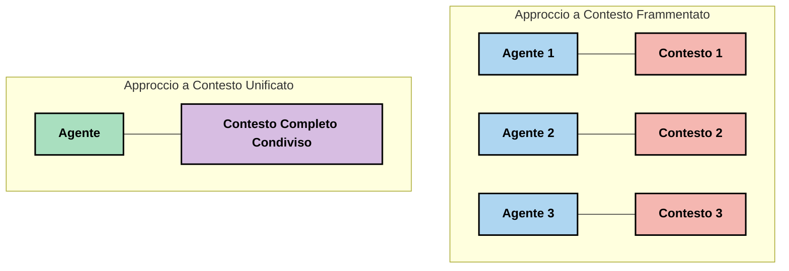
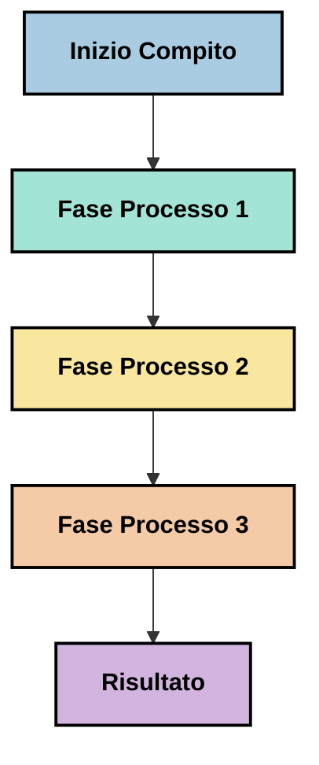
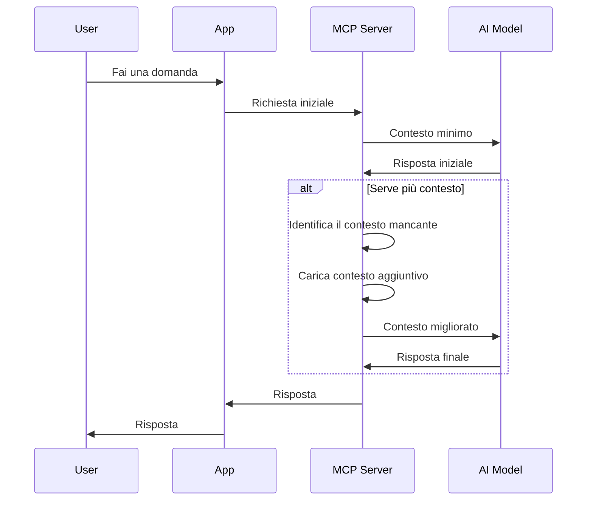
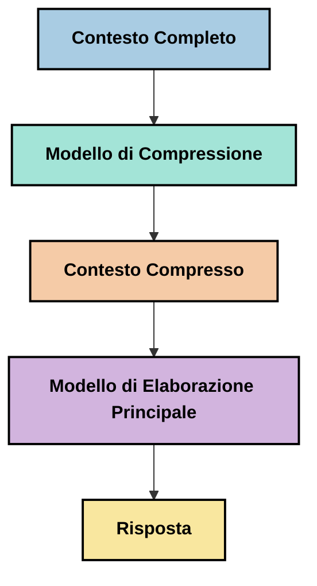
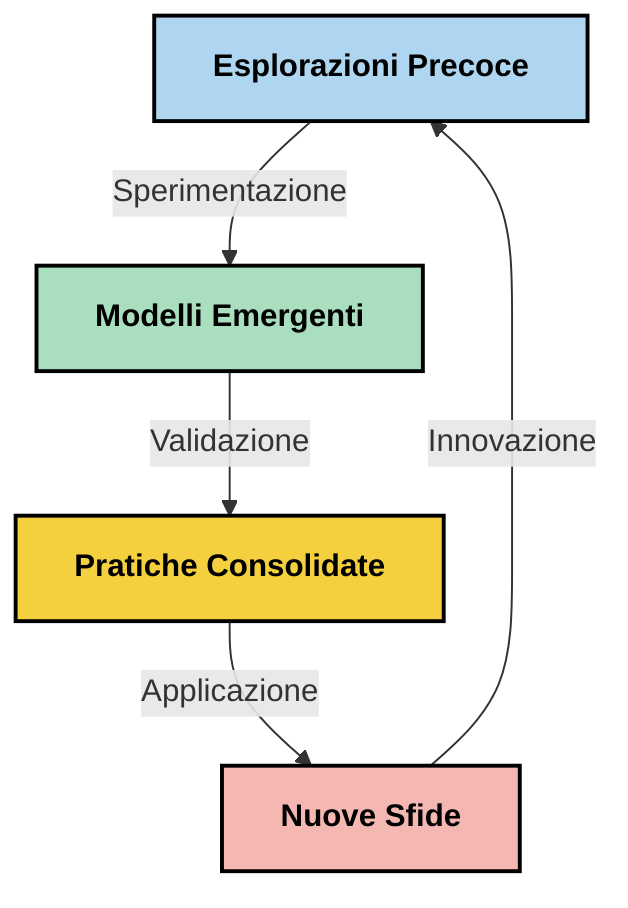

# Ingegneria del Contesto: Un Concetto Emergente nell'Ecosistema MCP

## Panoramica

L'ingegneria del contesto è un concetto emergente nello spazio dell'IA che esplora come le informazioni sono strutturate, fornite e mantenute durante le interazioni tra clienti e servizi di IA. Con l'evoluzione dell'ecosistema Model Context Protocol (MCP), comprendere come gestire efficacemente il contesto diventa sempre più importante. Questo modulo introduce il concetto di ingegneria del contesto ed esplora le sue potenziali applicazioni nelle implementazioni MCP.

## Obiettivi di Apprendimento

Alla fine di questo modulo, sarai in grado di:

- Comprendere il concetto emergente di ingegneria del contesto e il suo ruolo potenziale nelle applicazioni MCP
- Identificare le principali sfide nella gestione del contesto che la progettazione del protocollo MCP affronta
- Esplorare tecniche per migliorare le prestazioni del modello attraverso una migliore gestione del contesto
- Considerare approcci per misurare e valutare l'efficacia del contesto
- Applicare questi concetti emergenti per migliorare le esperienze di IA tramite il framework MCP

## Introduzione all'Ingegneria del Contesto

L'ingegneria del contesto è un concetto emergente focalizzato sulla progettazione e gestione deliberata del flusso di informazioni tra utenti, applicazioni e modelli di IA. A differenza di campi consolidati come il prompt engineering, l'ingegneria del contesto è ancora in fase di definizione da parte dei praticanti che lavorano per risolvere le sfide uniche di fornire ai modelli di IA le informazioni giuste al momento giusto.

Con l'evoluzione dei grandi modelli di linguaggio (LLM), l'importanza del contesto è diventata sempre più evidente. La qualità, rilevanza e struttura del contesto che forniamo incidono direttamente sugli output del modello. L'ingegneria del contesto esplora questa relazione e cerca di sviluppare principi per una gestione efficace del contesto.

> "Nel 2025, i modelli sono estremamente intelligenti. Ma anche l'essere umano più brillante non sarà in grado di svolgere efficacemente il proprio lavoro senza il contesto di ciò che gli viene chiesto di fare... 'L'ingegneria del contesto' è il livello successivo del prompt engineering. Si tratta di farlo automaticamente in un sistema dinamico." — Walden Yan, Cognition AI

L'ingegneria del contesto può comprendere:

1. **Selezione del Contesto**: Determinare quali informazioni sono rilevanti per un dato compito
2. **Strutturazione del Contesto**: Organizzare le informazioni per massimizzare la comprensione del modello
3. **Consegna del Contesto**: Ottimizzare come e quando le informazioni vengono inviate ai modelli
4. **Mantenimento del Contesto**: Gestire lo stato e l'evoluzione del contesto nel tempo
5. **Valutazione del Contesto**: Misurare e migliorare l'efficacia del contesto

Questi ambiti di interesse sono particolarmente rilevanti per l'ecosistema MCP, che offre un modo standardizzato per le applicazioni di fornire contesto agli LLM.


## La Prospettiva del Viaggio del Contesto

Un modo per visualizzare l'ingegneria del contesto è tracciare il viaggio che l'informazione compie attraverso un sistema MCP:



### Fasi Chiave del Viaggio del Contesto:

1. **Input dell'Utente**: Informazioni grezze dall'utente (testo, immagini, documenti)
2. **Assemblaggio del Contesto**: Combinazione dell'input utente con il contesto di sistema, la cronologia della conversazione e altre informazioni recuperate
3. **Elaborazione del Modello**: Il modello di IA elabora il contesto assemblato
4. **Generazione della Risposta**: Il modello produce output basati sul contesto fornito
5. **Gestione dello Stato**: Il sistema aggiorna il proprio stato interno in base all'interazione

Questa prospettiva evidenzia la natura dinamica del contesto nei sistemi IA e solleva importanti domande su come gestire al meglio le informazioni a ogni fase.

## Principi Emergenti nell'Ingegneria del Contesto

Mentre il campo dell'ingegneria del contesto prende forma, alcuni primi principi stanno emergendo dai praticanti. Questi principi possono aiutare a orientare le scelte di implementazione MCP:

### Principio 1: Condividere Completamente il Contesto

Il contesto dovrebbe essere condiviso completamente tra tutti i componenti di un sistema piuttosto che frammentato tra più agenti o processi. Quando il contesto è distribuito, le decisioni prese in una parte del sistema possono confliggere con quelle prese altrove.



Nelle applicazioni MCP, questo suggerisce di progettare sistemi dove il contesto fluisce senza soluzione di continuità attraverso l'intera pipeline invece di essere compartimentato.

### Principio 2: Riconoscere Che le Azioni Comportano Decisioni Implicite

Ogni azione che un modello compie incorpora decisioni implicite su come interpretare il contesto. Quando più componenti agiscono su contesti differenti, queste decisioni implicite possono confliggere, portando a risultati incoerenti.

Questo principio ha importanti implicazioni per le applicazioni MCP:
- Preferire l'elaborazione lineare di compiti complessi rispetto all'esecuzione parallela con contesto frammentato
- Garantire che tutti i punti decisionali abbiano accesso alle stesse informazioni contestuali
- Progettare sistemi dove le fasi successive possano vedere il contesto completo delle decisioni precedenti

### Principio 3: Bilanciare la Profondità del Contesto con le Limitazioni della Finestra

Man mano che conversazioni e processi si allungano, le finestre di contesto si saturano. L'ingegneria del contesto efficace esplora approcci per gestire questa tensione tra contesto completo e limitazioni tecniche.

Gli approcci potenziali in fase di esplorazione includono:
- Compressione del contesto che mantiene l'informazione essenziale riducendo l’uso dei token
- Caricamento progressivo del contesto basato sulla rilevanza alle necessità correnti
- Sintesi delle interazioni precedenti preservando decisioni chiave e fatti importanti

## Sfide del Contesto e Progettazione del Protocollo MCP

Il Model Context Protocol (MCP) è stato progettato consapevole delle sfide uniche della gestione del contesto. Comprendere queste sfide aiuta a spiegare aspetti chiave della progettazione del protocollo MCP:


### Sfida 1: Limiti della Finestra di Contesto
La maggior parte dei modelli IA ha dimensioni di finestra di contesto fisse, limitando quante informazioni possono processare contemporaneamente.

**Risposta di Progettazione MCP:** 
- Il protocollo supporta un contesto strutturato, basato su risorse che possono essere referenziate efficientemente
- Le risorse possono essere paginabili e caricate progressivamente

### Sfida 2: Determinazione della Rilevanza
Determinare quali informazioni sono più rilevanti da includere nel contesto è difficile.

**Risposta di Progettazione MCP:**
- Strumenti flessibili permettono il recupero dinamico delle informazioni in base alle necessità
- Prompt strutturati consentono un'organizzazione del contesto coerente

### Sfida 3: Persistenza del Contesto
Gestire lo stato attraverso le interazioni richiede un attento monitoraggio del contesto.

**Risposta di Progettazione MCP:**
- Gestione standardizzata delle sessioni
- Modelli di interazione chiaramente definiti per l'evoluzione del contesto

### Sfida 4: Contesto Multi-Modale
Tipi di dati diversi (testo, immagini, dati strutturati) richiedono gestioni differenti.

**Risposta di Progettazione MCP:**
- Il design del protocollo accoglie vari tipi di contenuto
- Rappresentazione standardizzata delle informazioni multi-modali

### Sfida 5: Sicurezza e Privacy
Il contesto spesso contiene informazioni sensibili che devono essere protette.

**Risposta di Progettazione MCP:**
- Confini chiari tra responsabilità client e server
- Opzioni di elaborazione locale per minimizzare l'esposizione dei dati

Comprendere queste sfide e come MCP le affronta fornisce una base per esplorare tecniche più avanzate di ingegneria del contesto.

## Approcci Emergenti nell'Ingegneria del Contesto

Mentre il campo dell'ingegneria del contesto si sviluppa, stanno emergendo diversi approcci promettenti. Questi rappresentano il pensiero attuale più che best practice consolidate e probabilmente evolveranno con l'esperienza nelle implementazioni MCP.

### 1. Elaborazione Lineare Monothread

In contrasto con architetture multi-agente che distribuiscono il contesto, alcuni praticanti riscontrano che l'elaborazione lineare monothread produce risultati più coerenti. Questo si allinea al principio di mantenere un contesto unificato.



Sebbene questo approccio possa sembrare meno efficiente rispetto all'elaborazione parallela, spesso produce risultati più coerenti e affidabili perché ogni passaggio si basa su una comprensione completa delle decisioni precedenti.

### 2. Suddivisione e Prioritizzazione del Contesto

Spezzare grandi contesti in pezzi gestibili e dare priorità a ciò che è più importante.

```python
# Esempio Concettuale: Suddivisione e Prioritizzazione del Contesto
def process_with_chunked_context(documents, query):
    # 1. Suddividi i documenti in blocchi più piccoli
    chunks = chunk_documents(documents)
    
    # 2. Calcola i punteggi di rilevanza per ogni blocco
    scored_chunks = [(chunk, calculate_relevance(chunk, query)) for chunk in chunks]
    
    # 3. Ordina i blocchi secondo il punteggio di rilevanza
    sorted_chunks = sorted(scored_chunks, key=lambda x: x[1], reverse=True)
    
    # 4. Usa i blocchi più rilevanti come contesto
    context = create_context_from_chunks([chunk for chunk, score in sorted_chunks[:5]])
    
    # 5. Elabora con il contesto prioritizzato
    return generate_response(context, query)
```

Il concetto sopra illustra come potremmo suddividere grandi documenti in pezzi gestibili e selezionare solo le parti più rilevanti per il contesto. Questo approccio può aiutare a lavorare entro i limiti della finestra di contesto pur sfruttando grandi basi di conoscenza.

### 3. Caricamento Progressivo del Contesto

Caricare il contesto progressivamente secondo necessità anziché tutto in una volta.



Il caricamento progressivo del contesto inizia con un contesto minimo e si espande solo quando necessario. Questo può ridurre significativamente l'uso di token per richieste semplici mantenendo la capacità di gestire domande complesse.

### 4. Compressione e Sintesi del Contesto

Ridurre la dimensione del contesto preservando le informazioni essenziali.



La compressione del contesto si concentra su:
- Rimuovere informazioni ridondanti
- Sintetizzare contenuti lunghi
- Estrarre fatti e dettagli chiave
- Preservare elementi critici del contesto
- Ottimizzare per l'efficienza dei token

Questo approccio può essere particolarmente prezioso per mantenere conversazioni lunghe all'interno delle finestre di contesto o per processare grandi documenti in modo efficiente. Alcuni praticanti utilizzano modelli specializzati specificamente per la compressione del contesto e la sintesi della storia delle conversazioni.


## Considerazioni Esplorative per l'Ingegneria del Contesto

Mentre esploriamo il campo emergente dell'ingegneria del contesto, alcune considerazioni meritano attenzione lavorando con implementazioni MCP. Queste non sono best practice prescrittive ma aree di esplorazione che potrebbero portare miglioramenti nel tuo caso d'uso specifico.

### Considera i Tuoi Obiettivi di Contesto

Prima di implementare soluzioni complesse di gestione del contesto, esprimi chiaramente cosa vuoi ottenere:
- Quali informazioni specifiche il modello deve avere per avere successo?
- Quali sono essenziali rispetto a quelle supplementari?
- Quali sono i tuoi vincoli di prestazione (latenza, limiti di token, costi)?

### Esplora Approcci a Strati del Contesto

Alcuni praticanti trovano successo con contesti disposti in strati concettuali:
- **Strato Core**: Informazioni essenziali che il modello necessita sempre
- **Strato Situazionale**: Contesto specifico per l'interazione corrente
- **Strato di Supporto**: Informazioni aggiuntive che potrebbero essere utili
- **Strato di Riserva**: Informazioni accessibili solo quando necessarie

### Indaga Strategie di Recupero

L'efficacia del contesto spesso dipende da come recuperi le informazioni:
- Ricerca semantica ed embeddings per trovare informazioni concettualmente rilevanti
- Ricerca basata su parole chiave per dettagli fattuali specifici
- Approcci ibridi che combinano più metodi di recupero
- Filtri basati su metadati per restringere l'ambito in base a categorie, date o fonti

### Sperimenta la Coerenza del Contesto

La struttura e il flusso del tuo contesto possono influenzare la comprensione del modello:
- Raggruppare insieme informazioni correlate
- Usare formati e organizzazioni coerenti
- Mantenere ordine logico o cronologico dove appropriato
- Evitare informazioni contraddittorie

### Valuta i Compromessi delle Architetture Multi-Agente

Sebbene le architetture multi-agente siano popolari in molti framework IA, presentano sfide significative per la gestione del contesto:
- La frammentazione del contesto può portare a decisioni incoerenti tra agenti
- L'elaborazione parallela può introdurre conflitti difficili da riconciliare
- L'overhead di comunicazione tra agenti può compensare i guadagni di prestazione
- La gestione complessa dello stato è necessaria per mantenere la coerenza

In molti casi, un approccio a singolo agente con gestione completa del contesto può produrre risultati più affidabili rispetto a molteplici agenti specializzati con contesto frammentato.

### Sviluppa Metodi di Valutazione

Per migliorare l'ingegneria del contesto nel tempo, considera come misurerai il successo:
- Test A/B con diverse strutture di contesto
- Monitoraggio dell'uso di token e dei tempi di risposta
- Tracciamento della soddisfazione degli utenti e delle percentuali di completamento dei compiti
- Analisi dei casi in cui le strategie di contesto falliscono

Queste considerazioni rappresentano aree attive di esplorazione nell'ambito dell'ingegneria del contesto. Con il maturare del campo, emergeranno probabilmente schemi e pratiche più definiti.

## Misurare l'Efficacia del Contesto: Un Quadro in Evoluzione

Con l'emergere del concetto di ingegneria del contesto, i praticanti iniziano a esplorare come potremmo misurarne l'efficacia. Non esiste ancora un quadro stabilito, ma si stanno considerando varie metriche che potrebbero guidare lavori futuri.

### Dimensioni Potenziali di Misurazione


#### 1. Considerazioni sull'Efficienza di Input

- **Rapporto Contesto-Risposta**: Quanta parte di contesto è necessaria rispetto alla dimensione della risposta?
- **Utilizzo dei Token**: Quale percentuale dei token forniti nel contesto sembra influenzare la risposta?
- **Riduzione del Contesto**: Quanto efficacemente potremmo comprimere le informazioni grezze?

#### 2. Considerazioni sulle Prestazioni

- **Impatto sulla Latenza**: Come la gestione del contesto influenza il tempo di risposta?
- **Economia del Token**: Stiamo ottimizzando efficacemente l'uso dei token?
- **Precisione del Recupero**: Quanto è rilevante l'informazione recuperata?
- **Utilizzo delle Risorse**: Quali risorse computazionali sono richieste?

#### 3. Considerazioni sulla Qualità

- **Rilevanza della Risposta**: Quanto bene la risposta soddisfa la domanda?
- **Accuratezza Fattuale**: La gestione del contesto migliora la correttezza fattuale?
- **Coerenza**: Le risposte sono coerenti con domande simili?
- **Tasso di Allucinazioni**: Un contesto migliore riduce le allucinazioni del modello?

#### 4. Considerazioni sull'Esperienza Utente

- **Tasso di Follow-up**: Quanto spesso gli utenti necessitano chiarimenti?
- **Completamento dei Compiti**: Gli utenti riescono a raggiungere i loro obiettivi?
- **Indicatori di Soddisfazione**: Come gli utenti valutano la loro esperienza?

### Approcci Esplorativi alla Misurazione

Durante gli esperimenti con l'ingegneria del contesto in implementazioni MCP, considera questi approcci esplorativi:

1. **Confronti di Base**: Stabilisci una base con approcci semplici al contesto prima di testare metodi più sofisticati

2. **Cambiamenti Incrementali**: Modifica un aspetto della gestione del contesto alla volta per isolare gli effetti

3. **Valutazione Centrata sull'Utente**: Combina metriche quantitative con feedback qualitativi degli utenti

4. **Analisi dei Fallimenti**: Esamina i casi in cui le strategie di contesto falliscono per capire possibili miglioramenti

5. **Valutazione Multi-Dimensionale**: Considera i compromessi tra efficienza, qualità ed esperienza utente

Questo approccio sperimentale e multifaccettato alla misurazione si allinea con la natura emergente dell'ingegneria del contesto.

## Considerazioni Finali

L'ingegneria del contesto è un'area emergente di esplorazione che potrebbe rivelarsi centrale per applicazioni MCP efficaci. Considerando attentamente come le informazioni fluiscono attraverso il tuo sistema, puoi potenzialmente creare esperienze IA più efficienti, accurate e di valore per gli utenti.

Le tecniche e gli approcci illustrati in questo modulo rappresentano un pensiero iniziale in questo ambito, non pratiche consolidate. L'ingegneria del contesto potrebbe evolvere in una disciplina più definita con l'evoluzione delle capacità IA e l'approfondimento della nostra comprensione. Per ora, la sperimentazione combinata con una attenta misurazione sembra l'approccio più produttivo.

## Direzioni Potenziali Future

Il campo dell'ingegneria del contesto è ancora nelle sue prime fasi, ma stanno emergendo diverse direzioni promettenti:

- I principi dell'ingegneria del contesto potrebbero avere un impatto significativo sulle prestazioni del modello, efficienza, esperienza utente e affidabilità
- Approcci monothread con gestione completa del contesto potrebbero superare architetture multi-agente per molti casi d'uso
- Modelli specializzati di compressione del contesto potrebbero diventare componenti standard nelle pipeline IA
- La tensione tra completezza del contesto e limiti di token probabilmente stimolerà l'innovazione nella gestione del contesto
- Con modelli sempre più capaci di una comunicazione efficiente e umana, la vera collaborazione multi-agente potrebbe diventare più praticabile
- Le implementazioni MCP potrebbero evolversi per standardizzare i pattern di gestione del contesto che emergono dalle sperimentazioni attuali



## Risorse

### Risorse Ufficiali MCP
- [Model Context Protocol Website](https://modelcontextprotocol.io/)
- [Model Context Protocol Specification](https://github.com/modelcontextprotocol/modelcontextprotocol)
- [Documentazione MCP](https://modelcontextprotocol.io/docs)
- [SDK MCP C#](https://github.com/modelcontextprotocol/csharp-sdk)
- [SDK MCP Python](https://github.com/modelcontextprotocol/python-sdk)
- [SDK MCP TypeScript](https://github.com/modelcontextprotocol/typescript-sdk)
- [MCP Inspector](https://github.com/modelcontextprotocol/inspector) - Strumento di test visivo per i server MCP

### Articoli sull'Ingegneria del Contesto
- [Non costruire Multi-Agent: Principi dell'Ingegneria del Contesto](https://cognition.ai/blog/dont-build-multi-agents) - Approfondimenti di Walden Yan sui principi dell'ingegneria del contesto
- [Guida Pratica per Costruire Agent](https://cdn.openai.com/business-guides-and-resources/a-practical-guide-to-building-agents.pdf) - Guida di OpenAI sul design efficace degli agent
- [Costruire Agent Efficaci](https://www.anthropic.com/engineering/building-effective-agents) - Approccio di Anthropic allo sviluppo di agent

### Ricerche Correlate
- [Integrazione Dinamica di Recupero per Modelli Linguistici di Grandi Dimensioni](https://arxiv.org/abs/2310.01487) - Ricerca su approcci dinamici di recupero
- [Persi nel Mezzo: Come i Modelli Linguistici Usano Contesti Lunghi](https://arxiv.org/abs/2307.03172) - Importante ricerca sui modelli di elaborazione del contesto
- [Generazione Gerarchica di Immagini Condizionata da Testo con Latenti CLIP](https://arxiv.org/abs/2204.06125) - Articolo di DALL-E 2 con approfondimenti sulla strutturazione del contesto
- [Esplorare il Ruolo del Contesto nelle Architetture dei Modelli Linguistici di Grandi Dimensioni](https://aclanthology.org/2023.findings-emnlp.124/) - Ricerca recente sulla gestione del contesto
- [Collaborazione Multi-Agent: Una Panoramica](https://arxiv.org/abs/2304.03442) - Ricerca sui sistemi multi-agent e le loro sfide

### Risorse Aggiuntive
- [Tecniche di Ottimizzazione della Finestra di Contesto](https://learn.microsoft.com/en-us/azure/ai-services/openai/concepts/context-window)
- [Tecniche Avanzate di RAG](https://www.microsoft.com/en-us/research/blog/retrieval-augmented-generation-rag-and-frontier-models/)
- [Documentazione Semantic Kernel](https://github.com/microsoft/semantic-kernel)
- [Toolkit AI per la Gestione del Contesto](https://github.com/microsoft/aitoolkit)

## Cosa c'è dopo  

- [5.15 MCP Custom Transport](../mcp-transport/README.md)

---

<!-- CO-OP TRANSLATOR DISCLAIMER START -->
**Disclaimer**:
Questo documento è stato tradotto utilizzando il servizio di traduzione AI [Co-op Translator](https://github.com/Azure/co-op-translator). Sebbene ci impegniamo per garantire la precisione, si prega di notare che le traduzioni automatizzate possono contenere errori o imprecisioni. Il documento originale nella sua lingua nativa deve essere considerato la fonte autorevole. Per informazioni critiche, si raccomanda una traduzione professionale effettuata da un essere umano. Non siamo responsabili per eventuali malintesi o interpretazioni errate derivanti dall’uso di questa traduzione.
<!-- CO-OP TRANSLATOR DISCLAIMER END -->