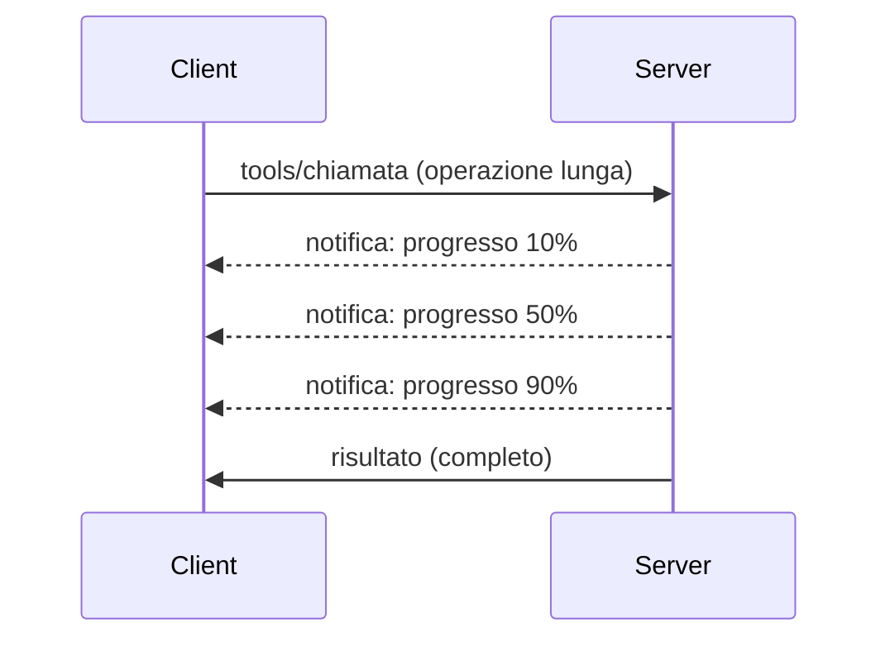

# Approfondimento sulle Funzionalità del Protocollo MCP

Questa guida esplora funzionalità avanzate del protocollo MCP che vanno oltre la semplice gestione di strumenti e risorse. Comprendere queste funzionalità ti aiuterà a costruire server MCP più robusti, user-friendly e pronti per la produzione.

> **Uno sguardo al futuro:** il candidato al rilascio `2026-07-28` depreca il primitivo Logging (favorendo `stderr` per stdio e OpenTelemetry per l'osservabilità strutturata), rimuove il modello `initialize`/sessione menzionato sotto gli Eventi del Ciclo di Vita del Server, e sposta la funzionalità sperimentale Tasks in un'estensione dedicata con un nuovo ciclo di vita `tasks/get`/`tasks/update`/`tasks/cancel`. Vedi [Cosa cambia in MCP: Il candidato al rilascio 2026-07-28](../../01-CoreConcepts/mcp-2026-07-28-release-candidate.md).

## Funzionalità Trattate

1. **Notifiche di Avanzamento** - Segnalare l'avanzamento per operazioni di lunga durata  
2. **Cancellazione delle Richieste** - Permettere ai client di annullare richieste in corso  
3. **Template di Risorse** - URI di risorse dinamiche con parametri  
4. **Eventi del Ciclo di Vita del Server** - Inizializzazione e chiusura corretta  
5. **Controllo del Logging** - Configurazione del logging sul server  
6. **Pattern di Gestione degli Errori** - Risposte di errore coerenti

---

## 1. Notifiche di Avanzamento

Per operazioni che impiegano tempo (elaborazione dati, download di file, chiamate API), le notifiche di avanzamento tengono gli utenti informati.

### Come Funziona



### Implementazione in Python

```python
from mcp.server import Server, NotificationOptions
from mcp.types import ProgressNotification
import asyncio

app = Server("progress-server")

@app.tool()
async def process_large_file(file_path: str, ctx) -> str:
    """Process a large file with progress updates."""
    
    # Ottieni la dimensione del file per il calcolo del progresso
    file_size = os.path.getsize(file_path)
    processed = 0
    
    with open(file_path, 'rb') as f:
        while chunk := f.read(8192):
            # Elabora il blocco
            await process_chunk(chunk)
            processed += len(chunk)
            
            # Invia notifica di progresso
            progress = (processed / file_size) * 100
            await ctx.send_notification(
                ProgressNotification(
                    progressToken=ctx.request_id,
                    progress=progress,
                    total=100,
                    message=f"Processing: {progress:.1f}%"
                )
            )
    
    return f"Processed {file_size} bytes"

@app.tool()
async def batch_operation(items: list[str], ctx) -> str:
    """Process multiple items with progress."""
    
    results = []
    total = len(items)
    
    for i, item in enumerate(items):
        result = await process_item(item)
        results.append(result)
        
        # Riporta il progresso dopo ogni elemento
        await ctx.send_notification(
            ProgressNotification(
                progressToken=ctx.request_id,
                progress=i + 1,
                total=total,
                message=f"Processed {i + 1}/{total}: {item}"
            )
        )
    
    return f"Completed {total} items"
```

### Implementazione in TypeScript

```typescript
import { Server } from "@modelcontextprotocol/sdk/server/index.js";

server.setRequestHandler(CallToolSchema, async (request, extra) => {
  const { name, arguments: args } = request.params;
  
  if (name === "process_data") {
    const items = args.items as string[];
    const results = [];
    
    for (let i = 0; i < items.length; i++) {
      const result = await processItem(items[i]);
      results.push(result);
      
      // Invia notifica di avanzamento
      await extra.sendNotification({
        method: "notifications/progress",
        params: {
          progressToken: request.id,
          progress: i + 1,
          total: items.length,
          message: `Processing item ${i + 1}/${items.length}`
        }
      });
    }
    
    return { content: [{ type: "text", text: JSON.stringify(results) }] };
  }
});
```

### Gestione lato Client (Python)

```python
async def handle_progress(notification):
    """Handle progress notifications from server."""
    params = notification.params
    print(f"Progress: {params.progress}/{params.total} - {params.message}")

# Registrare il gestore
session.on_notification("notifications/progress", handle_progress)

# Chiamare lo strumento (gli aggiornamenti sul progresso arriveranno tramite il gestore)
result = await session.call_tool("process_large_file", {"file_path": "/data/large.csv"})
```

---

## 2. Cancellazione delle Richieste

Permettere ai client di annullare richieste non più necessarie o troppo lente.

### Implementazione in Python

```python
from mcp.server import Server
from mcp.types import CancelledError
import asyncio

app = Server("cancellable-server")

@app.tool()
async def long_running_search(query: str, ctx) -> str:
    """Search that can be cancelled."""
    
    results = []
    
    try:
        for page in range(100):  # Cerca attraverso molte pagine
            # Verifica se è stata richiesta la cancellazione
            if ctx.is_cancelled:
                raise CancelledError("Search cancelled by user")
            
            # Simula la ricerca della pagina
            page_results = await search_page(query, page)
            results.extend(page_results)
            
            # Breve ritardo permette di controllare le cancellazioni
            await asyncio.sleep(0.1)
            
    except CancelledError:
        # Restituisce risultati parziali
        return f"Cancelled. Found {len(results)} results before cancellation."
    
    return f"Found {len(results)} total results"

@app.tool()
async def download_file(url: str, ctx) -> str:
    """Download with cancellation support."""
    
    async with aiohttp.ClientSession() as session:
        async with session.get(url) as response:
            total_size = int(response.headers.get('content-length', 0))
            downloaded = 0
            chunks = []
            
            async for chunk in response.content.iter_chunked(8192):
                if ctx.is_cancelled:
                    return f"Download cancelled at {downloaded}/{total_size} bytes"
                
                chunks.append(chunk)
                downloaded += len(chunk)
            
            return f"Downloaded {downloaded} bytes"
```

### Implementazione del Contesto di Cancellazione

```python
class CancellableContext:
    """Context object that tracks cancellation state."""
    
    def __init__(self, request_id: str):
        self.request_id = request_id
        self._cancelled = asyncio.Event()
        self._cancel_reason = None
    
    @property
    def is_cancelled(self) -> bool:
        return self._cancelled.is_set()
    
    def cancel(self, reason: str = "Cancelled"):
        self._cancel_reason = reason
        self._cancelled.set()
    
    async def check_cancelled(self):
        """Raise if cancelled, otherwise continue."""
        if self.is_cancelled:
            raise CancelledError(self._cancel_reason)
    
    async def sleep_or_cancel(self, seconds: float):
        """Sleep that can be interrupted by cancellation."""
        try:
            await asyncio.wait_for(
                self._cancelled.wait(),
                timeout=seconds
            )
            raise CancelledError(self._cancel_reason)
        except asyncio.TimeoutError:
            pass  # Timeout normale, continua
```

### Cancellazione lato Client

```python
import asyncio

async def search_with_timeout(session, query, timeout=30):
    """Search with automatic cancellation on timeout."""
    
    task = asyncio.create_task(
        session.call_tool("long_running_search", {"query": query})
    )
    
    try:
        result = await asyncio.wait_for(task, timeout=timeout)
        return result
    except asyncio.TimeoutError:
        # Richiesta di cancellazione
        await session.send_notification({
            "method": "notifications/cancelled",
            "params": {"requestId": task.request_id, "reason": "Timeout"}
        })
        return "Search timed out"
```

---

## 3. Template di Risorse

I template di risorse permettono la costruzione dinamica di URI con parametri, utile per API e database.

### Definizione dei Template

```python
from mcp.server import Server
from mcp.types import ResourceTemplate

app = Server("template-server")

@app.list_resource_templates()
async def list_templates() -> list[ResourceTemplate]:
    """Return available resource templates."""
    return [
        ResourceTemplate(
            uriTemplate="db://users/{user_id}",
            name="User Profile",
            description="Fetch user profile by ID",
            mimeType="application/json"
        ),
        ResourceTemplate(
            uriTemplate="api://weather/{city}/{date}",
            name="Weather Data",
            description="Historical weather for city and date",
            mimeType="application/json"
        ),
        ResourceTemplate(
            uriTemplate="file://{path}",
            name="File Content",
            description="Read file at given path",
            mimeType="text/plain"
        )
    ]

@app.read_resource()
async def read_resource(uri: str) -> str:
    """Read resource, expanding template parameters."""
    
    # Analizza l'URI per estrarre i parametri
    if uri.startswith("db://users/"):
        user_id = uri.split("/")[-1]
        return await fetch_user(user_id)
    
    elif uri.startswith("api://weather/"):
        parts = uri.replace("api://weather/", "").split("/")
        city, date = parts[0], parts[1]
        return await fetch_weather(city, date)
    
    elif uri.startswith("file://"):
        path = uri.replace("file://", "")
        return await read_file(path)
    
    raise ValueError(f"Unknown resource URI: {uri}")
```

### Implementazione in TypeScript

```typescript
server.setRequestHandler(ListResourceTemplatesSchema, async () => {
  return {
    resourceTemplates: [
      {
        uriTemplate: "github://repos/{owner}/{repo}/issues/{issue_number}",
        name: "GitHub Issue",
        description: "Fetch a specific GitHub issue",
        mimeType: "application/json"
      },
      {
        uriTemplate: "db://tables/{table}/rows/{id}",
        name: "Database Row",
        description: "Fetch a row from a database table",
        mimeType: "application/json"
      }
    ]
  };
});

server.setRequestHandler(ReadResourceSchema, async (request) => {
  const uri = request.params.uri;
  
  // Analizza l'URI del problema GitHub
  const githubMatch = uri.match(/^github:\/\/repos\/([^/]+)\/([^/]+)\/issues\/(\d+)$/);
  if (githubMatch) {
    const [_, owner, repo, issueNumber] = githubMatch;
    const issue = await fetchGitHubIssue(owner, repo, parseInt(issueNumber));
    return {
      contents: [{
        uri,
        mimeType: "application/json",
        text: JSON.stringify(issue, null, 2)
      }]
    };
  }
  
  throw new Error(`Unknown resource URI: ${uri}`);
});
```

---

## 4. Eventi del Ciclo di Vita del Server

Una gestione corretta di inizializzazione e chiusura garantisce una gestione pulita delle risorse.

### Gestione del Ciclo di Vita in Python

```python
from mcp.server import Server
from contextlib import asynccontextmanager

app = Server("lifecycle-server")

# Stato condiviso
db_connection = None
cache = None

@asynccontextmanager
async def lifespan(server: Server):
    """Manage server lifecycle."""
    global db_connection, cache
    
    # Avvio
    print("🚀 Server starting...")
    db_connection = await create_database_connection()
    cache = await create_cache_client()
    print("✅ Resources initialized")
    
    yield  # Il server gira qui
    
    # Arresto
    print("🛑 Server shutting down...")
    await db_connection.close()
    await cache.close()
    print("✅ Resources cleaned up")

app = Server("lifecycle-server", lifespan=lifespan)

@app.tool()
async def query_database(sql: str) -> str:
    """Use the shared database connection."""
    result = await db_connection.execute(sql)
    return str(result)
```

### Ciclo di Vita in TypeScript

```typescript
import { Server } from "@modelcontextprotocol/sdk/server/index.js";

class ManagedServer {
  private server: Server;
  private dbConnection: DatabaseConnection | null = null;
  
  constructor() {
    this.server = new Server({
      name: "lifecycle-server",
      version: "1.0.0"
    });
    
    this.setupHandlers();
  }
  
  async start() {
    // Inizializza risorse
    console.log("🚀 Server starting...");
    this.dbConnection = await createDatabaseConnection();
    console.log("✅ Database connected");
    
    // Avvia il server
    await this.server.connect(transport);
  }
  
  async stop() {
    // Pulisci le risorse
    console.log("🛑 Server shutting down...");
    if (this.dbConnection) {
      await this.dbConnection.close();
    }
    await this.server.close();
    console.log("✅ Cleanup complete");
  }
  
  private setupHandlers() {
    this.server.setRequestHandler(CallToolSchema, async (request) => {
      // Usa this.dbConnection in modo sicuro
      // ...
    });
  }
}

// Utilizzo con spegnimento graduale
const server = new ManagedServer();

process.on('SIGINT', async () => {
  await server.stop();
  process.exit(0);
});

await server.start();
```

---

## 5. Controllo del Logging

MCP supporta livelli di logging lato server che possono essere controllati dai client.

### Implementazione dei Livelli di Logging

```python
from mcp.server import Server
from mcp.types import LoggingLevel
import logging

app = Server("logging-server")

# Mappa i livelli MCP ai livelli di logging di Python
LEVEL_MAP = {
    LoggingLevel.DEBUG: logging.DEBUG,
    LoggingLevel.INFO: logging.INFO,
    LoggingLevel.WARNING: logging.WARNING,
    LoggingLevel.ERROR: logging.ERROR,
}

logger = logging.getLogger("mcp-server")

@app.set_logging_level()
async def set_logging_level(level: LoggingLevel) -> None:
    """Handle client request to change logging level."""
    python_level = LEVEL_MAP.get(level, logging.INFO)
    logger.setLevel(python_level)
    logger.info(f"Logging level set to {level}")

@app.tool()
async def debug_operation(data: str) -> str:
    """Tool with various logging levels."""
    logger.debug(f"Processing data: {data}")
    
    try:
        result = process(data)
        logger.info(f"Successfully processed: {result}")
        return result
    except Exception as e:
        logger.error(f"Processing failed: {e}")
        raise
```

### Invio di Messaggi di Log al Client

```python
@app.tool()
async def complex_operation(input: str, ctx) -> str:
    """Operation that logs to client."""
    
    # Invia notifica di log al client
    await ctx.send_log(
        level="info",
        message=f"Starting complex operation with input: {input}"
    )
    
    # Esegui il lavoro...
    result = await do_work(input)
    
    await ctx.send_log(
        level="debug",
        message=f"Operation complete, result size: {len(result)}"
    )
    
    return result
```

---

## 6. Pattern di Gestione degli Errori

Una gestione coerente degli errori migliora il debugging e l'esperienza utente.

### Codici di Errore MCP

```python
from mcp.types import McpError, ErrorCode

class ToolError(McpError):
    """Base class for tool errors."""
    pass

class ValidationError(ToolError):
    """Invalid input parameters."""
    def __init__(self, message: str):
        super().__init__(ErrorCode.INVALID_PARAMS, message)

class NotFoundError(ToolError):
    """Requested resource not found."""
    def __init__(self, resource: str):
        super().__init__(ErrorCode.INVALID_REQUEST, f"Not found: {resource}")

class PermissionError(ToolError):
    """Access denied."""
    def __init__(self, action: str):
        super().__init__(ErrorCode.INVALID_REQUEST, f"Permission denied: {action}")

class InternalError(ToolError):
    """Internal server error."""
    def __init__(self, message: str):
        super().__init__(ErrorCode.INTERNAL_ERROR, message)
```

### Risposte di Errore Strutturate

```python
@app.tool()
async def safe_operation(input: str) -> str:
    """Tool with comprehensive error handling."""
    
    # Valida input
    if not input:
        raise ValidationError("Input cannot be empty")
    
    if len(input) > 10000:
        raise ValidationError(f"Input too large: {len(input)} chars (max 10000)")
    
    try:
        # Controlla i permessi
        if not await check_permission(input):
            raise PermissionError(f"read {input}")
        
        # Esegui operazione
        result = await perform_operation(input)
        
        if result is None:
            raise NotFoundError(input)
        
        return result
        
    except ConnectionError as e:
        raise InternalError(f"Database connection failed: {e}")
    except TimeoutError as e:
        raise InternalError(f"Operation timed out: {e}")
    except Exception as e:
        # Registra errori imprevisti
        logger.exception(f"Unexpected error in safe_operation")
        raise InternalError(f"Unexpected error: {type(e).__name__}")
```

### Gestione degli Errori in TypeScript

```typescript
import { McpError, ErrorCode } from "@modelcontextprotocol/sdk/types.js";

function validateInput(data: unknown): asserts data is ValidInput {
  if (typeof data !== "object" || data === null) {
    throw new McpError(
      ErrorCode.InvalidParams,
      "Input must be an object"
    );
  }
  // Ulteriori convalide...
}

server.setRequestHandler(CallToolSchema, async (request) => {
  try {
    validateInput(request.params.arguments);
    
    const result = await performOperation(request.params.arguments);
    
    return {
      content: [{ type: "text", text: JSON.stringify(result) }]
    };
    
  } catch (error) {
    if (error instanceof McpError) {
      throw error;  // Errore MCP già esistente
    }
    
    // Converti altri errori
    if (error instanceof NotFoundError) {
      throw new McpError(ErrorCode.InvalidRequest, error.message);
    }
    
    // Errore sconosciuto
    console.error("Unexpected error:", error);
    throw new McpError(
      ErrorCode.InternalError,
      "An unexpected error occurred"
    );
  }
});
```

---

## Funzionalità Sperimentali (MCP 2025-11-25)

Queste funzionalità sono segnate come sperimentali nella specifica:

### Tasks (Operazioni di Lunga Durata)

```python
# I task consentono di tracciare operazioni di lunga durata con stato
@app.task()
async def training_task(model_id: str, data_path: str, ctx) -> str:
    """Long-running ML training task."""
    
    # Segnala l'inizio del task
    await ctx.report_status("running", "Initializing training...")
    
    # Ciclo di addestramento
    for epoch in range(100):
        await train_epoch(model_id, data_path, epoch)
        await ctx.report_status(
            "running",
            f"Training epoch {epoch + 1}/100",
            progress=epoch + 1,
            total=100
        )
    
    await ctx.report_status("completed", "Training finished")
    return f"Model {model_id} trained successfully"
```

### Annotazioni degli Strumenti

```python
# Le annotazioni forniscono metadati sul comportamento dello strumento
@app.tool(
    annotations={
        "destructive": False,      # Non modifica i dati
        "idempotent": True,        # Sicuro da riprovare
        "timeout_seconds": 30,     # Durata massima prevista
        "requires_approval": False # Non è necessaria l'approvazione dell'utente
    }
)
async def safe_query(query: str) -> str:
    """A read-only database query tool."""
    return await execute_read_query(query)
```

---

## Cosa C’è Dopo

- [Modulo 8 - Best Practices](../../08-BestPractices/README.md)  
- [5.14 - Ingegneria del Contesto](../mcp-contextengineering/README.md)  
- [Registro delle Modifiche della Specifica MCP](https://spec.modelcontextprotocol.io/)

---

## Risorse Aggiuntive

- [Specifiche MCP 2025-11-25](https://spec.modelcontextprotocol.io/specification/2025-11-25/)  
- [Codici di Errore JSON-RPC 2.0](https://www.jsonrpc.org/specification#error_object)  
- [Esempi SDK Python](https://github.com/modelcontextprotocol/python-sdk/tree/main/examples)  
- [Esempi SDK TypeScript](https://github.com/modelcontextprotocol/typescript-sdk/tree/main/examples)

---

<!-- CO-OP TRANSLATOR DISCLAIMER START -->
**Disclaimer**:
Questo documento è stato tradotto utilizzando il servizio di traduzione AI [Co-op Translator](https://github.com/Azure/co-op-translator). Sebbene ci impegniamo per garantire la precisione, si prega di notare che le traduzioni automatizzate possono contenere errori o imprecisioni. Il documento originale nella sua lingua nativa deve essere considerato la fonte autorevole. Per informazioni critiche, si raccomanda una traduzione professionale effettuata da un essere umano. Non siamo responsabili per eventuali malintesi o interpretazioni errate derivanti dall’uso di questa traduzione.
<!-- CO-OP TRANSLATOR DISCLAIMER END -->