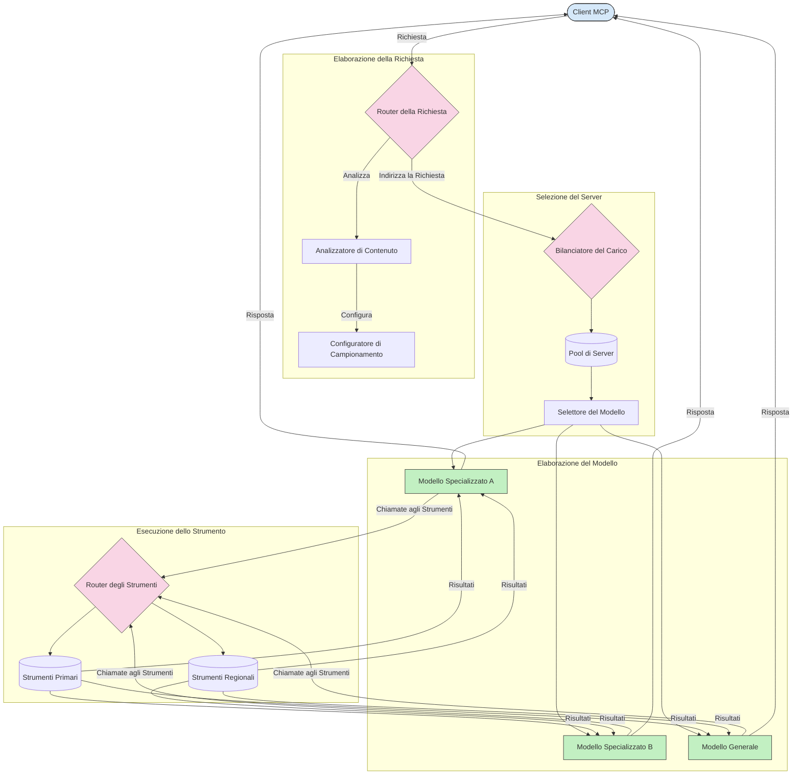

# Routing nel Model Context Protocol

Il routing è essenziale per indirizzare le richieste ai modelli, strumenti o servizi appropriati all'interno di un ecosistema MCP.

## Introduzione

Il routing nel Model Context Protocol (MCP) consiste nell'indirizzare le richieste ai modelli o servizi più adatti in base a vari criteri come il tipo di contenuto, il contesto utente e il carico del sistema. Questo garantisce un'elaborazione efficiente e un utilizzo ottimale delle risorse.

## Obiettivi di apprendimento

Al termine di questa lezione, sarai in grado di:

- Comprendere i principi del routing in MCP.
- Implementare il routing basato sul contenuto per indirizzare le richieste a servizi specializzati.
- Applicare strategie intelligenti di bilanciamento del carico per ottimizzare l'utilizzo delle risorse.
- Implementare il routing dinamico degli strumenti in base al contesto della richiesta.

## Routing basato sul contenuto

Il routing basato sul contenuto indirizza le richieste a servizi specializzati in base al contenuto della richiesta. Ad esempio, le richieste relative alla generazione di codice possono essere indirizzate a un modello di codice specializzato, mentre le richieste di scrittura creativa possono essere inviate a un modello di scrittura creativa.

Vediamo un esempio di implementazione in diversi linguaggi di programmazione.

<details>
<summary>.NET</summary>

```csharp
// .NET Example: Content-based routing in MCP
public class ContentBasedRouter
{
    private readonly Dictionary<string, McpClient> _specializedClients;
    private readonly RoutingClassifier _classifier;
    
    public ContentBasedRouter()
    {
        // Initialize specialized clients for different domains
        _specializedClients = new Dictionary<string, McpClient>
        {
            ["code"] = new McpClient("https://code-specialized-mcp.com"),
            ["creative"] = new McpClient("https://creative-specialized-mcp.com"),
            ["scientific"] = new McpClient("https://scientific-specialized-mcp.com"),
            ["general"] = new McpClient("https://general-mcp.com")
        };
        
        // Initialize content classifier
        _classifier = new RoutingClassifier();
    }
    
    public async Task<McpResponse> RouteAndProcessAsync(string prompt, IDictionary<string, object> parameters = null)
    {
        // Classify the prompt to determine the best specialized service
        string category = await _classifier.ClassifyPromptAsync(prompt);
        
        // Get the appropriate client or fall back to general
        var client = _specializedClients.ContainsKey(category) 
            ? _specializedClients[category] 
            : _specializedClients["general"];
            
        Console.WriteLine($"Routing request to {category} specialized service");
        
        // Send request to the selected service
        return await client.SendPromptAsync(prompt, parameters);
    }
    
    // Simple classifier for routing decisions
    private class RoutingClassifier
    {
        public Task<string> ClassifyPromptAsync(string prompt)
        {
            prompt = prompt.ToLowerInvariant();
            
            if (prompt.Contains("code") || prompt.Contains("function") || 
                prompt.Contains("program") || prompt.Contains("algorithm"))
            {
                return Task.FromResult("code");
            }
            
            if (prompt.Contains("story") || prompt.Contains("creative") || 
                prompt.Contains("imagine") || prompt.Contains("design"))
            {
                return Task.FromResult("creative");
            }
            
            if (prompt.Contains("science") || prompt.Contains("research") || 
                prompt.Contains("analyze") || prompt.Contains("study"))
            {
                return Task.FromResult("scientific");
            }
            
            return Task.FromResult("general");
        }
    }
}
```

Nel codice precedente, abbiamo:

- Creato una classe `ContentBasedRouter` che indirizza le richieste in base al contenuto del prompt.
- Inizializzato client specializzati per diversi domini (codice, creativo, scientifico, generale).
- Implementato un classificatore semplice che determina la categoria del prompt e lo indirizza al servizio specializzato appropriato.
- Utilizzato un meccanismo di fallback per indirizzare le richieste a un servizio generale se non è disponibile un servizio specializzato.
- Implementato l'elaborazione asincrona per gestire le richieste in modo efficiente.
- Usato un dizionario per mappare le categorie di contenuto ai client MCP specializzati.
- Implementato un classificatore semplice che analizza il prompt e restituisce la categoria appropriata.
- Utilizzato il client specializzato per inviare la richiesta e ricevere una risposta.
- Gestito i casi in cui il prompt non corrisponde a nessuna categoria specializzata indirizzando a un servizio generale.

</details>

## Bilanciamento del carico intelligente

Il bilanciamento del carico ottimizza l'utilizzo delle risorse e garantisce un'elevata disponibilità per i servizi MCP. Ci sono diversi modi per implementare il bilanciamento del carico, come round-robin, tempo di risposta ponderato o strategie consapevoli del contenuto.

Vediamo un esempio di implementazione che utilizza le seguenti strategie:

- **Round Robin**: distribuisce le richieste in modo uniforme tra i server disponibili.
- **Tempo di risposta ponderato**: indirizza le richieste ai server in base al loro tempo medio di risposta.
- **Consapevole del contenuto**: indirizza le richieste ai server specializzati in base al contenuto della richiesta.

<details>
<summary>Java</summary>

```java
// Esempio Java: Bilanciamento intelligente del carico per server MCP
public class McpLoadBalancer {
    private final List<McpServerNode> serverNodes;
    private final LoadBalancingStrategy strategy;
    
    public McpLoadBalancer(List<McpServerNode> nodes, LoadBalancingStrategy strategy) {
        this.serverNodes = new ArrayList<>(nodes);
        this.strategy = strategy;
    }
    
    public McpResponse processRequest(McpRequest request) {
        // Seleziona il miglior server in base alla strategia
        McpServerNode selectedNode = strategy.selectNode(serverNodes, request);
        
        try {
            // Inoltra la richiesta al nodo selezionato
            return selectedNode.processRequest(request);
        } catch (Exception e) {
            // Gestisci il fallimento - implementa logica di ritentativo o alternativa
            System.err.println("Error processing request on node " + selectedNode.getId() + ": " + e.getMessage());
            
            // Segna il nodo come potenzialmente non sano
            selectedNode.recordFailure();
            
            // Prova il nodo successivo migliore come fallback
            List<McpServerNode> remainingNodes = new ArrayList<>(serverNodes);
            remainingNodes.remove(selectedNode);
            
            if (!remainingNodes.isEmpty()) {
                McpServerNode fallbackNode = strategy.selectNode(remainingNodes, request);
                return fallbackNode.processRequest(request);
            } else {
                throw new RuntimeException("All MCP server nodes failed to process the request");
            }
        }
    }
    
    // Attività di controllo dello stato di salute del nodo
    public void startHealthChecks(Duration interval) {
        ScheduledExecutorService scheduler = Executors.newScheduledThreadPool(1);
        scheduler.scheduleAtFixedRate(() -> {
            for (McpServerNode node : serverNodes) {
                try {
                    boolean isHealthy = node.checkHealth();
                    System.out.println("Node " + node.getId() + " health status: " + 
                                      (isHealthy ? "HEALTHY" : "UNHEALTHY"));
                } catch (Exception e) {
                    System.err.println("Health check failed for node " + node.getId());
                    node.setHealthy(false);
                }
            }
        }, 0, interval.toMillis(), TimeUnit.MILLISECONDS);
    }
    
    // Interfaccia per strategie di bilanciamento del carico
    public interface LoadBalancingStrategy {
        McpServerNode selectNode(List<McpServerNode> nodes, McpRequest request);
    }
    
    // Strategia round-robin
    public static class RoundRobinStrategy implements LoadBalancingStrategy {
        private AtomicInteger counter = new AtomicInteger(0);
        
        @Override
        public McpServerNode selectNode(List<McpServerNode> nodes, McpRequest request) {
            List<McpServerNode> healthyNodes = nodes.stream()
                .filter(McpServerNode::isHealthy)
                .collect(Collectors.toList());
            
            if (healthyNodes.isEmpty()) {
                throw new RuntimeException("No healthy nodes available");
            }
            
            int index = counter.getAndIncrement() % healthyNodes.size();
            return healthyNodes.get(index);
        }
    }
    
    // Strategia a tempo di risposta ponderato
    public static class ResponseTimeStrategy implements LoadBalancingStrategy {
        @Override
        public McpServerNode selectNode(List<McpServerNode> nodes, McpRequest request) {
            return nodes.stream()
                .filter(McpServerNode::isHealthy)
                .min(Comparator.comparing(McpServerNode::getAverageResponseTime))
                .orElseThrow(() -> new RuntimeException("No healthy nodes available"));
        }
    }
    
    // Strategia consapevole del contenuto
    public static class ContentAwareStrategy implements LoadBalancingStrategy {
        @Override
        public McpServerNode selectNode(List<McpServerNode> nodes, McpRequest request) {
            // Determina le caratteristiche della richiesta
            boolean isCodeRequest = request.getPrompt().contains("code") || 
                                   request.getAllowedTools().contains("codeInterpreter");
            
            boolean isCreativeRequest = request.getPrompt().contains("creative") || 
                                       request.getPrompt().contains("story");
            
            // Trova nodi specializzati
            Optional<McpServerNode> specializedNode = nodes.stream()
                .filter(McpServerNode::isHealthy)
                .filter(node -> {
                    if (isCodeRequest && node.getSpecialization().equals("code")) {
                        return true;
                    }
                    if (isCreativeRequest && node.getSpecialization().equals("creative")) {
                        return true;
                    }
                    return false;
                })
                .findFirst();
            
            // Ritorna il nodo specializzato o il nodo meno carico
            return specializedNode.orElse(
                nodes.stream()
                    .filter(McpServerNode::isHealthy)
                    .min(Comparator.comparing(McpServerNode::getCurrentLoad))
                    .orElseThrow(() -> new RuntimeException("No healthy nodes available"))
            );
        }
    }
}
```

Nel codice precedente, abbiamo:

- Creato una classe `McpLoadBalancer` che gestisce una lista di nodi server MCP e indirizza le richieste in base alla strategia di bilanciamento del carico selezionata.
- Implementato diverse strategie di bilanciamento del carico: `RoundRobinStrategy`, `ResponseTimeStrategy` e `ContentAwareStrategy`.
- Utilizzato un `ScheduledExecutorService` per controllare periodicamente lo stato di salute dei nodi server.
- Implementato un meccanismo di controllo dello stato di salute che marca i nodi come sani o non sani in base alla loro risposta ai controlli.
- Gestito il processamento delle richieste con gestione degli errori e logica di fallback per garantire alta disponibilità.
- Usato una classe `McpServerNode` per rappresentare i singoli nodi server MCP, inclusi stato di salute, tempo medio di risposta e carico attuale.
- Implementato una classe `McpRequest` per incapsulare i dettagli della richiesta come il prompt e gli strumenti consentiti.
- Usato Java Streams per filtrare e selezionare i nodi basandosi sullo stato di salute e sulla specializzazione.

</details>

## Routing dinamico degli strumenti

Il routing degli strumenti garantisce che le chiamate agli strumenti siano indirizzate al servizio più appropriato in base al contesto. Ad esempio, una chiamata a uno strumento meteo potrebbe dover essere indirizzata a un endpoint regionale in base alla posizione dell'utente, oppure uno strumento calcolatrice potrebbe dover usare una versione specifica dell'API.

Vediamo un esempio di implementazione che dimostra il routing dinamico degli strumenti basato sull'analisi della richiesta, endpoint regionali e supporto per versioning.

<details>
<summary>Python</summary>

```python
# Esempio Python: instradamento dinamico degli strumenti basato sull'analisi della richiesta
class McpToolRouter:
    def __init__(self):
        # Registrare gli endpoint degli strumenti disponibili
        self.tool_endpoints = {
            "weatherTool": "https://weather-service.example.com/api",
            "calculatorTool": "https://calculator-service.example.com/compute",
            "databaseTool": "https://database-service.example.com/query",
            "searchTool": "https://search-service.example.com/search"
        }
        
        # Endpoint regionali per la distribuzione globale
        self.regional_endpoints = {
            "us": {
                "weatherTool": "https://us-west.weather-service.example.com/api",
                "searchTool": "https://us.search-service.example.com/search"
            },
            "europe": {
                "weatherTool": "https://eu.weather-service.example.com/api",
                "searchTool": "https://eu.search-service.example.com/search"
            },
            "asia": {
                "weatherTool": "https://asia.weather-service.example.com/api",
                "searchTool": "https://asia.search-service.example.com/search"
            }
        }
        
        # Supporto per il versionamento degli strumenti
        self.tool_versions = {
            "weatherTool": {
                "default": "v2",
                "v1": "https://weather-service.example.com/api/v1",
                "v2": "https://weather-service.example.com/api/v2",
                "beta": "https://weather-service.example.com/api/beta"
            }
        }
    
    async def route_tool_request(self, tool_name, parameters, user_context=None):
        """Route a tool request to the appropriate endpoint based on context"""
        endpoint = self._select_endpoint(tool_name, parameters, user_context)
        
        if not endpoint:
            raise ValueError(f"No endpoint available for tool: {tool_name}")
        
        # Eseguire la richiesta effettiva all'endpoint selezionato
        return await self._execute_tool_request(endpoint, tool_name, parameters)
    
    def _select_endpoint(self, tool_name, parameters, user_context=None):
        """Select the most appropriate endpoint based on context"""
        # Endpoint base dal registro
        if tool_name not in self.tool_endpoints:
            return None
            
        base_endpoint = self.tool_endpoints[tool_name]
        
        # Verificare se è necessario usare una versione specifica dello strumento
        if tool_name in self.tool_versions:
            version_info = self.tool_versions[tool_name]
            
            # Usare la versione specificata o quella predefinita
            requested_version = parameters.get("_version", version_info["default"])
            if requested_version in version_info:
                base_endpoint = version_info[requested_version]
        
        # Verificare l'instradamento regionale se la regione utente è conosciuta
        if user_context and "region" in user_context:
            user_region = user_context["region"]
            
            if user_region in self.regional_endpoints:
                regional_tools = self.regional_endpoints[user_region]
                
                if tool_name in regional_tools:
                    # Usare l'endpoint specifico per la regione
                    return regional_tools[tool_name]
        
        # Verificare i requisiti di residenza dei dati
        if user_context and "data_residency" in user_context:
            # Qui si implementerebbe la logica per garantire che i dati rimangano nella giurisdizione specificata
            pass
        
        # Verificare l'instradamento basato sulla latenza
        if user_context and "latency_sensitive" in user_context and user_context["latency_sensitive"]:
            # Qui si implementerebbe la logica per selezionare l'endpoint a latenza più bassa
            pass
            
        return base_endpoint
        
    async def _execute_tool_request(self, endpoint, tool_name, parameters):
        """Execute the actual tool request to the selected endpoint"""
        try:
            async with aiohttp.ClientSession() as session:
                async with session.post(
                    endpoint,
                    json={"toolName": tool_name, "parameters": parameters},
                    headers={"Content-Type": "application/json"}
                ) as response:
                    if response.status == 200:
                        result = await response.json()
                        return result
                    else:
                        error_text = await response.text()
                        raise Exception(f"Tool execution failed: {error_text}")
        except Exception as e:
            # Implementare la logica di ripetizione o strategia di fallback
            print(f"Error executing tool {tool_name} at {endpoint}: {str(e)}")
            raise
```

Nel codice precedente, abbiamo:

- Creato una classe `McpToolRouter` che gestisce il routing degli strumenti basato sull'analisi della richiesta, endpoint regionali e supporto per versioning.
- Registrato gli endpoint degli strumenti disponibili e gli endpoint regionali per la distribuzione globale.
- Implementato una logica di routing dinamico che seleziona l'endpoint appropriato in base al contesto utente, come regione e requisiti di residenza dati.
- Implementato il supporto per versioning degli strumenti, permettendo agli utenti di specificare quale versione dello strumento vogliono usare.
- Utilizzato richieste HTTP asincrone per eseguire le chiamate agli strumenti e gestire le risposte.

</details>

## Architettura di campionamento e routing in MCP

Il campionamento è un componente critico del Model Context Protocol (MCP) che consente un'elaborazione efficiente delle richieste e del routing. Consiste nell'analizzare le richieste in ingresso per determinare il modello o servizio più appropriato per gestirle, basandosi su vari criteri come tipo di contenuto, contesto utente e carico del sistema.

Campionamento e routing possono essere combinati per creare un'architettura solida che ottimizza l'utilizzo delle risorse e garantisce alta disponibilità. Il processo di campionamento può essere usato per classificare le richieste, mentre il routing le indirizza ai modelli o servizi appropriati.

Il diagramma seguente illustra come campionamento e routing lavorano insieme in un'architettura MCP completa:



## Cosa c'è dopo

- [5.6 Sampling](../mcp-sampling/README.md)

---

<!-- CO-OP TRANSLATOR DISCLAIMER START -->
**Disclaimer**:
Questo documento è stato tradotto utilizzando il servizio di traduzione AI [Co-op Translator](https://github.com/Azure/co-op-translator). Sebbene ci impegniamo per garantire la precisione, si prega di notare che le traduzioni automatizzate possono contenere errori o imprecisioni. Il documento originale nella sua lingua nativa deve essere considerato la fonte autorevole. Per informazioni critiche, si raccomanda una traduzione professionale effettuata da un essere umano. Non siamo responsabili per eventuali malintesi o interpretazioni errate derivanti dall’uso di questa traduzione.
<!-- CO-OP TRANSLATOR DISCLAIMER END -->