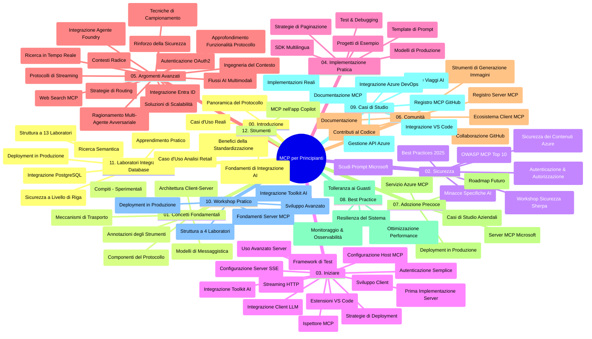

# Model Context Protocol (MCP) per Principianti - Guida di Studio

Questa guida di studio fornisce una panoramica della struttura e del contenuto del repository per il curriculum "Model Context Protocol (MCP) per Principianti". Usa questa guida per navigare nel repository in modo efficiente e sfruttare al meglio le risorse disponibili.

## Panoramica del Repository

Il Model Context Protocol (MCP) è un framework standardizzato per le interazioni tra modelli AI e applicazioni client. Inizialmente creato da Anthropic, MCP è ora mantenuto dalla più ampia comunità MCP attraverso l'organizzazione ufficiale su GitHub. Questo repository offre un curriculum completo con esempi di codice pratico in C#, Java, JavaScript, Python e TypeScript, progettato per sviluppatori AI, architetti di sistema e ingegneri del software.

## Mappa Visiva del Curriculum

## Struttura del Repository

Il repository è organizzato in dodici sezioni principali, ciascuna focalizzata su diversi aspetti di MCP:

1. **Introduzione (00-Introduction/)**
   - Panoramica del Model Context Protocol
   - Perché la standardizzazione è importante nelle pipeline AI
   - Casi d'uso pratici e vantaggi

2. **Concetti Fondamentali (01-CoreConcepts/)**
   - Architettura client-server
   - Componenti chiave del protocollo
   - Schemi di messaggistica in MCP
   - Prospettive future: [Cosa Cambia in MCP: Il Release Candidate 2026-07-28](./01-CoreConcepts/mcp-2026-07-28-release-candidate.md) — il core stateless del protocollo, framework Extensions e la deprecazione di Roots/Sampling/Logging prevista nella prossima versione della specifica

3. **Sicurezza (02-Security/)**
   - Minacce alla sicurezza nei sistemi basati su MCP
   - Best practice per la messa in sicurezza delle implementazioni
   - Strategie di autenticazione e autorizzazione
   - **Documentazione Completa sulla Sicurezza**:
     - MCP Security Best Practices 2025
     - Guida all’implementazione di Azure Content Safety
     - Controlli e tecniche di sicurezza MCP
     - Riferimento rapido alle Best Practices MCP
   - **Argomenti Chiave di Sicurezza**:
     - Attacchi di prompt injection e avvelenamento degli strumenti
     - Hijacking di sessione e problemi di confused deputy
     - Vulnerabilità di token passthrough
     - Permessi e controllo accessi eccessivi
     - Sicurezza della supply chain per componenti AI
     - Integrazione Microsoft Prompt Shields

4. **Primi Passi (03-GettingStarted/)**
   - Configurazione e setup dell’ambiente
   - Creazione di server e client MCP base
   - Integrazione con applicazioni esistenti
   - Include sezioni su:
     - Prima implementazione del server
     - Sviluppo del client
     - Integrazione LLM client
     - Integrazione con VS Code
     - Server-Sent Events (SSE) server
     - Uso avanzato del server
     - Streaming HTTP
     - Integrazione AI Toolkit
     - Strategie di testing
     - Linee guida di distribuzione

5. **Implementazione Pratica (04-PracticalImplementation/)**
   - Uso degli SDK in diversi linguaggi di programmazione
   - Tecniche di debugging, testing e validazione
   - Creazione di template riutilizzabili per prompt e workflow
   - Progetti di esempio con esempi di implementazione

6. **Argomenti Avanzati (05-AdvancedTopics/)**
   - Tecniche di ingegneria del contesto
   - Integrazione dell’agente Foundry
   - Workflow AI multimodale
   - Demo di autenticazione OAuth2
   - Capacità di ricerca in tempo reale
   - Streaming in tempo reale
   - Implementazioni di root contexts
   - Strategie di routing
   - Tecniche di sampling
   - Approcci di scaling
   - Considerazioni di sicurezza
   - Integrazione sicurezza Entra ID
   - Integrazione ricerca web
   - Ragionamento multi-agente avversariale (pattern di dibattito)

7. **Contributi della Comunità (06-CommunityContributions/)**
   - Come contribuire con codice e documentazione
   - Collaborazione tramite GitHub
   - Miglioramenti e feedback guidati dalla comunità
   - Uso di vari client MCP (Claude Desktop, Cline, VSCode)
   - Lavorare con popolari server MCP inclusa la generazione di immagini

8. **Lezioni dall’Adozione Precoce (07-LessonsfromEarlyAdoption/)**
   - Implementazioni reali e storie di successo
   - Costruzione e distribuzione di soluzioni basate su MCP
   - Tendenze e roadmap futura
   - **Guida ai Server Microsoft MCP**: Guida completa a 10 server MCP Microsoft pronti per la produzione tra cui:
     - Microsoft Learn Docs MCP Server
     - Azure MCP Server (15+ connettori specializzati)
     - GitHub MCP Server
     - Azure DevOps MCP Server
     - MarkItDown MCP Server
     - SQL Server MCP Server
     - Playwright MCP Server
     - Dev Box MCP Server
     - Microsoft Foundry MCP Server
     - Microsoft 365 Agents Toolkit MCP Server

9. **Best Practices (08-BestPractices/)**
   - Ottimizzazione e tuning delle prestazioni
   - Progettazione di sistemi MCP tolleranti ai guasti
   - Strategie di testing e resilienza

10. **Studi di Caso (09-CaseStudy/)**
    - **Sette studi di caso completi** che dimostrano la versatilità di MCP in scenari diversi:
    - **Azure AI Travel Agents**: Orchestrazione multi-agente con Azure OpenAI e AI Search
    - **Integrazione Azure DevOps**: Automazione dei processi workflow con aggiornamenti dati YouTube
    - **Recupero Documentazione in Tempo Reale**: Client console Python con streaming HTTP
    - **Generatore Interattivo di Piani di Studio**: App web Chainlit con AI conversazionale
    - **Documentazione In-Editor**: Integrazione VS Code con workflow GitHub Copilot
    - **Azure API Management**: Integrazione API enterprise con creazione server MCP
    - **GitHub MCP Registry**: Sviluppo ecosistema e piattaforma di integrazione agentica
    - Esempi di implementazione che spaziano dall’integrazione enterprise, produttività sviluppatori, allo sviluppo ecosistema

11. **Workshop Pratico (10-StreamliningAIWorkflowsBuildingAnMCPServerWithAIToolkit/)**
    - Workshop pratico completo che combina MCP con AI Toolkit
    - Costruire applicazioni intelligenti che collegano modelli AI con strumenti reali
    - Moduli pratici che coprono fondamentali, sviluppo server personalizzato e strategie di distribuzione in produzione
    - **Struttura del Lab**:
      - Lab 1: Fondamenti del Server MCP
      - Lab 2: Sviluppo Avanzato Server MCP
      - Lab 3: Integrazione AI Toolkit
      - Lab 4: Distribuzione in Produzione e Scaling
    - Approccio di apprendimento basato su lab con istruzioni passo-passo

12. **Lab di Integrazione Database Server MCP (11-MCPServerHandsOnLabs/)**
    - **Percorso di apprendimento completo con 13 lab** per costruire server MCP pronti per la produzione con integrazione PostgreSQL
    - **Implementazione reale di analisi retail** usando il caso d’uso Zava Retail
    - **Pattern enterprise** tra cui Row Level Security (RLS), ricerca semantica e accesso dati multi-tenant
    - **Struttura Completa dei Lab**:
      - **Lab 00-03: Fondamenti** - Introduzione, Architettura, Sicurezza, Setup ambiente
      - **Lab 04-06: Costruire il Server MCP** - Progettazione database, implementazione server MCP, sviluppo strumenti
      - **Lab 07-09: Funzionalità Avanzate** - Ricerca semantica, testing & debugging, integrazione VS Code
      - **Lab 10-12: Produzione & Best Practices** - Distribuzione, monitoraggio, ottimizzazione
    - **Tecnologie Coperti**: framework FastMCP, PostgreSQL, Azure OpenAI, Azure Container Apps, Application Insights
    - **Risultati di Apprendimento**: server MCP pronti per produzione, pattern di integrazione database, analytics AI-powered, sicurezza enterprise

13. **Tooling (12-tooling/)**
    - Imparare come usare MCP in app Copilot e altri strumenti

## Risorse Aggiuntive

Il repository include risorse di supporto:

- **Cartella Images**: Contiene diagrammi e illustrazioni utilizzate in tutto il curriculum
- **Traduzioni**: Supporto multilingue con traduzioni automatizzate della documentazione
- **Risorse Ufficiali MCP**:
  - [Documentazione MCP](https://modelcontextprotocol.io/)
  - [Specifiche MCP](https://spec.modelcontextprotocol.io/)
  - [Repository GitHub MCP](https://github.com/modelcontextprotocol)

## Come Usare Questo Repository

1. **Apprendimento Sequenziale**: Segui i capitoli in ordine (00 fino a 11) per un’esperienza di apprendimento strutturata.
2. **Focus su Linguaggi Specifici**: Se sei interessato a un linguaggio di programmazione particolare, esplora le directory dei sample per implementazioni nella tua lingua preferita.
3. **Implementazione Pratica**: Inizia con la sezione "Primi Passi" per configurare l’ambiente e creare il tuo primo server e client MCP.
4. **Esplorazione Avanzata**: Una volta acquisita familiarità con le basi, approfondisci gli argomenti avanzati per ampliare le tue conoscenze.
5. **Coinvolgimento nella Comunità**: Unisciti alla comunità MCP tramite discussioni GitHub e canali Discord per connetterti con esperti e altri sviluppatori.

## Client e Strumenti MCP

Il curriculum copre vari client e strumenti MCP:

1. **Client Ufficiali**:
   - Visual Studio Code 
   - MCP in Visual Studio Code
   - Claude Desktop
   - Claude in VSCode 
   - Claude API

2. **Client della Comunità**:
   - Cline (basato su terminale)
   - Cursor (editor di codice)
   - ChatMCP
   - Windsurf

3. **Strumenti di Gestione MCP**:
   - MCP CLI
   - MCP Manager
   - MCP Linker
   - MCP Router

## Server MCP Popolari

Il repository presenta vari server MCP, tra cui:

1. **Server MCP Ufficiali Microsoft**:
   - Microsoft Learn Docs MCP Server
   - Azure MCP Server (15+ connettori specializzati)
   - GitHub MCP Server
   - Azure DevOps MCP Server
   - MarkItDown MCP Server
   - SQL Server MCP Server
   - Playwright MCP Server
   - Dev Box MCP Server
   - Microsoft Foundry MCP Server
   - Microsoft 365 Agents Toolkit MCP Server

2. **Server di Riferimento Ufficiali**:
   - Filesystem
   - Fetch
   - Memory
   - Sequential Thinking

3. **Generazione Immagini**:
   - Azure OpenAI DALL-E 3
   - Stable Diffusion WebUI
   - Replicate

4. **Strumenti di Sviluppo**:
   - Git MCP
   - Terminal Control
   - Code Assistant

5. **Server Specializzati**:
   - Salesforce
   - Microsoft Teams
   - Jira & Confluence

## Contributi

Questo repository accoglie contributi dalla comunità. Consulta la sezione Contributi della Comunità per indicazioni su come contribuire efficacemente all’ecosistema MCP.

----

*Questa guida di studio è stata aggiornata l'ultima volta il 5 febbraio 2026, riflettendo la più recente Specifica MCP 2025-11-25 e offre una panoramica del repository a quella data. Il contenuto del repository può essere aggiornato successivamente a tale data.*

*Addendum (2 luglio 2026): è stata aggiunta una lezione sul Release Candidate della Specifica MCP `2026-07-28` sotto [01-CoreConcepts](./01-CoreConcepts/mcp-2026-07-28-release-candidate.md); la baseline del curriculum rimane 2025-11-25 fino alla pubblicazione della nuova specifica.*

---

<!-- CO-OP TRANSLATOR DISCLAIMER START -->
**Disclaimer**:
Questo documento è stato tradotto utilizzando il servizio di traduzione AI [Co-op Translator](https://github.com/Azure/co-op-translator). Sebbene ci impegniamo per garantire la precisione, si prega di notare che le traduzioni automatizzate possono contenere errori o imprecisioni. Il documento originale nella sua lingua nativa deve essere considerato la fonte autorevole. Per informazioni critiche, si raccomanda una traduzione professionale effettuata da un essere umano. Non siamo responsabili per eventuali malintesi o interpretazioni errate derivanti dall’uso di questa traduzione.
<!-- CO-OP TRANSLATOR DISCLAIMER END -->