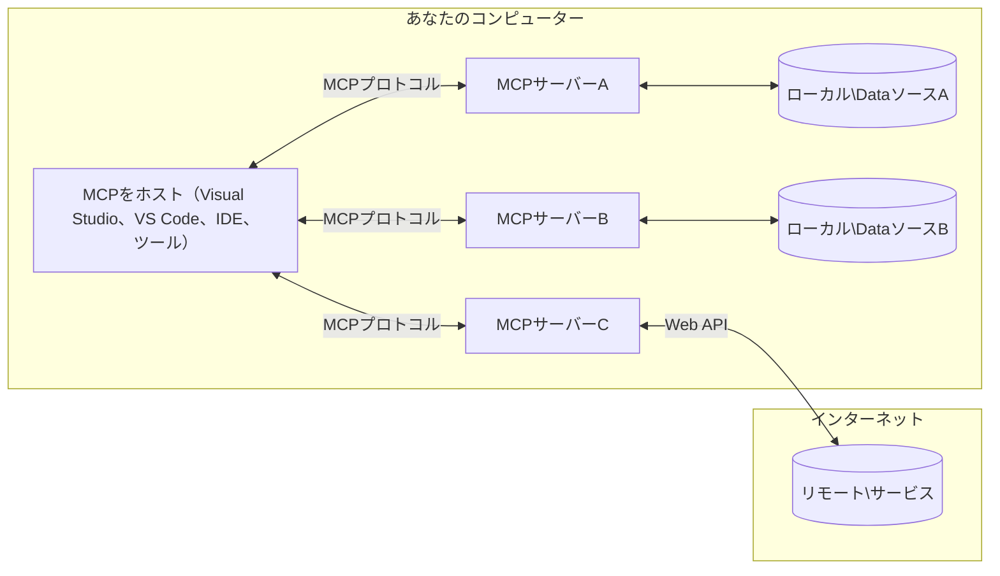

# MCP コアコンセプト: AI統合のためのモデルコンテキストプロトコルの習得

[](https://youtu.be/earDzWGtE84)

_(このレッスンのビデオを見るには上の画像をクリックしてください)_

[Model Context Protocol (MCP)](https://github.com/modelcontextprotocol) は、大規模言語モデル（LLM）と外部ツール、アプリケーション、データソース間の通信を最適化する強力で標準化されたフレームワークです。
このガイドでは、MCPのコアコンセプトを紹介します。クライアント・サーバーアーキテクチャ、重要なコンポーネント、通信の仕組み、実装のベストプラクティスを学びます。

- <strong>明確なユーザー同意</strong>: すべてのデータアクセスおよび操作は、実行前に明示的なユーザー承認が必要です。ユーザーはアクセスされるデータおよび実行されるアクションを明確に理解し、権限や許可を細かく制御できます。

- <strong>データプライバシーの保護</strong>: ユーザーデータは明確な同意のある場合にのみ公開され、インタラクション全体を通じて堅牢なアクセス制御によって保護されなければなりません。実装は不正なデータ送信を防止し、厳格なプライバシー境界を維持します。

- <strong>ツール実行の安全性</strong>: すべてのツール呼び出しには、ツールの機能、パラメーター、および潜在的影響を明確に理解した上での明示的なユーザー同意が必要です。強固なセキュリティ境界により、意図しない、危険または悪意のあるツール実行を防ぎます。

- <strong>トランスポート層のセキュリティ</strong>: すべての通信チャネルは適切な暗号化および認証メカニズムを用いなければなりません。リモート接続は安全なトランスポートプロトコルと適切な資格情報管理を実装する必要があります。

#### 実装ガイドライン:

- <strong>権限管理</strong>: ユーザーがアクセス可能なサーバー、ツール、およびリソースを制御できる細粒度の権限システムを実装すること
- <strong>認証と認可</strong>: 安全な認証方法（OAuth、APIキー）を使用し、適切なトークン管理と有効期限を設けること
- <strong>入力検証</strong>: 定義されたスキーマに従い、すべてのパラメーターやデータ入力を検証し、インジェクション攻撃を防ぐこと
- <strong>監査ログ</strong>: セキュリティ監視とコンプライアンスのために、すべての操作の包括的なログを保持すること

## 概要

このレッスンでは、Model Context Protocol (MCP) エコシステムの基本的なアーキテクチャと構成要素について探ります。クライアント・サーバーアーキテクチャ、主要コンポーネント、MCPインタラクションを支える通信メカニズムについて学びます。

## 主要な学習目標

このレッスンの終了時には、以下を理解できます:

- MCPのクライアント・サーバーアーキテクチャを理解する
- ホスト、クライアント、およびサーバーの役割と責任を特定する
- MCPを柔軟な統合レイヤーにするコア機能を分析する
- MCPエコシステム内の情報の流れを学ぶ
- .NET、Java、Python、JavaScriptのコード例を通じて実践的な洞察を得る

## MCPアーキテクチャ: 詳細な解説

MCPエコシステムはクライアント・サーバー方式に基づいて構築されています。このモジュラー構造により、AIアプリケーションはツール、データベース、API、およびコンテキストリソースと効率よく連携できます。このアーキテクチャを主要コンポーネントに分解してみましょう。

MCPのコアはクライアント・サーバーアーキテクチャに従い、ホストアプリケーションは複数のサーバーに接続できます:



- **MCPホスト**: VSCode、Claude Desktop、IDE、またはMCPを通じてデータにアクセスしたいAIツールなどのプログラム
- **MCPクライアント**: サーバーと1対1の接続を維持するプロトコルクライアント
- **MCPサーバー**: 標準化されたModel Context Protocolを通じて特定の機能を公開する軽量プログラム
- <strong>ローカルデータソース</strong>: MCPサーバーが安全にアクセスできるユーザーのコンピュータのファイル、データベース、およびサービス
- <strong>リモートサービス</strong>: MCPサーバーがAPIを通じて接続できるインターネット上の外部システム

MCPプロトコルは日付ベースのバージョニング（YYYY-MM-DD形式）を用いる進化中の標準です。現在のプロトコルバージョンは<strong>2025-11-25</strong>です。最新の更新情報は[プロトコル仕様](https://modelcontextprotocol.io/specification/2025-11-25/)でご覧いただけます。

> **今後の展望:** 次期仕様バージョンのリリース候補<strong>2026-07-28</strong>が2026年5月に発表され、2026年7月28日に公開予定です。これはトランスポート層をステートレスにし（`initialize`ハンドシェイクとセッションIDを削除）、Extensionsフレームワークを正式化し、新しいパターンに置き換えるためにRoots、Sampling、Loggingを非推奨にします。詳細は[2026-07-28リリース候補でのMCPの変更点](./mcp-2026-07-28-release-candidate.md)をご覧ください。

### 1. ホスト

Model Context Protocol (MCP) において、<strong>ホスト</strong>はユーザーがプロトコルとやり取りするための主要なインターフェースとして機能するAIアプリケーションです。ホストは複数のMCPサーバーへの接続を管理し、サーバーごとに専用のMCPクライアントを作成します。ホストの例は以下の通りです:

- **AIアプリケーション**: Claude Desktop、Visual Studio Code、Claude Code
- <strong>開発環境</strong>: MCP統合を備えたIDEやコードエディタ  
- <strong>カスタムアプリケーション</strong>: 目的に特化したAIエージェントやツール

<strong>ホスト</strong>はAIモデルとのインタラクションを調整するアプリケーションです。彼らは:

- **AIモデルの調整**: LLMを実行または操作して応答を生成し、AIワークフローを調整する
- <strong>クライアント接続の管理</strong>: MCPサーバーごとに1つのMCPクライアントを作成し管理する
- <strong>ユーザーインターフェースの制御</strong>: 会話の流れ、ユーザーの操作、および応答の表示を処理する  
- <strong>セキュリティの強制</strong>: 権限、セキュリティ制約、認証を制御する
- <strong>ユーザー同意の管理</strong>: データ共有およびツール実行のためのユーザー承認を管理する


### 2. クライアント

<strong>クライアント</strong>はホストとMCPサーバー間で専用の1対1接続を維持する重要なコンポーネントです。各MCPクライアントは特定のMCPサーバーに接続するためにホストによってインスタンス化され、秩序立った安全な通信チャネルを確保します。複数のクライアントにより、ホストは複数のサーバーに同時接続可能です。

<strong>クライアント</strong>はホストアプリケーション内のコネクターコンポーネントです。彼らは:

- <strong>プロトコル通信</strong>: JSON-RPC 2.0 リクエストをサーバーに送信し、プロンプトや指示を伝える
- <strong>機能交渉</strong>: 初期化時にサーバーとサポートされる機能やプロトコルバージョンを交渉する
- <strong>ツール実行</strong>: モデルからのツール実行リクエストを管理し、応答を処理する
- <strong>リアルタイム更新</strong>: サーバーからの通知やリアルタイムの更新を処理する
- <strong>応答処理</strong>: ユーザー表示用にサーバーの応答を処理および整形する

### 3. サーバー

<strong>サーバー</strong>はMCPクライアントにコンテキスト、ツール、および機能を提供するプログラムです。ローカル（ホストと同一マシン）またはリモート（外部プラットフォーム）で実行され、クライアントからのリクエストを処理し構造化された応答を提供します。サーバーは標準化されたModel Context Protocolを通じて特定の機能を公開します。

<strong>サーバー</strong>はコンテキストおよび機能を提供するサービスです。彼らは:

- <strong>機能登録</strong>: 利用可能なプリミティブ（リソース、プロンプト、ツール）をクライアントに登録して公開する
- <strong>リクエスト処理</strong>: クライアントからのツール呼び出し、リソースリクエスト、およびプロンプトリクエストを受信・実行する
- <strong>コンテキスト提供</strong>: モデルの応答を向上させるためにコンテキスト情報やデータを提供する
- <strong>状態管理</strong>: セッション状態を維持し、必要に応じて状態保持のインタラクションを処理する

- <strong>リアルタイム通知</strong>: 機能の変更や更新について接続されたクライアントに通知を送信

サーバーは誰でも開発でき、専門的な機能でモデルの能力を拡張でき、ローカルおよびリモートの両方の展開シナリオをサポートします。

### 4. サーバープリミティブ

Model Context Protocol（MCP）のサーバーは、クライアント、ホスト、言語モデル間の豊富なインタラクションの基本構成要素を定義する3つの主要な<strong>プリミティブ</strong>を提供します。これらのプリミティブは、プロトコルを通じて利用可能なコンテキスト情報とアクションの種類を指定します。

MCPサーバーは以下の3つの主要プリミティブのいずれか、またはそれらの組み合わせを公開できます：

#### リソース

<strong>リソース</strong>は、AIアプリケーションにコンテキスト情報を提供するデータソースです。これらは、モデルの理解と意思決定を強化できる静的または動的なコンテンツを表します：

- <strong>コンテキストデータ</strong>: AIモデル消費のための構造化された情報とコンテキスト
- <strong>知識ベース</strong>: ドキュメントリポジトリ、記事、マニュアル、研究論文
- <strong>ローカルデータソース</strong>: ファイル、データベース、ローカルシステム情報  
- <strong>外部データ</strong>: APIレスポンス、ウェブサービス、リモートシステムデータ
- <strong>動的コンテンツ</strong>: 外部の条件に基づいて更新されるリアルタイムデータ

リソースはURIで識別され、`resources/list`による検出および`resources/read`による取得をサポートします：

```text
file://documents/project-spec.md
database://production/users/schema
api://weather/current
```

#### プロンプト

<strong>プロンプト</strong>は、言語モデルとのインタラクションを構造化するのに役立つ再利用可能なテンプレートです。標準化されたインタラクションパターンとテンプレート化されたワークフローを提供します：

- <strong>テンプレートベースのインタラクション</strong>: 事前構築されたメッセージや会話の開始文
- <strong>ワークフローテンプレート</strong>: 一般的なタスクやインタラクションの標準化されたシーケンス
- <strong>少数ショット例</strong>: モデルへの指示用の例に基づくテンプレート
- <strong>システムプロンプト</strong>: モデルの動作とコンテキストを定義する基盤的プロンプト
- <strong>動的テンプレート</strong>: 特定のコンテキストに適応するパラメータ化されたプロンプト

プロンプトは変数置換をサポートし、`prompts/list`で検出、`prompts/get`で取得できます：

```markdown
Generate a {{task_type}} for {{product}} targeting {{audience}} with the following requirements: {{requirements}}
```

#### ツール

<strong>ツール</strong>は、AIモデルが特定のアクションを実行するために呼び出せる実行可能な関数です。MCPエコシステムの「動詞」を表し、モデルが外部システムと連携できるようにします：

- <strong>実行可能な関数</strong>: モデルが特定のパラメータで呼び出せる個別の操作
- <strong>外部システム統合</strong>: API呼び出し、データベースクエリ、ファイル操作、計算
- <strong>固有の識別子</strong>: 各ツールには固有の名前、説明、パラメータスキーマがある
- <strong>構造化された入出力</strong>: ツールは検証済みパラメータを受け取り、構造化かつ型付きの応答を返す
- <strong>アクション機能</strong>: モデルが現実世界のアクションを実行し、ライブデータを取得できるようにする

ツールはパラメータ検証のためにJSON Schemaで定義され、`tools/list`で検出、`tools/call`で実行されます。ツールにはUI表示向上のための<strong>アイコン</strong>という追加メタデータも含めることができます。

<strong>ツール注釈</strong>: ツールは読み取り専用であるか破壊的であるかを示す動作注釈（例: `readOnlyHint`, `destructiveHint`）をサポートし、クライアントがツールの実行に関して適切な判断を下せるようにします。

ツール定義の例：

```typescript
server.tool(
  "search_products", 
  {
    query: z.string().describe("Search query for products"),
    category: z.string().optional().describe("Product category filter"),
    max_results: z.number().default(10).describe("Maximum results to return")
  }, 
  async (params) => {
    // 検索を実行し、構造化された結果を返す
    return await productService.search(params);
  }
);
```

## クライアントプリミティブ

Model Context Protocol（MCP）において、<strong>クライアント</strong>はホストアプリケーションに追加機能の要求を可能にするプリミティブを公開できます。これらのクライアント側プリミティブにより、AIモデルの機能やユーザーインタラクションにアクセスできる、より豊かでインタラクティブなサーバーの実装が可能となります。

### サンプリング

> **廃止通知:** `2026-07-28`のリリース候補で、サンプリングはLLMプロバイダーAPIとの直接統合を優先する形で廃止予定となりました。`2025-11-25`では引き続き動作し、廃止から少なくとも1年間は使用可能ですが、新しい設計では代替パターンを推奨します。[What's Changing in MCP: The 2026-07-28 Release Candidate](./mcp-2026-07-28-release-candidate.md)を参照してください。

<strong>サンプリング</strong>は、サーバーがクライアントのAIアプリケーションから言語モデルの補完を要求できるプリミティブです。このプリミティブにより、サーバーは自身のモデル依存を埋め込まずにLLM機能にアクセスできます：

- <strong>モデル非依存のアクセス</strong>: サーバーはLLM SDKを含めずに補完を要求可能
- **サーバー主導のAI**: クライアントのAIモデルを用いてサーバーが自律的にコンテンツ生成
- **再帰的なLLMインタラクション**: 複雑な処理でAI支援が必要な場面をサポート
- <strong>動的コンテンツ生成</strong>: ホストのモデルを使ったコンテキスト応答の生成を可能に
- <strong>ツール呼び出しサポート</strong>: サーバーはサンプリング中にツールを呼び出すための`tools`と`toolChoice`パラメータを含められる

サンプリングは`sampling/complete`メソッドを通じて開始され、サーバーはクライアントに補完リクエストを送信します。

### ルーツ

> **廃止通知:** `2026-07-28`のリリース候補で、ルーツはツールパラメータ、リソースURI、サーバー構成に置き換えられ廃止されます。`2025-11-25`では引き続き動作し、廃止から少なくとも1年間は使えます。[What's Changing in MCP: The 2026-07-28 Release Candidate](./mcp-2026-07-28-release-candidate.md)を参照してください。

<strong>ルーツ</strong>は、クライアントがサーバーにファイルシステムの境界を標準的に公開する方法を提供し、サーバーはアクセス可能なディレクトリやファイルを理解できるようにします：

- <strong>ファイルシステムの境界</strong>: サーバーが操作可能なファイルシステムの範囲を定義
- <strong>アクセス制御</strong>: サーバーがアクセス許可のあるディレクトリやファイルを理解
- <strong>動的更新</strong>: ルートのリスト変更時にクライアントがサーバーに通知可能
- **URIベースの識別**: ルーツは`file://` URIを用いてアクセス可能なディレクトリとファイルを識別

ルーツは`roots/list`メソッドで検出され、ルートの変更時はクライアントが`notifications/roots/list_changed`を送信します。

### 聞き出し（エリシテーション）  

<strong>聞き出し</strong>は、サーバーがクライアントのインターフェースを通じてユーザーから追加情報や確認を求めることを可能にします：

- <strong>ユーザー入力要求</strong>: ツール実行に必要な追加情報をサーバーが求める
- <strong>確認ダイアログ</strong>: 敏感または影響の大きい操作に関するユーザー承認を要求
- <strong>インタラクティブワークフロー</strong>: ステップバイステップのユーザーインタラクションをサーバーが作成可能
- <strong>動的パラメータ収集</strong>: ツール実行中に欠落またはオプションのパラメータを収集

聞き出し要求は`elicitation/request`メソッドを使い、クライアントのインターフェースを通じてユーザー入力を収集します。

**URLモードの聞き出し**: サーバーはURLベースのユーザーインタラクションも要求でき、認証、確認、データ入力のため外部ウェブページにユーザーを誘導可能です。

### ロギング


> **廃止通知:** `2026-07-28` リリース候補では、stdioトランスポートに対しては `stderr` を、構造化された可観測性のためにOpenTelemetryを推奨し、Loggingは非推奨とされます。`2025-11-25` 及び廃止後少なくとも1年間は引き続き動作します。詳細は [What's Changing in MCP: The 2026-07-28 Release Candidate](./mcp-2026-07-28-release-candidate.md) を参照してください。

**Logging** は、デバッグ、監視、および運用の可視化のためにサーバーが構造化ログメッセージをクライアントに送信することを可能にします：

- <strong>デバッグサポート</strong>: トラブルシューティングのためにサーバーが詳細な実行ログを提供できるようにする
- <strong>運用監視</strong>: クライアントにステータス更新やパフォーマンス指標を送信する
- <strong>エラー報告</strong>: 詳細なエラーコンテキストと診断情報を提供する
- <strong>監査記録</strong>: サーバーの操作と意思決定の包括的なログを作成する

ロギングメッセージはサーバーの操作の透明性を提供し、デバッグを容易にするためにクライアントに送信されます。

## MCPにおける情報の流れ

Model Context Protocol (MCP) は、ホスト、クライアント、サーバー、およびモデル間の情報の構造化された流れを定義します。この流れを理解することで、ユーザーのリクエストがどのように処理され、外部ツールやデータがモデルの応答にどのように統合されるかが明確になります。

- <strong>ホストが接続を開始</strong>  
  IDEやチャットインターフェイスなどのホストアプリケーションが、通常STDIO、WebSocket、または他のサポートされるトランスポート経由でMCPサーバーへの接続を確立します。

- <strong>機能交渉</strong>  
  ホストに内蔵されたクライアントとサーバーが、それぞれがサポートする機能、ツール、リソース、プロトコルバージョンについて情報を交換します。これにより両者がセッションで利用可能な機能を理解します。

- <strong>ユーザーからのリクエスト</strong>  
  ユーザーがホストと対話（例：プロンプトやコマンドの入力）し、ホストはこの入力を収集しクライアントへ渡します。

- <strong>リソースやツールの利用</strong>  
  - クライアントはモデルの理解を深めるためにサーバーから追加のコンテキストやリソース（ファイル、データベースのエントリ、ナレッジベースの記事など）を要求することがあります。
  - モデルがツールの使用を必要と判断した場合（例：データの取得、計算の実行、API呼び出し）、クライアントはツール名とパラメータを指定してサーバーへツール呼び出しリクエストを送信します。

- <strong>サーバーの実行</strong>  
  サーバーはリソースやツールリクエストを受け取り、必要な操作（関数の実行、データベースへの問い合わせ、ファイルの取得など）を行い、結果を構造化された形式でクライアントに返します。

- <strong>応答生成</strong>  
  クライアントはサーバーの応答（リソースデータやツールの出力など）を継続中のモデル対話に統合します。モデルはこれらの情報を使って包括的かつ文脈に即した応答を生成します。

- <strong>結果の提示</strong>  
  ホストがクライアントから最終出力を受け取り、ユーザーに提示します。通常、モデル生成テキストとツールの実行結果やリソースの検索結果が含まれます。

この流れにより、MCPはモデルと外部ツールやデータソースをシームレスに連携させ、高度でインタラクティブなコンテキスト認識AIアプリケーションを支援します。

## プロトコルのアーキテクチャとレイヤー

MCPは、完全な通信フレームワークを提供するために連携する2つの明確なアーキテクチャレイヤーで構成されています：

### データレイヤー

<strong>データレイヤー</strong> は、**JSON-RPC 2.0** を基盤としてMCPコアプロトコルを実装します。このレイヤーはメッセージ構造、意味論、相互作用パターンを定義します：

#### コアコンポーネント：

- **JSON-RPC 2.0 プロトコル**: すべての通信は標準化されたJSON-RPC 2.0メッセージフォーマット（メソッド呼び出し、応答、通知）を使用
- <strong>ライフサイクル管理</strong>: クライアントとサーバー間の接続初期化、機能交渉、セッション終了を処理
- <strong>サーバーのプリミティブ</strong>: サーバーがツール、リソース、プロンプトを通じてコア機能を提供可能にする
- <strong>クライアントのプリミティブ</strong>: サーバーがLLMからのサンプリング要求、ユーザー入力の誘発、ログメッセージ送信を可能にする
- <strong>リアルタイム通知</strong>: ポーリング不要の非同期通知をサポート

#### 主な特徴：

- <strong>プロトコルバージョン交渉</strong>: 日付ベースのバージョニング（YYYY-MM-DD）で互換性を保証
- <strong>機能検出</strong>: 初期化時にクライアントとサーバーがサポートする機能情報を交換
- <strong>ステートフルセッション</strong>: 複数の対話間で接続状態を維持してコンテキストの連続性を確保

### トランスポートレイヤー

<strong>トランスポートレイヤー</strong> は、MCP参加者間の通信チャネル、メッセージフレーミング、認証を管理します：

#### サポートされるトランスポート機構：

1. **STDIOトランスポート**:
   - プロセス間の直接通信に標準入出力ストリームを使用
   - ネットワークオーバーヘッドなしで同じマシンのローカルプロセスに最適
   - ローカルMCPサーバー実装で一般的に使用

2. **ストリーミング可能なHTTPトランスポート**:
   - クライアントからサーバーへのメッセージにはHTTP POSTを使用  
   - サーバーからクライアントへのストリーミングにはオプションでServer-Sent Events (SSE)
   - ネットワークを越えたリモートサーバー通信を実現
   - 標準HTTP認証（ベアラートークン、APIキー、カスタムヘッダー）をサポート
   - MCPは安全なトークン認証にOAuthを推奨

#### トランスポートの抽象化：

トランスポートレイヤーはデータレイヤーから通信の詳細を抽象化し、すべてのトランスポート機構で同一のJSON-RPC 2.0メッセージフォーマットを可能にします。これにより、アプリケーションがローカルとリモートサーバー間をシームレスに切り替えられます。

### セキュリティ考慮事項

MCPの実装は、すべてのプロトコル操作において安全で信頼できるやり取りを保証するためにいくつかの重要なセキュリティ原則を遵守しなければなりません：

- <strong>ユーザーの同意と制御</strong>: データアクセスや操作の前に明示的な同意を得る必要があります。共有されるデータや許可されるアクションをユーザーが明確に制御でき、活動の確認と承認のための直感的なユーザーインターフェイスが提供されるべきです。

- <strong>データプライバシー</strong>: ユーザーデータは明示的な同意がある場合にのみ公開され、適切なアクセス制御により保護されるべきです。MCP実装は無許可のデータ送信を防止し、すべてのやり取りを通じてプライバシーを維持する必要があります。

- <strong>ツールの安全性</strong>: ツール呼び出しの前に明示的なユーザー同意が必要です。ユーザーは各ツールの機能を明確に理解し、意図しないまたは安全でないツール実行を防止するための堅牢なセキュリティ境界が適用されなければなりません。

これらのセキュリティ原則を従うことで、MCPはすべてのプロトコル相互作用においてユーザーの信頼、プライバシー、安全性を維持しながら強力なAI統合を可能にします。

## コード例：主要コンポーネント

以下に、主要なMCPサーバーコンポーネントやツールを実装する方法を示す人気のプログラミング言語のコード例を示します。

### .NET例：ツール付き簡単なMCPサーバーの作成

これは、カスタムツールで簡単なMCPサーバーを実装する実用的な.NETコード例です。この例はツールの定義と登録、リクエスト処理、Model Context Protocolを使ったサーバーの接続方法を示しています。

```csharp
using System;
using System.Threading.Tasks;
using ModelContextProtocol.Server;
using ModelContextProtocol.Server.Transport;
using ModelContextProtocol.Server.Tools;

public class WeatherServer
{
    public static async Task Main(string[] args)
    {
        // Create an MCP server
        var server = new McpServer(
            name: "Weather MCP Server",
            version: "1.0.0"
        );
        
        // Register our custom weather tool
        server.AddTool<string, WeatherData>("weatherTool", 
            description: "Gets current weather for a location",
            execute: async (location) => {
                // Call weather API (simplified)
                var weatherData = await GetWeatherDataAsync(location);
                return weatherData;
            });
        
        // Connect the server using stdio transport
        var transport = new StdioServerTransport();
        await server.ConnectAsync(transport);
        
        Console.WriteLine("Weather MCP Server started");
        
        // Keep the server running until process is terminated
        await Task.Delay(-1);
    }
    
    private static async Task<WeatherData> GetWeatherDataAsync(string location)
    {
        // This would normally call a weather API
        // Simplified for demonstration
        await Task.Delay(100); // Simulate API call
        return new WeatherData { 
            Temperature = 72.5,
            Conditions = "Sunny",
            Location = location
        };
    }
}

public class WeatherData
{
    public double Temperature { get; set; }
    public string Conditions { get; set; }
    public string Location { get; set; }
}
```

### Java例：MCPサーバーコンポーネント

これは上記の.NET例と同じMCPサーバーおよびツール登録の例ですが、Javaで実装されています。

```java
import io.modelcontextprotocol.server.McpServer;
import io.modelcontextprotocol.server.McpToolDefinition;
import io.modelcontextprotocol.server.transport.StdioServerTransport;
import io.modelcontextprotocol.server.tool.ToolExecutionContext;
import io.modelcontextprotocol.server.tool.ToolResponse;

public class WeatherMcpServer {
    public static void main(String[] args) throws Exception {
        // MCPサーバーを作成する
        McpServer server = McpServer.builder()
            .name("Weather MCP Server")
            .version("1.0.0")
            .build();
            
        // 天気ツールを登録する
        server.registerTool(McpToolDefinition.builder("weatherTool")
            .description("Gets current weather for a location")
            .parameter("location", String.class)
            .execute((ToolExecutionContext ctx) -> {
                String location = ctx.getParameter("location", String.class);
                
                // 天気データを取得する（簡略化）
                WeatherData data = getWeatherData(location);
                
                // フォーマットされた応答を返す
                return ToolResponse.content(
                    String.format("Temperature: %.1f°F, Conditions: %s, Location: %s", 
                    data.getTemperature(), 
                    data.getConditions(), 
                    data.getLocation())
                );
            })
            .build());
        
        // stdioトランスポートを使用してサーバーに接続する
        try (StdioServerTransport transport = new StdioServerTransport()) {
            server.connect(transport);
            System.out.println("Weather MCP Server started");
            // プロセスが終了するまでサーバーを実行し続ける
            Thread.currentThread().join();
        }
    }
    
    private static WeatherData getWeatherData(String location) {
        // 実装では天気APIを呼び出す
        // 例示のために簡略化されている
        return new WeatherData(72.5, "Sunny", location);
    }
}

class WeatherData {
    private double temperature;
    private String conditions;
    private String location;
    
    public WeatherData(double temperature, String conditions, String location) {
        this.temperature = temperature;
        this.conditions = conditions;
        this.location = location;
    }
    
    public double getTemperature() {
        return temperature;
    }
    
    public String getConditions() {
        return conditions;
    }
    
    public String getLocation() {
        return location;
    }
}
```

### Python例：MCPサーバーの構築

この例は fastmcp を使用しているので、最初にインストールしてください：

```python
pip install fastmcp
```
コードサンプル：

```python
#!/usr/bin/env python3
import asyncio
from fastmcp import FastMCP
from fastmcp.transports.stdio import serve_stdio

# FastMCPサーバーを作成する
mcp = FastMCP(
    name="Weather MCP Server",
    version="1.0.0"
)

@mcp.tool()
def get_weather(location: str) -> dict:
    """Gets current weather for a location."""
    return {
        "temperature": 72.5,
        "conditions": "Sunny",
        "location": location
    }

# クラスを使った別の方法
class WeatherTools:
    @mcp.tool()
    def forecast(self, location: str, days: int = 1) -> dict:
        """Gets weather forecast for a location for the specified number of days."""
        return {
            "location": location,
            "forecast": [
                {"day": i+1, "temperature": 70 + i, "conditions": "Partly Cloudy"}
                for i in range(days)
            ]
        }

# クラスツールを登録する
weather_tools = WeatherTools()

# サーバーを起動する
if __name__ == "__main__":
    asyncio.run(serve_stdio(mcp))
```

### JavaScript例：MCPサーバーの作成

この例はJavaScriptでし2つの天気関連ツールを登録するMCPサーバーの作成方法を示しています。

```javascript
// 公式のモデルコンテキストプロトコルSDKを使用
import { McpServer } from "@modelcontextprotocol/sdk/server/mcp.js";
import { StdioServerTransport } from "@modelcontextprotocol/sdk/server/stdio.js";
import { z } from "zod"; // パラメータ検証用

// MCPサーバーを作成
const server = new McpServer({
  name: "Weather MCP Server",
  version: "1.0.0"
});

// 天気ツールを定義
server.tool(
  "weatherTool",
  {
    location: z.string().describe("The location to get weather for")
  },
  async ({ location }) => {
    // 通常は天気APIを呼び出す
    // デモのため簡略化
    const weatherData = await getWeatherData(location);
    
    return {
      content: [
        { 
          type: "text", 
          text: `Temperature: ${weatherData.temperature}°F, Conditions: ${weatherData.conditions}, Location: ${weatherData.location}` 
        }
      ]
    };
  }
);

// 予報ツールを定義
server.tool(
  "forecastTool",
  {
    location: z.string(),
    days: z.number().default(3).describe("Number of days for forecast")
  },
  async ({ location, days }) => {
    // 通常は天気APIを呼び出す
    // デモのため簡略化
    const forecast = await getForecastData(location, days);
    
    return {
      content: [
        { 
          type: "text", 
          text: `${days}-day forecast for ${location}: ${JSON.stringify(forecast)}` 
        }
      ]
    };
  }
);

// ヘルパー関数
async function getWeatherData(location) {
  // API呼び出しをシミュレート
  return {
    temperature: 72.5,
    conditions: "Sunny",
    location: location
  };
}

async function getForecastData(location, days) {
  // API呼び出しをシミュレート
  return Array.from({ length: days }, (_, i) => ({
    day: i + 1,
    temperature: 70 + Math.floor(Math.random() * 10),
    conditions: i % 2 === 0 ? "Sunny" : "Partly Cloudy"
  }));
}

// stdioトランスポートでサーバーを接続
const transport = new StdioServerTransport();
server.connect(transport).catch(console.error);

console.log("Weather MCP Server started");
```

このJavaScript例は Model Context Protocol SDKを使い、`weatherTool` と `forecastTool` の2つのツールを登録し、`StdioServerTransport` を通じてMCPクライアントに提供する方法を実演しています。

## セキュリティと認可

MCPは、プロトコル全体でのセキュリティと認可の管理のため、複数の組み込みコンセプトとメカニズムを含みます：

1. <strong>ツール権限管理</strong>:  
  クライアントはセッション中にモデルが使用可能なツールを指定できます。これにより明示的に許可されたツールのみがアクセス可能となり、意図しないまたは安全でない操作のリスクを減少させます。権限はユーザーの好み、組織ポリシー、対話の文脈に応じて動的に設定できます。

2. <strong>認証</strong>:  
  サーバーはツール、リソース、または機密操作へのアクセス前に認証を要求できます。APIキー、OAuthトークン、その他の認証方式が含まれます。適切な認証により、信頼されたクライアントとユーザーのみがサーバー側機能を呼び出せます。

3. <strong>検証</strong>:  
  すべてのツール呼び出しにパラメーター検証が義務付けられています。各ツールは期待される型、フォーマット、制約を定義し、サーバーは受信リクエストをそれに従って検証します。これにより、不正なあるいは悪意のある入力がツールの実装に到達するのを防ぎ、操作の完全性を維持します。

4. <strong>レート制限</strong>:  
  悪用防止とサーバー資源の公平使用を確保するため、MCPサーバーはツール呼び出しやリソースアクセスに対してレート制限を実装できます。レート制限はユーザー単位、セッション単位、あるいはグローバルで適用可能で、サービス拒否攻撃や過剰な資源消費を防ぎます。

これらのメカニズムを組み合わせることで、MCPは言語モデルと外部ツールやデータソースの統合に安全な基盤を提供し、ユーザーと開発者に細かいアクセスと使用管理を可能にします。

## プロトコルメッセージと通信の流れ

MCP通信は構造化された **JSON-RPC 2.0** メッセージを使い、ホスト、クライアント、サーバー間の明確で信頼できる相互作用を促進します。プロトコルは異なる操作タイプに対して特定のメッセージパターンを定義しています：

### コアメッセージタイプ：

#### <strong>初期化メッセージ</strong>
- **`initialize` リクエスト**: 接続確立とプロトコルバージョン・機能の交渉  
- **`initialize` 応答**: サポートされる機能とサーバー情報の確認  
- **`notifications/initialized`**: 初期化完了とセッション準備完了の通知

#### <strong>ディスカバリーメッセージ</strong>
- **`tools/list` リクエスト**: サーバーの利用可能なツールを取得  
- **`resources/list` リクエスト**: 利用可能なリソース（データソース）の一覧取得  
- **`prompts/list` リクエスト**: 利用可能なプロンプトテンプレートの取得

#### <strong>実行メッセージ</strong>  
- **`tools/call` リクエスト**: 特定ツールのパラメータ指定による実行  
- **`resources/read` リクエスト**: 特定リソースからの内容取得  
- **`prompts/get` リクエスト**: オプション付きでプロンプトテンプレートを取得

#### <strong>クライアント側メッセージ</strong>
- **`sampling/complete` リクエスト**: サーバーがクライアントからのLLM完了リクエストを生成  
- **`elicitation/request`**: サーバーがクライアントインターフェイスを通してユーザー入力を要求  
- <strong>ロギングメッセージ</strong>: サーバーが構造化ログメッセージをクライアントに送信

#### <strong>通知メッセージ</strong>
- **`notifications/tools/list_changed`**: サーバーがツールの変更をクライアントに通知  
- **`notifications/resources/list_changed`**: サーバーがリソースの変更をクライアントに通知  
- **`notifications/prompts/list_changed`**: サーバーがプロンプトの変更をクライアントに通知

### メッセージ構造：

すべてのMCPメッセージはJSON-RPC 2.0形式に従い：
- <strong>リクエストメッセージ</strong>: `id`、`method`、および任意の `params` を含む  
- <strong>レスポンスメッセージ</strong>: `id` と `result` または `error` を含む  
- <strong>通知メッセージ</strong>: `method` と任意の `params` を含み（`id` や応答は不要）

この構造化された通信により、リアルタイム更新、ツール連鎖、堅牢なエラー処理など高度なシナリオをサポートする信頼性が高く追跡可能なやり取りが実現します。

### タスク（実験的）

> **今後に注目:** `2026-07-28` リリース候補では、タスクは実験的なコア仕様から卒業し、`tasks/get`、`tasks/update`、`tasks/cancel` を含む専用のタスク拡張に移行し、`tasks/list` は削除されます。以下の実験的APIを基に構築する場合は移行を計画してください。詳細は [What's Changing in MCP: The 2026-07-28 Release Candidate](./mcp-2026-07-28-release-candidate.md) を参照してください。

<strong>タスク</strong> は、MCPリクエストに対して耐久性のある実行ラッパーを提供し、結果の延期取得やステータストラッキングを可能にする実験的機能です：

- <strong>長時間実行操作</strong>: 高コストの計算、ワークフロー自動化、バッチ処理を追跡  
- <strong>延期結果</strong>: タスクの状態をポーリングし、操作完了時に結果を取得  
- <strong>ステータストラッキング</strong>: 定義済みのライフサイクル状態を通して進捗を監視  
- <strong>多段操作</strong>: 複数の対話にわたる複雑なワークフローをサポート

タスクは即時に完了しない操作のための非同期実行パターンを可能にする標準MCPリクエストのラッピングです。

## 重要な要点

- <strong>アーキテクチャ</strong>: MCPはクライアント-サーバーアーキテクチャを採用し、ホストは複数のクライアント接続をサーバーへ管理  
- <strong>参加者</strong>: エコシステムはホスト（AIアプリ）、クライアント（プロトコルコネクター）、サーバー（機能提供者）を含む  
- <strong>トランスポート機構</strong>: 通信はSTDIO（ローカル）とストリーミング可能なHTTP（オプションでSSE付き、リモート）をサポート  
- <strong>コアプリミティブ</strong>: サーバーはツール（実行可能関数）、リソース（データソース）、プロンプト（テンプレート）を公開  
- <strong>クライアントプリミティブ</strong>: サーバーはLLM完了でのツール呼び出しサポート、ユーザー入力（URLモード含む）、ルート（ファイルシステム境界）、ロギングをクライアントに要求可能  
- <strong>実験的機能</strong>: タスクは長時間実行操作のための耐久実行ラッパーを提供  
- <strong>プロトコルの基礎</strong>: JSON-RPC 2.0に日付ベースのバージョニングを適用（現行：2025-11-25）  
- <strong>リアルタイム機能</strong>: 動的更新やリアルタイム同期のための通知をサポート  
- <strong>セキュリティ優先</strong>: 明示的なユーザー同意、データプライバシー保護、安全なトランスポートが必須要件

## 演習

あなたの領域で役立つシンプルなMCPツールを設計してください。次を定義してください：
1. ツールの名前  
2. 受け付けるパラメータ  
3. 出力内容  
4. モデルがこのツールを使ってユーザーの問題を解決する方法


---

## 次に進むには

次へ: [Chapter 2: Security](../02-Security/README.md)


`2025-11-25`の後に何が来るのか気になりますか？[MCPの変更点：2026-07-28リリース候補版](./mcp-2026-07-28-release-candidate.md)をお読みください。

---

<!-- CO-OP TRANSLATOR DISCLAIMER START -->
**免責事項**：
本書類は AI 翻訳サービス [Co-op Translator](https://github.com/Azure/co-op-translator) を使用して翻訳されています。正確性を期していますが、自動翻訳には誤りや不正確な部分が含まれる可能性があることをご承知おきください。原文の原語版が正式な情報源とみなされるべきです。重要な情報については、専門の人間による翻訳を推奨します。本翻訳の利用により生じたいかなる誤解や解釈違いについても、当方は責任を負いかねます。
<!-- CO-OP TRANSLATOR DISCLAIMER END -->