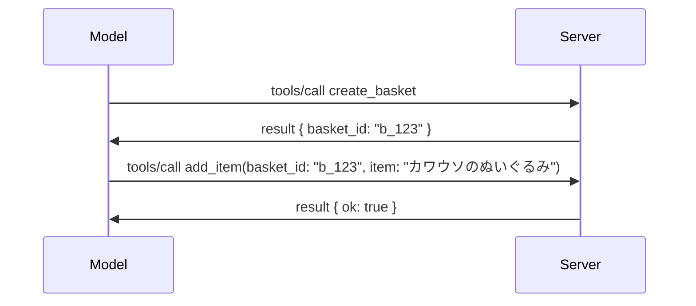

# MCPで何が変わるのか: 2026-07-28 リリース候補版

> **状況:** リリース候補版。`2026-07-28` 仕様は執筆時点で確定していません。2026年5月21日に発表され、2026年7月28日に出荷予定です。このレッスンの内容はすべてリリース候補版に基づいており、ビルド前には[ドラフト仕様](https://modelcontextprotocol.io/specification/draft)及びその[変更履歴](https://modelcontextprotocol.io/specification/draft/changelog)で最新状況を必ず確認してください。その他のカリキュラムは現在の安定版である<strong>MCP仕様 2025-11-25</strong>に基づいており、`2026-07-28` が出荷されたら更新されます。

## 概要

`2026-07-28` はMCPの最大の改訂版です。6つの仕様拡張提案（SEPs）がプロトコルレベルのセッションを廃止し、MCPをトランスポート層でステートレス化、拡張機能を一級のバージョン管理された仕組みとし、このカリキュラムで以前に学習した（Roots、Sampling、Logging）機能は新しいライフサイクルポリシーにより非推奨となります。このレッスンでは何が変わるのか、それがなぜ重要か、そして `2025-11-25` に対して書かれたコードがどう影響されるかをまとめます。

出典: [The 2026-07-28 MCP Specification Release Candidate](https://blog.modelcontextprotocol.io/posts/2026-07-28-release-candidate/)（Model Context Protocol ブログ、David Soria Parra と Den Delimarsky）。

## 学習目標

このレッスンを終えると、あなたは次のことができるようになります:

- MCPがステートレスなプロトコルコアに移行する理由と、それが水平方向のスケール展開においてどんな問題を解決するのか説明できる。
- `initialize`/`initialized` ハンドシェイクと `Mcp-Session-Id` ヘッダーがどのように置き換わるか説明できる。
- 新しい `Mcp-Method` と `Mcp-Name` ヘッダー、および `ttlMs`/`cacheScope` キャッシュメタデータを識別できる。
- Extensionsフレームワークと、このリリースで導入される2つの拡張、MCP AppsとTasksを認識できる。
- OAuth 2.0 / OIDCの整合性を強化する6つの認可SEPを一覧できる。
- どのコア機能（Roots、Sampling、Logging）が現在非推奨になったかと、その実際の意味を説明できる。
- ツールの `inputSchema`/`outputSchema` に対するFull JSON Schema 2020-12変更を説明できる。

## ステートレスなプロトコル

主な変更点: MCPはプロトコル層でステートレスになります。

### 以前（2025-11-25）: セッションは1つのサーバーインスタンスに縛られる

Streamable HTTPでツールを呼び出すには `initialize` ハンドシェイクで始まります。サーバーは `Mcp-Session-Id` ヘッダーを返し、それ以降のすべてのリクエストにこのヘッダーを付与しなければなりません。

```http
POST /mcp HTTP/1.1
Mcp-Session-Id: 1868a90c-3a3f-4f5b
Content-Type: application/json

{"jsonrpc":"2.0","id":2,"method":"tools/call",
 "params":{"name":"search","arguments":{"q":"otters"}}}
```

セッションは発行したサーバーインスタンスに結びつくため、水平方向にスケールした配置ではロードバランサーのスティッキー・ルーティングとインスタンス間の共有セッションストアが必要です。

### 以降（2026-07-28）: すべてのリクエストが自己完結型

```http
POST /mcp HTTP/1.1
MCP-Protocol-Version: 2026-07-28
Mcp-Method: tools/call
Mcp-Name: search
Content-Type: application/json

{"jsonrpc":"2.0","id":1,"method":"tools/call",
 "params":{"name":"search","arguments":{"q":"otters"},
           "_meta":{"io.modelcontextprotocol/clientInfo":{"name":"my-app","version":"1.0"}}}}
```

どのサーバーインスタンスでもこのリクエストを処理できます。主な変更点:

- **`initialize`/`initialized` ハンドシェイクが削除** ([SEP-2575](https://github.com/modelcontextprotocol/modelcontextprotocol/pull/2575))。プロトコルバージョン、クライアント情報、クライアント機能はすべてリクエストの `_meta` に移動し、新しい `server/discover` メソッドでクライアントが先にサーバー機能を取得できるようになりました。
- **`Mcp-Session-Id` ヘッダーとプロトコルレベルのセッションが削除** ([SEP-2567](https://github.com/modelcontextprotocol/modelcontextprotocol/pull/2567))。プロトコル層でスティッキー・ルーティングや共有セッションストアは不要になります。

### ステートレスなプロトコル、ステートフルなアプリケーション

プロトコルレベルのセッションがなくなってもサーバーがステートフルであることは可能です。推奨パターンはHTTP APIで昔から使われているものと同じで、一つのツール呼び出しで明示的なハンドル（例: `basket_id`、`browser_id`）を発行し、モデルが以降の呼び出しでそのハンドルを普通の引数として渡す形です。



これにより状態をトランスポートメタデータに隠すのではなくモデルに可視化し、任意のサーバーインスタンスが任意の呼び出しを処理できるようになります。

### サーバーからクライアントへのリクエスト、再構成

ステートレスプロトコルでも、サーバーがクライアントに途中で何かを求める（例: エリシテーションプロンプトの提示）方法は必要です。

- <strong>サーバー起動リクエストはサーバーがクライアントリクエストを処理中のみ発行可能</strong> ([SEP-2260](https://github.com/modelcontextprotocol/modelcontextprotocol/pull/2260)) — 以前は推奨だったが現在は必須。ユーザーは突然プロンプトを受けません。
- <strong>マルチラウンドトリップリクエスト</strong> ([SEP-2322](https://github.com/modelcontextprotocol/modelcontextprotocol/pull/2322)) がSSEストリームの保持に代わるものになりました。代わりにサーバーは `InputRequiredResult` を返します:

  ```json
  {
    "resultType": "inputRequired",
    "inputRequests": {
      "confirm": {
        "type": "elicitation",
        "message": "Delete 3 files?",
        "schema": { "type": "boolean" }
      }
    },
    "requestState": "eyJzdGVwIjoxLCJmaWxlcyI6WyJhIiwiYiIsImMiXX0="
  }
  ```

  クライアントは回答を集め、`inputResponses` とエコーバックされた `requestState` を使って元の呼び出しを再発行します。ペイロードに必要な情報がすべて入っているので任意のサーバーインスタンスでリトライ可能です。

### ルーティング可能、キャッシュ可能、トレース可能

ステートレスなトラフィックを運用しやすくするための3つの小さな変更:

- **`Mcp-Method` と `Mcp-Name` ヘッダーはStreamable HTTPで必須** ([SEP-2243](https://github.com/modelcontextprotocol/modelcontextprotocol/pull/2243))。ロードバランサーやゲートウェイ、レートリミッターはJSONボディを解析せずに操作をルーティング可能。ヘッダーとボディの不整合は拒否されます。
- **`tools/list` とリソース読み取り結果に `ttlMs` と `cacheScope` を付与** ([SEP-2549](https://github.com/modelcontextprotocol/modelcontextprotocol/pull/2549))。HTTPの `Cache-Control` を模倣。クライアントは結果の鮮度や利用者間共有の安全性を、長期間持続するSSEストリームなしに理解可能。
- **`_meta` 中でW3C Trace Contextの伝播を文書化** ([SEP-414](https://github.com/modelcontextprotocol/modelcontextprotocol/pull/414))。`traceparent`、`tracestate`、`baggage` のキー名を修正。クライアントSDK、MCPサーバー、下流システムを通じた分散トレースが [OpenTelemetry](https://opentelemetry.io/) 互換バックエンドで追跡可能に。

## 拡張機能が一級へ

拡張機能は `2025-11-25` で非公式に存在していましたが、[SEP-2133](https://github.com/modelcontextprotocol/modelcontextprotocol/pull/2133) で正式化されました:

- 拡張は逆DNSのIDで識別されます。
- クライアントとサーバーの機能マップの `extensions` で交渉されます。
- 拡張は独自の `ext-*` リポジトリに存在し、委譲されたメンテナが管理しコア仕様とは独立してバージョン管理されます。
- SEPプロセスに新しい拡張トラックが設けられ、試験的から正式への経路を提供します。

このリリースで二つの公式拡張が搭載されます。

### MCP Apps: サーバーレンダリングのユーザーインターフェイス

[MCP Apps](https://blog.modelcontextprotocol.io/posts/2026-01-26-mcp-apps/) ([SEP-1865](https://github.com/modelcontextprotocol/modelcontextprotocol/pull/1865)) は、サーバーがホストでサンドボックス化されたiframeにレンダリングされる対話型HTMLインターフェイスを送出できる機能です。ツールはUIテンプレートを事前宣言し、ホストが事前取得、キャッシュ、セキュリティレビューできるようにします。これの基本はすでに [レッスン15: MCP Apps](../03-GettingStarted/15-mcp-apps/README.md) で学んでいて、ExtensionsフレームワークのもとMCP Appsは試験的コア機能ではなく正式な拡張になりました。

### Tasksは拡張に昇格

Tasksは `2025-11-25` で試験的コア機能として出荷されましたが、実運用での使用によりリデザインが必要と判明し、正しい場所は拡張機能と判断されました: [Tasks拡張](https://github.com/modelcontextprotocol/modelcontextprotocol/pull/2663) はステートレスモデルに合わせてライフサイクルを再構築します。サーバーは `tools/call` にタスクハンドルを返し、クライアントは `tasks/get`、`tasks/update`、`tasks/cancel` で進行させます。タスク作成はサーバー主導で、クライアントは拡張を宣言し、サーバーが呼び出しをタスクとして動かすか決定します。`tasks/list` はセッションなしで安全にスコープできないため完全に廃止されました。

> **移行メモ:** `2025-11-25` の試験的Tasks APIを実装している場合は、新しい拡張ライフサイクルに移行が必要です。下位互換はありません。

## 認可の強化

6つのSEPが [認可仕様](https://modelcontextprotocol.io/specification/draft/basic/authorization) を強化し、実際のOAuth 2.0 / OpenID Connect運用により近づけます:

| SEP | 変更内容 |
|---|---|
| [SEP-2468](https://github.com/modelcontextprotocol/modelcontextprotocol/pull/2468) | クライアントは[ RFC 9207](https://www.rfc-editor.org/rfc/rfc9207)に従い、認可レスポンスの`iss` パラメータを検証する必要があります。これによりMCPの単一クライアント多サーバーモデルで一般的な混合攻撃を緩和します。将来のバージョンでは `iss` が欠落するレスポンスは拒否される予定です。 |
| [SEP-837](https://github.com/modelcontextprotocol/modelcontextprotocol/pull/837) | クライアントはDynamic Client Registration中にOpenID Connectの `application_type` を宣言し、認可サーバーのデスクトップ/CLIクライアントのデフォルト `"web"` 判断やlocalhostリダイレクトURI拒否を回避します。 |
| [SEP-2352](https://github.com/modelcontextprotocol/modelcontextprotocol/pull/2352) | クライアントは登録済み認証情報を発行元の認可サーバーの `issuer` と結び付け、リソースが認可サーバー間で移動した場合は再登録します。 |
| [SEP-2207](https://github.com/modelcontextprotocol/modelcontextprotocol/pull/2207) | OpenID Connectスタイルの認可サーバーからリフレッシュトークンをリクエストする方法を文書化します。 |
| [SEP-2350](https://github.com/modelcontextprotocol/modelcontextprotocol/pull/2350) | ステップアップ認可中のスコープ累積について明確化します。 |
| [SEP-2351](https://github.com/modelcontextprotocol/modelcontextprotocol/pull/2351) | `.well-known` 発見サフィックスについて明確化します。 |

もし今日MCP用の認可サーバーを構築しているなら、今すぐ認可レスポンスに `iss` を含め始めてください — 現在の認可ガイドラインは [02-Security](../02-Security/README.md) を参照してください。

## Roots、Sampling、Logging は非推奨

新しい [機能ライフサイクルポリシー](https://github.com/modelcontextprotocol/modelcontextprotocol/pull/2577) ([SEP-2577](https://github.com/modelcontextprotocol/modelcontextprotocol/pull/2577)) により、[Core Concepts](./README.md#roots) で学習した3つのクライアントの基本プリミティブが <strong>非推奨</strong> になりました:

| 機能 | 推奨代替 |
|---|---|
| Roots | ツールパラメータ、リソースURI、またはサーバー設定 |
| Sampling | LLMプロバイダーAPIとの直接統合 |
| Logging | stdioトランスポートには `stderr`、構造化観測にはOpenTelemetry |

これらは <strong>注釈のみの非推奨</strong> であり、メソッド、型、機能フラグはこのリリースおよび発行から1年以内の仕様バージョンでは動作し続けます。完全削除はライフサイクルポリシーに基づく別のSEPが必要なので、今日の [Sampling](../03-GettingStarted/14-sampling/README.md) のサンプルは壊れませんが、新サーバーは上記代替パターンを優先すべきです。

## ツール用のFull JSON Schema 2020-12

ツールの `inputSchema` と `outputSchema` は完全な[JSON Schema 2020-12](https://json-schema.org/draft/2020-12)に引き上げられました([SEP-2106](https://github.com/modelcontextprotocol/modelcontextprotocol/pull/2106)):

- 入力スキーマは `type: "object"` のルート制約を維持しますが、現在は合成 (`oneOf`、`anyOf`、`allOf`)、条件付き、参照 (`$ref`、`$defs`) が可能です。
- 出力スキーマは制限なしで、`structuredContent` はオブジェクトだけでなく任意のJSON値が可能になりました。
- 実装は外部の `$ref` URI を自動解決してはならず、スキーマの深さと検証時間を制限すべきです（サーバー側検証時のサービス拒否対策）。

別途、リソースが見つからないエラーコードはMCP独自の `-32002` から JSON-RPC標準の `-32602`（Invalid Params）に変更されました([SEP-2164](https://github.com/modelcontextprotocol/modelcontextprotocol/pull/2164))。クライアントが文字列 `-32002` にマッチしている場合は更新が必要です。

## 今後のプロトコル進化

このリリースは破壊的変更を含みますが、MCPメンテナはこれを今後の標準とは考えていません。繰り返しを防止するため3つのガバナンスSEPが策定されました:

- <strong>機能ライフサイクルポリシー</strong> は、すべての機能に「Active → Deprecated → Removed」の経路を提供し、非推奨から削除まで最低12ヶ月の期間を設けます。
- **Extensionsフレームワーク** は、新機能をオプトインの拡張として出荷し、正式化までそこで安定化させる道筋を提供します。

- スタンダーズトラックのSEPは、対応するシナリオが[適合性スイート](https://github.com/modelcontextprotocol/conformance)（[SEP-2484](https://github.com/modelcontextprotocol/modelcontextprotocol/pull/2484)）に収まるまで最終ステータスに到達できません。これは[SDKティアシステム](https://github.com/modelcontextprotocol/modelcontextprotocol/pull/1777)が公式SDKを評価するのと同じスイートです。

## リリースタイムラインと検証

- リリース候補版は2026年5月21日に固定されました。
- 最終仕様は2026年7月28日に予定されています。
- この両者の間の10週間の期間に、SDKの保守者とクライアントの実装者は変更を実際のワークロードで検証できます。[SDKティアシステム](https://modelcontextprotocol.io/docs/sdk)のもとでTier 1 SDKはこの期間内にサポートを出荷することが期待されています。
- 変更の全セットは、[ドラフト仕様](https://modelcontextprotocol.io/specification/draft)とその[変更履歴](https://modelcontextprotocol.io/specification/draft/changelog)で追跡してください。

## このカリキュラムにとっての意味

これまで本コースで学んできたすべては<strong>2025-11-25</strong>を対象としており、`2026-07-28`がリリースされるまで現在の安定仕様として残ります。具体的には：

- **セッションと`initialize`ハンドシェイク**（[コアコンセプト](./README.md) と [レッスン6: HTTPストリーミング](../03-GettingStarted/06-http-streaming/README.md)で扱われています）は引き続き現在の文書通りに動作しますが、`2026-07-28`対応SDKにアップグレードすると前述のステートレスリクエストモデルに置き換えられることが予想されます。
- <strong>サンプリングとルーツ</strong>（これも[コアコンセプト](./README.md)で扱われています）は完全に機能しますが廃止予定です。新しい設計では上記の置き換えパターンを推奨します。
- <strong>実験的なTasks機能</strong>を使っていた場合は、Tasks拡張の新しいライフサイクルに移行が必要です。
- **MCPアプリ**（[レッスン15](../03-GettingStarted/15-mcp-apps/README.md)）は実際には影響を受けず、単に正式なExtensionsフレームワークの下に移動します。

## 追加リソース

- [2026-07-28 MCP仕様リリース候補版（ブログ記事）](https://blog.modelcontextprotocol.io/posts/2026-07-28-release-candidate/)
- [MCPトランスポートの未来](https://blog.modelcontextprotocol.io/posts/2025-12-19-mcp-transport-future/)
- [MCPドラフト仕様](https://modelcontextprotocol.io/specification/draft)
- [MCPドラフト変更履歴](https://modelcontextprotocol.io/specification/draft/changelog)
- [SEPガイドライン](https://modelcontextprotocol.io/community/sep-guidelines)
- [MCP SDKティアシステム](https://modelcontextprotocol.io/docs/sdk)

## 次のステップ

[コアコンセプト](./README.md)に戻るか、[セキュリティ](../02-Security/README.md)に進んで、今日の`2025-11-25`のガイダンスが今後どう変わるかを確認してください。

---

<!-- CO-OP TRANSLATOR DISCLAIMER START -->
**免責事項**：
本書類は AI 翻訳サービス [Co-op Translator](https://github.com/Azure/co-op-translator) を使用して翻訳されています。正確性を期していますが、自動翻訳には誤りや不正確な部分が含まれる可能性があることをご承知おきください。原文の原語版が正式な情報源とみなされるべきです。重要な情報については、専門の人間による翻訳を推奨します。本翻訳の利用により生じたいかなる誤解や解釈違いについても、当方は責任を負いかねます。
<!-- CO-OP TRANSLATOR DISCLAIMER END -->