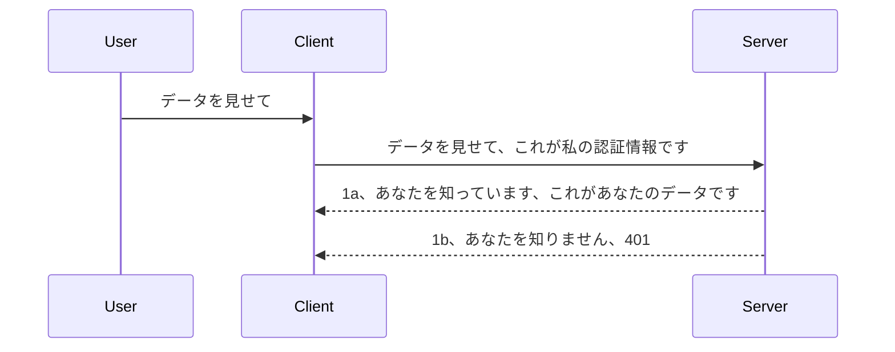

# シンプル認証

MCP SDKはOAuth 2.1の使用をサポートしていますが、正直なところこれは認証サーバー、リソースサーバー、資格情報の送信、コードの取得、コードのベアラートークンへの交換、そして最終的にリソースデータを取得するまでのかなり複雑なプロセスです。OAuthに慣れていない場合は（実装するのに素晴らしい方法ですが）、まず基本的な認証レベルから始めて、徐々により良いセキュリティを構築するのが良いでしょう。この章は高度な認証に向けて段階的に構築するために存在しています。

## 認証とは何か？

認証はauthentication（認証）とauthorization（認可）の略です。私たちは二つのことを行う必要があります：

- **認証（Authentication）** は、人が私たちの家に入ることを許可するかどうかを判断するプロセスであり、つまり「ここにいる」権利、つまりMCPサーバー機能が存在するリソースサーバーへのアクセス権があるかどうかを確認することです。
- **認可（Authorization）** は、ユーザーが要求している特定のリソース（例えば注文や製品など）にアクセスできるかどうか、または別の例としてコンテンツの読み取りは許可されているが削除は禁止されているかどうかを判断するプロセスです。

## 資格情報：システムに自分が誰かを伝える方法

ほとんどのウェブ開発者は、通常、認証のためにサーバーに資格情報を提供することを考え始めます。この資格情報は通常、ユーザー名とパスワードをbase64エンコードしたものか、特定のユーザーを一意に識別するAPIキーです。

これは「Authorization」というヘッダーを通じて次のように送信されます：

```json
{ "Authorization": "secret123" }
```

これは一般にベーシック認証と呼ばれます。全体の流れは以下のように動作します：



フローの仕組みが理解できたので、これをどのように実装するか見てみましょう。ほとんどのウェブサーバーにはミドルウェアという概念があり、これはリクエストの一部として実行されるコードで、資格情報を検証し、有効であればリクエストを通過させます。有効な資格情報がなければ認証エラーとなります。実装方法を見てみましょう：

**Python**

```python
class AuthMiddleware(BaseHTTPMiddleware):
    async def dispatch(self, request, call_next):

        has_header = request.headers.get("Authorization")
        if not has_header:
            print("-> Missing Authorization header!")
            return Response(status_code=401, content="Unauthorized")

        if not valid_token(has_header):
            print("-> Invalid token!")
            return Response(status_code=403, content="Forbidden")

        print("Valid token, proceeding...")
       
        response = await call_next(request)
        # 任意のカスタマーヘッダーを追加するか、レスポンスを何らかの方法で変更します
        return response


starlette_app.add_middleware(CustomHeaderMiddleware)
```

ここでは：

- `AuthMiddleware`というミドルウェアを作成し、その`dispatch`メソッドはウェブサーバーによって呼び出されます。
- ミドルウェアをウェブサーバーに追加しました：

    ```python
    starlette_app.add_middleware(AuthMiddleware)
    ```

- `Authorization`ヘッダーが存在し、送信された秘密が有効かどうかをチェックする検証ロジックを書きました：

    ```python
    has_header = request.headers.get("Authorization")
    if not has_header:
        print("-> Missing Authorization header!")
        return Response(status_code=401, content="Unauthorized")

    if not valid_token(has_header):
        print("-> Invalid token!")
        return Response(status_code=403, content="Forbidden")
    ```

    秘密が存在し有効であれば、`call_next`を呼び出してリクエストを通過させ、レスポンスを返します。

    ```python
    response = await call_next(request)
    # 任意のカスタマーヘッダーを追加するか、レスポンスに何らかの変更を加える
    return response
    ```

仕組みとしては、クライアントからウェブリクエストがサーバーに送られるとミドルウェアが呼び出され、その実装によりリクエストを通過させるか、クライアントに進行不可を示すエラーを返します。

**TypeScript**

人気のあるフレームワークExpressでミドルウェアを作成し、リクエストがMCPサーバーに到達する前にそれをインターセプトします。コードは以下の通りです：

```typescript
function isValid(secret) {
    return secret === "secret123";
}

app.use((req, res, next) => {
    // 1. Authorizationヘッダーは存在しますか？
    if(!req.headers["Authorization"]) {
        res.status(401).send('Unauthorized');
    }
    
    let token = req.headers["Authorization"];

    // 2. 有効性を確認します。
    if(!isValid(token)) {
        res.status(403).send('Forbidden');
    }

   
    console.log('Middleware executed');
    // 3. リクエストをリクエストパイプラインの次のステップに渡します。
    next();
});
```

このコードでは：

1. まず`Authorization`ヘッダーが存在するかを確認し、なければ401エラーを返します。
2. 資格情報／トークンの妥当性を検証し、不正であれば403エラーを返します。
3. 最後に、リクエストパイプラインにリクエストを通過させ、要求されたリソースを返します。

## 演習：認証を実装する

知識を使って実装してみましょう。計画は以下の通りです：

サーバー

- ウェブサーバーとMCPインスタンスを作成する。
- サーバー用のミドルウェアを実装する。

クライアント

- ヘッダー経由で資格情報付きのウェブリクエストを送る。

### -1- ウェブサーバーとMCPインスタンスを作成する

> **将来の展望：** 下記のTypeScript例は、<strong>MCP仕様 2025-11-25</strong>に基づき`mcp-session-id`でキー付けされた`transports`マップにHTTPトランスポートを追跡しています。`2026-07-28`リリース候補では`initialize`ハンドシェイクとセッションIDを完全に廃止し、状態を持たないセルフコンテインドリクエストに移行するため、このセッション毎のトランスポートマップはなくなります。[MCPの変更点：2026-07-28リリース候補](../../01-CoreConcepts/mcp-2026-07-28-release-candidate.md)を参照してください。

最初のステップとして、ウェブサーバーインスタンスとMCPサーバーを作成する必要があります。

**Python**

ここではMCPサーバーインスタンスを作成し、starletteウェブアプリを作成してuvicornでホストします。

```python
# MCPサーバーを作成しています

app = FastMCP(
    name="MCP Resource Server",
    instructions="Resource Server that validates tokens via Authorization Server introspection",
    host=settings["host"],
    port=settings["port"],
    debug=True
)

# starletteウェブアプリを作成しています
starlette_app = app.streamable_http_app()

# uvicorn経由でアプリを提供しています
async def run(starlette_app):
    import uvicorn
    config = uvicorn.Config(
            starlette_app,
            host=app.settings.host,
            port=app.settings.port,
            log_level=app.settings.log_level.lower(),
        )
    server = uvicorn.Server(config)
    await server.serve()

run(starlette_app)
```

このコードでは：

- MCPサーバーを作成します。
- MCPサーバーからstarletteウェブアプリ`app.streamable_http_app()`を構成します。
- uvicornでウェブアプリのホスティングとサービングをします`server.serve()`。

**TypeScript**

ここではMCPサーバーインスタンスを作成します。

```typescript
const server = new McpServer({
      name: "example-server",
      version: "1.0.0"
    });

    // ... サーバーのリソース、ツール、およびプロンプトを設定します ...
```

MCPサーバーの作成はPOST /mcpルート内で行う必要があり、上記コードを以下のように移動します：

```typescript
import express from "express";
import { randomUUID } from "node:crypto";
import { McpServer } from "@modelcontextprotocol/sdk/server/mcp.js";
import { StreamableHTTPServerTransport } from "@modelcontextprotocol/sdk/server/streamableHttp.js";
import { isInitializeRequest } from "@modelcontextprotocol/sdk/types.js"

const app = express();
app.use(express.json());

// セッションIDごとにトランスポートを保存するマップ
const transports: { [sessionId: string]: StreamableHTTPServerTransport } = {};

// クライアントからサーバーへの通信のためのPOSTリクエストを処理する
app.post('/mcp', async (req, res) => {
  // 既存のセッションIDをチェックする
  const sessionId = req.headers['mcp-session-id'] as string | undefined;
  let transport: StreamableHTTPServerTransport;

  if (sessionId && transports[sessionId]) {
    // 既存のトランスポートを再利用する
    transport = transports[sessionId];
  } else if (!sessionId && isInitializeRequest(req.body)) {
    // 新規初期化リクエスト
    transport = new StreamableHTTPServerTransport({
      sessionIdGenerator: () => randomUUID(),
      onsessioninitialized: (sessionId) => {
        // セッションIDでトランスポートを保存する
        transports[sessionId] = transport;
      },
      // DNSリバインディング保護は後方互換性のためデフォルトで無効になっています。このサーバーを
      // ローカルで実行している場合は、次の設定を必ず行ってください：
      // enableDnsRebindingProtection: true,
      // allowedHosts: ['127.0.0.1'],
    });

    // 閉じられたときにトランスポートをクリーンアップする
    transport.onclose = () => {
      if (transport.sessionId) {
        delete transports[transport.sessionId];
      }
    };
    const server = new McpServer({
      name: "example-server",
      version: "1.0.0"
    });

    // ...サーバーのリソース、ツール、プロンプトの設定...

    // MCPサーバーに接続する
    await server.connect(transport);
  } else {
    // 無効なリクエスト
    res.status(400).json({
      jsonrpc: '2.0',
      error: {
        code: -32000,
        message: 'Bad Request: No valid session ID provided',
      },
      id: null,
    });
    return;
  }

  // リクエストを処理する
  await transport.handleRequest(req, res, req.body);
});

// GETおよびDELETEリクエストの再利用可能なハンドラー
const handleSessionRequest = async (req: express.Request, res: express.Response) => {
  const sessionId = req.headers['mcp-session-id'] as string | undefined;
  if (!sessionId || !transports[sessionId]) {
    res.status(400).send('Invalid or missing session ID');
    return;
  }
  
  const transport = transports[sessionId];
  await transport.handleRequest(req, res);
};

// SSEを介したサーバーからクライアントへの通知のためのGETリクエストを処理する
app.get('/mcp', handleSessionRequest);

// セッション終了のためのDELETEリクエストを処理する
app.delete('/mcp', handleSessionRequest);

app.listen(3000);
```

これでMCPサーバーの作成が`app.post("/mcp")`内に移動されたことがわかります。

次のステップ、ミドルウェアを作成して受信資格情報を検証する段階に進みましょう。

### -2- サーバー用ミドルウェアを実装する

次はミドルウェアの作成です。ここでは`Authorization`ヘッダー内の資格情報を探し、検証するミドルウェアを作成します。受け入れ可能ならリクエストは進行し、要求された処理（ツール一覧表示、リソース読取、またはその他クライアントのMCP機能）を行います。

**Python**

ミドルウェアを作るには`BaseHTTPMiddleware`を継承するクラスを作成します。ポイントは二つあります：

- `request` でヘッダー情報を取得します。
- `call_next` はクライアントが受け付ける資格情報を持っていれば呼ぶコールバックです。

まず、`Authorization`ヘッダーが欠落している場合の処理を行います：

```python
has_header = request.headers.get("Authorization")

# ヘッダーが存在しない場合は401で失敗し、それ以外は続行します。
if not has_header:
    print("-> Missing Authorization header!")
    return Response(status_code=401, content="Unauthorized")
```

ここではクライアントの認証失敗として401 Unauthorizedメッセージを返します。

次に資格情報が送信された場合は、その有効性を以下のようにチェックします：

```python
 if not valid_token(has_header):
    print("-> Invalid token!")
    return Response(status_code=403, content="Forbidden")
```

上記では403 Forbiddenメッセージを返しています。完全なミドルウェアを以下に示します：

```python
class AuthMiddleware(BaseHTTPMiddleware):
    async def dispatch(self, request, call_next):

        has_header = request.headers.get("Authorization")
        if not has_header:
            print("-> Missing Authorization header!")
            return Response(status_code=401, content="Unauthorized")

        if not valid_token(has_header):
            print("-> Invalid token!")
            return Response(status_code=403, content="Forbidden")

        print("Valid token, proceeding...")
        print(f"-> Received {request.method} {request.url}")
        response = await call_next(request)
        response.headers['Custom'] = 'Example'
        return response

```

素晴らしいですが、`valid_token`関数は？以下の通りです：

```python
# 本番環境では使用しないでください - 改善してください !!
def valid_token(token: str) -> bool:
    # "Bearer " プレフィックスを削除してください
    if token.startswith("Bearer "):
        token = token[7:]
        return token == "secret-token"
    return False
```

これは明らかに改善すべき部分です。

重要：このような秘密は絶対にコード内に直接置くべきではありません。比較用の値は理想的にはデータソースやIDプロバイダー（IDP）から取得し、可能であればIDPに検証させるべきです。

**TypeScript**

Expressで実装するには、ミドルウェア関数を受け取る`use`メソッドを呼び出す必要があります。

必要な処理は：

- リクエスト変数の`Authorization`プロパティで送信された資格情報を確認します。
- 資格情報の妥当性を確認し、そうであればリクエストを継続させ、クライアントのMCPリクエストが機能を実行できるようにします（ツール一覧表示、リソース読取など）。

ここではまず`Authorization`ヘッダーの存在をチェックし、なければリクエストを止めます：

```typescript
if(!req.headers["authorization"]) {
    res.status(401).send('Unauthorized');
    return;
}
```

ヘッダーが送信されていなければ401が返ります。

次に資格情報の有効性をチェックし、不正であればリクエストを止めますが、メッセージが少し異なります：

```typescript
if(!isValid(token)) {
    res.status(403).send('Forbidden');
    return;
} 
```

ここでは403エラーが返る点に注目してください。

完全なコードはこちらです：

```typescript
app.use((req, res, next) => {
    console.log('Request received:', req.method, req.url, req.headers);
    console.log('Headers:', req.headers["authorization"]);
    if(!req.headers["authorization"]) {
        res.status(401).send('Unauthorized');
        return;
    }
    
    let token = req.headers["authorization"];

    if(!isValid(token)) {
        res.status(403).send('Forbidden');
        return;
    }  

    console.log('Middleware executed');
    next();
});
```

クライアントが送信する資格情報を確認するミドルウェアを受け入れるウェブサーバーの設定をしましたが、クライアントはどうでしょうか？

### -3- 資格情報をヘッダー経由で送信する

クライアントがヘッダーに資格情報を含めていることを確実にしなければなりません。MCPクライアントを使うので、その方法を考えましょう。

**Python**

クライアントとしては、次のようにヘッダーに資格情報を渡す必要があります：

```python
# 値をハードコードしないでください。最低でも環境変数かより安全なストレージに保存してください
token = "secret-token"

async with streamablehttp_client(
        url = f"http://localhost:{port}/mcp",
        headers = {"Authorization": f"Bearer {token}"}
    ) as (
        read_stream,
        write_stream,
        session_callback,
    ):
        async with ClientSession(
            read_stream,
            write_stream
        ) as session:
            await session.initialize()
      
            # TODO、クライアントで実行したいこと、例：ツールの一覧表示、ツールの呼び出しなど
```

`headers`プロパティを` headers = {"Authorization": f"Bearer {token}"}`と設定しているのに注目してください。

**TypeScript**

これは二ステップで解決できます：

1. 認証情報を含む設定オブジェクトを作成。
2. 設定オブジェクトをトランスポートに渡す。

```typescript

// ここで示されているように値をハードコードしないでください。最小限として環境変数にして、開発モードではdotenvのようなものを使用してください。
let token = "secret123"

// クライアントのトランスポートオプションオブジェクトを定義する
let options: StreamableHTTPClientTransportOptions = {
  sessionId: sessionId,
  requestInit: {
    headers: {
      "Authorization": "secret123"
    }
  }
};

// オプションオブジェクトをトランスポートに渡す
async function main() {
   const transport = new StreamableHTTPClientTransport(
      new URL(serverUrl),
      options
   );
```

上記では`options`オブジェクトを作成し、`requestInit`プロパティにヘッダーを入れている様子がわかります。

重要：ここからどう改善するか？ 現状の実装は問題点があります。まず、資格情報をこのように渡すのは、最低限HTTPSがないと非常に危険です。それでも資格情報は盗まれる可能性があるため、トークンを簡単に無効化できるシステムや、どの地域からのアクセスか、リクエストが頻繁すぎないか（ボット的挙動）などの追加チェックが必要で、多くの懸念事項があります。

とはいえ、認証なしで誰でもAPIを呼べるわけにはいかない非常にシンプルなAPIでは、ここで示したのは良い出発点です。

そこで、セキュリティを強化するために、標準化された形式であるJSON Web Token（JWT、または「JOT」トークン）を使ってみましょう。

## JSON Webトークン（JWT）

シンプルな資格情報送信から改善を試みるわけですが、JWTを採用することによる即時の改善点は何でしょうか？

- <strong>セキュリティの向上</strong>。ベーシック認証ではユーザー名とパスワードをbase64エンコードして（またはAPIキーを）繰り返し送信するためリスクが高いです。JWTはユーザー名とパスワードを送信してトークンを取得し、それは期限付きで失効します。JWTはロール、スコープ、パーミッションによる細かいアクセス制御も容易にします。
- <strong>ステートレス性とスケーラビリティ</strong>。JWTは自己完結型でユーザー情報を全て含み、サーバー側にセッションを保存する必要がなくなります。トークンはローカルでも検証できます。
- <strong>相互運用性とフェデレーション</strong>。JWTはOpenID Connectの中心であり、Entra IDやGoogle Identity、Auth0などのよく知られたIDプロバイダーで使われています。シングルサインオンなど企業グレードの機能も可能にします。
- <strong>モジュール性と柔軟性</strong>。JWTはAzure API ManagementやNGINXなどのAPIゲートウェイでも使えます。ユーザー認証やサービス間通信のなりすまし・委任もサポートします。
- <strong>パフォーマンスとキャッシング</strong>。JWTはデコード後キャッシュできるため解析負荷が減ります。高トラフィックアプリでスループットを向上しインフラ負荷を軽減します。
- <strong>高度な機能</strong>。イントロスペクション（サーバーでの有効性確認）やリボケーション（トークン無効化）もサポートします。

これらの利点を踏まえ、実装を次のレベルに進める方法を見てみましょう。

## ベーシック認証からJWTへ

大まかに変更する必要があるのは：

- **JWTトークンを構築する**。クライアントからサーバーへ送信可能な状態にします。
- **JWTトークンを検証する**。有効ならクライアントにリソースを提供します。
- <strong>トークンの安全な保管</strong>。どのようにトークンを保存するか。
- <strong>ルートを保護する</strong>。ルートや特定のMCP機能を保護する必要があります。
- <strong>リフレッシュトークンを追加する</strong>。短命なトークンと、期限切れ時に新しいトークンを取得可能な長命リフレッシュトークンを作成します。リフレッシュ用エンドポイントやローテーション戦略も必要です。

### -1- JWTトークンを構築する

まず、JWTトークンは以下のパーツで構成されます：

- <strong>ヘッダー</strong>、使用アルゴリズムとトークンタイプ。
- <strong>ペイロード</strong>、例えばsub（トークンが表すユーザーやエンティティ。認証では通常ユーザーID）、exp（有効期限）、role（役割）などのクレーム。
- <strong>署名</strong>、秘密鍵やプライベートキーで署名されます。

これらを構築し、エンコードされたトークンを作ります。

**Python**

```python

import jwt
import jwt
from jwt.exceptions import ExpiredSignatureError, InvalidTokenError
import datetime

# JWTに署名するために使用される秘密鍵
secret_key = 'your-secret-key'

header = {
    "alg": "HS256",
    "typ": "JWT"
}

# ユーザー情報とそのクレームおよび有効期限
payload = {
    "sub": "1234567890",               # サブジェクト（ユーザーID）
    "name": "User Userson",                # カスタムクレーム
    "admin": True,                     # カスタムクレーム
    "iat": datetime.datetime.utcnow(),# 発行日時
    "exp": datetime.datetime.utcnow() + datetime.timedelta(hours=1)  # 有効期限
}

# それをエンコードする
encoded_jwt = jwt.encode(payload, secret_key, algorithm="HS256", headers=header)
```

上記コードでは：

- HS256アルゴリズムとJWTタイプを使ってヘッダーを定義しました。
- subまたはユーザーID、ユーザー名、役割、発行日時、期限切れ日時を含むペイロードを構築し、前述の期限付きトークンの要件を実装しました。

**TypeScript**

JWTトークン構築を助ける依存パッケージが必要です。

依存パッケージ

```sh

npm install jsonwebtoken
npm install --save-dev @types/jsonwebtoken
```

これが整ったら、ヘッダーとペイロードを作成し、それからエンコード済みトークンを生成します。

```typescript
import jwt from 'jsonwebtoken';

const secretKey = 'your-secret-key'; // 本番環境では環境変数を使用する

// ペイロードを定義する
const payload = {
  sub: '1234567890',
  name: 'User usersson',
  admin: true,
  iat: Math.floor(Date.now() / 1000), // 発行時刻
  exp: Math.floor(Date.now() / 1000) + 60 * 60 // 1時間で有効期限切れ
};

// ヘッダーを定義する（任意、jsonwebtokenがデフォルトを設定）
const header = {
  alg: 'HS256',
  typ: 'JWT'
};

// トークンを作成する
const token = jwt.sign(payload, secretKey, {
  algorithm: 'HS256',
  header: header
});

console.log('JWT:', token);
```

このトークンは：

HS256で署名されています
1時間有効です
sub、name、admin、iat、expなどのクレームが含まれます。

### -2- トークンを検証する

トークンを検証する必要があり、これはサーバー側で行ってクライアントから送られてくるものが有効か確認します。構造から有効期限まで多くのチェックを行い、ユーザーがシステムに存在するかなどの追加チェックも推奨されます。

トークンを検証するために、まずデコードして内容を読み、有効性をチェックします：

**Python**

```python

# JWTをデコードして検証する
try:
    decoded = jwt.decode(token, secret_key, algorithms=["HS256"])
    print("✅ Token is valid.")
    print("Decoded claims:")
    for key, value in decoded.items():
        print(f"  {key}: {value}")
except ExpiredSignatureError:
    print("❌ Token has expired.")
except InvalidTokenError as e:
    print(f"❌ Invalid token: {e}")

```


このコードでは、トークン、秘密鍵、および選択したアルゴリズムを入力として `jwt.decode` を呼び出しています。失敗した検証によりエラーが発生するため、try-catch 構造を使用していることに注意してください。

**TypeScript**

ここでは、解析可能なトークンのデコード済みバージョンを取得するために `jwt.verify` を呼び出す必要があります。この呼び出しが失敗した場合、トークンの構造が間違っているか、もはや有効でないことを意味します。

```typescript

try {
  const decoded = jwt.verify(token, secretKey);
  console.log('Decoded Payload:', decoded);
} catch (err) {
  console.error('Token verification failed:', err);
}
```

注意：前述のように、このトークンがシステム内のユーザーを指し示していることや、ユーザーが主張する権限を持っていることを確認するために追加のチェックを行うべきです。

次に、役割に基づくアクセス制御、すなわち RBAC について見てみましょう。

## 役割に基づくアクセス制御の追加

アイデアは、異なる役割に異なる権限があることを表現したいということです。例えば、管理者はすべてを実行でき、一般ユーザーは読み書きができ、ゲストは読み取りのみできると想定します。したがって、可能な権限レベルは以下の通りです：

- Admin.Write 
- User.Read
- Guest.Read

このような制御をミドルウェアで実装する方法を見てみましょう。ミドルウェアはルートごとに追加することも、すべてのルートに追加することも可能です。

**Python**

```python
from starlette.middleware.base import BaseHTTPMiddleware
from starlette.responses import JSONResponse
import jwt

# コード内に秘密を入れないでください。これはデモンストレーション用です。安全な場所から読み取ってください。
SECRET_KEY = "your-secret-key" # これを環境変数に入れてください
REQUIRED_PERMISSION = "User.Read"

class JWTPermissionMiddleware(BaseHTTPMiddleware):
    async def dispatch(self, request, call_next):
        auth_header = request.headers.get("Authorization")
        if not auth_header or not auth_header.startswith("Bearer "):
            return JSONResponse({"error": "Missing or invalid Authorization header"}, status_code=401)

        token = auth_header.split(" ")[1]
        try:
            decoded = jwt.decode(token, SECRET_KEY, algorithms=["HS256"])
        except jwt.ExpiredSignatureError:
            return JSONResponse({"error": "Token expired"}, status_code=401)
        except jwt.InvalidTokenError:
            return JSONResponse({"error": "Invalid token"}, status_code=401)

        permissions = decoded.get("permissions", [])
        if REQUIRED_PERMISSION not in permissions:
            return JSONResponse({"error": "Permission denied"}, status_code=403)

        request.state.user = decoded
        return await call_next(request)


```

次のようにミドルウェアを追加するいくつかの方法があります：

```python

# 代替案 1: starlette アプリを構築する際にミドルウェアを追加する
middleware = [
    Middleware(JWTPermissionMiddleware)
]

app = Starlette(routes=routes, middleware=middleware)

# 代替案 2: starlette アプリを構築した後にミドルウェアを追加する
starlette_app.add_middleware(JWTPermissionMiddleware)

# 代替案 3: ルートごとにミドルウェアを追加する
routes = [
    Route(
        "/mcp",
        endpoint=..., # ハンドラー
        middleware=[Middleware(JWTPermissionMiddleware)]
    )
]
```

**TypeScript**

`app.use` と、すべてのリクエストで実行されるミドルウェアを使用できます。

```typescript
app.use((req, res, next) => {
    console.log('Request received:', req.method, req.url, req.headers);
    console.log('Headers:', req.headers["authorization"]);

    // 1. 認証ヘッダーが送信されているか確認する

    if(!req.headers["authorization"]) {
        res.status(401).send('Unauthorized');
        return;
    }
    
    let token = req.headers["authorization"];

    // 2. トークンが有効か確認する
    if(!isValid(token)) {
        res.status(403).send('Forbidden');
        return;
    }  

    // 3. トークンのユーザーがシステムに存在するか確認する
    if(!isExistingUser(token)) {
        res.status(403).send('Forbidden');
        console.log("User does not exist");
        return;
    }
    console.log("User exists");

    // 4. トークンに正しい権限があるか検証する
    if(!hasScopes(token, ["User.Read"])){
        res.status(403).send('Forbidden - insufficient scopes');
    }

    console.log("User has required scopes");

    console.log('Middleware executed');
    next();
});

```

ミドルウェアで実施でき、また実施すべきことはたくさんあります。具体的には：

1. 認証ヘッダーが存在するかを確認する
2. トークンの有効性を確認する。`isValid` は JWT トークンの整合性と有効性をチェックする独自のメソッドです。
3. ユーザーがシステムに存在することを確認する必要があります。

   ```typescript
    // DB内のユーザー
   const users = [
     "user1",
     "User usersson",
   ]

   function isExistingUser(token) {
     let decodedToken = verifyToken(token);

     // TODO、ユーザーがDBに存在するか確認する
     return users.includes(decodedToken?.name || "");
   }
   ```

   上の例では、ごく単純な `users` リストを作成していますが、これは当然データベースにあるべきです。

4. さらに、トークンに適切な権限があるかどうかも確認するべきです。

   ```typescript
   if(!hasScopes(token, ["User.Read"])){
        res.status(403).send('Forbidden - insufficient scopes');
   }
   ```

   上記のミドルウェアのコードでは、トークンに User.Read 権限が含まれているかチェックし、なければ 403 エラーを返しています。以下に `hasScopes` ヘルパーメソッドを示します。

   ```typescript
   function hasScopes(scope: string, requiredScopes: string[]) {
     let decodedToken = verifyToken(scope);
    return requiredScopes.every(scope => decodedToken?.scopes.includes(scope));
  }
   ```

Have a think which additional checks you should be doing, but these are the absolute minimum of checks you should be doing.

Using Express as a web framework is a common choice. There are helpers library when you use JWT so you can write less code.

- `express-jwt`, helper library that provides a middleware that helps decode your token.
- `express-jwt-permissions`, this provides a middleware `guard` that helps check if a certain permission is on the token.

Here's what these libraries can look like when used:

```typescript
const express = require('express');
const jwt = require('express-jwt');
const guard = require('express-jwt-permissions')();

const app = express();
const secretKey = 'your-secret-key'; // put this in env variable

// Decode JWT and attach to req.user
app.use(jwt({ secret: secretKey, algorithms: ['HS256'] }));

// Check for User.Read permission
app.use(guard.check('User.Read'));

// multiple permissions
// app.use(guard.check(['User.Read', 'Admin.Access']));

app.get('/protected', (req, res) => {
  res.json({ message: `Welcome ${req.user.name}` });
});

// Error handler
app.use((err, req, res, next) => {
  if (err.code === 'permission_denied') {
    return res.status(403).send('Forbidden');
  }
  next(err);
});

```

ミドルウェアが認証と認可の両方に使えることを見てきましたが、MCPについてはどうでしょうか？認証の方法が変わるのか、次のセクションで見てみましょう。

### -3- MCPにRBACを追加する

これまでミドルウェアを通じてRBACを追加する方法を見てきましたが、MCPでは機能ごとのRBACを簡単に追加する方法がありません。ではどうするか？このように、クライアントが特定のツールを呼び出す権利を持っているかチェックするコードを追加するしかありません：

機能ごとのRBACを実現する方法はいくつかあります。例えば：

- 各ツール、リソース、プロンプトごとに権限レベルをチェックするコードを追加する。

   **python**

   ```python
   @tool()
   def delete_product(id: int):
      try:
          check_permissions(role="Admin.Write", request)
      catch:
        pass # クライアントの認証に失敗しました。認証エラーを発生させてください。
   ```

   **typescript**

   ```typescript
   server.registerTool(
    "delete-product",
    {
      title: Delete a product",
      description: "Deletes a product",
      inputSchema: { id: z.number() }
    },
    async ({ id }) => {
      
      try {
        checkPermissions("Admin.Write", request);
        // やること、idをproductServiceとリモートエントリーに送信すること
      } catch(Exception e) {
        console.log("Authorization error, you're not allowed");  
      }

      return {
        content: [{ type: "text", text: `Deletected product with id ${id}` }]
      };
    }
   );
   ```


- 高度なサーバーアプローチとリクエストハンドラーを使って、権限チェックを行う箇所を最小限にする。

   **Python**

   ```python
   
   tool_permission = {
      "create_product": ["User.Write", "Admin.Write"],
      "delete_product": ["Admin.Write"]
   }

   def has_permission(user_permissions, required_permissions) -> bool:
      # user_permissions: ユーザーが持っている権限のリスト
      # required_permissions: ツールに必要な権限のリスト
      return any(perm in user_permissions for perm in required_permissions)

   @server.call_tool()
   async def handle_call_tool(
     name: str, arguments: dict[str, str] | None
   ) -> list[types.TextContent]:
    # request.user.permissions はユーザーの権限リストであると仮定する
     user_permissions = request.user.permissions
     required_permissions = tool_permission.get(name, [])
     if not has_permission(user_permissions, required_permissions):
        # エラーを発生させる "ツール {name} を呼び出す権限がありません"
        raise Exception(f"You don't have permission to call tool {name}")
     # 続行してツールを呼び出す
     # ...
   ```   
   

   **TypeScript**

   ```typescript
   function hasPermission(userPermissions: string[], requiredPermissions: string[]): boolean {
       if (!Array.isArray(userPermissions) || !Array.isArray(requiredPermissions)) return false;
       // ユーザーに少なくとも1つの必要な権限がある場合はtrueを返します
       
       return requiredPermissions.some(perm => userPermissions.includes(perm));
   }
  
   server.setRequestHandler(CallToolRequestSchema, async (request) => {
      const { params: { name } } = request;
  
      let permissions = request.user.permissions;
  
      if (!hasPermission(permissions, toolPermissions[name])) {
         return new Error(`You don't have permission to call ${name}`);
      }
  
      // 続けてください..
   });
   ```

   注意：上記コードをシンプルにするためには、ミドルウェアがデコード済みトークンをリクエストの user プロパティに割り当てる必要があります。

### まとめ

ここまでで、一般的なRBACの追加方法とMCP向けの手法を説明しました。今回学んだことを理解するために、自分でセキュリティを実装してみましょう。

## 課題1：基本認証を使ってmcpサーバーとmcpクライアントを構築する

ここでは、ヘッダーを通じて認証情報を送信する方法を学んだことを活かします。

## 解答例1

[Solution 1](./code/basic/README.md)

## 課題2：課題1の解決策をJWTを使用してアップグレードする

最初の解決策を取り、今回はそれを改善しましょう。

ベーシック認証の代わりにJWTを使用します。

## 解答例2

[Solution 2](./solution/jwt-solution/README.md)

## チャレンジ

「MCPにRBACを追加する」セクションで説明したツールごとのRBACを追加してください。

## まとめ

この章で、セキュリティなしから基本的なセキュリティ、JWT、それをMCPに追加する方法まで多くを学習したことでしょう。

独自のJWTによって堅固な基盤は築きましたが、スケールしていくなかで標準ベースのアイデンティティモデルに移行しています。EntraやKeycloakのようなIdPを採用すれば、トークンの発行、検証、ライフサイクル管理を信頼できるプラットフォームに任せられ、アプリのロジックとユーザー体験に集中できます。

そのためのより[高度なEntraに関する章](../../05-AdvancedTopics/mcp-security-entra/README.md)もあります。

## 次に進むこと

- 次へ：[MCPホストの設定](../12-mcp-hosts/README.md)

---

<!-- CO-OP TRANSLATOR DISCLAIMER START -->
**免責事項**：
本書類は AI 翻訳サービス [Co-op Translator](https://github.com/Azure/co-op-translator) を使用して翻訳されています。正確性を期していますが、自動翻訳には誤りや不正確な部分が含まれる可能性があることをご承知おきください。原文の原語版が正式な情報源とみなされるべきです。重要な情報については、専門の人間による翻訳を推奨します。本翻訳の利用により生じたいかなる誤解や解釈違いについても、当方は責任を負いかねます。
<!-- CO-OP TRANSLATOR DISCLAIMER END -->