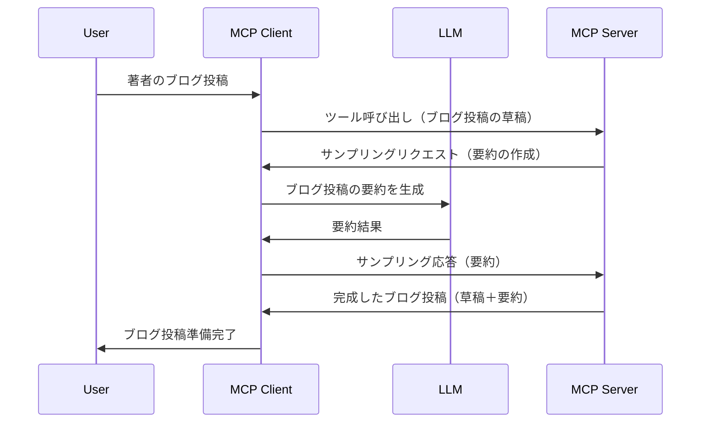

# サンプリング - 機能をクライアントに委任する

> **非推奨通知:** `2026-07-28` MCP仕様リリース候補では、サンプリングはLLMプロバイダーAPIと直接統合する方式に取って代わられ、非推奨となります。`2025-11-25`では引き続き動作し、正式な非推奨後も少なくとも1年間は使用可能なので、このレッスンの内容は有効ですが、新しいサーバーデザインでは置き換えパターンを検討してください。詳細は [What's Changing in MCP: The 2026-07-28 Release Candidate](../../01-CoreConcepts/mcp-2026-07-28-release-candidate.md) を参照してください。

時にはMCPクライアントとMCPサーバーが協力して共通の目的を達成する必要があります。サーバーがクライアント上のLLMの助けを必要とする場合があります。このような状況では、サンプリングを使用するべきです。

サンプリングのユースケースと、それを使ったソリューションの構築方法を見ていきましょう。

## 概要

このレッスンでは、サンプリングをいつどこで使うか、そしてそれをどのように設定するかに焦点を当てます。

## 学習目標

この章で学ぶこと:

- サンプリングとは何か、いつ使うべきかを説明する。
- MCPでサンプリングを設定する方法を示す。
- サンプリングの実際の例を提供する。

## サンプリングとは何か、なぜ使うのか？

サンプリングは次のように動作する高度な機能です:



### サンプリングリクエスト

さて、信頼できるシナリオの大まかな見解が得られたので、サーバーがクライアントに送信するサンプリングリクエストについて説明しましょう。JSON-RPC形式では以下のようになります:

```json
{
  "jsonrpc": "2.0",
  "id": 1,
  "method": "sampling/createMessage",
  "params": {
    "messages": [
      {
        "role": "user",
        "content": {
          "type": "text",
          "text": "Create a blog post summary of the following blog post: <BLOG POST>"
        }
      }
    ],
    "modelPreferences": {
      "hints": [
        {
          "name": "claude-3-sonnet"
        }
      ],
      "intelligencePriority": 0.8,
      "speedPriority": 0.5
    },
    "systemPrompt": "You are a helpful assistant.",
    "maxTokens": 100
  }
}
```

ここで注目すべき点がいくつかあります:

- content -> text のプロンプトは、LLMにブログ投稿の内容を要約する指示です。

- **modelPreferences**。これは単なる推奨で、LLMの設定に関する提案です。ユーザーはこれらの推奨に従うか変更するか選べます。この例ではモデルの選択、速度と知能の優先度を推奨しています。
- **systemPrompt**、これは通常のシステムプロンプトで、LLMに個性を与え、指示を含みます。
- **maxTokens**、このプロパティはこのタスクに推奨されるトークン数を示します。

### サンプリングレスポンス

このレスポンスがMCPクライアントからMCPサーバーへ返され、クライアントがLLMを呼び出して応答を待ち、このメッセージを構築した結果です。JSON-RPCでは以下のようになります:

```json
{
  "jsonrpc": "2.0",
  "id": 1,
  "result": {
    "role": "assistant",
    "content": {
      "type": "text",
      "text": "Here's your abstract <ABSTRACT>"
    },
    "model": "gpt-5",
    "stopReason": "endTurn"
  }
}
```

レスポンスがブログ投稿の要約であることに注目してください。また、使用された`model`はリクエストで指定したものではなく「gpt-5」であり、「claude-3-sonnet」ではありません。これはユーザーが使うモデルを変えられることを示し、サンプリングリクエストは推奨に過ぎない例示です。

これで主要な流れと、「ブログ投稿作成 + 要約」という有用なタスクがわかったので、次に動作させるための手順を見てみましょう。

### メッセージタイプ

サンプリングメッセージはテキストだけでなく画像や音声も送れます。JSON-RPCの違いは以下の通りです:

<strong>テキスト</strong>

```json
{
  "type": "text",
  "text": "The message content"
}
```

<strong>画像コンテンツ</strong>

```json
{
  "type": "image",
  "data": "base64-encoded-image-data",
  "mimeType": "image/jpeg"
}
```

<strong>音声コンテンツ</strong>

```json
{
  "type": "audio",
  "data": "base64-encoded-audio-data",
  "mimeType": "audio/wav"
}
```

> NOTE: サンプリングの詳細は[公式ドキュメント](https://modelcontextprotocol.io/specification/2025-11-25/client/sampling)を参照してください

## クライアントでのサンプリング設定方法

> 注: サーバーのみを構築する場合はほとんどすることはありません。

クライアントでは以下の機能を指定します:

```json
{
  "capabilities": {
    "sampling": {}
  }
}
```

これで選択したクライアントがサーバー初期化時に認識されます。

## サンプリングの実例 - ブログ投稿の作成

一緒にサンプリングサーバーをコードで作りましょう。以下が必要です:

1. サーバーにツールを作成する。
1. ツールはサンプリングリクエストを作成する。
1. ツールはクライアントのサンプリングリクエストの応答を待つ。
1. その後ツールの結果を生成する。

それではコードを段階的に見ていきましょう:

### -1- ツールを作成する

**python**

```python
@mcp.tool()
async def create_blog(title: str, content: str, ctx: Context[ServerSession, None]) -> str:
    """Create a blog post and generate a summary"""

```

### -2- サンプリングリクエストを作成する

以下のコードでツールを拡張してください:

**python**

```python
post = BlogPost(
        id=len(posts) + 1,
        title=title,
        content=content,
        abstract=""
    )

prompt = f"Create an abstract of the following blog post: title: {title} and draft: {content} "

result = await ctx.session.create_message(
        messages=[
            SamplingMessage(
                role="user",
                content=TextContent(type="text", text=prompt),
            )
        ],
        max_tokens=100,
)

```

### -3- 応答を待って返す

**python**

```python
post.abstract = result.content.text

posts.append(post)

# 完成した製品を返す
return json.dumps({
    "id": post.title,
    "abstract": post.abstract
})
```

### -4- 完全なコード

**python**

```python
from starlette.applications import Starlette
from starlette.routing import Mount, Host

from mcp.server.fastmcp import Context, FastMCP

from mcp.server.session import ServerSession
from mcp.types import SamplingMessage, TextContent

import json


from uuid import uuid4
from typing import List
from pydantic import BaseModel


mcp = FastMCP("Blog post generator")

# app = FastAPI()

posts = []

class BlogPost(BaseModel):
    id: int
    title: str
    content: str
    abstract: str

posts: List[BlogPost] = []

@mcp.tool()
async def create_blog(title: str, content: str, ctx: Context[ServerSession, None]) -> str:
    """Create a blog post and generate a summary"""

    post = BlogPost(
        id=len(posts) + 1,
        title=title,
        content=content,
        abstract=""
    )

    prompt = f"Create an abstract of the following blog post: title: {title} and draft: {content} "

    result = await ctx.session.create_message(
        messages=[
            SamplingMessage(
                role="user",
                content=TextContent(type="text", text=prompt),
            )
        ],
        max_tokens=100,
    )

    post.abstract = result.content.text

    posts.append(post)

    # ブログ記事全体を返す
    return json.dumps({
        "id": post.title,
        "abstract": post.abstract
    })

if __name__ == "__main__":
    print("Starting server...")
    # mcp.run()
    mcp.run(transport="streamable-http")

# 次のコマンドでアプリを実行: python server.py
```

### -5- Visual Studio Codeでテストする

Visual Studio Codeでこれをテストするには、以下の手順を行います:

1. ターミナルでサーバーを起動する
1. *mcp.json* に追加し（サーバーが起動していることを確認）、例えば以下のようにする:

   ```json
   "servers": {
      "blog-server": {
        "type": "http",
        "url": "http://localhost:8000/mcp"
      }
   }
   ```

1. プロンプトを入力する:

   ```text
   create a blog post named "Where Python comes from", the content is "Python is actually named after Monty Python Flying Circus"
   ```

1. サンプリングを実行する。初回テスト時には追加のダイアログが表示されるので承認し、その後通常のツール実行許可ダイアログが表示されます。

1. 結果を確認する。GitHub Copilot Chatで見やすく表示されるほか、生のJSONレスポンスも確認できます。

<strong>ボーナス</strong>。Visual Studio Codeのツールはサンプリングを非常にサポートしています。インストール済みサーバーの設定から以下でサンプリングアクセスを構成できます:

1. 拡張機能セクションに移動
1. 「MCP SERVERS - INSTALLED」セクションでインストール済みサーバーのギアアイコンを選択
1 「Configure Model Access」を選択し、ここでGitHub Copilotがサンプリング時に使用できるモデルを選択できます。また「Show Sampling requests」を選ぶと最近のサンプリングリクエストが一覧表示されます。

## 課題

この課題では、少し異なるサンプリング、つまり商品説明生成をサポートするサンプリング統合を構築します。シナリオは以下の通りです:

<strong>シナリオ</strong>: ECサイトのバックオフィス担当者は商品説明の生成に非常に時間がかかっています。そこで、"title" と "keywords" を引数に取り、"description" フィールドがクライアントのLLMにより生成される完全な商品情報を返す "create_product" というツールを呼び出せるソリューションを作成してください。

TIP: 先ほど学んだことを活用し、サンプリングリクエストを使ってこのサーバーとツールを構築してください。

## 解答例

[Solution](./solution/README.md)

## まとめ

サンプリングは、サーバーがLLMの助けを必要とする場合にクライアントにタスクを委任できる強力な機能です。

## 次に進むこと

- [第4章 - 実践的実装](../../04-PracticalImplementation/README.md)

---

<!-- CO-OP TRANSLATOR DISCLAIMER START -->
**免責事項**：
本書類は AI 翻訳サービス [Co-op Translator](https://github.com/Azure/co-op-translator) を使用して翻訳されています。正確性を期していますが、自動翻訳には誤りや不正確な部分が含まれる可能性があることをご承知おきください。原文の原語版が正式な情報源とみなされるべきです。重要な情報については、専門の人間による翻訳を推奨します。本翻訳の利用により生じたいかなる誤解や解釈違いについても、当方は責任を負いかねます。
<!-- CO-OP TRANSLATOR DISCLAIMER END -->