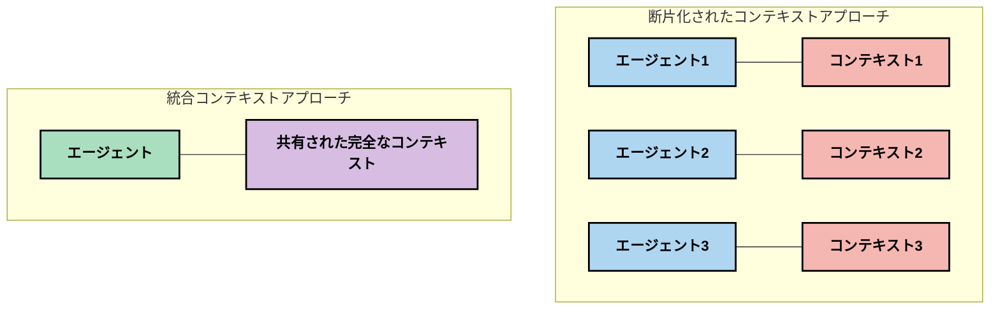
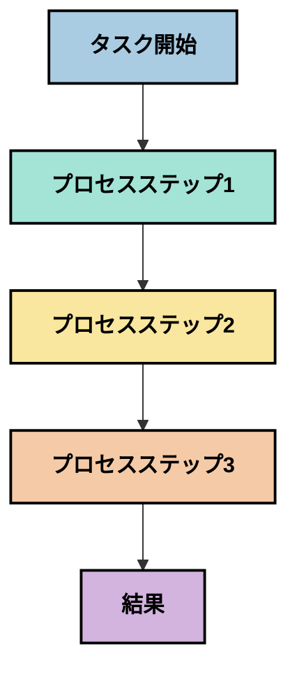
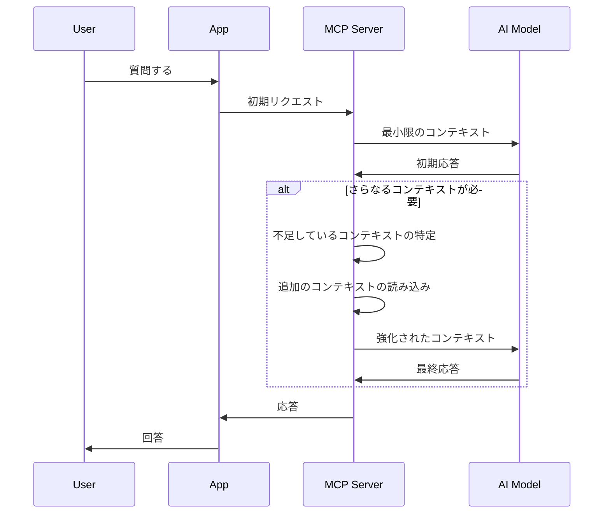
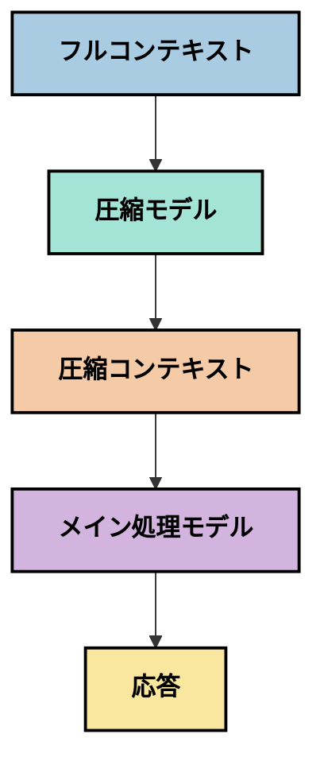
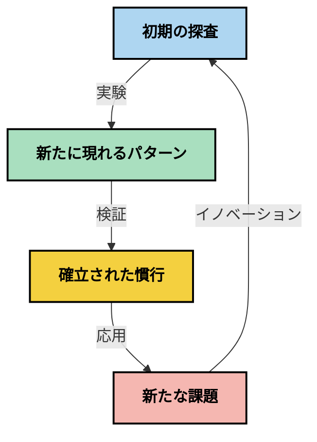

# コンテキストエンジニアリング：MCPエコシステムにおける新たな概念

## 概要

コンテキストエンジニアリングは、クライアントとAIサービス間のやり取り全体で情報がどのように構造化、提供、維持されるかを探求する、AI分野の新たな概念です。モデルコンテキストプロトコル（MCP）エコシステムが進化する中で、コンテキストを効果的に管理する方法を理解することはますます重要になっています。このモジュールではコンテキストエンジニアリングの概念を紹介し、MCP実装におけるその潜在的応用を探ります。

## 学習目標

このモジュールを修了すると、以下ができるようになります：

- 新たに浮上しているコンテキストエンジニアリングの概念とMCPアプリケーションにおける潜在的役割を理解する
- MCPプロトコル設計が対応するコンテキスト管理における主要な課題を特定する
- より良いコンテキスト処理を通じてモデルパフォーマンスを向上させる技術を探る
- コンテキストの有効性を測定し評価するためのアプローチを考慮する
- MCPフレームワークを通じてこれらの新たな概念を適用し、AI体験を改善する

## コンテキストエンジニアリングの紹介

コンテキストエンジニアリングは、ユーザー、アプリケーション、およびAIモデル間の情報の流れを意図的に設計・管理することに焦点を当てた新たな概念です。プロンプトエンジニアリングのような確立された分野とは異なり、コンテキストエンジニアリングはまだ実践者によって定義されつつあり、AIモデルに適切な情報を適切な時点で提供するという独自の課題に取り組んでいます。

大規模言語モデル（LLM）が進化する中で、コンテキストの重要性はますます明らかになっています。提供するコンテキストの質、関連性、構造はモデルの出力に直接影響を与えます。コンテキストエンジニアリングはこの関係を探求し、効果的なコンテキスト管理のための原則を開発しようとしています。

> 「2025年のモデルは非常に知的です。しかし、最も賢い人間であっても、何を求められているのかというコンテキストなしには効果的に仕事をこなせません…‘コンテキストエンジニアリング’は次のレベルのプロンプトエンジニアリングです。それは動的システムでこれを自動的に行うことに関するものです。」 — Walden Yan, Cognition AI

コンテキストエンジニアリングは以下を含むかもしれません：

1. <strong>コンテキスト選択</strong>：特定のタスクに関連する情報を決定する
2. <strong>コンテキスト構造化</strong>：モデルの理解を最大化するために情報を整理する
3. <strong>コンテキスト提供</strong>：情報をモデルにいつどのように送るかを最適化する
4. <strong>コンテキスト維持</strong>：時間経過に伴う状態とコンテキストの進化を管理する
5. <strong>コンテキスト評価</strong>：コンテキストの効果を測定し改善する

これらの焦点領域は、アプリケーションがLLMにコンテキストを提供するための標準化された方法を提供するMCPエコシステムに特に関連しています。


## コンテキストジャーニーの視点

コンテキストエンジニアリングを視覚化する一つの方法は、コンテキストがMCPシステムを通過する旅路を追跡することです：


### コンテキストジャーニーの主な段階：

1. <strong>ユーザー入力</strong>：ユーザーからの生情報（テキスト、画像、ドキュメント）
2. <strong>コンテキスト組み立て</strong>：ユーザー入力をシステムコンテキスト、会話履歴、取得した他の情報と組み合わせる
3. <strong>モデル処理</strong>：AIモデルが組み立てたコンテキストを処理する
4. <strong>応答生成</strong>：モデルが提供されたコンテキストに基づいて出力を生成する
5. <strong>状態管理</strong>：システムがやり取りに基づいて内部状態を更新する

この視点はAIシステムにおけるコンテキストの動的な性質を浮き彫りにし、各段階で情報をどのように最適に管理すべきかという重要な疑問を提起します。

## コンテキストエンジニアリングの新たな原則

コンテキストエンジニアリングの分野が形成されるにつれ、いくつかの初期原則が実践者から浮上し始めています。これらの原則はMCP実装の選択に役立つかもしれません：

### 原則1：コンテキストを完全に共有する

コンテキストは複数のエージェントやプロセスに分断されるのではなく、システムのすべてのコンポーネント間で完全に共有されるべきです。コンテキストが分散すると、システムの一部で下された決定が他の部分と矛盾する場合があります。



MCPアプリケーションでは、これはコンテキストがパイプライン全体でシームレスに流れる設計を示唆しており、分断されるものではありません。

### 原則2：行動は暗黙の決定を伴うことを認識する

モデルが行う各行動はコンテキストを解釈するための暗黙の決定を内包しています。複数のコンポーネントが異なるコンテキストで作用すると、これらの暗黙の決定が衝突し、一貫性のない結果につながることがあります。

この原則はMCPアプリケーションに重要な意味を持ちます：
- 分断されたコンテキストでの並列実行よりも複雑なタスクの線形処理を優先する
- すべての意思決定ポイントが同じコンテキスト情報にアクセスできるようにする
- 後のステップが前の決定の完全なコンテキストを参照できるシステムを設計する

### 原則3：コンテキストの深さとウィンドウ制限のバランスをとる

会話やプロセスが長くなると、コンテキストウィンドウはやがてあふれます。効果的なコンテキストエンジニアリングは、包括的なコンテキストと技術的制限の間のこの緊張を管理するアプローチを探求します。

探索されている可能性のあるアプローチには以下が含まれます：
- 不要なトークン使用を減らしつつ重要情報を維持するコンテキスト圧縮
- 現在のニーズに基づきコンテキストを段階的に読み込む方法
- 重要な決定や事実を保持しながら以前のやり取りを要約する方法

## コンテキスト課題とMCPプロトコル設計

モデルコンテキストプロトコル（MCP）はコンテキスト管理の固有の課題を念頭に設計されています。これらの課題を理解することでMCPプロトコル設計の重要な側面を説明できます：


### 課題1：コンテキストウィンドウ制限
ほとんどのAIモデルは固定されたコンテキストウィンドウサイズを持ち、一度に処理できる情報量に制限があります。

**MCP設計の対応：** 
- 効率的に参照可能な構造化されたリソースベースのコンテキストをサポートする
- リソースはページ分割や段階的な読み込みが可能

### 課題2：関連性の決定
コンテキストに含める情報の重要度を決定することは困難です。

**MCP設計の対応：**
- ニーズに応じた動的情報取得を可能にする柔軟なツール
- 一貫したコンテキスト整理を可能にする構造化プロンプト

### 課題3：コンテキストの持続性
やり取りを通じた状態管理にはコンテキストの綿密な追跡が必要です。

**MCP設計の対応：**
- 標準化されたセッション管理
- コンテキストの進化のための明確なインタラクションパターン

### 課題4：マルチモーダルコンテキスト
テキスト、画像、構造化データなど異なる種類のデータは異なる扱いを要します。

**MCP設計の対応：**
- 様々なコンテンツタイプに対応するプロトコル設計
- マルチモーダル情報の標準化された表現

### 課題5：セキュリティとプライバシー
コンテキストにはしばしば保護が必要な敏感情報が含まれます。

**MCP設計の対応：**
- クライアントとサーバーの責任分界を明確にする
- データ露出を最小限に抑えるローカル処理オプション

これらの課題とMCPがそれにどう対応しているかの理解は、より高度なコンテキストエンジニアリング技術を探求する基盤となります。

## 新たに現れてきたコンテキストエンジニアリング手法

コンテキストエンジニアリングの分野が発展するにつれ、いくつかの有望な手法が現れています。これらは確立されたベストプラクティスではなく現在の考え方を表しており、MCP実装を通じて経験が積まれるに連れて進化すると考えられます。

### 1. 単一スレッドの線形処理

コンテキストを分散させるマルチエージェントアーキテクチャとは対照的に、単一スレッドの線形処理の方が一貫した結果を生むと成功を収めている実践者もいます。これは統一されたコンテキストを維持する原則に合致します。



このアプローチは並列処理より効率が悪く見えるかもしれませんが、各ステップが前の決定の完全な理解に基づいて進むため、より一貫性があり信頼できる結果を生み出すことが多いです。

### 2. コンテキストのチャンク化と優先順位付け

大きなコンテキストを管理可能な部分に分け、最も重要な部分を優先する方法。

```python
# 概念的な例：コンテキストのチャンク化と優先順位付け
def process_with_chunked_context(documents, query):
    # 1. ドキュメントを小さなチャンクに分割する
    chunks = chunk_documents(documents)
    
    # 2. 各チャンクの関連性スコアを計算する
    scored_chunks = [(chunk, calculate_relevance(chunk, query)) for chunk in chunks]
    
    # 3. 関連性スコアでチャンクをソートする
    sorted_chunks = sorted(scored_chunks, key=lambda x: x[1], reverse=True)
    
    # 4. 最も関連性の高いチャンクをコンテキストとして使用する
    context = create_context_from_chunks([chunk for chunk, score in sorted_chunks[:5]])
    
    # 5. 優先されたコンテキストで処理を行う
    return generate_response(context, query)
```

上図は大きなドキュメントを管理しやすい部分に分割し、最も関連性の高い部分だけをコンテキストとして選ぶ方法を示しています。このアプローチはコンテキストウィンドウの制限内で大きな知識ベースを活用するのに役立ちます。

### 3. 段階的コンテキスト読み込み

一度に全てではなく、必要に応じてコンテキストを徐々に読み込む方法。



段階的コンテキスト読み込みは最小限のコンテキストから始め、必要に応じて拡大します。これにより簡単な質問ではトークン使用量を大幅に削減しながら、複雑な質問にも対応可能です。

### 4. コンテキスト圧縮と要約

重要な情報を維持しつつコンテキストのサイズを減らす方法。



コンテキスト圧縮は以下に注力しています：
- 冗長な情報を除去する
- 長文内容を要約する
- 主要な事実や詳細を抽出する
- 重要なコンテキスト要素を保持する
- トークン効率を最適化する

この手法は特に長い会話をコンテキストウィンドウ内で維持したり、大規模ドキュメントを効率よく処理するのに有用です。会話履歴の圧縮や要約専用の特殊モデルを使う実践者もいます。


## 探索的なコンテキストエンジニアリングの考慮事項

新興のコンテキストエンジニアリング分野を探索するにあたり、MCP実装作業時に留意すべきいくつかの考慮点があります。これらは規範的なベストプラクティスではなく、特定のユースケースで改善をもたらす可能性のある探索的分野です。

### コンテキストの目標を考慮する

複雑なコンテキスト管理ソリューションを実装する前に、達成したいことを明確に定義します：
- モデルが成功するために必要な特定の情報は何か？
- どの情報が必須で、どれが補足的か？
- パフォーマンスの制約（遅延、トークン制限、コスト）は？

### 層状コンテキストアプローチを探る

一部の実践者は、コンテキストを概念的な層に分けて成功を収めています：
- <strong>コア層</strong>：モデルが常に必要とする必須情報
- <strong>状況層</strong>：現在のやり取りに特有のコンテキスト
- <strong>補助層</strong>：役立つかもしれない追加情報
- <strong>フォールバック層</strong>：必要時にアクセスされる情報

### 取得戦略を調査する

コンテキストの効果は情報の取得方法に大きく依存します：
- 概念的に関連する情報を見つけるためのセマンティック検索と埋め込み
- 特定の事実的詳細を探すためのキーワードベース検索
- 複数の取得方法を組み合わせたハイブリッド手法
- カテゴリ、日付、ソースによる範囲絞り込みのためのメタデータフィルター

### コンテキストの一貫性を実験する

コンテキストの構造や流れはモデルの理解に影響を与える可能性があります：
- 関連情報をまとめて配置する
- 一貫したフォーマットや整理を用いる
- 適切な場合は論理的または年代順の編集を維持する
- 矛盾した情報を避ける

### マルチエージェントアーキテクチャのトレードオフを考量する

多くのAIフレームワークで人気のあるマルチエージェントアーキテクチャは、コンテキスト管理において以下の大きな課題を伴います：
- コンテキストの断片化がエージェント間の一貫性のない決定を招く
- 並列処理が調整困難な衝突を生む可能性がある
- エージェント間の通信オーバーヘッドが性能向上を相殺する
- 一貫性を維持するために複雑な状態管理が必要

多くの場合、包括的コンテキスト管理を備えた単一エージェントの方が、分断されたコンテキストを持つ複数の専門的エージェントよりも信頼性の高い結果を生み出すことがあります。

### 評価方法を開発する

コンテキストエンジニアリングを継続的に改善するために、成功をどのように測定するかを考慮してください：
- 様々なコンテキスト構造のA/Bテスト
- トークン使用量と応答時間のモニタリング
- ユーザー満足度とタスク完了率の追跡
- コンテキスト戦略が失敗する時と理由の分析

これらの考慮点はコンテキストエンジニアリング分野で積極的に探求されている領域です。分野が成熟するにつれ、より明確なパターンや実践が現れるでしょう。

## コンテキストの有効性を測る：進化するフレームワーク

コンテキストエンジニアリングが概念として登場するとともに、その有効性をどのように測定するかが探求され始めています。確立されたフレームワークはまだ存在しませんが、今後の研究を導く可能性のある様々な指標が検討されています。

### 測定の可能な軸


#### 1. 入力効率の考慮点

- <strong>コンテキスト対応答比率</strong>：応答サイズに対してどれくらいのコンテキストが必要か？
- <strong>トークン利用率</strong>：提供されたコンテキストのトークンのうち応答に影響を与えた割合は？
- <strong>コンテキスト削減率</strong>：生情報をどれだけ効果的に圧縮できるか？

#### 2. パフォーマンスの考慮点

- <strong>レイテンシー影響</strong>：コンテキスト管理は応答時間にどのように影響するか？
- <strong>トークン経済性</strong>：トークンの使用は効果的に最適化されているか？
- <strong>取得精度</strong>：取得情報の関連性はどの程度か？
- <strong>リソース利用率</strong>：どの程度の計算リソースが必要か？

#### 3. 品質の考慮点

- <strong>応答の関連性</strong>：応答はクエリにどの程度的確に応じているか？
- <strong>事実の正確さ</strong>：コンテキスト管理は事実の正確性を改善しているか？
- <strong>一貫性</strong>：類似クエリに対する応答は一貫しているか？
- <strong>幻覚率</strong>：より良いコンテキストはモデルの幻覚を減らしているか？

#### 4. ユーザー体験の考慮点

- <strong>フォローアップ率</strong>：利用者が再確認を求める頻度はどれくらいか？
- <strong>タスク完了率</strong>：利用者は目標を達成できているか？
- <strong>満足度指標</strong>：利用者は体験をどのように評価しているか？

### 測定の探索的アプローチ

MCP実装におけるコンテキストエンジニアリングの実験では、以下の探索的アプローチを検討してください：

1. <strong>ベースライン比較</strong>：単純なコンテキスト手法で基準を確立し、より高度な方法を試す前に比較する

2. <strong>漸進的変更</strong>：コンテキスト管理の要素を一つずつ変えてその効果を明確にする

3. <strong>ユーザー中心の評価</strong>：定量的指標と定性的ユーザーフィードバックを組み合わせる

4. <strong>失敗分析</strong>：コンテキスト戦略が失敗する事例を調べ改善点を見つける

5. <strong>多次元評価</strong>：効率、品質、ユーザー体験の間のトレードオフを考慮する

この実験的で多面的な測定アプローチは、コンテキストエンジニアリングの新興性に適しています。

## 終わりに

コンテキストエンジニアリングは効果的なMCPアプリケーションの中心となる可能性のある新興分野です。システム内で情報がどのように流れるかを慎重に考えることで、より効率的で正確、かつ価値あるAI体験を創出できるかもしれません。

このモジュールで述べた技術や手法は初期の考え方であり、確立された実践ではありません。AI能力の進化と理解の深化に伴い、コンテキストエンジニアリングはより明確な学問分野に発展する可能性があります。現時点では、実験と慎重な測定を組み合わせることが最も生産的なアプローチのようです。

## 将来的な方向性の可能性

コンテキストエンジニアリング分野はまだ初期段階ですが、いくつか有望な方向性が浮上しています：

- コンテキストエンジニアリングの原則がモデルのパフォーマンス、効率、ユーザー体験、信頼性に大きく影響する可能性
- 包括的なコンテキスト管理を持つ単一スレッドアプローチが多くのユースケースでマルチエージェントアーキテクチャを上回る可能性
- 専門のコンテキスト圧縮モデルがAIパイプラインの標準コンポーネントになる可能性
- コンテキストの完全性とトークン制限の緊張関係が革新的コンテキスト処理を促進する可能性
- モデルが効率的かつ人間らしいコミュニケーション能力を持つにつれ、真のマルチエージェント協働がより実用的になる可能性
- MCP実装が現行の実験から生じるコンテキスト管理パターンを標準化する可能性



## リソース

### 公式MCPリソース
- [Model Context Protocol Website](https://modelcontextprotocol.io/)
- [Model Context Protocol Specification](https://github.com/modelcontextprotocol/modelcontextprotocol)

- [MCP Documentation](https://modelcontextprotocol.io/docs)
- [MCP C# SDK](https://github.com/modelcontextprotocol/csharp-sdk)
- [MCP Python SDK](https://github.com/modelcontextprotocol/python-sdk)
- [MCP TypeScript SDK](https://github.com/modelcontextprotocol/typescript-sdk)
- [MCP Inspector](https://github.com/modelcontextprotocol/inspector) - MCPサーバーのためのビジュアルテストツール

### コンテキストエンジニアリング記事
- [マルチエージェントを構築しないでください：コンテキストエンジニアリングの原則](https://cognition.ai/blog/dont-build-multi-agents) - Walden Yanによるコンテキストエンジニアリングの原則の洞察
- [エージェント構築の実践ガイド](https://cdn.openai.com/business-guides-and-resources/a-practical-guide-to-building-agents.pdf) - OpenAIによる効果的なエージェント設計ガイド
- [効果的なエージェントの構築](https://www.anthropic.com/engineering/building-effective-agents) - Anthropicのエージェント開発アプローチ

### 関連研究
- [大規模言語モデルのための動的検索強化](https://arxiv.org/abs/2310.01487) - 動的検索アプローチに関する研究
- [途中で迷子になる：言語モデルが長いコンテキストを使う方法](https://arxiv.org/abs/2307.03172) - コンテキスト処理パターンに関する重要な研究
- [CLIP Latentsを用いた階層的テキスト条件付き画像生成](https://arxiv.org/abs/2204.06125) - DALL-E 2論文、コンテキスト構造の洞察
- [大規模言語モデルアーキテクチャにおけるコンテキストの役割の探求](https://aclanthology.org/2023.findings-emnlp.124/) - コンテキスト処理に関する最新研究
- [マルチエージェント協調：調査報告](https://arxiv.org/abs/2304.03442) - マルチエージェントシステムとその課題に関する研究

### 追加リソース
- [コンテキストウィンドウ最適化技術](https://learn.microsoft.com/en-us/azure/ai-services/openai/concepts/context-window)
- [高度なRAG技術](https://www.microsoft.com/en-us/research/blog/retrieval-augmented-generation-rag-and-frontier-models/)
- [Semantic Kernelドキュメント](https://github.com/microsoft/semantic-kernel)
- [コンテキスト管理のためのAIツールキット](https://github.com/microsoft/aitoolkit)

## 次のステップ

- [5.15 MCP Custom Transport](../mcp-transport/README.md)

---

<!-- CO-OP TRANSLATOR DISCLAIMER START -->
**免責事項**：
本書類は AI 翻訳サービス [Co-op Translator](https://github.com/Azure/co-op-translator) を使用して翻訳されています。正確性を期していますが、自動翻訳には誤りや不正確な部分が含まれる可能性があることをご承知おきください。原文の原語版が正式な情報源とみなされるべきです。重要な情報については、専門の人間による翻訳を推奨します。本翻訳の利用により生じたいかなる誤解や解釈違いについても、当方は責任を負いかねます。
<!-- CO-OP TRANSLATOR DISCLAIMER END -->