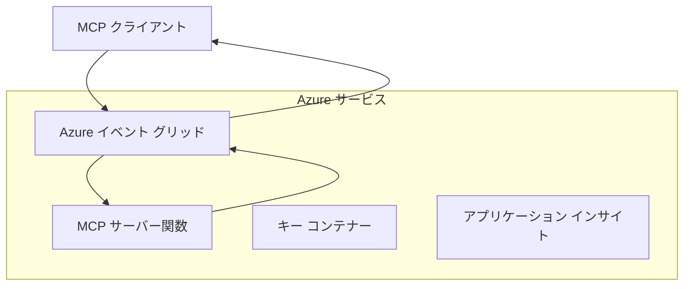

# MCP カスタムトランスポート - 上級実装ガイド

Model Context Protocol (MCP) はトランスポート機構に柔軟性を提供し、専門的なエンタープライズ環境向けにカスタム実装を可能にします。この上級ガイドでは、スケーラブルなクラウドネイティブ MCP ソリューション構築の実践例として、Azure Event Grid と Azure Event Hubs を用いたカスタムトランスポート実装について詳しく解説します。

> **今後の予定:** 本ガイドは、セッションごとの順序の保持が求められる **MCP Specification 2025-11-25** に基づいて作成されています（メッセージプロトコルを参照）。`2026-07-28` のリリース候補ではプロトコルレベルのセッションを完全に廃止し、`Mcp-Method`/`Mcp-Name` ヘッダーを必須とすることで、ゲートウェイやカスタムトランスポートがリクエスト単位でルーティング可能になります。詳細は [What's Changing in MCP: The 2026-07-28 Release Candidate](../../01-CoreConcepts/mcp-2026-07-28-release-candidate.md) を参照してください。

## はじめに

MCP の標準トランスポート（stdio と HTTP ストリーミング）はほとんどのケースで十分ですが、エンタープライズ環境ではスケーラビリティ、信頼性、既存のクラウドインフラとの統合のために特化したトランスポート機構が必要になることが多いです。カスタムトランスポートを使用することで、MCP は非同期通信、イベント駆動型アーキテクチャ、分散処理のためのクラウドネイティブなメッセージングサービスを活用できます。

本レッスンでは、最新の MCP 仕様（2025-11-25）、Azure メッセージングサービス、および確立されたエンタープライズ統合パターンに基づく高度なトランスポート実装を探ります。

### **MCP トランスポートアーキテクチャ**

**MCP Specification (2025-11-25) より：**

- <strong>標準トランスポート</strong>: stdio（推奨）、HTTP ストリーミング（リモートシナリオ用）
- <strong>カスタムトランスポート</strong>: MCP メッセージ交換プロトコルを実装した任意のトランスポート
- <strong>メッセージ形式</strong>: MCP 固有拡張を含む JSON-RPC 2.0
- <strong>双方向通信</strong>: 通知および応答のためにフルデュプレックス通信が必要

## 学習目標

この上級レッスンの終了時には、以下が可能になります：

- <strong>カスタムトランスポート要件の理解</strong>: MCP プロトコルを任意のトランスポート層上で実装しつつ準拠を維持
- **Azure Event Grid トランスポートの構築**: Azure Event Grid を用いたサーバーレススケーラブルなイベント駆動型 MCP サーバの作成
- **Azure Event Hubs トランスポートの実装**: リアルタイムストリーミングのための高スループット MCP ソリューション設計
- <strong>エンタープライズパターンの適用</strong>: 既存の Azure インフラやセキュリティモデルへのカスタムトランスポート統合
- <strong>トランスポート信頼性の管理</strong>: メッセージ耐久性、順序保証、エラー処理の実装
- <strong>パフォーマンス最適化</strong>: スケール、レイテンシ、スループット要件に応じたトランスポート設計

## <strong>トランスポート要件</strong>

### **MCP Specification (2025-11-25) のコア要件：**

```yaml
Message Protocol:
  format: "JSON-RPC 2.0 with MCP extensions"
  bidirectional: "Full duplex communication required"
  ordering: "Message ordering must be preserved per session"
  
Transport Layer:
  reliability: "Transport MUST handle connection failures gracefully"
  security: "Transport MUST support secure communication"
  identification: "Each session MUST have unique identifier"
  
Custom Transport:
  compliance: "MUST implement complete MCP message exchange"
  extensibility: "MAY add transport-specific features"
  interoperability: "MUST maintain protocol compatibility"
```

## **Azure Event Grid トランスポート実装**

Azure Event Grid はサーバーレスイベントルーティングサービスを提供し、イベント駆動型 MCP アーキテクチャに最適です。この実装では、スケーラブルで疎結合な MCP システムの構築方法を示します。

### <strong>アーキテクチャ概要</strong>



### **C# 実装 - Event Grid トランスポート**

```csharp
using Azure.Messaging.EventGrid;
using Microsoft.Extensions.Azure;
using System.Text.Json;

public class EventGridMcpTransport : IMcpTransport
{
    private readonly EventGridPublisherClient _publisher;
    private readonly string _topicEndpoint;
    private readonly string _clientId;
    
    public EventGridMcpTransport(string topicEndpoint, string accessKey, string clientId)
    {
        _publisher = new EventGridPublisherClient(
            new Uri(topicEndpoint), 
            new AzureKeyCredential(accessKey));
        _topicEndpoint = topicEndpoint;
        _clientId = clientId;
    }
    
    public async Task SendMessageAsync(McpMessage message)
    {
        var eventGridEvent = new EventGridEvent(
            subject: $"mcp/{_clientId}",
            eventType: "MCP.MessageReceived",
            dataVersion: "1.0",
            data: JsonSerializer.Serialize(message))
        {
            Id = Guid.NewGuid().ToString(),
            EventTime = DateTimeOffset.UtcNow
        };
        
        await _publisher.SendEventAsync(eventGridEvent);
    }
    
    public async Task<McpMessage> ReceiveMessageAsync(CancellationToken cancellationToken)
    {
        // Event Grid is push-based, so implement webhook receiver
        // This would typically be handled by Azure Functions trigger
        throw new NotImplementedException("Use EventGridTrigger in Azure Functions");
    }
}

// Azure Function for receiving Event Grid events
[FunctionName("McpEventGridReceiver")]
public async Task<IActionResult> HandleEventGridMessage(
    [EventGridTrigger] EventGridEvent eventGridEvent,
    ILogger log)
{
    try
    {
        var mcpMessage = JsonSerializer.Deserialize<McpMessage>(
            eventGridEvent.Data.ToString());
        
        // Process MCP message
        var response = await _mcpServer.ProcessMessageAsync(mcpMessage);
        
        // Send response back via Event Grid
        await _transport.SendMessageAsync(response);
        
        return new OkResult();
    }
    catch (Exception ex)
    {
        log.LogError(ex, "Error processing Event Grid MCP message");
        return new BadRequestResult();
    }
}
```

### **TypeScript 実装 - Event Grid トランスポート**

```typescript
import { EventGridPublisherClient, AzureKeyCredential } from "@azure/eventgrid";
import { McpTransport, McpMessage } from "./mcp-types";

export class EventGridMcpTransport implements McpTransport {
    private publisher: EventGridPublisherClient;
    private clientId: string;
    
    constructor(
        private topicEndpoint: string,
        private accessKey: string,
        clientId: string
    ) {
        this.publisher = new EventGridPublisherClient(
            topicEndpoint,
            new AzureKeyCredential(accessKey)
        );
        this.clientId = clientId;
    }
    
    async sendMessage(message: McpMessage): Promise<void> {
        const event = {
            id: crypto.randomUUID(),
            source: `mcp-client-${this.clientId}`,
            type: "MCP.MessageReceived",
            time: new Date(),
            data: message
        };
        
        await this.publisher.sendEvents([event]);
    }
    
    // Azure Functionsによるイベント駆動型受信
    onMessage(handler: (message: McpMessage) => Promise<void>): void {
        // 実装ではAzure FunctionsのEvent Gridトリガーを使用
        // これはWebhook受信機の概念的なインターフェースです
    }
}

// Azure Functionsの実装
import { app, InvocationContext, EventGridEvent } from "@azure/functions";

app.eventGrid("mcpEventGridHandler", {
    handler: async (event: EventGridEvent, context: InvocationContext) => {
        try {
            const mcpMessage = event.data as McpMessage;
            
            // MCPメッセージの処理
            const response = await mcpServer.processMessage(mcpMessage);
            
            // Event Gridを介してレスポンスを送信
            await transport.sendMessage(response);
            
        } catch (error) {
            context.error("Error processing MCP message:", error);
            throw error;
        }
    }
});
```

### **Python 実装 - Event Grid トランスポート**

```python
from azure.eventgrid import EventGridPublisherClient, EventGridEvent
from azure.core.credentials import AzureKeyCredential
import asyncio
import json
from typing import Callable, Optional
import uuid
from datetime import datetime

class EventGridMcpTransport:
    def __init__(self, topic_endpoint: str, access_key: str, client_id: str):
        self.client = EventGridPublisherClient(
            topic_endpoint, 
            AzureKeyCredential(access_key)
        )
        self.client_id = client_id
        self.message_handler: Optional[Callable] = None
    
    async def send_message(self, message: dict) -> None:
        """Send MCP message via Event Grid"""
        event = EventGridEvent(
            data=message,
            subject=f"mcp/{self.client_id}",
            event_type="MCP.MessageReceived",
            data_version="1.0"
        )
        
        await self.client.send(event)
    
    def on_message(self, handler: Callable[[dict], None]) -> None:
        """Register message handler for incoming events"""
        self.message_handler = handler

# Azure Functionsの実装
import azure.functions as func
import logging

def main(event: func.EventGridEvent) -> None:
    """Azure Functions Event Grid trigger for MCP messages"""
    try:
        # Event GridイベントからMCPメッセージを解析
        mcp_message = json.loads(event.get_body().decode('utf-8'))
        
        # MCPメッセージを処理
        response = process_mcp_message(mcp_message)
        
        # Event Grid経由で応答を送信
        # （実装では新しいEvent Gridクライアントを作成します）
        
    except Exception as e:
        logging.error(f"Error processing MCP Event Grid message: {e}")
        raise
```

## **Azure Event Hubs トランスポート実装**

Azure Event Hubs は低レイテンシかつ高メッセージボリュームを必要とする MCP シナリオ向けに高スループットでリアルタイムのストリーミング機能を提供します。

### <strong>アーキテクチャ概要</strong>

```mermaid
graph TB
    Client[MCP クライアント] --> EH[Azure イベント ハブ]
    EH --> Server[MCP サーバー]
    Server --> EH
    EH --> Client
    
    subgraph 「イベント ハブの機能」
        Partition[パーティショニング]
        Retention[メッセージ保持]
        Scaling[自動スケーリング]
    end
    
    EH --> Partition
    EH --> Retention
    EH --> Scaling
```

### **C# 実装 - Event Hubs トランスポート**

```csharp
using Azure.Messaging.EventHubs;
using Azure.Messaging.EventHubs.Producer;
using Azure.Messaging.EventHubs.Consumer;
using System.Text;

public class EventHubsMcpTransport : IMcpTransport, IDisposable
{
    private readonly EventHubProducerClient _producer;
    private readonly EventHubConsumerClient _consumer;
    private readonly string _consumerGroup;
    private readonly CancellationTokenSource _cancellationTokenSource;
    
    public EventHubsMcpTransport(
        string connectionString, 
        string eventHubName,
        string consumerGroup = "$Default")
    {
        _producer = new EventHubProducerClient(connectionString, eventHubName);
        _consumer = new EventHubConsumerClient(
            consumerGroup, 
            connectionString, 
            eventHubName);
        _consumerGroup = consumerGroup;
        _cancellationTokenSource = new CancellationTokenSource();
    }
    
    public async Task SendMessageAsync(McpMessage message)
    {
        var messageBody = JsonSerializer.Serialize(message);
        var eventData = new EventData(Encoding.UTF8.GetBytes(messageBody));
        
        // Add MCP-specific properties
        eventData.Properties.Add("MessageType", message.Method ?? "response");
        eventData.Properties.Add("MessageId", message.Id);
        eventData.Properties.Add("Timestamp", DateTimeOffset.UtcNow);
        
        await _producer.SendAsync(new[] { eventData });
    }
    
    public async Task StartReceivingAsync(
        Func<McpMessage, Task> messageHandler)
    {
        await foreach (PartitionEvent partitionEvent in _consumer.ReadEventsAsync(
            _cancellationTokenSource.Token))
        {
            try
            {
                var messageBody = Encoding.UTF8.GetString(
                    partitionEvent.Data.EventBody.ToArray());
                var mcpMessage = JsonSerializer.Deserialize<McpMessage>(messageBody);
                
                await messageHandler(mcpMessage);
            }
            catch (Exception ex)
            {
                // Handle deserialization or processing errors
                Console.WriteLine($"Error processing message: {ex.Message}");
            }
        }
    }
    
    public void Dispose()
    {
        _cancellationTokenSource?.Cancel();
        _producer?.DisposeAsync().AsTask().Wait();
        _consumer?.DisposeAsync().AsTask().Wait();
        _cancellationTokenSource?.Dispose();
    }
}
```

### **TypeScript 実装 - Event Hubs トランスポート**

```typescript
import { 
    EventHubProducerClient, 
    EventHubConsumerClient, 
    EventData 
} from "@azure/event-hubs";

export class EventHubsMcpTransport implements McpTransport {
    private producer: EventHubProducerClient;
    private consumer: EventHubConsumerClient;
    private isReceiving = false;
    
    constructor(
        private connectionString: string,
        private eventHubName: string,
        private consumerGroup: string = "$Default"
    ) {
        this.producer = new EventHubProducerClient(
            connectionString, 
            eventHubName
        );
        this.consumer = new EventHubConsumerClient(
            consumerGroup,
            connectionString,
            eventHubName
        );
    }
    
    async sendMessage(message: McpMessage): Promise<void> {
        const eventData: EventData = {
            body: JSON.stringify(message),
            properties: {
                messageType: message.method || "response",
                messageId: message.id,
                timestamp: new Date().toISOString()
            }
        };
        
        await this.producer.sendBatch([eventData]);
    }
    
    async startReceiving(
        messageHandler: (message: McpMessage) => Promise<void>
    ): Promise<void> {
        if (this.isReceiving) return;
        
        this.isReceiving = true;
        
        const subscription = this.consumer.subscribe({
            processEvents: async (events, context) => {
                for (const event of events) {
                    try {
                        const messageBody = event.body as string;
                        const mcpMessage: McpMessage = JSON.parse(messageBody);
                        
                        await messageHandler(mcpMessage);
                        
                        // 少なくとも一回の配信のためにチェックポイントを更新する
                        await context.updateCheckpoint(event);
                    } catch (error) {
                        console.error("Error processing Event Hubs message:", error);
                    }
                }
            },
            processError: async (err, context) => {
                console.error("Event Hubs error:", err);
            }
        });
    }
    
    async close(): Promise<void> {
        this.isReceiving = false;
        await this.producer.close();
        await this.consumer.close();
    }
}
```

### **Python 実装 - Event Hubs トランスポート**

```python
from azure.eventhub import EventHubProducerClient, EventHubConsumerClient
from azure.eventhub import EventData
import json
import asyncio
from typing import Callable, Dict, Any
import logging

class EventHubsMcpTransport:
    def __init__(
        self, 
        connection_string: str, 
        eventhub_name: str,
        consumer_group: str = "$Default"
    ):
        self.producer = EventHubProducerClient.from_connection_string(
            connection_string, 
            eventhub_name=eventhub_name
        )
        self.consumer = EventHubConsumerClient.from_connection_string(
            connection_string,
            consumer_group=consumer_group,
            eventhub_name=eventhub_name
        )
        self.is_receiving = False
    
    async def send_message(self, message: Dict[str, Any]) -> None:
        """Send MCP message via Event Hubs"""
        event_data = EventData(json.dumps(message))
        
        # MCP固有のプロパティを追加する
        event_data.properties = {
            "messageType": message.get("method", "response"),
            "messageId": message.get("id"),
            "timestamp": "2025-01-14T10:30:00Z"  # 実際のタイムスタンプを使用する
        }
        
        async with self.producer:
            event_data_batch = await self.producer.create_batch()
            event_data_batch.add(event_data)
            await self.producer.send_batch(event_data_batch)
    
    async def start_receiving(
        self, 
        message_handler: Callable[[Dict[str, Any]], None]
    ) -> None:
        """Start receiving MCP messages from Event Hubs"""
        if self.is_receiving:
            return
        
        self.is_receiving = True
        
        async with self.consumer:
            await self.consumer.receive(
                on_event=self._on_event_received(message_handler),
                starting_position="-1"  # 最初から開始する
            )
    
    def _on_event_received(self, handler: Callable):
        """Internal event handler wrapper"""
        async def handle_event(partition_context, event):
            try:
                # Event HubsイベントからMCPメッセージを解析する
                message_body = event.body_as_str(encoding='UTF-8')
                mcp_message = json.loads(message_body)
                
                # MCPメッセージを処理する
                await handler(mcp_message)
                
                # 少なくとも一度配信のためにチェックポイントを更新する
                await partition_context.update_checkpoint(event)
                
            except Exception as e:
                logging.error(f"Error processing Event Hubs message: {e}")
        
        return handle_event
    
    async def close(self) -> None:
        """Clean up transport resources"""
        self.is_receiving = False
        await self.producer.close()
        await self.consumer.close()
```

## <strong>高度なトランスポートパターン</strong>

### <strong>メッセージ耐久性と信頼性</strong>

```csharp
// Implementing message durability with retry logic
public class ReliableTransportWrapper : IMcpTransport
{
    private readonly IMcpTransport _innerTransport;
    private readonly RetryPolicy _retryPolicy;
    
    public async Task SendMessageAsync(McpMessage message)
    {
        await _retryPolicy.ExecuteAsync(async () =>
        {
            try
            {
                await _innerTransport.SendMessageAsync(message);
            }
            catch (TransportException ex) when (ex.IsRetryable)
            {
                // Log and retry
                throw;
            }
        });
    }
}
```

### <strong>トランスポートのセキュリティ統合</strong>

```csharp
// Integrating Azure Key Vault for transport security
public class SecureTransportFactory
{
    private readonly SecretClient _keyVaultClient;
    
    public async Task<IMcpTransport> CreateEventGridTransportAsync()
    {
        var accessKey = await _keyVaultClient.GetSecretAsync("EventGridAccessKey");
        var topicEndpoint = await _keyVaultClient.GetSecretAsync("EventGridTopic");
        
        return new EventGridMcpTransport(
            topicEndpoint.Value.Value,
            accessKey.Value.Value,
            Environment.MachineName
        );
    }
}
```

### <strong>トランスポートのモニタリングと可観測性</strong>

```csharp
// Adding telemetry to custom transports
public class ObservableTransport : IMcpTransport
{
    private readonly IMcpTransport _transport;
    private readonly ILogger _logger;
    private readonly TelemetryClient _telemetryClient;
    
    public async Task SendMessageAsync(McpMessage message)
    {
        using var activity = Activity.StartActivity("MCP.Transport.Send");
        activity?.SetTag("transport.type", "EventGrid");
        activity?.SetTag("message.method", message.Method);
        
        var stopwatch = Stopwatch.StartNew();
        
        try
        {
            await _transport.SendMessageAsync(message);
            
            _telemetryClient.TrackDependency(
                "EventGrid",
                "SendMessage",
                DateTime.UtcNow.Subtract(stopwatch.Elapsed),
                stopwatch.Elapsed,
                true
            );
        }
        catch (Exception ex)
        {
            _telemetryClient.TrackException(ex);
            throw;
        }
    }
}
```

## <strong>エンタープライズ統合シナリオ</strong>

### **シナリオ 1: 分散 MCP 処理**

Azure Event Grid を使用して複数の処理ノード間で MCP リクエストを分散：

```yaml
Architecture:
  - MCP Client sends requests to Event Grid topic
  - Multiple Azure Functions subscribe to process different tool types
  - Results aggregated and returned via separate response topic
  
Benefits:
  - Horizontal scaling based on message volume
  - Fault tolerance through redundant processors
  - Cost optimization with serverless compute
```

### **シナリオ 2: リアルタイム MCP ストリーミング**

Azure Event Hubs を使用した高頻度 MCP インタラクション：

```yaml
Architecture:
  - MCP Client streams continuous requests via Event Hubs
  - Stream Analytics processes and routes messages
  - Multiple consumers handle different aspect of processing
  
Benefits:
  - Low latency for real-time scenarios
  - High throughput for batch processing
  - Built-in partitioning for parallel processing
```

### **シナリオ 3: ハイブリッドトランスポートアーキテクチャ**

用途別に複数のトランスポートを組み合わせる：

```csharp
public class HybridMcpTransport : IMcpTransport
{
    private readonly IMcpTransport _realtimeTransport; // Event Hubs
    private readonly IMcpTransport _batchTransport;    // Event Grid
    private readonly IMcpTransport _fallbackTransport; // HTTP Streaming
    
    public async Task SendMessageAsync(McpMessage message)
    {
        // Route based on message characteristics
        var transport = message.Method switch
        {
            "tools/call" when IsRealtime(message) => _realtimeTransport,
            "resources/read" when IsBatch(message) => _batchTransport,
            _ => _fallbackTransport
        };
        
        await transport.SendMessageAsync(message);
    }
}
```

## <strong>パフォーマンス最適化</strong>

### **Event Grid のメッセージバッチ処理**

```csharp
public class BatchingEventGridTransport : IMcpTransport
{
    private readonly List<McpMessage> _messageBuffer = new();
    private readonly Timer _flushTimer;
    private const int MaxBatchSize = 100;
    
    public async Task SendMessageAsync(McpMessage message)
    {
        lock (_messageBuffer)
        {
            _messageBuffer.Add(message);
            
            if (_messageBuffer.Count >= MaxBatchSize)
            {
                _ = Task.Run(FlushMessages);
            }
        }
    }
    
    private async Task FlushMessages()
    {
        List<McpMessage> toSend;
        lock (_messageBuffer)
        {
            toSend = new List<McpMessage>(_messageBuffer);
            _messageBuffer.Clear();
        }
        
        if (toSend.Any())
        {
            var events = toSend.Select(CreateEventGridEvent);
            await _publisher.SendEventsAsync(events);
        }
    }
}
```

### **Event Hubs のパーティショニング戦略**

```csharp
public class PartitionedEventHubsTransport : IMcpTransport
{
    public async Task SendMessageAsync(McpMessage message)
    {
        // Partition by client ID for session affinity
        var partitionKey = ExtractClientId(message);
        
        var eventData = new EventData(JsonSerializer.SerializeToUtf8Bytes(message))
        {
            PartitionKey = partitionKey
        };
        
        await _producer.SendAsync(new[] { eventData });
    }
}
```

## <strong>カスタムトランスポートのテスト</strong>

### <strong>テストダブルを用いた単体テスト</strong>

```csharp
[Test]
public async Task EventGridTransport_SendMessage_PublishesCorrectEvent()
{
    // Arrange
    var mockPublisher = new Mock<EventGridPublisherClient>();
    var transport = new EventGridMcpTransport(mockPublisher.Object);
    var message = new McpMessage { Method = "tools/list", Id = "test-123" };
    
    // Act
    await transport.SendMessageAsync(message);
    
    // Assert
    mockPublisher.Verify(
        x => x.SendEventAsync(
            It.Is<EventGridEvent>(e => 
                e.EventType == "MCP.MessageReceived" &&
                e.Subject == "mcp/test-client"
            )
        ),
        Times.Once
    );
}
```

### **Azure テストコンテナによる統合テスト**

```csharp
[Test]
public async Task EventHubsTransport_IntegrationTest()
{
    // Using Testcontainers for integration testing
    var eventHubsContainer = new EventHubsContainer()
        .WithEventHub("test-hub");
    
    await eventHubsContainer.StartAsync();
    
    var transport = new EventHubsMcpTransport(
        eventHubsContainer.GetConnectionString(),
        "test-hub"
    );
    
    // Test message round-trip
    var sentMessage = new McpMessage { Method = "test", Id = "123" };
    McpMessage receivedMessage = null;
    
    await transport.StartReceivingAsync(msg => {
        receivedMessage = msg;
        return Task.CompletedTask;
    });
    
    await transport.SendMessageAsync(sentMessage);
    await Task.Delay(1000); // Allow for message processing
    
    Assert.That(receivedMessage?.Id, Is.EqualTo("123"));
}
```

## <strong>ベストプラクティスとガイドライン</strong>

### <strong>トランスポート設計の原則</strong>

1. <strong>冪等性</strong>: 重複処理に対応できるようメッセージ処理を冪等にする
2. <strong>エラー処理</strong>: 包括的なエラー処理およびデッドレターキューを実装
3. <strong>モニタリング</strong>: 詳細なテレメトリとヘルスチェックを追加
4. <strong>セキュリティ</strong>: マネージド ID と最小権限アクセスを使用
5. <strong>パフォーマンス</strong>: レイテンシとスループット要件に応じて設計

### **Azure 固有の推奨事項**

1. **マネージド ID の使用**: 本番環境での接続文字列の使用を回避
2. <strong>サーキットブレーカーの実装</strong>: Azure サービスの障害から保護
3. <strong>コストモニタリング</strong>: メッセージ数と処理コストを追跡
4. <strong>スケール設計</strong>: パーティショニングとスケーリング戦略を早期に計画
5. <strong>徹底したテスト</strong>: Azure DevTest Labs を利用して総合的に検証

## <strong>結論</strong>

カスタム MCP トランスポートは Azure のメッセージングサービスを活用することで強力なエンタープライズシナリオを実現します。Event Grid または Event Hubs トランスポートを実装することで、既存の Azure インフラとシームレスに統合可能なスケーラブルで信頼性の高い MCP ソリューションを構築できます。

提供した例は、MCP プロトコルの準拠を維持しつつ、Azure のベストプラクティスに則ったカスタムトランスポートの本番対応パターンを示しています。

## <strong>追加リソース</strong>

- [MCP Specification 2025-11-25](https://modelcontextprotocol.io/specification/2025-11-25/)
- [Azure Event Grid Documentation](https://docs.microsoft.com/azure/event-grid/)
- [Azure Event Hubs Documentation](https://docs.microsoft.com/azure/event-hubs/)
- [Azure Functions Event Grid Trigger](https://docs.microsoft.com/azure/azure-functions/functions-bindings-event-grid)
- [Azure SDK for .NET](https://github.com/Azure/azure-sdk-for-net)
- [Azure SDK for TypeScript](https://github.com/Azure/azure-sdk-for-js)
- [Azure SDK for Python](https://github.com/Azure/azure-sdk-for-python)

---

> *本ガイドは本番用 MCP システムの実践的な実装パターンに焦点を当てています。トランスポートの実装は、特定の要件や Azure サービスの制限に対して常に検証してください。*
> <strong>現在の標準</strong>: 本ガイドは [MCP Specification 2025-11-25](https://modelcontextprotocol.io/specification/2025-11-25/) のトランスポート要件およびエンタープライズ環境向け上級トランスポートパターンを反映しています。


## 次に読むべき項目
- [6. Community Contributions](../../06-CommunityContributions/README.md)

---

<!-- CO-OP TRANSLATOR DISCLAIMER START -->
**免責事項**：
本書類は AI 翻訳サービス [Co-op Translator](https://github.com/Azure/co-op-translator) を使用して翻訳されています。正確性を期していますが、自動翻訳には誤りや不正確な部分が含まれる可能性があることをご承知おきください。原文の原語版が正式な情報源とみなされるべきです。重要な情報については、専門の人間による翻訳を推奨します。本翻訳の利用により生じたいかなる誤解や解釈違いについても、当方は責任を負いかねます。
<!-- CO-OP TRANSLATOR DISCLAIMER END -->