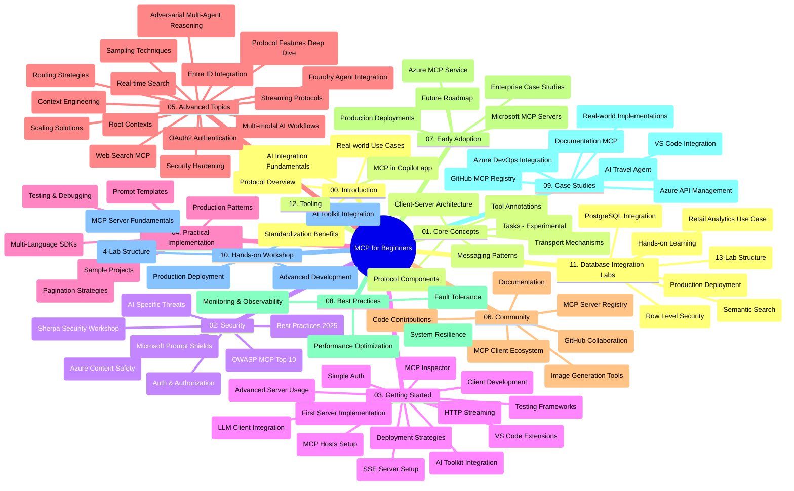

# 初心者のためのモデルコンテキストプロトコル（MCP） - 学習ガイド

この学習ガイドは、「初心者のためのモデルコンテキストプロトコル（MCP）」カリキュラムのリポジトリ構造と内容の概要を提供します。このガイドを使ってリポジトリを効率的にナビゲートし、利用可能なリソースを最大限に活用してください。

## リポジトリ概要

モデルコンテキストプロトコル（MCP）は、AIモデルとクライアントアプリケーション間のやり取りに対する標準化されたフレームワークです。Anthropicによって初めて作成され、現在は公式GitHub組織を通じて広範なMCPコミュニティによって維持されています。このリポジトリは、C#、Java、JavaScript、Python、TypeScriptでの実践的なコード例を備えた包括的なカリキュラムを提供し、AI開発者、システムアーキテクト、ソフトウェアエンジニア向けに設計されています。

## ビジュアルカリキュラムマップ

## リポジトリ構造

リポジトリは、MCPのさまざまな側面に焦点を当てた12の主要セクションに分かれています：

1. **イントロダクション (00-Introduction/)**
   - モデルコンテキストプロトコルの概要
   - AIパイプラインにおける標準化の重要性
   - 実践的なユースケースと利点

2. **コアコンセプト (01-CoreConcepts/)**
   - クライアントサーバーアーキテクチャ
   - 主要なプロトコルコンポーネント
   - MCPのメッセージングパターン
   - 将来展望: [What's Changing in MCP: The 2026-07-28 Release Candidate](./01-CoreConcepts/mcp-2026-07-28-release-candidate.md) — ステートレスプロトコルコア、拡張フレームワーク、次期仕様版で予定されているRoots/Sampling/Loggingの廃止

3. **セキュリティ (02-Security/)**
   - MCPベースシステムのセキュリティ脅威
   - セキュリティ実装のベストプラクティス
   - 認証と認可の戦略
   - <strong>包括的なセキュリティドキュメント</strong>：
     - MCPセキュリティベストプラクティス2025
     - Azure Content Safety 実装ガイド
     - MCPセキュリティコントロールと技術
     - MCPベストプラクティスクイックリファレンス
   - <strong>重要なセキュリティトピック</strong>：
     - プロンプトインジェクションとツールポイズニング攻撃
     - セッションハイジャックと混乱デピュティ問題
     - トークンパススルーの脆弱性
     - 過剰な権限とアクセストークン制御
     - AIコンポーネントのサプライチェーンセキュリティ
     - Microsoft Prompt Shields統合

4. **はじめに (03-GettingStarted/)**
   - 環境設定と構成
   - 基本的なMCPサーバーとクライアントの作成
   - 既存アプリケーションとの統合
   - 以下のセクションを含む：
     - 最初のサーバー実装
     - クライアント開発
     - LLMクライアント統合
     - VS Code統合
     - Server-Sent Events (SSE) サーバー
     - 高度なサーバー利用
     - HTTPストリーミング
     - AIツールキット統合
     - テスト戦略
     - デプロイメントガイドライン

5. **実践的実装 (04-PracticalImplementation/)**
   - 複数のプログラミング言語でのSDK使用方法
   - デバッグ、テスト、検証技術
   - 再利用可能なプロンプトテンプレートとワークフローの作成
   - 実装例を含むサンプルプロジェクト

6. **高度なトピック (05-AdvancedTopics/)**
   - コンテキストエンジニアリング手法
   - Foundryエージェント統合
   - マルチモーダルAIワークフロー
   - OAuth2認証デモ
   - リアルタイム検索機能
   - リアルタイムストリーミング
   - Root contexts実装
   - ルーティング戦略
   - サンプリング手法
   - スケーリングアプローチ
   - セキュリティ考慮事項
   - Entra IDセキュリティ統合
   - ウェブ検索統合
   - 対抗的マルチエージェント推論（討論パターン）

7. **コミュニティ貢献 (06-CommunityContributions/)**
   - コードおよびドキュメントへの貢献方法
   - GitHubを通じた協力
   - コミュニティ駆動型の改善とフィードバック
   - さまざまなMCPクライアントの利用（Claude Desktop、Cline、VSCode）
   - 画像生成を含む人気のMCPサーバーとの作業

8. **早期採用からの教訓 (07-LessonsfromEarlyAdoption/)**
   - 実世界の実装例と成功事例
   - MCPベースのソリューションの構築とデプロイ
   - トレンドと将来のロードマップ
   - **Microsoft MCPサーバーガイド**：次の10のプロダクション対応Microsoft MCPサーバーに関する包括的ガイド：
     - Microsoft Learn Docs MCPサーバー
     - Azure MCPサーバー（15以上の専門コネクター）
     - GitHub MCPサーバー
     - Azure DevOps MCPサーバー
     - MarkItDown MCPサーバー
     - SQL Server MCPサーバー
     - Playwright MCPサーバー
     - Dev Box MCPサーバー
     - Microsoft Foundry MCPサーバー
     - Microsoft 365 Agents Toolkit MCPサーバー

9. **ベストプラクティス (08-BestPractices/)**
   - パフォーマンスチューニングと最適化
   - フォールトトレラントなMCPシステム設計
   - テストと回復性戦略

10. **ケーススタディ (09-CaseStudy/)**
    - 多様なシナリオでのMCPの多用途性を示す<strong>7つの包括的なケーススタディ</strong>：
    - **Azure AIトラベルエージェント**：Azure OpenAIとAI Searchを用いたマルチエージェントオーケストレーション
    - **Azure DevOps統合**：YouTubeデータ更新によるワークフロープロセスの自動化
    - <strong>リアルタイムドキュメント取得</strong>：ストリーミングHTTPを備えたPythonコンソールクライアント
    - <strong>対話型学習計画ジェネレーター</strong>：Chainlitウェブアプリと会話型AI
    - <strong>エディタ内ドキュメント</strong>：GitHub Copilotワークフローを備えたVS Code統合
    - **Azure API管理**：企業API統合およびMCPサーバー作成
    - **GitHub MCPレジストリ**：エコシステム開発とエージェント統合プラットフォーム
    - 企業統合、開発者生産性、エコシステム開発にまたがる実装例

11. **ハンズオンワークショップ (10-StreamliningAIWorkflowsBuildingAnMCPServerWithAIToolkit/)**
    - MCPとAIツールキットを組み合わせた包括的なハンズオンワークショップ
    - AIモデルと実世界のツールをつなぐインテリジェントアプリケーションの構築
    - 基礎からカスタムサーバー開発、プロダクションデプロイ戦略まで実践的なモジュール
    - <strong>ラボ構成</strong>：
      - ラボ1：MCPサーバー基礎
      - ラボ2：高度なMCPサーバー開発
      - ラボ3：AIツールキット統合
      - ラボ4：プロダクションデプロイとスケーリング
    - ステップバイステップの指示付きラボ学習アプローチ

12. **MCPサーバーDB統合ラボ (11-MCPServerHandsOnLabs/)**
    - PostgreSQL統合のプロダクション対応MCPサーバー作成のための<strong>13ラボの包括的学習パス</strong>
    - Zava Retailユースケースを使用した<strong>実世界の小売分析実装</strong>
    - 行レベルセキュリティ (RLS)、セマンティック検索、マルチテナントデータアクセスなどの<strong>企業レベルのパターン</strong>
    - <strong>完全なラボ構成</strong>：
      - **ラボ00-03：基礎** - イントロダクション、アーキテクチャ、セキュリティ、環境設定
      - **ラボ04-06：MCPサーバー構築** - データベース設計、MCPサーバー実装、ツール開発
      - **ラボ07-09：高度な機能** - セマンティック検索、テスト＆デバッグ、VS Code統合
      - **ラボ10-12：プロダクション＆ベストプラクティス** - デプロイ、監視、最適化
    - <strong>対象技術</strong>：FastMCPフレームワーク、PostgreSQL、Azure OpenAI、Azure Container Apps、Application Insights
    - <strong>学習成果</strong>：プロダクション対応MCPサーバー、データベース統合パターン、AI搭載分析、企業セキュリティ

13. **ツーリング (12-tooling/)**
    - Copilotアプリやその他ツールでのMCPの使い方を学ぶ

## 追加リソース

リポジトリには以下の補助リソースが含まれます：

- **Imagesフォルダー**：カリキュラム全体で使用される図やイラストを含む
- <strong>翻訳</strong>：ドキュメントの多言語対応の自動翻訳
- **公式MCPリソース**：
  - [MCPドキュメンテーション](https://modelcontextprotocol.io/)
  - [MCP仕様](https://spec.modelcontextprotocol.io/)
  - [MCP GitHubリポジトリ](https://github.com/modelcontextprotocol)

## このリポジトリの使い方

1. <strong>順序学習</strong>：構造化された学習体験のため、章を順番に（00から11まで）進めてください。
2. <strong>言語別フォーカス</strong>：特定のプログラミング言語に関心がある場合は、サンプルディレクトリで好みの言語の実装を探索してください。
3. <strong>実践的実装</strong>：「はじめに」セクションから始めて環境を設定し、最初のMCPサーバーとクライアントを作成してください。
4. <strong>高度な探索</strong>：基礎に慣れたら、高度なトピックに進んで知識を深めてください。
5. <strong>コミュニティ参加</strong>：GitHubのディスカッションやDiscordチャンネルを通じてMCPコミュニティに参加し、専門家や他の開発者と交流しましょう。

## MCPクライアントとツール

カリキュラムでは、さまざまなMCPクライアントとツールを取り扱っています：

1. <strong>公式クライアント</strong>：
   - Visual Studio Code 
   - Visual Studio Code内のMCP
   - Claude Desktop
   - VSCode内のClaude 
   - Claude API

2. <strong>コミュニティクライアント</strong>：
   - Cline（ターミナルベース）
   - Cursor（コードエディター）
   - ChatMCP
   - Windsurf

3. **MCP管理ツール**：
   - MCP CLI
   - MCP Manager
   - MCP Linker
   - MCP Router

## 人気のMCPサーバー

リポジトリは以下のさまざまなMCPサーバーを紹介しています：

1. **公式Microsoft MCPサーバー**：
   - Microsoft Learn Docs MCPサーバー
   - Azure MCPサーバー（15以上の専門コネクター）
   - GitHub MCPサーバー
   - Azure DevOps MCPサーバー
   - MarkItDown MCPサーバー
   - SQL Server MCPサーバー
   - Playwright MCPサーバー
   - Dev Box MCPサーバー
   - Microsoft Foundry MCPサーバー
   - Microsoft 365 Agents Toolkit MCPサーバー

2. <strong>公式リファレンスサーバー</strong>：
   - Filesystem
   - Fetch
   - Memory
   - Sequential Thinking

3. <strong>画像生成</strong>：
   - Azure OpenAI DALL-E 3
   - Stable Diffusion WebUI
   - Replicate

4. <strong>開発ツール</strong>：
   - Git MCP
   - Terminal Control
   - Code Assistant

5. <strong>専門サーバー</strong>：
   - Salesforce
   - Microsoft Teams
   - Jira & Confluence

## 貢献について

このリポジトリはコミュニティからの貢献を歓迎します。MCPエコシステムへの効果的な貢献方法については、コミュニティ貢献セクションを参照してください。

----

*この学習ガイドは2026年2月5日に最新のMCP仕様2025-11-25を反映して最後に更新され、その時点でのリポジトリ概要を提供しています。リポジトリ内容はこの日以降更新される場合があります。*

*付録（2026年7月2日）：`2026-07-28` MCP仕様リリース候補に関するレッスンが[01-CoreConcepts](./01-CoreConcepts/mcp-2026-07-28-release-candidate.md)に追加されました。新仕様が出るまではカリキュラム基準は2025-11-25のままです。*

---

<!-- CO-OP TRANSLATOR DISCLAIMER START -->
**免責事項**：
本書類は AI 翻訳サービス [Co-op Translator](https://github.com/Azure/co-op-translator) を使用して翻訳されています。正確性を期していますが、自動翻訳には誤りや不正確な部分が含まれる可能性があることをご承知おきください。原文の原語版が正式な情報源とみなされるべきです。重要な情報については、専門の人間による翻訳を推奨します。本翻訳の利用により生じたいかなる誤解や解釈違いについても、当方は責任を負いかねます。
<!-- CO-OP TRANSLATOR DISCLAIMER END -->