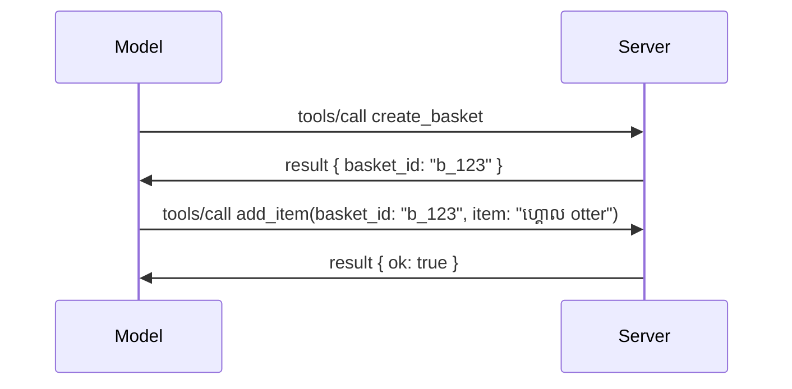

# តើអ្វីខ្លះកំពុងផ្លាស់ប្តូរ​ក្នុង MCP៖ ការចេញផ្សាយឯកសារកក់បញ្ចប់ ២០២៦-០៧-២៨

> **ស្ថានភាព៖** ឯកសារកក់បញ្ចប់។ លក្ខណៈបញ្ជាក់ `2026-07-28` មិនមែនជាចុងក្រោយនៅពេលសរសេរនេះទេ។ វាត្រូវបានប្រកាសនៅថ្ងៃទី ២១ ខែឧសភា ឆ្នាំ ២០២៦ ហើយមានកាលបរិច្ឆេទចេញធ្វើដំណើរ​កាលបរិច្ឆេទ ២៨ ខែកក្កដា ២០២៦។ អ្វីៗទាំងអស់នៅក្នុងមេរៀននេះពណ៌នាអំពីឯកសារកក់បញ្ចប់; សូមពិនិត្យ [លក្ខណៈបញ្ជាក់សេចក្ដីខាងមុខ](https://modelcontextprotocol.io/specification/draft) និង [បញ្ជីផ្លាស់ប្តូរ](https://modelcontextprotocol.io/specification/draft/changelog) របស់វាដើម្បីដឹងពីស្ថានភាពចុងក្រោយមុនពេលអ្នកកសាងជាមួយវា។ មេរៀនផ្សេងទៀតនៃមុខវិជ្ជានេះត្រូវបានសរសេរជាមួយនឹងកំណត់ត្រាទំនើបបំផុត បញ្ជាក់ MCP Specification 2025-11-25 ហើយនឹងត្រូវបានធ្វើបច្ចុប្បន្នភាពបន្ទាប់ពី `2026-07-28` ចេញផ្សាយ។

## ទិដ្ឋភាពទូទៅ

`2026-07-28` ជាការកែប្រែធំបំផុតនៃ MCP ចាប់តាំងពីវាប្រកាសដំណើរការ។ មានឯកសារកែសម្រួលអនុវត្តន៍បួនមួយ (SEPs) ដែលដកចេញសង្ខេបកម្រិត protocol-level sessions និងធ្វើឲ្យ MCP មិនមានស្ថានភាពនៅលើស្រទាប់ដឹកជញ្ជូនទេ; ការពង្រីកក្លាយជាគ្រប់គ្រងជាតម្លៃដំបូងដែលមានជំនាន់ផ្សេងៗ, ហើយលក្ខណៈមួយចំនួនដែលអ្នកបានរៀនពីមុន (Roots, Sampling, Logging) ត្រូវបានគេបញ្ជាក់ថាគ្មានប្រសិទ្ធភាពទៀតក្រោមគោលនយោបាយជីវចក្រថ្មី។ មេរៀននេះសង្ខេបពីអ្វីដែលកំពុងផ្លាស់ប្តូរ, ហេតុអ្វីវាមានសារៈសំខាន់ និងវាមានន័យយ៉ាងដូចម្តេចចំពោះកូដដែលអ្នកបានសរសេរតាម `2025-11-25` មុន។

ប្រភព៖ [ឯកសារកក់បញ្ចប់ MCP ២០២៦-០៧-២៨](https://blog.modelcontextprotocol.io/posts/2026-07-28-release-candidate/) (ប្លក់ Model Context Protocol, David Soria Parra និង Den Delimarsky)។

## គោលបំណងរៀន

នៅចុងបញ្ចប់មេរៀននេះ អ្នកនឹងអាច៖

- អពប្រាប់ថាហេតុអ្វី MCP កំពុងផ្លាស់ទៅជាគោលការណ៍មិនមានស្ថានភាព និងបញ្ហាអ្វីដែលវាដោះស្រាយសម្រាប់ការតំឡើងដែលវិលបញ្ចូនស្រទាប់ទូលាយ។
- ពណ៌នាពីរបៀបដែលការចាប់ដៃ `initialize`/`initialized` និងក្បាល `Mcp-Session-Id` ត្រូវបានជំនួស។
- សម្គាល់ពីក្បាល​ថ្មី `Mcp-Method` និង `Mcp-Name` និងទិន្នន័យ metadata លម្អិត `ttlMs`/`cacheScope`។
- ទទួលស្គាល់សំណុំបណ្ណដើម្បីពង្រីក និងការពង្រីកពីរដែលបញ្ជូនជាមួយការចេញផ្សាយនេះ៖ MCP Apps និង Tasks។
- រាយនាមចំនួនប្រាំមួយ SEP ការអនុញ្ញាតដែលពង្រឹងការតភ្ជាប់ OAuth 2.0 / OIDC។
- កំណត់មុខងារស្នូលណាមួយ (Roots, Sampling, Logging) ដែលឥឡូវនេះគ្មានប្រសិទ្ធភាព និងមានន័យអ្វីក្នុងការអនុវត្ត។
- ពន្យល់ពីការផ្លាស់ប្តូរ Full JSON Schema 2020-12 សម្រាប់ឧបករណ៍ `inputSchema`/`outputSchema`។

## គោលការណ៍មិនមានស្ថានភាព

ការផ្លាស់ប្តូរចម្បង៖ MCP ក្លាយជាគោលការណ៍មិនមានស្ថានភាពនៅស្រទាប់ protocol។

### មុន (2025-11-25): សម័យប្រតិបត្តិធ្វើឲ្យអ្នកពឹងផ្អែកលើម៉ាស៊ីនមេមួយ

ការហៅឧបករណ៍តាម Streamable HTTP ចាប់ផ្តើមដោយការចាប់ដៃ `initialize`។ ម៉ាស៊ីនមេឆ្លើយតបដោយក្បាល `Mcp-Session-Id` ដែលការស្នើរសុំបន្ទាប់ៗគ្រប់អនុវត្តត្រូវយកទៅដាក់៖

```http
POST /mcp HTTP/1.1
Mcp-Session-Id: 1868a90c-3a3f-4f5b
Content-Type: application/json

{"jsonrpc":"2.0","id":2,"method":"tools/call",
 "params":{"name":"search","arguments":{"q":"otters"}}}
```

ពីព្រោះសម័យប្រតិបត្តិជាប់ជាមួយម៉ាស៊ីនមេដែលចេញវា ការតំឡើងកម្មវិធីដែលវិលបញ្ចូនត្រូវការបំជួបការផ្ទុកការតម្រឹម **sticky routing** នៅ load balancer និង **shared session store** នៅលើរាល់ម៉ាស៊ីន។

### បន្ទាប់ពី (2026-07-28): សំណើរ​គ្រប់សំណើស្ថិតនៅក្នុងមួយខ្លួនឯង

```http
POST /mcp HTTP/1.1
MCP-Protocol-Version: 2026-07-28
Mcp-Method: tools/call
Mcp-Name: search
Content-Type: application/json

{"jsonrpc":"2.0","id":1,"method":"tools/call",
 "params":{"name":"search","arguments":{"q":"otters"},
           "_meta":{"io.modelcontextprotocol/clientInfo":{"name":"my-app","version":"1.0"}}}}
```

ម៉ាស៊ីនមេណាមួយក៏អាចដំណើរការសំណើនេះបាន។ ការផ្លាស់ប្តូរចម្បង:

- **ការចាប់ដៃ `initialize`/`initialized` ត្រូវបានដកចេញ** ([SEP-2575](https://github.com/modelcontextprotocol/modelcontextprotocol/pull/2575))។ ជំនាន់ protocol, ព័ត៌មានអតិថិជន និងសមត្ថភាពអតិថិជនមកជាប់នៅ `_meta` លើសំណើរ គ្រប់សំណើ។ របៀបថ្មី `server/discover` ឲ្យអតិថិជនអាចទាញយកសមត្ថភាពម៉ាស៊ីនមេជាមុន។
- **ក្បាល `Mcp-Session-Id` និងសម័យប្រតិបត្តិខ្នាត protocol ត្រូវបានដកចេញ** ([SEP-2567](https://github.com/modelcontextprotocol/modelcontextprotocol/pull/2567))។ មិនបញ្ជាក់ប៉ារ៉ាម៉ែត sticky routing និង shared session ផ្នែក protocol នៃកម្រិត។

### គោលការណ៍មិនមានស្ថានភាព, កម្មវិធីមានស្ថានភាព

ការដកសម័យប្រតិបត្តិក្នុងកម្រិត protocol មិនមានន័យថាម៉ាស៊ីនមេរបស់អ្នកមិនអាចមានស្ថានភាពទេ។ គំរូផ្នែក HTTP ក៏ត្រូវបានណែនាំដូចគ្នា៖ ប្រើលេខសម្គាល់ច្បាប់មួយ (ឧ. `basket_id`, `browser_id`) ពីការហៅឧបករណ៍មួយនៅលើការហៅមួយ, ហើយឲ្យម៉ូដែលបញ្ជូនលេខសម្គាល់មកវិញក្នុងជាអាគុយម៉ង់ធម្មតានៅលើការហៅបន្ទាប់។



វាធ្វើឲ្យស្ថានភាពមើលឃើញបាន និងពិតប្រាកដចំពោះម៉ូដែល ជំនួសការរក្សារស្ថានភាពនៅ metadata ដឹកជញ្ជូន, ហើយចំហរក្នុងមួយម៉ាស៊ីនមេអាចការប្រតិបត្តិការឡើងវិញ។

### សំណើរពីម៉ាស៊ីនមេទៅអតិថិជន បង្កើតឡើងវិញ

គោលការណ៍មិនមានស្ថានភាពត្រូវការវិធីសាស្រ្តមួយសម្រាប់ម៉ាស៊ីនមេស្នើអតិថិជនសម្រាប់អ្វីមួយក្នុងរហូតពេល (ឧ. សំណើបញ្ជាអ្នកយកព័ត៌មាន)៖

- **សំណើរ​ដែលម៉ាស៊ីនមេចាប់ផ្តើមអាចធ្វើបានប៉ុណ្ណោះកំឡុងពេលម៉ាស៊ីនមេកំពុងបំពេញសំណើរអតិថិជន** ([SEP-2260](https://github.com/modelcontextprotocol/modelcontextprotocol/pull/2260)) — វាជាសំណើចាស់មុន តែឥឡូវមិនអនុញ្ញាតឲ្យហៅជាក់លាក់ដោយគ្មានប្រយោជន៍ទេ។ អ្នកប្រើប្រាស់មិនត្រូវបានបញ្ចេញចេញចោលពីគ្រប់ទីកន្លែងទេ។
- **សំណើរច្រើនដង៖ Multi Round-Trip Requests** ([SEP-2322](https://github.com/modelcontextprotocol/modelcontextprotocol/pull/2322)) ជំនួសការកាន់ stream SSE បើក។ ជំនួសម៉ាស៊ីនមេបញ្ជូន `InputRequiredResult`៖

  ```json
  {
    "resultType": "inputRequired",
    "inputRequests": {
      "confirm": {
        "type": "elicitation",
        "message": "Delete 3 files?",
        "schema": { "type": "boolean" }
      }
    },
    "requestState": "eyJzdGVwIjoxLCJmaWxlcyI6WyJhIiwiYiIsImMiXX0="
  }
  ```

អតិថិជនប្រមូលចម្លើយហើយធ្វើការហៅឡើងវិញជាមួយ `inputResponses` រួមបញ្ចូល `requestState` ដែលត្រូវអោយតាមអតិថិជន។ ម៉ាស៊ីនមេណាមួយអាចយកការបញ្ជូនឡើងវិញបាន ព្រោះអ្វីដែលត្រូវមានគ្រប់គ្រាន់នៅក្នុង payload។

### មានភាពអាចដំណើរការ (Routable), អាចផ្ទុកជាសារ (cacheable), ហើយអាចតាមដាន (traceable)

ការផ្លាស់ប្តូរតូចបីនេះធ្វើឲ្យចរន្តមិនមានស្ថានភាពងាយស្រួលក្នុងការប្រតិបត្តិការ:

- **ក្បាល `Mcp-Method` និង `Mcp-Name` ត្រូវការបាននៅ Streamable HTTP** ([SEP-2243](https://github.com/modelcontextprotocol/modelcontextprotocol/pull/2243)) ដើម្បីឲ្យ load balancers, gateways និង rate limiters អាចបញ្ជូនសារបានដោយមិនត្រូវមើល JSON body។ ម៉ាស៊ីនមេបដិសេធសំណើរ​ដែលក្បាលនិងខ្លឹមសារមិនត្រូវគ្នា។
- **`tools/list` និងលទ្ធផល resource read មាន `ttlMs` និង `cacheScope`** ([SEP-2549](https://github.com/modelcontextprotocol/modelcontextprotocol/pull/2549)) ត្រូវបានគំរូលើ HTTP `Cache-Control`។ អតិថិជនដឹងថាលទ្ធផលបញ្ជីថ្មីរយៈពេលប៉ុន្មាន ហើយវាអាចចែករំលែកទៅអ្នកប្រើប្រាស់ផ្សេងទៀតបានយ៉ាងសុវត្ថិភាព ដោយមិនចាំបាច់ផ្សារនៅលើ stream SSE ជាយូរ។
- **ការបម្រែបម្រួលបន្ទាត់ស្នាដៃ W3C នៅ `_meta` បានឯកសារ** ([SEP-414](https://github.com/modelcontextprotocol/modelcontextprotocol/pull/414)) កែលម្អឈ្មោះ key `traceparent`, `tracestate`, និង `baggage` ដើម្បីអាចតាមដានការហៅឆ្លងតាម client SDK, MCP server និងប្រព័ន្ធក្រោមក្នុង backend ដែលគាំទ្រ [OpenTelemetry](https://opentelemetry.io/)។

## ការពង្រីកក្លាយជាមួយតម្លៃក្រមខណ្ឌពីរដង

ការពង្រីកមានរួចមក informally នៅ `2025-11-25`។ [SEP-2133](https://github.com/modelcontextprotocol/modelcontextprotocol/pull/2133) ធ្វើឲ្យពួកវាផ្លូវការឡើង៖

- ការពង្រីកត្រូវបានសម្គាល់ដោយ ID reverse-DNS។
- ពួកវាត្រូវបានចរចារតាមរយៈផែនទី `extensions` លើសមត្ថភាព client និង server។
- ពួកវាផ្អែកលើការប្រមូល ext-* ប្រភពដែលមានអ្នកថែរក្សាទទួលខុសត្រូវ និងមានបំណងជំនាន់ដោយឡែកពី core specification។
- តាមរយៈផ្លូវ SEP មាន ផ្ទាំង Extensions ថ្មី ដែលផ្តល់ផ្លូវពីការបណ្តុះបណ្តាលទៅផ្លូវផ្លូវផ្លូវផ្លូវផ្លូវផ្លូវផ្លូវផ្លូវផ្លូវផ្លូវផ្លូវផ្លូវផ្លូវផ្លូវផ្លូវផ្លូវផ្លូវផ្លូវផ្លូវផ្លូវផ្លូវផ្លូវផ្លូវផ្លូវផ្លូវផ្លូវផ្លូវផ្លូវផ្លូវផ្លូវផ្លូវផ្លូវផ្លូវផ្លូវផ្លូវផ្លូវផ្លូវផ្លូវផ្លូវផ្លូវផ្លូវផ្លូវផ្លូវផ្លូវផ្លូវផ្លូវផ្លូវផ្លូវផ្លូវផ្លូវផ្លូវផ្លូវផ្លូវផ្លូវផ្លូវផ្លូវផ្លូវផ្លូវផ្លូវផ្លូវផ្លូវផ្លូវផ្លូវផ្លូវផ្លូវផ្លូវផ្លូវផ្លូវផ្លូវផ្លូវផ្លូវផ្លូវផ្លូវផ្លូវផ្លូវផ្លូវផ្លូវផ្លូវផ្លូវផ្លូវផ្លូវផ្លូវផ្លូវផ្លូវ។

ការចេញផ្សាយនេះផ្ញើការពង្រីកផ្លូវការពីរប្រភេទ។

### MCP Apps៖ មុខងារបង្ហាញអ្នកប្រើប្រាស់ដែលម៉ាស៊ីនមេបង្ហាញ

[MCP Apps](https://blog.modelcontextprotocol.io/posts/2026-01-26-mcp-apps/) ([SEP-1865](https://github.com/modelcontextprotocol/modelcontextprotocol/pull/1865)) អនុញ្ញាតឲ្យម៉ាស៊ីនមេផ្ញើចំនុចផ្ទាំង HTML មួយដែលម្ចាស់ផ្ទះបង្ហាញនៅក្នុង iframe ផ្ទាំងដាក់ឲ្យមានសុវត្ថិភាព។ ឧបករណ៍បានប្រកាស UI template មុនដើម្បីឲ្យម្ចាស់ផ្ទះអាច prefetch, cache និងពិនិត្យសុវត្ថិភាពមុនពេលអ្វីៗដំណើរការ។ អ្នកបានគ្រប់គ្រងមូលដ្ឋាននេះរួចនៅ [មេរៀន 15: MCP Apps](../03-GettingStarted/15-mcp-apps/README.md) — នៅក្រោមសំណុំបណ្ណ Extensions, MCP Apps ឥឡូវជាការពង្រីកផ្លូវការមិនមែនជាគន្លងសំរាប់កូរ។

### Tasks ឡើងជាការពង្រីក

Tasks បានដឹកនាំដោយមុខងារច្នៃប្រឌិត core នៅ `2025-11-25`។ ការប្រើប្រាស់ផលិតកម្មបានបង្ហាញថាការរចនាថ្មីដែលត្រូវការិយាល័យត្រឹមត្រូវគឺជាការពង្រីកមួយ៖ [ការពង្រីក Tasks](https://github.com/modelcontextprotocol/modelcontextprotocol/pull/2663) ប្ដូរជីវចក្រជុំវិញម៉ូដែលមិនមានស្ថានភាព — ម៉ាស៊ីនមេអាចឆ្លើយតប `tools/call` ជាមួយលេខសម្គាល់ task និងអតិថិជននាំមុខវាជាមួយ `tasks/get`, `tasks/update`, និង `tasks/cancel`។ ការបង្កើត task ត្រូវបានកំណត់ដោយម៉ាស៊ីនមេ៖ អតិថិជនប្រកាសការពង្រីក ហើយម៉ាស៊ីនមេសម្រេចថាតើគួរអោយហៅមួយដំណើរការ ជា task ឬទេ។ `tasks/list` ត្រូវបានដកចេញសរុប ដោយសារវាមិនអាចកំណត់សុវត្ថិភាពដោយគ្មានសម័យទេ។

> **កំណត់ចំណាំបម្លែង៖** ប្រសិនបើអ្នកបានអនុវត្ត API Tasks គន្លងច្នៃប្រឌិត `2025-11-25`, អ្នកត្រូវធ្វើបម្លែងទៅជីវចក្រ​បំផុតថ្មី — វាមិនត្រូវគ្នាជាមួយកំណត់ត្រាដែលមានមុនទេ។

## ការពង្រឹងការអនុញ្ញាត

ប្រាំបួន SEP ពង្រឹង [លក្ខណៈបញ្ជាក់ការអនុញ្ញាត](https://modelcontextprotocol.io/specification/draft/basic/authorization) ដើម្បីឲ្យស្របស្រួលជាមួយការតំឡើង OAuth 2.0 / OpenID Connect និងការប្រើប្រាស់ពិតប្រាកដ៖

| SEP | ការផ្លាស់ប្តូរ |
|---|---|
| [SEP-2468](https://github.com/modelcontextprotocol/modelcontextprotocol/pull/2468) | អតិថិជនត្រូវបញ្ជាក់តម្លៃ `iss` លើការឆ្លើយតបការអនុញ្ញាតទៅតាម [RFC 9207](https://www.rfc-editor.org/rfc/rfc9207), ការការពារការវាយប្រហារជាប្រភេទ mix-up សម្បូរប្រភេទដែលមាននៅក្នុងគំរូ MCP សម្រាប់ client តែមួយ និងម៉ាស៊ីនមេច្រើន។ កំណែខាងមុខនឹងតម្រូវឲ្យបដិសេធការឆ្លើយតបដែលខ្វះ `iss`។ |
| [SEP-837](https://github.com/modelcontextprotocol/modelcontextprotocol/pull/837) | អតិថិជនប្រកាសប្រភេទកម្មវិធី OpenID Connect `application_type` ពេលចុះបញ្ជី Client តាម Dynamic Client Registration, ជៀសវាងម៉ាស៊ីនមេអនុញ្ញាត client ប្រភេទ desktop/CLI ជា `"web"` ហើយបដិសេធ URI redirect localhost របស់វា។ |
| [SEP-2352](https://github.com/modelcontextprotocol/modelcontextprotocol/pull/2352) | អតិថិជនភ្ជាប់សក្ដានុពលដែលបានចុះបញ្ជីជាមួយម៉ាស៊ីនមេអនុញ្ញាត `issuer` ហើយចុះបញ្ជីឡើងវិញពេលធនធានផ្លាស់ទីរវាងម៉ាស៊ីនមេអនុញ្ញាត។ |
| [SEP-2207](https://github.com/modelcontextprotocol/modelcontextprotocol/pull/2207) | ឯកសារលក្ខណៈសម្រាប់របៀបស្នើសុំរ token បន្ថែមពីម៉ាស៊ីនមេអនុញ្ញាតម៉ូដ OpenID Connect។ |
| [SEP-2350](https://github.com/modelcontextprotocol/modelcontextprotocol/pull/2350) | បញ្ជាក់បន្ថែមពីការបញ្ចូល scope នៅពេល step-up authorization។ |
| [SEP-2351](https://github.com/modelcontextprotocol/modelcontextprotocol/pull/2351) | បញ្ជាក់បន្ថែមពី .well-known discovery suffix។ |

ប្រសិនបើអ្នកកំពុងបង្កើតម៉ាស៊ីនមេអនុញ្ញាតសម្រាប់ MCP ថ្ងៃនេះ សូមចាប់ផ្តើមផ្តល់ `iss` លើការឆ្លើយតបអនុញ្ញាតឥឡូវនេះ — សូមមើល [02-Security](../02-Security/README.md) សម្រាប់ការណែនាំសុវត្ថិភាពបច្ចុប្បន្នដែលអាចត្រូវបានទីវាដែលមាន។

## Roots, Sampling និង Logging គ្មានប្រសិទ្ធភាពទៀត

នៅខាងក្រោម [គោលនយោបាយជីវចក្រ (feature lifecycle policy)](https://github.com/modelcontextprotocol/modelcontextprotocol/pull/2577) ([SEP-2577](https://github.com/modelcontextprotocol/modelcontextprotocol/pull/2577)), ពីរបីមុខងារចម្បងរបស់ client អ្នកបានរៀននៅ [Core Concepts](./README.md#roots) បានផ្លាស់ទៅជាស្ថានភាព **Deprecated**៖

| មុខងារ | ការជំនួសដែលបានណែនាំ |
|---|---|
| Roots | ប៉ារ៉ាម៉ែត្រឧបករណ៍, URI ធនធាន, ឬកំណត់រចនាសម្ព័ន្ធម៉ាស៊ីនមេ |
| Sampling | ការរួមបញ្ចូលផ្ទាល់ជាមួយ API អ្នកផ្គត់ផ្គង់ LLM |
| Logging | `stderr` សម្រាប់ការចរន្ត stdio; OpenTelemetry សម្រាប់ការមើលឃើញរចនាសម្ព័ន្ធ |

ទាំងនេះគឺជាការបញ្ជាក់ថាគ្មានប្រសិទ្ធភាពតែប៉ុណ្ណោះ៖ វិធីសាស្រ្ត, ប្រភេទ, និងកំណត់សមត្ថភាពនៅបន្តដំណើរការនៅក្នុងកំណែនេះ និងក្នុងកំណត់ត្រាទាំងអស់ដែលបានបោះពុម្ពផ្សាយក្នុងរយៈពេលមួយឆ្នាំក្រោយមក។ ការដកចេញពួកវាចេញទាំងស្រុងតម្រូវឲ្យមាន SEP ផ្សេងទៀតក្រោមគោលការណ៍ជីវចក្រ — ដូច្នេះមិនមានអ្វីខូចខាតក្នុងគំរូ [Sampling](../03-GettingStarted/14-sampling/README.md) របស់អ្នកថ្ងៃនេះទេ តែម៉ាស៊ីនមេថ្មីគួរតែជ្រើសរើសគំរូជំនួសខាងលើ។

## Full JSON Schema 2020-12 សម្រាប់ឧបករណ៍

ឧបករណ៍ `inputSchema` និង `outputSchema` ត្រូវបានលើកឡើងទៅជាកំណែពេញ [JSON Schema 2020-12](https://json-schema.org/draft/2020-12) ([SEP-2106](https://github.com/modelcontextprotocol/modelcontextprotocol/pull/2106))៖

- ស្កេម input នៅតែរក្សា `type: "object"` ជារំសាលប៉ុន្តែឥឡូវនេះអាចប្រើ composition (`oneOf`, `anyOf`, `allOf`), conditionals និង references (`$ref`, `$defs`) បាន។
- ស្កេម output គ្មានកំណត់ និង `structuredContent` ឥឡូវអាចជាតម្លៃ JSON មួយណាយកលើសពីតែជាវត្ថុ។
- ការអនុវត្តត្រូវមិនបំបែក `$ref` URI ភាគខាងក្រៅដោយស្វ័យប្រវត្តិនឹងត្រូវដាក់កំណត់ជំហានជាទ្រង់ទ្រាយ និងពេលវេលាត្រួតពិនិត្យ (គិតពីការបដិសេធសេវាកម្មក្រោមការគិតពីបញ្ហាសុវត្ថិភាព)។

ផ្នែកបញ្ហាផ្ទាល់ខ្លួន រូបិយប័ណ្ណកូដកំហុសសម្រាប់ធនធានខ្វះបានផ្លាស់ពី MCP-custom `-32002` ទៅជាម៉ាស៊ីន JSON-RPC ស្តង់ដា `-32602` (Invalid Params) ([SEP-2164](https://github.com/modelcontextprotocol/modelcontextprotocol/pull/2164))។ ប្រសិនបើអតិថិជនរបស់អ្នកឆ្លើយតបទៅលើតម្លៃ `-32002` នេះ អ្នកត្រូវធ្វើបច្ចុប្បន្នភាពវា។

## របៀប protocol អភិវឌ្ឍពីទីនេះទៅ

ការចេញផ្សាយនេះមានបម្លែងបង្កក, ដែលអ្នកថែរក្សា MCP មិនមានគម្រោងឲ្យវាជារឿងធម្មតានៅពេលក្រោយទេ។ បី SEP គ្រប់គ្រងមានគោលបំណងបង្ការឲ្យវាបន្តដែរ៖

- **គោលការណ៍ជីវចក្រ** ផ្តល់ផ្លូវមុខជីវ៖ ពី Active → Deprecated → Removed ជាមួយរយៈពេលយ៉ាងហោចណាស់ ១២ ខែចន្លោះពីការជិតអតិផរណា និងការដកចេញព្យួរពេលបានបំផុត។
- **សំណុំបណ្ណ Extensions** អនុញ្ញាតឲ្យមុខងារថ្មីផ្សារជាការពង្រីកជ្រើសរើស និងមានស្ថិរភាពនៅទីនោះ មុនពេល (ប្រសិនបើមាន) ផ្លាស់ឲ្យក្លាយជារបស់ core specification។

- SEP ប្រតិបត្តិការតាមស្តង់ដារ មិនអាចទៅដល់ស្ថានភាពចុងក្រោយឡើយ រហូតដល់មានសេចក្តីបរិយាយភាពឆ្លើយឆ្លងធ្វើការដូចគ្នាក្នុង [conformance suite](https://github.com/modelcontextprotocol/conformance) ([SEP-2484](https://github.com/modelcontextprotocol/modelcontextprotocol/pull/2484)) — ជាស៊ុមដូចគ្នាជាមួយ [SDK tier system](https://github.com/modelcontextprotocol/modelcontextprotocol/pull/1777) ដែលវាយតម្លៃ SDKs ផ្លូវការ។

## កាលវិភាគចេញផ្សាយ និង ការត្រួតពិនិត្យ

- កំណែបេក្ខជនចេញផ្សាយត្រូវបានចាក់ខ្ទប់នៅថ្ងៃទី 21 ខែឧសភា ឆ្នាំ 2026។
- លក្ខណៈបញ្ចប់ផ្លូវការត្រូវបានកំណត់នៅថ្ងៃទី 28 ខែកក្កដា ឆ្នាំ 2026។
- ពេលវេលា១០សប្តាហ៍ចន្លោះពីពីរនេះអនុញ្ញាតឱ្យអ្នកថែទាំ SDK និងអ្នកអនុវត្តកម្មវិធីអតិថិជនបញ្ជាក់ការផ្លាស់ប្តូរប្រកបដោយសុវត្ថិភាពទល់នឹងបំណើតមុខងារពិតប្រាកដ; Tier 1 SDKs មានការរំពឹងថានឹងដឹកជញ្ជូនការគាំទ្រក្នុងរយៈពេលនេះក្រោម [SDK tier system](https://modelcontextprotocol.io/docs/sdk)។
- តាមដានសំណុំការផ្លាស់ប្តូរទាំងមូលនៅ [draft specification](https://modelcontextprotocol.io/specification/draft) និង [changelog](https://modelcontextprotocol.io/specification/draft/changelog)។

## អ្វីដែលមានន័យសម្រាប់មេរៀននេះ

អ្វីដែលអ្នកបានរៀនរហូតមកដល់ពេលនេះក្នុងវគ្គសិក្សានេះ គោលដៅទៅលើ **2025-11-25** ដែលនៅតែកំពុងជាលក្ខណៈបញ្ជាក់ថេរពេលទល់មុន `2026-07-28` ចេញផ្សាយ។ យ៉ាងជាក់លាក់៖

- **សម័យសិក្សា និង ការចាប់ដៃគូ `initialize`** (បានគ្របដណ្ដប់នៅ [Core Concepts](./README.md) និង [Lesson 6: HTTP Streaming](../03-GettingStarted/06-http-streaming/README.md)) នៅតែដំណើរការតាមដែលបានចុះបញ្ជីបច្ចុប្បន្ន ប៉ុន្តេចង់ឱ្យរំពឹងថាវានឹងត្រូវបានជំនួសដោយម៉ូឌែលសំណើរ Stateless នៅលើ ពេលអ្នកធ្វើការកែលម្អទៅឱ្យ SDKs ដែលឆបគ្នានឹង `2026-07-28` ។
- **ការចែងកម្រិតនិង មូលដ្ឋាន** (ក៏បានគ្របដណ្ដប់នៅ [Core Concepts](./README.md)) នៅតែកើតមានដំណើរការទាំងស្រុង ប៉ុន្តែត្រូវបានព្រមានថាអាចមិនប្រើបន្តទៀត — ការរចនាថ្មីគួរតែជ្រើសប្រើម៉ូឌែលជំនួសដែលបានរាយបញ្ជីខាងលើ។
- **មុខងារ ការងារ Experimental** ប្រសិនអ្នកបានប្រើ វាត្រូវចាំបាច់ផ្លាស់ប្តូរទៅកាន់ជំនួយផ្នែក Tasks ពីរបៀបជីវិតថ្មីរបស់វា។
- **កម្មវិធី MCP** ([Lesson 15](../03-GettingStarted/15-mcp-apps/README.md)) មិនមានផលប៉ះពាល់នោះទេ; វាត្រូវបានបញ្ជូនទៅក្រោមស៊ុមផ្នែកផ្លូវការនៃ Extensions។

## ឧបករណ៍បន្ថែម

- [កំណែបេក្ខជនចេញផ្សាយ MCP 2026-07-28 (អត្ថបទប្លុក)](https://blog.modelcontextprotocol.io/posts/2026-07-28-release-candidate/)
- [អនាគតនៃការដឹកជញ្ជូន MCP](https://blog.modelcontextprotocol.io/posts/2025-12-19-mcp-transport-future/)
- [ការបញ្ជាក់ MCP Draft](https://modelcontextprotocol.io/specification/draft)
- [បញ្ជីផ្លាស់ប្តូរ MCP Draft](https://modelcontextprotocol.io/specification/draft/changelog)
- [ SEP Guidelines](https://modelcontextprotocol.io/community/sep-guidelines)
- [ប្រព័ន្ធជំនាន់ SDK MCP](https://modelcontextprotocol.io/docs/sdk)

## ជំហានបន្ទាប់

ត្រឡប់ទៅ [Core Concepts](./README.md) ឬបន្តទៅ [សុវត្ថិភាព](../02-Security/README.md) ដើម្បីមើលថាតើយោបល់ `2025-11-25` ថ្ងៃនេះ សមរម្យយ៉ាងដូចម្តេចជាមួយអ្វីៗដែលនឹងមកដល់។

---

<!-- CO-OP TRANSLATOR DISCLAIMER START -->
**ការបដិសេធ**:
ឯកសារនេះត្រូវបានបម្លែងភាសា ដោយប្រើសេវាបម្លែងភាសា AI [Co-op Translator](https://github.com/Azure/co-op-translator)។ ទោះយើងខ្ញុំមានក្តីប្រាថ្នាឱ្យបានច្បាស់លាស់ តែសូមយល់ដឹងថាការបម្លែងដោយស្វ័យប្រវត្តិក៏អាចមានកំហុសឬភាពមិនត្រឹមត្រូវ។ ឯកសារដើមជាភាសាទីតាំងគួរត្រូវបានគេប្រើជាប្រភពច្បាស់លាស់។ សម្រាប់ព័ត៌មានសំខាន់ៗ សូមណែនាំឱ្យប្រើប្រាស់ការប្រែដោយមនុស្សជំនាញ។ យើងខ្ញុំមិនទទួលខុសត្រូវចំពោះការយល់ច្រឡំ ឬការបកស្រាយខុសបន្ទាប់ពីការប្រើប្រាស់ការបម្លែងនេះនោះទេ។
<!-- CO-OP TRANSLATOR DISCLAIMER END -->