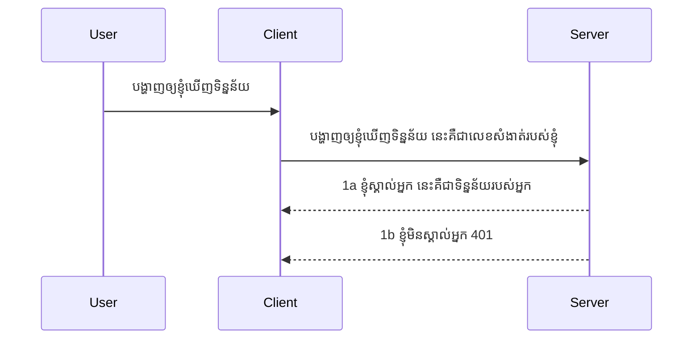

# អ្នកប្រើប្រាស់សាមញ្ញ

SDK MCP គាំទ្រការប្រើប្រាស់ OAuth 2.1 ដែលជាដំណើរការមួយពុំសាមញ្ញ ដែលរួមមានគំនិតដូចជា auth server, resource server, ការបញ្ជូនពាក្យសុំស្នាក់, ការទទួលកូដ, ការប្ដូរកូដទៅជា bearer token រហូតដល់អ្នកអាចទទួលបានទិន្នន័យ resource របស់អ្នក។ ប្រសិនបើអ្នកមិនស្គាល់ OAuth ដែលជារឿងល្អសម្រាប់អភិវឌ្ឍន៍ទេ វាជាគំនិតល្អក្នុងការចាប់ផ្តើមជាមួយ auth មូលដ្ឋានមួយនិងធ្វើអោយមានសុវត្ថិភាពល្អប្រសើរឡើង។ ហេតុនេះផ្នែកនេះមានសុចរិតដើម្បីបង្កើតអ្នកឡើងទៅកាន់ auth ជាប្រព័ន្ធកម្រិតខ្ពស់ជាងនេះ។

## Auth មានន័យដូចម្តេច?

Auth គឺជាការបញ្ចុះខ្លួនសម្រាប់ authentication និង authorization។ គំនិតគឺយើងត្រូវធ្វើរឿងពីរនេះ៖

- **Authentication**, នេះគឺជាចលនាដើម្បីយល់ថាតើយើងអនុញ្ញាតឲ្យមនុស្សម្នាក់ចូលផ្ទះយើង ឬថាគាត់មានសិទ្ធិ "នៅទីនេះ" ដែលមានន័យថាអាចចូលប្រើ resource server ដែលជាទីតាំងនៃមុខងារ MCP Server របស់យើង។
- **Authorization**, គឺជាចលនាដើម្បីស្វែងរកថាតើអ្នកប្រើប្រាស់គួរតែអាចចូលប្រើធនធានណាមួយជាក់លាក់ដែលពួកគេស្នើសុំដែរ ឧទាហរណ៍ ការបញ្ជាទិញ ឬ ផលិតផលខ្លះៗ ឬថាតើពួកគេអនុញ្ញាតអោយអានមាតិការប៉ុណ្ណោះ រីឯមិនអនុញ្ញាតឲ្យលុបបំបាត់។

## ពាក្យសំងាត់: តើយើងប្រាប់ប្រព័ន្ធយ៉ាងដូចម្តេចថាយើងជាអ្នកណា

ហាមបើភាគច្រើនអ្នកអភិវឌ្ឍន៍វេបសាយនឹកដល់ការផ្តល់ពាក្យសំងាត់ទៅម៉ាស៊ីនមេ ជារឿយៗជាពាក្យសម្ងាត់សម្ងាត់មួយដែលចេញបញ្ជាក់ថាអ្នកត្រូវបានអនុញ្ញាតឲ្យស្នាក់នៅទីនេះ “Authentication”។ ពាក្យសម្ងាត់នេះជាទូទៅជា base64 encoded នៃឈ្មោះអ្នកប្រើប្រាស់និងពាក្យសម្ងាត់ឬតាម API key ដែលមានលក្ខណៈតែមួយសម្រាប់អ្នកប្រើប្រាស់ជាក់លាក់ម្នាក់។

នេះប្រើការបញ្ជូនតាម header ដែលមានឈ្មោះ "Authorization" ដូចខាងក្រោម៖

```json
{ "Authorization": "secret123" }
```

នេះត្រូវបានហៅថា basic authentication។ របៀបដំណើរការទូទៅគឺដូចខាងក្រោម៖



ឥឡូវនេះយើងបានយល់ពីរបៀបដំណើរការពីទិសដៅ flow រួចហើយ តើយើងអាចអនុវត្តដូចម្តេច? ភាគច្រើនម៉ាស៊ីនមេវេបមានមុខងារមួយហៅ middleware ដែលជាកូដមួយដែលរត់ជាផ្នែកនៃសំណើនិងអាចផ្ទៀងផ្ទាត់ពាក្យសំងាត់បាន ហើយប្រសិនបើពាក្យសំងាត់ត្រឹមត្រូវអាចអនុញ្ញាតឲ្យសំណើចូល។ បើសំណើមិនមានពាក្យសំងាត់ត្រឹមត្រូវ អ្នកនឹងទទួលបានកំហុស auth មួយ។ ឲ្យយើងមើលវិធីអនុវត្តនេះ៖

**Python**

```python
class AuthMiddleware(BaseHTTPMiddleware):
    async def dispatch(self, request, call_next):

        has_header = request.headers.get("Authorization")
        if not has_header:
            print("-> Missing Authorization header!")
            return Response(status_code=401, content="Unauthorized")

        if not valid_token(has_header):
            print("-> Invalid token!")
            return Response(status_code=403, content="Forbidden")

        print("Valid token, proceeding...")
       
        response = await call_next(request)
        # បន្ថែមក្បាលអតិថិជនណាមួយឬផ្លាស់ប្តូរពីរបotrop្រសិនបើយោងតាមមួយវិធីណាមួយ
        return response


starlette_app.add_middleware(CustomHeaderMiddleware)
```

នៅទីនេះយើងមាន៖

- បានបង្កើត middleware មួយហៅថា `AuthMiddleware` ដែលមានមុខងារ `dispatch` ត្រូវបានហៅដោយម៉ាស៊ីនមេវេប។
- បន្ថែម middleware ទៅម៉ាស៊ីនមេវេប៖

    ```python
    starlette_app.add_middleware(AuthMiddleware)
    ```

- បានសរសេរលក្ខខណ្ឌផ្ទៀងផ្ទាត់ថាតើ Authorization header មាន និងពាក្យសម្ងាត់ដែលផ្ញើមកត្រឹមត្រូវឬអត់៖

    ```python
    has_header = request.headers.get("Authorization")
    if not has_header:
        print("-> Missing Authorization header!")
        return Response(status_code=401, content="Unauthorized")

    if not valid_token(has_header):
        print("-> Invalid token!")
        return Response(status_code=403, content="Forbidden")
    ```

ប្រសិនបើពាក្យសម្ងាត់មាននិងត្រឹមត្រូវ យើងអនុញ្ញាតឲ្យសំណើចូលដោយហៅ `call_next` ហើយបញ្ជូនការឆ្លើយតបត្រឡប់។

    ```python
    response = await call_next(request)
    # បន្ថែមឬផ្លាស់ប្តូរឫសារដឹកជញ្ជូនអតិថិជនណាមួយក្នុងការឆ្លើយតបដោយរបៀបមួយ
    return response
    ```

វាដំណើរការដូចខាងក្រោម៖ ប្រសិនបើមានសំណើទៅម៉ាស៊ីនមេ middleware នឹងត្រូវបានហៅ ហើយតាមការអនុវត្ត នឹងអនុញ្ញាតឲ្យសំណើចូល ឬបន្តិចត្រួតពិនិត្យកំហុសដែលបង្ហាញថាអតិថិជនមិនបានអនុញ្ញាតឲ្យបន្ត។

**TypeScript**

នៅទីនេះយើងបង្កើត middleware ជាមួយ framework ពេញនិយម Express ហើយបញ្ឈប់សំណើមុនពេលវា ទៅដល់ MCP Server។ នេះជាកូដសម្រាប់វា៖

```typescript
function isValid(secret) {
    return secret === "secret123";
}

app.use((req, res, next) => {
    // 1. មានក្បាលអំណាចចូលថែមទេ?
    if(!req.headers["Authorization"]) {
        res.status(401).send('Unauthorized');
    }
    
    let token = req.headers["Authorization"];

    // 2. ពិនិត្យភាពត្រឹមត្រូវ។
    if(!isValid(token)) {
        res.status(403).send('Forbidden');
    }

   
    console.log('Middleware executed');
    // 3. ផ្ញើរ​​សំណើទៅជំហ៊ានបន្ទាប់នៅក្នុងបែបផែនសំណើ។
    next();
});
```

ក្នុងកូដនេះយើងធ្វើដូចជា:

1. ពិនិត្យមើលថា Authorization header មានមិនមាន នៅទីដើម បើគ្មាន យើងផ្ញើកំហុស 401។
2. ប្រាកដថាពាក្យសម្ងាត់/token ត្រឹមត្រូវ បើមិនមាន យើងផ្ញើកំហុស 403។
3. ចុងក្រោយ អនុញ្ញាតឲ្យសំណើបន្ត​ក្នុង​ប្រព័ន្ធដំណួញសំណើ ហើយបញ្ជូនធនធានដែលបានស្នើ។

## ស្វ័យសាកល្បង៖ អនុវត្ត authentication

យើងយកចំណេះដឹងរបស់យើងនិងព្យាយាមអនុវត្តវា។ នេះជាផែនការ៖

ម៉ាស៊ីនមេ

- បង្កើតម៉ាស៊ីនមេវេបនិង instance MCP។
- អនុវត្ត middleware សម្រាប់ម៉ាស៊ីនមេ។

អតិថិជន

- ផ្ញើសំណើវេបជាមួយពាក្យសំងាត់ តាម header។

### -1- បង្កើតម៉ាស៊ីនមេវេបនិង instance MCP

> **ប្រយ័ត្នមុន៖** ឧទាហរណ៍ TypeScript ខាងក្រោម បន្តតាមដានការដឹកជញ្ជូន HTTP នៅក្នុង `transports` map ដែលមូលដ្ឋានពី `mcp-session-id` តាម **ពិពណ៌នាមុខងារ MCP កាលបរិច្ឆេទ 2025-11-25**។ ការចេញជារូបមន្ត candidate ផ្សព្វផ្សាយ 2026-07-28 យកចេញការចាប់ផ្តើម `initialize` និង session ID ពីរបៀបនេះ ដូច្នេះផែនទីការដឹកជញ្ជូនប្រកបដោយ session នេះនឹងបាត់បង់ទៅ ដើម្បីអនុញ្ញាតសំណើដែលមានរូបភាព stateless, self-contained។ មើល [អ្វីខ្លះកំពុងផ្លាស់ប្ដូរនៅ MCP: ការចេញជារូបមន្ត 2026-07-28](../../01-CoreConcepts/mcp-2026-07-28-release-candidate.md)។

នៅជំហានដំបូង យើងត្រូវបង្កើត instance ម៉ាស៊ីនមេវេប និង MCP Server។

**Python**

នៅទីនេះ យើងបង្កើត instance MCP server បង្កើតកម្មវិធីវេប starlette និងបម្រើវាជាមួយ uvicorn។

```python
# កំពុងបង្កើតម៉ាស៊ីនបម្រើ MCP

app = FastMCP(
    name="MCP Resource Server",
    instructions="Resource Server that validates tokens via Authorization Server introspection",
    host=settings["host"],
    port=settings["port"],
    debug=True
)

# កំពុងបង្កើតកម្មវិធីវែប starlette
starlette_app = app.streamable_http_app()

# កំពុងផ្តល់សេវាកម្មកម្មវិធីតាម uvicorn
async def run(starlette_app):
    import uvicorn
    config = uvicorn.Config(
            starlette_app,
            host=app.settings.host,
            port=app.settings.port,
            log_level=app.settings.log_level.lower(),
        )
    server = uvicorn.Server(config)
    await server.serve()

run(starlette_app)
```

ក្នុងកូដនេះ យើងធ្វើ៖

- បង្កើត MCP Server។
- បង្កើតកម្មវិធីវេប starlette ពី MCP Server, `app.streamable_http_app()`។
- បម្រើកម្មវិធីវេបដោយ uvicorn `server.serve()`។

**TypeScript**

នៅទីនេះ យើងបង្កើត instance MCP Server។

```typescript
const server = new McpServer({
      name: "example-server",
      version: "1.0.0"
    });

    // ... កំណត់ធនធានម៉ាស៊ីនមេ, ឧបករណ៍ និងការបញ្ចូនចេញ ...
```

ការបង្កើត MCP Server នេះត្រូវធ្វើនៅក្នុងពង្រឹងគន្លង POST /mcp ដូច្នេះយើងយកកូដខាងលើហើយដាក់វាលើនេះ៖

```typescript
import express from "express";
import { randomUUID } from "node:crypto";
import { McpServer } from "@modelcontextprotocol/sdk/server/mcp.js";
import { StreamableHTTPServerTransport } from "@modelcontextprotocol/sdk/server/streamableHttp.js";
import { isInitializeRequest } from "@modelcontextprotocol/sdk/types.js"

const app = express();
app.use(express.json());

// ផែនទីសម្រាប់រក្សារទំនិញតាម ID សម័យ
const transports: { [sessionId: string]: StreamableHTTPServerTransport } = {};

// ឆ្លើយតបការស្នើសុំ POST សម្រាប់ការទំនាក់ទំនងពីអតិថិជនទៅម៉ាស៊ីនមេ
app.post('/mcp', async (req, res) => {
  // ពិនិត្យមើលការត្រូវមានសម័យ ID
  const sessionId = req.headers['mcp-session-id'] as string | undefined;
  let transport: StreamableHTTPServerTransport;

  if (sessionId && transports[sessionId]) {
    // ប្រើឡើងវិញការដឹកជញ្ជូនដែលមានស្រាប់
    transport = transports[sessionId];
  } else if (!sessionId && isInitializeRequest(req.body)) {
    // ស្នើសុំចាប់ផ្តើមថ្មី
    transport = new StreamableHTTPServerTransport({
      sessionIdGenerator: () => randomUUID(),
      onsessioninitialized: (sessionId) => {
        // រក្សាទុកការដឹកជញ្ជូនតាម ID សម័យ
        transports[sessionId] = transport;
      },
      // ការពារការប្តូរឈ្មោះ DNS ត្រូវបានបិទនៅលំនាំដើមសម្រាប់ការចងចាំត្រឡប់ក្រោយ។ ប្រសិនបើអ្នកដំណើរការម៉ាស៊ីនមេនេះ
      // នៅក្នុងតំបន់មូលដ្ឋាន សូមធ្វើការកំណត់៖
      // enableDnsRebindingProtection: true,
      // allowedHosts: ['127.0.0.1'],
    });

    // សម្អាតការដឹកជញ្ជូនពេលបិទ
    transport.onclose = () => {
      if (transport.sessionId) {
        delete transports[transport.sessionId];
      }
    };
    const server = new McpServer({
      name: "example-server",
      version: "1.0.0"
    });

    // ... រៀបចំធនធានម៉ាស៊ីនមេ, ឧបករណ៍ និងការជូនដំណឹង ...

    // ភ្ជាប់ទៅម៉ាស៊ីនមេ MCP
    await server.connect(transport);
  } else {
    // សំណើមានកំហុស
    res.status(400).json({
      jsonrpc: '2.0',
      error: {
        code: -32000,
        message: 'Bad Request: No valid session ID provided',
      },
      id: null,
    });
    return;
  }

  // ដៃគូចំពោះសំណើ
  await transport.handleRequest(req, res, req.body);
});

// ដៃគូដែលអាចប្រើឡើងវិញសម្រាប់សំណើ GET និង DELETE
const handleSessionRequest = async (req: express.Request, res: express.Response) => {
  const sessionId = req.headers['mcp-session-id'] as string | undefined;
  if (!sessionId || !transports[sessionId]) {
    res.status(400).send('Invalid or missing session ID');
    return;
  }
  
  const transport = transports[sessionId];
  await transport.handleRequest(req, res);
};

// ដៃគូសម្រាប់សំណើ GET សម្រាប់ការជូនដំណឹងពីម៉ាស៊ីនមេទៅអតិថិជនតាមរយៈ SSE
app.get('/mcp', handleSessionRequest);

// ដៃគូសម្រាប់សំណើ DELETE សម្រាប់បញ្ចប់សម័យ
app.delete('/mcp', handleSessionRequest);

app.listen(3000);
```

ឥឡូវអ្នកឃើញពីរបៀបដែលការបង្កើត MCP Server ត្រូវបានផ្លាស់ទៅក្នុង `app.post("/mcp")`។

យើងបន្តទៅជំហានបន្ទាប់គឺបង្កើត middleware ដើម្បីផ្ទៀងផ្ទាត់ពាក្យសំងាត់ចូល។

### -2- អនុវត្ត middleware សម្រាប់ម៉ាស៊ីនមេ

យើងទៅផ្នែក middleware បន្ទាប់។ នៅទីនេះ យើងនឹងបង្កើត middleware ដែលស្វែងរកពាក្យសំងាត់ក្នុង `Authorization` header ហើយផ្ទៀងផ្ទាត់វា។ ប្រសិនបើវា អាចទទួលយកបាន សំណើនឹងបន្តទៅកាន់មុខងារដែលត្រូវធ្វើ (ឧ. បង្ហាញបញ្ជី ឬ អានធនធាន ឬ មុខងារ MCP ដែលអតិថិជនស្នើសុំ)។

**Python**

ដើម្បីបង្កើត middleware, យើងត្រូវបង្កើតថ្នាក់មួយដែលស្នើឲ្យមានពី `BaseHTTPMiddleware`។ មានរឿងចំរូងពីរដែលគួរពិចារណា៖

- សំណើ `request` ដែលយើងអានព័ត៌មាន header ពីវា។
- `call_next` ជាការហៅថយដែលយើងត្រូវហៅប្រសិនបើអតិថិជនផ្តល់ពាក្យសំងាត់ដែលយើងទទួលយកបាន។

ជំហានដំបូង យើងត្រូវដោះស្រាយករណីបើ `Authorization` header មិនមាន៖

```python
has_header = request.headers.get("Authorization")

# មិនមានក្បាលមួយឡើយ បរាជ័យជាមួយលេខកូដ ៤០១ បើមិនដូច្នេះបន្តទៅ។
if not has_header:
    print("-> Missing Authorization header!")
    return Response(status_code=401, content="Unauthorized")
```

នៅទីនេះ យើងផ្ញើសារ 401 unauthorized ព្រោះអតិថិជនបរាជ័យក្នុងការផ្ទៀងផ្ទាត់។

បន្ទាប់មក ប្រសិនបើពាក្យសំងាត់ត្រូវបានផ្ញើមក យើងត្រូវត្រួតពិនិត្យតុល្យភាពរបស់វាដូចខាងក្រោម:

```python
 if not valid_token(has_header):
    print("-> Invalid token!")
    return Response(status_code=403, content="Forbidden")
```

សម្រួលចំលើយចំពោះ 403 forbidden ខាងលើ។ ឲ្យយើងមើល middleware ពេញលេញនៅខាងក្រោមដែលបានអនុវត្តពីរឿងដែលបាននិយាយខាងលើ៖

```python
class AuthMiddleware(BaseHTTPMiddleware):
    async def dispatch(self, request, call_next):

        has_header = request.headers.get("Authorization")
        if not has_header:
            print("-> Missing Authorization header!")
            return Response(status_code=401, content="Unauthorized")

        if not valid_token(has_header):
            print("-> Invalid token!")
            return Response(status_code=403, content="Forbidden")

        print("Valid token, proceeding...")
        print(f"-> Received {request.method} {request.url}")
        response = await call_next(request)
        response.headers['Custom'] = 'Example'
        return response

```

ល្អ ប៉ុន្តែ `valid_token` function ជាអ្វី? នៅទីនេះ៖

```python
# កុំប្រើសម្រាប់ផលិតកម្ម - សូមធ្វើឲ្យប្រសើរឡើង!!
def valid_token(token: str) -> bool:
    # ដក prefix "Bearer " ចេញ
    if token.startswith("Bearer "):
        token = token[7:]
        return token == "secret-token"
    return False
```

នេះគួរតែមានការកែលម្អបន្ថែម។

IMPORTANT: អ្នកមិនគួររក្សារពាក្យសម្ងាត់បែបនេះនៅក្នុងកូដទេ។ អ្នកគួរទាញបានតម្លៃដែលត្រូវប្រៀបធៀបពីប្រភពទិន្នន័យ ឬពី IDP (identity service provider) ឬកាន់តែប្រសើរជាងនេះ អនុញ្ញាតឲ្យ IDP ផ្ទៀងផ្ទាត់។

**TypeScript**

ដើម្បីអនុវត្តនេះជាមួយ Express, យើងត្រូវហៅមុខងារ `use` ដែលទទួល middleware functions។

យើងត្រូវ៖

- អន្តរកម្មជាមួយសំណើដើម្បីពិនិត្យពាក្យសំងាត់ដែលបានផ្ទេរនៅក្នុង `Authorization` property។
- ផ្ទៀងផ្ទាត់ពាក្យសំងាត់ ហើយបើបាន អនុញ្ញាតឲ្យសំណើបន្ត ហើយធ្វើអ្វីដែលអតិថិជនស្នើ (ឧ. បង្ហាញបញ្ជី ឬ អានធនធាន ឬយ៉ាងហោចណាស់ការស្នើសុំ MCP)។

នៅទីនេះ យើងពិនិត្យមើលថា `Authorization` header មានមិនមាន ហើយ ប្រសិនបើគ្មាន យើងបញ្ឈប់ការស្នើសុំ៖

```typescript
if(!req.headers["authorization"]) {
    res.status(401).send('Unauthorized');
    return;
}
```

ប្រសិនបើ header មិនបានផ្ញើ ទីបំផុត អ្នកទទួលបានកំហុស 401។

បន្ទាប់មក យើងពិនិត្យថាពាក្យសំងាត់ត្រឹមត្រូវមែនទេ ប្រសិនបើមិនបាន យើងបញ្ឈប់សំណើទៀតដោយប្រើសារ តម្លៃផ្សេងពីមុន៖

```typescript
if(!isValid(token)) {
    res.status(403).send('Forbidden');
    return;
} 
```

សំគាល់ថាអ្នកទទួលបានកំហុស 403។

នេះគឺជាកូដពេញលេញៈ

```typescript
app.use((req, res, next) => {
    console.log('Request received:', req.method, req.url, req.headers);
    console.log('Headers:', req.headers["authorization"]);
    if(!req.headers["authorization"]) {
        res.status(401).send('Unauthorized');
        return;
    }
    
    let token = req.headers["authorization"];

    if(!isValid(token)) {
        res.status(403).send('Forbidden');
        return;
    }  

    console.log('Middleware executed');
    next();
});
```

យើងបានរៀបចំម៉ាស៊ីនមេរួចសម្រាប់ទទួល middleware ដើម្បីពិនិត្យពាក្យសំងាត់ដែលអតិថិជនសង្ឃឹមថានឹងផ្ញើមក។ តើយើងត្រូវធ្វើអ្វីជាមួយអតិថិជនដែរ?

### -3- ផ្ញើសំណើវេបជាមួយពាក្យសំងាត់តាម header

យើងត្រូវប្រាកដថាអតិថិជនផ្ញើពាក្យសម្ងាត់តាម header។ ព្រោះយើងនឹងប្រើ MCP client ដើម្បីធ្វើ របៀបនេះ ត្រូវអោយយើងស្វែងរកវិធីធ្វើវា។

**Python**

សម្រាប់អតិថិជន យើងត្រូវផ្ញើ header ជាមួយពាក្យសម្ងាត់ដូចខាងក្រោម៖

```python
# កុំដាក់តម្លៃជាកូដតាំងពីដើម សូមរក្សាទុកវាទុកយ៉ាងតិចនៅក្នុងអថេរបរិវេណឬឃ្លាំងទិន្នន័យដែលមានសុវត្ថិភាពជាងនេះ
token = "secret-token"

async with streamablehttp_client(
        url = f"http://localhost:{port}/mcp",
        headers = {"Authorization": f"Bearer {token}"}
    ) as (
        read_stream,
        write_stream,
        session_callback,
    ):
        async with ClientSession(
            read_stream,
            write_stream
        ) as session:
            await session.initialize()
      
            # TODO, អ្វីដែលអ្នកចង់អោយធ្វើនៅក្នុងអ្នកប្រើប្រាស់ ឧទាហរណ៍បញ្ជីឧបករណ៍ ហៅឧបករណ៍ ជាដើម។
```

សំគាល់ថាយើងបំពេញ `headers` ដូចរូបថត៖ ` headers = {"Authorization": f"Bearer {token}"}`។

**TypeScript**

យើងអាចដោះស្រាយវាជាជំហានពីរដូចខាងក្រោម៖

១. បំពេញវត្ថុ configuration ជាមួយពាក្យសំងាត់។
២. ផ្ញើវត្ថុ configuration ទៅ transport។

```typescript

// កុំកូដតម្លៃរឹងដូចដែលបង្ហាញនៅទីនេះ។ យ៉ាងហោចណាស់គួរតែមានវាជាតម្លៃបរិយាកាសហើយប្រើអ្វីមួយដូចជា dotenv (នៅក្នុងរបៀបអភិវឌ្ឍ)។
let token = "secret123"

// កំណត់វត្ថុជម្រើសអតិថិជនសម្រាប់ដឹកជញ្ជូន
let options: StreamableHTTPClientTransportOptions = {
  sessionId: sessionId,
  requestInit: {
    headers: {
      "Authorization": "secret123"
    }
  }
};

// បញ្ជូនវត្ថុជម្រើសទៅដល់ដឹកជញ្ជូន
async function main() {
   const transport = new StreamableHTTPClientTransport(
      new URL(serverUrl),
      options
   );
```

នៅទីនេះ អ្នកអាចមើលថាយើងបានបង្កើតវត្ថុ `options` ហើយដាក់ header របស់យើងក្រោមគុណលក្ខណៈ `requestInit`។

IMPORTANT: តើយើងធ្វើដូចម្តេចដើម្បីកែលម្អពីនេះ? ប្រសិនបើ សកម្មភាពនេះកើតមានបញ្ហា។ ដំបូងបំផុត ការផ្ញើពាក្យសំងាត់បែបនេះគឺគ្រោះថ្នាក់ ប្រសិនបើមិនមាន HTTPS ទេ។ ទោះយ៉ាងណា ពាក្យសម្ងាត់នេះអាចត្រូវបានគេចាប់យកបាន ដូច្នេះអ្នកត្រូវចេះប្រើប្រព័ន្ធដែលអាចបោះបង់ token បានយ៉ាងងាយស្រួល ហើយបន្ថែមការត្រួតពិនិត្យថាតើវាមកពីទីណារបស់លោកអ្នក ហើយសំណើត្រូវបានធ្វើស្ទើរតែច្រើន מדי (ចលនាបូត)។ មានសារសំខាន់ជាច្រើន។

តែក៏គួរបញ្ជាក់ថា សម្រាប់ API ងាយៗណាមួយដែលអ្នកមិនចង់ឲ្យអ្នកណាម្នាក់ហៅ API របស់អ្នកដោយគ្មានការ authenticate តួអ្វីដែលយើងមាននៅទីនេះគឺការចាប់ផ្តើមល្អមួយ។

ជាមួយនឹងនេះ យើងព្យាយាមពង្រឹងសុវត្ថិភាពបន្តិចដោយប្រើម៉ូទ្រីកស្លាកដែលបានបញ្ជាក់ជាដំណើរការ JSON Web Token ឬត្រូវបានគេហៅជារៀងរាល់ JWT ឬ “JOT” tokens។

## JSON Web Tokens, JWT

ដូច្នេះ យើងកំពុងព្យាយាមធ្វើឲ្យវាល្អប្រសើរពីការផ្ញើពាក្យសម្ងាត់សាមញ្ញ។ តើការកែលម្អភ្លាមៗដែលយើងទទួលបានពីការជ្រើសរើស JWT មានអ្វីខ្លះ?

- **ការកែលម្អសុវត្ថិភាព**។ នៅក្នុង basic auth អ្នកផ្ញើឈ្មោះអ្នកប្រើនិងពាក្យសម្ងាត់ជាតំណ token base64 (ឬ API key) ជាប់ៗគ្នា ដូច្នេះបង្កើនហានិភ័យ។ ជាមួយ JWT អ្នកផ្ញើឈ្មោះអ្នកប្រើនិងពាក្យសម្ងាត់ ហើយទទួលបាន token ត្រឡប់មក វាក៏ជាការតំណាងពេលវេលាដែលនឹងផុតកំណត់ផងដែរ។ JWT អនុញ្ញាតឲ្យប្រើការត្រួតពិនិត្យចូលប្រើចំរូងនៃតួនាទី, សកលវិទ្យា និងសិទ្ធិ។
- **ស្ថិតស្ថេរ និង វាស់ស្ទង់**។ JWTs មានរូបភាពផ្ទាល់ខ្លួន ដែលបូលបន្ទុកព័ត៌មានអ្នកប្រើទាំងអស់ និងលុបចោលការត្រូវការផ្ទុកសម័យនៅម៉ាស៊ីនមេ។ តokens អាចត្រូវបានផ្ទៀងផ្ទាត់នៅក្នុងតំបន់មូលដ្ឋាន។
- **អន្តរប្រតិបត្តិ និង សហព័ន្ធ**។ JWTs គឺជាមូលដ្ឋាននៃ Open ID Connect និងត្រូវបានប្រើជាមួយអ្នកផ្គត់ផ្គង់អត្តសញ្ញាណដូចជា Entra ID, Google Identity និង Auth0។ ពួកវាក៏អាចប្រើដំណើរការចូលតែមួយ និងផ្សេងៗបន្ថែមដែលធ្វើឲ្យវាជាមួយសមត្ថភាពសម្រាប់សហគ្រាស។
- **ការ Modular និង បត់បែន**។ JWTs អាចប្រើជាមួយ API Gateways ដូចជា Azure API Management, NGINX, និងផ្សេងៗទៀត។ វាគាំទ្រជាពិសេសស្ថានភាព authentication និងការទំនាក់ទំនងម៉ាស៊ីនមើលម៉ាស៊ីនរួមមាន impersonation និង delegation។
- **កម្រិតសមត្ថភាព និង ការផ្ទុកសម័យ**។ JWTs អាចទៅរកបានបន្ទាប់ពី decode ដែលកាត់បន្ថយការតម្រង់ទិន្នន័យ។ វាជួយជាក់លាក់ជាមួយកម្មវិធីមានចរាចរណ៍ខ្ពស់ ដោយពង្រឹងការបញ្ចេញនិងកាត់បន្ថយទមន់លើគ្រឹះស្ថានប្រើប្រាស់របស់អ្នក។
- **មុខងារកម្រិតខ្ពស់**។ វាក៏គាំទ្ររូបមន្ត introspection (ពិនិត្យត្រឹមត្រូវនៅម៉ាស៊ីនមេ) និង revocation (ធ្វើឲ្យ token មិនត្រឹមត្រូវ)។

ជាមួយអត្ថប្រយោជន៍ទាំងនេះ ឲ្យយើងមើលពីរបៀបអនុវត្តរបស់យើងទៅកាន់កម្រិតបន្ថែម។

## ការបំលែង basic auth ទៅជា JWT

ដូច្នេះ ការប្តូរដែលយើងត្រូវធ្វើនៅកម្រិតខ្ពស់មានដូចជា៖

- **រៀនបង្កើត JWT token** ហើយធ្វើឲ្យវាឈរជាស្រេចសម្រាប់ផ្ញើពីអតិថិជនទៅម៉ាស៊ីនមេ។
- **ផ្ទៀងផ្ទាត់ JWT token** ហើយប្រសិនបើត្រឹមត្រូវ អនុញ្ញាតឲ្យអតិថិជនអាចប្រើធនធានរបស់យើង។
- **រក្សាទុក token ជាសុវត្ថិភាព**។ តើយើងរក្សាទុក token នេះយ៉ាងដូចម្តេច។
- **ការការពារ ផ្លូវចូល**។ យើងត្រូវការពារផ្លូវចូល មុខងារ MCP ជាក់លាក់។
- **បន្ថែម refresh tokens**។ ប្រុងប្រាកដថា យើងបង្កើត token ដែលមានអាយុកាលខ្លី ប៉ុន្តែមាន refresh tokens ដែលមានអាយុកាលវែង ដើម្បីទទួលបាន tokens ថ្មីបើ token ផុតកំណត់។ ចំណាំថាមាន endpoint refresh និងយុទ្ធសាស្ត្របម្លែង។

### -1- បង្កើត JWT token

ជំហានដំបូង JWT token មានផ្នែកដូចខាងក្រោម៖

- **header**, អាល់ហ្គរីធម៍ដែលបានប្រើ និងប្រភេទ token។
- **payload**, ការអះអាង claims ដូចជា sub (អ្នកប្រើ ឬអង្គភាពដែល token តំណាង), exp (ពេលផុតកំណត់), role (តួនាទី)
- **signature**, បានចុះហត្ថលេខាដោយសម្ងាត់ ឬ key ឯកជន។

ចំពោះនេះ យើងត្រូវបង្កើត header, payload និង token encode។

**Python**

```python

import jwt
import jwt
from jwt.exceptions import ExpiredSignatureError, InvalidTokenError
import datetime

# កូនសោរពិសេសដែលប្រើសម្រាប់ចុះហត្ថលេខាលើ JWT
secret_key = 'your-secret-key'

header = {
    "alg": "HS256",
    "typ": "JWT"
}

# ព័ត៌មានអ្នកប្រើ និងការទាមទាររបស់វា និងពេលផុតកំណត់
payload = {
    "sub": "1234567890",               # មុខវិជ្ជា (អត្តសញ្ញាណអ្នកប្រើ)
    "name": "User Userson",                # ការទាមទារផ្ទាល់ខ្លួន
    "admin": True,                     # ការទាមទារផ្ទាល់ខ្លួន
    "iat": datetime.datetime.utcnow(),# ចេញផ្សាយនៅ
    "exp": datetime.datetime.utcnow() + datetime.timedelta(hours=1)  # ផុតកំណត់
}

# រ.Encode វា
encoded_jwt = jwt.encode(payload, secret_key, algorithm="HS256", headers=header)
```

នៅក្នុងកូដខាងលើ យើងបាន៖

- កំណត់ header ប្រើ HS256 ជាអាល់ហ្គរីធម៍ និង ប្រភេទ JWT។
- បង្កើត payload ដែលមានប្រធានបទ ឬ user id, ឈ្មោះអ្នកប្រើ, តួនាទី, ពេលវា ចេញផ្សាយ និង ពេលវាធ្វើអោយផុតកំណត់ ដូច្នេះ អនុវត្តពីរសម័យព្រមទាំង។

**TypeScript**

នៅទីនេះយើងត្រូវការជំនួយខ្លះៗដើម្បីជួយបង្កើត JWT token។

ជំនួយ

```sh

npm install jsonwebtoken
npm install --save-dev @types/jsonwebtoken
```

ឥឡូវនេះដែលយើងបានវា សូមបង្កើត header, payload ហើយតាមរយៈវា បង្កើត token encode។

```typescript
import jwt from 'jsonwebtoken';

const secretKey = 'your-secret-key'; // ប្រើអថេរបរិស្ថានក្នុងការផលិត

// កំណត់ផ្ទុកទិន្នន័យ
const payload = {
  sub: '1234567890',
  name: 'User usersson',
  admin: true,
  iat: Math.floor(Date.now() / 1000), // ចេញផ្សាយនៅ
  exp: Math.floor(Date.now() / 1000) + 60 * 60 // ផុតកំណត់ក្នុង១ម៉ោង
};

// កំណត់ចំណងជើង (ជាជម្រើស, jsonwebtoken កំណត់លំនាំដើម)
const header = {
  alg: 'HS256',
  typ: 'JWT'
};

// បង្កើតសញ្ញា
const token = jwt.sign(payload, secretKey, {
  algorithm: 'HS256',
  header: header
});

console.log('JWT:', token);
```

តokens នេះគឺ៖

ចុះហត្ថលេខាដោយប្រើ HS256
មានសុពលភាព ១ ម៉ោង
មានការអះអាងដូចជា sub, name, admin, iat, និង exp។

### -2- ផ្ទៀងផ្ទាត់ token

យើងត្រូវការផ្ទៀងផ្ទាត់ token នេះផងដែរ។ វាជារឿងដែលត្រូវធ្វើនៅម៉ាស៊ីនមេ ដើម្បីប្រាកដថាអ្វីដែលអតិថិជនផ្ញើមកពិតជាត្រឹមត្រូវ។ មានច្រើននូវការត្រួតពិនិត្យគួរធ្វើនៅទីនេះ ពីការផ្ទៀងផ្ទាត់រចនាសម្ព័ន្ធរបស់វាទៅដល់តុល្យភាពរបស់វា។ អ្នកត្រូវក៏អនុញ្ញាតបន្ថែមនូវការត្រួតពិនិត្យផ្សេងៗ ដើម្បីមើលថាតើអ្នកប្រើនៅក្នុងប្រព័ន្ធរបស់អ្នករឺអត់។

ដើម្បីផ្ទៀងផ្ទាត់ token យើងត្រូវ decode វា ដើម្បីអាន និងចាប់ផ្តើមពិនិត្យតុល្យភាពរបស់វា៖

**Python**

```python

# កំណត់និមិត្តសញ្ញា និងបញ្ជាក់ JWT
try:
    decoded = jwt.decode(token, secret_key, algorithms=["HS256"])
    print("✅ Token is valid.")
    print("Decoded claims:")
    for key, value in decoded.items():
        print(f"  {key}: {value}")
except ExpiredSignatureError:
    print("❌ Token has expired.")
except InvalidTokenError as e:
    print(f"❌ Invalid token: {e}")

```


ក្នុងកូដនេះ យើងហៅ `jwt.decode` ដោយប្រើ token, ចំនុចសំងាត់សម្ងាត់ និង algorithm ដែលបានជ្រើសជាឧត្ដមការបញ្ចូល។ សូមយកចិត្តទុកដាក់ថាយើងប្រើសំណង់ try-catch ពីព្រោះការផ្ទៀងផ្ទាត់មិនជោគជ័យនឹងបណ្តាលឲ្យមានកំហុសបានបង្ហាញ។

**TypeScript**

នៅទីនេះ យើងត្រូវហៅ `jwt.verify` ដើម្បីទទួលបាន token ដែលបាន decode ដែលយើងអាចវិភាគបន្ថែមបាន។ ប្រសិនបើការហៅនេះបរាជ័យ នោះមានន័យថា រចនាសម្ព័ន្ធនៃ token មិនត្រឹមត្រូវ ឬវាមិនមានតម្លៃត្រឹមត្រូវទៀតហើយ។

```typescript

try {
  const decoded = jwt.verify(token, secretKey);
  console.log('Decoded Payload:', decoded);
} catch (err) {
  console.error('Token verification failed:', err);
}
```

សម្គាល់៖ ដូចដែលបានពិពណ៌នាមុននេះ យើងគួរតែអនុវត្តការត្រួតពិនិត្យបន្ថែមដើម្បីធានាថា token នេះបង្ហាញអ្នកប្រើប្រាស់ម្នាក់នៅក្នុងប្រព័ន្ធរបស់យើង និងធានាថា អ្នកប្រើប្រាស់មានសិទ្ធិដែលវាថ្លែងថាមាន។

បន្ទាប់មក យើងត្រូវពិនិត្យមើលការគ្រប់គ្រងការចូលប្រើតាមតួនាទី ដែលគេចម្បងចូលគ្នាជា RBAC។

## ការបន្ថែមការគ្រប់គ្រងការចូលប្រើតាមតួនាទី

គំនិតគឺយើងចង់បង្ហាញថាតួនាទីផ្សេងៗមានសិទ្ធិក្នុងការអនុវត្តន៍ខុសគ្នា។ ឧទាហរណ៍ យើងគិតថា អ្នកគ្រប់គ្រងអាចធ្វើបានគ្រប់អ្វី ហើយអ្នកប្រើប្រាស់ធម្មតាអាចអាន/សរសេរ និងភ្ញៀវអាចអានតែប៉ុណ្ណោះ។ ដូច្នេះ មានកម្រិតសិទ្ធិខ្លះៗ៖

- Admin.Write 
- User.Read
- Guest.Read

យើងមកមើលពីរបៀបដែលយើងអាចអនុវត្តការគ្រប់គ្រងនេះជាមួយ middleware ។ Middleware អាចត្រូវបានបន្ថែមលើផ្លូវជាក់លាក់ដូចជាសម្រាប់ផ្លូវទាំងអស់បាន។

**Python**

```python
from starlette.middleware.base import BaseHTTPMiddleware
from starlette.responses import JSONResponse
import jwt

# កុំមានលេខសម្ងាត់ក្នុងកូដ ដូចជា នេះសម្រាប់បង្ហាញតែប៉ុណ្ណោះ។ សូមអានវាពីកន្លែងដែលមានសុវត្ថិភាព។
SECRET_KEY = "your-secret-key" # ច្រកនេះទៅក្នុងអថេរបរិស្ថាន
REQUIRED_PERMISSION = "User.Read"

class JWTPermissionMiddleware(BaseHTTPMiddleware):
    async def dispatch(self, request, call_next):
        auth_header = request.headers.get("Authorization")
        if not auth_header or not auth_header.startswith("Bearer "):
            return JSONResponse({"error": "Missing or invalid Authorization header"}, status_code=401)

        token = auth_header.split(" ")[1]
        try:
            decoded = jwt.decode(token, SECRET_KEY, algorithms=["HS256"])
        except jwt.ExpiredSignatureError:
            return JSONResponse({"error": "Token expired"}, status_code=401)
        except jwt.InvalidTokenError:
            return JSONResponse({"error": "Invalid token"}, status_code=401)

        permissions = decoded.get("permissions", [])
        if REQUIRED_PERMISSION not in permissions:
            return JSONResponse({"error": "Permission denied"}, status_code=403)

        request.state.user = decoded
        return await call_next(request)


```

មានវិធីខ្លះៗក្នុងការបន្ថែម middleware ដូចខាងក្រោម៖

```python

# ជម្រើស 1: បន្ថែម middleware ខណៈដែលកំពុងតែបង្កើតកម្មវិធី starlette
middleware = [
    Middleware(JWTPermissionMiddleware)
]

app = Starlette(routes=routes, middleware=middleware)

# ជម្រើស 2: បន្ថែម middleware បន្ទាប់ពីកម្មវិធី starlette ត្រូវបានបង្កើតរួច
starlette_app.add_middleware(JWTPermissionMiddleware)

# ជម្រើស 3: បន្ថែម middleware តាមផ្លូវ
routes = [
    Route(
        "/mcp",
        endpoint=..., # អ្នកដោះស្រាយ
        middleware=[Middleware(JWTPermissionMiddleware)]
    )
]
```

**TypeScript**

យើងអាចប្រើ `app.use` និង middleware មួយដែលនឹងដំណើរការសម្រាប់សំណើផ្សេងៗគ្នាសម្រាប់ទាំងអស់។

```typescript
app.use((req, res, next) => {
    console.log('Request received:', req.method, req.url, req.headers);
    console.log('Headers:', req.headers["authorization"]);

    // 1. ពិនិត្យមើលថាតើក្បាលអនុញ្ញាតបានផ្ញើឬនៅ

    if(!req.headers["authorization"]) {
        res.status(401).send('Unauthorized');
        return;
    }
    
    let token = req.headers["authorization"];

    // 2. ពិនិត្យមើលថាតើស្លាកសញ្ញានោះមានត្រឹមត្រូវ
    if(!isValid(token)) {
        res.status(403).send('Forbidden');
        return;
    }  

    // 3. ពិនិត្យមើលថាតើអ្នកប្រើប្រាស់ស្លាកសញ្ញានោះមានក្នុងប្រព័ន្ធរបស់យើង
    if(!isExistingUser(token)) {
        res.status(403).send('Forbidden');
        console.log("User does not exist");
        return;
    }
    console.log("User exists");

    // 4. ធ្វើការផ្ទៀងផ្ទាត់ថាស្លាកសញ្ញាមានសិទ្ធិត្រឹមត្រូវ
    if(!hasScopes(token, ["User.Read"])){
        res.status(403).send('Forbidden - insufficient scopes');
    }

    console.log("User has required scopes");

    console.log('Middleware executed');
    next();
});

```

មានច្រើនបញ្ហាដែលយើងអាចអោយ middleware ធ្វើ និង middleware គួរតែធ្វើ នោះគឺ៖

1. ពិនិត្យមើលថា authorization header មានមានឬអត់
2. ពិនិត្យលើ token ដែលមានតម្លៃត្រឹមត្រូវ ដែលយើងហៅ `isValid` ដែលជាវិធីសាស្រ្តដែលយើងបានសរសេរដើម្បីពិនិត្យភាពសុីលិទ្ធិ និងតម្លៃត្រឹមត្រូវនៃ token JWT។
3. ផ្ទៀងផ្ទាត់ថា អ្នកប្រើប្រាស់មាននៅក្នុងប្រព័ន្ធរបស់យើង យើងគួរតែពិនិត្យនេះ។

   ```typescript
    // អ្នកប្រើនៅក្នុង DB
   const users = [
     "user1",
     "User usersson",
   ]

   function isExistingUser(token) {
     let decodedToken = verifyToken(token);

     // TODO, ពិនិត្យមើលថាតើអ្នកប្រើមាននៅក្នុង DB រឺទេ
     return users.includes(decodedToken?.name || "");
   }
   ```

   ខាងលើ យើងបានបង្កើតបញ្ជី `users` ងាយស្រួល ដែលគួរតែត្រូវនៅក្នុងមូលដ្ឋានទិន្នន័យយ៉ាងច្បាស់។

4. រួមទាំងការត្រួតពិនិត្យអំពីវត្ថុដែល token មានសិទ្ធិបានកំណត់។

   ```typescript
   if(!hasScopes(token, ["User.Read"])){
        res.status(403).send('Forbidden - insufficient scopes');
   }
   ```

   ក្នុងកូដខាងលើពី middleware យើងបានពិនិត្យថា token មានសិទ្ធិ User.Read ប្រសិនបើអត់មាន ការផ្ញើកំហុស 403។ ខាងក្រោមគឺជាវិធី ជំនួយ `hasScopes`។

   ```typescript
   function hasScopes(scope: string, requiredScopes: string[]) {
     let decodedToken = verifyToken(scope);
    return requiredScopes.every(scope => decodedToken?.scopes.includes(scope));
  }
   ```

Have a think which additional checks you should be doing, but these are the absolute minimum of checks you should be doing.

Using Express as a web framework is a common choice. There are helpers library when you use JWT so you can write less code.

- `express-jwt`, helper library that provides a middleware that helps decode your token.
- `express-jwt-permissions`, this provides a middleware `guard` that helps check if a certain permission is on the token.

Here's what these libraries can look like when used:

```typescript
const express = require('express');
const jwt = require('express-jwt');
const guard = require('express-jwt-permissions')();

const app = express();
const secretKey = 'your-secret-key'; // put this in env variable

// Decode JWT and attach to req.user
app.use(jwt({ secret: secretKey, algorithms: ['HS256'] }));

// Check for User.Read permission
app.use(guard.check('User.Read'));

// multiple permissions
// app.use(guard.check(['User.Read', 'Admin.Access']));

app.get('/protected', (req, res) => {
  res.json({ message: `Welcome ${req.user.name}` });
});

// Error handler
app.use((err, req, res, next) => {
  if (err.code === 'permission_denied') {
    return res.status(403).send('Forbidden');
  }
  next(err);
});

```

ឥឡូវនេះ អ្នកបានឃើញពីរបៀបដែល middleware អាចត្រូវបានប្រើសម្រាប់ការផ្ទៀងផ្ទាត់ និងការអនុញ្ញាតទាំងពីរ តែ MCP លើកទីបន្ទាប់វាប្រែប្រួលរបៀប auth យ៉ាងដូចម្តេច? អ្នកមកសួរនៅផ្នែកបន្ទាប់។

### -3- បន្ថែម RBAC ទៅ MCP

អ្នកបានឃើញរហូតមកមានវិធីបន្ថែម RBAC តាម middleware ប៉ុន្តសម្រាប់ MCP គ្មានវិធីងាយស្រួលក្នុងការបន្ថែម RBAC លើមុខងារ MCP សម្រាប់មុខងារតែមួយ តើយើងធ្វើដូចម្តេច? ត្រូវបន្ថែមកូដដូចខាងក្រោម ដែលពិនិត្យនៅករណីនេះថា client មានសិទ្ធិហៅឧបករណ៍ជាក់លាក់ប៉ុណ្ណោះ៖

អ្នកមានជម្រើសពីរបៀបខ្លះៗក្នុងការអនុវត្ត RBAC តាមមុខងារ ខាងក្រោម៖

- បន្ថែមការត្រួតពិនិត្យសម្រាប់មុខងារ ឧបករណ៍ ប្រភពទិន្នន័យ ការបញ្ចេញជាស្នើសុំ ដែលអ្នកត្រូវពិនិត្យកម្រិតសិទ្ធិ។

   **python**

   ```python
   @tool()
   def delete_product(id: int):
      try:
          check_permissions(role="Admin.Write", request)
      catch:
        pass # អតិថិជនបរាជ័យក្នុងការផ្តល់អត្តសញ្ញាណ, ឡើងកំហុសអត្តសញ្ញាណ
   ```

   **typescript**

   ```typescript
   server.registerTool(
    "delete-product",
    {
      title: Delete a product",
      description: "Deletes a product",
      inputSchema: { id: z.number() }
    },
    async ({ id }) => {
      
      try {
        checkPermissions("Admin.Write", request);
        // ធ្វើដំណើរ, ផ្ញើអត្តសញ្ញាណទៅកាន់ productService និង remote entry
      } catch(Exception e) {
        console.log("Authorization error, you're not allowed");  
      }

      return {
        content: [{ type: "text", text: `Deletected product with id ${id}` }]
      };
    }
   );
   ```


- ប្រើវិធីសាស្រ្តម៉ាស៊ីនបម្រើឈ្មោះខ្ពស់ និងអ្នកដំណេកសំណើ ដូច្នេះអ្នកកាត់បន្ថយកន្លែងដែលអ្នកត្រូវបន្ថែមការត្រួតពិនិត្យ។

   **Python**

   ```python
   
   tool_permission = {
      "create_product": ["User.Write", "Admin.Write"],
      "delete_product": ["Admin.Write"]
   }

   def has_permission(user_permissions, required_permissions) -> bool:
      # user_permissions: បញ្ជីនៃសិទ្ធិដែលអ្នកប្រើមាន
      # required_permissions: បញ្ជីនៃសិទ្ធិដែលត្រូវការសម្រាប់ឧបករណ៍
      return any(perm in user_permissions for perm in required_permissions)

   @server.call_tool()
   async def handle_call_tool(
     name: str, arguments: dict[str, str] | None
   ) -> list[types.TextContent]:
    # សន្មត់ថា request.user.permissions គឺជាបញ្ជីនៃសិទ្ធិសម្រាប់អ្នកប្រើ
     user_permissions = request.user.permissions
     required_permissions = tool_permission.get(name, [])
     if not has_permission(user_permissions, required_permissions):
        # បង្ហាញកំហុស "អ្នកមិនមានសិទ្ធិហៅឧបករណ៍ {name} ទេ"
        raise Exception(f"You don't have permission to call tool {name}")
     # បន្ត និងហៅឧបករណ៍
     # ...
   ```   
   

   **TypeScript**

   ```typescript
   function hasPermission(userPermissions: string[], requiredPermissions: string[]): boolean {
       if (!Array.isArray(userPermissions) || !Array.isArray(requiredPermissions)) return false;
       // ត្រឡប់ស្តង់ដិថាចាសម្តែងប្រសិនបើអ្នកប្រើមានសិទិ្ធតូចតែ១យ៉ាងចាំបាច់
       
       return requiredPermissions.some(perm => userPermissions.includes(perm));
   }
  
   server.setRequestHandler(CallToolRequestSchema, async (request) => {
      const { params: { name } } = request;
  
      let permissions = request.user.permissions;
  
      if (!hasPermission(permissions, toolPermissions[name])) {
         return new Error(`You don't have permission to call ${name}`);
      }
  
      // បន្តទៅ..
   });
   ```

   សម្គាល់ អ្នកត្រូវប្រាកដ middleware របស់អ្នកផ្ដល់ token ដែលបាន decode ទៅលើ property user របស់សំណើដើម្បីកូដខាងលើធ្វើបានយ៉ាងងាយស្រួល។

### សង្ខេប

ឥលូវនេះយើងបានពិភាក្សាដល់របៀបបន្ថែមការគាំទ្រ RBAC ជាទូទៅ និងសម្រាប់ MCP ជាពិសេស យើងត្រូវព្យាយាមអនុវត្តសន្តិសុខដោយខ្លួនឯងដើម្បីធានាថាអ្នកបានយល់ពីគំនិតដែលបានបង្ហាញ។

## ភារកិច្ច 1៖ បង្កើតម៉ាស៊ីនបម្រើ mcp និង client mcp ដែលប្រើការផ្ទៀងផ្ទាត់មូលដ្ឋាន

នៅទីនេះ អ្នកនឹងយកអ្វីដែលអ្នកបានរៀនពីការផ្ញើព័ត៌មានសម្គាល់តាម header។

## ដំណោះស្រាយ 1

[ដំណោះស្រាយ 1](./code/basic/README.md)

## ភារកិច្ច 2៖ ធ្វើបច្ចប្បន្នភាពដំណោះស្រាយពីភារកិច្ច 1 ដើម្បីប្រើ JWT

យកដំណោះស្រាយដំបូងមក ប៉ុន្តែលើកនេះ យើងអភិវឌ្ឍលើវា។

ជំនួស Basic Auth យើងប្រើ JWT។

## ដំណោះស្រាយ 2

[ដំណោះស្រាយ 2](./solution/jwt-solution/README.md)

## បញ្ហា

បន្ថែម RBAC តាមឧបករណ៍ដែលយើងបានពិពណ៌នានៅផ្នែក "បន្ថែម RBAC ទៅ MCP"។

## សេចក្តីសង្ខេប

អ្នកអារម្មណ៍ថាបានរៀនច្រើនក្នុងជំពូកនេះ ច្រើនពីសន្តិសុខគ្មានអ្វី ធ្វើដើម្បីសន្តិសុខមូលដ្ឋាន ដល់ JWT និងរបៀបដែលវាអាចត្រូវបានបន្ថែមទៅ MCP។

យើងបានកសាងមូលដ្ឋានរឹងមាំជាមួយ JWT ផ្ទាល់ខ្លួន ប៉ុន្តែពេលវេលាយើងកំពុងពង្រីក យើងកំពុងផ្លាស់ទៅគំរូអត្តសញ្ញាណផ្អែកលើស្តង់ដារ។ ការទទួលមុខ IdP ដូចជា Entra ឬ Keycloak អនុញ្ញាតឲ្យយើងដោះស្រាយការចេញអត្តសញ្ញាណ​ ការផ្ទៀងផ្ទាត់ និងការគ្រប់គ្រងជីវិតនៃ token ទៅកាន់វេទិការដែលទុកចិត្តបាន — សម្រាប់អនុញ្ញាតឲ្យយើងផ្តោតលើតុល្យការ app និងបទពិសោធន៍អ្នកប្រើ។

សម្រាប់វា យើងមានជំពូក [ជាស្ទាត់ជាងនេះអំពី Entra](../../05-AdvancedTopics/mcp-security-entra/README.md)

## តើអ្វីទៅជាដំណុងបន្ទាប់

- បន្ទាប់៖ [ការកំណត់ MCP Hosts](../12-mcp-hosts/README.md)

---

<!-- CO-OP TRANSLATOR DISCLAIMER START -->
**ការបដិសេធ**:
ឯកសារនេះត្រូវបានបម្លែងភាសា ដោយប្រើសេវាបម្លែងភាសា AI [Co-op Translator](https://github.com/Azure/co-op-translator)។ ទោះយើងខ្ញុំមានក្តីប្រាថ្នាឱ្យបានច្បាស់លាស់ តែសូមយល់ដឹងថាការបម្លែងដោយស្វ័យប្រវត្តិក៏អាចមានកំហុសឬភាពមិនត្រឹមត្រូវ។ ឯកសារដើមជាភាសាទីតាំងគួរត្រូវបានគេប្រើជាប្រភពច្បាស់លាស់។ សម្រាប់ព័ត៌មានសំខាន់ៗ សូមណែនាំឱ្យប្រើប្រាស់ការប្រែដោយមនុស្សជំនាញ។ យើងខ្ញុំមិនទទួលខុសត្រូវចំពោះការយល់ច្រឡំ ឬការបកស្រាយខុសបន្ទាប់ពីការប្រើប្រាស់ការបម្លែងនេះនោះទេ។
<!-- CO-OP TRANSLATOR DISCLAIMER END -->