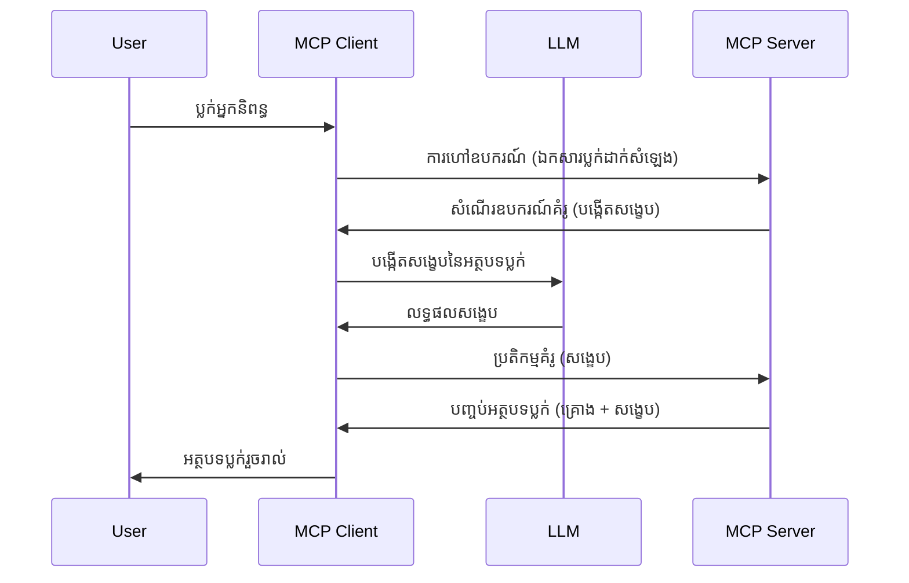

# ការទាញយក - ផ្ដល់មុខងារទៅឱ្យ Client

> **សេចក្តីជូនដំណឹងអំពីការជ្រោះចេញ៖** កំណែ MCP  `2026-07-28` ដែលជាកំណត់ត្រាដាច់ខាត សំរាប់ការទាញយក ត្រូវបានចាត់ទុកថាជាការជ្រោះចេញ ដើម្បីផ្តោតទៅលើការតភ្ជាប់ផ្ទាល់ជាមួយ API ផ្ដល់ដោយអ្នកផ្គត់ផ្គង់ LLM។ ការទាញយក នៅបន្តធ្វើការ លើកំណែ `2025-11-25` និងយ៉ាងហោចណាស់មួយឆ្នាំបន្ទាប់ពីការជ្រោះចេញផ្លូវការណាមួយ គឺគ្រប់យ៉ាងក្នុងមេរៀននេះនៅតែមានតំលៃ — ប៉ុន្តែរចនាសម្ព័ន្ធម៉ាស៊ីនមេថ្មីគួរតែវាយតម្លៃលំនាំជំនួស។ មើល [អ្វីដែលកំពុងផ្លាស់ប្ដូរនៅ MCP៖ កំណែដាច់ខាត 2026-07-28](../../01-CoreConcepts/mcp-2026-07-28-release-candidate.md)។

ម្ដងម្កាល អ្នកត្រូវការឲ្យ MCP Client និង MCP Server រ่วมដំណើរការជាមួយគ្នាដើម្បីទទួលបានគោលដៅរួម។ អ្នកអាចមានករណីដែល Server ត្រូវការជំនួយពី LLM ដែលស្ថិតនៅលើ Client។ សម្រាប់ស្ថានភាពនេះ ការទាញយកគឺជាអ្វីដែលអ្នកគួរតែប្រើ។

ចង់ស្វែងយល់ពីករណីប្រើប្រាស់មួយចំនួន និងរបៀបសាងសង់ដំណោះស្រាយដែលពាក់ព័ន្ធនឹងការទាញយក។

## តាមសរុប

ក្នុងមេរៀននេះ អ្នកនឹងផ្តោតលើការពន្យល់ពីពេលវេលា និងទីកន្លែងប្រើ Sampling ហើយរបៀបកំណត់វា។

## គោលបំណងការសិក្សា

ក្នុងជំពូកនេះ យើងនឹង:

- ពន្យល់អំពី Sampling ជាអ្វី និងពេលណាគួរប្រើ។
- បង្ហាញរបៀបកំណត់ Sampling ក្នុង MCP។
- ផ្តល់ឧទាហរណ៍នៃ Sampling ក្នុងសកម្មភាព។

## Sampling ជាអ្វី និងហេតុអ្វីបានជាគួរប្រើវា?

Sampling គឺជាមុខងារលើកកម្ពស់មួយដែលដំណើរការដូចខាងក្រោម៖



### ការកាន់តំណែងសំណើ Sampling

ចាស ឥឡូវនេះយើងមានទិដ្ឋភាពទូទៅនៃសេណារីយោដែលទាក់ទាញ មកនិយាយអំពីការស្នើសុំ Sampling ដែលម៉ាស៊ីនមេផ្ញើត្រឡប់ទៅ Client។ នេះគឺរបៀបមួយប្រភេទសំណើសម្រាប់ JSON-RPC:

```json
{
  "jsonrpc": "2.0",
  "id": 1,
  "method": "sampling/createMessage",
  "params": {
    "messages": [
      {
        "role": "user",
        "content": {
          "type": "text",
          "text": "Create a blog post summary of the following blog post: <BLOG POST>"
        }
      }
    ],
    "modelPreferences": {
      "hints": [
        {
          "name": "claude-3-sonnet"
        }
      ],
      "intelligencePriority": 0.8,
      "speedPriority": 0.5
    },
    "systemPrompt": "You are a helpful assistant.",
    "maxTokens": 100
  }
}
```

មានចំនុចមួយចំនួននៅទីនេះគួរតែជ្រាបដឹង:

- Prompt ក្រោម content -> text គឺជាការផ្តល់ពាក្យបញ្ជាជូន LLM ដើម្បីសង្ខេបមាតិកានៃប្លុកប៉ុស្តិ៍។

- **modelPreferences**. ផ្នែកនេះគឺជាការចូលចិត្ត មួយការផ្តល់អនុសាសន៍អំពីការចំរូងរចនាសម្ព័ន្ធដែលគួរប្រើជាមួយ LLM។ អ្នកប្រើអាចជ្រើសរើសតាមយោបល់ឬផ្លាស់ប្តូរតាមចម្ងល់។ មួយនេះមានអនុសាសន៍លើម៉ូដែលដែលគួរប្រើ និងលក្ខណៈអាទិភាពល្បឿន និងភាពឆ្លាតវៃ។
- **systemPrompt**, នេះជាពាក្យបញ្ជារបស់ប្រព័ន្ធធម្មតារបស់អ្នក ដែលផ្តល់បុគ្គលិកលក្ខណៈដល់ LLM របស់អ្នក និងមានការណែនាំ។
- **maxTokens**, នេះជាកម្មវិធីមួយផ្សេងទៀតដែលបានប្រើប្រាស់សំរាប់ប្រាប់ថាតើត្រូវប្រើប៉ុន្មាន token សម្រាប់ភារកិច្ចនេះ។

### តបសំណើ Sampling

ការឆ្លើយតបនេះគឺជាអ្វីដែល MCP Client បញ្ចូនត្រឡប់ទៅ MCP Server ហើយជាលទ្ធផលនៃការហៅទៅ LLM របស់ Client រង់ចាំការឆ្លើយតប និងបង្កើតសារនេះ។ នេះគឺរបៀបដែលវាដូចក្នុង JSON-RPC:

```json
{
  "jsonrpc": "2.0",
  "id": 1,
  "result": {
    "role": "assistant",
    "content": {
      "type": "text",
      "text": "Here's your abstract <ABSTRACT>"
    },
    "model": "gpt-5",
    "stopReason": "endTurn"
  }
}
```

សូមចាប់អារម្មណ៍ថាការឆ្លើយតបគឺជាសេចក្ដីសង្ខេបនៃប្លុកប៉ុស្តិ៍ដូចដែលបានស្នើសុំ។ ហើយក៏ចាប់អារម្មណ៍ដែរ ថា ម៉ូដែល `"model"` ដែលបានប្រើមិនមែនជាអ្វីដែលយើងស្នើសុំទេ ប៉ុន្តែ `"gpt-5"` ភ្លាមឈប់វិញលើ `"claude-3-sonnet"`។ នេះបង្ហាញថាអ្នកប្រើអាចផ្លាស់ប្តូរយោបល់លើអ្វីដែលគួរប្រើ ហើយសំណើ Sampling របស់អ្នកគឺជាការផ្តល់អនុសាសន៍មួយ។

ចាស ឥឡូវយើងបានយល់ពីលំនាំសំខាន់ និងភារកិច្ចប្រយោជន៍សម្រាប់វា "បង្កើតប្លុកប៉ុស្តិ៍ + សង្ខេប" ។ យើងមកមើលតម្រូវការបន្តិចនឹងអ្វីដែលត្រូវធ្វើដើម្បីឲ្យវាដំណើរការបាន។

### ប្រភេទសារ

សារ Sampling មិនត្រូវបានដាក់កំណត់តែជា អត្ថបទ ប៉ុន្តែអ្នកអាចផ្ញើររូបភាព និងសំឡេងបានផងដែរ។ នេះគឺរបៀប JSON-RPC ផ្លាស់ប្តូរដូចខាងក្រោម៖

**អត្ថបទ**

```json
{
  "type": "text",
  "text": "The message content"
}
```

**មាតិការូបភាព**

```json
{
  "type": "image",
  "data": "base64-encoded-image-data",
  "mimeType": "image/jpeg"
}
```

**មាតិកាសំឡេង**

```json
{
  "type": "audio",
  "data": "base64-encoded-audio-data",
  "mimeType": "audio/wav"
}
```

> NOTE: សម្រាប់ព័ត៌មានលម្អិតបន្ថែមអំពី Sampling សូមមើល [ឯកសារផ្លូវការជាមួយ](https://modelcontextprotocol.io/specification/2025-11-25/client/sampling)

## របៀបកំណត់ Sampling ក្នុង Client

> សូមចំណាំ៖ ប្រសិនបើអ្នកកំពុងបង្កើតតែម៉ាស៊ីនមេ អ្នកមិនត្រូវធ្វើអ្វីច្រើននៅទីនេះទេ។

នៅ Client អ្នកត្រូវបញ្ជាក់មុខងារដូចខាងក្រោម៖

```json
{
  "capabilities": {
    "sampling": {}
  }
}
```

វានឹងត្រូវជ្រើសរើសពេល Client ដែលបានជ្រើសរើសចាប់ផ្ដើមផ្ទាប់ជាមួយម៉ាស៊ីនមេ។

## ឧទាហរណ៍នៃ Sampling ក្នុងសកម្មភាព - បង្កើតប្លុកប៉ុស្តិ៍

ចង់សរសេរកម្មវិធីម៉ាស៊ីនមេ Sampling រួមគ្នា ហើយយើងត្រូវធ្វើដូចខាងក្រោម៖

1. បង្កើតឧបករណ៍មួយនៅលើ Server។
1. ឧបករណ៍នោះគួរបង្កើតសំណើ Sampling
1. ឧបករណ៍គួរត្រូវរង់ចាំចម្លើយសំណើ Sampling ពី Client។
1. បន្ទាប់មកលទ្ធផលឧបករណ៍គួរត្រូវបានបង្កើត។

មកមើលកូដជាដំណាក់កាលៗ៖

### -1- បង្កើតឧបករណ៍

**python**

```python
@mcp.tool()
async def create_blog(title: str, content: str, ctx: Context[ServerSession, None]) -> str:
    """Create a blog post and generate a summary"""

```

### -2- បង្កើតសំណើ Sampling

បន្ថែមកូដនេះចូលក្នុងឧបករណ៍របស់អ្នក៖

**python**

```python
post = BlogPost(
        id=len(posts) + 1,
        title=title,
        content=content,
        abstract=""
    )

prompt = f"Create an abstract of the following blog post: title: {title} and draft: {content} "

result = await ctx.session.create_message(
        messages=[
            SamplingMessage(
                role="user",
                content=TextContent(type="text", text=prompt),
            )
        ],
        max_tokens=100,
)

```

### -3- រង់ចាំការឆ្លើយតប និងត្រឡប់ការឆ្លើយតប

**python**

```python
post.abstract = result.content.text

posts.append(post)

# ត្រឡប់មកផលិតផលពេញលេញ
return json.dumps({
    "id": post.title,
    "abstract": post.abstract
})
```

### -4- កូដពេញលេញ

**python**

```python
from starlette.applications import Starlette
from starlette.routing import Mount, Host

from mcp.server.fastmcp import Context, FastMCP

from mcp.server.session import ServerSession
from mcp.types import SamplingMessage, TextContent

import json


from uuid import uuid4
from typing import List
from pydantic import BaseModel


mcp = FastMCP("Blog post generator")

# app = FastAPI()

posts = []

class BlogPost(BaseModel):
    id: int
    title: str
    content: str
    abstract: str

posts: List[BlogPost] = []

@mcp.tool()
async def create_blog(title: str, content: str, ctx: Context[ServerSession, None]) -> str:
    """Create a blog post and generate a summary"""

    post = BlogPost(
        id=len(posts) + 1,
        title=title,
        content=content,
        abstract=""
    )

    prompt = f"Create an abstract of the following blog post: title: {title} and draft: {content} "

    result = await ctx.session.create_message(
        messages=[
            SamplingMessage(
                role="user",
                content=TextContent(type="text", text=prompt),
            )
        ],
        max_tokens=100,
    )

    post.abstract = result.content.text

    posts.append(post)

    # ត្រឡប់សារប្លក់បញ្ចប់
    return json.dumps({
        "id": post.title,
        "abstract": post.abstract
    })

if __name__ == "__main__":
    print("Starting server...")
    # mcp.run()
    mcp.run(transport="streamable-http")

# ដំណើរការ app ជាមួយ៖ python server.py
```

### -5- សាកល្បងវានៅក្នុង Visual Studio Code

ដើម្បីសាកល្បងរឿងនេះនៅក្នុង Visual Studio Code អ្នកត្រូវធ្វើដូចខាងក្រោម៖

1. ចាប់ផ្ដើមម៉ាស៊ីនមេនៅក្នុង terminal
1. បន្ថែមវាទៅ *mcp.json* (ហើយធានាថាវាចាប់ផ្ដើមហើយ) ពីរណោះដូចខាងក្រោម៖

   ```json
   "servers": {
      "blog-server": {
        "type": "http",
        "url": "http://localhost:8000/mcp"
      }
   }
   ```

1. វាយពាក្យបញ្ជា:

   ```text
   create a blog post named "Where Python comes from", the content is "Python is actually named after Monty Python Flying Circus"
   ```

1. អនុញ្ញាតឲ្យតំណក់ Sampling ខណៈពេលដែលអ្នកសាកល្បងជាលើកដំបូង អ្នកនឹងបានឃើញប្រអប់បន្ថែមមួយដែលអ្នកត្រូវបញ្ជាក់ការទទួលយក ហើយបន្ទាប់មកអ្នកនឹងឃើញប្រអប់ធម្មតាដើម្បីស្នើឲ្យរត់ឧបករណ៍មួយ

1. ពិនិត្យលទ្ធផល។ អ្នកនឹងមើលឃើញលទ្ធផលទាំងស្អាតនៅក្នុង GitHub Copilot Chat ប៉ុន្តែអ្នកក៏អាចពិនិត្យមើលចម្លើយ JSON ដើមបានផងដែរ។

**រង្វាន់**។ ឧបករណ៍ Visual Studio Code មានការគាំទ្រដ៏ល្អសម្រាប់ការទាញយក។ អ្នកអាចកំណត់ការចូលដំណើរការនៃ Sampling លើម៉ាស៊ីនមេដែលបានដំឡើងដោយចូលទៅកាន់ដូចខាងក្រោម៖

1. ចូលទៅផ្នែកបន្ថែម។
1. ជ្រើសរើសរូបតំណាងមូលដ្ឋានសម្រាប់ម៉ាស៊ីនមេដែលបានដំឡើងនៅក្នុងផ្នែក "MCP SERVERS - INSTALLED"។
1 ជ្រើសរើស "Configure Model Access" ទីនេះអ្នកអាចជ្រើសរើស Model ដែល GitHub Copilot អនុញ្ញាតឲ្យប្រើពេលបំពេញ Sampling។ អ្នកក៏អាចមើលសំណើ Sampling ទាំងអស់ដែលបានកើតឡើងថ្មីៗដោយជ្រើសរើស "Show Sampling requests"។

## ការសម្រួលការ

ក្នុងការសម្រួលនេះ អ្នកនឹងបង្កើត Sampling ដែលខុសគ្នាបន្តិច ត្រូវគឺជាការសម្រួលការចូលរួម Sampling ដែលគាំទ្រការបង្កើតពិពណ៌នាផលិតផល។ នេះជាសេណារីយោរបស់អ្នក៖

**សេណារីយោ**: អ្នកបម្រើការលើការិយាល័យខាងក្រោយនៅក្នុងហាង e-commerce ត្រូវការជំនួយ វាចំណាយពេលយូរណាស់ក្នុងការបង្កើតពិពណ៌នាផលិតផល។ ដូច្នេះ អ្នកត្រូវបង្កើតដំណោះស្រាយមួយដែលអាចហៅឧបករណ៍ "create_product" ជាមួយ "title" និង "keywords" ជាអថេរ ហើយគួរបង្កើតផលិតផលពេញលេញរួមមានវាល "description" ដែលត្រូវបណ្តូលដោយ LLM របស់ Client។

TIP: ប្រើអ្វីដែលអ្នកបានរៀនមុននេះដើម្បីសង់ម៉ាស៊ីនមេ និងឧបករណ៍របស់វាដោយប្រើសំណើ Sampling។

## ដំណោះស្រាយ

[ដំណោះស្រាយ](./solution/README.md)

## ចំណុចសំខាន់

Sampling គឺជាគន្លងមានអំណាចមួយ ដែលអនុញ្ញាតឲ្យម៉ាស៊ីនមេផ្ដល់ភារកិច្ចទៅ Client ពេលវាត្រូវការជំនួយពី LLM។

## អ្វីទៅជា ជំហានបន្ទាប់

- [ជំពូក ៤ - ការអនុវត្តប្រតិបត្តិការជាក់ស្តែង](../../04-PracticalImplementation/README.md)

---

<!-- CO-OP TRANSLATOR DISCLAIMER START -->
**ការបដិសេធ**:
ឯកសារនេះត្រូវបានបម្លែងភាសា ដោយប្រើសេវាបម្លែងភាសា AI [Co-op Translator](https://github.com/Azure/co-op-translator)។ ទោះយើងខ្ញុំមានក្តីប្រាថ្នាឱ្យបានច្បាស់លាស់ តែសូមយល់ដឹងថាការបម្លែងដោយស្វ័យប្រវត្តិក៏អាចមានកំហុសឬភាពមិនត្រឹមត្រូវ។ ឯកសារដើមជាភាសាទីតាំងគួរត្រូវបានគេប្រើជាប្រភពច្បាស់លាស់។ សម្រាប់ព័ត៌មានសំខាន់ៗ សូមណែនាំឱ្យប្រើប្រាស់ការប្រែដោយមនុស្សជំនាញ។ យើងខ្ញុំមិនទទួលខុសត្រូវចំពោះការយល់ច្រឡំ ឬការបកស្រាយខុសបន្ទាប់ពីការប្រើប្រាស់ការបម្លែងនេះនោះទេ។
<!-- CO-OP TRANSLATOR DISCLAIMER END -->