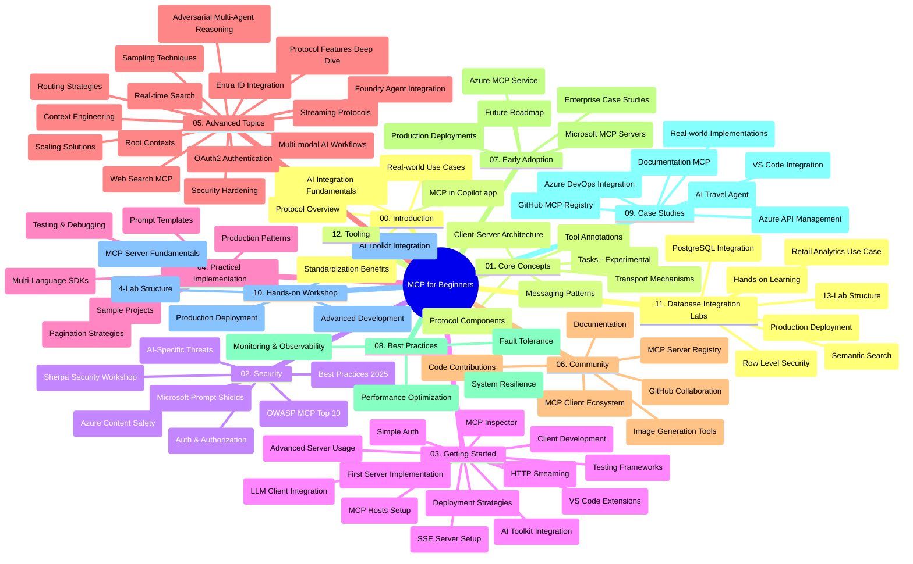

# ពិធីការបរិបទម៉ូឌែល (MCP) សម្រាប់អ្នកចាប់ផ្តើម - មគ្គុទេសក៍សិក្សា

មគ្គុទេសក៍សិក្សានេះផ្តល់នូវទិដ្ឋភាពទូទៅអំពីរចនាសម្ព័ន្ធ និងមាតិកាគង់សារក្នុងឃ្លាំង "ពិធីការបរិបទម៉ូឌែល (MCP) សម្រាប់អ្នកចាប់ផ្តើម"។ ប្រើមគ្គុទេសក៍នេះដើម្បីរុករកឃ្លាំងបានយ៉ាងមានប្រសិទ្ធភាព និងអនុវត្តធនធានដែលមានស្រាប់បានច្រើនបំផុត។

## ទិដ្ឋភាពទូទៅនៃឃ្លាំង

ពិធីការបរិបទម៉ូឌែល (MCP) គឺជាគ្រោងការតម្លើងស្តង់ដារ សម្រាប់ប្រតិបត្តិការរវាងម៉ូឌែល AI និងកម្មវិធីអតិថិជន។ នៅដើមបានបង្កើតឡើងដោយ Anthropic ហើយឥឡូវនេះ MCP ត្រូវបានថែរក្សាដោយសហគមន៍ MCP ទូទាំង តាមរយៈអង្គភាព GitHub របស់ពួកគេ។ ឃ្លាំងនេះផ្តល់នូវមេរៀនពេញលេញជាមួយនឹងគំរូកូដដ៏ជាក់ស្តែងនៅក្នុងភាសា C#, Java, JavaScript, Python និង TypeScript សម្រាប់អ្នកអwickរ AI, ស្ថាបត្យកររបៀបប្រព័ន្ធ និងវិស្វករតុបតែងកម្មវិធី។

## ផែនទីមេរៀនយ៉ាងកំរិត

## រចនាសម្ព័ន្ធឃ្លាំង

ឃ្លាំងត្រូវបានរៀបចំជាប្រភេទសំណុំចម្បងប្រាំបួនដែលផ្តោតលើវិស័យផ្សេងៗនៃ MCP៖

1. **ណែនាំ (00-Introduction/)**
   - ទិដ្ឋភាពទូទៅនៃពិធីការបរិបទម៉ូឌែល
   - មូលហេតុដែលស្តង់ដារសំខាន់ក្នុងបណ្តាញ AI
   - ករណីប្រើប្រាស់ដ៏អនុភាព និងអត្ថប្រយោជន៍

2. **គំនិតមូលដ្ឋាន (01-CoreConcepts/)**
   - ស្ថาปត្យកម្មអតិថិជន-ម៉ាស៊ីនបម្រើ
   - គ្រឿងសង្ហារឹមសំខាន់ៗនៃពិធីការ
   - ទំរង់សារនៅក្នុង MCP
   - មើលទៅមុខ៖ [តើមានអ្វីកំពុងផ្លាស់ប្តូរនៅក្នុង MCP៖ កំណែកំណត់ចេញ ២០២៦-០៧-២៨](./01-CoreConcepts/mcp-2026-07-28-release-candidate.md) — មូលដ្ឋានពិធីការដែលមិនមានស្ថានភាព, ស៊ុមការពារពហុភ្នាក់ងារ និងការបញ្ឈប់ការប្រើប្រាស់ Roots/Sampling/Logging ទំនងនឹងមាននៅក្នុងកំណែសេចក្ដីបញ្ជាក់បន្ទាប់

3. **សុវត្ថិភាព (02-Security/)**
   - គ្រោះថ្នាក់សុវត្ថិភាពនៅក្នុងប្រព័ន្ធផ្អែកលើ MCP
   - វិធានការល្អបំផុតសម្រាប់ការពារការអនុវត្ត
   -យុទ្ធសាស្រ្តសម្គាល់ខ្លួន និងអនុញ្ញាត
   - **ឯកសារសុវត្ថិភាពពេញលេញ**:
     - វិធានការសុវត្ថិភាព MCP 2025
     - មគ្គុទេសក៍អនុវត្តន៍ Azure Content Safety
     - ការគ្រប់គ្រង និងបច្ចេកទេសសុវត្ថិភាព MCP
     - ជូនពរវិធីអនុវត្តល្អបំផុត MCP
   - **ប្រធានបទសុវត្ថិភាពសំខាន់ៗ**:
     - ការវាយប្រហារចាក់បញ្ចូល Prompt និងការប្រឡាក់ទឹកចាកឧបករណ៍
     - ប្រព្រឹត្តិការភ្លេចចាប់សម័យ និងបញ្ហាអ្នកបម្រើភ្នាក់ងារភ្ញាក់ផ្អើល
     - អំណាចចូលគ្នាក្នុងការបញ្ជូន Token
     - សិទ្ធិឥតគ្រប់គ្រងនិងការត្រួតពិនិត្យចូល
     - សុវត្ថិភាពខ្សែផ្គត់ផ្គង់សម្រាប់ផ្នែក AI
     - បញ្ចូលភ្ជាប់ Microsoft Prompt Shields

4. **ការចាប់ផ្តើម (03-GettingStarted/)**
   - ការតំឡើងបរិយាកាស និងចំណុចកំណត់កំណត់
   - បង្កើតម៉ាស៊ីនបម្រើ MCP និងអតិថិជនមូលដ្ឋាន
   - រួមបញ្ចូលជាមួយកម្មវិធីដែលមានស្រាប់
   - រួមបញ្ចូលផ្នែកសម្រាប់៖
     - ការអនុវត្តម៉ាស៊ីនបម្រើដំបូង
     - ការអwickរ Client
     - រួមបញ្ចូលអតិថិជន LLM
     - បញ្ចូលជាមួយ VS Code
     - ម៉ាស៊ីនបម្រើ Server-Sent Events (SSE)
     - ការប្រើប្រាស់ម៉ាស៊ីនបម្រើវឌ្ឍនភាព
     - ចាក់បញ្ចូលHTTP streaming
     - រួមបញ្ចូល AI Toolkit
     - វិធីសាស្រ្តសាកល្បង
     - របៀបដាក់បញ្ចូល

5. **ការអនុវត្តប្រាក់ប្រយោជន៍ (04-PracticalImplementation/)**
   - ការប្រើប្រាស់ SDKs ក្នុងភាសាកម្មវិធីផ្សេងៗ
   - វិធីសាស្រ្តដោះស្រាយកំហុស, សាកល្បង និងផ្ទៀងផ្ទាត់
   - ការបង្កើតទំព័រចាក់បញ្ចូល Prompt ដែលអាចប្រើបន្ត ផងនិងរបៀបការងារ។
   - គំរូគម្រោងជាមួយឧទាហរណ៍អនុវត្ត

6. **ប្រធានបទវិស្វកម្ម (05-AdvancedTopics/)**
   - វិធីសាស្រ្តបង្រៀនទេសនាពិធីការ
   - មូលដ្ឋាន Foundry agent
   - ញឹកញាប់ចរិត AI ពហុម៉ូទ័រ
   - តំណាងសម្គាល់ OAuth2
   - សមត្ថភាពស្វែងរក Real-time
   - ចាក់បញ្ចូលត្រង់ Stream Real-time
   - អនុវត្តបរិបទ Roots
   - វិធីសាស្ត្រផ្លាស់ប្តូរប្រភេទបណ្តោយ
   - វិធីសាស្ត្រជ្រើសរើសចៃដន្យ
   - វិធីសាស្ត្រកំណត់អត្រាពង្រីក
   - ការពិចារណាសុវត្ថិភាព
   - បញ្ចូលសុវត្ថិភាព Entra ID
   - រួមបញ្ចូលការស្វែងរកបណ្ដាញ
   - ការចំហាប់វិបត្តិ Multi-agent reasoning (ទ្រង់ទ្រាយធ្វើយុទ្ធនាការ)

7. **ការរួមចំណែកសហគមន៍ (06-CommunityContributions/)**
   - របៀបរួមចំណែកកូដ និងឯកសារ
   - ធ្វើការសហការតាមរយៈ GitHub
   - ការកែលម្អ និងមតិយោបល់ដោយសហគមន៍
   - ការប្រើប្រាស់ MCP clients ផ្សេងៗ (Claude Desktop, Cline, VSCode)
   - ប្រើប្រាស់ម៉ាស៊ីនបម្រើ MCP ដែលពេញនិយម រួមទាំងការបង្កើតរូបភាព

8. **មេរៀនពីការប្រើប្រាស់ដំបូង (07-LessonsfromEarlyAdoption/)**
   - ករណីអនុវត្តពិត និងរឿងជោគជ័យ
   - ការបង្កើត និងប្រើប្រាស់ដំណោះស្រាយមានមូលដ្ឋានលើ MCP
   - ទិសដៅនិងផែនទីពេលក្រោយ
   - **មគ្គុទេសក៍ម៉ាស៊ីនបម្រើ Microsoft MCP**៖ មគ្គុទេសក៍ពេញលេញសម្រាប់ម៉ាស៊ីនបម្រើ Microsoft MCP ១០ឯកតាទាំង:
     - ម៉ាស៊ីនបម្រើ Microsoft Learn Docs MCP
     - ម៉ាស៊ីនបម្រើ Azure MCP (ខ្សែភ្ជាប់ជំនាញ ១៥+)
     - ម៉ាស៊ីនបម្រើ GitHub MCP
     - ម៉ាស៊ីនបម្រើ Azure DevOps MCP
     - ម៉ាស៊ីនបម្រើ MarkItDown MCP
     - ម៉ាស៊ីនបម្រើ SQL Server MCP
     - ម៉ាស៊ីនបម្រើ Playwright MCP
     - ម៉ាស៊ីនបម្រើ Dev Box MCP
     - ម៉ាស៊ីនបម្រើ Microsoft Foundry MCP
     - ម៉ាស៊ីនបម្រើ Microsoft 365 Agents Toolkit MCP

9. **វិធានល្អបំផុត (08-BestPractices/)**
   - ការតម្រឹមល្បឿន និងបង្កើនប្រសិទ្ធភាព
   - រចនាប្រព័ន្ធ MCP ដែលធន់ទ្រាំខូចខាត
   - វិធីសាស្រ្តសាកល្បង និងការធន់ទ្រាំ

10. **ករណីសិក្សា (09-CaseStudy/)**
    - **ករណីសិក្សាចំនួនប្រាំមួយ** បង្ហាញមុខវិជ្ជា MCP ក្នុងស្ថានភាពដ៏ខុសគ្នា៖
    - **ភ្នាក់ងារធ្វើដំណើរដូចក្រុម Azure AI**៖ ការសម្របសម្រួលភ្នាក់ងារពហុរួមជាមួយ Azure OpenAI និង AI Search
    - **ការបញ្ចូល Azure DevOps**៖ ស្វ័យប្រវត្តិនូវដំណើរការចរន្តជាមួយកំណត់ទិន្នន័យ YouTube
    - **ការយកឯកសារពេលតាមពិត**៖ អតិថិជន Python console ជាមួយ HTTP streaming
    - **កម្មវិធីផលិតផែនការសិក្សាដោយមានការពិភាក្សា**៖ កម្មវិធី Chainlit ជាវេប APP មាន AI ជាប់អារម្មណ៍
    - **ឯកសារក្នុងកម្មវិធីផ្លាស់ប្តូរ**៖ រួមបញ្ចូល VS Code ជាមួយ GitHub Copilot workflow
    - **បណ្ដាញ API របស់ Azure**៖ ការបញ្ចូល API សហគ្រិនជាមួយការបង្កើតម៉ាស៊ីនបម្រើ MCP
    - **បញ្ជី MCP GitHub Registry**៖ វេទិកាការអwickរកមូលដ្ឋាន និងការរួមបញ្ចូលភ្នាក់ងារ
    - ឧទាហរណ៍អនុវត្ត កាន់តែរួមមានការបញ្ចូលសហគ្រិន, ផលិតភាពអ្នកអwickរ និងដំណើរការជាសហគមន៍

11. **ហាត់ដំណើរការជាក់ស្តែង (10-StreamliningAIWorkflowsBuildingAnMCPServerWithAIToolkit/)**
    - ហាត់ដំណើរការជាក់ស្តែងពេញលេញរួមបញ្ចូល MCP ជាមួយ AI Toolkit
    - ការបង្កើតកម្មវិធីវិង្វង់ ដែលភ្ជាប់ម៉ូឌែល AI ជាមួយឧបករណ៍ពិត
    - មេរៀនប្រតិបត្តិសម្រាប់មូលដ្ឋាន, ការអwickម៉ាស៊ីនបម្រើសម្រាប់ត្រូវបានប្ដូរផ្ទាល់ខ្លួន និងយុទ្ធសាស្រ្តបញ្ចូលផលិតកម្ម
    - **រចនាសម្ព័ន្ធមន្ទីរ**:
      - មន្ទីរ ១: មូលដ្ឋានម៉ាស៊ីនបម្រើ MCP
      - មន្ទីរ ២: អwickម៉ាស៊ីនបម្រើ MCP វិជ្ជាជីវៈ
      - មន្ទីរ ៣: រួមបញ្ចូល AI Toolkit
      - មន្ទីរ ៤: ការដាក់បញ្ចូលផលិតកម្ម និងការលូតលាស់
    - វិធីសាស្ត្រសិក្សាដោយផ្អែកលើមន្ទីរជាមួយការណែនាំជំហានបន្ទាប់ជំហាន

12. **មន្ទីររួមបញ្ចូលមូលដ្ឋានទិន្នន័យម៉ាស៊ីនបម្រើ MCP (11-MCPServerHandsOnLabs/)**
    - **ផ្លូវការ ១៣ មន្ទីរសិក្សា** សម្រាប់បង្កើតម៉ាស៊ីនបម្រើ MCP ដែលមានប្រតិបត្តិផលិតកម្មជាមួយការរួមបញ្ចូល PostgreSQL
    - **អនុវត្តវិភាគលក់រាយជាក់ស្តែង** ដោយប្រើករណីស្រាប់ Zava Retail
    - **គំរូភាពជាច្រើនដល់សហគ្រិន** រួមមាន ការកំណត់សុវត្ថិភាពតាមមាត់កម្រិតជួរដេក (RLS), ស្វែងរកសាមញ្ញ និងការចូលរួមទិន្នន័យពហុជួល
    - **រចនាសម្ព័ន្ធមន្ទីរពេញលេញ**:
      - **មន្ទីរ ០០-០៣: មូលដ្ឋាន** - ណែនាំ, ស្ថាបត្យកម្ម, សុវត្ថិភាព, ការតំឡើងបរិយាកាស
      - **មន្ទីរ ០៤-០៦: ការបង្កើតម៉ាស៊ីនបម្រើ MCP** - រចនាមូលដ្ឋានទិន្នន័យ, អwickម៉ាស៊ីនបម្រើ MCP, ការអwickឧបករណ៍
      - **មន្ទីរ ០៧-០៩: លក្ខណៈវិជ្ជាជីវៈ** - ស្វែងរក សាមញ្ញ, សាកល្បង និងដោះស្រាយកំហុស, រួមបញ្ចូល VS Code
      - **មន្ទីរ ១០-១២: ផលិតកម្ម និងវិធានល្អបំផុត** - ដាក់បញ្ចូល, ត្រួតពិនិត្យ, បង្កើនប្រសិទ្ធភាព
    - **បច្ចេកវិទ្យាដែលរួមបញ្ចូល**: ហ្វ្រេមវ៉ើក FastMCP, PostgreSQL, Azure OpenAI, Azure Container Apps, Application Insights
    - **លទ្ធផលសិក្សា**: ម៉ាស៊ីនបម្រើ MCP ដែលបានបញ្ចូលផលិតកម្ម, គំរូរួមបញ្ចូលមូលដ្ឋានទិន្នន័យ, វិភាគពហុ AI, សុវត្ថិភាពសហគ្រិន

13. **ឧបករណ៍ (12-tooling/)**
    - រៀនពីរបៀបប្រើ MCP ក្នុងកម្មវិធី Copilot និងឧបករណ៍ផ្សេងទៀត

## ធនធានបន្ថែម

ឃ្លាំងរួមបញ្ចូលធនធានគាំទ្រ៖

- **ថតរូបភាព**: រួមបញ្ចូលរូបគំនូរ និងរូបភាពដែលបានប្រើនៅក្នុងមេរៀន
- **ការបកប្រែ**: គាំទ្រភាសាផ្សេងៗដោយកាស៊ីណូបកប្រែឯកសារ
- **ធនធានផ្លូវការរបស់ MCP**:
  - [ឯកសារ MCP](https://modelcontextprotocol.io/)
  - [សេចក្ដីបញ្ជាក់ MCP](https://spec.modelcontextprotocol.io/)
  - [ឃ្លាំង GitHub MCP](https://github.com/modelcontextprotocol)

## របៀបប្រើប្រាស់ឃ្លាំងនេះ

1. **សិក្សាស្របជាដំណាក់កាល**៖ អនុវត្តមេរៀនតាមជំពូក (០០ ដល់ ១១) ដើម្បីទទួលបានបទពិសោធន៍ស្រាលជ្រួល។
2. **ផ្តោតលើភាសា​មួយៗ**៖ ប្រសិនបើអ្នកចាប់អារម្មណ៍ភាសាកម្មវិធីមួយណា សូមរុករកថតគំរូសំរាប់ភាសានោះ។
3. **អនុវត្តជាក់ស្តែង**៖ ចាប់ផ្តើមជាមួយផ្នែក "ការចាប់ផ្តើម" ដើម្បីតំឡើងបរិយាកាស និងបង្កើតម៉ាស៊ីនបម្រើ MCP របស់អ្នកដំបូង និងអតិថិជន។
4. **រុករកជ្រាលជ្រៅ**៖ បន្ទាប់ពីឆាប់ចេះគ្រឹះ, ចូលឆ្ងាយទៅប្រធានបទវិជ្ជាជីវៈដើម្បីពង្រីកចំណេះដឹង។
5. **ចូលរួមសហគមន៍**៖ ចូលរួមជាមួយសហគមន៍ MCP តាមរយៈកិច្ចសន្ទនានៅ GitHub និងបណ្ដាញ Discord ដើម្បីភ្ជាប់ជាមួយអ្នកជំនាញ និងអ្នកអwickរផ្សេងទៀត។

## អតិថិជន MCP និងឧបករណ៍

មេរៀនគ្របដណ្តប់អតិថិជន MCP និងឧបករណ៍ផ្សេងៗ៖

1. **អតិថិជនផ្លូវការ**:
   - Visual Studio Code
   - MCP ក្នុង Visual Studio Code
   - Claude Desktop
   - Claude ក្នុង VSCode
   - Claude API

2. **អតិថិជនសហគមន៍**:
   - Cline (តាម Terminal)
   - Cursor (កូដកែសំរួល)
   - ChatMCP
   - Windsurf

3. **ឧបករណ៍គ្រប់គ្រង MCP**:
   - MCP CLI
   - MCP Manager
   - MCP Linker
   - MCP Router

## ម៉ាស៊ីនបម្រើ MCP ពេញនិយម

ឃ្លាំងណែនាំម៉ាស៊ីនបម្រើ MCP នានា រួមមាន៖

1. **ម៉ាស៊ីនបម្រើ Microsoft MCP ផ្លូវការ**:
   - ម៉ាស៊ីនបម្រើ Microsoft Learn Docs MCP
   - ម៉ាស៊ីនបម្រើ Azure MCP (ខ្សែភ្ជាប់ជំនាញ ១៥+)
   - ម៉ាស៊ីនបម្រើ GitHub MCP
   - ម៉ាស៊ីនបម្រើ Azure DevOps MCP
   - ម៉ាស៊ីនបម្រើ MarkItDown MCP
   - ម៉ាស៊ីនបម្រើ SQL Server MCP
   - ម៉ាស៊ីនបម្រើ Playwright MCP
   - ម៉ាស៊ីនបម្រើ Dev Box MCP
   - ម៉ាស៊ីនបម្រើ Microsoft Foundry MCP
   - ម៉ាស៊ីនបម្រើ Microsoft 365 Agents Toolkit MCP

2. **ម៉ាស៊ីនបម្រើយោងផ្លូវការ**:
   - Filesystem
   - Fetch
   - Memory
   - Sequential Thinking

3. **បង្កើតរូបភាព**:
   - Azure OpenAI DALL-E 3
   - Stable Diffusion WebUI
   - Replicate

4. **ឧបករណ៍អwickរ**:
   - Git MCP
   - Terminal Control
   - Code Assistant

5. **ម៉ាស៊ីនបម្រើជំនាញ**:
   - Salesforce
   - Microsoft Teams
   - Jira & Confluence

## ការរួមចំណែក

ឃ្លាំងនេះស្វាគមន៍ការរួមចំណែកពីសហគមន៍។ សូមមើលផ្នែកការរួមចំណែកសហគមន៍សម្រាប់ការណែនាំពីរបៀបរួមចំណែកយ៉ាងមានប្រសិទ្ធភាពចំពោះអេកូស៊ីស្តាំ MCP។

----

*មគ្គុទេសក៍សិក្សានេះបានធ្វើបច្ចុប្បន្នភាពចុងក្រោយនៅថ្ងៃទី ៥ ខែកុម្ភៈ ឆ្នាំ ២០២៦ ផ្ទៀងផ្ទាត់ជាមួយសេចក្ដីបញ្ជាក់ MCP ២០២៥-១១-២៥ ហើយផ្តល់ទិដ្ឋភាពទូទៅពីឃ្លាំងនៅ​តាមថ្ងៃនោះ។ មាតិកាឃ្លាំងអាចត្រូវបានធ្វើបច្ចុប្បន្នភាពបន្ទាប់ពីថ្ងៃនោះ។*

*បន្ថែម (ថ្ងៃទី ២ ខែកក្កដា ឆ្នាំ ២០២៦): មេរៀនមួយស្តីពីការចេញផ្សាយដំណាក់កាល Release Candidate នៃការបញ្ជាក់ MCP `2026-07-28` ត្រូវបានបន្ថែមនៅក្រោម [01-CoreConcepts](./01-CoreConcepts/mcp-2026-07-28-release-candidate.md)។ មូលដ្ឋានមេរៀននៅតែមានស្ថិតនៅ ២០២៥-១១-២៥ រហូតដល់កំណែថ្មីត្រូវបានចេញផ្សាយ។*

---

<!-- CO-OP TRANSLATOR DISCLAIMER START -->
**ការបដិសេធ**:
ឯកសារនេះត្រូវបានបម្លែងភាសា ដោយប្រើសេវាបម្លែងភាសា AI [Co-op Translator](https://github.com/Azure/co-op-translator)។ ទោះយើងខ្ញុំមានក្តីប្រាថ្នាឱ្យបានច្បាស់លាស់ តែសូមយល់ដឹងថាការបម្លែងដោយស្វ័យប្រវត្តិក៏អាចមានកំហុសឬភាពមិនត្រឹមត្រូវ។ ឯកសារដើមជាភាសាទីតាំងគួរត្រូវបានគេប្រើជាប្រភពច្បាស់លាស់។ សម្រាប់ព័ត៌មានសំខាន់ៗ សូមណែនាំឱ្យប្រើប្រាស់ការប្រែដោយមនុស្សជំនាញ។ យើងខ្ញុំមិនទទួលខុសត្រូវចំពោះការយល់ច្រឡំ ឬការបកស្រាយខុសបន្ទាប់ពីការប្រើប្រាស់ការបម្លែងនេះនោះទេ។
<!-- CO-OP TRANSLATOR DISCLAIMER END -->