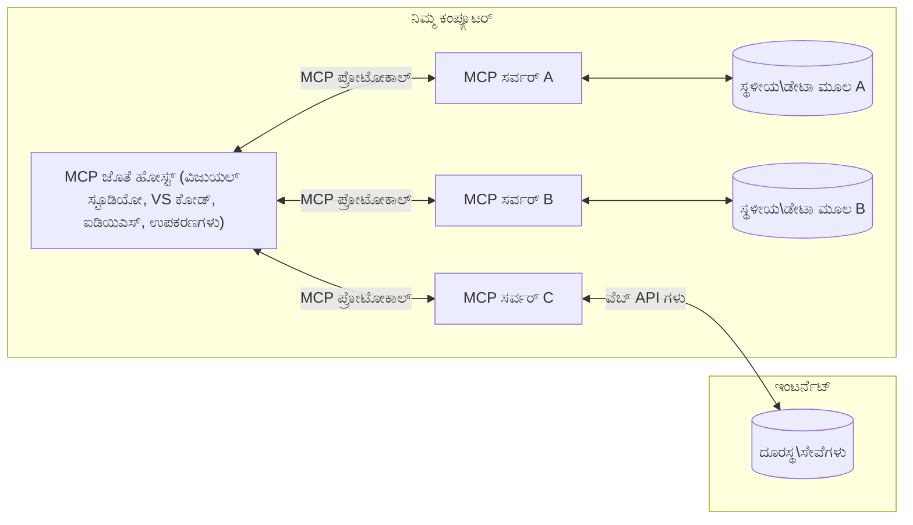

# MCP ಕೋರ್ ಕಾನ್ಸೆಪ್ಟ್‌ಗಳು: AI ಸಂಯೋಜನೆಗಾಗಿ ಮಾದರಿ ಸಾಂದರ್ಭಿಕ ಪ್ರೋಟೋಕಾಲ್ ಅನ್ನು ನಿಪುಣರಾಗಿ ಬಳಸುವುದು

[](https://youtu.be/earDzWGtE84)

_(ಈ ಪಾಠದ ವೀಡಿಯೊ ನೋಡಲು ಮೇಲಿನ ಚಿತ್ರವನ್ನು ಕ್ಲಿಕ್ ಮಾಡಿ)_

[modelcontextprotocol](https://github.com/modelcontextprotocol) ಎಂಬ [ಮಾದರಿ ಸಾಂದರ್ಭಿಕ ಪ್ರೋಟೋಕಾಲ್ (MCP)](https://github.com/modelcontextprotocol)ವು ಬೃಹತ್ ಭಾಷಾ ಮಾದರಿಗಳು (LLMs) ಮತ್ತು ಬಾಹ್ಯ ಟೂಲ್ಸ್, ಅಪ್ಲಿಕೇಷನ్లు ಮತ್ತು ಡೇಟಾ ಮೂಲಗಳ ನಡುವಿನ ಸಂವಹನವನ್ನು ಉತ್ತಮಗೊಳಿಸುವ ಶಕ್ತಿಶಾಲಿ, ಮಾನಕೀಕೃತ ಫ್ರೇಮ್ಮ್‌ವರ್ಕ್ ಆಗಿದೆ.
ಈ ಮಾರ್ಗದರ್ಶಿಯಲ್ಲಿ MCPರ ಕೋರ್ ಸಂಶೋಧನೆಗಳನ್ನು ತಲುಪಿಸುವುದಾಗಿದೆ. ನೀವು ಇದರ ಕ್ಲೈಂಟ್-ಸರ್ವರ್ معماري, ಅವಶ್ಯಕ ಘಟಕಗಳು, ಸಂವಹನ ಕಾರ್ಯ ಕ್ರಮಗಳು ಮತ್ತು ಜಾರಿಗೆ ಸಂಬಂಧಿಸಿದ ಉತ್ತಮ ಪ್ರಥಮಿಕತೆಗಳನ್ನು ಕಲಿಯುತ್ತೀರಿ.

- **ಸ್ಪಷ್ಟ ಬಳಕೆದಾರ ಅನುಮತಿ**: ಎಲ್ಲಾ ಡೇಟಾ ಪ್ರವೇಶ ಮತ್ತು ಕ್ರಿಯೆಗಳು ಮುನ್ನಾಗಿ ಸ್ಪಷ್ಟ ಬಳಕೆದಾರ ಅನುಮತಿ ಅಗತ್ಯವಿದೆ. ಬಳಕೆದಾರರು ಯಾವ ಡೇಟಾ ಪ್ರವೇಶಗೊಳ್ಳುತ್ತದೆ ಮತ್ತು ಯಾವ ಕ್ರಿಯೆಗಳು ನಡೆಯುತ್ತವೆ ಎಂಬುದನ್ನು ಸ್ಪಷ್ಟವಾಗಿ ಅರಿತುಕೊಳ್ಳಬೇಕು, ಅನುಮತಿಗಳ ಮತ್ತು ಪ್ರಾಧಿಕಾರಗಳ ಮೇಲೆ ನಿಖರ ನಿಯಂತ್ರಣ ಇರಬೇಕು.

- **ಡೇಟಾ ಗೌಪ್ಯತೆ ರಕ್ಷಣೆ**: ಬಳಕೆದಾರರ ಡೇಟಾ ಸ್ಪಷ್ಟ ಅನುಮತಿಯೊಂದಿಗೆ ಮಾತ್ರ ಬಿಡುಗಡೆ ಮಾಡಬೇಕು ಮತ್ತು ಸಂಪೂರ್ಣ ಸಂವಾದಾವಧಿ ಒಳಗಿನ ಬಲವಾದ ಪ್ರವೇಶ ನಿಯಂತ್ರಣಗಳಿಂದ ರಕ್ಷಿಸಬೇಕು. ಅನುಷ್ಠಾನಗಳು ಅನಧಿಕೃತ ಡೇಟಾ ಸಂಚಾರವನ್ನು ತಡೆಯಬೇಕು ಮತ್ತು ಕಟ್ಟುನಿಟ್ಟಾದ ಗೌಪ್ಯತೆ ಗಡಿಗಳನ್ನು ಕಾಪಾಡಬೇಕು.

- **ಯಂತ್ರಣೆ ನಿರ್ವಹಣೆಯ ಸುರಕ್ಷತೆ**: ಪ್ರತಿಯೊಂದು ಉಪಕರಣ ಕರೆ ಸ್ಪಷ್ಟ ಬಳಕೆದಾರ ಅನುಮತಿ ಅಗತ್ಯವಿದೆ ಮತ್ತು ಉಪಕರಣದ ಕಾರ್ಯಕ್ಷಮತೆ, ಪರಿಮಾಣಗಳು ಮತ್ತು ಸಂಭವನೀಯ ಪರಿಣಾಮಗಳನ್ನು ಸ್ಪಷ್ಟವಾಗಿ ತಿಳಿದುಕೊಳ್ಳಬೇಕು. ಬಲವಾದ ಭದ್ರತಾ ಗಡಿಗಳು ಅನುಚಿತ, ಅಸುರಕ್ಷಿತ ಅಥವಾ ದುಷ್ಟ ಉಪಕರಣ ಕಾರ್ಯನಿರ್ವಹಣೆಯನ್ನು ತಡೆಯಬೇಕು.

- **ಸಂವಹನ ಸ್ಥರ ಭದ್ರತೆ**: ಎಲ್ಲಾ ಸಂವಹನ ಚಾನೆಲ್ಗಳು ಸೂಕ್ತ ಎನ್ಕ್ರಿಪ್ಷನ್ ಮತ್ತು ಮಾನ್ಯತೆ ವಿಧಾನಗಳನ್ನು ಬಳಸಲೇಬೇಕು. ದೂರಸಂಪರ್ಕ ಸಂಪರ್ಕಗಳು ಸುರಕ್ಷಿತ ಸಂವಹನ ಪ್ರೋಟೋಕಾಲ್ಗಳನ್ನು ಮತ್ತು ಸರಿಯಾದ ದಾಖಲಾತಿ ನಿರ್ವಹಣೆಯನ್ನು ಅನುಷ್ಠಾನಗೊಳ್ಳಬೇಕು.

#### ಜಾರಿಗೆ ಮಾರ್ಗದರ್ಶನಗಳು:

- **ಅನುಮತಿ ನಿರ್ವಹಣೆ**: ಬಳಕೆದಾರರು ಯಾವ ಸರ್ವರ್‌ಗಳು, ಉಪಕರಣಗಳು ಮತ್ತು ಸಂಪನ್ಮೂಲಗಳು ಪ್ರವೇಶಿಸಲು ಅವಕಾಶ ಇದೆ ಎಂದು ನಿಯಂತ್ರಣ ಮಾಡುವ ಸೂಕ್ಷ್ಮ-ತರಗತಿಯ ಅನುಮತಿ ವ್ಯವಸ್ಥೆಗಳನ್ನು ಜಾರಿಗೊಳಿಸಿ
- **ಪರಿಚಯ ಮತ್ತು ಪ್ರಾಮಾಣೀಕರಣ**: ಸುರಕ್ಷಿತ ಪರಿಚಯ ವಿಧಾನಗಳನ್ನು ಬಳಸಿ (OAuth, API ಕೀಲಿಗಳು) ಸರಿಯಾದ ಟೋಕನ್ ನಿರ್ವಹಣೆ ಮತ್ತು ಅವಧಿ ನಿವಾರಣೆಯೊಂದಿಗೆ  
- **ಇನ್‌ಪುಟ್ ಮೌಲ್ಯಮಾಪನ**: ಎಲ್ಲಾ ಪರಿಮಾಣಗಳು ಮತ್ತು ಡೇಟಾ ಇನ್‌ಪುಟ್‌ಗಳನ್ನು ನಿರ್ದಿಷ್ಟ ನೀತಿಯ ಪ್ರಕಾರ ಪರಿಶೀಲಿಸಿ ಇಂಜೆಕ್ಷನ್ ದಾಳಿಗಳನ್ನು ತಡೆಯಲು
- **ಆಡಿಟ್ ಲಾಗಿಂಗ್**: ಭದ್ರತಾ ಮೇಲ್ವಿಚಾರಣೆ ಮತ್ತು ಅನುಕೂಲತೆಯಿಗಾಗಿ ಎಲ್ಲಾ ಕಾರ್ಯಗಳ ಸಮಗ್ರ ದಾಖಲಾತಿಗಳನ್ನು ಉಳಿಸಿ

## ಅವಲೋಕನ

ಈ ಪಾಠವು ಮಾದರಿ ಸಾಂದರ್ಭಿಕ ಪ್ರೋಟೋಕಾಲ್ (MCP)ದ ಮೂಲ معماري ಮತ್ತು ಘಟಕಗಳನ್ನು ಪರಿಶೀಲಿಸುತ್ತದೆ. ನೀವು ಕ್ಲೈಂಟ್-ಸರ್ವರ್ معماري, ಪ್ರಮುಖ ಘಟಕಗಳು ಮತ್ತು MCP ಸಂವಹನ ಯಂತ್ರಣೆಯ ಬಗ್ಗೆ ತಿಳಿದುಕೊಳ್ಳುತ್ತೀರಿ.

## ಪ್ರಮುಖ ಅಧ್ಯಯನ ಗುರಿಗಳು

ಈ ಪಾಠದ ಅಂತ್ಯಕ್ಕೆ, ನೀವು:

- MCP ಕ್ಲೈಂಟ್-ಸರ್ವರ್ معماري ಅನ್ನು ಅರ್ಥಮಾಡಿಕೊಳ್ಳುವುದು.
- ಹೋಸ್ಟ್‌ಗಳು, ಕ್ಲೈಂಟ್‌ಗಳು, ಮತ್ತು ಸರ್ವರ್‌ಗಳ ಪಾತ್ರಗಳು ಮತ್ತು ಜವಾಬ್ದಾರಿಗಳನ್ನು ಗುರುತಿಸುವುದು.
- MCP ಅನ್ನು ನಯವಾದ ಸಂಯೋಜನಾ ಪದರವಾಗಿಸುವ ಮೂಲ ವೈಶಿಷ್ಟ್ಯಗಳನ್ನು ವಿಶ್ಲೇಷಿಸುವುದು.
- MCP ಪರಿಸರದಲ್ಲಿ ಮಾಹಿತಿ ಹರಿವನ್ನು ಕಲಿಯುವುದು.
- .NET, ಜಾವಾ, ಪೈಥಾನ್ ಮತ್ತು ಜಾವಾಸ್ಕ್ರಿಪ್ಟ್‌ನಲ್ಲಿ ಕೋಡ್ ಉದಾಹರಣೆಗಳ ಮೂಲಕ ಬಳಕೆಯ ಕಿರಿಯ ಅಭಿವೃದ್ದಿ ಪಡೆಯುವುದು.

## MCP معماري: ಗಾಢವಾದ ವೀಕ್ಷಣೆ

MCP ಪರಿಸರವು ಒಂದು ಕ್ಲೈಂಟ್-ಸರ್ವರ್ ಮಾದರಿಯ ಮೇಲೆ ಆಧಾರಿತವಾಗಿದೆ. ಈ ಮೋಡ್ಯೂಲರ್ ರಚನೆ AI ಅಪ್ಲಿಕೇಷನ್ಗಳು ಉಪಕರಣಗಳು, ಡೇಟಾಬೇಸ್‌ಗಳು, API ಗಳು ಮತ್ತು ಸಾಂದರ್ಭಿಕ ಸಂಪನ್ಮೂಲಗಳೊಂದಿಗೆ ಪರಿಣಾಮಕಾರಿಯಾಗಿ ಸಂವಹನ ಮಾಡಲು ಅವಕಾಶ ನೀಡುತ್ತದೆ. ಈ معماريನ ಮುಖ್ಯ ಘಟಕಗಳನ್ನು ವಿಭಜಿಸಿ ನೋಡೋಣ.

ಅದರ ಮೂಲದಲ್ಲಿ, MCP ಒಂದು ಕ್ಲೈಂಟ್-ಸರ್ವರ್ معماري ಅನುಸರಿಸುತ್ತದೆ, ಇಲ್ಲಿ ಒಂದು ಹೋಸ್ಟ್ ಅಪ್ಲಿಕೇಶನ್ ಹಲವಾರು ಸರ್ವರ್‌ಗಳಿಗೆ ಸಂಪರ್ಕಿಸಬಹುದು:



- **MCP ಹೋಸ್ಟ್‌ಗಳು**: VSCode, ಕ್ಲೋಡ್ ಡೆಸ್ಕ್ಟಾಪ್, IDE ಗಳು ಅಥವಾ MCP ಮೂಲಕ ಡೇಟಾ ಪ್ರವೇಶಿಸಲು ಬಯಸುವ AI ಉಪಕರಣಗಳು
- **MCP ಕ್ಲೈಂಟ್‌ಗಳು**: ಸರ್ವರ್‌ಗಳೊಂದಿಗೆ 1:1 ಸಂಪರ್ಕವನ್ನು ಕಾಪಾಡುವ ಪ್ರೋಟೋಕಾಲ್ ಕ್ಲೈಂಟ್‌ಗಳು
- **MCP ಸರ್ವರ್‌ಗಳು**: ಪ್ರತಿಯೊಂದು ನಿರ್ದಿಷ್ಟ ಸಾಮರ್ಥ್ಯಗಳನ್ನು ಮಾನಕ ಮಾದರಿ ಸಾಂದರ್ಭಿಕ ಪ್ರೋಟೋಕಾಲ್ ಮೂಲಕ ಅನಾವರಣಗೊಳ್ಳುವ ಲಘು ತೂಕದ ಪ್ರೋಗ್ರಾಂಗಳು
- **ಸ್ಥಳೀಯ ಡೇಟಾ ಮೂಲಗಳು**: ನಿಮ್ಮ ಕಂಪ್ಯೂಟರಿನ ಕಡತಗಳು, ಡೇಟಾಬೇಸ್‌ಗಳು ಮತ್ತು ಸೇವೆಗಳು, MCP ಸರ್ವರ್‌ಗಳು ಸುರಕ್ಷಿತವಾಗಿ ಪ್ರವೇಶಿಸಬಹುದಾದವು
- **ದೂರದ ಸೇವೆಗಳು**: ಇಂಟರ್ನೆಟ್ ಮೂಲಕ ಲಭ್ಯವಿರುವ ಬಾಹ್ಯ ವ್ಯವಸ್ಥೆಗಳು, MCP ಸರ್ವರ್‌ಗಳು API ಮುಖಾಂತರ ಸಂಪರ್ಕಿಸುವವು

MCP ಪ್ರೋಟೋಕಾಲ್ ಒಂದು ಬೆಳೆಯುತ್ತಿರುವ ಮಾನಕವಾಗಿದೆ, ದಿನಾಂಕ ಆಧಾರಿತ ಆವೃತ್ತಿಯನ್ನು (YYYY-MM-DD ಸ್ವರೂಪ) ಬಳಸುತ್ತದೆ. ಪ್ರಸ್ತುತ ಪ್ರೋಟೋಕಾಲ್ ಆವೃತ್ತಿ **2025-11-25** ಆಗಿದೆ. ನೀವು [ಪ್ರೋಟೋಕಾಲ್ ನಿರ್ದಿಷ್ಟీకರಣ](https://modelcontextprotocol.io/specification/2025-11-25/)ದ ನವೀಕರಣಗಳನ್ನು ನೋಡಬಹುದು.

> **ಮುಂದಿನ ದೃಷ್ಟಿ:** ಮುಂದಿನ ನಿರ್ದಿಷ್ಟೀಕರಣ ಆವೃತ್ತಿ, **2026-07-28**, ಮೇ 2026ರಲ್ಲಿ ಪ್ರಕಟಿಸಲಾಯಿತು ಮತ್ತು ಜುಲೈ 28, 2026 ರಂದು ಬಿಡುಗಡೆಗೊಳ್ಳಲು ನಿರ್ಧಾರವಾಗಿದೆ. ಇದು ಪರಿವಹನ ಸ್ಥರದಲ್ಲಿ ಪ್ರೋಟೋಕಾಲ್ ಅನ್ನು ಸ್ಥಿತಿ ರಹಿತವಾಗಿಸುತ್ತದೆ (`initialize` ಹ್ಯಾಂಡ್‌ಶೇಕ್ ಮತ್ತು ಸತ್ರ IDಗಳನ್ನು ತೆಗೆದುಹಾಕುವುದು), ವಿಸ್ತರಣೆಗಳ ಚಟುವಟಿಕೆಯ ರೂಪರೇಖೆಯನ್ನು ರೂಪಗೊಳಿಸುತ್ತದೆ ಮತ್ತು Roots, Sampling ಮತ್ತು Logging ಪದ್ಧತಿಗಳಿಗೆ ಪರ್ಯಾಯವಾಗಿ ಹೊಸ ನದীমಾರ್ಗಗಳನ್ನು ಪರಿಚಯಿಸುತ್ತದೆ. ಸಂಪೂರ್ಣ ವಿವರಣೆಗೆ [MCPದಲ್ಲಿನ ಬದಲಾಗುತ್ತಿರುವುದು: 2026-07-28 ಬಿಡುಗಡೆ ಅಭ್ಯರ್ಥಿ](./mcp-2026-07-28-release-candidate.md) ನೋಡಿ.

### 1. ಹೋಸ್ಟ್‌ಗಳು

ಮಾದರಿ ಸಾಂದರ್ಭಿಕ ಪ್ರೋಟೋಕಾಲ್ (MCP)ನಲ್ಲಿ, **ಹೋಸ್ಟ್‌ಗಳು** ಎಂಬವು ಬಳಕೆದಾರರು ಪ್ರೋಟೋಕಾಲ್ ಜೊತೆ ಸಂವಹನ ಮಾಡುವ ಪ್ರಾಥಮಿಕ ಇಂಟರ್ಫೇಸ್ ಆಗಿ ನಡೆಯುವ AI ಅಪ್ಲಿಕೇಶನ್‌ಗಳು. ಹೋಸ್ಟ್‌ಗಳು ಪ್ರತಿ ಸರ್ವರ್ ಸಂಪರ್ಕಕ್ಕೆ ನಿಗದಿತ MCP ಕ್ಲೈಂಟ್‌ಗಳನ್ನು ರಚಿಸುವ ಮೂಲಕ ಹಲವಾರು MCP ಸರ್ವರ್‌ಗಳಿಗೆ ಸಂಪರ್ಕ ನಿರ್ವಹಣೆ ಮತ್ತು ಸಂಯೋಜನೆಯನ್ನು ನಡೆಸುತ್ತವೆ. ಹೋಸ್ಟ್‌ಗಳ ಉದಾಹರಣೆಗಳು:

- **AI ಅಪ್ಲಿಕೇಷನ್ಗಳು**: ಕ್ಲೋಡ್ ಡೆಸ್ಕ್ಟಾಪ್, Visual Studio Code, ಕ್ಲೋಡ್ ಕೋಡ್
- **ವಿಕಸನ ಪರಿಸರಗಳು**: MCP ಸಂಯೋಜನೆಯೊಂದಿಗೆ IDE ಗಳು ಮತ್ತು ಕೋಡ್ ಸಂಪಾದಕರು  
- **ಕಸ್ಟಮ್ ಅಪ್ಲಿಕೇಷನ್‌ಗಳು**: ಉದ್ದೇಶಿತ AI ಏಜೆಂಟ್‌ಗಳು ಮತ್ತು ಉಪಕರಣಗಳು

**ಹೋಸ್ಟ್‌ಗಳು** AI ಮಾದರಿ ಸಂವಹನವನ್ನು ಸಂಯೋಜಿಸುವ ಅಪ್ಲಿಕೇಷನ್ಗಳು. ಅವು:

- **AI ಮಾದರಿಗಳನ್ನು ನಿರೂಪಿಸು**: ಪ್ರತಿಕ್ರಿಯೆಗಳನ್ನು ಉತ್ಪಾದಿಸಲು LLMಗಳಿಗೆ ಕಾರ್ಯನಿರ್ವಹಿಸಿ ಅಥವಾ ಸಂವಹನ ಮಾಡಿ ಮತ್ತು AI ಕಾರ್ಯಪ್ರವಾಹಗಳನ್ನು ಸಂಯೋಜಿಸಿ
- **ಕ್ಲೈಂಟ್ ಸಂಪರ್ಕಗಳನ್ನು ನಿರ್ವಹಿಸು**: ಪ್ರತಿ MCP ಸರ್ವರ್ ಸಂಪರ್ಕಕ್ಕಾಗಿ ಒಂದು MCP ಕ್ಲೈಂಟ್ ಅನ್ನು ರಚಿಸಿ ಮತ್ತು ಕಾಪಾಡಿಕೊಳ್ಳಿ
- **ಬಳಕೆದಾರ ಇಂಟರ್ಫೇಸ್ ನಿಯಂತ್ರಣ**: ಸಂವಾದ ಪ್ರವಾಹ, ಬಳಕೆದಾರ ಸಂವಹನ, ಮತ್ತು ಪ್ರತಿಕ್ರಿಯೆ ಪ್ರದರ್ಶನವನ್ನು ಹ್ಯಾಂಡಲ್ ಮಾಡಿ  
- **ಭದ್ರತೆ ನಿರ್ವಾಹಣೆ**: ಅನುಮತಿಗಳು, ಭದ್ರತಾ ನಿಯಮಗಳು ಮತ್ತು ಗುರುತಿನ ಮಾನ್ಯತೆಯನ್ನು ನಿಯಂತ್ರಿಸಿ
- **ಬಳಕೆದಾರ ಅನುಮತಿಯನ್ನು ಹ್ಯಾಂಡಲ್ ಮಾಡು**: ಡೇಟಾ ಹಂಚಿಕೆ ಮತ್ತು ಉಪಕರಣ ಕಾರ್ಯಗತಿಯಿಗಾಗಿ ಬಳಕೆದಾರ ಅನುಮತಿಯನ್ನು ನಿರ್ವಹಿಸಿ


### 2. ಕ್ಲೈಂಟ್‌ಗಳು

**ಕ್ಲೈಂಟ್‌ಗಳು** ಅತಿ ಮುಖ್ಯ ಘಟಕಗಳು ಆಗಿದ್ದು, ಹೋಸ್ಟ್‌ಗಳು ಮತ್ತು MCP ಸರ್ವರ್‌ಗಳ ನಡುವೆ ನಿಗದಿತ ಒಬ್ಬ-ಒಬ್ಬ ಸಂಪರ್ಕಗಳನ್ನು ಕಾಪಾಡುತ್ತವೆ. ಪ್ರತಿ MCP ಕ್ಲೈಂಟ್ ಒಂದು ನಿರ್ದಿಷ್ಟ MCP ಸರ್ವರ್‌ಗಳಿಗೆ ಸಂಪರ್ಕಿಸಲು ಹೋಸ್ಟ್ ಮೂಲಕ ಸ್ಥಾಪಿತವಾಗುತ್ತದೆ, ಸಂಘಟಿತ ಮತ್ತು ಸುರಕ್ಷಿತ ಸಂವಹನ ಚಾನೆಲ್ಗಳನ್ನು ಖಚಿತಪಡಿಸುತ್ತದೆ. ಬಹು ಕ್ಲೈಂಟ್‌ಗಳು ಹೋಸ್ಟ್‌ಗಳಿಗೆ ಬಹುಮಾನ ಸರ್ವರ್‌ಗಳಿಗೆ ಸಮಕಾಲೀನವಾಗಿ ಸಂಪರ್ಕ ಹೊಂದಲು ಅವಕಾಶ ಮಾಡಿಕೊಡುತ್ತವೆ.

**ಕ್ಲೈಂಟ್‌ಗಳು** ಹೋಸ್ಟ್ ಅಪ್ಲಿಕೇಶನ್ ಒಳಗಿನ ಸಂಪರ್ಕ ಘಟಕಗಳಾಗಿವೆ. ಅವು:

- **ಪ್ರೊಟೋಕಾಲ್ ಸಂವಹನ**: JSON-RPC 2.0 ವಿನಂತಿಗಳನ್ನು ಸರ್ವರ್‌ಗಳಿಗೆ ಕಳುಹಿಸಿ, ಪ್ರಾಂಪ್ಟ್‌ಗಳು ಮತ್ತು ನಿರ್ದೇಶನಗಳೊಂದಿಗೆ
- **ಸಾಧ್ಯತೆ ಸಂಧಾನ**: ಪ್ರಾರಂಭದಲ್ಲಿ ಸರ್ವರ್‌ಗಳೊಂದಿಗೆ ಬೆಂಬಲಿತ ವೈಶಿಷ್ಟ್ಯಗಳು ಮತ್ತು ಪ್ರೋಟೋಕಾಲ್ ಆವೃತ್ತಿಗಳನ್ನು ಸಂಧಾನ ಮಾಡುತ್ತವೆ
- **ಉಪಕರಣ ಕಾರ್ಯಗತಿ**: ಮಾದರಿಗಳಿಂದ ಟೂಲಿನ ಕಾರ್ಯಗತಿ ವಿನಂತಿಗಳನ್ನು ನಿರ್ವಹಿಸಿ ಮತ್ತು ಪ್ರತಿಕ್ರಿಯೆಗಳನ್ನು ಸಂಸ್ಕರಿಸುತ್ತವೆ
- **ರಿಯಲ್-ಟೈಮ್ ಅಪ್ಡೇಟ್ಸ್**: ಸರ್ವರ್‌ಗಳಿಂದ ನೋಟಿಫಿಕೇಶನ್‌ಗಳು ಮತ್ತು ರಿಯಲ್ ಟೈಮ್ ಅಪ್ಡೇಟ್ಗಳನ್ನು ನಿರ್ವಹಿಸುತ್ತವೆ
- **ಪ್ರತಿಕ್ರಿಯೆ ನಿರ್ವಹಣೆ**: ಬಳಕೆದಾರರಿಗೆ ಪ್ರದರ್ಶನ ಮಾಡಲು ಸರ್ವರ್ ಪ್ರತಿಕ್ರಿಯೆಗಳನ್ನು ಸಂಸ್ಕರಿಸಿ ಫಾರ್ಮಾಟ್ ಮಾಡುತ್ತವೆ

### 3. ಸರ್ವರ್‌ಗಳು

**ಸರ್ವರ್‌ಗಳು** MCP ಕ್ಲೈಂಟ್‌ಗಳಿಗೆ ಸಾಂದರ್ಭಿಕ ಮಾಹಿತಿ, ಉಪಕರಣಗಳು ಮತ್ತು ಸಾಮರ್ಥ್ಯಗಳನ್ನು ಒದಗಿಸುವ ಪ್ರೋಗ್ರಾಂಗಳಾಗಿವೆ. ಇವು ಸ್ಥಳೀಯವಾಗಿ (ಹೋಸ್ಟ್ ಎಂದಿನ ಯಂತ್ರದಲ್ಲಿ) ಅಥವಾ ದೂರದಿಂದ (ಬಾಹ್ಯ ವೇದಿಕೆಗಳಲ್ಲಿ) ಚಾಲಿತವಾಗಬಹುದು ಮತ್ತು ಕ್ಲೈಂಟ್ ವಿನಂತಿಗಳನ್ನು ರೂಪಬದ್ಧ ಪ್ರತಿಕ್ರಿಯೆಗಳಿಗೆ ನಿರ್ವಹಿಸುವ ಜವಾಬ್ದಾರಿಗಳನ್ನು ಹೊಂದಿರುತ್ತವೆ. ಸರ್ವರ್‌ಗಳು ಮಾನಕ MCP ಪ್ರೋಟೋಕಾಲ್ ಮೂಲಕ ನಿರ್ದಿಷ್ಟ ಕಾರ್ಯಚಟುವಟಿಕೆಗಳನ್ನು ಅನಾವರಣಗೊಳಿಸುತ್ತವೆ.

**ಸರ್ವರ್‌ಗಳು** ಸಂದರ್ಭ ಮತ್ತು ಸಾಮರ್ಥ್ಯಗಳನ್ನು ಒದಗಿಸುವ ಸೇವೆಗಳಾಗಿವೆ. ಅವು:

- **ವೈಶಿಷ್ಟ್ಯ ನೋಂದಣಿ**: ಲಭ್ಯವಿರುವ ಮೂಲಭೂತಗಳು (ಸಂಪನ್ಮೂಲಗಳು, ಪ್ರಾಂಪ್ಟ್‌ಗಳು, ಉಪಕರಣಗಳು)ಗಳನ್ನು ಕ್ಲೈಂಟ್‌ಗಳಿಗೆ ನೋಂದಾಯಿಸಿ ಮತ್ತು ಅನಾವರಣಗೊಳಿಸುವುದು
- **ವಿನಂತಿ ಸಂಸ್ಕರಣೆ**: ಕ್ಲೈಂಟ್‌ಗಳಿಂದ ಉಪಕರಣ ಕರೆಗಳು, ಸಂಪನ್ಮೂಲ ವಿನಂತಿಗಳು, ಮತ್ತು ಪ್ರಾಂಪ್ಟ್ ವಿನಂತಿಗಳನ್ನು ಸ್ವೀಕರಿಸಿ ಮತ್ತು ಕಾರ್ಯಗತಗೊಳಿಸುವುದು
- **ಸಾಂದರ್ಭಿಕ ಒದಗಿಸುವಿಕೆ**: ಮಾದರಿ ಪ್ರತಿಕ್ರಿಯೆಗಳನ್ನು ಉತ್ತಮಗೊಳಿಸಲು ಸಾಂದರ್ಭಿಕ ಮಾಹಿತಿ ಮತ್ತು ಡೇಟಾವನ್ನು ಒದಗಿಸುವುದು
- **ರಾಜ್ಯ ನಿರ್ವಹಣೆ**: ಅವಶ್ಯಕತೆ ಇದ್ದರೆ ಸೆಷನ್ ಸ್ಥಿತಿಯನ್ನು ನಿರ್ವಹಿಸಿ ಮತ್ತು ಸ್ಥಿತಿಗತ ಸಂವಹನಗಳನ್ನು ನಿರ್ವಹಿಸುವುದು

- **ರಿಯಲ್-ಟೈಮ್ ನೋಟಿಫಿಕೇಶನ್ಗಳು**: ಸಾಮರ್ಥ್ಯ ಬದಲಾವಣೆಗಳು ಮತ್ತು ಅಪ್ಡೇಟ್ಗಳ ಬಗ್ಗೆ ಸಂಪರ್ಕಿತ ಗ್ರಾಹಕರಿಗೆ ನೋಟಿಫಿಕೇಶನ್ಗಳನ್ನು ಕಳುಹಿಸಿ

ಸರ್ವರ್‌ಗಳನ್ನು ಯಾರೂ ಬೇಕಾದರೂ ವಿಶೇಷ ಕಾರ್ಯಕ್ಷಮತೆಯೊಂದಿಗೆ ಮಾದರಿ ಸಾಮರ್ಥ್ಯಗಳನ್ನು ವಿಸ್ತರಿಸಲು ಅಭಿವೃದ್ಧಿಪಡಿಸಬಹುದು ಮತ್ತು ಅವು ಸ್ಥಳೀಯ ಮತ್ತು ದೂರಸ್ಥ ನಿಯೋಜನೆ ಪರಿಕಲ್ಪನೆಗಳನ್ನು ಬೆಂಬಲಿಸುತ್ತವೆ.

### 4. ಸ服务器 ಪ್ರಾಥಮಿಕಗಳು

ಮಾದರಿ ನಡುವಣಿಕೆ ಪ್ರೊಟೋಕಾಲ್ (MCP) ನಲ್ಲಿ ಸರ್ವರ್‌ಗಳು ಮೂರು ಕೇಂದ್ರ **ಪ್ರಾಥಮಿಕಗಳನ್ನು** ಒದಗಿಸುತ್ತವೆ, ಇವು ಗ್ರಾಹಕರು, ಹೋಸ್ಟ್‌ಗಳು ಮತ್ತು ಭಾಷಾ ಮಾದರಿಗಳ ನಡುವಣಿಕೆಗೆ ಆಳವಾದ ಸಂವಹನಗಳ ಮೂಲಕ ಪাথರಗಳನ್ನು ನಿರ್ವಹಿಸುತ್ತವೆ. ಈ ಪ್ರಾಥಮಿಕಗಳು ಪ್ರೊಟೋಕಾಲ್ ಮೂಲಕ ಲಭ್ಯವಿರುವ ಸಂದರ್ಭವಿರುವ ಮಾಹಿತಿಯ ಜಾತಿಗಳನ್ನು ಮತ್ತು ಕ್ರಿಯೆಗಳನ್ನು ನಿರ್ಧರಿಸುತ್ತವೆ.

MCP ಸರ್ವರ್‌ಗಳು ಕೆಳಗಿನ ಮೂರು ಕೇಂದ್ರ ಪ್ರಾಥಮಿಕಗಳ ಯಾವುದೇ ಸಂಯೋಜನೆಯನ್ನು ಬಹಿರಂಗಪಡಿಸಬಹುದು:

#### ಸಂಪನ್ಮೂಲಗಳು

**ಸಂಪನ್ಮೂಲಗಳು** AI ಅಪ್ಲಿಕೇಶನ್‌ಗಳಿಗೆ ಸಂದರ್ಭವಿರುವ ಮಾಹಿತಿಯನ್ನು ಒದಗಿಸುವ ಡೇಟಾ ಮೂಲಗಳಾಗಿವೆ. ಇವು ಸ್ಥಿರ ಅಥವಾ ಗತಿಯುಕ್ತ ವಿಷಯವನ್ನು ಪ್ರತಿನಿಧಿಸುತ್ತವೆ, ಇದು ಮಾದರಿ ಅರ್ಥಮಾಡಿಕೊಳ್ಳುವುದು ಮತ್ತು ನಿರ್ಧಾರ ಕೈಗೆ ತರುವಿಕೆಯನ್ನು ಶಕ್ತಿಮಾಡುತ್ತದೆ:

- **ಸಂದರ್ಭದ ಡೇಟಾ**: AI ಮಾದರಿ ಉಪಭೋಗಕ್ಕಾಗಿ ರಚನೆಗೊಂಡ ಮಾಹಿತಿಯು ಮತ್ತು ಸಂದರ್ಭ
- **ಜ್ಞಾನಾಧಾರಗಳು**: ದಸ್ತಾವೇಜು ಸಂಗ್ರಹಣಗಳು, ಲೇಖನಗಳು, ಕೈಪಿಡಿಗಳು ಮತ್ತು ಸಂಶೋಧನಾ ಕಾಗದಗಳು
- **ಸ್ಥಳೀಯ ಡೇಟಾ ಮೂಲಗಳು**: ಕಡತಗಳು, ಡೇಟಾಬೇಸ್‌ಗಳು ಮತ್ತು ಸ್ಥಳೀಯ ಸಿಸ್ಟಂ ಮಾಹಿತಿಗಳು  
- **ಬಾಹ್ಯ ಡೇಟಾ**: API ಪ್ರತಿಕ್ರಿಯೆಗಳು, ವೆಬ್ ಸೇವೆಗಳು ಮತ್ತು ದೂರಸ್ಥ ಸಿಸ್ಟಂ ಡೇಟಾ
- **ಡೈನಾಮಿಕ್ ವಿಷಯ**: ಬಾಹ್ಯ ಪರಿಸ್ಥಿತಿಗಳ ಆಧಾರದಲ್ಲಿ ನವೀಕರಿಸುವ ನೇರ-ಸಮಯ ಡೇಟಾ

ಸಂಪನ್ಮೂಲಗಳನ್ನು URI ಗಳು ಮೂಲಕ ಗುರುತಿಸಲಾಗುತ್ತದೆ ಮತ್ತು `resources/list` ಮೂಲಕ ಹುಡುಕಾಟ ಮತ್ತು `resources/read` ಮೂಲಕ ಪಡೆದಿಕೊಳ್ಳುವಿಕೆಯನ್ನು ಬೆಂಬಲಿಸುತ್ತವೆ:

```text
file://documents/project-spec.md
database://production/users/schema
api://weather/current
```

#### ಪ್ರಾಂಪ್ಟ್‌ಗಳು

**ಪ್ರಾಂಪ್ಟ್‌ಗಳು** ಭಾಷಾ ಮಾದರಿಗಳೊಂದಿಗೆ ಸಂವಹನಗಳನ್ನು ರೂಪಿಸಲು ಸಹಾಯಕವಾಗುವ ಮರುಬಳಕೆ ಆಗಬಹುದಾದ ವಿನ್ಯಾಸಗಳಾಗಿವೆ. ಇವು ಮೌಲ	model	ಸಂಪರ್ಕಿತ ವಿನ್ಯಾಸ ಮಾದರಿಗಳನ್ನು ಮತ್ತು ರೂಪಿಸಲಾದ ಕೆಲಸದ ಪ್ರಕ್ರಿಯೆಗಳನ್ನು ಒದಗಿಸುತ್ತವೆ:

- **ಟೆಂಪ್ಲೇಟ್ಡ್ ಸಂವಹನಗಳು**: ಪೂರ್ವರೂಪಿತ ಸಂದೇಶಗಳು ಮತ್ತು ಸಂಭಾಷಣಾ ಆರಂಭಗಳು
- **ಕಾರ್ಯಪ್ರವಾಹ ಟೆಂಪ್ಲೇಟುಗಳು**: ಸಾಮಾನ್ಯ ಕಾರ್ಯಗಳಿಗೆ ಮತ್ತು ಸಂವಹನಗಳಿಗೆ ಪ್ರಾಮಾಣೀಕೃತ ಕ್ರಮಗಳು
- **ಕಡಿಮೆ-ಶಾಟ್ ಉದಾಹರಣೆಗಳು**: ಮಾದರಿ ಸೂಚನೆಗಾಗಿ ಉದಾಹರಣಾಧಾರಿತ ಟೆಂಪ್ಲೇಟುಗಳು
- **ಸಿಸ್ಟಂ ಪ್ರಾಂಪ್ಟ್‌ಗಳು**: ಮಾದರಿಯ ಸ್ವರೂಪ ಮತ್ತು ಸಂದರ್ಭವನ್ನು ವ್ಯಾಖ್ಯಾನಿಸುವ ಮೂಲಭೂತ ಪ್ರಾಂಪ್ಟ್‌ಗಳು
- **ಡೈನಾಮಿಕ್ ಟೆಂಪ್ಲೇಟುಗಳು**: ನಿರ್ದಿಷ್ಟ ಸಂದರ್ಭಗಳಿಗೆ ಹೊಂದಿಕೊಳ್ಳುವ ಪರಿಮಾಣಿತ ಪ್ರಾಂಪ್ಟ್‌ಗಳು

ಪ್ರಾಂಪ್ಟ್‌ಗಳು ವ್ಯತ್ಯಯ ವಿನಿಮಯವನ್ನು ಬೆಂಬಲಿಸುತ್ತವೆ ಮತ್ತು `prompts/list` ಮೂಲಕ ಹುಡುಕಾಟ ಮತ್ತು `prompts/get` ಮೂಲಕ ಪಡೆದಿಕೊಳ್ಳಲಾಗಬಹುದು:

```markdown
Generate a {{task_type}} for {{product}} targeting {{audience}} with the following requirements: {{requirements}}
```

#### ಸಾಧನಗಳು

**ಸಾಧನಗಳು** AI ಮಾದರಿಗಳು ನಿರ್ದಿಷ್ಟ ಕ್ರಿಯೆಗಳನ್ನು ನಿರ್ವಹಿಸಲು ಕರೆ ಮಾಡಬಹುದಾದ ಕಾರ್ಯನಿರ್ವಹಣೆಯ ಫಂಕ್ಷನ್‌ಗಳಾಗಿವೆ. ಅವು MCP ಪರಿಸರದ "ಕ್ರಿಯಾಪದಗಳಾಗಿ" ಕಾರ್ಯನಿರ್ವಹಿಸುತ್ತವೆ, ಮಾದರಿಗಳಿಗೆ ಬಾಹ್ಯ ವ್ಯವಸ್ಥೆಗಳೊಂದಿಗೆ ಸಂವಹನ ಮಾಡಲು ಸಾಧ್ಯವಾಗಿಸುತ್ತದೆ:

- **ಕಾರ್ಯನಿರ್ವಹಣಾ ಫಂಕ್ಷನ್ಗಳು**: ನಿರ್ದಿಷ್ಟ ಪರಿಮಾಣಗಳೊಂದಿಗೆ ಮಾದರಿಗಳು ಕರೆ ಮಾಡಬಹುದಾದ ವಿಭಾಜಿತ ಕಾರ್ಯಗಳು
- **ಬಾಹ್ಯ ವ್ಯವಸ್ಥೆ ಏಕೀಕರಣ**: API ಕರೆಗಳು, ಡೇಟಾಬೇಸ್ ಪ್ರಶ್ನೆಗಳು, ಕಡತ ಕಾರ್ಯಾಚರಣೆಗಳು, ಲೆಕ್ಕಾಚಾರಗಳು
- **ವೈಶಿಷ್ಟ್ಯಪೂರ್ಣ ಗುರುತಿನಾಮೆ**: ಪ್ರತಿಯೊಂದು ಸಾಧನಕ್ಕೂ ವಿಭಿನ್ನ ಹೆಸರು, ವಿವರಣೆ ಮತ್ತು ಪರಿಮಾಣ ತಾಳೆವಿರುವುದು
- **ಸಂರಚಿತ ಇನ್‌ಪುಟ್/ಔಟ್ಪುಟ್**: ಸಾಧನಗಳು ಮಾನ್ಯ ಪರಿಮಾಣಗಳನ್ನು ಸ್ವೀಕರಿಸಿ ಸಂರಚಿತ ಹಾಗೂ ಟೈಪ್ ಮಾಡಿದ ಪ್ರತಿಕ್ರಿಯೆಗಳನ್ನು ನೀಡುತ್ತವೆ
- **ಕ್ರಿಯಾ ಸಾಮರ್ಥ್ಯಗಳು**: ಮಾದರಿಗಳಿಗೆ ನೈಜ ಜಗತನ ಕಾರ್ಯಗಳನ್ನು ನಿರ್ವಹಿಸಲು ಮತ್ತು ಲೈವ್ ಡೇಟಾ ಪಡೆಯಲು ಸಹಾಯ ಮಾಡುತ್ತವೆ

ಸಾಧನಗಳನ್ನು JSON Schema ಮೂಲಕ ಪರಿಮಾಣ ಮಾನ್ಯತೆಗಾಗಿ ವಿವರಿಸಲಾಗುತ್ತದೆ ಮತ್ತು `tools/list` ಮೂಲಕ ಹುಡುಕಲಾಗುತ್ತವೆ ಮತ್ತು `tools/call` ಮೂಲಕ ಕಾರ್ಯಗತಗೊಳಿಸಲಾಗುತ್ತದೆ. ಉತ್ತಮ UI ಪ್ರದರ್ಶನಕ್ಕಾಗಿ ಸಾಧನಗಳು ಹೆಚ್ಚುವರಿ ಮೆಟಾದತ್ತೆಯಾಗಿ **ಐಕಾನ್‌ಗಳು** ಕೂಡ ಹೊಂದಿರಬಹುದು.

**ಸಾಧನ ಟಿಪ್ಪಣಿಗಳು**: ಸಾಧನಗಳು ವರ್ತನೆ ಟಿಪ್ಪಣಿಗಳನ್ನು (ಉದಾ., `readOnlyHint`, `destructiveHint`) ಬೆಂಬಲಿಸುತ್ತವೆ, ಇದು ಸಾಧನ ಓದಿನ-ಮಾತ್ರ ಅಥವಾ ವಿದ್ಯುಷ್ಠಪೂರಿತವೇ ಎಂಬುದನ್ನು ವಿವರಿಸುತ್ತದೆ, ಇದರಿಂದ ಗುಣಾತ್ಮಕ ನಿರ್ಧಾರಗಳಿಗೆ ಸಹಾಯವಾಗುತ್ತದೆ.

ಉದಾಹರಣಾ ಸಾಧನ ವ್ಯಾಖ್ಯಾನ:

```typescript
server.tool(
  "search_products", 
  {
    query: z.string().describe("Search query for products"),
    category: z.string().optional().describe("Product category filter"),
    max_results: z.number().default(10).describe("Maximum results to return")
  }, 
  async (params) => {
    // ಹುಡುಕಿ ನಿರ್ವಹಿಸಿ ಮತ್ತು ರಚಿತ ಫಲಿತಾಂಶಗಳನ್ನು ಮರಳಿಸಿ
    return await productService.search(params);
  }
);
```

## ಗ್ರಾಹಕ ಪ್ರಾಥಮಿಕಗಳು

ಮಾದರಿ ನಡುವಣಿಕೆ ಪ್ರೊಟೋಕಾಲ್ (MCP) ನಲ್ಲಿ, **ಗ್ರಾಹಕರು** ಸರ್ವರ್‌ಗಳಿಗೆ ಹೆಚ್ಚಿನ ಸಾಮರ್ಥ್ಯಗಳನ್ನು ಹೋಸ್ಟ್ ಅಪ್ಲಿಕೇಶನ್‌ನಿಂದ ವಿನಂತಿಸಲು ಪ್ರಾಥಮಿಕಗಳನ್ನು ಬಹಿರಂಗಪಡಿಸಬಹುದು. ಈ ಗ್ರಾಹಕ-ಪಾರ್ಶ್ವದ ಪ್ರಾಥಮಿಕಗಳು ಸಮೃದ್ಧ, ಹೆಚ್ಚು ಸಂವಹನಾತ್ಮಕ ಸರ್ವರ್ ಜಾರಿ ಪ್ರವೇಶಗಳಿಗೆ ಅವಕಾಶ ನೀಡುತ್ತವೆ ಮತ್ತು AI ಮಾದರಿ ಸಾಮರ್ಥ್ಯಗಳು ಮತ್ತು ಬಳಕೆದಾರ ಸಂವಹನಗಳನ್ನು ಪ್ರಾಪ್ತಗೊಳಿಸುತ್ತವೆ.

### ಸಾಮ್ಪ್ಲಿಂಗ್

> **ಅಪಕೀಲಿಸುವ ಸೂಚನೆ:** `2026-07-28` ಬಿಡುಗಡೆಯು ಸಾಮ್ಪ್ಲಿಂಗ್ ಅನ್ನು LLM ಪ್ರದಾತ APIs ನೇರ ಇಂಟಿಗ್ರೇಶನ್ ಪರ್ಯಾಯವಾಗಿ ಅಪಕೀಲಿಸಿದಂತೆ ಗುರುತಿಸುತ್ತದೆ. ಇದು `2025-11-25` ಮತ್ತು ಯಾವುದೇ ಅಪಕೀಲನೆ ನಂತರ ಕನಿಷ್ಠ ಒಂದು ವರ್ಷ ಕಾಲ ಕಾರ್ಯನಿರ್ವಹಿಸುತ್ತದೆ, ಆದರೆ ಹೊಸ ವಿನ್ಯಾಸಗಳು ಬದಲಾವಣೆಯ ಮಾದರಿಯನ್ನು ಪ್ರಾಮುಖ್ಯತೆ ನೀಡಬೇಕು. ನೋಡಿ [MCP ಯಲ್ಲಿ ಏನಾಗುತ್ತಿದೆ: 2026-07-28 ಬಿಡುಗಡೆ ಅಭ್ಯರ್ಥಿ](./mcp-2026-07-28-release-candidate.md).

**ಸಾಂಪ್ಲಿಂಗ್** ಸರ್ವರ್‌ಗಳು ಗ್ರಾಹಕರ AI ಅಪ್ಲಿಕೇಶನ್‌ನಿಂದ ಭಾಷಾ ಮಾದರಿ ಪೂರ್ಣಗೊಳಿಕೆಗಳನ್ನು ವಿನಂತಿಸಲು ಅನುಮತಿಸುತ್ತದೆ. ಈ ಪ್ರಾಥಮಿಕ ಸರ್ವರ್‌ಗಳಿಗೆ ತಾವು ತಮ್ಮದೇ ಮಾದರಿ ಅವಲಂಬನೆಗಳನ್ನು ಒಳಗೊಂಡಿಲ್ಲದೆ LLM ಸಾಮರ್ಥ್ಯಗಳನ್ನು ಪ್ರವೇಶಿಸಲು ಅವಕಾಶ ನೀಡುತ್ತದೆ:

- **ಮಾದರಿ-ಸ್ವತಂತ್ರ ಪ್ರವೇಶ**: ಸರ್ವರ್‌ಗಳು LLM SDK ಗಳನ್ನು ಒಳಗೆ ಸೇರಿಸದೆ ಅಥವಾ ಮಾದರಿ ಪ್ರವೇಶವನ್ನು ನಿರ್ವಹಿಸದೆ ಪೂರ್ಣಗೊಳಿಕೆಗಳನ್ನು ವಿನಂತಿಸಬಹುದು
- **ಸರ್ವರ್ ತಳ್ಳಿದ AI**: ಸರ್ವರ್‌ಗಳಿಗೆ ಗ್ರಾಹಕರ AI ಮಾದರಿಯನ್ನು ಬಳಸಿಕೊಂಡು ಸ್ವತಂತ್ರವಾಗಿ ವಿಷಯ ಸೃಷ್ಟಿ ಮಾಡಲು ಅವಕಾಶ ನೀಡುತ್ತದೆ
- **ಪುನರಾಗಮನ LLM ಸಂವಹನಗಳು**: ಸರ್ವರ್‌ಗಳು ಸಂಸ್ಕರಣೆಗೆ AI ಸಹಾಯ ಬೇಕಾದ ಸಂಕೀರ್ಣ ದೃಶ್ಯಾವಳಿಗಳಿಗೆ ಬೆಂಬಲ ನೀಡುತ್ತದೆ
- **ಡೈನಾಮಿಕ್ ವಿಷಯ ಉತ್ಪಾದನೆ**: ಹೋಸ್ಟ್ಅಭಿವೃದ್ದ ಮಾದರಿಯ ಬಳಸಿ ಸಂದರ್ಭವಿರುವ ಪ್ರತಿಕ್ರಿಯೆಗಳನ್ನು ಸೃಷ್ಟಿಸಲು ಸರ್ವರ್‌ಗಳಿಗೆ ಅವಕಾಶ ನೀಡುತ್ತದೆ
- **ಸಾಧನ ಕರೆ ಬೆಂಬಲ**: ಸರ್ವರ್‌ಗಳು `tools` ಮತ್ತು `toolChoice` ಪರಿಮಾಣಗಳನ್ನು ಸೇರಿಸಬಹುದು, ಇದರಿಂದ ಗ್ರಾಹಕರ ಮಾದರಿ ಸಾಮ್ಪ್ಲಿಂಗ್ ಸಮಯದಲ್ಲಿ ಸಾಧನಗಳನ್ನು ಕರೆ ಮಾಡಲು ಸಾಧ್ಯವಾಗುತ್ತದೆ

ಸಾಮ್ಪ್ಲಿಂಗ್ `sampling/complete` ವಿಧಾನದಿಂದ ಪ್ರಾರಂಭವಾಗುತ್ತದೆ, ಇಲ್ಲಿ ಸರ್ವರ್‌ಗಳು ಪೂರ್ಣಗೊಳಿಕೆ ವಿನಂತಿಗಳನ್ನು ಗ್ರಾಹಕರಿಗೆ ಕಳುಹಿಸುತ್ತವೆ.

### ಮೂಲಗಳು

> **ಅಪಕೀಲಿಸುವ ಸೂಚನೆ:** `2026-07-28` ಬಿಡುಗಡೆಯು ಮೂಲಗಳನ್ನು ಸಾಧನ ಪರಿಮಾಣಗಳು, ಸಂಪನ್ಮೂಲ URI ಗಳು ಅಥವಾ ಸರ್ವರ್ ಸಂರಚನೆಯ ಪರ್ಯಾಯವಾಗಿ ಅಪಕೀಲಿಸಿದೆ. ಇದು `2025-11-25` ಮತ್ತು ಯಾವುದೇ ಅಪಕೀಲನೆ ನಂತರ ಕನಿಷ್ಠ ಒಂದು ವರ್ಷ ಕಾಲ ಕಾರ್ಯನಿರ್ವಹಿಸುತ್ತದೆ. ನೋಡಿ [MCP ಯಲ್ಲಿ ಏನಾಗುತ್ತಿದೆ: 2026-07-28 ಬಿಡುಗಡೆ ಅಭ್ಯರ್ಥಿ](./mcp-2026-07-28-release-candidate.md).

**ಮೂಲಗಳು** ಗ್ರಾಹಕರು ಸರ್ವರ್‌ಗಳಿಗೆ ಫೈಲ್‌ಸಿಸ್ಟಂ ಗಡುವುಗಳನ್ನು ಬಹಿರಂಗಪಡಿಸಲು ಒಂದು ಮಾನಕ ವಿಧಾನವನ್ನು ಒದಗಿಸುತ್ತವೆ, ಇದರಿಂದ ಸರ್ವರ್‌ಗಳು ಯಾವ ಡೈರೆಕ್ಟರಿಗಳು ಮತ್ತು ಕಡತಗಳನ್ನು ಪ್ರವೇಶಿಸಬಹುದು ಎಂದು ಅರಿತುಕೊಳ್ಳುತ್ತಾರೆ:

- **ಫೈಲ್‌ಸಿಸ್ಟಂ ಗಡಿಗಳು**: ಸರ್ವರ್‌ಗಳು ಫೈಲ್‌ಸಿಸ್ಟಂನಲ್ಲಿ ಯಾವ ಭಾಗಗಳಲ್ಲಿ ಕಾರ್ಯನಿರ್ವಹಿಸಬಹುದು ಎಂಬ ಗಡಿಗಳನ್ನು ನಿಗದಿಪಡಿಸುತ್ತವೆ
- **ಪ್ರವೇಶ ನಿಯಂತ್ರಣ**: ಸರ್ವರ್‌ಗಳು ಯಾವ ಡೈರೆಕ್ಟರಿಗಳು ಹಾಗೂ ಕಡತಗಳಿಗೆ ಅನುಮತಿ ಇದೆ ಎಂದು ತಿಳಿಯಲು ಸಹಾಯ ಮಾಡುತ್ತದೆ
- **ಡೈನಾಮಿಕ್ ನವೀಕರಣಗಳು**: ಮೂಲಗಳ ಪಟ್ಟಿ ಬದಲಾಗಿದಾಗ ಗ್ರಾಹಕರು ಸರ್ವರ್‌ಗಳಿಗೆ ಸೂಚನೆ ನೀಡಬಹುದು
- **URI ಆಧಾರಿತ ಗುರುತಿನಾಮೆ**: ಮೂಲಗಳು `file://` URI ಗಳನ್ನು ಬಳಸಿ ಪ್ರವೇಶವಾಗುವ ಡೈರೆಕ್ಟರಿಗಳು ಮತ್ತು ಕಡತಗಳನ್ನು ಗುರುತಿಸುತ್ತವೆ

ಮೂಲಗಳನ್ನು `roots/list` ವಿಧಾನ ಮೂಲಕ ಗುರುತಿಸಲಾಗುತ್ತದೆ, ಮೂಲ ಬದಲಾದಾಗ ಗ್ರಾಹಕರು `notifications/roots/list_changed` ಕಳುಹಿಸುತ್ತಾರೆ.

### ಮಾಹಿತಿ ಸಂಗ್ರಹಣೆ  

**ಮಾಹಿತಿ ಸಂಗ್ರಹಣೆ** ಸರ್ವರ್‌ಗಳು ಗ್ರಾಹಕ ಇಂಟರ್ಫೇಸ್ ಮೂಲಕ ಬಳಕೆದಾರರಿಂದ ಹೆಚ್ಚಿನ ಮಾಹಿತಿ ಅಥವಾ ದೃಢೀಕರಣವನ್ನು ಕೇಳಲು ಅನುಮತಿಸುತ್ತದೆ:

- **ಬಳಕೆದಾರ ಇನ್‌ಪುಟ್ ವಿನಂತಿಗಳು**: ಸಾಧನ ಕಾರ್ಯಾಚರಣೆಗೆ ಬೇಕಾದಾಗ ಸರ್ವರ್‌ಗಳು ಹೆಚ್ಚುವರಿ ಮಾಹಿತಿಯನ್ನು ಕೇಳಬಹುದು
- **ದೃಢೀಕರಣ ಸಂವಾದಗಳು**: ಪ್ರಮುಖ ಅಥವಾ ಪ್ರಭಾವಶೀಲ ಕಾರ್ಯಾಚರಣೆಗೆ ಬಳಕೆದಾರ ಅನುಮತಿಯನ್ನು ಕೇಳಲಾಗುತ್ತದೆ
- **ಸಂವಹನಾತ್ಮಕ ಕೆಲಸಪ್ರವಾಹಗಳು**: ಸರ್ವರ್‌ಗಳು ಹಂತ ಹಂತವಾಗಿ ಬಳಕೆದಾರ ಸಂವಹನಗಳನ್ನು ರೂಪಿಸಬಹುದು
- **ಡೈನಾಮಿಕ್ ಪರಿಮಾಣ ಸಂಗ್ರಹಣೆ**: ಸಾಧನ ಕಾರ್ಯಾಚರಣೆ ಸಮಯದಲ್ಲಿ ಇಲ್ಲದ ಅಥವಾ ಆಯ್ಕೆ ಪರಿಮಾಣಗಳನ್ನು ಒಟ್ಟುಗೂಡಿಸಲು

ಮಾಹಿತಿ ಸಂಗ್ರಹಣೆ ವಿನಂತಿಗಳನ್ನು `elicitation/request` ವಿಧಾನ ಬಳಸಿ ಗ್ರಾಹಕರ ಇಂಟರ್ಫೇಸ್ ಮೂಲಕ ಬಳಕೆದಾರ ಇನ್‌ಪುಟ್ ಸಂಗ್ರಹಿಸಲು ಮಾಡಲಾಗುತ್ತದೆ.

**URL ಮೋಡ್ ಮಾಹಿತಿ ಸಂಗ್ರಹಣೆ**: ಸರ್ವರ್‌ಗಳು URL ಆಧಾರಿತ ಬಳಕೆದಾರ ಸಂವಹನಗಳನ್ನು ಸಹ ವಿನಂತಿಸಬಹುದು, ಇದರಿಂದ ಸರ್ವರ್‌ಗಳು ಬಾಹ್ಯ ವೆಬ್ ಪುಟಗಳಿಗೆ ಬಳಕೆದಾರರನ್ನು ಪ್ರೇರೇಪಿಸಿ ಪ್ರমাণೀಕರಣ, ದೃಢೀಕರಣ ಅಥವಾ ಡೇಟಾ ನಮೂದಿಸಲು ಅನುಮತಿಸುತ್ತದೆ.

### ಲಾಗಿಂಗ್


> **ಹೆಚ್ಚು ಪತ್ರಿಕೆ ಸೂಚನೆ:** `2026-07-28` ಬಿಡುಗಡೆಯು Logging ಅನ್ನು stdio ವರ್ಗಾವಣೆಗೆ `stderr` ಮತ್ತು ಸಂರಚಿತ مشاهಾದರ್ಶನಕ್ಕಾಗಿ OpenTelemetry ಗೆ ಪರ್ಯಾಯವಾಗಿ ಹಳೆಯದಾಗಿ ಗುರುತಿಸುತ್ತಿದೆ. ಇದು `2025-11-25` ಮತ್ತು ಯಾವುದೇ ಹಳೆಯದಾಗುವಿಂದ ಕನಿಷ್ಠ ಒಂದು ವರ್ಷ ನಂತರವೂ ಕಾರ್ಯನಿರ್ವಹಿಸುತ್ತದೆ. ನೋಡಿ [MCP ಯಲ್ಲಿ ಏನು ಬದಲಾಗಿದೆ: 2026-07-28 ಬಿಡುಗಡೆ ಅಭ್ಯರ್ಥಿ](./mcp-2026-07-28-release-candidate.md).

**ಲಾಗಿಂಗ್** ಸರ್ವರ್‌ಗಳೆಂದು ಗ್ರಾಹಕರಿಗೆ ಸಂರಚಿತ ಲಾಗ್ ಸಂದೇಶಗಳನ್ನು ಕಳುಹಿಸುವಂತೆ ಅನುಮತಿಸುತ್ತದೆ ಡಿಬಗ್ಗಿಂಗ್, ಮೇಲ್ವಿಚಾರಣೆ ಮತ್ತು ಕಾರ್ಯಾಚರಣಾ ದೃಷ್ಟಿಕೋನಕ್ಕಾಗಿ:

- **ಡಿಬಗ್ಗಿಂಗ್ ಬೆಂಬಲ**: ಡಿಬಗ್ಗಿಂಗ್ ಗಾಗಿ ವಿವರವಾದ ನಿರ್ವಹಣಾ ಲಾಗ್‌ಗಳನ್ನು ಒದಗಿಸಲು ಸರ್ವರ್ ಗಳಿಗೆ ಅವಕಾಶ ಕೊಡುತ್ತದೆ
- **ಕಾರ್ಯಾಚರಣಾ ಮೇಲ್ವಿಚಾರಣೆ**: ಗ್ರಾಹಕರಿಗೆ ಸ್ಥಿತಿ تازهಗಳು ಮತ್ತು ಪ್ರದರ್ಶನ ಮಾಪಕಗಳನ್ನು ಕಳುಹಿಸುತ್ತದೆ
- **ದೋಶವಿವರಣೆ ವರದಿ**: ದೋಶದ ವಿವರವಾದ ವಿಷಯ ಮತ್ತು ಡಯಾಗ್ನೋಸ್ಟಿಕ್ ಮಾಹಿತಿ ನೀಡುತ್ತದೆ
- **ಆಡಿಟ್ ಟ್ರೇಲ್‌ಗಳು**: ಸರ್ವರ್ ಕಾರ್ಯಾಚರಣೆಗಳು ಮತ್ತು ನಿರ್ಣಯಗಳ ಸಮಗ್ರ ಲಾಗ್‌ಗಳನ್ನು ಸೃಷ್ಟಿಸುತ್ತದೆ

ಲಾಗಿಂಗ್ ಸಂದೇಶಗಳನ್ನು ಸರ್ವರ್ ಕಾರ್ಯಾಚರಣೆಗಳಲ್ಲಿ ಪಾರದರ್ಶಕತೆಯನ್ನು ಒದಗಿಸಲು ಮತ್ತು ಡಿಬಗ್ಗಿಂಗ್ ಸುಗಮಗೊಳಿಸಲು ಗ್ರಾಹಕರಿಗೆ ಕಳುಹಿಸಲಾಗುತ್ತವೆ.

## MCP ನಲ್ಲಿ ಮಾಹಿತಿ ಹರಿವು

ಮಾದರಿ ಹಿನ್ನಾಣ ಪ್ರೋಟೋಕಾಲ್ (MCP) ಹೋಸ್ಟ್‌ಗಳು, ಗ್ರಾಹಕರು, ಸರ್ವರ್‌ಗಳು ಮತ್ತು ಮಾದರಿ‌ಗಳ ನಡುವೆ ಸಂರಚಿತ ಮಾಹಿತಿಯ ಹರಿವನ್ನು ನಿರ್ಧರಿಸುತ್ತದೆ. ಈ ಹರಿವು ಯುಸರ್ ವಿನಂತಿಗಳನ್ನು ಹೇಗೆ ಪ್ರಕ್ರಿಯೆ ಮಾಡಲಾಗುತ್ತದೆ ಮತ್ತು ಹೊರಗಿನ ಉಡುಪುಗಳು ಮತ್ತು ಡೇಟಾಗಳನ್ನು ಮಾದರಿ ಪ್ರತಿಕ್ರಿಯೆಗಳಿಗೆ ಹೇಗೆ ಏಕರೂಪಗೊಳಿಸಲಾಗುತ್ತದೆ ಎಂಬುದನ್ನು ಸ್ಪಷ್ಟಗೊಳಿಸುತ್ತದೆ.

- **ಹೋಸ್ಟ್ ಸಂಪರ್ಕ ಆರಂಭಿಸುತ್ತದೆ**  
  ಹೋಸ್ಟ್ ಅಪ್ಲಿಕೇಶನ್ (IDE ಅಥವಾ ಸಂಭಾಷಣಾ ಇಂಟರ್ಫೇಸ್ ಹೋಲುವದು) MCP ಸರ್ವರ್‌ಗೆ ಸಂಪರ್ಕ ಸ್ಥಾಪಿಸುತ್ತದೆ, ಸಾಮಾನ್ಯವಾಗಿ STDIO, ವೆಬ್‌ಸಾಕೆಟ್ ಅಥವಾ ಇನ್ನೆರಡು ಬೆಂಬಲಿತ ಟ್ರಾನ್ಸ್‌ಪೋರ್ಟ್ ಮೂಲಕ.

- **ಸಾಮರ್ಥ್ಯ ನಿರ್ವಹಣೆ**  
  ಗ್ರಾಹಕ (ಹೋಸ್ಟ್‌ನಲ್ಲಿ ಒಳಗೊಂಡಿದೆ) ಮತ್ತು ಸರ್ವರ್ ತಮ್ಮ ಬೆಂಬಲಿತ ವೈಶಿಷ್ಟ್ಯಗಳು, ಉಪಕರಣಗಳು, ಸಂಪನ್ಮೂಲಗಳು ಮತ್ತು ಪ್ರೋಟೋಕಾಲ್ ಆವೃತ್ತಿಗಳ ಬಗ್ಗೆ ಮಾಹಿತಿಯನ್ನು ವಿನಿಮಯ ಮಾಡಿಕೊಳ್ಳುತ್ತಾರೆ. ಇದರಿಂದ ಎರಡೂ ಪಕ್ಕಗಳು ಸೆಷನ್ ಗಾಗಿ ಲಭ್ಯವಿರುವ ಸಾಮರ್ಥ್ಯಗಳನ್ನು ತಿಳಿದುಕೊಳ್ಳುತ್ತಾರೆ.

- **ಉಪಯೋಗದರ್ಶಿ ವಿನಂತಿ**  
  ಬಳಕೆದಾರ ಹೋಸ್ಟ್ ಜೊತೆಗೆ ಸಂವಹನ ಮಾಡುತ್ತಾರೆ (ಉದಾ, ಪ್ರಾಂಪ್ಟ್ ಅಥವಾ ಆಜ್ಞೆ ನಮೂದಿಸುವುದು). ಹೋಸ್ಟ್ ಈ इन್ಪುಟ್ ಸಂಗ್ರಹಿಸಿ ಗ್ರಾಹಕನಿಗೆ ಪ್ರಕ್ರಿಯೆಗೆ ಕಳುಹಿಸುತ್ತದೆ.

- **ಸಂಪನ್ಮೂಲ ಅಥವಾ ಉಪಕರಣ ಬಳಕೆ**  
  - ಮಾದರಿ ಅರ್ಥಮಾಡಿಕೊಳ್ಳಲು ಗ್ರಾಹಕ ಸರ್ವರ್‌ನಿಂದ ಹೆಚ್ಚುವರಿ 컨ಟೆಕ್ಸ್ ಅಥವಾ ಸಂಪನ್ಮೂಲಗಳನ್ನು (ಫೈಲ್‌ಗಳು, ಡೇಟಾಬೇಸ್ ಎಂಟ್ರಿಗಳು, ಜ್ಞಾನ ಆಧಾರ ಲೇಖನಗಳು) ವಿನಂತಿಸಬಹುದು.
  - ಮಾದರಿ ಬಳಸಲು ಉಪಕರಣ ಬೇಕಾದರೆ (ಉದಾ, ದತ್ತಾಂಶ ಪಡೆಯಲು, ಲೆಕ್ಕಾಚಾರ ಮಾಡಲು, API ಕರೆಯಲು) ಗ್ರಾಹಕ ಸರ್ವರ್‌ಗೆ ಉಪಕರಣ ಹಕ್ಕು ಕೋರಿ, ಉಪಕರಣದ ಹೆಸರು ಮತ್ತು ಪರಿಮಾಣಗಳನ್ನು ವ್ಯಕ್ತಪಡಿಸಿ ಕಳುಹಿಸುತ್ತದೆ.

- **ಸರ್ವರ್ ಕಾರ್ಯಾಚರಣೆ**  
  ಸರ್ವರ್ ಸಂಪನ್ಮುಲ್ಯ ಅಥವಾ ಉಪಕರಣ ವಿನಂತಿಗಳನ್ನು ಪಡೆಯುತ್ತದೆ, ಅಗತ್ಯ ಕಾರ್ಯಗಳನ್ನು (ಫಂಕ್ಷನ್ ಚಲಿಸಲು, ಡೇಟಾಬೇಸ್ ವಿಚಾರಿಸಲು, ಫೈಲ್ ಪಡೆಯಲು) ನಿರ್ವಹಿಸುತ್ತದೆ ಮತ್ತು ಫಲಿತಾಂಶಗಳನ್ನು ಸಂರಚಿತ ಸ್ವರೂಪದಲ್ಲಿ ಗ್ರಾಹಕಗೆ ಹಿಂತಿರುಗಿಸುತ್ತದೆ.

- **ಪ್ರತಿಕ್ರಿಯೆ ಸೃಷ್ಟಿ**  
  ಗ್ರಾಹಕ ಸರ್ವರ್ ಪ್ರತಿಕ್ರಿಯೆಗಳನ್ನು (ಸಂಪನ್ಮೂಲ ಡೇಟಾ, ಉಪಕರಣ ಔಟ್‌ಪುಟ್) ನಿರಂತರ ಮಾದರಿ ಸಂವಹನದಲ್ಲಿ ಸಂಯೋಜಿಸುತ್ತದೆ. ಈ ಮಾಹಿತಿ ಬಳಸಿ ಮಾದರಿ ಸಂಪೂರ್ಣ ಮತ್ತು ಸಸಂಭಂದಿತ ಪ್ರತಿಕ್ರಿಯೆಯನ್ನು ಸೃಷ್ಟಿಸುತ್ತದೆ.

- **ಫಲಿತಾಂಶ ಪ್ರದರ್ಶನ**  
  ಹೋಸ್ಟ್ ಅಂತಿಮ ಔಟ್‌ಪುಟ್ ಅನ್ನು ಗ್ರಾಹಕರಿಂದ ಸ್ವೀಕರಿಸಿ ಬಳಕೆದಾರರ ಮುಂದೆ ಪ್ರದರ್ಶಿಸುತ್ತದೆ, ಸಾಮಾನ್ಯವಾಗಿ ಮಾದರಿಯಿಂದ ಉತ್ಪಾದಿತ ಪಠ್ಯ ಮತ್ತು ಉಪಕರಣ ಕಾರ್ಯಾಚರಣೆಯಿಂದ ದೊರಕಿದ ಫಲಿತಾಂಶಗಳನ್ನು ಕೂಡ ನೀಡುತ್ತದೆ.

ಈ ಹರಿವು MCP ಗೆ ಸುಧಾರಿತ, ಸಂವಹನಾತ್ಮಕ ಮತ್ತು ಸಸಂಭಂದಿತ AI ಅಪ್ಲಿಕೇಶನ್‌ಗಳನ್ನು ಬೆಂಬಲಿಸಲು ಮಾದರಿಗಳನ್ನು ಹೊರಗಿನ ಉಪಕರಣಗಳು ಮತ್ತು ಡೇಟಾ ಮೂಲಗಳೊಂದಿಗೆ ನಿರ್ಜಲವಾಗಿ ನಂಟಿಸಿಕೊಳಲು ಅವಕಾಶ ನೀಡುತ್ತದೆ.

## ಪ್ರೋಟೋಕಾಲ್ ವಾಸ್ತುಶಿಲ್ಪ ಮತ್ತು ಪದರಗಳು

MCP ಎರಡು ವಿಭಿನ್ನ ವಾಸ್ತುಶಿಲ್ಪ ಪದರಗಳಿಂದ ಕೂಡಿದೆ, ಅವು ಒಟ್ಟಾಗಿ ಸಂವಹನ ಫ್ರೇಮ್‌ವರ್ಕ್ ಅನ್ನು ಪೂರ್ಣಗೊಳಿಸುತ್ತವೆ:

### ಡೇಟಾ ಪದರ

**ಡೇಟಾ ಪದರ** MCP ಪ್ರೋಟೋಕಾಲ್‌ನ ಪ್ರಾಥಮಿಕ ಆಧಾರವಾಗಿರುವ **JSON-RPC 2.0** ಯನ್ನು ಪ್ರಕ್ರಿಯಿಸುತ್ತದೆ. ಈ ಪದರವು ಸಂದೇಶ ರಚನೆ, ಅರ್ಥ ಮತ್ತು ಸಂವಹನ ಮಾದರಿಗಳನ್ನು ನಿರ್ಧರಿಸುತ್ತದೆ:

#### ಮೂಲ ಘಟಕಗಳು:

- **JSON-RPC 2.0 ಪ್ರೋಟೋಕಾಲ್**: ಎಲ್ಲಾ ಸಂವಹನವು ಪ್ರಮಾಣಿತ JSON-RPC 2.0 ಸಂದೇಶ ಸ್ವರೂಪವನ್ನು ಪದ್ಧತಿಯಿಂದ ಬಳಸುತ್ತದೆ 
- **ಜೀವನಚಕ್ರ ನಿರ್ವಹಣೆ**: ಸಂಪರ್ಕ ಆರಂಭ, ಸಾಮರ್ಥ್ಯದ ವಿನಿಮಯ ಮತ್ತು ಸೆಷನ್ ಕೊನೆಯನ್ನು ನಿಭಾಯಿಸುತ್ತದೆ
- **ಸರ್ವರ್ ಪ್ರಿಮಿಟಿವ್ಸ್**: ಸರ್ವರ್‌ಗಳಿಗೆ ಉಪಕರಣಗಳು, ಸಂಪನ್ಮೂಲಗಳು ಮತ್ತು ಪ್ರಾಂಪ್ಟ್‌ಗಳ ಮೂಲಕ ಮೂಲ ಕಾರ್ಯಕ್ಷಮತೆ ಒದಗಿಸಲು ಅವಕಾಶ
- **ಗ್ರಾಹಕ ಪ್ರಿಮಿಟಿವ್ಸ್**: ಸರ್ವರ್‌ಗಳು LLM sampling, ಬಳಕೆದಾರ ಇನ್ಪುಟ್ ಪಡೆಯುವುದು ಮತ್ತು ಲಾಗ್ ಸಂದೇಶಗಳನ್ನು ಕಳುಹಿಸುವಂತೆ ವಿನಂತಿಸಬಹುದು
- **ತಕ್ಷಣದ ಸೂಚನೆಗಳು**: ಫ್ಲೋ ಚಾಲಿತ ನವೀಕರಣಗಳಿಗೆ ಅಸಾಮಯಿಕ ಸೂಚನೆಗಳನ್ನು ಬೆಂಬಲಿಸುತ್ತದೆ

#### ಪ್ರಮುಖ ಲಕ್ಷಣಗಳು:

- **ಪ್ರೋಟೋಕಾಲ್ ಆವೃತ್ತಿ ನಿರ್ವಹಣೆ**: YYYY-MM-DD ದಿನಾಂಕ ಆಧಾರಿತ ಆವೃತ್ತಿ ಬಳಕೆ ಮಾಡುತ್ತದೆ
- **ಸಾಮರ್ಥ್ಯ ಅನ್ವೇಷಣೆ**: ಪ್ರಾರಂಭದಲ್ಲಿ ಗ್ರಾಹಕರು ಮತ್ತು ಸರ್ವರ್ ಗಳು ಬೆಂಬಲಿತ ವೈಶಿಷ್ಟ್ಯಗಳ ಮಾಹಿತಿ ವಿನಿಮಯ ಮಾಡಿಕೊಳ್ಳುತ್ತಾರೆ
- **ಸ್ಥಿತಿಪೂರಿತ ಸೆಷನ್‌ಗಳು**: ಬಹು ಸಂವಹನಗಳ ನಡುವಿನ ಸಂಪರ್ಕ ಸ್ಥಿತಿಯನ್ನು ಕಾಪಾಡುತ್ತದೆ

### ಟ್ರಾನ್ಸ್‌ಪೋರ್ಟ್ ಪದರ

**ಟ್ರಾನ್ಸ್‌ಪೋರ್ಟ್ ಪದರ** MCP ಭಾಗಿಗಳ ನಡುವೆ ಸಂವಹನ ವಾಹಿನಿ, ಸಂದೇಶ ರೂಪರೇಖೆ ಮತ್ತು ಪ್ರಾಮಾಣಿಕತೆಯನ್ನು ನಿರ್ವಹಿಸುತ್ತದೆ:

#### ಬೆಂಬಲಿತ ಟ್ರಾನ್ಸ್‌ಪೋರ್ಟ್ ಕ್ರಮಗಳು:

1. **STDIO ಟ್ರಾನ್ಸ್‌ಪೋರ್ಟ್**:
   - ನೇರ ಪ್ರಕ್ರಿಯಾ ಸಂವಹನಕ್ಕೆ ಮಾನಕ ಇನ್ಪುಟ್/ಔಟ್‌ಪುಟ್ ಸ್ಟ್ರೀಮ್‌ಗಳನ್ನು ಬಳಸುತ್ತದೆ
   - ನೆಟ್ವರ್ಕ್ ಓವರ್‌ಹೆಡ್ ಇರದೆ ಅದೇ ಯಂತ್ರದ ಸ್ಥಳೀಯ ಪ್ರಕ್ರಿಯೆಗಳಿಗಾಗಿಯೇ ಉತ್ತಮ
   - ಸಾಮಾನ್ಯವಾಗಿ ಸ್ಥಳೀಯ MCP ಸರ್ವರ್ ಅನುಷ್ಠಾನಗಳಿಗಾಗಿ ಬಳಸಲಾಗುತ್ತದೆ

2. **ಸ್ಟ್ರೀಮಬಲ್ HTTP ಟ್ರಾನ್ಸ್‌ಪೋರ್ಟ್**:
   - ಗ್ರಾಹಕ-देखि-ಸರ್ವರ್ ಸಂದೇಶಗಳಿಗೆ HTTP POST ಬಳಸುತ್ತದೆ  
   - ವ್ಯವಸ್ಥಿತ ಸರ್ವರ್-ರಿಂದ-ಗ್ರಾಹಕ ಸ್ಟ್ರೀಮಿಂಗ್ ಗಾಗಿ ಆಯ್ಕೆಯಾದ ಸರ್ವರ್-ಸೆಂಟ್ ಈವೆಂಟ್ಸ್ (SSE)
   - ಜಾಲತಾಣಗಳ ಮೂಲಕ ದೂರ ಸರ್ವರ್ ಸಂವಹನಕ್ಕೆ ಅವಕಾಶ ನೀಡುತ್ತದೆ
   - ಮಾನಕ HTTP ಪ್ರಾಮಾಣಿಕತೆಯನ್ನು ಬೆಂಬಲಿಸುತ್ತದೆ (ಬಿಯರ್ ಟೋಕನ್ಗಳು, API ಕೀಗಳು, ಕಸ್ಟಮ್ ಹೆಡರ್‌ಗಳು)
   - MCP ಸುರಕ್ಷಿತ ಟೋಕನ್ ಆಧಾರಿತ ಪ್ರಾಮಾಣಿಕತೆಗಾಗಿ OAuth ಅನ್ನು ಶಿಫಾರಸು ಮಾಡುತ್ತದೆ

#### ಟ್ರಾನ್ಸ್‌ಪೋರ್ಟ್ ಸಾಂದರ್ಭಿಕತೆ:

ಟ್ರಾನ್ಸ್‌ಪೋರ್ಟ್ ಪದರವು ಡೇಟಾ ಪದರದಿಂದ ಸಂವಹನ ವಿವರಗಳನ್ನು ಎಡವಿಕೊಳ್ಳುತ್ತದೆ, ಎಲ್ಲಾ ಟ್ರಾನ್ಸ್‌ಪೋರ್ಟ್ ಕ್ರಮಗಳಿಗೂ ಒಂದೇ JSON-RPC 2.0 ಸಂದೇಶ ಸ್ವರೂಪ ಅನುಕೂಲ ಮಾಡಿಕೊಡುತ್ತದೆ. ಈ ಸಾಂದರ್ಭಿಕತೆಯಿಂದ ಅಪ್ಲಿಕೇಶನ್‌ಗಳು ಸ್ಥಳೀಯ ಮತ್ತು ದೂರದ ಸರ್ವರ್‌ಗಳ ನಡುವೆ ಸುಗಮವಾಗಿ ಮರೆತಿಲಬಹುದು.

### ಭದ್ರತಾ ಪರಿಗಣನೆಗಳು

MCP ಅನುಷ್ಠಾನಗಳು ಎಲ್ಲ ಪ್ರೋಟೋಕಾಲ್ ಕಾರ್ಯಾಚರಣೆಗಳಲ್ಲಿ ಸುರಕ್ಷಿತ, ವಿಶ್ವಾಸಾರ್ಹ, ಮತ್ತು ಭದ್ರತೆ interactions ಗಾಗಿ ಹಲವು ಪ್ರಮುಖ ಭದ್ರತಾ ತತ್ವಗಳನ್ನು ಪಾಲಿಸಬೇಕು:

- **ಬಳಕೆದಾರ ಸಮ್ಮಿಕ್ರುತಿ ಮತ್ತು ನಿಯಂತ್ರಣ**: ಯಾವುದೇ ಡೇಟಾ ಪ್ರವೇಶಿಸುವಾಗ ಅಥವಾ ಕಾರ್ಯ ಕರೆದಾಗ ಬಳಕೆದಾರರ ಸ್ಪಷ್ಟ ಅನುಮತಿ ಬೇಕು. ಯಾವುದನ್ನು ಹಂಚಿಕೊಳ್ಳಬೇಕು ಮತ್ತು ಏನನ್ನು ಅಳವಡಿಸಲು ಅನುಮತಿಸಲಾಗಿದೆ ಎಂಬುದರಲ್ಲಿ ಸ್ಪಷ್ಟ ನಿಯಂತ್ರಣ ಬೇಕು, ಅವುಗಳ ಪರಿಶೀಲನೆ ಮತ್ತು ಅನುಮೋದನೆಗಾಗಿ ಸುಲಭ ಬಳಕೆದಾರ ಇಂಟರ್ಫೇಸ್‌ಗಳ ಸಹಾಯಬೇಕಾಗುತ್ತದೆ.

- **ಡೇಟಾ ಗೌಪ್ಯತೆ**: ಬಳಕೆದಾರರ ಡೇಟಾ ಸ್ಪಷ್ಟ ಅನುಮತಿಯೊಂದಿಗೆ ಮಾತ್ರ ಬಹಿರಂಗವಾಗಬೇಕು ಮತ್ತು ಸೂಕ್ತ ಪ್ರವೇಶ ನಿಯಂತ್ರಣಗಳಿಂದ ರಕ್ಷಿಸಬೇಕು. MCP ಅನುಷ್ಠಾನಗಳು ಅನುಮತಿಸದ ಡಾಟಾ ಪ್ರಸರಣಕ್ಕೆ ಅಂತರ್ಜಾಲ ತಡೆ ಮತ್ತು ಎಲ್ಲಾ ಸಂವಹನಗಳಲ್ಲಿ ಗೌಪ್ಯತೆ ಕಾಪಾಡಬೇಕು.

- **ಉಪಕರಣ ಸುರಕ್ಷತೆ**: ಯಾವುದೇ ಉಪಕರಣವನ್ನು ಕರೆಮಾಡುವುದಕ್ಕೆ ಮೊದಲು ಸ್ಪಷ್ಟ ಬಳಕೆದಾರ ಸಮ್ಮಿಕ್ರುತಿ ಆವಶ್ಯಕ. ಬಳಕೆದಾರರು ಪ್ರತಿ ಉಪಕರಣದ ಕಾರ್ಯಾಚರಣೆ ಬಗ್ಗೆ ಸ್ಪಷ್ಟ ತಿಳಿವು ಹೊಂದಿರಬೇಕು ಮತ್ತು ಅಪಾಯಕಾರಕ ಅಥವಾ ಅಸುರಕ್ಷಿತ ಉಪಕರಣ ಕಾರ್ಯಾಚರಣೆ ತಡೆಗಾಗಿ ಬಲವಾದ ಸುರಕ್ಷತಾ ಸೀಮೆಗಳು ಅನ್ವಯಿಸಬೇಕು.

ಈ ಭದ್ರತಾ ತತ್ವಗಳನ್ನು ಅನುಸರಿಸುವ ಮೂಲಕ MCP ಬಳಕೆದಾರರ ನಂಬಿಕೆ, ಗೌಪ್ಯತೆ ಮತ್ತು ಸುರಕ್ಷತೆಯನ್ನು ಸಂರಕ್ಷಿಸುತ್ತದೆ ಮತ್ತು ಸಾಮರ್ಥ್ಯವಂತ AI ಸಂಯೋಜನೆಗಳನ್ನು ಸಾಧ್ಯವಾಗಿಸುತ್ತದೆ.

## ಕೋಡ್ ಉದಾಹರಣೆಗಳು: ಪ್ರಮುಖ ಘಟಕಗಳು

ಕೆಳಗಿನ ಪ್ರಚಲಿತ ಪ್ರೋಗ್ರಾಮಿಂಗ್ ಭಾಷೆಗಳಲ್ಲಿ ಕೆಲವು ಕೋಡ್ ಉದಾಹರಣೆಗಳು ಮುಖ್ಯ MCP ಸರ್ವರ್ ಘಟಕಗಳು ಮತ್ತು ಉಪಕರಣಗಳ ಅನುಷ್ಠಾನವನ್ನು ತೋರಿಸುತ್ತವೆ.

### .NET ಉದಾಹರಣೆ: ಸರಳ MCP ಸರ್ವರ್ ಅನ್ನು ಉಪಕರಣಗಳೊಂದಿಗೆ ಸೃಷ್ಟಿಸುವುದು

ಇಲ್ಲಿದೆ .NET ಕೋಡ್ ಉದಾಹರಣೆ ಸರಳ MCP ಸರ್ವರ್ custom ಉಪಕರಣಗಳೊಂದಿಗೆ ಹೇಗೆ ಅನುಷ್ಠಾನಗೊಳಿಸು ಬಹುದೆಂಬುದನ್ನು ತೋರಿಸುತ್ತದೆ. ಇದು ಉಪಕರಣಗಳನ್ನು ವ್ಯಾಖ್ಯಾನಿಸಿ ನೋಂದಾಯಿಸುವುದು, ವಿನಂತಿಗಳನ್ನು ನಿರ್ವಹಿಸುವುದು ಮತ್ತು ಮಾದರಿ ಹಿನ್ನಾಣ ಪ್ರೋಟೋಕಾಲ್ ಬಳಸಿ ಸರ್ವರ್ ಸಂಪರ್ಕಿಸುವುದನ್ನು ತೋರಿಸುತ್ತದೆ.

```csharp
using System;
using System.Threading.Tasks;
using ModelContextProtocol.Server;
using ModelContextProtocol.Server.Transport;
using ModelContextProtocol.Server.Tools;

public class WeatherServer
{
    public static async Task Main(string[] args)
    {
        // Create an MCP server
        var server = new McpServer(
            name: "Weather MCP Server",
            version: "1.0.0"
        );
        
        // Register our custom weather tool
        server.AddTool<string, WeatherData>("weatherTool", 
            description: "Gets current weather for a location",
            execute: async (location) => {
                // Call weather API (simplified)
                var weatherData = await GetWeatherDataAsync(location);
                return weatherData;
            });
        
        // Connect the server using stdio transport
        var transport = new StdioServerTransport();
        await server.ConnectAsync(transport);
        
        Console.WriteLine("Weather MCP Server started");
        
        // Keep the server running until process is terminated
        await Task.Delay(-1);
    }
    
    private static async Task<WeatherData> GetWeatherDataAsync(string location)
    {
        // This would normally call a weather API
        // Simplified for demonstration
        await Task.Delay(100); // Simulate API call
        return new WeatherData { 
            Temperature = 72.5,
            Conditions = "Sunny",
            Location = location
        };
    }
}

public class WeatherData
{
    public double Temperature { get; set; }
    public string Conditions { get; set; }
    public string Location { get; set; }
}
```

### ಜಾವಾ ಉದಾಹರಣೆ: MCP ಸರ್ವರ್ ಘಟಕಗಳು

ಈ ಉದಾಹರಣೆ ಮೇಲಿನ .NET ಉದಾಹರಣೆಗೂ ಹೋಲುವ MCP ಸರ್ವರ್ ಮತ್ತು ಉಪಕರಣ ನೋಂದಾಯಿಸುವುದನ್ನು ಜಾವಾ ಭಾಷೆಯಲ್ಲಿ ಅನುಷ್ಠಾನಗೊಳಿಸುವುದನ್ನು ತೋರಿಸುತ್ತದೆ.

```java
import io.modelcontextprotocol.server.McpServer;
import io.modelcontextprotocol.server.McpToolDefinition;
import io.modelcontextprotocol.server.transport.StdioServerTransport;
import io.modelcontextprotocol.server.tool.ToolExecutionContext;
import io.modelcontextprotocol.server.tool.ToolResponse;

public class WeatherMcpServer {
    public static void main(String[] args) throws Exception {
        // MCP ಸರ್ವರ್ ಅನ್ನು ಸೃಷ್ಟಿಸಿ
        McpServer server = McpServer.builder()
            .name("Weather MCP Server")
            .version("1.0.0")
            .build();
            
        // ಹವಾಮಾನ ಉಪಕರಣವನ್ನು ನೋಂದಾಯಿಸಿ
        server.registerTool(McpToolDefinition.builder("weatherTool")
            .description("Gets current weather for a location")
            .parameter("location", String.class)
            .execute((ToolExecutionContext ctx) -> {
                String location = ctx.getParameter("location", String.class);
                
                // ಹವಾಮಾನ ಡೇಟಾವನ್ನು ಪಡೆಯಿರಿ (ಸರಳೀಕೃತ)
                WeatherData data = getWeatherData(location);
                
                // ಫಾರ್ಮ್ಯಾಟ್ ಮಾಡಿದ ಪ್ರತಿಕ್ರಿಯೆಯನ್ನು ಹಿಂತಿರುಗಿಸಿ
                return ToolResponse.content(
                    String.format("Temperature: %.1f°F, Conditions: %s, Location: %s", 
                    data.getTemperature(), 
                    data.getConditions(), 
                    data.getLocation())
                );
            })
            .build());
        
        // stdio ಸಾರಣಿಯನ್ನು ಬಳಸಿ ಸರ್ವರ್ ಅನ್ನು ಸಂಪರ್ಕಿಸಿ
        try (StdioServerTransport transport = new StdioServerTransport()) {
            server.connect(transport);
            System.out.println("Weather MCP Server started");
            // ಪ್ರಕ್ರಿಯೆ ನಿಂತವರೆಗೂ ಸರ್ವರ್ ಜಾರಿಯಾಗಿರಲಿ
            Thread.currentThread().join();
        }
    }
    
    private static WeatherData getWeatherData(String location) {
        // ಜಾರಿಗೆ ಹವಾಮಾನ API ಅನ್ನು ಕರೆ ಮಾಡಲು ಇರುತ್ತೆ
        // ಉದಾಹರಣಾ ಉದ್ದೇಶಗಳಿಗೆ ಸರಳೀಕೃತ
        return new WeatherData(72.5, "Sunny", location);
    }
}

class WeatherData {
    private double temperature;
    private String conditions;
    private String location;
    
    public WeatherData(double temperature, String conditions, String location) {
        this.temperature = temperature;
        this.conditions = conditions;
        this.location = location;
    }
    
    public double getTemperature() {
        return temperature;
    }
    
    public String getConditions() {
        return conditions;
    }
    
    public String getLocation() {
        return location;
    }
}
```

### ಪೈಥಾನ್ ಉದಾಹರಣೆ: MCP ಸರ್ವರ್ ನಿರ್ಮಾಣ

ಈ ಉದಾಹರಣೆ fastmcp ಅನ್ನು ಬಳಸುತ್ತದೆ, ಆದ್ದರಿಂದ ತಾಂತ್ರಿಕವಾಗಿ ಮೊದಲು ಅದನ್ನು ಸ್ಥಾಪಿಸುವುದಕ್ಕೆ ಖಚಿತಪಡಿಸಿಕೊಳ್ಳಿ:

```python
pip install fastmcp
```
Code Sample:

```python
#!/usr/bin/env python3
import asyncio
from fastmcp import FastMCP
from fastmcp.transports.stdio import serve_stdio

# ಫಾಸ್ಟ್‌ಎಂಪಿಸಿ ಸರ್ವರ್ ಸೃಷ್ಟಿಸಿ
mcp = FastMCP(
    name="Weather MCP Server",
    version="1.0.0"
)

@mcp.tool()
def get_weather(location: str) -> dict:
    """Gets current weather for a location."""
    return {
        "temperature": 72.5,
        "conditions": "Sunny",
        "location": location
    }

# ವರ್ಗವನ್ನು ಬಳಸಿ ಬದಲಿ दृष्टಿಕೋನ
class WeatherTools:
    @mcp.tool()
    def forecast(self, location: str, days: int = 1) -> dict:
        """Gets weather forecast for a location for the specified number of days."""
        return {
            "location": location,
            "forecast": [
                {"day": i+1, "temperature": 70 + i, "conditions": "Partly Cloudy"}
                for i in range(days)
            ]
        }

# ವರ್ಗ ಸಾಧನಗಳನ್ನು ನೋಂದಾಯಿಸಿ
weather_tools = WeatherTools()

# ಸರ್ವರ್ ಪ್ರಾರಂಭಿಸಿ
if __name__ == "__main__":
    asyncio.run(serve_stdio(mcp))
```

### ಜಾವಾಸ್ಕ್ರಿಪ್ಟ್ ಉದಾಹರಣೆ: MCP ಸರ್ವರ್ ಸೃಷ್ಟಿ

ಈ ಉದಾಹರಣೆ ಜಾವಾಸ್ಕ್ರಿಪ್ಟ್ ನಲ್ಲಿ MCP ಸರ್ವರ್ ಸೃಷ್ಟಿಸುವುದು ಮತ್ತು ಎರಡು ಹವಾಮಾನ ಸಂಬಂಧಿತ ಉಪಕರಣಗಳನ್ನು ನೋಂದಾಯಿಸುವದನ್ನು ತೋರಿಸುತ್ತದೆ.

```javascript
// ಅಧಿಕೃತ ಮಾದರಿ ಸಂಧರ್ಭ ಪ್ರೋಟೋಕಾಲ್ SDK ಬಳಸುವುದು
import { McpServer } from "@modelcontextprotocol/sdk/server/mcp.js";
import { StdioServerTransport } from "@modelcontextprotocol/sdk/server/stdio.js";
import { z } from "zod"; // ಪರಿಮಾಣ ಪರಿಶೀಲನೆಗಾಗಿ

// MCP ಸರ್ವರ್ ಅನ್ನು ರಚಿಸಿ
const server = new McpServer({
  name: "Weather MCP Server",
  version: "1.0.0"
});

// ಹವಾಮಾನ ಟೂಲ್ ಅನ್ನು ನಿರ್ಧರಿಸಿ
server.tool(
  "weatherTool",
  {
    location: z.string().describe("The location to get weather for")
  },
  async ({ location }) => {
    // ಸಾಮಾನ್ಯವಾಗಿ ಇದು ಹವಾಮಾನ API ಅನ್ನು ಕರೆ ಮಾಡುತ್ತದೆ
    // ಪ್ರದರ್ಶನಕ್ಕಾಗಿ ಸರಳೀಕೃತವಾಗಿ
    const weatherData = await getWeatherData(location);
    
    return {
      content: [
        { 
          type: "text", 
          text: `Temperature: ${weatherData.temperature}°F, Conditions: ${weatherData.conditions}, Location: ${weatherData.location}` 
        }
      ]
    };
  }
);

// ಮುನ್ಸೂಚನೆ ಟೂಲ್ ಅನ್ನು ನಿರ್ಧರಿಸಿ
server.tool(
  "forecastTool",
  {
    location: z.string(),
    days: z.number().default(3).describe("Number of days for forecast")
  },
  async ({ location, days }) => {
    // ಸಾಮಾನ್ಯವಾಗಿ ಇದು ಹವಾಮಾನ API ಅನ್ನು ಕರೆ ಮಾಡುತ್ತದೆ
    // ಪ್ರದರ್ಶನಕ್ಕಾಗಿ ಸರಳೀಕೃತವಾಗಿ
    const forecast = await getForecastData(location, days);
    
    return {
      content: [
        { 
          type: "text", 
          text: `${days}-day forecast for ${location}: ${JSON.stringify(forecast)}` 
        }
      ]
    };
  }
);

// ಸಹಾಯಕ ಕಾರ್ಯಗಳು
async function getWeatherData(location) {
  // API ಕರೆ ಅನ್ನು ಅನುಕೃತಿಮಾಡಿ
  return {
    temperature: 72.5,
    conditions: "Sunny",
    location: location
  };
}

async function getForecastData(location, days) {
  // API ಕರೆ ಅನ್ನು ಅನುಕೃತಿಮಾಡಿ
  return Array.from({ length: days }, (_, i) => ({
    day: i + 1,
    temperature: 70 + Math.floor(Math.random() * 10),
    conditions: i % 2 === 0 ? "Sunny" : "Partly Cloudy"
  }));
}

// stdio ಸಾರಿಗೆ ಬಳಸಿ ಸರ್ವರ್ ಅನ್ನು ಸಂಪರ್ಕಿಸಿ
const transport = new StdioServerTransport();
server.connect(transport).catch(console.error);

console.log("Weather MCP Server started");
```

ಈ ಜಾವಾಸ್ಕ್ರಿಪ್ಟ್ ಉದಾಹರಣೆ ಮಾದರಿ ಹಿನ್ನಾಣ ಪ್ರೋಟೋಕಾಲ್ SDK ಬಳಸಿ MCP ಸರ್ವರ್ ಸೃಷ್ಟಿಸುವುದು ತೋರಿಸುತ್ತದೆ. ಇದು `weatherTool` ಮತ್ತು `forecastTool` ಎಂಬ ಎರಡು ಉಪಕರಣಗಳನ್ನು ನೋಂದಾಯಿಸುವುದು ಮತ್ತು `StdioServerTransport` ಮೂಲಕ MCP ಗ್ರಾಹಕರಿಗೆ ಲಭ್ಯವಿರುವಂತೆ ಮಾಡುತ್ತದೆ.

## ಭದ್ರತೆ ಮತ್ತು ಪ್ರಾಧಿಕಾರ

MCP ಪ್ರೋಟೋಕಾಲ್‌ನಲ್ಲಿ ಭದ್ರತೆ ಮತ್ತು ಪ್ರಾಧಿಕಾರ ನಿರ್ವಹಣೆಗೆ ಹಲವಾರು ರಚನಾತ್ಮಕ ಕಲ್ಪನೆಗಳನ್ನು ಮತ್ತು ವಿಧാനಗಳನ್ನು ಒಳಗೊಂಡಿರುತ್ತದೆ:

1. **ಉಪಕರಣ ಅನುಮತಿ ನಿಯಂತ್ರಣ**:  
  ಗ್ರಾಹಕರು ಸೆಷನ್ ಸಮಯದಲ್ಲಿ ಮಾದರಿ ಬಳಕೆ ಮಾಡಲಿಕ್ಕಾದ ಉಪಕರಣಗಳನ್ನು ನಿರ್ಧರಿಸಬಹುದು. ಇದರಿಂದ ಮಾತ್ರ ಸ್ಪಷ್ಟವಾಗಿ ಅನುಮೋದಿಸಿದ ಉಪಕರಣಗಳಿಗೆ ಪ್ರವೇಶ ದೊರಕುತ್ತದೆ, ಅನಗತ್ಯ ಅಥವಾ ಅಸುರಕ್ಷಿತ ಕಾರ್ಯಾಚರಣೆ ಅಪಾಯ ತಗ್ಗುತ್ತದೆ. ಅನುಮತಿಗಳನ್ನು ಬಳಕೆದಾರ ಕೋರಿಕೆಗಳು, ಸಂಸ್ಥೆಯ ನೀತಿಗಳು ಅಥವಾ ಸಂವಹನದ ಸಸಂಭಂಧ ಆಧಾರವಾಗಿ ಗತಿಶೀಲವಾಗಿ ಸಂರಚಿಸಬಹುದು.

2. **ಪ್ರಾಮಾಣಿಕತೆ**:  
  ಸರ್ವರ್‌ಗಳು ಉಪಕರಣಗಳು, ಸಂಪನ್ಮೂಲಗಳು ಅಥವಾ ಸಂವೇದನಾಶೀಲ ಕಾರ್ಯಚರ್ಯಗಳಿಗೆ ಪ್ರವೇಶ ನೀಡುವ ಮೊದಲು ಪ್ರಾಮಾಣಿಕತೆಯನ್ನು ಕೇಳಬಹುದು. ಇದರಲ್ಲಿ API ಕೀಗಳು, OAuth ಟೋಕನ್ಗಳು ಅಥವಾ ಇತರ ಪ್ರಾಮಾಣಿಕತಾ ವಿಧಾನಗಳನ್ನೂ ಒಳಗೊಂಡಿರಬಹುದು. ಸರಿಯಾದ ಪ್ರಾಮಾಣಿಕತೆ ಮೂಲಕ ಕೇವಲ ನಂಬಿಗಸ್ತ ಗ್ರಾಹಕರು ಮತ್ತು ಬಳಕೆದಾರರು ಮಾತ್ರ ಸರ್ವರ್ ಸಾಮರ್ಥ್ಯಗಳನ್ನು ಕರೆಮಾಡಬಹುದು.

3. **ಮಾನ್ಯತೆ**:  
  ಎಲ್ಲಾ ಉಪಕರಣ ಕರೆಗಳಲ್ಲಿ ಪರಿಮాణ ಪರಿಶೀಲನೆ ಕಡ್ಡಾಯವಾಗಿದೆ. ಪ್ರತಿ ಉಪಕರಣ ತನ್ನ ಪರಿಮಾಣಗಳ ನಿರೀಕ್ಷಿತ ಪ್ರಕಾರ, ಸ್ವರೂಪ ಮತ್ತು ನಿರ್ಬಂಧಗಳನ್ನು ವ್ಯಾಖ್ಯಾನಿಸುತ್ತದೆ ಮತ್ತು ಸರ್ವರ್ ಅದಕ್ಕೆ ಅನುಗುಣವಾಗಿ ವಿನಂತಿಗಳನ್ನು ಪರಿಶೀಲಿಸುತ್ತದೆ. ಇದು ತಪ್ಪಾದ ಅಥವಾ ದುಷ್ಪರಿಣಾಮಕಾರಿ ಇನ್ಪುಟ್‌ಗಳು ಉಪಕರಣ ಅನುಷ್ಠಾನಗಳಿಗೆ ಬರುವುದನ್ನು ತಡೆಯುತ್ತದೆ ಮತ್ತು ಕಾರ್ಯದ ಸಮಗ್ರತೆಯನ್ನು ಕಾಯ್ದುಕೊಳ್ಳಲು ಸಹಾಯ ಮಾಡುತ್ತದೆ.

4. **ರೇಟು ನಿರ್ಬಂಧನೆ**:  
  ದುರುಪಯೋಗವನ್ನು ತಡೆಯಲು ಮತ್ತು ಸರ್ವರ್ ಸಂಪನ್ಮೂಲಗಳ ನ್ಯಾಯವಾದ ಬಳಕೆಯನ್ನು ಖಾತ್ರಿಪಡಿಸಲು MCP ಸರ್ವರುಗಳೇ ಉಪಕರಣ ಕರೆಗಳು ಮತ್ತು ಸಂಪನ್ಮೂಲ ಪ್ರವೇಶಗಳಿಗಾಗಿ ರೇಟು ನಿರ್ಬಂಧನೆಯನ್ನು ಅನುಷ್ಟಾನಗೊಳಿಸಬಹುದು. ರೇಟು ನಿರ್ಬಂಧಗಳು ಒಬ್ಬ ಬಳಕೆದಾರ, ಸೆಷನ್ ಅಥವಾ ಸರ್ವರ್‌ಮಟ್ಟದಲ್ಲಿ ಅನ್ವಯಿಸಬಹುದು ಮತ್ತು ಸೇವಾ ನಿರಾಕರಣೆ ದಾಳಿಗಳಿಂದ ಅಥವಾ过度 ಸಂಪನ್ಮೂಲ ಬಳಕೆಯಿಂದ ರಕ್ಷಣೆ ಒದಗಿಸುತ್ತವೆ.

ಈ ಎಲ್ಲ ವಿಧಾನಗಳನ್ನು ಒಟ್ಟುಗೂಡಿಸಿದರೆ, MCP ಭಾಷಾ ಮಾದರಿಗಳನ್ನು ಹೊರಗಿನ ಉಪಕರಣಗಳು ಮತ್ತು ಡೇಟಾ ಮೂಲಗಳ ಜೊತೆಗೆ ಒಂದು ಭದ್ರವಾದ ನೆಲೆಹರಟೆ ಒದಗಿಸುತ್ತದೆ, ಅದರಲ್ಲಿ ಬಳಕೆದಾರರು ಮತ್ತು ಅಭಿವೃದ್ಧಿಪಡಕರು ಪ್ರವೇಶ ಮತ್ತು ಬಳಕೆಯ ಮೇಲೆ ವಿಶಿಷ್ಟ ನಿಯಂತ್ರಣ ಹೊಂದಿರುತ್ತಾರೆ.

## ಪ್ರೋಟೋಕಾಲ್ ಸಂದೇಶಗಳು ಮತ್ತು ಸಂವಹನ ಹರಿವು

MCP ಸಂವಹನವು ಸಂರಚಿತ **JSON-RPC 2.0** ಸಂದೇಶಗಳನ್ನು ಬಳಸುತ್ತದೆ, ಹೋಸ್ಟ್‌, ಗ್ರಾಹಕರು ಮತ್ತು ಸರ್ವರ್‌ಗಳ ನಡುವಿನ ಸ್ಪಷ್ಟ ಮತ್ತು ವಿಶ್ವಾಸಾರ್ಹ ಸಂವಹನಕ್ಕಾಗಿ. ಪ್ರೋಟೋಕಾಲ್ ವಿಭಿನ್ನ ಕಾರ್ಯಾಚರಣೆಗೆ ವಿಶೇಷ ಸಂದೇಶ ಮಾದರಿಗಳನ್ನು ನಿರ್ಧರಿಸುತ್ತದೆ:

### ಮೂಲ ಸಂದೇಶ ಪ್ರಕಾರಗಳು:

#### **ಪ್ರಾರಂಭಿಕ ಸಂದೇಶಗಳು**
- **`initialize` ವಿನಂತಿ**: ಸಂಪರ್ಕ ಸ್ಥಾಪಿಸಿ ಪ್ರೋಟೋಕಾಲ್ ಆವೃತ್ತಿ ಮತ್ತು ಸಾಮರ್ಥ್ಯಗಳನ್ನು ನಿರ್ವಹಿಸುತ್ತದೆ
- **`initialize` ಪ್ರತಿಕ್ರಿಯೆ**: ಬೆಂಬಲಿತ ವೈಶಿಷ್ಟ್ಯಗಳು ಮತ್ತು ಸರ್ವರ್ ಮಾಹಿತಿ ದೃಢೀಕರಿಸುತ್ತದೆ  
- **`notifications/initialized`**: ಪ್ರಾರಂಭ ಪೂರ್ಣಗೊಂಡು ಸೆಷನ್ ಸಿದ್ಧವಾಗಿದೆ ಎಂದು ಸೂಚಿಸುತ್ತದೆ

#### **ಅನ್ವೇಷಣೆ ಸಂದೇಶಗಳು**
- **`tools/list` ವಿನಂತಿ**: ಸರ್ವರ್‌ನಿಂದ ಲಭ್ಯವಿರುವ ಉಪಕರಣಗಳನ್ನು ಕಂಡುಹಿಡಿಯುತ್ತದೆ
- **`resources/list` ವಿನಂತಿ**: ಲಭ್ಯವಿರುವ ಸಂಪನ್ಮೂಲ (ಡೇಟಾ ಮೂಲಗಳು)ಗಳ ಪಟ್ಟಿಯನ್ನು ನೀಡುತ್ತದೆ
- **`prompts/list` ವಿನಂತಿ**: ಲಭ್ಯವಿರುವ ಪ್ರಾಂಪ್ಟ್ ಟೆಂಪ್ಲೇಟುಗಳನ್ನು ಪಡೆಯುತ್ತದೆ

#### **ಕಾರ್ಯ ನಿರ್ವಹಣಾ ಸಂದೇಶಗಳು**  
- **`tools/call` ವಿನಂತಿ**: ನೀಡಲಾದ ಪರಿಮಾಣಗಳೊಂದಿಗೆ ನಿರ್ದಿಷ್ಟ ಉಪಕರಣವನ್ನು ಕಾರ್ಯಗತಗೊಳಿಸುತ್ತದೆ
- **`resources/read` ವಿನಂತಿ**: ನಿರ್ದಿಷ್ಟ ಸಂಪನ್ಮೂಲದಿಂದ ವಿಷಯ ಪಡೆದುಕೊಳ್ಳುತ್ತದೆ
- **`prompts/get` ವಿನಂತಿ**: ಐಚ್ಛಿಕ ಪರಿಮಾಣಗಳೊಂದಿಗೆ ಪ್ರಾಂಪ್ಟ್ ಟೆಂಪ್ಲೇಟನ್ನು ಪಡೆದುಕೊಳ್ಳುತ್ತದೆ

#### **ಗ್ರಾಹಕ ಬದಿಯ ಸಂದೇಶಗಳು**
- **`sampling/complete` ವಿನಂತಿ**: ಸರ್ವರ್ ಗ್ರಾಹಕನಿಂದ LLM ಪೂರ್ಣಗೊಳಿಸುವಿಕೆಯನ್ನು ಕೇಳುತ್ತದೆ
- **`elicitation/request`**: ಸರ್ವರ್ ಗ್ರಾಹಕ ಇಂಟರ್ಫೇಸ್ ಮೂಲಕ ಬಳಕೆದಾರ ಇನ್ಪುಟ್ ಸಮಪಾದನೆಗೆ ವಿನಂತಿ ಮಾಡುತ್ತದೆ
- **ಲಾಗಿಂಗ್ ಸಂದೇಶಗಳು**: ಸರ್ವರ್ ಸಂರಚಿತ ಲಾಗ್ ಸಂದೇಶಗಳನ್ನು ಗ್ರಾಹಕರಿಗೆ ಕಳುಹಿಸುತ್ತದೆ

#### **ಸೂಚನೆ ಸಂದೇಶಗಳು**
- **`notifications/tools/list_changed`**: ಉಪಕರಣ ಬದಲಾವಣೆಗಳ ಬಗ್ಗೆ ಗ್ರಾಹಕರಿಗೆ ಸೂಚಿಸುತ್ತವೆ
- **`notifications/resources/list_changed`**: ಸಂಪನ್ಮೂಲ ಬದಲಾವಣೆಗಳ ಬಗ್ಗೆ ಗ್ರಾಹಕರಿಗೆ ಸೂಚನೆ ನೀಡುತ್ತವೆ  
- **`notifications/prompts/list_changed`**: ಪ್ರಾಂಪ್ಟ್ ಬದಲಾವಣೆಗಳ ಬಗ್ಗೆ ಗ್ರಾಹಕರಿಗೆ ಸೂಚಿಸಲು

### ಸಂದೇಶ ರಚನೆ:

ಎಲ್ಲಾ MCP ಸಂದೇಶಗಳು JSON-RPC 2.0 ಸ್ವರೂಪ ಹಿಂಬಾಲಿಸುವವು, ಇದರಲ್ಲಿ:
- **ವಿನಂತಿ ಸಂದೇಶಗಳು**: `id`, `method` ಮತ್ತು ಐಚ್ಛಿಕ `params` ಅನ್ನು ಹೊಂದಿರುತ್ತವೆ
- **ಪ್ರತಿಕ್ರಿಯೆ ಸಂದೇಶಗಳು**: `id` ಮತ್ತು ಫಲಿತಾಂಶ ಅಥವಾ ದೋಷ್ಟನ್ನು ಹೊಂದಿರುತ್ತವೆ  
- **ಸೂಚನೆ ಸಂದೇಶಗಳು**: `method` ಮತ್ತು ಐಚ್ಛಿಕ `params` ಹೊಂದಿರುತ್ತವೆ (id ಇಲ್ಲ ಮತ್ತು ಪ್ರತಿಕ್ರಿಯೆ ಬೇಕಾಗದು)

ಈ ಸಂರಚಿತ ಸಂವಹನವು ವಿಶ್ವಾಸಾರ್ಹ, ಟ್ರೇಸಬಲ್ ಮತ್ತು ವಿಸ್ತರಿಸಬಹುದಾದ ಸಂವಹನವನ್ನು ಖಚಿತಪಡಿಸುವುದು, ತಕ್ಷಣದ ನವೀಕರಣಗಳು, ಉಪಕರಣ ಸರಪಣಿ ಕಟ್ಟುವಿಕೆ, ಮತ್ತು ದೃಢ ದೋಷ ನಿರ್ವಹಣೆಯನ್ನು ಸಹ ಕಾಯುತ್ತದೆ.

### ಕರ್ತವ್ಯಗಳು (ಪರೀಕ್ಷಾಮೂಲಕ)

> **ಮುಂದಿನ ದೃಷ್ಟಿ:** `2026-07-28` ಬಿಡುಗಡೆಯು ಕರ್ತವ್ಯಗಳನ್ನು ಪರೀಕ್ಷಾಮೂಲಕ ಬೇರ್‌ಕಟ್ಟೆಯಲ್ಲಿ ಇದ್ದ core ನಿರ್ದಿಷ್ಟತೆಗೆ ಬಿಟ್ಟು, ಅಡ್ಡಡಿಸಲು ಹೊಸದಾಗಿ ಯಂತ್ರಾವಳಿ (`tasks/get`, `tasks/update`, `tasks/cancel`; `tasks/list` ಅನ್ನು ತೆಗೆದುಹಾಕಲಾಗಿದೆ) ಇರುವ ಒಂದು ಕರ್ತವ್ಯ ವಿಸ್ತರಣೆಗೆ ಪದವಿ ಮೊದಲಾಗುತ್ತದೆ. ಕೆಳಗಿನ ಪರೀಕ್ಷಾಮೂಲಕ API ಗೆ ಆಧಾರಿಸಿ ನೀವು ನಿರ್ಮಿಸುವಿದ್ದರೆ, ಮಿಗ್ರೇಟ್ ಮಾಡಲು ತಯಾರಾಗಿರಿ. ನೋಡಿ [MCP ನಲ್ಲಿ ಏನು ಬದಲಾಗಿದೆ: 2026-07-28 ಬಿಡುಗಡೆ ಅಭ್ಯರ್ಥಿ](./mcp-2026-07-28-release-candidate.md).

**ಕಾರ್ಯಗಳು** MCP ವಿನಂತಿಗಳಿಗಾಗಿ ಮುಂದಿನ ಫಲಿತಾಂಶ ಪಡೆಯುವಿಕೆ ಮತ್ತು ಸ್ಥಿತಿ ಟ್ರ್ಯಾಕಿಂಗ್ ಕಾಗಿ ನಿರಂತರ ಕಾರ್ಯ ನಿರ್ವಹಣೆ ಸುತ್ತುಗೊಳ್ಳುವ ಫೀಚರ್ ಆಗಿವೆ:

- **ದೀರ್ಘಕಾಲಿಕ ಕಾರ್ಯಗಳು**: ಖರ್ಚುಬರುವ ಗಣನೆಗಳು, ಕಾರ್ಯ ಸ್ವಯಂಚಾಲಿತ ಮತ್ತು ಬ್ಯಾಚ್ ಪ್ರಕ್ರಿಯೆಯ ಟ್ರ್ಯಾಕಿಂಗ್
- **ವಿಲಂಬಿತ ಫಲಿತಾಂಶಗಳು**: ಕಾರ್ಯ ಸ್ಥಿತಿಯನ್ನು ಪರಿಶೀಲಿಸಿ ಕಾರ್ಯಾಳಿ ಪೂರ್ಣವಾದಾಗ ಫಲಿತಾಂಶ ಪಡೆದುಕೊಳ್ಳಬಹುದು
- **ಸ್ಥಿತಿ ಟ್ರ್ಯಾಕಿಂಗ್**: ನಿರ್ದಿಷ್ಟ ಜೀವನಚಕ್ರ ಸ್ಥಿತಿಗಳ ಮೂಲಕ ಕಾರ್ಯ ಪ್ರಗತಿಯನ್ನಾಡುತ್ತದೆ
- **ಬಹು ಹಂತಗಳ ಕಾರ್ಯಗಳು**: ಹಲವು ಸಂವಹನಗಳನ್ನು ವ್ಯಾಪಿಸುವ ಸಂಕುಲ ಕಾರ್ಯವಿಧಾನಗಳನ್ನು ಬೆಂಬಲಿಸುತ್ತದೆ

ಕಾರ್ಯಗಳು ಸಹಜಗತ MCP ವಿನಂತಿಗಳನ್ನು ಸುತ್ತುತ್ತಿರುವ, ತಕ್ಷಣ ಸದ್ಯಲ್ಲದೆ ಪೂರ್ಣಗೊಳ್ಳದ ಕಾರ್ಯಗಳ ಅಸಾಮಯಿಕ ನಿರ್ವಹಣೆಗೆ ಅನುಕೂಲವಾಗುವ ಮೂಲಕ.

## ಮುಖ್ಯ ಅಂಶಗಳು

- **ರಚನೆ**: MCP ಹೊಸೀ-ಸರ್ವರ್ ವಾಸ್ತುಶಿಲ್ಪವನ್ನು ಬಳಸುತ್ತದೆ, ಹೋಸ್ಟ್‌ಗಳು ಸರ್ವರ್‌ಗಳಿಗೆ ಹಲವು ಗ್ರಾಹಕ ಸಂಪರ್ಕಗಳನ್ನು ನಿರ್ವಹಿಸುತ್ತವೆ
- **ಭಾಗಿಯಾಗುವವರು**: ಪರಿಸರವು ಹೋಸ್ಟ್‌ಗಳು (AI ಅಪ್ಲಿಕೇಶನ್‌ಗಳು), ಗ್ರಾಹಕರು (ಪ್ರೋಟೋಕಾಲ್ ಸಂಪರ್ಕಕಗಳು), ಮತ್ತು ಸರ್ವರ್‌ಗಳು (ಸಾಮರ್ಥ್ಯ ಒದಗಿಸುವವರು) ಒಳಗೊಂಡಿದೆ
- **ಟ್ರಾನ್ಸ್‌ಪೋರ್ಟ್ ಕ್ರಮಗಳು**: ಸಂವಹನ STDIO (ಸ್ಥಳೀಯ) ಮತ್ತು ಸ್ಟ್ರೀಮಬಲ್ HTTP (ಐಚ್ಛಿಕ SSE ಬಳಕೆ) ಬೆಂಬಲಿಸುತ್ತದೆ
- **ಮೂಲ ಪ್ರಿಮಿಟಿವ್ಸ್**: ಸರ್ವರ್‌ಗಳು ಉಪಕರಣಗಳು (ಕಾರ್ಯನಿರ್ವಾಹಕ ಫಂಕ್ಷನ್‌ಗಳು), ಸಂಪನ್ಮೂಲಗಳು (ಡೇಟಾ ಮೂಲಗಳು) ಮತ್ತು ಪ್ರಾಂಪ್ಟ್‌ಗಳು (ಟೆಂಪ್ಲೇಟುಗಳು) ಅನ್ನು ಅನಾವರಣಗೊಳಿಸುತ್ತವೆ
- **ಗ್ರಾಹಕ ಪ್ರಿಮಿಟಿವ್ಸ್**: ಸರ್ವರ್‌ಗಳು ಗ್ರಾಹಕರಿಂದ LLM ಕ್ಲೆಂಪ್ಲಿಶನ್ (ಉಪಕರಣ ಕರೆ ಬೆಂಬಲದೊಂದಿಗೆ), ಇಲಿಸಿಟೇಶನ್ (URL ಮೋಡ್ ಒಳಗೊಂಡಂತೆ ಬಳಕೆದಾರ ಇನ್ಪುಟ್), ರೂಟ್‌ಗಳು (ಫೈಲ್ ಸಿಸ್ಟಮ್ ಗಡಿಗಳು) ಮತ್ತು ಲಾಗ್ ಸೂಚನೆಗಳನ್ನು ಕೇಳಬಹುದು
- **ಪರೀಕ್ಷಾಮೂಲಕ ವೈಶಿಷ್ಟ್ಯಗಳು**: ಕಾರ್ಯಗಳು ದೀರ್ಘಕಾಲದ ಕಾರ್ಯಗಳಿಗೆ ನಿರಂತರ ಕಾರ್ಯ ನಿರ್ವಹಣೆ ಸಾಗಿದೆ
- **ಪ್ರೋಟೋಕಾಲ್ ಆಧಾರ**: JSON-RPC 2.0 ಮೇಲೆ ನಿರ್ಮಿತ, ದಿನಾಂಕ ಆಧಾರಿತ ಆವೃತ್ತಿಯೊಂದಿಗೆ (ಪ್ರಸ್ತುತ: 2025-11-25)
- **ತಕ್ಷಣದ ಸಾಮರ್ಥ್ಯಗಳು**: ಜೈವಿಕ ನವೀಕರಣಗಳು ಮತ್ತು ತಕ್ಷಣದ ಸಮನ್ವಯಕ್ಕೆ ಸೂಚನೆಗಳನ್ನು ಬೆಂಬಲಿಸುತ್ತದೆ
- **ಭದ್ರತೆ ಮೊದಲು**: ಸ್ಪಷ್ಟ ಬಳಕೆದಾರ ಅನುಮತಿ, ಡೇಟಾ ಗೌಪ್ಯತೆ ರಕ್ಷಣೆ, ಮತ್ತು ಭದ್ರ ಟ್ರಾನ್ಸ್‌ಪೋರ್ಟ್ ಮುಖ್ಯ ಅಗತ್ಯಗಳು

## ವ್ಯಾಯಾಮ

ನಿಮ್ಮ ಕ್ಷೇತ್ರದಲ್ಲಿ ಉಪಯುಕ್ತವಾಗುವ ಸರಳ MCP ಉಪಕರಣವನ್ನು ವಿನ್ಯಾಸಗೊಳಿಸಿ. ವ್ಯಾಖ್ಯಾನಿಸಿ:
1. ಈ ಉಪಕರಣದ ಹೆಸರು ಏನು ಇರಲಿದೆ
2. ಯಾವ ಪರಿಮಾಣಗಳನ್ನು ಅದು ಸ್ವೀಕರಿಸುತ್ತದೆ
3. ಯಾವ ಔಟ್‌ಪುಟ್ ಅನ್ನು ಅದು ಹಿಂತಿರುಗಿಸುತ್ತದೆ
4. ಬಳಕೆದಾರ ಸಮಸ್ಯೆಗಳನ್ನು ಪರಿಹರಿಸಲು ಒಂದು ಮಾದರಿ ಈ ಉಪಕರಣವನ್ನು ಹೇಗೆ ಬಳಸಬಹುದು


---

## ಮುಂದೇನು

ಮುಂದಿನ ಅಧ್ಯಾಯ: [ಅಧ್ಯಾಯ 2: ಭದ್ರತೆ](../02-Security/README.md)


`2025-11-25` ನಂತರ ಏನು ಬರಲಿದೆ ಎಂದು ಕುತೂಹಲವಿದೆಯೇ? [MCP ನಲ್ಲಿ ಏನು ಬದಲಾಗಿದೆ: 2026-07-28 ರಿಲೀಸ್ ಕ್ಯಾಂಡಿಡೇಟ್](./mcp-2026-07-28-release-candidate.md) ಓದಿರಿ.

---

<!-- CO-OP TRANSLATOR DISCLAIMER START -->
**ಅಸ್ವೀಕಾರ**:
ಈ ದಸ್ತಾವೇಜು AI ಅನುವಾದ ಸೇವೆ [Co-op Translator](https://github.com/Azure/co-op-translator) ಬಳಸಿ ಅನುವಾದಿಸಲಾಗಿದೆ. ನಾವು ನಿಖರತೆಯನ್ನು ಸಾಧಿಸಲು ಪ್ರಯತ್ನಿಸುತ್ತಿದ್ದರೂ, ದಯವಿಟ್ಟು ಗಮನಿಸಿ, ಸ್ವಯಂಚಾಲಿತ ಅನುವಾದಗಳಲ್ಲಿ ದೋಷಗಳು ಅಥವಾ ಅಸಡ್ಡೆಗಳು ಇರಬಹುದು. ಮೂಲ ಭಾಷೆಯಲ್ಲಿರುವ ಮೂಲ ದಸ್ತಾವೇಜು ಪ್ರಾಮಾಣಿಕ ಮೂಲವೆಂದು ಪರಿಗಣಿಸಬೇಕು. ಪ್ರಮುಖ ಮಾಹಿತಿಗಾಗಿ, ವೃತ್ತಿಪರ ಮಾನವ ಅನುವಾದವನ್ನು ಶಿಫಾರಸು ಮಾಡಲಾಗುತ್ತದೆ. ಈ ಅನುವಾದವನ್ನು ಬಳಸುವ ಮೂಲಕ ಉಂಟಾಗುವ ಯಾವುದೇ ತಪ್ಪು ಅರ್ಥಗಳ ಅಥವಾ ತಪ್ಪು ವ್ಯಾಖ್ಯಾನಗಳ ಬಗ್ಗೆ ನಾವು ಹೊಣೆಗಾರರಲ್ಲ.
<!-- CO-OP TRANSLATOR DISCLAIMER END -->