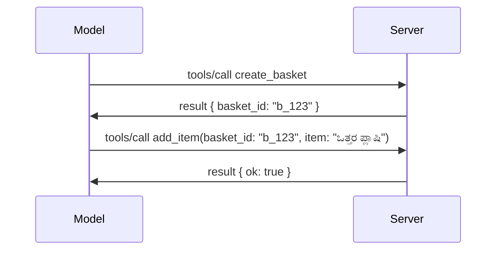

# MCP ನಲ್ಲಿ ಏನು ಬದಲಾಗುತ್ತಿದೆ: 2026-07-28 ಬಿಡುಗಡೆ ಅಭ್ಯರ್ಥಿ

> **ಸ್ಥಿತಿ:** ಬಿಡುಗಡೆ ಅಭ್ಯರ್ಥಿ. `2026-07-28` ವಿಶೇಷಣವು ಬರೆವು ಸಮಯದಲ್ಲಿ ಅಂತಿಮವಿಲ್ಲ. ಮೇ 21, 2026 ರಂದು ಪ್ರಕಟಾಯಿತು, ಮತ್ತು ಜುಲೈ 28, 2026 ರಂದು ರವಾನಿಸಲು  ಯೋಜಿಸಲಾಗಿದೆ. ಈ ಪಾಠದಲ್ಲಿ ಎಲ್ಲವೂ ಬಿಡುಗಡೆ ಅಭ್ಯರ್ಥಿಯನ್ನು ವರ್ಣಿಸುತ್ತದೆ; ನಿರ್ಮಾಣ ಮಾಡಲು ಮೊದಲು [ಡ್ರಾಫ್ಟ್ ಸ್ಪೆಸಿಫಿಕೇಶನ್](https://modelcontextprotocol.io/specification/draft) ಮತ್ತು ಅದರ [ಚೇಂಜ್‌ಲಾಗ್](https://modelcontextprotocol.io/specification/draft/changelog) ಅನ್ನು ಪರಿಶೀಲಿಸಿ. ಈ ವಿಧಾನದ ಉಳಿದ ಭಾಗವು ಪ್ರಸ್ತುತ ಸ್ಥಿರ ಬಿಡುಗಡೆ **MCP ಸ್ಪೆಸಿಫಿಕೇಶನ್ 2025-11-25** ಆಧಾರಿತವಾಗಿದೆ ಮತ್ತು `2026-07-28` ಬಿಡುಗಡೆ ಆದ ನಂತರ ನವೀಕರಿಸಲಾಗುವುದು.

## ಅವಲೋಕನ

`2026-07-28` MCP ಆರಂಭಿಸಿದ ನಂತರದ ಅತಿದೊಡ್ಡ ಪರಿಷ್ಕರಣೆ. ಆರು ಸ್ಪೆಸಿಫಿಕೇಶನ್ ಎನ್ಹಾನ್ಸ್‌ಮೆಂಟ್ ಪ್ರಪೋಸೆಲ್ಸ್ (SEPಗಳು) ಪ್ರೊಟೋಕಾಲ್-ಮಟ್ಟದ ಸೆಶನ್‌ಗಳನ್ನು ತೆಗೆಯುತ್ತವೆ ಮತ್ತು MCP ಅನ್ನು ಟ್ರಾನ್ಸ್‌ಪೋರ್ಟ್ ಲೇಯರ್‌ನಲ್ಲಿ ಸ್ಟೇಟ್ಲೆಸ್ ಆಗಿಸುತ್ತವೆ, ವಿಸ್ತರಣೆಗಳು ಮೊದಲ ದರ್ಜೆಯ, ಆವೃತ್ತಿ ನಿರ್ವಹಿತ ವಿಧಾನವಾಗುತ್ತವೆ, ಮತ್ತು ನೀವು ಈ ವಿಧಾನದ ಮೊದಲು ಕಲಿತ ಕೆಲವು ವೈಶಿಷ್ಟ್ಯಗಳು (ರೂಟ್ಸ್, ಸ್ಯಾಂಪ್ಲಿಂಗ್, ಲಾಗಿಂಗ್) ಹೊಸ ಜೀವನಚರ್ಯಾ ನೀತಿಯಡಿ ಡಿಪ್ರಿಕೇಟೆಡ್ ಎಂದು ಗುರುತಿಸಲ್ಪಟ್ಟಿವೆ. ಈ ಪಾಠವು ಏನು ಬದಲಾಗುತ್ತಿದೆ, ಏಕೆ ಇದು ಮುಖ್ಯವಾಗಿದೆ ಮತ್ತು ಇದು ನೀವು ಈಗಾಗಲೇ `2025-11-25` ಆಧಾರಿತವಾಗಿ ಬರೆಯುತ್ತಿರುವ ಕೋಡ್‌ಗೆ ಏನು ಅರ್ಥವೋ ಸಮರೋಪಿಸುತ್ತದೆ.

ಮೂಲ: [2026-07-28 MCP ಸ್ಪೆಸಿಫಿಕೇಶನ್ ಬಿಡುಗಡೆಯ ಅಭ್ಯರ್ಥಿ](https://blog.modelcontextprotocol.io/posts/2026-07-28-release-candidate/) (ಮಾಡೆಲ್ ಕಾಂಟೆಕ್ಸ್ಟ್ ಪ್ರೋಟೋಕಾಲ್ ಬ್ಲಾಗ್, ಡೇವಿಡ್ ಸೋರಿಯಾ ಪಾರ್ರಾ ಮತ್ತು ಡೆನ್ ಡೆಲಿಮಾರ್ಸ್ಕಿ).

## ಕಲಿಕೆಯ ಗುರಿಗಳು

ಈ ಪಾಠದ ಕೊನೆಯಲ್ಲಿ, ನೀವು ಆಗಬೇಕಾಗಿರುವುದು:

- MCP ಯಾಕೆ ಸ್ಟೇಟ್ಲೆಸ್ ಪ್ರೊಟೋಕಾಲ್ ಕೋರ್‌ಗಳಿಗೆ ಸಾಗುತ್ತಿದೆ ಮತ್ತು ಇದು ಹೋರಿಜಾಂಟಲ್ ಆಗಿ ವಿಸ್ತರಿಸುವ ನಿಯೋಜನೆಗಳಿಗೆ ಯಾವ ಸಮಸ್ಯೆಯನ್ನು ಪರಿಹರಿಸುತ್ತದೆ ಎಂದು ವಿವರಿಸಬಹುದು.
- `initialize`/`initialized` ಹ್ಯಾಂಡ್‌ಶೇಕ್ ಮತ್ತು `Mcp-Session-Id` ಹೆಡರ್ ಅನ್ನು ಹೇಗೆ ಬದಲಾಗುತ್ತದೆ ಎಂದು ವಿವರಿಸಬಹುದು.
- ಹೊಸ `Mcp-Method` ಮತ್ತು `Mcp-Name` ಹೆಡರ್‌ಗಳು ಮತ್ತು `ttlMs`/`cacheScope` ಕ್ಯಾಶಿಂಗ್ ಮೆಟಾಡೇಟಾವನ್ನು ಗುರುತಿಸಬಹುದು.
- ವಿಸ್ತರಣೆಗಳ ಫ್ರೇಮ್‌ವರ್ಕ್ ಮತ್ತು ಈ ಬಿಡುಗಡೆ ಜೊತೆಗೆ ಬಂದಿರುವ ಎರಡೂ ವಿಸ್ತರಣೆಗಳು: MCP ಆಪ್ಸ್ ಮತ್ತು ಟಾಸ್ಕ್‌ಗಳನ್ನು ಗುರುತಿಸಬಹುದು.
- OAuth 2.0 / OIDC ಹೊಂದಾಣಿಕೆಯನ್ನು ಕಠಿಣಗೊಳಿಸುವ ಆರು ಅನುಮತಿ SEPs ಪಟ್ಟಿಮಾಡಬಹುದು.
- ಈಗ ಡಿಪ್ರಿಕೇಟೆಡ್ ಆಗಿರುವ ಮೂಲವುಳ್ಳ ಪ್ರಮುಖ ವೈಶಿಷ್ಟ್ಯಗಳು (ರೂಟ್ಸ್, ಸ್ಯಾಂಪ್ಲಿಂಗ್, ಲಾಗಿಂಗ್) ಯಾವವು, ಮತ್ತು ಅದರಿಂದ ವ್ಯವಹಾರದಲ್ಲಿ ಏನು ಅರ್ಥವೋ ವಿವರಿಸಬಹುದು.
- ಉಪಕರಣಗಳ `inputSchema`/`outputSchema` ಗೆ ಪೂರ್ಣ JSON Schema 2020-12 ಬದಲಾವಣೆ ವಿವರಿಸಬಹುದು.

## ಸ್ಟೇಟ್ಲೆಸ್ ಪ್ರೊಟೋಕಾಲ್

ಮುಖ್ಯ ಬದಲಾವಣೆ: MCP ಪ್ರೋಟೋಕಾಲ್ ಲೇಯರ್‌ನಲ್ಲಿ ಸ್ಟೇಟ್ಲೆಸ್ ಆಗುತ್ತದೆ.

### ಮುಂಚಿನದು (2025-11-25): ಸೆಶನ್‌ಗಳು ನಿಮಗೆ ಒಂದು ಸರ್ವರ್ ಇನ್ಸ್ಟನ್ಸ್‌ಗೆ ಪಿನ್ ಮಾಡುತ್ತವೆ

ಸ್ಟ್ರೀಮಬಲ್ HTTP ಮೂಲಕ ಟೂಲ್ ಅನ್ನು ಕರೆ ಮಾಡುವುದನ್ನು `initialize` ಹ್ಯಾಂಡ್‌ಶೇಕ್ ಪ್ರಾರಂಭಿಸುತ್ತದೆ. ಸರ್ವರ್ ಪ್ರತಿಕ್ರಿಯೆ `Mcp-Session-Id` ಹೆಡರ್ ಜೊತೆಗೆ ಬರುತ್ತದೆ, ಇದನ್ನು ಪ್ರತಿ ನಂತರದ ವಿನಂತಿಯೂ ಹೊತ್ತಿರಬೇಕು:

```http
POST /mcp HTTP/1.1
Mcp-Session-Id: 1868a90c-3a3f-4f5b
Content-Type: application/json

{"jsonrpc":"2.0","id":2,"method":"tools/call",
 "params":{"name":"search","arguments":{"q":"otters"}}}
```

ಏಕೆಂದರೆ ಸೆಶನ್ ಅದನ್ನು ಹೊರತಂದ ಸರ್ವರ್ ಇನ್ಸ್ಟನ್ಸ್‌ಗೆ ಬಿಗಿಯಾಗಿ ಬಿಂಧವಾಗಿರುತ್ತದೆ, ಹೊರಿಜಾಂಟಲ್ ವಿಸ್ತರಿಸಿದ ನಿಯೋಜನೆಗಳಿಗೆ ಲೋಡ್ ಬ್ಯಾಲೆನ್ಸರ್‌ನಲ್ಲಿ **ಸ್ಟಿಕ್ಕಿ ರೌಟಿಂಗ್** ಮತ್ತು ಇನ್ಸ್ಟನ್ಸ್‌ಗಳ ನಡುವೆ **ಹಂಚಿಕೊಂಡ ಸೆಶನ್ ಸ್ಟೋರ್** ಅಗತ್ಯವಿದೆ.

### ನಂತರ (2026-07-28): ಪ್ರತಿ ವಿನಂತಿ സ്വയം-ಸಂಗ್ರಹಿತವಾಗಿದೆ

```http
POST /mcp HTTP/1.1
MCP-Protocol-Version: 2026-07-28
Mcp-Method: tools/call
Mcp-Name: search
Content-Type: application/json

{"jsonrpc":"2.0","id":1,"method":"tools/call",
 "params":{"name":"search","arguments":{"q":"otters"},
           "_meta":{"io.modelcontextprotocol/clientInfo":{"name":"my-app","version":"1.0"}}}}
```

ಯಾವುದೇ ಸರ್ವರ್ ಇನ್ಸ್ಟನ್ಸ್ ಈ ವಿನಂತಿಯನ್ನು ನಿಭಾಯಿಸಬಹುದು. ಪ್ರಮುಖ ಬದಲಾವಣೆಗಳು:

- **`initialize`/`initialized` ಹ್ಯಾಂಡ್‌ಶೇಕ್ ತೆಗೆದುಹಾಕಲಾಗಿದೆ** ([SEP-2575](https://github.com/modelcontextprotocol/modelcontextprotocol/pull/2575)). ಪ್ರೋಟೋಕಾಲ್ ಆವೃತ್ತಿ, ಕ್ಲೈಂಟ್ ಮಾಹಿತಿ ಮತ್ತು ಕ್ಲೈಂಟ್ ಸಾಮರ್ಥ್ಯಗಳು ಪ್ರತಿ ವಿನಂತಿಯಲ್ಲಿ `_meta` ಗೆ ಸಾಗಿವೆ. ಹೊಸ `server/discover` ವಿಧಾನವು ಕ್ಲೈಂಟ್‌ಗಳಿಗೆ ಬೇಕಾದಾಗ ಸರ್ವರ್ ಸಾಮರ್ಥ್ಯಗಳನ್ನು ಮೊದಲೇ ಪಡೆಯಲು ಅನುಮತಿಸುತ್ತದೆ.
- **`Mcp-Session-Id` ಹೆಡರ್ ಮತ್ತು ಪ್ರೊಟೋಕಾಲ್-ಮಟ್ಟದ ಸೆಶನ್ ತೆಗೆದುಹಾಕಲಾಗಿದೆ** ([SEP-2567](https://github.com/modelcontextprotocol/modelcontextprotocol/pull/2567)). ಪ್ರೋಟೋಕಾಲ್ ಲೇಯರ್‌ನಲ್ಲಿ ಸ್ಟಿಕ್ಕಿ ರೌಟಿಂಗ್ ಮತ್ತು ಹಂಚಿಕೊಂಡ ಸೆಶನ್ ಸ್ಟೋರ್‌ಗಳು ಈಗ ಅಗತ್ಯವಿಲ್ಲ.

### ಸ್ಟೇಟ್ಲೆಸ್ ಪ್ರೊಟೋಕಾಲ್, ಸ್ಥಿತಿ ಇರುವ ಅಪ್ಲಿಕೇಶನ್ಗಳು

ಪ್ರೋಟೋಕಾಲ್-ಮಟ್ಟದ ಸೆಶನ್ ತೆಗೆದುಹಾಕಿದರೂ ನಿಮ್ಮ ಸರ್ವರ್ ಸ್ಥಿತಿಸ್ಥಾಪಕವಾಗಿರದ ಹೊರತುಪಡಿಸುವುದಿಲ್ಲ. ಶಿಫಾರಸು ಮಾಡಲಾದ ಮಾದರಿ HTTP API ಗಳಂತೆಯೇ: ಒಂದು ಟೂಲ್ ಕರೆದಿಂದ ಸ್ಪಷ್ಟ ಹ್ಯಾಂಡಲ್ (ಒಂದು `basket_id`, ಒಂದು `browser_id`) ನಿಕಷಿಪಿಸುವುದು ಮತ್ತು ಆ ಹ್ಯಾಂಡಲ್ ನಂತರದ ಕರೆಗಳಲ್ಲಿ ಸಾಮಾನ್ಯ.argumentವಾಗಿ ಮಾದಲು ಹಿಂತಿರುಗಿಸುವುದು.



ಇದರಿಂದ ಸ್ಥಿತಿ ಮಾದರಿ ಪಾಲಿಗೆ ಗೋಚರವಾಗಿ ಮತ್ತು ಸೂಕ್ತವಾಗಿ ಕಾಣುತ್ತದೆ, ಟ್ರಾನ್ಸ್‌ಪೋರ್ಟ್ ಮೆಟಾಡೇಟಾದಲ್ಲಿ ಮರೆಮಾಚಲ್ಪಡುವುದಿಲ್ಲ, ಮತ್ತು ಯಾವುದೇ ಸರ್ವರ್ ಇನ್ಸ್ಟನ್ಸ್ ಯಾವುದೇ ಕರೆ ನಿಭಾಯಿಸಲು ಹೊಂದಿದೆ.

### ಸರ್ವರ್-ಟು-ಕ್ಲೈಂಟ್ ವಿನಂತಿಗಳು, ಪುನರ್ ರಚಿಸಲಾಗಿದೆ

ಸ್ಟೇಟ್ಲೆಸ್ ಪ್ರೊಟೋಕಾಲ್ ಸಹ ಸರ್ವರ್‌ಗೆ ಮಧ್ಯಕ್ಕೆ (ಉದಾಹರಣೆಗೆ, ಯಾವುದೇ ಪ್ರಶ್ನೆ ಕೇಳಲು) ಕ್ಲೈಂಟ್‌ಗೆ ಕೇಳಲು ಒಂದು ಮಾರ್ಗ ಬೇಕಾಗುತ್ತದೆ:

- **ಸರ್ವರ್ ಪ್ರೇರಿತ ವಿನಂತಿಗಳನ್ನು ಮಾತ್ರ ಸರ್ವರ್ ಸಕ್ರಿಯವಾಗಿ ಕ್ಲೈಂಟ್ ವಿನಂತಿಯನ್ನು ಪ್ರಕ್ರಿಯೆ ಮಾಡುತ್ತಿರುವಾಗ ನೀಡಬಹುದು** ([SEP-2260](https://github.com/modelcontextprotocol/modelcontextprotocol/pull/2260)) — ಹಿಂದಿನಂತೆ ಶಿಫಾರಸು ಪ್ರತಿಯ now, ಈಗ ಅವಶ್ಯಕತೆ. ಬಳಕೆದಾರರು ಅನೆಕವಾಗಿಯೂ ಅನಿರೀಕ್ಷಿತವಾಗಿ ಪ್ರಾಂಪ್ಟ್ ಮಾಡಿಕೊಳ್ಳಲಾರರು.
- **ಬಹುಮಟ್ಟದ ಟ್ರಿಪ್ ವಿನಂತಿಗಳು** ([SEP-2322](https://github.com/modelcontextprotocol/modelcontextprotocol/pull/2322)) SSE ಸ್ಟ್ರೀಮ್ ತೆರೆಯುವುದನ್ನು ಬದಲಾಯಿಸುತ್ತವೆ. ಬದಲಾಗಿ, ಸರ್ವರ್ `InputRequiredResult` ನ್ನು ಹಿಂತಿರುಗಿಸುತ್ತದೆ:

  ```json
  {
    "resultType": "inputRequired",
    "inputRequests": {
      "confirm": {
        "type": "elicitation",
        "message": "Delete 3 files?",
        "schema": { "type": "boolean" }
      }
    },
    "requestState": "eyJzdGVwIjoxLCJmaWxlcyI6WyJhIiwiYiIsImMiXX0="
  }
  ```

  ಕ್ಲೈಂಟ್ ಉತ್ತರಗಳನ್ನು ಸಂಗ್ರಹಿಸಿ ಮೂಲ ಕರೆ ಮತ್ತೆ `inputResponses` ಜೊತೆಗೆ `requestState` ನ್ನು ಹಾಕಿ ಮರುಪಡೆಸುತ್ತದೆ. ಯಾವ ಸರ್ವರ್ ಇನ್ಸ್ಟನ್ಸ್ ಇದನ್ನು ಸ್ವೀಕರಿಸಬಹುದು ಏಕೆಂದರೆ ಬೇಕಾದ ಎಲ್ಲಾ ಮಾಹಿತಿಯು ಪೇಲೋಡ್‌ನಲ್ಲಿ ಇದೆ.

### ರೌಟಬಲ್, ಕ್ಯಾಶಬಲ್, ಟ್ರೇಸಬಲ್

ಮೂರು ಸಣ್ಣ ಬದಲಾವಣೆಗಳು ಸ್ಟೇಟ್ಲೆಸ್ ಟ್ರಾಫಿಕ್ ನಿರ್ವಹಣೆಯನ್ನು ಸುಭದ್ರಗೊಳಿಸುತ್ತವೆ:

- **ಸ್ಟ್ರೀಮಬಲ್ HTTP ಮೇಲಿನ `Mcp-Method` ಮತ್ತು `Mcp-Name` ಹೆಡರ್‌ಗಳು ಅಗತ್ಯವಿವೆ** ([SEP-2243](https://github.com/modelcontextprotocol/modelcontextprotocol/pull/2243)), ಆದ್ದರಿಂದ ಲೋಡ್ ಬ್ಯಾಲೆನ್ಸರ್‌ಗಳು, ಗೇಟ್ವೇಗಳು ಮತ್ತು ದರ ನಿಯಂತ್ರಕರು JSON ಶರೀರವನ್ನು ಪರಿಶೀಲಿಸದೇ ಕಾರ್ಯಾಚರಣೆ ಆಧರಿಸಿ ರೌಟ್ ಮಾಡಬಹುದು. ಹೆಡರ್ಸ್ ಮತ್ತು ಶರೀರ ಸರಿಹೊಂದದ ವಿನಂತಿಗಳನ್ನು ಸರ್ವರ್ ನಿರಾಕರಿಸುತ್ತದೆ.
- **`tools/list` ಮತ್ತು ಸಂಪನ್ಮೂಲ ಓದು ಫಲಿತಾಂಶಗಳು `ttlMs` ಮತ್ತು `cacheScope` ಹೊಂದಿವೆ** ([SEP-2549](https://github.com/modelcontextprotocol/modelcontextprotocol/pull/2549)), HTTP `Cache-Control` ಆಧಾರಿತ. ಕ್ಲೈಂಟ್‌ಗಳು ಪಟ್ಟಿಯ ಫಲಿತಾಂಶ ಎಷ್ಟು ದಿನ ಹೊಸದಾಗಿ ಇದೆ ಮತ್ತು ಇದನ್ನು ಬಳಕೆದಾರರಿಗೆ ಹಂಚಿಕೊಳ್ಳಲು ಸುರಕ್ಷಿತವೋ ಎಂದು ತಿಳಿದುಕೊಳ್ಳುತ್ತವೆ, ದಿನಮಿತಿಯ SSE ಸ್ಟ್ರೀಮ್ ಅಗತ್ಯವಿಲ್ಲದೆ ಬದಲಾವಣೆಗಳನ್ನು ತಿಳಿಯಲು.
- **`_meta` ನಲ್ಲಿ W3C ಟ್ರೇಸ್ ಕಾಂಟೆಕ್ಸ್ಟ್ ಪ್ರಚಲನವನ್ನು ದಾಖಲೆ ಮಾಡಲಾಗಿದೆ** ([SEP-414](https://github.com/modelcontextprotocol/modelcontextprotocol/pull/414)), `traceparent`, `tracestate`, ಮತ್ತು `baggage` ಕೀಲಿಮಣೆಗಳನ್ನು ಸರಿಪಡಿಸುವ ಮೂಲಕ ಕ್ಲೈಂಟ್ SDK, MCP ಸರ್ವರ್ ಮತ್ತು ಡೌನ್ಸ್ಟ್ರೀಮ್ ವ್ಯವಸ್ಥೆಗಳ ನಡುವೆ [OpenTelemetry](https://opentelemetry.io/) ಹೊಂದಾಣಿಕೆಯ ಬ್ಯಾಕೆಂಡ್‌ನಲ್ಲಿ ಡಿಸ್ಟ್ರಿಬ್ಯೂಟೆಡ್ ಟ್ರೇಸ್ ಅನುಸರಿಸಬಹುದು.

## ವಿಸ್ತರಣೆಗಳು ಮೊದಲ ದರ್ಜೆಯವಾಗುತ್ತವೆ

ವಿಸ್ತರಣೆಗಳು `2025-11-25` ನಲ್ಲಿ ಅನೌಪಚಾರಿಕವಾಗಿ ಉಂಟಾಗಿದ್ದವು. [SEP-2133](https://github.com/modelcontextprotocol/modelcontextprotocol/pull/2133) ಅವುಗಳನ್ನು ಅಧಿಕೃತಗೊಳಿಸುತ್ತದೆ:

- ವಿಸ್ತರಣೆಗಳು ರಿವರ್ಸ್-DNS ID ಗಳ ಮೂಲಕ ಗುರುತಿಸಲಾಗುತ್ತವೆ.
- ಅವುಗಳು ಕ್ಲೈಂಟ್ ಮತ್ತು ಸರ್ವರ್ ಸಾಮರ್ಥ್ಯಗಳಲ್ಲಿ `extensions` ನಕ್ಷೆಯಲ್ಲಿ ಸಂಧಾನಗೊಳ್ಳುತ್ತವೆ.
- ಅವುಗಳ ಸ್ವಂತ `ext-*` ರೆಪೊಗಳಲ್ಲಿ ವಾಸಿಸುತ್ತವೆ, ನಿಯೋಜಿತ ನಿರ್ವಾಹಕರಿರುತ್ತಾರೆ ಹಾಗು ಕೋರ್ ಸ್ಪೆಸಿಫಿಕೇಶನ್‌ನಿಂದ ಸ್ವತಃ ಆವೃತ್ತಿ ಇಳಿಸುವಿಕೆ ಮಾಡುತ್ತವೆ.
- SEP ಪ್ರಕ್ರಿಯೆಯಲ್ಲಿ ಹೊಸ ವಿಸ್ತರಣೆ ಟ್ರ್ಯಾಕ್‌ವು ಅವುಗಳನ್ನು ಪ್ರಯೋಗಾತ್ಮಕದಿಂದ ಉಚಿತ ಅಧಿಕೃತಕ್ಕೆ ಹೋಗುವ ಮಾರ್ಗವನ್ನು ನೀಡುತ್ತದೆ.

ಈ ಬಿಡುಗಡೆ ಎರಡು ಅಧಿಕೃತ ವಿಸ್ತರಣೆಗಳನ್ನು ಬಿಡುಗಡೆಮಾಡುತ್ತದೆ.

### MCP ಆಪ್ಸ್: ಸರ್ವರ್-ರೆಂಡರ್ ಮಾಡಿದ ಬಳಕೆದಾರ ಇಂಟರ್ಫೇಸುಗಳು

[MCP ಆಪ್ಸ್](https://blog.modelcontextprotocol.io/posts/2026-01-26-mcp-apps/) ([SEP-1865](https://github.com/modelcontextprotocol/modelcontextprotocol/pull/1865)) ಸರ್ವರ್‌ಗಳಿಗೆ ಸ್ಯಾಂಡ್‌ಬಾಕ್ಸ್ ಐಫ್ರೇಮ್‌ನೊಳಗೆ ಹೋಸ್ಟ್‌ಗಳು ರೆಂಡರ್ ಮಾಡಬಹುದಾದ ಪರಸ್ಪರ ಕ್ರಿಯಾತ್ಮಕ HTML ಇಂಟರ್ಫೇಸುಗಳು ಬಿಡುಗಡೆ ಮಾಡಲು ಅನುಮತಿಸುತ್ತದೆ. ಟೂಲ್‌ಗಳು ತಮ್ಮ UI ಟೆಂಪ್ಲೇಟುಗಳನ್ನು ಮೊದಲು ಘೋಷಿಸಿ ಹೋಸ್ಟ್‌ಗಳು ಅವುಗಳನ್ನು ಮೊದಲು ಪಡೆದು, ಕ್ಯಾಶೆ ಮಾಡಿ, ಮತ್ತು ಭದ್ರತಾ ವಿಮರ್ಶೆ ಮಾಡಬಹುದು. ನೀವು ಈಗಾಗಲೇ [ಪಾಠ 15: MCP ಆಪ್ಸ್](../03-GettingStarted/15-mcp-apps/README.md) ನಲ್ಲಿ ಇದರ ಮೂಲಭೂತಾಂಶವನ್ನು ಮುಚ್ಚುತ್ತಿದ್ದಾರೆ — ವಿಸ್ತರಣೆಗಳ ಫ್ರೇಮ್‌ವರ್ಕ್ ಅಡಿಯಲ್ಲಿ MCP ಆಪ್ಸ್ ಈಗ ಅಧಿಕೃತ ವಿಸ್ತರಣೆಯಾಗಿದೆ, ಪ್ರಯೋಗಾತ್ಮಕ ಕೋರ್ ವೈಶಿಷ್ಟ್ಯವಲ್ಲ.

### ಟಾಸ್ಕ್‌ಗಳು ವಿಸ್ತರಣೆಗೆ ಪದವಿ ಪಡೆದಿವೆ

ಟಾಸ್ಕ್‌ಗಳು `2025-11-25` ನಲ್ಲಿ ಪ್ರಯೋಗಾತ್ಮಕ ಕೋರ್ ವೈಶಿಷ್ಟ್ಯವಾಗಿ ಬಂದವು. ಉತ್ಪಾದನಾ ಬಳಕೆಯು ಪುನಾರೂಪಣೆಯಾಗಬೇಕಾದಷ್ಟು ಸಮಸ್ಯೆಗಳನ್ನು ಕಂಡಿತು ಆದ್ದರಿಂದ ಸರಿಯಾದ ಸ್ಥಳ ವಿಸ್ತರಣೆ: [ಟಾಸ್ಕ್ ವಿಸ್ತರಣೆ](https://github.com/modelcontextprotocol/modelcontextprotocol/pull/2663) ಸ್ಟೇಟ್ಲೆಸ್ ಮಾದರಿನ ಸುತ್ತಲೆಯ ಜೀವನಚರ್ಯೆಯನ್ನು ಪುನರ್ ವಿನ್ಯಾಸ ಮಾಡುತ್ತದೆ — ಸರ್ವರ್ `tools/call` ಗೆ ಟಾಸ್ಕ್ ಹ್ಯಾಂಡಲ್ ಜೊತೆಗೆ ಉತ್ತರಿಸಬಹುದು, ಮತ್ತು ಕ್ಲೈಂಟ್ ಅದನ್ನು `tasks/get`, `tasks/update`, ಮತ್ತು `tasks/cancel` ಮೂಲಕ ಮುಂದೇಟು ಮಾಡಬಹುದು. ಟಾಸ್ಕ್ ರಚನೆ ಸರ್ವರ್-ನಿರ್ದೇಶಿತವಾಗಿದೆ: ಕ್ಲೈಂಟ್ ವಿಸ್ತರಣೆಯನ್ನು ಜಾಹಿರ ಮಾಡುತ್ತದೆ ಮತ್ತು ಸರ್ವರ್ ಯಾವಾಗ ಕರೆ ಟಾಸ್ಕ್ ಆಗಿ ಕಾರ್ಯನಿರ್ವಹಿಸಬೇಕು ಎಂದು ನಿರ್ಧರಿಸುತ್ತದೆ. `tasks/list` ಸಂಪೂರ್ಣವಾಗಿ ತೆಗೆದುಹಾಕಲಾಗಿದೆ ಏಕೆಂದರೆ ಅದು ಸೆಶನ್‌ಗಳಿಲ್ಲದೆ ಸುರಕ್ಷಿತವಾಗಿ ವ್ಯಾಪ್ತಿಯಾಗಲು ಸಾಧ್ಯವಿಲ್ಲ.

> **ಸ್ಥಾನಾಂತರ ಟಿಪ್ಪಣಿ:** ನೀವು  ಪ್ರಯೋಗಾತ್ಮಕ `2025-11-25` ಟಾಸ್ಕ್ಸ್ API ಅನ್ನು ಜಾರಿಗೊಳಿಸಿದ್ದು ಅಂದರೆ, ನೀವು ಹೊಸ ವಿಸ್ತರಣೆಯ ಜೀವನಚರ್ಯದೊಂದಿಗೆ ಸ್ಥಳಾಂತರಿಸಬೇಕಾಗುತ್ತದೆ — ಇದು ಹಿಂಬದಿಯ ಹೊಂದಾಣಿಕೆಯಾಗಿಲ್ಲ.

## ಅನುಮತಿ ಕಠಿಣಗೊಳಿಸುವಿಕೆ

ಆರು SEPಗಳು [ಅನುಮತಿ ಸ್ಪೆಸಿಫಿಕೇಶನ್](https://modelcontextprotocol.io/specification/draft/basic/authorization) ಅನ್ನು ಪ್ರಾಕ್ಟಿಕಲ್ OAuth 2.0 / OpenID Connect ನಿಯೋಜನೆಗಳಿಗೆ ಹತ್ತಿರವಾಗಿ ಹೊಂದಾಣಿಕೆಗೆ ಕಠಿಣಗೊಳಿಸುತ್ತವೆ:

| SEP | ಬದಲಾವಣೆ |
|---|---|
| [SEP-2468](https://github.com/modelcontextprotocol/modelcontextprotocol/pull/2468) | ಅನುಮತಿ ಪ್ರತಿಕ್ರಿಯೆಗಳಲ್ಲಿ `iss` ಪರಿಮಾಣವನ್ನು ಗ್ರಾಹಕರು [RFC 9207](https://www.rfc-editor.org/rfc/rfc9207) ಪ್ರಕಾರ ಮಾನ್ಯ ಗಣನೆಯಾಗಿ ಪರಿಶೀಲಿಸಬೇಕು, ಇದು MCP ಯೊಂದು-ಕ್ಲೈಂಟ್, ಬಹು-ಸರ್ವರ್ ಮಾದರಿಯಲ್ಲಿ ಸಾಮಾನ್ಯವಾಗಿರುವ ಮಿಕ್ಸ್-ಅಪ್ ದಾಳಿಗಳಿಂದ ತಡೆಯುತ್ತದೆ. ಭವಿಷ್ಯದಲ್ಲಿ ಇಲ್ಲದ `iss` ಹೊಂದಿದ್ದ ಪ್ರತಿಕ್ರಿಯೆಗಳನ್ನು ನಿರಾಕರಿಸುವುದು ಕಡ್ಡಾಯವಾಗುತ್ತದೆ. |
| [SEP-837](https://github.com/modelcontextprotocol/modelcontextprotocol/pull/837) | ಡೈನಾಮಿಕ್ ಕ್ಲೈಂಟ್ ನೋಂದಣಿಯ ಸಮಯದಲ್ಲಿ ಗ್ರಾಹಕರು ತಮ್ಮ OpenID Connect `application_type` ಅನ್ನು ಘೋಷಿಸಬೇಕು, ಪ್ರತಿಸ್ಪರ್ಧೆ ಸರ್ವರ್‌ಗಳು ಡೆಸ್ಕ್‌ಟಾಪ್/CLI ಕ್ಲೈಂಟ್‌ಗಳನ್ನು `"web"` ಗೆ ಪೂರ್ವನಿಯೋಜಿಸುವುದಿಲ್ಲ ಮತ್ತು ಅವುಗಳ localhost ರಿಡೈರೆಕ್ಟ್ URI ಅನ್ನು ನಿರಾಕರಿಸುವುದಿಲ್ಲ. |
| [SEP-2352](https://github.com/modelcontextprotocol/modelcontextprotocol/pull/2352) | ಗ್ರಾಹಕರು ನೋಂದಾಯಿಸಲಾದ ಕ್ರೆಡೆನ್ಶಿಯಲ್ಗಳನ್ನು ಇಷ್ಯೂ ಮಾಡುವ ಅನುಮತಿ ಸರ್ವರ್‌ನ `issuer` ಗೆ ಅಡ್ಡವಾಗಿ ಬಿಗಿಯಾದಂತೆ ಬಿಂಧಿಸಬೇಕು ಮತ್ತು ಸಂಪನ್ಮೂಲಗಳು ಅನುಮತಿ ಸರ್ವರ್‌ಗಳ ನಡುವೆ ಸ್ಥಳಾಂತರವಾಗುವಾಗ ಮರು ನೋಂದಾಯಿಸಬೇಕು. |
| [SEP-2207](https://github.com/modelcontextprotocol/modelcontextprotocol/pull/2207) | OpenID Connect ಶೈಲಿಯ ಅನುಮತಿ ಸರ್ವರ್‌ಗಳಿಂದ ರಿಫ್ರೆಶ್ ಟೋಕನ್‌ಗಳನ್ನು ಕೇಳಲು ಹೇಗೆ ಎಂದು ಡಾಕ್ಯುಮೆಂಟು ಮಾಡುತ್ತದೆ. |
| [SEP-2350](https://github.com/modelcontextprotocol/modelcontextprotocol/pull/2350) | ಹಂತ ಏರಿಕೆಯಿನ ಅನುಮತಿ ಸಮಯದಲ್ಲಿ ವ್ಯಾಪ್ತಿಯ ಸಂಗ್ರಹಣೆ ಸ್ಪಷ್ಟಪಡಿಸುತ್ತದೆ. |
| [SEP-2351](https://github.com/modelcontextprotocol/modelcontextprotocol/pull/2351) | `.well-known` ಡಿಸ್ಕವರಿ ಸಫಿಕ್ಸ್ ವಿವರಿಸುತ್ತದೆ. |

ನೀವು ಇಂದು MCP ಗೆ ಅನುಮತಿ ಸರ್ವರ್ ನಿರ್ಮಿಸುತ್ತಿದ್ದರೆ, ಈಗಿನ ಅನುಮತಿ ಮಾರ್ಗದರ್ಶನಕ್ಕಾಗಿ [02-ಸುರಕ್ಷತೆ](../02-Security/README.md) ನೋಡಿರಿ, ಈಗ `iss` ಅನ್ನು ಅನುಮತಿ ಪ್ರತಿಕ್ರಿಯೆಗಳಲ್ಲಿ ಪೂರೈಸಲು ಪ್ರಾರಂಭಿಸಿ.

## ರೂಪಗಳು, ಸ್ಯಾಂಪ್ಲಿಂಗ್ ಮತ್ತು ಲಾಗಿಂಗ್ ಡಿಪ್ರಿಕೇಟೆಡ್ ಆಗಿವೆ

ಹೊಸ [ಫೀಚರ್ ಜೀವನಚರ್ಯಾ ನೀತಿ](https://github.com/modelcontextprotocol/modelcontextprotocol/pull/2577) ([SEP-2577](https://github.com/modelcontextprotocol/modelcontextprotocol/pull/2577)) ಅಡಿ, ನೀವು [ಕೋರ್ ಕಾನ್ಸೆಪ್ಟ್ಗಳು](./README.md#roots) ನಲ್ಲಿ ಕಲಿತ ಮೂರು ಮುಖ್ಯ ಗ್ರಾಹಕ ಪ್ರಿಮಿಟಿವ್‌ಗಳು **ಡಿಪ್ರಿಕೇಟೆಡ್** ಸ್ಥಿತಿಗೆ ಮಾರ್ಪಟ್ಟಿವೆ:

| ವೈಶಿಷ್ಟ್ಯ | ಶಿಫಾರಸು ಮಾಡಲಾದ ಬದಲಾವಣೆ |
|---|---|
| ರೂಟ್‌ಗಳು | ಟೂಲ್ ಪ್ಯಾರಾಮೀಟರ್‌ಗಳು, ಸಂಪನ್ಮೂಲ URI ಗಳ ಅಥವಾ ಸರ್ವರ್ ಕಾನ್ಫಿಗರೇಶನ್ |
| ಸ್ಯಾಂಪ್ಲಿಂಗ್ | LLM ಪ್ರოვೈಡರ್ API ಗಳೊಂದಿಗೆ ನೇರ ಇಂಟಿಗ್ರೇಶನ್ |
| ಲಾಗಿಂಗ್ | `stderr` stdio ಸಂಚಾರಗಳಿಗೆ; ರಚನೆಗೊಳಿಸಿದ ವೀಕ್ಷಣೆಗೆ OpenTelemetry |

ಇವು **ಅನುವಾದ-ಮಾತ್ರ ಡಿಪ್ರಿಕೇಶನ್ಗಳು**: ವಿಧಾನಗಳು, ರೀತಿಗಳು ಮತ್ತು ಸಾಮರ್ಥ್ಯ ಧ್ವಜಗಳು ಈ ಬಿಡುಗಡೆ ಮತ್ತು ಆವೃತ್ತಿಯಲ್ಲಿ ಒಂದು ವರ್ಷ ಒಳಗೆ ಮಂಡಿಸಲಾದ ಯಾವುದೇ ಸ್ಪೆಸಿಫಿಕೇಶನ್ ಯಾವಾಗಲೂ ಕೆಲಸ ಮಾಡುತ್ತವೆ. ಅವುಗಳನ್ನು ಸಂಪೂರ್ಣವಾಗಿ ತೆಗೆದುಹಾಕಲು ಜೀವನಚರ್ಯಾ ನೀತಿಯಡಿ ಒಂದು SEP ಅಗತ್ಯವಿದೆ — ಆದ್ದರಿಂದ ನಿಮ್ಮ ಇತ್ತೀಚಿನ [ಸ್ಯಾಂಪ್ಲಿಂಗ್](../03-GettingStarted/14-sampling/README.md) ಉದಾಹರಣೆಗಳಲ್ಲಿ ಏನೂ ಮುರಿಯುವುದಿಲ್ಲ, ಆದರೆ ಹೊಸ ಸರ್ವರ್‌ಗಳು ಮೇಲಿನ ಬದಲಾವಣೆ ಮಾದರಿಗಳನ್ನು ಬಳಸಿಕೊಳ್ಳಬೇಕು.

## ಆಪ್ಸ್‌ ಪೂರೈಸಿದ JSON Schema 2020-12

ಟೂಲ್ `inputSchema` ಮತ್ತು `outputSchema` ಗಳು ಸಂಪೂರ್ಣ [JSON Schema 2020-12](https://json-schema.org/draft/2020-12) ಗೆ ಏರಲಾಗಿದೆ ([SEP-2106](https://github.com/modelcontextprotocol/modelcontextprotocol/pull/2106)):

- ಇನ್‌ಪುಟ್ ಸ್ಕೀಮಾಗಳು `type: "object"` ರೂಟ್ ನಿಯಮವನ್ನು ಇಡೀ ಇಟ್ಟುಕೊಂಡಿವೆ ಆದರೆ ಈಗ ಸಂಯೋಜನೆಗಳನ್ನು (`oneOf`, `anyOf`, `allOf`), ಷರತ್ತುಗಳನ್ನು ಮತ್ತು ರೆಫರೆನ್ಸ್‌ಗಳನ್ನು (`$ref`, `$defs`) ಅನುವುಮಾಡುತ್ತವೆ.
- ಔಟ್‌ಪುಟ್ ಸ್ಕೀಮಾಗಳು ನಿರ್ಬಂಧವಿಲ್ಲದವು, ಮತ್ತು `structuredContent` ಈಗ ಯಾವುದೇ JSON ಮೌಲ್ಯವಾಗಬಹುದು, ಕೇವಲ ಆಬ್ಜೆಕ್ಟ್ ಅಲ್ಲ.
- ಜಾರಿಗೊಂಡಿದವರು ಹೊರಗಿನ `$ref` URI ಗಳನ್ನು ಸ್ವಯಂಚಾಲಿತವಾಗಿ ಉದ್ಧರಿಸಬಾರದು ಮತ್ತು ಸ್ಕೀಮಾ ಆಳ ಮತ್ತು ಪರಿಶೀಲನಾ ಸಮಯವನ್ನು ಬಾಧ್ಯತೆ ಇಟ್ಟುಕೊಳ್ಳಬೇಕು (ನಿರಾಕರಣಾ ಸೇವೆ ಪರಿಗಣಿಸಿ ಆಗ.

ಪ್ರತ್ಯೇಕವಾಗಿ, ಸಂಪನ್ಮೂಲ ಕಾಣೆಯಾಗದ ಸಂದರ್ಭದ ದೋಷ ಕೋಡ್ MCP ಕಸ್ಟಮ್ `-32002` ಇಂದ JSON-RPC ಸ್ಥಿತಿಗತಿಯಿಂದ `-32602` (ಅಮಾನ್ಯ ಪರಾಮೀಟರ್‌ಗಳು) ಗೆ ಬದಲಾಗುತ್ತದೆ ([SEP-2164](https://github.com/modelcontextprotocol/modelcontextprotocol/pull/2164)). ನಿಮ್ಮ ಗ್ರಾಹಕ `-32002` ಹೋಲಿಸಿದರೆ ಅದನ್ನು ನವೀಕರಿಸಬೇಕು.

## ಪ್ರೋಟೋಕಾಲ್ ಇಲ್ಲಿ ಹೇಗೆ ಅಭಿವೃದ್ಧಿ ಹೊಂದುತ್ತದೆ

ಈ ಬಿಡುಗಡೆ ಮುರಿತ ಬದಲಾವಣೆಗಳನ್ನು ಹೊಂದಿದ್ದು, MCP ನಿರ್ವಾಹಕರು ಮುಂದೆ ಇವು ಸಾಮಾನ್ಯವಾಗುವುದಿಲ್ಲ ಎಂದು ಬಯಸುತ್ತಾರೆ. ಮೂರೂ ಆಡಳಿತ SEPಗಳು ಪುನರಾವೃತಿಯಾಗದಂತೆ ಒಪ್ಪಂದ ಮಾಡಿವೆ:

- **ಫೀಚರ್ ಜೀವನಚರ್ಯಾ ನೀತಿ** ಪ್ರತಿಯೊಂದು ವೈಶಿಷ್ಟ್ಯಕ್ಕೆ ಒಂದು ಸಕ್ರಿಯ → ಡಿಪ್ರಿಕೇಟೆಡ್ → ತೆಗೆದುಹಾಕುವ ಮಾರ್ಗ ನೀಡುತ್ತದೆ, ಡಿಪ್ರಿಕೇಶನ್ ಮತ್ತು ತೆಗೆದುಹಾಕುವಿಕೆಗೆ ಕನಿಷ್ಠ ಹನ್ನೊಂದು ತಿಂಗಳು ವ್ಯತ್ಯಾಸ ಇರುತ್ತದೆ.
- **ವಿಸ್ತರಣೆಗಳ ಫ್ರೇಮ್‌ವರ್ಕ್** ಹೊಸ ಸಾಮರ್ಥ್ಯಗಳನ್ನು ಆಪ್ಟ್-ಇನ್ ವಿಸ್ತರಣೆಗಳಾಗಿ ಬಿಡುಗಡೆ ಮಾಡುವುದಕ್ಕೆ ಅವಕಾಶ ನೀಡುತ್ತದೆ ಮತ್ತು ಅವು ಕೋರ್ ಸ್ಪೆಸಿಫಿಕೇಶನ್‌ಗೆ ಬರುವಾಗ (ಬರುವ ಸಾಧ್ಯತೆ ಇದ್ದಲ್ಲಿ) ಸ್ಥಿರಪಡಿಸಲು ಸಹಾಯ ಮಾಡುತ್ತದೆ.

- ಒಬ್ಬ Standards Track SEP ಅಂತಿಮ ಸ್ಥಿತಿಗೆ ತಲುಪಲು ಸಾಧ್ಯವಿಲ್ಲ, ಸರಿಹೊಂದುವ ದೃಶ್ಯಾವಳಿ [conformance suite](https://github.com/modelcontextprotocol/conformance) ([SEP-2484](https://github.com/modelcontextprotocol/modelcontextprotocol/pull/2484)) ನಲ್ಲಿ ಲ್ಯಾಂಡ್ ಆಗುವವರೆಗೆ — ಅದೇ suite ಅನ್ನು [SDK tier system](https://github.com/modelcontextprotocol/modelcontextprotocol/pull/1777) ಅಧಿಕೃತ SDK ಗಳ ವಿರುದ್ಧ ಅಂಕ ವಾಗಿಸುತ್ತದೆ.

## ರಿಲೀಸ್ ಟೈಮ್‌ಲೈನ್ ಮತ್ತು ಪರಿಶೀಲನೆ

- ರಿಲೀಸ್ ಅಭ್ಯರ್ಥಿಯನ್ನು 21 ಮೇ, 2026 ರಂದು ಲಾಕ್ ಮಾಡಲಾಗಿತ್ತು.
- ಅಂತಿಮ ವಿನ್ಯಾಸವನ್ನು 28 ಜುಲೈ, 2026 ಕ್ಕೆ ಯೋಜಿಸಲಾಗಿದೆ.
- ಎರಡರಮಧ್ಯೆ ಹತ್ತುವಾರದ ಕಿಟಕಿ SDK ನಿರ್ವಹಕರು ಮತ್ತು ಗ್ರಾಹಕ ಜಾರಿಗೆದರು ಬದಲಾವಣೆಗಳನ್ನು ನಿಜವಾದ ಕೆಲಸದ ಭಾರಗಳ ಎದುರಿಸಿ ಪರಿಶೀಲಿಸಲು ಅವಕಾಶ ನೀಡುತ್ತದೆ; Tier 1 SDK ಗಳು ಈ ಕಿಟಕಿಯಲ್ಲಿ ಬೆಂಬಲವನ್ನು ಸಾಗಿಸಲು ನಿರೀಕ್ಷಿಸಲಾಗಿದೆ [SDK tier system](https://modelcontextprotocol.io/docs/sdk) ಅಡಿಯಲ್ಲಿ.
- ಸಂಪೂರ್ಣ ಬದಲಾವಣೆಗಳ ಸರಣಿಯನ್ನು [ಡ್ರಾಫ್ಟ್ ವಿನ್ಯಾಸ](https://modelcontextprotocol.io/specification/draft) ಮತ್ತು ಅದರ [ಚೇಂಜ್‌ಲಾಗ್](https://modelcontextprotocol.io/specification/draft/changelog) ನಲ್ಲಿ ಅನುಸರಿಸಿ.

## ಈ ಪಠ್ಯಕ್ರಮಕ್ಕೆ ಇದರ ಅರ್ಥ ಏನು

ನೀವು ಈ ಕೋರ್ಸ್‌ನಲ್ಲಿ ಇದುವರೆಗೆ ಕಲಿತಿರುವ ಎಲ್ಲವೂ **2025-11-25** ಗಾಗಿ ಗುರಿಯಾಗಿದ್ದು, ಅದು `2026-07-28` ಬಿಡುಗಡೆ ಆಗುವವರೆಗೆ ಪ್ರಸ್ತುತ ಸ್ಥಿರ ವಿನ್ಯಾಸವಾಗಿದೆ. ಸ್ಪಷ್ಟವಾಗಿ:

- **ಸೆಷನ್ಗಳು ಮತ್ತು `initialize` ಹ್ಯಾಂಡ್‌ಶೇಕ್** ([Core Concepts](./README.md) ಮತ್ತು [ಪಾಠ 6: HTTP ಸ್ಟ್ರೀಮಿಂಗ್](../03-GettingStarted/06-http-streaming/README.md) ನಲ್ಲಿ ಅರ್ಪಿಸಲಾಗಿದೆ) ಇಂದಿನಂತೆ ಕಾರ್ಯನಿರ್ವಹಿಸುತ್ತವೆ, ಆದರೆ ನೀವು `2026-07-28` ಹೊಂದಾಣಿಕೆಯ SDK ಗಳಿಗೆ ಅಪ್‌ಗ್ರೇಡ್ ಮಾಡಿದರೆ ಅವನ್ನು ಮೇಲಿನ ಸ್ಥಿತರಹಿತ ವಿನಂತಿ ಮಾದರಿಯಿಂದ ಬದಲಾಯಿಸಲು ನಿರೀಕ್ಷಿಸಿ.
- **ಸ್ಯಾಂಪ್ಲಿಂಗ್ ಮತ್ತು ರೂಟ್‌ಗಳು** ([Core Concepts](./README.md) ನಲ್ಲಿ ಕೂಡ) ಪೂರ್ಣಗೊಳಗೊಂಡವು ಆದರೆ ಹಳೇದಾಗಿವೆ — ಹೊಸ ವಿನ್ಯಾಸಗಳು ಮೇಲಿನ ಬದಲಾವಣೆ ಮಾದರಿಗಳನ್ನು ಉತ್ತಮಪಡಿಸಬೇಕು.
- **ಪ್ರಯೋಗಾತ್ಮಕ ಟಾಸ್ಕ್ ವೈಶಿಷ್ಟ್ಯ**, ನೀವು ಬಳಸಿದ್ದರೆ, ಇದು ಟಾಸ್ಕ್ ವಿಸ್ತರಣೆಯ ಹೊಸ ಜೀವನಚರಿತ್ರೆಗೆ ಸ್ಥಳಾಂತರಿಸಬೇಕಾಗಿದ್ದುದು.
- **MCP ಅಪ್ಲಿಕೇಶನ್ಗಳು** ([ಪಾಠ 15](../03-GettingStarted/15-mcp-apps/README.md)) ಪ್ರಾಯೋಗಿಕವಾಗಿ ಪ್ರಭಾವಿತವಾಗಿಲ್ಲ; ಅದು ಕೇವಲ ಅಧಿಕೃತ ವಿಸ್ತರಣೆಗಳ ಸದಸ್ಯತ್ವದ ಅಡಿಯಲ್ಲಿ ಚಲಿಸುತ್ತದೆ.

## ಹೆಚ್ಚುವರಿ ಸಂಪನ್ಮೂಲಗಳು

- [2026-07-28 MCP ವಿನ್ಯಾಸ ರಿಲೀಸ್ ಅಭ್ಯರ್ಥಿ (ಬ್ಲಾಗ್ ಪೋಸ್ಟ್)](https://blog.modelcontextprotocol.io/posts/2026-07-28-release-candidate/)
- [MCP ಸಾರಿಗೆಗಳ ಭವಿಷ್ಯ](https://blog.modelcontextprotocol.io/posts/2025-12-19-mcp-transport-future/)
- [MCP ಡ್ರಾಫ್ಟ್ ವಿನ್ಯಾಸ](https://modelcontextprotocol.io/specification/draft)
- [MCP ಡ್ರಾಫ್ಟ್ ಚೇಂಜ್‌ಲಾಗ್](https://modelcontextprotocol.io/specification/draft/changelog)
- [SEP ಮಾರ್ಗಸೂಚಿಗಳು](https://modelcontextprotocol.io/community/sep-guidelines)
- [MCP SDK ಟಿಯರ್ ಸಿಸ್ಟಮ್](https://modelcontextprotocol.io/docs/sdk)

## ಮುಂದಿನ ಹಂತಗಳು

[Core Concepts](./README.md) ಗೆ ಹಿಂತಿರುಗಿ ಅಥವಾ [Security](../02-Security/README.md) ಕ್ಕೆ ಮುಂದುವರೆಸಿ ಇಂದು `2025-11-25` ಮಾರ್ಗದರ್ಶನವು ಮುಂದಿನದಕ್ಕೆ ಹೇಗೆ ನಕ್ಷೆಸಾಗಿದೆ ಎಂಬುದನ್ನು ನೋಡಿ.

---

<!-- CO-OP TRANSLATOR DISCLAIMER START -->
**ಅಸ್ವೀಕಾರ**:
ಈ ದಸ್ತಾವೇಜು AI ಅನುವಾದ ಸೇವೆ [Co-op Translator](https://github.com/Azure/co-op-translator) ಬಳಸಿ ಅನುವಾದಿಸಲಾಗಿದೆ. ನಾವು ನಿಖರತೆಯನ್ನು ಸಾಧಿಸಲು ಪ್ರಯತ್ನಿಸುತ್ತಿದ್ದರೂ, ದಯವಿಟ್ಟು ಗಮನಿಸಿ, ಸ್ವಯಂಚಾಲಿತ ಅನುವಾದಗಳಲ್ಲಿ ದೋಷಗಳು ಅಥವಾ ಅಸಡ್ಡೆಗಳು ಇರಬಹುದು. ಮೂಲ ಭಾಷೆಯಲ್ಲಿರುವ ಮೂಲ ದಸ್ತಾವೇಜು ಪ್ರಾಮಾಣಿಕ ಮೂಲವೆಂದು ಪರಿಗಣಿಸಬೇಕು. ಪ್ರಮುಖ ಮಾಹಿತಿಗಾಗಿ, ವೃತ್ತಿಪರ ಮಾನವ ಅನುವಾದವನ್ನು ಶಿಫಾರಸು ಮಾಡಲಾಗುತ್ತದೆ. ಈ ಅನುವಾದವನ್ನು ಬಳಸುವ ಮೂಲಕ ಉಂಟಾಗುವ ಯಾವುದೇ ತಪ್ಪು ಅರ್ಥಗಳ ಅಥವಾ ತಪ್ಪು ವ್ಯಾಖ್ಯಾನಗಳ ಬಗ್ಗೆ ನಾವು ಹೊಣೆಗಾರರಲ್ಲ.
<!-- CO-OP TRANSLATOR DISCLAIMER END -->