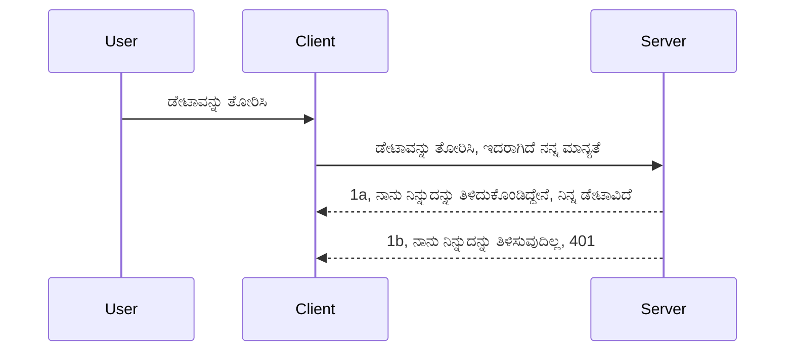

# ಸರಳ ಅನುಮತಿ

MCP SDKಗಳು OAuth 2.1 ನ ಬಳಕೆಯನ್ನು ಬೆಂಬಲಿಸುತ್ತವೆ, ಇದು ಪ್ರಾಮಣಿಕತಾ ಸರ್ವರ್, ಸಂಪನ್ಮೂಲ ಸರ್ವರ್, ದಾಖಲಾತಿಗಳನ್ನು ಪೋಸ್ಟ್ ಮಾಡುವುದು, ಒಂದು ಕೋಡ್ ಪಡೆಯುವುದು, ಆ ಕೋಡ್ ಅನ್ನು ಬ್ಯಾರೆರ್ ಟೋಕೆನ್‌ಗೆ ವಿನಿಮಯ ಮಾಡಿಕೊಳ್ಳುವ ಪ್ರಕ್ರಿಯೆಯಂತಹ ಅಂಶಗಳನ್ನು ಒಳಗೊಂಡ ವಿವೂರ್ಣ ಪ್ರಕ್ರಿಯೆಯಾಗಿದೆ. ನೀವು OAuth ಗೆ 익숙ಿಯಾಗದಿದ್ದರೆ ಮತ್ತು ಅದನ್ನು ಅನುಷ್ಠಾನಗೊಳಿಸುವುದು ಒಂದು ಉತ್ತಮ ವ್ಯವಹಾರ, ನಾವಿಂದು ಸರಳ ಮಟ್ಟದ ಅನುಮತಿಯನ್ನು ಆರಂಭಿಸಿ, ಉತ್ತಮ ಮತ್ತು ಸುಧಾರಿತ ಭದ್ರತೆಯ ಕಡೆಗೆ ಬೆಳೆಯುವಿಕೆಯಾಗಿ ಆರಂಭಿಸುವುದು ಉತ್ತಮವೆಂದು ಅಭಿಪ್ರಾಯವಾಗುತ್ತದೆ. ಇದೇ ಕಾರಣಕ್ಕಾಗಿ ಈ ಅಧ್ಯಾಯವಿದೆ, ನಿಮ್ಮನ್ನು ಹೆಚ್ಚು ಉನ್ನತ ಅನುಮತಿಗೆ ತರಲು.

## ಅನುಮತಿ ಅಂದರೆ ನಾವೇನು ಹೇಳುತ್ತಿರುವುದು?

ಅನುಮತಿ ಎಂದರೆ(authentication) ಮತ್ತು ಪ್ರಾಧಿಕಾರ(permission) ಶಬ್ದಗಳ ಸಂಕಲನವಾಗಿದೆ. ನಾವು ಕಿಲ್ಲೆ ಕೆಲಸಗಳನ್ನು ಮಾಡಬೇಕಾಗಿದೆ ಎಂಬ ಕಲ್ಪನೆ ಇದಾಗಿದೆ:

- **ಪ್ರಾಮಾಣೀಕರಣ(authentication)**, ಇದು ನಾವು ಯಾರನ್ನೊಂದು ನಮ್ಮ ಮನೆಗೆ ಪ್ರವೇಶಿಸಬೇಕೆಂದು ತೀರ್ಮಾನಿಸುವ ಪ್ರಕ್ರಿಯೆ, ಅಂದರೆ ಅವರು "ಇಲ್ಲಿ" ಇರಲು ಹಕ್ಕು ಹೊಂದಿರುತ್ತಾರೆ ಎಂಬುದು, ಅಂದರೆ ನಮ್ಮ MCP ಸರ್ವರ್ ಫೀಚರ್ಸ್ ಇರುತ್ತಿರುವ ಸಂಪನ್ಮೂಲ ಸರ್ವರ್‌ಗೆ ಪ್ರವೇಶ ಹೊಂದಿರುವುದಾದ್ದು.
- **ಪ್ರಾಧಿಕಾರ(permission)**, ಇದು ಬಳಕೆದಾರ ಅವರಿಗೆ ಕೇಳುತ್ತಿರುವ ವೈಶಿಷ್ಟ್ಯಗಳನ್ನು (ಉದಾಹರಣೆಗೆ, ಆ ಆದೇಶಗಳು ಅಥವಾ ಉತ್ಪನ್ನಗಳು) ಪ್ರವೇಶಿಸಬೇಕಾ ಅಥವಾ ಓದಲು ಮಾತ್ರ ಅನುಮತ ಬೇಕಾ ಎಂಬುದನ್ನು ಪರೀಕ್ಷಿಸುವ ಪ್ರಕ್ರಿಯೆ, ಆದರೆ ಅಂದಹಾಗೆ ಅಂದರೆ ಅಳಿಸುವಿಕೆ ಮಾಡಲಾರರು ಎಂಬುದಾಗಿ.

## ಪ್ರಮಾಣಪತ್ರಗಳು: ನಾವು ಸಿಸ್ಟಮ್ಗೆ ನಮಗೇನು ಎಂದು ಹೇಳುತ್ತೇವೆ

ವಾಸ್ತವದಲ್ಲಿ, ಬಹುತೇಕ ವೆಬ್ ಡೆವಲಪರ್‌ಗಳು ಸರ್ವರ್‌ಗೆ ಪ್ರಮಾಣಪತ್ರ ಒದಗಿಸುವ ಕುತೂಹಲದಲ್ಲಿರುತ್ತಾರೆ, ಸಾಮಾನ್ಯವಾಗಿ "Authentication" ಅಂದ್ರೆ, ಅವರು ಇಲ್ಲಿ ಇರಲು ಅವಕಾಶ ಇದೆ ಎಂದು ಹೇಳುವ ಗುಪ್ತೋದ್ಭಟನೆ. ಈ ಪ್ರಮಾಣಪತ್ರ ಸಾಮಾನ್ಯವಾಗಿ ಉಪಯೋಗಿಸುವ ಬಳಕೆದಾರಹೆಸರು ಮತ್ತು ಗುಪ್ತಪದವನ್ನು ಆಧರಿಸಿ base64 ಎನ್‌ಕೋಡ್ ಮಾಡಲಾದ ಅಥವಾ ಅಪುರೂಪ ಬಳಕೆದಾರರನ್ನು ಗುರುತಿಸುವ API ಕೀ ಆಗಿರುತ್ತದೆ.

ಇದನ್ನು "Authorization" ಎಂಬ ಹೆಡರ್ ಮೂಲಕ ಕಳುಹಿಸಲಾಗುವುದು, ಹೀಗೆ:

```json
{ "Authorization": "secret123" }
```

ಇದು ಸಾಮಾನ್ಯವಾಗಿ ಮೂಲಭೂತ ಅನುಮತಿ ಎಂದು ಕರೆಸಲಾಗುತ್ತದೆ. ಸಂಪೂರ್ಣ ಪ್ರಕ್ರಿಯೆ ಹೀಗಿದೆ:



ನಾವು ಇದರ ಕಾರ್ಯಾಚರಣೆಯ ಹಂತಗಳನ್ನು ಅರ್ಥಮಾಡಿಕೊಂಡಿರುವಾಗ, ಇದನ್ನು ಹೇಗೆ ಅನುಷ್ಠಾನಗೊಳ್ಳ್ಕೋಬೇಕು? ಬಹುತೇಕ ವೆಬ್ ಸರ್ವರ್‌ಗಳಿಗೆ 'ಮಿಡಲ್‌ವೇರ್' ಎಂಬ ಹೊಂದಾಣಿಕೆ ಇರುತ್ತದೆ, ಅದು ಅರ್ಜಿಗಳನ್ನು ಪರಿಶೀಲಿಸಲು ನೆರವಾಗುವ ಒಂದು ತುಣುಕು ಕೋಡ್ ಆಗಿದ್ದು, ಪ್ರಮಾಣಪತ್ರಗಳನ್ನು ಪರಿಶೀಲಿಸಿ ಸರಿದಿದ್ದರೆ ಅರ್ಜಿಗೆ ಅನುಮತಿ ನೀಡುತ್ತದೆ. ಪ್ರಮಾಣಪತ್ರಗಳು ಸರಿಯಿಲ್ಲದಿದ್ದರೆ ಅನುಮತಿ ದೋಷವನ್ನು ತರುವುದು. ಇದನ್ನು ಹೇಗೆ ಮಾಡಬಹುದು ನೋಡಿ:

**Python**

```python
class AuthMiddleware(BaseHTTPMiddleware):
    async def dispatch(self, request, call_next):

        has_header = request.headers.get("Authorization")
        if not has_header:
            print("-> Missing Authorization header!")
            return Response(status_code=401, content="Unauthorized")

        if not valid_token(has_header):
            print("-> Invalid token!")
            return Response(status_code=403, content="Forbidden")

        print("Valid token, proceeding...")
       
        response = await call_next(request)
        # ಪ್ರತಿಕ್ರಿಯೆಯಲ್ಲಿ ಯಾವುದೇ ಗ್ರಾಹಕ ಶೀರ್ಷಿಕೆಗಳನ್ನು ಸೇರಿಸುವುದು ಅಥವಾ ಕೆಲವು ರೀತಿಯಲ್ಲಿ ಬದಲಾವಣೆ ಮಾಡುವುದು
        return response


starlette_app.add_middleware(CustomHeaderMiddleware)
```

ಇಲ್ಲಿ ನಾವು:

- `AuthMiddleware` ಎಂಬ ಮಿಡಲ್‌ವೇರ್ ಅನ್ನು ರಚಿಸಿದ್ದೇವೆ, ಇದರ `dispatch` ವಿಧಾನವನ್ನು ವೆಬ್ ಸರ್ವರ್ ಕರೆಯುತ್ತದೆ.
- ಮಿಡಲ್‌ವೇರ್ ಅನ್ನು ವೆಬ್ ಸರ್ವರ್‌ಗೆ ಸೇರಿಸಿದ್ದೇವೆ:

    ```python
    starlette_app.add_middleware(AuthMiddleware)
    ```

- `Authorization` ಹೆಡರ್ ಇದ್ದೇ ಅಲ್ಲವೆಂದು ಮತ್ತು ಕಳುಹಿಸಿದ ಗುಪ್ತವಚನ ಸರಿ ಇದೆಯೇ ಎಂದು ಪರಿಶೀಲಿಸುವ ಲಾಜಿಕನ್ನು ಬರೆದಿದ್ದೇವೆ:

    ```python
    has_header = request.headers.get("Authorization")
    if not has_header:
        print("-> Missing Authorization header!")
        return Response(status_code=401, content="Unauthorized")

    if not valid_token(has_header):
        print("-> Invalid token!")
        return Response(status_code=403, content="Forbidden")
    ```

    ಗುಪ್ತವಚನ ಇದ್ದು ಸರಿಯಾದಲ್ಲಿ `call_next` ಕಾಲ್ ಮಾಡುತ್ತಾ ಅರ್ಜಿಯು ಮುಂದುವರೆದು ಉತ್ತರವನ್ನು ನೀಡುತ್ತದೆ.

    ```python
    response = await call_next(request)
    # ಯಾವುದೇ ಗ್ರಾಹಕ ಹೆಡರ್‌ಗಳನ್ನು ಸೇರಿಸಿ ಅಥವಾ ಪ್ರತಿಕ್ರಿಯೆಯಲ್ಲಿ ಯಾವುದೇ ರೀತಿಯಲ್ಲಿ ಬದಲಾವಣೆ ಮಾಡಿ
    return response
    ```

ಕಾರ್ಯವಿಧಾನವೆಂದರೆ, ವೆಬ್ ಸರ್ವರ್‌ಗೆ ಇನ್ನೊಂದು ವಿನಂತಿ ಬಂದಾಗ ಮಿಡಲ್‌ವೇರ್ ನಡತೆ ನಡೆಸಿ, ಅನುಮತಿದೋಷವಿದೆಯೇ ಇಲ್ಲವೇ ಎಂದು ತೀರ್ಮಾನಿಸಿ, ಅನುಮತಿ ಇಲ್ಲದಿದ್ದರೆ ದೋಷ ಸಂದೇಶ ವಾಪಸು ನೀಡುತ್ತದೆ.

**TypeScript**

ಇಲ್ಲಿ ನಾವಿಟ್ಟು ಜನಪ್ರಿಯ Framework - Express ನೊಂದಿಗೆ ಮಿಡಲ್‌ವೇರ್ ರಚಿಸಿ MCP ಸರ್ವರ್‌ಗೆ ತಲುಪುವ ಮುನ್ನ ಅರ್ಜಿಯನ್ನು ಇಂಟರ್ಸೆಪ್ಟ್ ಮಾಡುತ್ತೇವೆ. ಕೀಳಿನ ಕೋಡ್ ನೋಡಿ:

```typescript
function isValid(secret) {
    return secret === "secret123";
}

app.use((req, res, next) => {
    // 1. ಪ್ರಾಧಿಕಾರ ಹೆಡರ್ ಇದೆಯೇ?
    if(!req.headers["Authorization"]) {
        res.status(401).send('Unauthorized');
    }
    
    let token = req.headers["Authorization"];

    // 2. ಮಾನ್ಯತೆಯನ್ನು ಪರಿಶೀಲಿಸಿ.
    if(!isValid(token)) {
        res.status(403).send('Forbidden');
    }

   
    console.log('Middleware executed');
    // 3. ವಿನಂತಿ ಪೈಪ್ಲೈನಿನ ಮುಂದಿನ ಹಂತಕ್ಕೆ ವಿನಂತಿಯನ್ನು ಪಾಸುಮಾಡಿ.
    next();
});
```

ಈ ಕೋಡ್‌ನಲ್ಲಿ:

1. ಮೊದಲು `Authorization` ಹೆಡರ್ ಇದೆ ಯಾ ಎಂದು ಪರಿಶೀಲನೆ ಮಾಡುತ್ತೇವೆ, ಇಲ್ಲದಿದ್ದರೆ 401 ದೋಷ ಕಳುಹಿಸುತ್ತೇವೆ.
2. ಪ್ರಮಾಣಪತ್ರ/ಟೋಕನ್ ಸರಿಯಾದದೇ ಎಂದು ಪರೀಕ್ಷಿಸಲಾಗುತ್ತದೆ, ಇಲ್ಲದಿದ್ದರೆ 403 ದೋಷ ಕಳುಹಿಸಲಾಗುತ್ತದೆ.
3. ಕೊನೆಗೆ ಅರ್ಜಿಯನ್ನು ಮುಂದುವರೆಸುವ ಮೂಲಕ ಕೇಳಲಾದ ಸಂಪನ್ಮೂಲವನ್ನು ವಾಪಸು ನೀಡುತ್ತದೆ.

## ಅಭ್ಯಾಸ: ಪ್ರಮಾಣೀಕರಣವನ್ನು ಅನುಷ್ಠಾನಗೊಳಿಸಿ

ನಮ್ಮ ಜ್ಞಾನವನ್ನು ಪಡೆದು ಇದನ್ನು ಅನುಷ್ಠಾನಗೊಳಿಸಲು ಪ್ರಯತ್ನಿಸೋಣ. ಯೋಜನೆ ಹೀಗಿದೆ:

ಸರ್ವರ್

- ಒಂದು ವೆಬ್ ಸರ್ವರ್ ಮತ್ತು MCP ಉದಾಹರಣೆ ರಚಿಸಿ.
- ಸರ್ವರ್‌ಗೆ ಮಿಡಲ್‌ವೇರ್ ಅನ್ನು ಅನುಷ್ಠಾನಗೊಳಿಸಿ.

ಕ್ಲೈಂಟ್

- ಹೆಡರ್ ಮೂಲಕ ಪ್ರಮಾಣಪತ್ರದೊಂದಿಗೆ ವೆಬ್ ವಿನಂತಿಯನ್ನು ಕಳುಹಿಸಿ.

### -1- ವೆಬ್ ಸರ್ವರ್ ಮತ್ತು MCP ಉದಾಹರಣೆ ರಚನೆ

> **ಮುಂದುವರಸುವಿಕೆ:** ಕೆಳಕಂಡ TypeScript ಉದಾಹರಣೆ `mcp-session-id` ಕೀದ್ ಮಾಡಿದ `transports` ನಕ್ಷೆ ಮೂಲಕ HTTP ಸಾರಿಗೆಗಳನ್ನು ಅನುಸರಿಸುತ್ತದೆ, ಇದು **MCP ಸ್ಪೆಸಿಫಿಕೇಶನ್ 2025-11-25** ಅನುಸಾರವಾಗಿದೆ. `2026-07-28` ರಿಲೀಸ್ ಅಭ್ಯರ್ಥಿ 'initialize' ಹ್ಯಾಂಡ್‌ಶೇಕ್ ಮತ್ತು ಸೆಷನ್ ಐಡಿ ಸಂಪೂರ್ಣವಾಗಿ ತೆಗೆದುಹಾಕುತ್ತದೆ, ಆದ್ದರಿಂದ ಈ ಪ್ರತಿ-ಸೆಷನ್ ಸಾರಿಗೆ ನಕ್ಷೆ stateless ಸ್ವಯಂ-ಖಚಿತ ಅರ್ಜಿಗಳನ್ನು ಬದಲಾಯಿಸುತ್ತದೆ. ವಿವರಗಳು [MCP ನಲ್ಲಿ ಏನು ಬದಲಾಗಿದೆ: 2026-07-28 ರಿಲೀಸ್ ಅಭ್ಯರ್ಥಿ](../../01-CoreConcepts/mcp-2026-07-28-release-candidate.md) ಮೇಲೆ ಕಾಣಬಹುದು.

ನಮ್ಮ ಮೊದಲ ಹಂತದಲ್ಲಿ, ವೆಬ್ ಸರ್ವರ್ ಉದಾಹರಣೆ ಮತ್ತು MCP ಸರ್ವರ್ ಅನ್ನು ರಚಿಸಲು ಬೇಕಾಗುತ್ತದೆ.

**Python**

ಇಲ್ಲಿ ನಾವು MCP ಸರ್ವರ್ ಉದಾಹರಣೆ, ಸ್ಟಾರ್ಲೆಟ್ ವೆಬ್ ಅಪ್ಲಿಕೇಶನ್ ರಚಿಸಿ ಅದನ್ನು ಉವಿಕಾರ್ನ್‌ನೊಂದಿಗೆ ಮೇಜಳು ಮಾಡುತ್ತಿದ್ದೇವೆ.

```python
# MCP ಸರ್ವರ್ ರಚನೆ

app = FastMCP(
    name="MCP Resource Server",
    instructions="Resource Server that validates tokens via Authorization Server introspection",
    host=settings["host"],
    port=settings["port"],
    debug=True
)

# ಸ್ಟಾರ್ಲೆಟ್ ವೆಬ್ ಅಪ್ಲಿಕೇಶನ್ ರಚನೆ
starlette_app = app.streamable_http_app()

# ಯುವಿಕಾರ್ನ್ ಮೂಲಕ ಅಪ್ಲಿಕೇಶನ್ ಸೇವೆ ಸಲ್ಲಿಸಲಾಗುತ್ತಿದೆ
async def run(starlette_app):
    import uvicorn
    config = uvicorn.Config(
            starlette_app,
            host=app.settings.host,
            port=app.settings.port,
            log_level=app.settings.log_level.lower(),
        )
    server = uvicorn.Server(config)
    await server.serve()

run(starlette_app)
```

ಈ ಕೋಡ್‌ನಲ್ಲಿ:

- MCP ಸರ್ವರ್ ರಚಿಸಲಾಗಿದೆ.
- MCP ಸರ್ವರ್‌ನಿಂದ ಸ್ಟಾರ್ಲೆಟ್ ವೆಬ್ ಅಪ್ ರಚಿಸಲಾಗಿದೆ `app.streamable_http_app()`.
- ಉವಿಕಾರ್ನ್ ಬಳಸಿಕೊಂಡು ವೆಬ್ ಅಪ್ ಹೋಸ್ಟ್ ಮತ್ತು ಸರ್ವ್ ಮಾಡಲಾಗಿದೆ `server.serve()`.

**TypeScript**

ಇಲ್ಲಿ MCP ಸರ್ವರ್ ಉದಾಹರಣೆ ರಚಿಸಲಾಗಿದೆ.

```typescript
const server = new McpServer({
      name: "example-server",
      version: "1.0.0"
    });

    // ... ಸರ್ವರ್ ಸಂಪನ್ಮೂಲಗಳು, ಸಾಧನಗಳು ಮತ್ತು ಸೂಚನೆಗಳನ್ನು ಸಂರಚಿಸಿ ...
```

ಈ MCP ಸರ್ವರ್ ರಚನೆ POST /mcp ಮಾರ್ಗದ ಒಳಗೆ ನಡೆಯಬೇಕು, ಆದ್ದರಿಂದ ಮೇಲಿನ ಕೋಡ್ ಅನ್ನು ಈ ರೀತಿಯಾಗಿ ಸರಿಸಿ:

```typescript
import express from "express";
import { randomUUID } from "node:crypto";
import { McpServer } from "@modelcontextprotocol/sdk/server/mcp.js";
import { StreamableHTTPServerTransport } from "@modelcontextprotocol/sdk/server/streamableHttp.js";
import { isInitializeRequest } from "@modelcontextprotocol/sdk/types.js"

const app = express();
app.use(express.json());

// ಸೆಷನ್ ಐಡಿಗಳ ಪ್ರಕಾರ ಸಾರಿಗೆಗಳನ್ನು ಸಂಗ್ರಹಿಸಲು ನಕ್ಷೆ
const transports: { [sessionId: string]: StreamableHTTPServerTransport } = {};

// ಕ್ಲೈಂಟ್-ಟು-ಸರ್ವರ್ ಸಂವಹನಕ್ಕಾಗಿ POST ವಿನಂತಿಗಳನ್ನು ಹ್ಯಾಂಡಲ್ ಮಾಡಿ
app.post('/mcp', async (req, res) => {
  // ಇ_existing_ ಸೆಷನ್ ಐಡಿ ಇದ್ದೇ ಇದ್ದೇ ಎಂದು ಪರಿಶೀಲಿಸಿ
  const sessionId = req.headers['mcp-session-id'] as string | undefined;
  let transport: StreamableHTTPServerTransport;

  if (sessionId && transports[sessionId]) {
    // ಇ_existing_ ಸಾರಿಗೆಯನ್ನು ಪುನಃ ಬಳಸಿಕೊಳ್ಳಿ
    transport = transports[sessionId];
  } else if (!sessionId && isInitializeRequest(req.body)) {
    // ಹೊಸ ಪ್ರಾರಂಭಿಕ ವಿನಂತಿ
    transport = new StreamableHTTPServerTransport({
      sessionIdGenerator: () => randomUUID(),
      onsessioninitialized: (sessionId) => {
        // ಸೆಷನ್ ಐಡಿಯ ಪ್ರಕಾರ ಸಾರಿಗೆಯನ್ನು ಸಂಗ್ರಹಿಸಿ
        transports[sessionId] = transport;
      },
      // DNS ರೀಬಾಂಡಿಂಗ್ ರಕ್ಷಣೆ ಹಿಂದಿನ ಅನುಕೂಲತೆಯಿಗಾಗಿ ಡೀಫಾಲ್ಟ್ ಆಗಿ ನಿಷ್ಕ್ರಿಯಿಸಲಾಗಿದೆ. ನೀವು ಈ ಸರ್ವರ್ ಅನ್ನು
      // ಸ್ಥಳೀಯವಾಗಿ ಚಾಲನೆ ಮಾಡುತ್ತಿದ್ದರೆ, ಖಾತ್ರಿ ಪಡಿಸಿಕೊಳ್ಳಿ:
      // enableDnsRebindingProtection: true,
      // allowedHosts: ['127.0.0.1'],
    });

    // ಮುಚ್ಚಿದಾಗ ಸಾರಿಗೆಯನ್ನು ಶುಚಿಗೊಳಿಸಿ
    transport.onclose = () => {
      if (transport.sessionId) {
        delete transports[transport.sessionId];
      }
    };
    const server = new McpServer({
      name: "example-server",
      version: "1.0.0"
    });

    // ... ಸರ್ವರ್ ಸಂಪನ್ಮೂಲಗಳು, ಸಾಧನಗಳು ಮತ್ತು ಪ್ರಾಂಪ್ಟ್‌ಗಳನ್ನು ಹೊಂದಿಸಿ ...

    // MCP ಸರ್ವರ್‌ಗೆ ಸಂಪರ್ಕಿಸಿ
    await server.connect(transport);
  } else {
    // ಅಮಾನ್ಯ ವಿನಂತಿ
    res.status(400).json({
      jsonrpc: '2.0',
      error: {
        code: -32000,
        message: 'Bad Request: No valid session ID provided',
      },
      id: null,
    });
    return;
  }

  // ವಿನಂತಿಯನ್ನು ಹ್ಯಾಂಡಲ್ ಮಾಡಿ
  await transport.handleRequest(req, res, req.body);
});

// GET ಮತ್ತು DELETE ವಿನಂತಿಗಳಿಗಾಗಿ ಪುನಃಬಳಕೆ ಯೋಗ್ಯ ಹ್ಯಾಂಡ್ಲರ್
const handleSessionRequest = async (req: express.Request, res: express.Response) => {
  const sessionId = req.headers['mcp-session-id'] as string | undefined;
  if (!sessionId || !transports[sessionId]) {
    res.status(400).send('Invalid or missing session ID');
    return;
  }
  
  const transport = transports[sessionId];
  await transport.handleRequest(req, res);
};

// ಸರ್ವರ್-ಟು-ಕ್ಲೈಂಟ್ ನೋಟಿಫಿಕೇಶನ್‌ಗಳಿಗಾಗಿ GET ವಿನಂತಿಗಳನ್ನು SSE ಮೂಲಕ ಹ್ಯಾಂಡಲ್ ಮಾಡಿ
app.get('/mcp', handleSessionRequest);

// ಸೆಷನ್ ತ್ಯಜನೆಗಾಗಿ DELETE ವಿನಂತಿಗಳನ್ನು ಹ್ಯಾಂಡಲ್ ಮಾಡಿ
app.delete('/mcp', handleSessionRequest);

app.listen(3000);
```

ಈಗ ನೀವು ನೋಡಿರಿ MCP ಸರ್ವರ್ ರಚನೆ `app.post("/mcp")` ಒಳಗೆ ಸಾಗಿಸಲ್ಪಟ್ಟಿದೆ.

ಮುಂದಿನ ಹಂತಕ್ಕೆ ಹೋಗೋಣ, ಮಿಡಲ್‌ವೇರ್ ಅನ್ನು ರಚಿಸಿ ಬರುವ ಪ್ರಮಾಣಪತ್ರವನ್ನು ಪರಿಶೀಲಿಸೋಣ.

### -2- ಸರ್ವರ್ ಗೆ ಮಿಡಲ್‌ವೇರ್ ಅನುಷ್ಠಾನ

ಮುಂದಿನ ಭಾಗ ಮಿಡಲ್‌ವೇರ್. ಇಲ್ಲಿ `Authorization` ಹೆಡರ್ ನಲ್ಲಿ ಪ್ರಮಾಣಪತ್ರ ಪಡೆದು ಅದರ ಮಾನ್ಯತೆಯನ್ನು ಪರಿಶೀಲಿಸುವ ಮಿಡಲ್‌ವೇರ್ ಸೃಷ್ಟಿಸಲಾಗುವುದು. ಅಯೋಗ್ಯವಾಗಿದ್ದರೆ ಮನವಿ ಮುಂದುವರಿಯುತ್ತದೆ ಮತ್ತು MCP ಕಾರ್ಯಚಟುವಟಿಕೆಗಳಿಗೆ ಅವಕಾಶ ಸಿಗುವುದು (ಉದಾ: ಉಪಕರಣಗಳ ಪಟ್ಟಿ, ಸಂಪನ್ಮೂಲ ಓದು, ಅಥವಾ ವ್ಯವಹಾರ).

**Python**

ಮಿಡಲ್‌ವೇರ್ ಸೃಷ್ಟಿಸಲು `BaseHTTPMiddleware` ನಿಂದ ವರ್ಗವನ್ನು ವಂಶಗತಿಯಲ್ಲಿ ಪಡೆಯಬೇಕು. ಪ್ರಮುಖ ಭಾಗಗಳು:

- `request` ನಮಗೆ ಹೆಡರ್ ಮಾಹಿತಿ ಓದಲು ಸೌಲಭ್ಯ.
- `call_next` ಕರೆಮಾಡಬಹುದಾದ ಫಂಕ್ಷನ್, ಇದು ಮಾನ್ಯತೆ ಸಿಕ್ಕರೆ ಮುಂದುವರಿಯಲು ಅವಶ್ಯಕ.

ಮೊದಲು, `Authorization` ಹೆಡರ್ ಇಲ್ಲದಿದ್ದಾಗ ಹೇಗೆ ನಿರ್ವಹಿಸುವುದು:

```python
has_header = request.headers.get("Authorization")

# ಹೆಡರ್ ಇಲ್ಲ, 401 ಜೊತೆ ವಿಫಲವಾಗು, ಇಲ್ಲದಿದ್ದರೆ ಮುಂದುವರಿಯು.
if not has_header:
    print("-> Missing Authorization header!")
    return Response(status_code=401, content="Unauthorized")
```

ಇಲ್ಲಿ 401 ಅನುಮತಿ ವಿಫಲ ಸಂದೇಶವನ್ನು ಕಳುಹಿಸುತ್ತೇವೆ.

ನಂತರ, ಪ್ರಮಾಣಪತ್ರ ಸಲ್ಲಿಸಿದರೆ, ಅದನ್ನು ಪರಿಶೀಲಿಸುವುದು ಹೀಗೆ:

```python
 if not valid_token(has_header):
    print("-> Invalid token!")
    return Response(status_code=403, content="Forbidden")
```

ಮೇಲಿನ ಕೋಡ್ 403 ನಿರಾಕರಿಸಿದ ಸಂದೇಶವನ್ನು ತೋರಿಸುತ್ತದೆ. ಇಲ್ಲಿ ಪೂರ್ಣ ಮಿಡಲ್‌ವೇರ್ ಕೋಡ್ ನೋಡಿ, ಎಲ್ಲವೂ ಸೇರಿದೆ:

```python
class AuthMiddleware(BaseHTTPMiddleware):
    async def dispatch(self, request, call_next):

        has_header = request.headers.get("Authorization")
        if not has_header:
            print("-> Missing Authorization header!")
            return Response(status_code=401, content="Unauthorized")

        if not valid_token(has_header):
            print("-> Invalid token!")
            return Response(status_code=403, content="Forbidden")

        print("Valid token, proceeding...")
        print(f"-> Received {request.method} {request.url}")
        response = await call_next(request)
        response.headers['Custom'] = 'Example'
        return response

```

ಚೆನ್ನಾಗಿದೆ, ಆದರೆ `valid_token` ಕಾರ್ಯವು ಏನು? ಇಲ್ಲಿ ಇದೆ:

```python
# ಉತ್ಪಾದನೆಗಾಗಿ ಬಳಸಿ ಬಿಡಬೇಡಿ - ಇದನ್ನು ಸುಧಾರಿಸಿ !!
def valid_token(token: str) -> bool:
    # "Bearer " ಪೂರ್ವನಿರ್ದೇಶಕವನ್ನು ತೆಗೆದುಹಾಕಿ
    if token.startswith("Bearer "):
        token = token[7:]
        return token == "secret-token"
    return False
```

ಇದು ಸ್ಪಷ್ಟವಾಗಿ ಸುಧಾರಿಸಲು ಸಾಧ್ಯವಿದೆ.

ಮುಖ್ಯ: ಇಂತಹ ಗುಪ್ತ ಪದಗಳನ್ನು ಕೋಡ್‌ನಲ್ಲಿ ಇರಿಸುವುದು ತಪ್ಪು. ಅದನ್ನು ಡೇಟಾ ಮೂಲ ಅಥವಾ IDP (ಐಡೀಪಿ ಸೇವಾ ಪೂರೈಕೆದಾರ) ಇತ್ಯಾದಿಯಿಂದ ಪಡೆಯಬೇಕು ಅಥವಾ ಉತ್ತಮವಾಗಿ IDP ಮೂಲಕ ಮಾನ್ಯತೆ ಮಾಡಿಸಬೇಕು.

**TypeScript**

ಈ Express ನಲ್ಲಿ ಅನುಷ್ಠಾನಗೊಳಿಸಲು, `use` ವಿಧಾನವನ್ನು ಕರೆಯಬೇಕು, ಇದು ಮಿಡಲ್‌ವೇರ್ ಕಾರ್ಯಗಳನ್ನು ಸ್ವೀಕರಿಸುತ್ತದೆ.

ನಮ್ಮ ಕರ್ತವ್ಯಗಳು:

- `Authorization` ಗುಣಲಕ್ಷಣದಲ್ಲಿ ಬಳಕೆದಾರ ಮಾನ್ಯತೆ ಪರಿಶೀಲನೆ.
- ಪ್ರಮಾಣಪತ್ರವನ್ನು ಬಳಸಿಕೊಂಡು ಅರ್ಜಿಯನ್ನು ಮುಂದುವರೆಸಿ, ಅದಕ್ಕೆ ತಕ್ಕ MCP ಕಾರ್ಯಚಟುವಟಿಕೆಗಳನ್ನು ಮಾಡಿಸು.

ಇಲ್ಲಿ `Authorization` ಹೆಡರ್ ಇಲ್ಲದಿದ್ದರೆ ವಿನಂತಿಯನ್ನು ನಿಲ್ಲಿಸುವ ಮಾರ್ಗ:

```typescript
if(!req.headers["authorization"]) {
    res.status(401).send('Unauthorized');
    return;
}
```

ಹೆಡರ್ ಪೂರ್ವದಲ್ಲಿ ಇಲ್ಲದಿದ್ದರೆ 401 ಸಂದೇಶ ಬರುತ್ತದೆ.

ನಂತರ, ಪ್ರಮಾಣಪತ್ರ ಮಾನ್ಯವಾದ್ದೇ ಎಂದು ಪರಿಶೀಲಿಸಿ, ಇಲ್ಲೆಯಾದರೆ ವಿನಂತಿಯನ್ನು ತಡೆಯುತ್ತದೆ (403 ಸಂದೇಶ):

```typescript
if(!isValid(token)) {
    res.status(403).send('Forbidden');
    return;
} 
```

ಈಗ 403 ದೋಷ ಸಾಗುತ್ತಿದೆ ಎಂದು ಗಮನಿಸಿ.

ಸಂಪೂರ್ಣ ಕೋಡ್ ಇಲ್ಲಿದೆ:

```typescript
app.use((req, res, next) => {
    console.log('Request received:', req.method, req.url, req.headers);
    console.log('Headers:', req.headers["authorization"]);
    if(!req.headers["authorization"]) {
        res.status(401).send('Unauthorized');
        return;
    }
    
    let token = req.headers["authorization"];

    if(!isValid(token)) {
        res.status(403).send('Forbidden');
        return;
    }  

    console.log('Middleware executed');
    next();
});
```

ನಾವು ಸರ್ವರ್‌ನಲ್ಲಿ ಮಿಡಲ್‌ವೇರ್ ಸೆಟ್ ಮಾಡಿ, ಕ್ಲೈಂಟ್ ನಾವು ಬಯಸುವ ಪ್ರಮಾಣಪತ್ರ ಸಲ್ಲಿಸುತ್ತಿದ್ದಾರೆ ಎಂದು ಪರೀಕ್ಷಿಸುತ್ತೇವೆ. ಕ್ಲೈಂಟ್ ಕುರಿತು ಏನು?

### -3- ಪ್ರಮಾಣಪತ್ರವನ್ನು ಹೆಡರ್ ಮೂಲಕ ವಿಂತೆ ಕಳುಹಿಸಿ

ಅನುಮತಿ ನೀಡಲು, ಕ್ಲೈಂಟ್ ಹೆಡರ್ ಮೂಲಕ ಪ್ರಮಾಣಪತ್ರ ಕಳುಹಿಸುವುದು ತಕ್ಕದ್ದು. MCP ಕ್ಲೈಂಟ್ ಉಪಯೋಗಿಸುತ್ತಿರುವುದರಿಂದ ಎಷ್ಟು ಮಾಡಲಾಗಿದೆ ಎಂಬುದನ್ನು ತಿಳಿಯೋಣ.

**Python**

ಕ್ಲೈಂಟ್ ನಲ್ಲಿ, ಮುಗ್ಧವಾದ ಜೊತೆ ಹೆಡರ್ ಹೀಗೆ ಸಿದ್ಧಪಡಿಸು:

```python
# ಮೌಲ್ಯವನ್ನು ಕಠಿಣವಾಗಿ ಸರಳತೆ ಮಾಡಬೇಡಿ, ಕಡಿಮೆಗಟ್ಟಿದಂತೆ ಇದನ್ನು ಪರಿಸರ ಚರದಲ್ಲಿ ಅಥವಾ ಹೆಚ್ಚು ಸುರಕ್ಷಿತ ಸಂಗ್ರಹಣೆಯಲ್ಲಿ ಇರಲಿ
token = "secret-token"

async with streamablehttp_client(
        url = f"http://localhost:{port}/mcp",
        headers = {"Authorization": f"Bearer {token}"}
    ) as (
        read_stream,
        write_stream,
        session_callback,
    ):
        async with ClientSession(
            read_stream,
            write_stream
        ) as session:
            await session.initialize()
      
            # ಮಾಡುವುದೇನು ಎಂದರೆ, ಗ್ರಾಹಕದಲ್ಲಿ ಏನು ಮಾಡಬೇಕೋ, ಉದಾಹರಣೆಗೆ ಉಪಕರಣಗಳನ್ನು ಪಟ್ಟಿ ಮಾಡುವುದು, ಉಪಕರಣಗಳನ್ನು ಕರೆ ಮಾಡುವುದು ಇತ್ಯಾದಿ.
```

ಇಲ್ಲಿ `headers` ಗುಣಲಕ್ಷಣವನ್ನು ಹೀಗೆ ತುಂಬಿಸುವುದು ಗಮನಿಸಿ: ` headers = {"Authorization": f"Bearer {token}"}`.

**TypeScript**

ಎರಡನೇ ಹಂತದಲ್ಲಿ ಇದನ್ನು ಸಾಧಿಸುವುದು:

1. ನಮ್ಮ ಪ್ರಮಾಣಪತ್ರದೊಂದಿಗೆ ಕಾನಫಿಗರೇಶನ್ ವಸ್ತುವನ್ನು ಭರತೆ.
2. ಈ ವಸ್ತುವನ್ನು ಸಾರಿಗೆಗೆ ಹಸ್ತಾಂತರಿಸಿ.

```typescript

// ಇಲ್ಲಿ ತೋರಿಸಿದಂತೆ ಮೌಲ್ಯವನ್ನು ಕಠಿಣರೂಪದಲ್ಲಿ ಬರೆಯಬೇಡಿ. ಕನಿಷ್ಠವಾಗಿ ಅದನ್ನು ಪರಿಸರ ಚರ as a env variable ಇರಿಸಿಕೊಳ್ಳಿ ಮತ್ತು ಡೆವ್ ಮೋಡ್ ನಲ್ಲಿ dotenv ನಂತಹ ಏನನ್ನಾದರೂ ಬಳಸಿರಿ.
let token = "secret123"

// ಕ್ಲೈಂಟ್ ಟ್ರಾನ್ಸ್‌ಪೋರ್ಟ್ ಆಯ್ಕೆಯ ವಸ್ತುವನ್ನು ವ್ಯಾಖ್ಯಾನಿಸಿ
let options: StreamableHTTPClientTransportOptions = {
  sessionId: sessionId,
  requestInit: {
    headers: {
      "Authorization": "secret123"
    }
  }
};

// ಆಯ್ಕೆ ವಸ್ತುವನ್ನು ಟ್ರಾನ್ಸ್‌ಪೋರ್ಟ್ ಗೆ ಕೊಡಿ
async function main() {
   const transport = new StreamableHTTPClientTransport(
      new URL(serverUrl),
      options
   );
```

ಮೇಲಿನ ಕೋಡಿನಲ್ಲಿ `options` ವಸ್ತು ಸೃಷ್ಟಿಸಿ `requestInit` ಪ್ರಾಪರ್ಟಿಯಲ್ಲಿ ಹೆಡರ್‌ಗಳನ್ನು ಸೇರಿಸಲಾಗಿದೆ.

ಮುಖ್ಯ: ಇದನ್ನು ಹೇಗೆ ಸುಧಾರಿಸಿ? ಈಗಿನ ಅನುಷ್ಠಾನ ಗೊಂದಲಗಳಿವೆ. ಕನಿಷ್ಟ HTTPS ಇರಬೇಕು ಅಥವಾ ಹಾಗೇ ಇದ್ದರೂ, ಪ್ರಮಾಣಪತ್ರ ಕಳುಹಿಸುವುದು ಅಪಾಯಕರ. ನೀವು ಟೋಕನ್ ಅನ್ನು ರದ್ದುಗೊಳಿಸಲು ವಿಭಾಗ ಇದ್ದಂತೆ ಮಾಡಬೇಕು ಮತ್ತು ಇನ್ನಷ್ಟು ಪರಿಶೀಲನೆಗಳು ಕೇಳಲಾಗುತ್ತವೆ (ಸ್ಥಳ, ವಿನಂತಿ ದ್ರುತಗತಿಯ ಪರಿಶೀಲನೆ, ಬಾಟ್ ಕಾರ್ಯಾಚರಣೆಗಳು ಕುರಿತಾದಂತೆ). ಸಂಕಷ್ಟಗಳಿವೆ.

ಇದಾದರೂ, ಬಹಳ ಸರಳ APIs ಗೆ ಇದು ಒಳ್ಳೆಯ ಪ್ರಾರಂಭವಾಗಿದೆ,  ಯಾರಿಗೂ ಸಮ್ಮತಿಸಿದವರು ಅಲ್ಲದೆ ನಿಮ್ಮ API ಕರೆ ಮಾಡಲು ಅವಕಾಶ ಇಲ್ಲ.

ಹೀಗಾಗಿ, ಭದ್ರತೆಯನ್ನು ಗಟ್ಟಿಗೊಳಿಸಲು JSON ವೆಬ್ ಟೋಕನ್ (JWT) ಅನ್ನು ಉಪಯೋಗಿಸೋಣ.

## JSON ವೆಬ್ ಟೋಕೆನ್ಗಳು, JWT

ಸರಳ ಪ್ರಮಾಣಪತ್ರಗಳ ಬದಲಿಗೆ JWT ಬಳಸುವ ಮೂಲಕ ಯಾವ ಸುಧಾರಣೆಗಳು ಬರುತ್ತವೆ?

- **ಭದ್ರತೆಯ ಸುಧಾರಣೆಗಳು**. ಮೂಲ auth ನಲ್ಲಿ ಬಳಕೆದಾರಹೆಸರು ಮತ್ತು ಗುಪ್ತಪದವನ್ನು base64 ಎನ್‌ಕೋಡ್ ಮಾಡಲಾದ ಟೋಕನಾಗಿ ಕಳುಹಿಸಲಾಗುತ್ತದೆ (ಅಥವಾ API ಕೀ), ಇದು ಅಪಾಯ ಹೆಚ್ಚಿಸುತ್ತದೆ. JWT ನಲ್ಲಿ ಬಳಕೆದಾರಹೆಸರು ಮತ್ತು ಗುಪ್ತಪದ ನೀಡುತ್ತೀರಿ ಮತ್ತು ಟೋಕನ್ ಪಡೆಯುತ್ತೀರಿ, ಇದು ಕಾಲಸಹಿತವಾಗಿದೆ ಅಂದರೆ ಅವಧಿ ಮುಗಿಯುತ್ತದೆ. JWT ಇರುವ ಕಾರ್ಯಗಳು ರೋಲ್, ಸ್ಕೋಪ್ ಮತ್ತು ಅನುಮತಿಯನ್ನು ಬಳಸಿಕೊಂಡು ಸೂಕ್ಷ್ಮ ಪ್ರವೇಶ ನಿಯಂತ್ರಣದಲ್ಲಿ ಸಹಾಯ ಮಾಡುತ್ತದೆ.
- **Stateless ಮತ್ತು ಪ್ರಮಾಣಮಾನತೆ**. JWTಗಳು ಸ್ವಯಂ ಕೂಡಲಿರುವಂತೆ ಇರುವುದರಿಂದ, ಬಳಕೆದಾರ ಮಾಹಿತಿ ಸಮಗ್ರೀಕರಣ ಮಾಡುತ್ತವೆ ಮತ್ತು ಸರ್ವರ್-ಪಕ್ಕದ ಸೆಷನ್ ಸಂಗ್ರಹವನ್ನು ಅಗತ್ಯವಿಲ್ಲ. ಟೋಕನ್ಗಳನ್ನು ಸ್ಥಳೀಯವಾಗಿ ಮಾನ್ಯ ಮಾಡಬಹುದು.
- **ಅಂತರಚಾಲಕತೆ ಮತ್ತು ಫೆಡರೆಶನ್**. JWTಗಳು Open ID Connect ನ ಕೇಂದ್ರಭಾಗವಾಗಿವೆ ಮತ್ತು Entra ID, Google ID ಮತ್ತು Auth0 ಹೀಗೆ ಪರಿಚಿತ IDP ಗಳೊಂದಿಗೆ ಉಪಯೋಗವಾಗುತ್ತವೆ. ಇದರಿಂದ ಸಿಂಗಲ್ ಸೈನ್ ಆನ್ ಹಾಗೂ ಇತರ ಎಂಟರ್‌ಪ್ರೈಸ್ ಗ್ರೇಡ್ ವೈಶಿಷ್ಟ್ಯಗಳಿಗೂ ಅನುವು ಮಾಡಿಕೊಡುತ್ತವೆ.
- **ಮಾಡ್ಯೂಲಾರಿಟಿ ಮತ್ತು ಸ್ಥಿತಿಶೀಲತೆ**. JWTಗಳು API ಗೇಟ್ವೇಗಳು (ಹಾಗೂ Azure API Management, NGINX)ಗಳಿಗೆ ಸಹ ಉಪಯೋಗವಾಗುತ್ತವೆ. ಇದು ಉಪಯೋಗದ ಅನುಮತಿ ಸನ್ನಿವೇಶಗಳು ಮತ್ತು ಸರ್ವರ್-ತು-ಸರ್ವಿಸ್ ಸಂವಹನ, ಪ್ರತಿರೂಪಣ ಹಾಗೂ ಡೆಲಿಗೇಷನ್ ಸನ್ನಿವೇಶಗಳಿಗೆ ಸಹ ಬೆಂಬಲ.
- **ಕಾರ್ಯಕ್ಷಮತೆ ಮತ್ತು ಮೆಮೊರೈಜಿಂಗ್**. JWTಗಳನ್ನು ಡಿಕೋಡ್ ಮಾಡಿಕೊಳ್ಳುವಾದ ನಂತರ ಕ್ಯಾಶ್ ಮಾಡಬಹುದು, ಇದರಿಂದ ಪಾರ್ಸಿಂಗ್ ಅಗತ್ಯ ಕಡಿಮೆಯಾಗಿ ಪ್ರವಾಹ ಕಡಿಮೆಯಾಗುತ್ತದೆ. ಇದರಿಂದ ಹೆಚ್ಚಿನ ಟ್ರಾಫಿಕ್ ಇರುವ ಅಪ್ಲಿಕೇಶನ್ ಗಳಿಗೆ ಸಹಾಯ.
- **ಮುನ್ತಹಲ್ಲು ಹೈದಲುಗಳು**. ಇದರಲ್ಲಿ ಟೋಕನ್ಗಳ ಮಾನ್ಯತೆ ಪರಿಶೀಲನ (ಇಂಟ್ರೋಸ್ಪೆಕ್ಷನ್) ಮತ್ತು ರದ್ದುಪಡಿಸುವಿಕೆ (ರಿವಾಕೇಶನ್) ಕೂಡ ಒಳಗೊಳ್ಳುತ್ತದೆ.

ಈ ಎಲ್ಲಾ ಪ್ರಯೋಜನಗಳೊಂದಿಗೆ, ನಮ್ಮ ಅನುಷ್ಠಾನವನ್ನು ಮುಂದಿನ ಹಂತಕ್ಕೆ ಹೇಗೆ ತೆಗೆದುಕೊಂಡು ಹೋಗುವುದು ನೋಡೋಣ.

## ಮೂಲ auth ಅನ್ನು JWT ಗಾಗಿ ಪರಿವರ್ತಿಸೋಣ

ಹಂಗೆ, ಸೇರಬೇಕಾದ ಬದಲಾವಣೆಗಳು:

- **JWT ಟೋಕನ್ ನಿರ್ಮಿಸುವುದನ್ನು ಕಲಿಯಿರಿ** ಮತ್ತು ಕ್ಲೈಂಟ್‌ನಿಂದ ಸರ್ವರ್‌ಗೆ ಕಳುಹಿಸಲು ಸಿದ್ಧಪಡಿಸಿ.
- **JWT ಟೋಕನ್ ಪರಿಶೀಲಿಸಿ** ಮತ್ತು ಮಾನ್ಯವಾದರೆ, ಕ್ಲೈಂಟ್‌ಗೆ ಸಂಪನ್ಮೂಲಗಳನ್ನು ಒದಗಿಸಿ.
- **ಟೋಕನ್ ಸಂಗ್ರಹಿಸುವಿಕೆಗೆ ಭದ್ರತೆಯನ್ನು ಒದಗಿಸಿ**. ನಾವು ಟೋಕನ್ ಯಾವ ರೀತಿಯಲ್ಲಿ ಸಂಗ್ರಹಿಸೋಣ.
- **ರಸ್ತೆಗಳ ರಕ್ಷಣೆ**. ನಾವು ಮಾರ್ಗಗಳನ್ನು ಮತ್ತು ವಿಶೇಷ MCP ಫೀಚರ್‌ಗಳನ್ನು ರಕ್ಷಿಸಬೇಕು.
- **ರಿಫ್ರೆಶ್ ಟೋಕನ್ ಸೇರಿಸಿ**. ನಾವು ಸಣ್ಣ ಕಾಲಾವಧಿಯ ಟೋಕನ್ಗಳನ್ನು ರಚಿಸಬೇಕು, ಆದರೆ ರಿಫ್ರೆಶ್ ಟೋಕನ್ಗಳನ್ನು ಬಹು ಕಾಲಿಕವಾಗಿ ನೀಡಲೇಬೇಕು ಮತ್ತು ಅವು ಹಳೆಯದಾದ್ರೆ ಹೊಸ ಟೋಕನ್ ಪಡೆಯಲು ಉಪಯೋಗಿಸಲ್ಪಡಬೇಕು. ರಿಫ್ರೆಶ್ ಎಂಡ್‌ಪಾಯಿಂಟ್ ಮತ್ತು ರೋಟೇಷನ್ ನೀತಿ ಕೂಡ ಇರಬೇಕು.

### -1- JWT ಟೋಕನ್ ನಿರ್ಮಿಸಿ

ಮೊದಲು, JWT ಟೋಕನ್ಗಲ್ಲಿ ಈ ಭಾಗಗಳಿರುತ್ತವೆ:

- **ಹೆಡರ್**, ಅಲ್ಗೋರಿದಮ್ ಮತ್ತು ಟೋಕನ್ ಪ್ರಕಾರ.
- **ಪೇಲೋಡ್**, ಕ್ಲೇಂಗಳು, ಉದಾಹರಣೆಗೆ sub (ಬಳಕೆದಾರ ಅಥವಾ ಟೋಕನ್ ಪ್ರತಿನಿಧಿಸುವ ಘಟಕ. ಸಾಮಾನ್ಯ auth ದೃಶ್ಯದಲ್ಲಿ ಇದು ಬಳಕೆದಾರ ಐಡಿ), exp (ಅವಧಿ ಮುಗಿಯುವುದು), role (ರೋಲ್)
- **ಸಿಗ್ನೆಚರ್**, ಗುಪ್ತಾಕ್ಷರದಿಂದ ಸಹಿ.

ಇದಕ್ಕೆ ನಾವು ಹೆಡರ್, ಪೇಲೋಡ್ ಮತ್ತು ಎನ್‌ಕೋಡ್ ಮಾಡಿದ ಟೋಕನನ್ನು ಸೃಷ್ಟಿಸಬೇಕು.

**Python**

```python

import jwt
import jwt
from jwt.exceptions import ExpiredSignatureError, InvalidTokenError
import datetime

# JWTನ್ನು ಸಹಿ ಮಾಡಲು ಬಳಸುವ ಗುಪ್ತ ಲಾಗಿನ್
secret_key = 'your-secret-key'

header = {
    "alg": "HS256",
    "typ": "JWT"
}

# ಬಳಕೆದಾರ ಮಾಹಿತಿ ಮತ್ತು ಅದರ ಹಕ್ಕುಗಳು ಮತ್ತು ಅವಧಿ ಸಮಯ
payload = {
    "sub": "1234567890",               # ವಿಷಯ (ಬಳಕೆದಾರ ID)
    "name": "User Userson",                # ಕಸ್ಟಮ್ ಹಕ್ಕು
    "admin": True,                     # ಕಸ್ಟಮ್ ಹಕ್ಕು
    "iat": datetime.datetime.utcnow(),# ನೀಡಲಾದ ಸಮಯ
    "exp": datetime.datetime.utcnow() + datetime.timedelta(hours=1)  # ಅವಧಿ
}

# ಅದನ್ನು ಎನ್‌ಕೋಡ್ ಮಾಡು
encoded_jwt = jwt.encode(payload, secret_key, algorithm="HS256", headers=header)
```

ಮೇಲಿನ ಕೋಡ್‌ನಲ್ಲಿ:

- HS256 ಅಲ್ಗಾರಿದಮ್ ಮತ್ತು ಟೋಕನ್ ಪ್ರಕಾರ JWT ಎಂದು ಹೆಡರ್ ನಿರ್ಧರಿಸಲಾಗಿದೆ.
- ಪೇಲೋಡ್ ನಲ್ಲಿ ವಿಷಯ ಅಥವಾ ಬಳಕೆದಾರ ಐಡಿ, ಬಳಕೆದಾರಹೆಸರು, ರೋಲ್, ಪ್ರಮಾಣೀಕರಣಿಸಬೇಕಾದ ವೇಳೆಯನ್ನು ಸೇರಿಸಿ, ಮುಗಿಯುವ ಸಮಯವನ್ನು ಕೂಡ ಸೇರಿಸಲಾಗಿದೆ, ಇದು ನಮಗೆ ಮೊದಲೇ ಹೇಳಿದ ಕಾಲಾವಧಿ ನಿಯಂತ್ರಣ.

**TypeScript**

ಇಲ್ಲಿ ನಾವು ಕೆಲವು ಆವಶ್ಯಕ залежಿಸುವಿಕೆಗಳನ್ನು (dependencies) ಬಳಸಿ JWT ಟೋಕನ್ ಸೃಷ್ಟಿಸುತ್ತೇವೆ.

ಕನಿಷ್ಠ ಅವಶ್ಯಕ залежಿಸುವಿಕೆಗಳು:

```sh

npm install jsonwebtoken
npm install --save-dev @types/jsonwebtoken
```

ಈಗ ಅವರು ಮಾಡಬೇಕಾದ ಕಾರ್ಯ: ಹೆಡರ್, ಪೇಲೋಡ್ ಸೃಷ್ಟಿಸಿ ಟೋಕನ್ ರಚಿಸುವುದು.

```typescript
import jwt from 'jsonwebtoken';

const secretKey = 'your-secret-key'; // ಉತ್ಪಾದನೆಯಲ್ಲಿ ಪರಿಸರ ವ್ಯತ್ಯಾಸಗಳನ್ನು ಬಳಸಿ

// ಪೇಲೋಡ್ ಅನ್ನು ವ್ಯಾಖ್ಯಾನಿಸಿ
const payload = {
  sub: '1234567890',
  name: 'User usersson',
  admin: true,
  iat: Math.floor(Date.now() / 1000), // ನೀಡಿದ ಸಮಯ
  exp: Math.floor(Date.now() / 1000) + 60 * 60 // 1 ಗಂಟೆಯಲ್ಲಿ ಅವಧಿ ಮುಗಿಯುತ್ತದೆ
};

// ಶೀರ್ಷಿಕೆ ಅನ್ನು ವ್ಯಾಖ್ಯಾನಿಸಿ (ಐಚ್ಛಿಕ, jsonwebtoken ಡೀಫಾಲ್ಟ್ ಗಳನ್ನು ಹೊಂದಿಸುತ್ತದೆ)
const header = {
  alg: 'HS256',
  typ: 'JWT'
};

// ಟೋಕನ್ ಅನ್ನು ರಚಿಸಿ
const token = jwt.sign(payload, secretKey, {
  algorithm: 'HS256',
  header: header
});

console.log('JWT:', token);
```

ಈ ಟೋಕನ್:

HS256 ಉಪಯೋಗಿಸಿ ಸಹಿ ಮಾಡಲಾಗಿದೆ
1 ಘಂಟೆ ಮಾನ್ಯತ್ವ ಸಿಗುತ್ತದೆ
sub, name, admin, iat, exp ಹೀಗೆ ಕ್ಲೇಂಗಳನ್ನು ಒಳಗೊಂಡಿದೆ.

### -2- ಟೋಕನ್ ಪರಿಶೀಲನೆ

ನಾವು ಟೋಕನ್ ಅನ್ನು ಪರಿಶೀಲಿಸಬೇಕಾಗುತ್ತದೆ, ಇದು ಸರ್ವರ್‌ನಲ್ಲಿ ಆಗಬೇಕು, ಇದರಿಂದ ಕ್ಲೈಂಟ್ ಕಳುಹಿಸಿದ ಟೋಕನ್ ನಿಜವಾಗಿದೆ ಎನ್ನುವೇಷಣೆ ಮಾಡಬಹುದು. ಟೋಕನ್ ರೂಪ, ಮಾನ್ಯತೆ ಮುಂತಾದ ಬಗೆಯ ಪರಿಶೀಲನೆಗಳು ಅಗತ್ಯ. ಇತರ ಪರಿಶೀಲನೆಗಳೂ ಗಮನದಲ್ಲಿರಬೇಕು, ಬಳಕೆದಾರ ನಮ್ಮ ವ್ಯವಸ್ಥೆಯಲ್ಲಿ ಇದೆಯೇ ಎಂಬಂತೆ.

ಟೋಕನ್ ಪರಿಶೀಲಿಸಲು ಅದನ್ನು ಡಿಕೋಡ್ ಮಾಡಿ ಓದುವೆವು ಮತ್ತು ನಂತರ ಮಾನ್ಯತೆಯನ್ನು ಹೊಂದಿಸುವ ಸಂದರ್ಭದಲ್ಲಿ ಪರಿಶೀಲನೆ ಮಾಡುತ್ತೇವೆ:

**Python**

```python

# JWT ಅನ್ನು ಡಿಕೋಡ್ ಮಾಡಿ ಮತ್ತು ಪರಿಶೀಲಿಸಿ
try:
    decoded = jwt.decode(token, secret_key, algorithms=["HS256"])
    print("✅ Token is valid.")
    print("Decoded claims:")
    for key, value in decoded.items():
        print(f"  {key}: {value}")
except ExpiredSignatureError:
    print("❌ Token has expired.")
except InvalidTokenError as e:
    print(f"❌ Invalid token: {e}")

```


ಈ ಕೋಡ್‌ನಲ್ಲಿ, ನಾವು ಟೋಕನ್, ಸೀರಟ್ ಕೀ ಮತ್ತು ಆರಿಸಿದ ಆಲ್ಗಾರಿಥಮ್ ಅನ್ನು ಇನ್‌ಪುಟ್‌ ಆಗಿ ಬಳಸಿಕೊಂಡು `jwt.decode` ಅನ್ನು ಕರೆಸುತ್ತೇವೆ. ಸರಿ ತಪಾಸಣೆ ವಿಫಲವಾದಾಗ ಒಂದು ದೋಷ ಉಂಟಾಗುತ್ತದೆ ಎಂದು ಗಮನಿಸಿ try-catch ಕಾಂಸ್ಟ್ರಕ್ಟ್ ಅನ್ನು ಹೇಗೆ ಬಳಸುತ್ತೇವೆ ಎನ್ನುವುದನ್ನು ಗಮನಿಸಿ.

**TypeScript**

ಇಲ್ಲಿ ನಾವು `jwt.verify` ಅನ್ನು ಕರೆಸಿ ಟೋಕನ್‌ನ ಡಿಕೋಡ್ ಮಾಡಿದ ಆವೃತ್ತಿಯನ್ನು ಪಡೆಯಬೇಕು, ಅದನ್ನು ನಾವು ಮುಂದುವರಿಯಾಗಿ ವಿಶ್ಲೇಷಿಸಬಹುದು. ಈ ಕರೆ ವಿಫಲವಾದರೆ, ಟೋಕನ್‌ನ ರಚನೆ ತಪ್ಪಿದೆ ಅಥವಾ ಅದು ಈಗ ಯೂತ್ ವಾಲಿಡ್ ಅಲ್ಲ.

```typescript

try {
  const decoded = jwt.verify(token, secretKey);
  console.log('Decoded Payload:', decoded);
} catch (err) {
  console.error('Token verification failed:', err);
}
```

ಗಮನಿಸಿ: ಮುಂಚೆ ಹೇಳಿದಂತೆ, ನಾವು ಈ ಟೋಕನ್ ನಮ್ಮ ವ್ಯವಸ್ಥೆಯಲ್ಲಿನ ಯೂಸರ್ ಅನ್ನು ಸೂಚಿಸುತ್ತಿರುವುದಿಲ್ಲ ಹಾಗೂ ಯೂಸರ್ ಹೊಂದಿರುವ ಹಕ್ಕುಗಳನ್ನು ಪರಿಶೀಲಿಸಬೇಕು.

ಮುಂದಕ್ಕೆ, ಪಾಂಚಾಯತಿ ಆಧಾರಿತ ಪ್ರವೇಶ ನಿಯಂತ್ರಣ, ಅಥವಾ RBAC ಅನ್ನು ನೋಡೋಣ.

## ಪಾತ್ರ ಆಧಾರಿತ ಪ್ರವೇಶ ನಿಯಂತ್ರಣವನ್ನು ಸೇರಿಸುವುದು

ಯೋಚನೆ ಎಂದರೆ ವಿಭಿನ್ನ ಪಾತ್ರಗಳಿಗೆ ವಿಭಿನ್ನ ಅನುಮತಿಗಳನ್ನು ನೀಡಬೇಕಾಗಿದೆ. ಉದಾಹರಣೆಗೆ, ನಾವು ಅಡ್ಮಿನ್ ಎಲ್ಲವನ್ನೂ ಮಾಡಲು ಸಾಧ್ಯವಿದೆ ಎಂದು ಭಾವಿಸುತ್ತೇವೆ ಮತ್ತು ಸಾಮಾನ್ಯ ಯೂಸರ್ ಓದಲು/ಬರೆವಿಗೆ ಪರವಾನಗಿ ಹೊಂದಿದ್ದು, ಅತಿಥಿ ಓದಲು ಮಾತ್ರ ಪರವಾನಗಿ ಹೊಂದಿರುತ್ತಾನೆ. ಆದ್ದರಿಂದ ಕೆಲವು ಸಾಧ್ಯ ಅವಕಾಶ ಮಟ್ಟಗಳು ಇಂತಿವೆ:

- Admin.Write 
- User.Read
- Guest.Read

ನಾವು ಮಧ್ಯವರ್ತಿತ್ವ (middleware) ಮೂಲಕ ಇಂತಹ ನಿಯಂತ್ರಣವನ್ನು ಹೇಗೆ ಜಾರಿಯಾಗಿಸಬಹುದು ಎಂದು ನೋಡೋಣ. ಮಧ್ಯವರ್ತಿತ್ವಗಳನ್ನು ಪ್ರತಿ ಮಾರ್ಗಕ್ಕೆ ಹಾಗೆಯೇ ಎಲ್ಲಾ ಮಾರ್ಗಗಳಿಗೆ ಕೂಡ ಸೇರಿಸಬಹುದು.

**Python**

```python
from starlette.middleware.base import BaseHTTPMiddleware
from starlette.responses import JSONResponse
import jwt

# ರಹಸ್ಯವನ್ನು ಕೋಡ್‌ನಲ್ಲಿ ಇದನ್ನು ಪ್ರದರ್ಶನ ಉದ್ದೇಶಕ್ಕಾಗಿ ಮಾತ್ರ ಇರುತ್ತದೆ. ಅದನ್ನು ಸುರಕ್ಷಿತ ಸ್ಥಳದಿಂದ ಓದಿ.
SECRET_KEY = "your-secret-key" # ಇದನ್ನು env ചര ಮಟ್ಟದಲ್ಲಿ ಇಡಿ.
REQUIRED_PERMISSION = "User.Read"

class JWTPermissionMiddleware(BaseHTTPMiddleware):
    async def dispatch(self, request, call_next):
        auth_header = request.headers.get("Authorization")
        if not auth_header or not auth_header.startswith("Bearer "):
            return JSONResponse({"error": "Missing or invalid Authorization header"}, status_code=401)

        token = auth_header.split(" ")[1]
        try:
            decoded = jwt.decode(token, SECRET_KEY, algorithms=["HS256"])
        except jwt.ExpiredSignatureError:
            return JSONResponse({"error": "Token expired"}, status_code=401)
        except jwt.InvalidTokenError:
            return JSONResponse({"error": "Invalid token"}, status_code=401)

        permissions = decoded.get("permissions", [])
        if REQUIRED_PERMISSION not in permissions:
            return JSONResponse({"error": "Permission denied"}, status_code=403)

        request.state.user = decoded
        return await call_next(request)


```

ಕೆಳಗಿನಂತೆ.middleware ಸೇರಿಸುವ ಹಲವಾರು ವಿಧಾನಗಳಿವೆ:

```python

# ಆಯ್ಕೆ 1: ಸ್ಟಾರ್ಲೆಟ್ ಅಪ್ಲಿಕೇಶನ್ ರಚನೆಯಾಗುತ್ತಿರುವಾಗ ಮಿಡ್‌ಲ್ವೇರ್ ಸೇರಿಸಿ
middleware = [
    Middleware(JWTPermissionMiddleware)
]

app = Starlette(routes=routes, middleware=middleware)

# ಆಯ್ಕೆ 2: ಸ್ಟಾರ್ಲೆಟ್ ಅಪ್ಲಿಕೇಶನ್ ఇప్పటికే ರಚನೆಯಾದ ನಂತರ ಮಿಡ್‌ಲ್ವೇರ್ ಸೇರಿಸಿ
starlette_app.add_middleware(JWTPermissionMiddleware)

# ಆಯ್ಕೆ 3: ಪ್ರತಿ ಮಾರ್ಗಕ್ಕೆ ಮಿಡ್‌ಲ್ವೇರ್ ಸೇರಿ
routes = [
    Route(
        "/mcp",
        endpoint=..., # ಹೆಂಡ್ಲರ್
        middleware=[Middleware(JWTPermissionMiddleware)]
    )
]
```

**TypeScript**

ನಾವು `app.use` ಮತ್ತು middleware ಅನ್ನು ಬಳಸಬಹುದು ಅದು ಎಲ್ಲಾ ಅಪೇಕ್ಷೆಗಳಿಗೆ ಕಾರ್ಯನಿರ್ವಹಿಸುತ್ತದೆ.

```typescript
app.use((req, res, next) => {
    console.log('Request received:', req.method, req.url, req.headers);
    console.log('Headers:', req.headers["authorization"]);

    // 1. ಪ್ರಾಧಿಕರಣೆ ಶೀರ್ಷಿಕೆ ಕಳುಹಿಸಲಾಗಿದೆ ಎಂದು ಪರಿಶೀಲಿಸಿ

    if(!req.headers["authorization"]) {
        res.status(401).send('Unauthorized');
        return;
    }
    
    let token = req.headers["authorization"];

    // 2. ಟೋಕನ್ ಮಾನ್ಯವಿದೆಯೇ ಎಂದು ಪರಿಶೀಲಿಸಿ
    if(!isValid(token)) {
        res.status(403).send('Forbidden');
        return;
    }  

    // 3. ಟೋಕನ್ ಬಳಕೆದಾರನು ನಮ್ಮ ವ್ಯವಸ್ಥೆಯಿಂದ ಅಸ್ತಿತ್ವದಲ್ಲಿದೆಯೇ ಎಂದು ಪರಿಶೀಲಿಸಿ
    if(!isExistingUser(token)) {
        res.status(403).send('Forbidden');
        console.log("User does not exist");
        return;
    }
    console.log("User exists");

    // 4. ಟೋಕನ್ ಸರಿಯಾದ ಅನುಮತಿಗಳನ್ನು ಹೊಂದಿದೆಯೇ ಎಂದು ಪರಿಶೀಲಿಸಿ
    if(!hasScopes(token, ["User.Read"])){
        res.status(403).send('Forbidden - insufficient scopes');
    }

    console.log("User has required scopes");

    console.log('Middleware executed');
    next();
});

```

middleware‌ಗೆ ನಾವು ಮಾಡಿಸಬೇಕು ಮತ್ತು middleware ಮಾಡಬೇಕು ಎಂಬ ಕೆಲವು ಪ್ರಮುಖ ವಿಷಯಗಳಿವೆ:

1. ಅಂಗಳ ಕರೆಯುವಿಕೆ(authorization header) ಇದ್ದೇ ಇದ್ದೇ ಎಂಬುದನ್ನು ಪರಿಶೀಲಿಸಿ
2. ಟೋಕನ್ ಮಾನ್ಯವಾಗಿದೆಯೇ ಎಂಬುದನ್ನು ಪರಿಶೀಲಿಸಿ, ನಾವು `isValid` ಅನ್ನು ಕರೆಯುತ್ತೇವೆ ಇದು JWT ಟೋಕನ್‌ನ ಅಖಂಡತೆ ಮತ್ತು ಮಾನ್ಯತೆ ಪರಿಶೀಲಿಸುವ ವಿಧಾನ.
3. ಯೂಸರ್ ನಮ್ಮ ವ್ಯವಸ್ಥೆಯಲ್ಲಿರುವುದನ್ನು ಪರಿಶೀಲಿಸಿ, ನಾವು ಇದನ್ನು ಪರಿಶೀಲಿಸಬೇಕು.

   ```typescript
    // ಡಿಬಿಯಲ್ಲಿ ಬಳಕೆದಾರರು
   const users = [
     "user1",
     "User usersson",
   ]

   function isExistingUser(token) {
     let decodedToken = verifyToken(token);

     // ಮಾಡುವುದಾಗಿ, ಬಳಕೆದಾರ ಡಿಬಿಯಲ್ಲಿ ಇದ್ದಾರೆ ಎಂದು ಪರಿಶೀಲಿಸಿ
     return users.includes(decodedToken?.name || "");
   }
   ```

   ಮೇಲೆ, ನಾವು ಬಹಳ ಸಿಂಪಲ್ `users` ಪಟ್ಟಿಯನ್ನು ರಚಿಸಿದ್ದೇವೆ, ಇದು ಸ್ಪಷ್ಟವಾಗಿ ಡೇಟಾಬೇಸ್‌ನಲ್ಲಿರಬೇಕು.

4. ಜೊತೆಗೆ, ಟೋಕನ್ ಸರಿಯಾದ ಅನುಮತಿಗಳನ್ನು ಹೊಂದಿದೆಯೇ ಎಂಬುದೂ ಪರಿಶೀಲಿಸಬೇಕು.

   ```typescript
   if(!hasScopes(token, ["User.Read"])){
        res.status(403).send('Forbidden - insufficient scopes');
   }
   ```

   ಮೇಲಿನ middleware ಕೋಡ್‌ನಲ್ಲಿ, ನಾವು ಟೋಕನ್‌ನಲ್ಲಿ User.Read ಅನುಮತಿ ಇದ್ದೇ ಎಂದು ಪರಿಶೀಲಿಸುತ್ತೇವೆ, ಇಲ್ಲದಿದ್ದರೆ 403 ದೋಷವನ್ನು ಕಳುಹಿಸುತ್ತೇವೆ. ಕೆಳಗೆ `hasScopes` ಸಹಾಯಕ ವಿಧಾನ ಇದೆ.

   ```typescript
   function hasScopes(scope: string, requiredScopes: string[]) {
     let decodedToken = verifyToken(scope);
    return requiredScopes.every(scope => decodedToken?.scopes.includes(scope));
  }
   ```

Have a think which additional checks you should be doing, but these are the absolute minimum of checks you should be doing.

Using Express as a web framework is a common choice. There are helpers library when you use JWT so you can write less code.

- `express-jwt`, helper library that provides a middleware that helps decode your token.
- `express-jwt-permissions`, this provides a middleware `guard` that helps check if a certain permission is on the token.

Here's what these libraries can look like when used:

```typescript
const express = require('express');
const jwt = require('express-jwt');
const guard = require('express-jwt-permissions')();

const app = express();
const secretKey = 'your-secret-key'; // put this in env variable

// Decode JWT and attach to req.user
app.use(jwt({ secret: secretKey, algorithms: ['HS256'] }));

// Check for User.Read permission
app.use(guard.check('User.Read'));

// multiple permissions
// app.use(guard.check(['User.Read', 'Admin.Access']));

app.get('/protected', (req, res) => {
  res.json({ message: `Welcome ${req.user.name}` });
});

// Error handler
app.use((err, req, res, next) => {
  if (err.code === 'permission_denied') {
    return res.status(403).send('Forbidden');
  }
  next(err);
});

```

ನೀವು middleware ಅನ್ನು ದೃಢೀಕರಣ ಹಾಗೂ ಅನುಮತಿಗೆ ಬಳಸುವುದನ್ನು ಈಗ ನೋಡಿದ್ದು, MCP ಕುರಿತು ಏನು ಹೇಳಬಹುದು? ಇದು auth ಮಾಡೋ ವಿಧಾನವನ್ನು ಬದಲಾಯಿಸುವೆಯೇ? ಮುಂದಿನ ಭಾಗದಲ್ಲಿ ತಿಳಿಯೋಣ.

### -3- MCP ಗೆ RBAC ಸೇರಿಸುವುದು

ನೀವು ಈಗಾಗಲೇ middleware ಮೂಲಕ RBAC ಹೇಗೆ ಸೇರಿಸುವುದು ನೋಡಿದ್ದಿರಿ, ಆದರೆ MCPಗೆ ಪ್ರತಿ MCP ವೈಶಿಷ್ಟ್ಯಕ್ಕೆ RBAC ಸೇರಿಸುವ ಸುಲಭ ಮಾರ್ಗ ಇಲ್ಲ, ಆದ್ದರಿಂದ ನಾವು ಏನು ಮಾಡಬೇಕು? ಈ ಸಂದರ್ಭದಲ್ಲಿ ಕ್ಲೈಂಟ್‌ಗೆ ವಿಶಿಷ್ಟ ಉಪಕರಣವನ್ನು ಕರೆಸಲು ಹಕ್ಕುಗಳಿರುತ್ತದೆಯೇ ಎಂದು ಪರಿಶೀಲಿಸುವಂತಹ ಕೋಡ್ ಅನ್ನು ಸೇರಿಸಬೇಕಾಗುತ್ತದೆ:

ಪ್ರತಿ ವೈಶಿಷ್ಟ್ಯಕ್ಕೆ RBAC ಅನ್ನು ಸಾಧಿಸಲು ನೀವು ಕೆಲವು ವಿಭಿನ್ನ ಆಯ್ಕೆಗಳಿವೆ, ಇಲ್ಲಿ ಕೆಲವು:

- ಪ್ರತಿ ಹಕ್ಕು ಮಟ್ಟವನ್ನು ಪರಿಶೀಲಿಸಬೇಕಾದ ಟೂಲ್, ಸಂಪನ್ಮೂಲ, ಪ್ರಾಂಪ್ಟ್ಕ್ಕೆ ಒಂದು ಪರಿಶೀಲನೆ ಸೇರಿಸಿ.

   **python**

   ```python
   @tool()
   def delete_product(id: int):
      try:
          check_permissions(role="Admin.Write", request)
      catch:
        pass # ಬಳಕೆದಾರರ ಅನುಮತಿಯನ್ನು ವಿಫಲ ಮಾಡಿದನು, ಅನುಮತಿ ದೋಷವನ್ನು ಎತ್ತಿ
   ```

   **typescript**

   ```typescript
   server.registerTool(
    "delete-product",
    {
      title: Delete a product",
      description: "Deletes a product",
      inputSchema: { id: z.number() }
    },
    async ({ id }) => {
      
      try {
        checkPermissions("Admin.Write", request);
        // ಮಾಡಲು, id ಅನ್ನು productService ಮತ್ತು remote entry ಗೆ ಕಳುಹಿಸು
      } catch(Exception e) {
        console.log("Authorization error, you're not allowed");  
      }

      return {
        content: [{ type: "text", text: `Deletected product with id ${id}` }]
      };
    }
   );
   ```


- అధునాతನ సರ್ವರ್ దృష్టिकोణం మరియు వినಂತుల హ్యాండ్లర్లను ఉపయోగించి ನೀವು ಎಲ್ಲೆక్కడైనా ಪರಿಶీలನೆ చేయాల్సినదನ್ನು తగ్గించండి.

   **Python**

   ```python
   
   tool_permission = {
      "create_product": ["User.Write", "Admin.Write"],
      "delete_product": ["Admin.Write"]
   }

   def has_permission(user_permissions, required_permissions) -> bool:
      # user_permissions: ಬಳಕೆದಾರನ ಬಳಿ ಇರುವ ಅನುಮತಿಗಳ ಪಟ್ಟಿ
      # required_permissions: ಸಾಧನಕ್ಕೆ ಬೇಕಾದ ಅನುಮತಿಗಳ ಪಟ್ಟಿ
      return any(perm in user_permissions for perm in required_permissions)

   @server.call_tool()
   async def handle_call_tool(
     name: str, arguments: dict[str, str] | None
   ) -> list[types.TextContent]:
    # request.user.permissions ಬಳಕೆದಾರನ ಅನುಮತಿಗಳ ಪಟ್ಟಿ ಎಂದು فرضಿಸಿ
     user_permissions = request.user.permissions
     required_permissions = tool_permission.get(name, [])
     if not has_permission(user_permissions, required_permissions):
        # ದೋಷವನ್ನು ಎತ್ತಿ "ನಿಮ್ಮ ಬಳಿ ಸಾಧನ {name} ಅನ್ನು ಕರೆ ಮಾಡಲಿರುವ ಅನುಮತಿ ಇಲ್ಲ"
        raise Exception(f"You don't have permission to call tool {name}")
     # ಮುಂದುವರಿದು ಸಾಧನವನ್ನು ಕರೆ ಮಾಡಿ
     # ...
   ```   
   

   **TypeScript**

   ```typescript
   function hasPermission(userPermissions: string[], requiredPermissions: string[]): boolean {
       if (!Array.isArray(userPermissions) || !Array.isArray(requiredPermissions)) return false;
       // ಬಳಕೆದಾರಿಗೆ ಕನಿಷ್ಠ ಒಂದನೇ ಅಗತ್ಯ ಅನುಮತಿ ಇದ್ದರೆ ಸತ್ಯವನ್ನು ಹಿಂತಿರುಗಿಸಿ
       
       return requiredPermissions.some(perm => userPermissions.includes(perm));
   }
  
   server.setRequestHandler(CallToolRequestSchema, async (request) => {
      const { params: { name } } = request;
  
      let permissions = request.user.permissions;
  
      if (!hasPermission(permissions, toolPermissions[name])) {
         return new Error(`You don't have permission to call ${name}`);
      }
  
      // ಮುಂದುವರಿ..
   });
   ```

   ಗಮನಿಸಿ, middleware ನಿಮ್ಮ ಡಿಕೋಡ್ ಮಾಡಿದ ಟೋಕನ್ ಅನ್ನು request.user ಸೋಪಾಧಿಯಲ್ಲಿ ನೀಡುತ್ತದೆ ಎಂದು ಖಚಿತಪಡಿಸಿಕೊಳ್ಳಬೇಕು, ಆಗ ಮೇಲಿನ ಕೋಡ್ ಹೇಗೆ ಸರಳವಾಗುತ್ತದೆ.

### ಸಾರಾಂಶ

ಈಗ ನಾವು RBAC ಅನ್ನು ಸಾಮಾನ್ಯವಾಗಿ ಮತ್ತು MCP ಗೆ ಹೇಗೆ ಸೇರಿಸಬಹುದು ಎಂದು ಚರ್ಚಿಸಿದ್ದೇವೆ, ನೀವು ಈಗ ಸ್ವತಃ ಸುರಕ್ಷತೆಯನ್ನು ಜಾರಿಗೊಳಿಸಲು ಪ್ರಯತ್ನಿಸಬೇಕು, ಇದರಿಂದ ನೀವು ಇಲ್ಲಿ ನೀಡಲಾದ ತತ್ವಗಳನ್ನು ಅರ್ಥಮಾಡಿಕೊಂಡಿರುವಿರಿ ಎಂದು ಖಚಿತಗೊಳ್ಳಬಹುದು.

## ಅಸೈನ್‌ಮೆಂಟ್ 1: ಮೂಲ ದೃಢೀಕರಣವನ್ನು ಬಳಸಿ mcp ಸರ್ವರ್ ಮತ್ತು mcp ಕ್ಲೈಂಟ್ ನಿರ್ಮಿಸಿ

ಇಲ್ಲಿ ನೀವು ಹೆಡರ್ಸ್ ಮೂಲಕ ಕ್ರೆಡೆನ್ಶಿಯಲ್ಸ್ ಕಳುಹಿಸುವುದರ ಬಗ್ಗೆ ಕಲಿತಿದ್ದೀರಿ.

## ಪರಿಹಾರ 1

[Solution 1](./code/basic/README.md)

## ಅಸೈನ್‌ಮೆಂಟ್ 2: ಅಸೈನ್‌ಮೆಂಟ್ 1 ರ ಪರಿಹಾರವನ್ನು JWT ಬಳಸುವಂತೆ ನವೀಕರಿಸಿ

ಪ್ರಥಮ ಪರಿಹಾರವನ್ನು ತೆಗೆದುಕೊಳ್ಳಿ, ಆದರೆ ಈ ಬಾರಿ ಅದನ್ನು ಉತ್ತಮ ಮಾಡೋಣ.

ಬೇಸಿಕ್ Auth ಬದಲು, JWT ಅನ್ನು ಬಳಸೋಣ.

## ಪರಿಹಾರ 2

[Solution 2](./solution/jwt-solution/README.md)

## ಸವಾಲು

"Add RBAC to MCP" ಅಧ್ಯಾಯದಲ್ಲಿ ನಾವು ವಿವರಿಸಿದ RBAC ಅನ್ನು ಪ್ರತಿ ಉಪಕರಣಕ್ಕೆ ಸೇರಿಸಿ.

## ಸಾರಾಂಶ

ನೀವು ಈ ಅಧ್ಯಾಯದಲ್ಲಿ ಬಹಳಷ್ಟು ಕಲಿತಿದ್ದೀರಿ, ಯಾವುದೇ ಸುರಕ್ಷತೆ ಇಲ್ಲದಿರುವುದರಿಂದ ಆರಂಭಿಸಿ, ಮೂಲಭೂತ ಸುರಕ್ಷತೆ, JWT ಮತ್ತು ಅದನ್ನು MCPಗೆ ಹೇಗೆ ಸೇರಿಸಬಹುದು.

ನಾವು ಕಸ್ಟಮ್ JWTಗಳಿಂದ ಶಕ್ತಿಶಾಲಿ ನೆಲೆ FOUNDATION ಕಟ್ಟಿದ್ದೇವೆ, ಆದರೆ ನಾವು ವಿಸ್ತಾರಗೊಳ್ಳುತ್ತಿದ್ದಂತೆ, ನಾವು ಮಾನಕ ಆಧಾರಿತ ಗುರುತಿನ ಮಾದರಿಯ ಕಡೆಗೆ ಸಾಗುತ್ತಿದ್ದೇವೆ. Entra ಅಥವಾ Keycloak ಎಂಬ IdP ಯನ್ನು ಅಳವಡಿಸುವುದರಿಂದ ನಾವು ಟೋಕನ್ ನೀಡುವಿಕೆ, ಪರಿಶೀಲನೆ ಮತ್ತು ಜೀವನಚರ್ಯದ ನಿರ್ವಹಣೆಯನ್ನು ವಿಶ್ವಾಸಾರ್ಹ ವೇದಿಕೆಯೊಡನೆ ನಡೆಸಬಹುದು — ಇದರಿಂದ ನಾವು ಅಪ್ಲಿಕೇಶನ್ ಲಾಜಿಕ್ ಮತ್ತು ಬಳಕೆದಾರ ಅನುಭವದ ಮೇಲೆ ಗಮನಹರಿಸಲು ಅವಕಾಶವಾಗುತ್ತದೆ.

ಅದಕ್ಕಾಗಿ, ನಮಗೆ [Entra ಕುರಿತು ಇನ್ನೂ ಒಬ್ಬ ಅಭಿವೃದ್ಧಿಶೀಲ ಅಧ್ಯಾಯ](../../05-AdvancedTopics/mcp-security-entra/README.md) ಇದೆ

## ಮುಂದೇನು

- ಮುಂದಿನದು: [MCP ಹೋಸ್ಟ್‌ಗಳನ್ನು ನಿಯೋಜಿಸುವುದು](../12-mcp-hosts/README.md)

---

<!-- CO-OP TRANSLATOR DISCLAIMER START -->
**ಅಸ್ವೀಕಾರ**:
ಈ ದಸ್ತಾವೇಜು AI ಅನುವಾದ ಸೇವೆ [Co-op Translator](https://github.com/Azure/co-op-translator) ಬಳಸಿ ಅನುವಾದಿಸಲಾಗಿದೆ. ನಾವು ನಿಖರತೆಯನ್ನು ಸಾಧಿಸಲು ಪ್ರಯತ್ನಿಸುತ್ತಿದ್ದರೂ, ದಯವಿಟ್ಟು ಗಮನಿಸಿ, ಸ್ವಯಂಚಾಲಿತ ಅನುವಾದಗಳಲ್ಲಿ ದೋಷಗಳು ಅಥವಾ ಅಸಡ್ಡೆಗಳು ಇರಬಹುದು. ಮೂಲ ಭಾಷೆಯಲ್ಲಿರುವ ಮೂಲ ದಸ್ತಾವೇಜು ಪ್ರಾಮಾಣಿಕ ಮೂಲವೆಂದು ಪರಿಗಣಿಸಬೇಕು. ಪ್ರಮುಖ ಮಾಹಿತಿಗಾಗಿ, ವೃತ್ತಿಪರ ಮಾನವ ಅನುವಾದವನ್ನು ಶಿಫಾರಸು ಮಾಡಲಾಗುತ್ತದೆ. ಈ ಅನುವಾದವನ್ನು ಬಳಸುವ ಮೂಲಕ ಉಂಟಾಗುವ ಯಾವುದೇ ತಪ್ಪು ಅರ್ಥಗಳ ಅಥವಾ ತಪ್ಪು ವ್ಯಾಖ್ಯಾನಗಳ ಬಗ್ಗೆ ನಾವು ಹೊಣೆಗಾರರಲ್ಲ.
<!-- CO-OP TRANSLATOR DISCLAIMER END -->