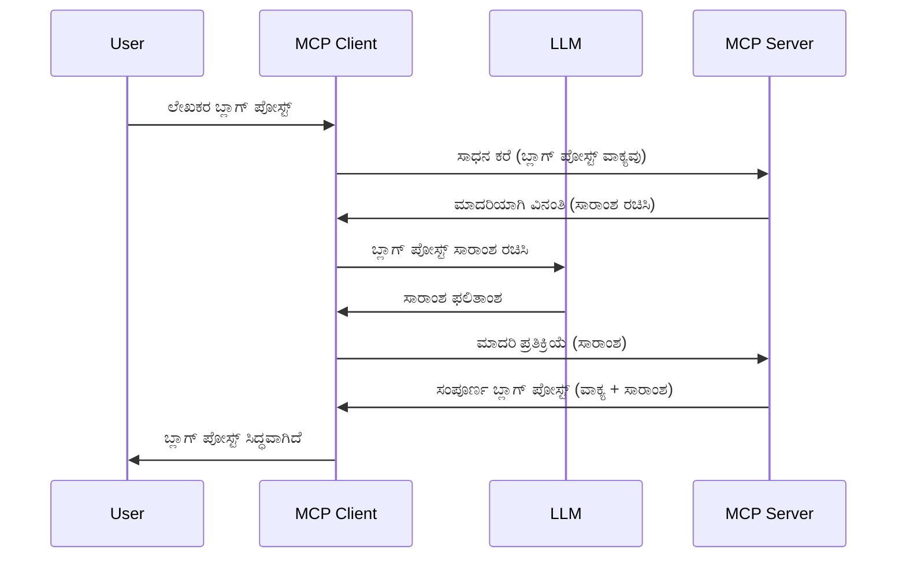

# ಸಮ್ಪ್ಲಿಂಗ್ - ಕ್ಲೈಂಟ್‌ಗೆ ವೈಶಿಷ್ಟ್ಯಗಳನ್ನು делಿಗೇಟ್ ಮಾಡಿ

> **ಪುರಾತನ ಪ್ರಕಟಣೆ:** `2026-07-28` MCP ಸ್ಪೆಸಿಫಿಕೇಶನ್ ಬಿಡುಗಡೆ ಅಭ್ಯರ್ಥಿ ಸಂಸ್ಕರಣೆಯಲ್ಲಿ ಸಮ್ಪ್ಲಿಂಗ್ ಅನ್ನು ನೇರವಾಗಿ LLM ಪ್ರೊವೈಡರ್ API ಗಳೊಂದಿಗೆ ಸಂಯೋಜಿಸುವ ಪರಿಗಣನೆಯಿಂದ ಪುರಾತನಗೊಳಿಸಲಾಗಿದೆ. ಸಮ್ಪ್ಲಿಂಗ್ `2025-11-25` ರಲ್ಲಿ ಮತ್ತು ಯಾವುದೇ ಅಧಿಕೃತ ಪುರಾತನಗೊಳಿಸುವಿಕೆಯಿಂದ ಕನಿಷ್ಟ ಒಂದು ವರ್ಷ ಉಳಿಯುತ್ತದೆ, ಆದ್ದರಿಂದ ಈ ಪಾಠದಲ್ಲಿನ ಎಲ್ಲವೂ ಅಮಾನ್ಯವಲ್ಲ — ಆದರೆ ಹೊಸ ಸೇವರ್ ವಿನ್ಯಾಸಗಳು ಬದಲಾವಣೆ ಮಾದರಿಯನ್ನು ಮೌಲ್ಯಮಾಪನ ಮಾಡಬೇಕು. [MCP ನಲ್ಲಿ ಏನು ಬದಲಾಗುತ್ತಿದೆ: 2026-07-28 ರಿಲೀಸ್ ಅಭ್ಯರ್ಥಿ](../../01-CoreConcepts/mcp-2026-07-28-release-candidate.md) ನೋಡಿ.

ಕೆಲವೊಮ್ಮೆ, ನೀವು MCP ಕ್ಲೈಂಟ್ ಮತ್ತು MCP ಸೇವರ್ ಒಟ್ಟಿಗೆ ಸೇರಿ ಕಾರ್ಯ ಸಾಧಿಸಲು ಅಗತ್ಯವಾಗುತ್ತದೆ. ಇಂತಹ ಸಂದರ್ಭಗಳಲ್ಲಿ, ಸೇವರ್ ಕ್ಲೈಯಿಂಟ್‌ನಲ್ಲಿ ಇರುವ LLM ಸಹಾಯವನ್ನು ಬೇಕಾಗುವಾಗ, ಸಮ್ಪ್ಲಿಂಗ್ ಬಳಸಬೇಕು.

ಕೆಲವು ಬಳಕೆ ಮಾದರಿಗಳನ್ನು ಮತ್ತು ಸಮ್ಪ್ಲಿಂಗ್ ಒಳಗೊಂಡ ಸೊಲ್ಯೂಶನ್ ಅನ್ನು ಹೇಗೆ ನಿರ್ಮಿಸುವುದು ಎಂದು ಬೀರೋಣ.

## ಕಾಮುಖ ಾವರ

ಈ ಪಾಠದಲ್ಲಿ, ನಾವು ಸಮ्प್ಲಿಂಗ್ ಯಾವಾಗ ಮತ್ತು ಎಲ್ಲಿ ಬಳಸಬೇಕು ಮತ್ತು ಅದನ್ನು ಹೇಗೆ ಸಂರಚಿಸಬಹುದು ಎಂದು ವಿವರಿಸುತ್ತೇವೆ.

## ಕಲಿಕೆಯ ಉದ್ದೇಶಗಳು

ಈ ಅಧ್ಯಾಯದಲ್ಲಿ ನಾವು:

- ಸಮ್ಪ್ಲಿಂಗ್ ಏನೆಂದು ಮತ್ತು ಅದನ್ನು ಯಾವಾಗ ಬಳಸಿ ಎಂಬುದನ್ನು ವಿವರಿಸುವುದು.
- MCP ನಲ್ಲಿ ಸಮ್ಪ್ಲಿಂಗ್ ಅನ್ನು ಸಂರಚಿಸುವ ವಿಧಾನವನ್ನು ತೋರಿಸುವುದು.
- ಸಮ್ಪ್ಲಿಂಗ್ ನ ಉದಾಹರಣೆಗಳನ್ನು ಕಲಿಸುವುದು.

## ಸಮ್ಪ್ಲಿಂಗ್ ಏನು ಮತ್ತು ಅದನ್ನು ಯಾಕೆ ಬಳಸಬೇಕು?

ಸಮ್ಪ್ಲಿಂಗ್ ಒಂದು ಉನ್ನತ ವೈಶಿಷ್ಟ್ಯವಾಗಿದೆ ಮತ್ತು ಕೆಳಗಿನ ರೀತಿಯಲ್ಲಿ ಕಾರ್ಯನಿರ್ವಹಿಸುತ್ತದೆ:



### ಸಮ್ಪ್ಲಿಂಗ್ ವಿನಂತಿ

ಉತ್ತಮದು, ಈಗ ನಮ್ಮ ಬಳಿ ವಿಶ್ವಾಸಾರ್ಹ ದೃಶ್ಯವಿದೆ, ಸೇವರ್ ಕ್ಲೈಯಿಂಟ್‌ಗೆ ಕಳುಹಿಸುವ ಸಮ್ಪ್ಲಿಂಗ್ ವಿನಂತಿಯ ಬಗ್ಗೆ ಮಾತಾಡೋಣ. JSON-RPC ಸ್ವರೂಪದಲ್ಲಿ ಇಂತಹ ವಿನಂತಿ ಹೀಗೆ ಕಾಣಬಹುದು:

```json
{
  "jsonrpc": "2.0",
  "id": 1,
  "method": "sampling/createMessage",
  "params": {
    "messages": [
      {
        "role": "user",
        "content": {
          "type": "text",
          "text": "Create a blog post summary of the following blog post: <BLOG POST>"
        }
      }
    ],
    "modelPreferences": {
      "hints": [
        {
          "name": "claude-3-sonnet"
        }
      ],
      "intelligencePriority": 0.8,
      "speedPriority": 0.5
    },
    "systemPrompt": "You are a helpful assistant.",
    "maxTokens": 100
  }
}
```

ಇಲ್ಲಿ ಕೆಲವು ಅಂಶಗಳನ್ನು ವಿಶೇಷವಾಗಿ ಗಮನಿಸಬೇಕಿದೆ:

- Prompt, content -> text ಅಡಿಯಲ್ಲಿ, ಅದು LLM ಗೆ ಬ್ಲಾಗ್ ಪೋಸ್ಟ್ ಸಾರಾಂಶ ನೀಡಲು ಸೂಚನೆ.

- **modelPreferences**. ಈ ವಿಭಾಗವು ಪ್ರಸ್ತಾಪ ಮಾತ್ರ, LLM ನೊಂದಿಗೆ ಯಾವ ಸಂರಚನೆಯನ್ನು ಉಪಯೋಗಿಸುವುದೆಂದು ಪ್ರಸ್ತಾಪ. ಬಳಕೆದಾರರು ಈ ಶಿಫಾರಸುಗಳೊಂದಿಗೆ ಹೋಗಬಹುದು ಅಥವಾ ಬದಲಾಯಿಸಬಹುದು. ಈ ಸಂದರ್ಭದಲ್ಲಿ, ವರದಿ ಮಾಡಲಾದ ಮಾದರಿ, ವೇಗ ಮತ್ತು ಬುದ್ಧಿಮತ್ತೆಯ ಪ್ರಾಥಮಿಕತೆಗಳ ಶಿಫಾರಸುಗಳಿವೆ.
- **systemPrompt**, ಇದು ನಿಮ್ಮ LLM ಗೆ ವ್ಯಕ್ತಿತ್ವ ನೀಡುವ ಸಾಮಾನ್ಯ ವ್ಯವಸ್ಥೆ ಸೂಚನೆ.
- **maxTokens**, ಈ ಕಾರ್ಯದಕ್ಕೆ ಎಷ್ಟು ಟೋಕನ್‌ಗಳನ್ನು ಬಳಸಬೇಕೆಂಬ ಸೂಚನೆ.

### ಸಮ್ಪ್ಲಿಂಗ್ ಪ್ರತಿಕ್ರಿಯೆ

ಈ ಪ್ರತಿಕ್ರಿಯೆಯನ್ನು MCP ಕ್ಲೈಂಟ್ ಪರಿಶೀಲಿಸಿ LLM ಕ್ಕೆ ಕರೆ ಮಾಡಿ, ಆ პასუხಕ್ಕಾಗಿ ಕಾಯುತ್ತದೆ ಮತ್ತು ನಂತರ ಈ ಸಂದೇಶವನ್ನು ರಚಿಸಿ MCP ಸೇವರ್ ಗೆ ಕಳುಹಿಸುತ್ತದೆ. JSON-RPC ನಲ್ಲಿ ಅದು ಹೀಗೆ ಕಾಣಬಹುದು:

```json
{
  "jsonrpc": "2.0",
  "id": 1,
  "result": {
    "role": "assistant",
    "content": {
      "type": "text",
      "text": "Here's your abstract <ABSTRACT>"
    },
    "model": "gpt-5",
    "stopReason": "endTurn"
  }
}
```

ನಾವು ಕೋರಿ ಅದೇ ಬ್ಲಾಗ್ ಪೋಸ್ಟ್ ಸಾರಾಂಶದಂತೆ ಉತ್ತರ ಬಂದಿದೆ. ಬಳಕೆದಾರರು ಶಿಫಾರಸಾದ ಮಾದರಿಯನ್ನು ಬದಲಾಯಿಸಬಹುದು ಎಂದು ವಿವರಿಸಲು "gpt-5" ಈ ಬಾರಿ "claude-3-sonnet"ಗೆ ಬದಲಾಗಿ ಆಯ್ದುಕೊಳ್ಳಲಾಗಿದೆ.

ಈಗ ಮುಖ್ಯ ಹರಿವನ್ನು ತಿಳಿದುಕೊಂಡ ಮೇಲೆ, "ಬ್ಲಾಗ್ ಪೋಸ್ಟ್ ರಚನೆ + ಸಾರಾಂಶ" ಕಾರ್ಯისთვის ಸಮರ್ಪಕವಾಗಿದೆ ಎಂದು ನೋಡೋಣ, ಇದನ್ನು ಕಾರ್ಯಗತಗೊಳಿಸಲು ನಾವು ಏನು ಮಾಡಬೇಕೆಂದು ತಿಳಿಯೋಣ.

### ಸಂದೇಶ ಪ್ರಕಾರಗಳು

ಸಮ್ಪ್ಲಿಂಗ್ ಸಂದೇಶಗಳು ಕೇವಲ ಪಠ್ಯಕ್ಕೆ ಮಾತ್ರ ಸೀಮಿತವಲ್ಲ, ಚಿತ್ರಗಳು ಮತ್ತು ಆಡಿಯೋವನ್ನು ಸಹ ಕಳುಹಿಸಬಹುದು. JSON-RPC ಇರಿಸುವ ವಿಧಾನ ಭಿನ್ನವಾಗಿದೆ:

**ಪಠ್ಯ**

```json
{
  "type": "text",
  "text": "The message content"
}
```

**ಚಿತ್ರ ವಿಷಯ**

```json
{
  "type": "image",
  "data": "base64-encoded-image-data",
  "mimeType": "image/jpeg"
}
```

**ಆಡಿಯೋ ವಿಷಯ**

```json
{
  "type": "audio",
  "data": "base64-encoded-audio-data",
  "mimeType": "audio/wav"
}
```

> NOTE: ಸಮ್ಪ್ಲಿಂಗ್ ಕುರಿತು ಹೆಚ್ಚಿನ ವಿವರಗಳಿಗೆ, ದಯವಿಟ್ಟು [ಅಧಿಕೃತ ಡಾಕ್ಯುಮೆಂಟ್](https://modelcontextprotocol.io/specification/2025-11-25/client/sampling) ಪರಿಶೀಲಿಸಿ

## ಕ್ಲೈಯಿಂಟ್ ನಲ್ಲಿ ಸಮ್ಪ್ಲಿಂಗ್ ಅನ್ನು ಹೇಗೆ ಸಂರಚಿಸುವುದು

> ಗಮನಿಸಿ: ನೀವು ಕೇವಲ ಸೇವರ್ ನಿರ್ಮಿಸುತ್ತಿದ್ದರೆ, ಇಲ್ಲಿ ಹೆಚ್ಚು ಕಾರ್ಯವಿಲ್ಲ.

ಕ್ಲೈಯಿಂಟ್ ನಲ್ಲಿ, ನೀವು ಕೆಳಗಿನ ವೈಶಿಷ್ಟ್ಯವನ್ನು ಈ ರೀತಿಯಾಗಿ ಸೂಚಿಸಬೇಕು:

```json
{
  "capabilities": {
    "sampling": {}
  }
}
```

ಇದನ್ನು ನಿಮ್ಮ ಆಯ್ದ ಕ್ಲೈಯಿಂಟ್ ಸೇವರ್ ಜೊತೆಗೆ ಪ್ರಾರಂಭಿಸುವಾಗ ಸ್ವೀಕರಿಸಲಾಗುತ್ತದೆ.

## ಸಮ್ಪ್ಲಿಂಗ್ ಕಾರ್ಯಾಚರಣೆಯ ಉದಾಹರಣೆ - ಬ್ಲಾಗ್ ಪೋಸ್ಟ್ ರಚನೆ

ನಾವು ಸಮ್ಪ್ಲಿಂಗ್ ಸೇವರ್ ಕೋಡ್ ಸಹಿತ ಬರೆಯೋಣ, ನಾವು ಕೆಳಗಿನವುಗಳನ್ನು ಮಾಡಬೇಕಾಗುತ್ತದೆ:

1. ಸೇವರ್ ಮೇಲೆ ಒಂದು ಟೂಲ್ ರಚಿಸಿ.
1. ಆ ಟೂಲ್ ಸಮ್ಪ್ಲಿಂಗ್ ವಿನಂತಿಯನ್ನು ರಚಿಸಬೇಕು.
1. ಟೂಲ್ ಕ್ಲೈಯಿಂಟ್ ನ ಸಮ್ಪ್ಲಿಂಗ್ ವಿನಂತಿಗೆ ಉತ್ತರ ಸಿಗಲು ಕಾಯಬೇಕು.
1. ನಂತರ ಟೂಲ್ ಫಲಿತಾಂಶ ಹೊರತರುವಂತಾಗಲಿ.

ಹಂತ ಹಂತವಾಗಿ ಕೋಡ್ ನೋಡೋಣ:

### -1- ಟೂಲ್ ರಚಿಸಿ

**python**

```python
@mcp.tool()
async def create_blog(title: str, content: str, ctx: Context[ServerSession, None]) -> str:
    """Create a blog post and generate a summary"""

```

### -2- ಸಮ್ಪ್ಲಿಂಗ್ ವಿನಂತಿ ರಚಿಸಿ

ಕೆಳಗಿನ ಕೋಡ್ ಸಹಿತ ನಿಮ್ಮ ಟೂಲ್ ವಿಸ್ತರಿಸಿ:

**python**

```python
post = BlogPost(
        id=len(posts) + 1,
        title=title,
        content=content,
        abstract=""
    )

prompt = f"Create an abstract of the following blog post: title: {title} and draft: {content} "

result = await ctx.session.create_message(
        messages=[
            SamplingMessage(
                role="user",
                content=TextContent(type="text", text=prompt),
            )
        ],
        max_tokens=100,
)

```

### -3- ಪ್ರತಿಕ್ರಿಯೆಗೆ ಕಾಯಿರಿ ಮತ್ತು ಪ್ರತಿಕ್ರಿಯೆಯನ್ನು ಹಿಂತಿರುಗಿಸಿ

**python**

```python
post.abstract = result.content.text

posts.append(post)

# ಸಂಪೂರ್ಣ ಉತ್ಪನ್ನವನ್ನು ಹಿಂತಿರುಗಿಸಿ
return json.dumps({
    "id": post.title,
    "abstract": post.abstract
})
```

### -4- ಸಂಪೂರ್ಣ ಕೋಡ್

**python**

```python
from starlette.applications import Starlette
from starlette.routing import Mount, Host

from mcp.server.fastmcp import Context, FastMCP

from mcp.server.session import ServerSession
from mcp.types import SamplingMessage, TextContent

import json


from uuid import uuid4
from typing import List
from pydantic import BaseModel


mcp = FastMCP("Blog post generator")

# app = FastAPI()

posts = []

class BlogPost(BaseModel):
    id: int
    title: str
    content: str
    abstract: str

posts: List[BlogPost] = []

@mcp.tool()
async def create_blog(title: str, content: str, ctx: Context[ServerSession, None]) -> str:
    """Create a blog post and generate a summary"""

    post = BlogPost(
        id=len(posts) + 1,
        title=title,
        content=content,
        abstract=""
    )

    prompt = f"Create an abstract of the following blog post: title: {title} and draft: {content} "

    result = await ctx.session.create_message(
        messages=[
            SamplingMessage(
                role="user",
                content=TextContent(type="text", text=prompt),
            )
        ],
        max_tokens=100,
    )

    post.abstract = result.content.text

    posts.append(post)

    # ಸಂಪೂರ್ಣ ಬ್ಲಾಗ್ ಪೋಸ್ಟ್ ಅನ್ನು ಹಿಂತಿರುಗಿಸಿ
    return json.dumps({
        "id": post.title,
        "abstract": post.abstract
    })

if __name__ == "__main__":
    print("Starting server...")
    # mcp.run()
    mcp.run(transport="streamable-http")

# ಅಪ್ಲಿಕೇಶನ್ ಅನ್ನು ಇಗ್ನೋರ್ ಮಾಡಿ: python server.py
```

### -5- ವಿಸುಯಲ್ ಸ್ಟುಡಿಯೋ ಕೋಡ್ ನಲ್ಲಿ ಪರೀಕ್ಷೆ ಮಾಡುವುದು

ವಿಸುಯಲ್ ಸ್ಟುಡಿಯೋ ಕೋಡ್ ನಲ್ಲಿ ಇದನ್ನು ಪರೀಕ್ಷಿಸಲು, ಕೆಳಗಿನವು ಮಾಡಿ:

1. ಟರ್ಮಿನಲ್ ನಲ್ಲಿ ಸೇವರ್ ಪ್ರಾರಂಭಿಸಿ
1. ಇದನ್ನು *mcp.json* ನಲ್ಲಿ ಸೇರಿಸಿ (ಮತ್ತು ಸೇವರ್ ಪ್ರಾರಂಭವಾಗಿದೆ ಎಂದು ಖಚಿತಪಡಿಸಿ) ಉದಾಹರಣೆಗೆ ಹೀಗೆ:

   ```json
   "servers": {
      "blog-server": {
        "type": "http",
        "url": "http://localhost:8000/mcp"
      }
   }
   ```

1. ಒಂದು ಪ್ರಾಂಪ್ಟ್ ಟೈಪ್ ಮಾಡಿ:

   ```text
   create a blog post named "Where Python comes from", the content is "Python is actually named after Monty Python Flying Circus"
   ```

1. ಸಮ್ಪ್ಲಿಂಗ್ ನಡೆಯಲು ಅನುಮತಿಸಿ. ಮೊದಲು ನಿಮಗೆ ಒಂದು ಹೆಚ್ಚುವರಿ ಡೈಲಾಗ್ ಸಿಕ್ಕೇನಿದೆ ಮತ್ತು ಅದನ್ನು ಒಪ್ಪಬೇಕು ನಂತರ ಸಾಮಾನ್ಯ ಸಾಧನ ರನ್ ಕೇಳುವ ಡೈಲಾಗ್ ಕಾಣಿಸುತ್ತದೆ.

1. ಫಲಿತಾಂಶಗಳನ್ನು ಪರಿಶೀಲಿಸಿ. ಫಲಿತಾಂಶಗಳು GitHub Copilot ಚಾಟ್ ನಲ್ಲಿ ಚೆನ್ನಾಗಿ ಪ್ರದರ್ಶಿಸುತ್ತವೆ ಮತ್ತು ನೀವು ಅವುಗಳ ಕಚ್ಚಾ JSON ಪ್ರತಿಕ್ರಿಯೆಯನ್ನು ಪರಿಶೀಲಿಸಬಹುದು.

**ಬೋನಸ್**. ವಿಸುಯಲ್ ಸ್ಟುಡಿಯೋ ಕೋಡ್ ಟೂಲಿಂಗ್ ಸಮ್ಪ್ಲಿಂಗ್ ಗೆ ಉತ್ತಮ ಬೆಂಬಲ ನೀಡುತ್ತದೆ. ನೀವು ನಿಮ್ಮ ಅನುಸ್ಥಾಪಿತ 서버 ನಲ್ಲಿ ಸಮ್ಪ್ಲಿಂಗ್ ಪ್ರವೇಶವನ್ನು ಈ ರೀತಿ ಸಂರಚಿಸಬಹುದು:

1. ವಿಸ್ತರಣೆ ವಿಭಾಗಕ್ಕೆ ಹೋಗಿ.
1. "MCP SERVERS - INSTALLED" ವಿಭಾಗದಲ್ಲಿ ನಿಮ್ಮ ಅನುಸ್ಥಾಪಿತ ಸೇವರ್ ಗಾಗಿ ಕಾಗ್ ಚಿಹ್ನೆಯನ್ನು ಆಯ್ಕೆಮಾಡಿ.
1. "Configure Model Access" ಆಯ್ಕೆಮಾಡಿ, ಇಲ್ಲಿ ನೀವು GitHub Copilot ಸಮ್ಪ್ಲಿಂಗ್ ಕಾರ್ಯಾಚರಣೆಯಲ್ಲಿ ಬಳಸಬಲ್ಲ ಮಾದರಿಗಳನ್ನು ಆಯ್ಕೆಮಾಡಬಹುದು. "Show Sampling requests" ಆಯ್ಕೆಮಾಡಿ ಇತ್ತೀಚೆಗೆ ನಡೆದ ಎಲ್ಲಾ ಸಮ್ಪ್ಲಿಂಗ್ ವಿನಂತಿಗಳನ್ನು ನೋಡಬಹುದು.

## ಕಾರ್ಯ

ಈ ಕಾರ್ಯದಲ್ಲಿ, ನೀವು ಸ್ವಲ್ಪ ವಿಭಿನ್ನ ಸಮ್ಪ್ಲಿಂಗ್ ಅನ್ನು ತಯಾರಿಸುವಿರಿ, ಅದು ಉತ್ಪನ್ನ ವಿವರಣೆ ರಚನೆಯನ್ನು ಬೆಂಬಲಿಸುವ sampling integration. ನಿಮ್ಮ ದೃಶ್ಯದಿವ:

**ದೃಶ್ಯ:** ಇ-ಕಾಮರ್ಸ್ ಬ್ಯಾಕ್ ಆಫೀಸ್ ಕೆಲಸಗಾರರಿಗೆ ಉತ್ಪನ್ನ ವಿವರಣೆ ರಚಿಸಲು ಹೆಚ್ಚು ಸಮಯ ಬೇಕಾಗುತ್ತದೆ. ಆದ್ದರಿಂದ, "create_product" ಎಂಬ ಟೂಲ್ ಅನ್ನು "title" ಮತ್ತು "keywords" ಆರ್ಗ್ಯೂಮೆಂಟ್‌ಗಳೊಂದಿಗೆ ಕರೆಯುವುದರಿಂದ ಹೋಲಿಕೆಯನ್ನು ನಿರ್ಮಿಸಿ, ಅದು ಉತ್ಪನ್ನದ "description" ಕ್ಷೇತ್ರವಿರುವ ಪೂರ್ಣ ಉತ್ಪನ್ನವನ್ನು ರಚಿಸಬೇಕು, ಆ ವಿವರಣೆ ಕ್ಲೈಂಟ್ LLM ಮೂಲಕ ತುಂಬಬೇಕು.

ಟಿಪ್: ಮೊದಲು ಕಲಿತದ್ದು ಬಳಸಿ ಈ ಸೇವರ್ ಮತ್ತು ಅದನ ಟೂಲ್ ಅನ್ನು sampling ವಿನಂತಿ ಮೂಲಕ ರಚಿಸಿ.

## ಪರಿಹಾರ

[Parihara](./solution/README.md)

## ಪ್ರಮುಖ ಕಲಿಕೆಗಳು

ಸಮ್ಪ್ಲಿಂಗ್ ಒಂದು ಶಕ್ತಿಶಾಲಿ ವೈಶಿಷ್ಟ್ಯವಾಗಿದೆ, ಅದು ಸೇವರ್ LLM ಸಹಾಯ ಬೇಕಾದಾಗ ಕೆಲಸಗಳನ್ನು ಕ್ಲೈಂಟ್‌ಗೆ ದೇಲಿಗೇಟ್ ಮಾಡಲು ಅನುಮತಿಸುತ್ತದೆ.

## ಮುಂದೇನು

- [ಅಧ್ಯಾಯ 4 - ಪ್ರಾಯೋಗಿಕ ಜಾರಿಗೆ](../../04-PracticalImplementation/README.md)

---

<!-- CO-OP TRANSLATOR DISCLAIMER START -->
**ಅಸ್ವೀಕಾರ**:
ಈ ದಸ್ತಾವೇಜು AI ಅನುವಾದ ಸೇವೆ [Co-op Translator](https://github.com/Azure/co-op-translator) ಬಳಸಿ ಅನುವಾದಿಸಲಾಗಿದೆ. ನಾವು ನಿಖರತೆಯನ್ನು ಸಾಧಿಸಲು ಪ್ರಯತ್ನಿಸುತ್ತಿದ್ದರೂ, ದಯವಿಟ್ಟು ಗಮನಿಸಿ, ಸ್ವಯಂಚಾಲಿತ ಅನುವಾದಗಳಲ್ಲಿ ದೋಷಗಳು ಅಥವಾ ಅಸಡ್ಡೆಗಳು ಇರಬಹುದು. ಮೂಲ ಭಾಷೆಯಲ್ಲಿರುವ ಮೂಲ ದಸ್ತಾವೇಜು ಪ್ರಾಮಾಣಿಕ ಮೂಲವೆಂದು ಪರಿಗಣಿಸಬೇಕು. ಪ್ರಮುಖ ಮಾಹಿತಿಗಾಗಿ, ವೃತ್ತಿಪರ ಮಾನವ ಅನುವಾದವನ್ನು ಶಿಫಾರಸು ಮಾಡಲಾಗುತ್ತದೆ. ಈ ಅನುವಾದವನ್ನು ಬಳಸುವ ಮೂಲಕ ಉಂಟಾಗುವ ಯಾವುದೇ ತಪ್ಪು ಅರ್ಥಗಳ ಅಥವಾ ತಪ್ಪು ವ್ಯಾಖ್ಯಾನಗಳ ಬಗ್ಗೆ ನಾವು ಹೊಣೆಗಾರರಲ್ಲ.
<!-- CO-OP TRANSLATOR DISCLAIMER END -->