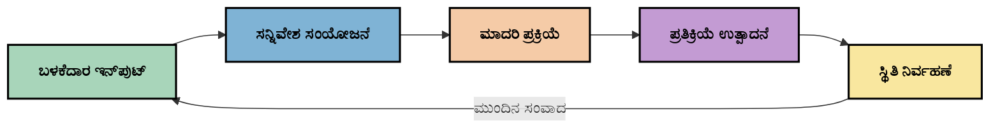
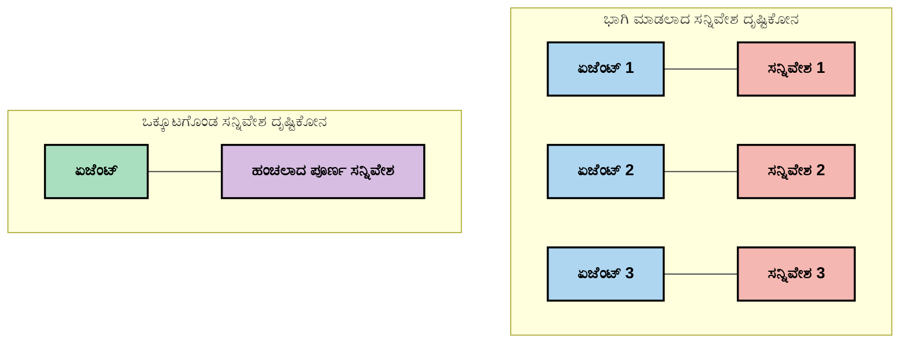
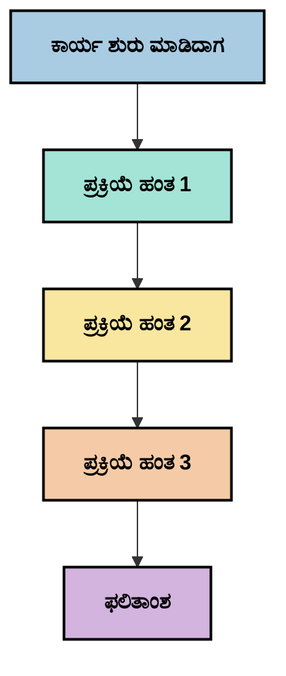
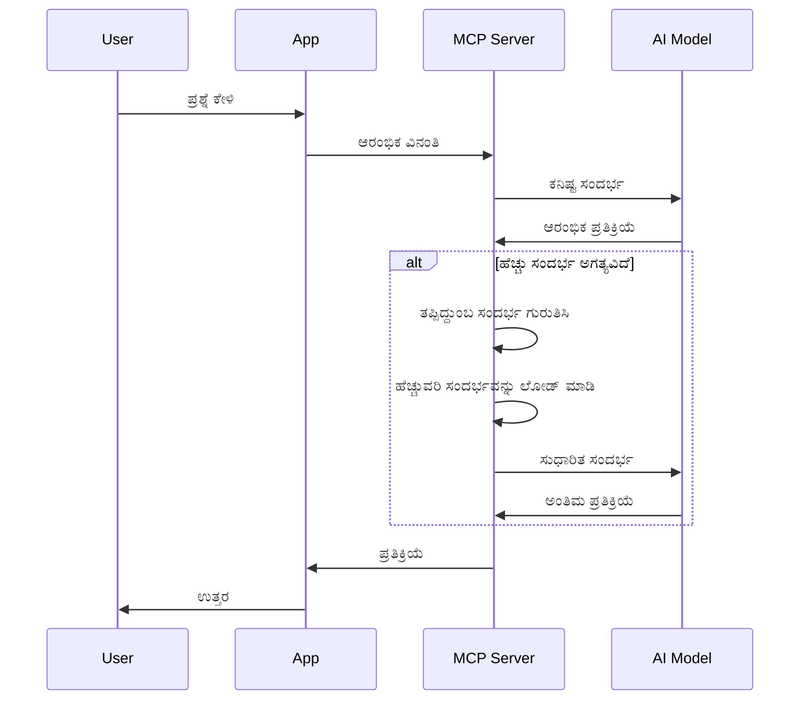
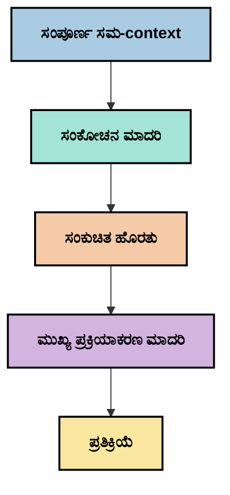
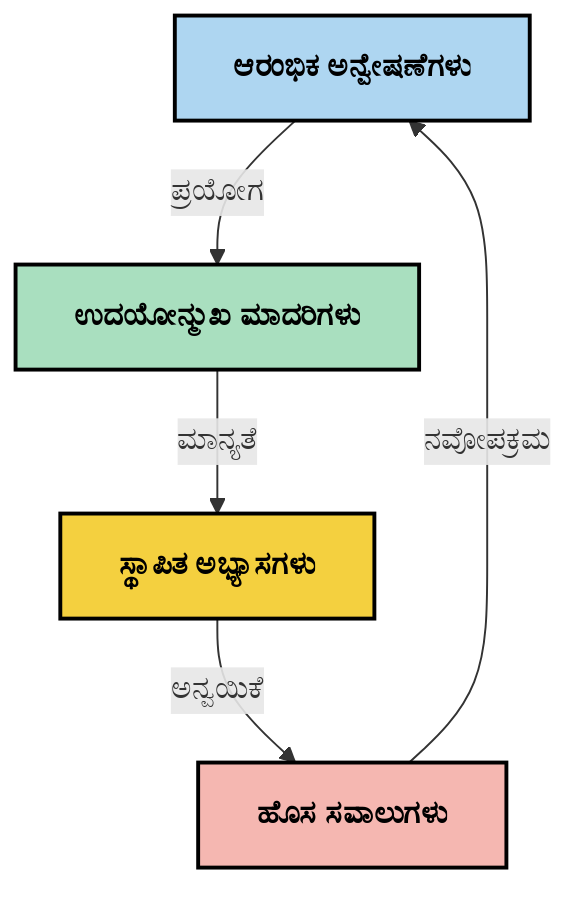

# ಕಾಂಟೆಕ್ಸ್ಟ್ ಇಂಜಿನಿಯರಿಂಗ್: MCP ಪರಿಸರದಲ್ಲಿ ಉದಯೋನ್ಮುಖ ಕಲ್ಪನೆ

## ಅವಲೋಕನ

ಕಾಂಟೆಕ್ಸ್ಟ್ ಇಂಜಿನಿಯರಿಂಗ್ ಎಂಬುದು ಏಐ ಕ್ಷೇತ್ರದಲ್ಲಿ ಉದಯೋನ್ಮುಖವಾಗುತ್ತಿರುವ ಒಂದು ಕಲ್ಪನೆ, ಅದು ಗ್ರಾಹಕರ ಮತ್ತು ಏಐ ಸೇವೆಗಳ ನಡುವಿನ ಸಂವಾದಗಳಾದಂತೆಯೇ ಮಾಹಿತಿ ಹೇಗೆ ರಚನೆಮಾಡಲ್ಪಟ್ಟಿದೆ, ಒದಗಿಸಲ್ಪಟ್ಟಿದೆ ಮತ್ತು ನಿರ್ವಹಿಸಲಾಗಿದೆ ಎಂಬುದನ್ನು ಅನ್ವೇಷಿಸುತ್ತದೆ. ಮಾದರಿ ಕಾಂಟೆಕ್ಸ್ಟ್ ಪ್ರೋಟೋಕಾಲ್ (MCP) ಪರಿಸರವು ಪ್ರಗತಿ ಪಡೆಯುತ್ತಿದಂತೆ,_context_ ಅನ್ನು ಪರಿಣಾಮಕಾರಿಯಾಗಿ ನಿರ್ವಹಿಸುವುದು ಹೆಚ್ಚಿನ ಮಹತ್ವ ಪಡೆದಿದೆ. ಈ ಘಟಕವು ಕಾಂಟೆಕ್ಸ್ಟ್ ಇಂಜಿನಿಯರಿಂಗ್ ಕಲ್ಪನೆಯನ್ನು ಪರಿಚಯಿಸಿ, ಅದನ್ನು MCP ಅನುಷ್ಠಾನಗಳಲ್ಲಿ ಹೇಗೆ ಉಪಯೋಗಿಸಬಹುದೋ ಅನ್ವೇಷಿಸುತ್ತದೆ.

## ಕಲಿಕೆ ಗುರಿಗಳು

ಈ ಘಟಕದ ಅಂತ್ಯದಲ್ಲಿ, ನೀವು ಕೆಳಕಂಡುವುಗಳನ್ನು ಮಾಡಲು ಸಾಧ್ಯವಾಗಲಿದೆ:

- ಕಲಿಕೆಯಾಗಿ ಕಾಂಟೆಕ್ಸ್ಟ್ ಇಂಜಿನಿಯರಿಂಗ್ ಎಂಬ ಉದಯೋನ್ಮುಖ ಕಲ್ಪನೆಯು ಮತ್ತು MCP ಅನ್ವಯಿಕೆಗಳಲ್ಲಿ ಅದರ ಸಂಭವನೀಯ ಪಾತ್ರವನ್ನು ಅರ್ಥಮಾಡಿಕೊಳ್ಳುವುದು
- MCP ಪ್ರೋಟೋಕಾಲ್ ವಿನ್ಯಾಸವು ಪರಿಹರಿಸುವ ಕಾಂಟೆಕ್ಸ್ಟ್ ನಿರ್ವಹಣೆಯ ಪ್ರಮುಖ ಸವಾಲುಗಳನ್ನು ಗುರುತಿಸುವುದು
- ಒಳ್ಳೆಯ ಕಾಂಟೆಕ್ಸ್ಟ್ ನಿರ್ವಹಣೆಯ ಮೂಲಕ ಮಾದರಿ ಕಾರ್ಯಕ್ಷಮತೆಯನ್ನು ಸುಧಾರಿಸುವ ತಂತ್ರಗಳನ್ನು ಪರಿಶೀಲಿಸುವುದು
- ಕಾಂಟೆಕ್ಸ್ಟ್ ಪರಿಣಾಮಕಾರಿತ್ವವನ್ನು ಅಳವಡಿಸುವ ಮತ್ತು ಮೌಲ್ಯಮಾಪನ ಮಾಡುವ ವಿಧಾನಗಳನ್ನು ಪರಿಗಣಿಸುವುದು
- MCP ಫಲಕದ ಮೂಲಕ ಏಐ ಅನುಭವಗಳನ್ನು ಸುಧಾರಿಸಲು ಈ ಉದಯೋನ್ಮುಖ ಕಲ್ಪನೆಗಳನ್ನು ಅನ್ವಯಿಸುವುದು

## ಕಾಂಟೆಕ್ಸ್ಟ್ ಇಂಜಿನಿಯರಿಂಗ್ ಗೆ ಪರಿಚಯ

ಕಾಂಟೆಕ್ಸ್ಟ್ ಇಂಜಿನಿಯರಿಂಗ್ ಎನ್ನುವುದು ಬಳಕೆದಾರులు, ಅಪ್ಲಿಕೇಶನ್ಗಳು ಮತ್ತು ಏಐ ಮಾದರಿಗಳ ನಡುವಿನ ಮಾಹಿತಿಯ ಹರಿವುಗಳನ್ನು ಉದ್ದೇಶಪೂರ್ವಕವಾಗಿ ವಿನ್ಯಾಸಗೊಳಿಸುವ ಮತ್ತು ನಿರ್ವಹಿಸುವ ಒಂದು ಉದಯೋನ್ಮುಖ ಕಲ್ಪನೆ. ಪ್ರಾಂಪ್ಟ್ ಇಂಜಿನಿಯರಿಂಗ್ ಮುಂತಾದ ಸ್ಥಾಪಿತ ಕ್ಷೇತ್ರಗಳಿಗಿಂತ ವಿಭಿನ್ನವಾಗಿ, ಕಾಂಟೆಕ್ಸ್ಟ್ ಇಂಜಿನಿಯರಿಂಗ್ ಇನ್ನೂ ವ್ಯವಹಾರಸ್ಥರಿಂದ ಸರಿಯಾದ ಸಮಯದಲ್ಲಿ ಸರಿಯಾದ ಮಾಹಿತಿಯನ್ನು ಏಐ ಮಾದರಿಗಳಿಗೆ ಒದಗಿಸುವ ಅನನ್ಯ ಸವಾಲುಗಳನ್ನು ಪರಿಹರಿಸಲು ನಿರ್ವಹಿಸಲಾಗುತ್ತಿರುವುದು.

ದೊಡ್ಡ ಭಾಷಾ ಮಾದರಿಗಳು (LLMs) ಬೆಳೆಯುತ್ತಿದ್ದಂತೆ, ಕಾಂಟೆಕ್ಸ್ಟ್ ಮಹತ್ವವು ಹೆಚ್ಚಾಗಿದೆ. ನಾವು ಒದಗಿಸುವ_Context_ನ ಗುಣಮಟ್ಟ, ಪ್ರಾಸangosಾಭಧತೆ ಮತ್ತು ರಚನೆ ನೇರವಾಗಿ ಮಾದರಿಯProducesಳಿಕೆಗಳನ್ನು ಪ್ರಭಾವಿಸುತ್ತದೆ. ಕಾಂಟೆಕ್ಸ್ಟ್ ಇಂಜಿನಿಯರಿಂಗ್ ಈ ಸಂಬಂಧವನ್ನು ಅನ್ವೇಷಿಸುತ್ತದೆ ಮತ್ತು ಪರಿಣಾಮಕಾರಿಯಾದ_Context_ನ ನಿರ್ವಹಣೆಗೆ ತತ್ವಗಳನ್ನು ಅಭಿವೃದ್ಧಿಪಡಿಸಲು ಪರಿಶೋಧಿಸುತ್ತದೆ.

> "2025ರಲ್ಲಿ, ಬಮ್ಮೆ ಉತ್ತಮ ಬುದ್ಧಿವಂತಿಕೆಳ್ಳಿದ್ದು. ಆದರೆ ಅತ್ಯಬ್ಲಿಯಾ ಮಾನವನೂ ಕೂಡ Context ಎನ್ಟ್ ಕೇಳಿಕೊಂಡಿರುವುದರ ಕುರಿತು ತಿಳಿವಳಿಕೆ ಇಲ್ಲದೆ ಅವರ ಕೆಲಸವನ್ನು ಪರಿಣಾಮಕಾರಿಯಾಗಿ ಮಾಡಲಾಗುವುದಿಲ್ಲ... ‘Context engineering’ ಮುಂದಿನ ಹಂತ ಪ್ರಾಂಪ್ಟ್ ಇಂಜಿನಿಯರಿಂಗ್. ಇದು ಡೈನಾಮಿಕ್ ಸಿಸ್ಟಂನಲ್ಲಿ ಸ್ವಯಂಚಾಲಿತವಾಗಿ ಮಾಡಲು ಸಂಬಂಧಿಸಿದೆ." — ವಾಲ್ಡನ್ ಯಾರ್ನ್, ಕಾಗ್ನಿಷನ್ ಏಐ

ಕಾಂಟೆಕ್ಸ್ಟ್ ಇಂಜಿನಿಯರಿಂಗ್ ಒಳಗೊಂಡಿರಬಹುದು:

1. **ಕಾಂಟೆಕ್ಸ್ಟ್ ಆಯ್ಕೆ**: ನೀಡಲಾದ ಕಾರ್ಯಕ್ಕೆ ಸಂಬಂಧಿಸಿದ ಮಾಹಿತಿ ಏನು ಅನ್ನುವುದನ್ನು ನಿರ್ಧರಿಸುವುದು
2. **ಕಾಂಟೆಕ್ಸ್ಟ್ ರಚನೆ**: ಮಾದರಿಯ ಅರ್ಥಮಾಡಿಕೊಳ್ಳುವಿಕೆಯನ್ನು ಹೆಚ್ಚುಮಾಡಲು ಮಾಹಿತಿಯನ್ನು ವ್ಯವಸ್ಥಿತಗೊಳಿಸುವುದು
3. **ಕಾಂಟೆಕ್ಸ್ಟ್ ಒದಗಿಸು**: ಮಾಹಿತಿಯನ್ನು ಮಾದರಿಗಳಿಗೆ ಯಾವಾಗ ಮತ್ತು ಹೇಗೆ ಒದಗಿಸಬೇಕು ಎಂಬುದನ್ನು ಉತ್ತಮಗೊಳಿಸುವುದು
4. **ಕಾಂಟೆಕ್ಸ್ಟ್ ನಿರ್ವಹಣೆ**: ಕಾಲಕಾಲಕ್ಕೆ ಕಾಂಟೆಕ್ಸ್ಟ್ ಸ್ಥಿತಿಯನ್ನು ನೋಡಿಕೊಳ್ಳುವ ಮತ್ತು ಅಭಿವೃದ್ಧಿಪಡಿಸುವುದು
5. **ಕಾಂಟೆಕ್ಸ್ಟ್ ಮೌಲ್ಯಮಾಪನ**: ಕಾಂಟೆಕ್ಸ್ಟ್ ಪರಿಣಾಮಕಾರಿತ್ವವನ್ನು ಅಳವಡಿಸುವ ಮತ್ತು ಸುಧಾರಿಸುವುದು

ಈ ಪ್ರಾಮುಖ್ಯ ಕ್ಷೇತ್ರಗಳು ವಿಶೇಷತಃ MCP ಪರಿಸರಕ್ಕೆ ಸಂಬಂಧಿಸಿದವು, ಅದು ಅಪ್ಲಿಕೇಶನ್ಗಳಿಗೆ LLMಗಳಿಗೆ_context_ ಒದಗಿಸುವ ಮಾನಕವಾದ ಮಾರ್ಗವನ್ನು ಒದಗಿಸುತ್ತದೆ.


##_Context_ ಪ್ರಯಾಣ ದೃಷ್ಟಿಕೋನ

_Context_ ಇಂಜಿನಿಯರಿಂಗ್ ಅನ್ನು ನೋಡಿ ಕಲ್ಪಿಸುವ ಒಂದು ವಿಧಾನವೆಂದರೆ ಮಾಹಿತಿಯು MCP ವ್ಯವಸ್ಥೆಯಲ್ಲಿ ಹೇಗೆ ಪ್ರಯಾಣ ಮಾಡುತ್ತದೆ ಎಂದು ಅನುಸರಿಸುವುದು:



###_Context_ ಪ್ರಯಾಣದ ಪ್ರಮುಖ ಹಂತಗಳು:

1. **ಬಳಕೆದಾರ ಇನ್ಪುಟ್**: ಬಳಕೆದಾರರಿಂದ ಕಚ್ಚಾ ಮಾಹಿತಿ (ಪಠ್ಯ, ಚಿತ್ರಗಳು, ಡಾಕ್ಯುಮೆಂಟ್‌ಗಳು)
2. **_Context_ ಸಂಯೋಜನೆ**: ಬಳಕೆದಾರ ಇನ್ಪುಟ್ ಅನ್ನು ವ್ಯವಸ್ಥೆಯ_Context_, ಸಂವಾದ ಇತಿಹಾಸ ಮತ್ತು ಇತರೆ ಪಡೆಯಲಾದ ಮಾಹಿತಿಗಳೊಂದಿಗೆ ಸಂಯೋಜಿಸುವುದು
3. **ಮಾದರಿ ಪ್ರಕ್ರಿಯೆ**: ಏಐ ಮಾದರಿ ಸಂಯೋಜಿತ_Context_ ಅನ್ನು ಪ್ರಕ್ರಿಯೆ ಮಾಡುತ್ತದೆ
4. **ಪ್ರತಿಕ್ರಿಯೆ ರಚನೆ**: ಒದಗಿಸಲಾದ_Context_ ಆಧಾರದ ಮೇಲೆ ಮಾದರಿ ಫಲಿತಾಂಶಗಳನ್ನು ಉತ್ಪಾದಿಸುತ್ತದೆ
5. **ಸ್ಥಿತಿನಿರ್ವಹಣೆ**: ಸಂವಹನದ ಆಧಾರದಲ್ಲಿ ವ್ಯವಸ್ಥೆಯ ಆಂತರಿಕ ಸ್ಥಿತಿಯನ್ನು ನವೀಕರಿಸುತ್ತದೆ

ಈ ದೃಷ್ಟಿಕೋನವು ಏಐ ವ್ಯವಸ್ಥೆಗಳಲ್ಲಿ_Context_ ನ ಚಾಲಕವಾಗಿರುವ ಸ್ವಭಾವವನ್ನು ಹೇರಳವಾಗಿ ತೋರಿಸುತ್ತದೆ ಮತ್ತು ಪ್ರತಿ ಹಂತದಲ್ಲಿ ಮಾಹಿತಿಯನ್ನು ಹೇಗೆ ಅತ್ಯುತ್ತಮವಾಗಿ ನಿರ್ವಹಿಸಬಹುದು ಎಂಬ ಮಹತ್ವಪೂರ್ಣ ಪ್ರಶ್ನೆಗಳನ್ನು ಮೂಡಿಸುತ್ತದೆ.

##_Context_ ಇಂಜಿನಿಯರಿಂಗ್ ನಲ್ಲಿ ಉದಯೋನ್ಮುಖ ತತ್ವಗಳು

_Context_ ಇಂಜಿನಿಯರಿಂಗ್ ಕ್ಷೇತ್ರ ಉಭಯಮುಖವಾಗುತ್ತಿದ್ದು, ಕೆಲ ಆರಂಭಿಕ ತತ್ವಗಳು ವ್ಯವಹಾರಸ್ಥರಿಂದ ಹೊರಬರದಿದ್ದು, ಅವು MCP ಅನುಷ್ಠಾನ ಆಯ್ಕೆಗಳನ್ನು ಮೇಲುನೋಟಕ್ಕೆ ತರಬಹುದು:

### ತತ್ವ 1:_Context_ ಅನ್ನು ಸಂಪೂರ್ಣವಾಗಿ ಹಂಚಿಕೊಳ್ಳಿ

Context ಅನ್ನು ವ್ಯವಸ್ಥೆಯ ಎಲ್ಲಾ ಘಟಕಗಳ ನಡುವೆ ಸಂಪೂರ್ಣವಾಗಿ ಹಂಚಿಕೊಳ್ಳಬೇಕು; ಬೇರೆ ಬೇರೆ ಏಜೆಂಟ್ ಗಳು ಅಥವಾ ಪ್ರಕ್ರಿಯೆಗಳ ಮಧ್ಯೆ ವಿಷಯ ವಿನ್ಯಾಸವಾದ್ದಾಗ ನಿರ್ಧಾರಗಳು ಗೊಂದಲಕ್ಕೆ ಕಾರಣವಾಗಬಹುದು.



MCP ಅನ್ವಯಿಕೆಗಳಲ್ಲಿ,_Context_ ಸಂಪೂರ್ಣ ಪೈಪ್‌ಲೈನ್ ನಲ್ಲಿ ನಿರಪರಾಧವಾಗಿ ಹರಿದಂತೆ ವ್ಯವಸ್ಥೆಗಳನ್ನು ವಿನ್ಯಾಸ ಮಾಡಬೇಕು ಬದಲಿಗೆ ಅದು ವಿಭಕ್ತವಾಗಿರಬಾರದು.

### ತತ್ವ 2: ಕ್ರಿಯೆಗಳು ಅರ್ಥಹೀನ ನಿರ್ಧಾರಗಳನ್ನು ಹೊಂದುತ್ತವೆ ಎಂದು ಗುರುತಿಸಿ

ಪ್ರತಿಯೊಂದು ಕ್ರಿಯೆಯೂ_Context_ ಯನ್ನು ವಿವೇಚಿಸಲು ಅರ್ಥಹೀನ ನಿರ್ಧಾರಗಳನ್ನು ಹೊಂದಿರುತ್ತದೆ. ಅನೇಕ ಘಟಕಗಳು ವಿಭಿನ್ನ_Context_ ಗಳ ಮೇಲೆ ಕಾರ್ಯನಿರ್ವಹಿಸಿದರೆ, ಇವು ಗೊಂದಲಕಾರಿ ಫಲಿತಾಂಶಗಳಿಗೆ ಕಾರಣವಾಗಬಹುದು.

ಈ ತತ್ವವು MCP ಅನ್ವಯಿಕೆಗಳಿಗೆ ಮಹತ್ವದ ಪರಿಣಾಮಗಳನ್ನು ಹೊಂದಿದೆ:
- ಕುರ್ಚಿ ಕಾರ್ಯಗಳನ್ನು ಪರಸ್ಪರಭೇದ ಮಾಡಿರುವ_Context_ ಜೊತೆಗೆ ಸಮಾಂತರ ಸ್ವರೂಪದಲ್ಲಿ ಮಾಡುವುದನ್ನು ಬದಲಿಗೆ ರೇಖೀಯ ಪ್ರಕ್ರಿಯೆಯಿಂದ ಪಡೆಯಿರಿ
- ಎಲ್ಲಾ ನಿರ್ಧಾರಬಿಂದುಗಳಿಗೆ ಸಮಾನ_Context_ ಮಾಹಿತಿಯ ಪ್ರವೇಶವಿರಬೇಕು ಎಂಬುದನ್ನು ಖಚಿತಪಡಿಸಿಕೊಳ್ಳಿ
- ಮುಂದಿನ ಹಂತಗಳು ಮುಂಚಿನ ನಿರ್ಧಾರಗಳ ಸಂಪೂರ್ಣ_Context_ ತೋರಿಸಲು ವ್ಯವಸ್ಥೆಗಳನ್ನು ವಿನ್ಯಾಸಮಾಡಿ

### ತತ್ವ 3:_Context_ಲವಣತೆ ಜ್ಞಾನವನ್ನು ಕಿಟಕಿ ಮಿತಿಗಳೊಂದಿಗೆ ಸರಿಗೆ ಸರಿಸುಮಾರು ಮಾಡಿ

ಸಂವಾದಗಳು ಮತ್ತು ಪ್ರಕ್ರಿಯೆಗಳು ಜಾಸ್ತಿ ಆದಂತೆ_Context_ ಕಿಟಕಿಗಳು ಅಧಿಕಮಾನವಾಗುತ್ತವೆ. ಪರಿಣಾಮಕಾರಿ_Context_ ಇಂಜಿನಿಯರಿಂಗ್ ಈ ವ್ಯಾಪ್ತಿಯನ್ನು ಮತ್ತು ತಾಂತ್ರಿಕ ಮಿತಿಗಳ ನಡುವಿನ ಗಳಘರ್ಷವನ್ನು ನಿರ್ವಹಿಸುವ ವಿಧಾನಗಳನ್ನು ಅನ್ವೇಷಿಸುತ್ತದೆ.

ಸ್ಥೂಲ ವಿಧಾನಗಳಾಗಿ ಪರಿಶೀಲಿಸಲಾಗುತ್ತಿದೆ:
- ಪ್ರಮುಖ ಮಾಹಿತಿಯನ್ನು ಉಳಿಸಿಕೊಂಡು ಟೋಕನ್ ಬಳಕೆಯನ್ನು ಕಡಿಮೆ ಮಾಡುವ_Context_ ಸಂಕುಚನ
- ಪ್ರಸ್ತುತ ಅವಶ್ಯಕತೆಗಳಿಗೆ ಅನುಗುಣವಾಗಿ_Context_ ಪ್ರಗತಿಶೀಲ ಭಾರ ಇವು
- ಪ್ರಮುಖ ನಿರ್ಧಾರಗಳನ್ನು ಮತ್ತು ತತ್ಯಗಳೊಂದಿಗೆ ಹಿಂದಿನ ಸಂವಾದಗಳ ಸಾರಾಂಶ

##_Context_ ಸವಾಲುಗಳು ಮತ್ತು MCP ಪ್ರೋಟೋಕೊಲ್ ವಿನ್ಯಾಸ

ಮಾದರಿ_Context_ ಪ್ರೋಟೋಕಾಲ್ (MCP) ಕಾಂಟೆಕ್ಸ್ಟ್ ನಿರ್ವಹಣೆಯ ಅಪರಿಮಿತ ಸವಾಲುಗಳನ್ನು ಗಮನದಲ್ಲಿರಿಸಿಕೊಂಡು ವಿನ್ಯಾಸಗೊಳಿಸಲಾಯಿತು. ಈ ಸವಾಲುಗಳನ್ನು ಅರ್ಥಮಾಡಿಕೊಂಡರೆ MCP ಪ್ರೋಟೋಕಾಲ್ ವಿನ್ಯಾಸದ ಪ್ರಮುಖ ಅಂಶಗಳನ್ನು ವಿವರಿಸಬಹುದು:


### ಸವಾಲು 1:_Context_ ಕಿಟಕಿ ಮಿತಿಗಳು
ಬಹುತೇಕ ಏಐ ಮಾದರಿಗಳಿಗೆ ನಿಗದಿತ_Context_ ಕಿಟಕಿ ಗಾತ್ರಗಳನ್ನು ಹೊಂದಿವೆ, ಅವು ಏಕ ಕಾಲದಲ್ಲಿ ಪ್ರಕ್ರಿಯೆ ಮಾಡುವ ಮಾಹಿತಿ ಪ್ರಮಾಣವನ್ನು ನಿಯಂತ್ರಿಸುತ್ತವೆ.

**MCP ವಿನ್ಯಾಸ ಪ್ರತಿಕ್ರಿಯೆ:** 
- ಪ್ರೋಟೋಕಾಲ್ ರಚನೆ ಆಧಾರಿತ, ಸಂಪನ್ಮೂಲ-ಆಧಾರಿತ_Context_ ನ್ನು ಸೌಲಭ್ಯ ಒದಗಿಸುತ್ತದೆ, ಅದು ಪರಿಣಾಮಕಾರಿಯಾಗಿ ಉಲ್ಲೇಖಿಸಬಹುದು
- ಸಂಪನ್ಮೂಲಗಳನ್ನು ಪುಟಶಃ ಲೋಡ್ ಮಾಡಬಹುದು ಮತ್ತು ಕ್ರಮನಿಷ್ಠವಾಗಿ ತುಂಬಬಹುದು

### ಸವಾಲು 2: ಸಂಬಂಧಿತತೆ ನಿರ್ಧಾರ
_Context_ ಗೆ ಯಾವ ಮಾಹಿತಿ ಅತ್ಯಂತ ಪ್ರಾಸಂಗಿಕವೆಂದು ನಿರ್ಧಾರ ಮಾಡುವುದು ಕಷ್ಟ.

**MCP ವಿನ್ಯಾಸ ಪ್ರತಿಕ್ರಿಯೆ:**
- ಅಗತ್ಯ ಆಧಾರಿತವಾಗಿ ಆಲೋಚನಾಶೀಲ ಮಾಹಿತಿಯನ್ನು ಡೈನಾಮಿಕ್‌ ಆಗಿ ಪಡೆಯಲು ಬದಲಾವಣೆ ಹೊಂದಿಸಲು ಉಪಕರಣಗಳು ಲಭ್ಯವಿವೆ
- ರಚನಾತ್ಮಕ ಪ್ರಾಂಪ್ಟ್‌ಗಳು ಸಮರ್ಪಕ_Context_ ಸಂಘಟನೆಯನ್ನು ಸಾಧ್ಯವಾಗಿಸುತ್ತವೆ

### ಸವಾಲು 3:_Context_ ಸ್ಥಿರತೆ
ಸಂವಹನಗಳ ಮಧ್ಯೆ ಸ್ಥಿತಿಯನ್ನು ನಿರ್ವಹಿಸಲು_Context_ ನಿರಂತರ ಗಮನ ಅಗತ್ಯ.

**MCP ವಿನ್ಯಾಸ ಪ್ರತಿಕ್ರಿಯೆ:**
- ಮಾನಕವಾದ ಸೆಷನ್ ನಿರ್ವಹಣೆ
-_Context_ ಅಭಿವೃದ್ಧಿಗೆ ಸ್ಪಷ್ಟವಾಗಿ ವ್ಯಾಖ್ಯಾನಿಸಲಾಗಿರುವ ಸಂವಹನ ಮಾದರಿಗಳು

### ಸವಾಲು 4: ಬಹುಮಾಧ್ಯಮ_Context_
ಬೇರೆಯ ಬಗೆಯ ಡೇಟಾ (ಪಠ್ಯ, ಚಿತ್ರಗಳು, ರಚನಾತ್ಮಕ ಮಾಹಿತಿ) ವಿಭಿನ್ನ ನಿರ್ವಹಣೆಯನ್ನು ಅಗತ್ಯ.

**MCP ವಿನ್ಯಾಸ ಪ್ರತಿಕ್ರಿಯೆ:**
- ವಿವಿಧ ವಿಷಯ ಬಗೆಯ ಪ್ರೋಟೋಕಾಲ್ ವಿನ್ಯಾಸ
- ಬಹುಮಾಧ್ಯಮ ಮಾಹಿತಿ ಮಾನಕ ಪ್ರತಿನಿಧಾನ

### ಸವಾಲು 5: ಭದ್ರತೆ ಮತ್ತು ಗೌಪ್ಯತೆ
_Context_ ಸ್ನೇಹಮಯವಾಗಿ ಸಂವೇದಿ ಮಾಹಿತಿಯನ್ನು ಹೊಂದಿರಬಹುದು, ಅದನ್ನು ರಕ್ಷಿಸಬೇಕಾಗುತ್ತದೆ.

**MCP ವಿನ್ಯಾಸ ಪ್ರತಿಕ್ರಿಯೆ:**
- ಗ್ರಾಹಕ ಮತ್ತು ಸರ್ವರ್ ಜವಾಬ್ದಾರಿಗಳ ನಡುವಣ ಸ್ಪಷ್ಟ ಗಡулу
- ದತ್ತಾಂಶ ಅನಾವರಣವನ್ನು ಕಡಿಮೆ ಮಾಡಲು ಸ್ಥಳೀಯ ಪ್ರಕ್ರಿಯೆ ಆಯ್ಕೆಗಳು

ಈ ಸವಾಲುಗಳನ್ನು ಅರ್ಥಮಾಡಿಕೊಳ್ಳುವುದು ಮತ್ತು MCP ಅವುಗಳನ್ನು ಹೇಗೆ ತಡೆಯುತ್ತದೆ ಎಂಬುದನ್ನು ಅರಿತುಕೊಳ್ಳುವುದು ಅಭಿವೃದ್ಧಿಶೀಲ_Context_ ಇಂಜಿನಿಯರಿಂಗ್ ತಂತ್ರಗಳನ್ನು ಅನ್ವೇಷಿಸಲು ಮೂಲಾಧಾರ ನೀಡುತ್ತದೆ.

## ಉದಯೋನ್ಮುಖ_Context_ ಇಂಜಿನಿಯರಿಂಗ್ ವಿಧಾನಗಳು

_Context_ ಇಂಜಿನಿಯರಿಂಗ್ ಕ್ಷೇತ್ರ ಬೆಳೆಯುತ್ತಿದ್ದಂತೆ, ಹಲವರು ಪ್ರೊತ್ಸಾಹಕರವಾದ ವಿಧಾನಗಳನ್ನು ಅನ್ವೇಷಿಸುತ್ತಿದ್ದಾರೆ. ಇವು ಸ್ಥಿರವಾಗಿರುವ ಉತ್ತಮ ಕಾರ್ಯ ಕ್ರಮಗಳಿಗಿಂತ ಪ್ರಸ್ತುತ ವಾದ ಕ್ರಿಯಾತ್ಮಕ ಚಿಂತನೆಗಳಾಗಿ ಪರಿಗಣಿಸಬಹುದು ಮತ್ತು MCP ಅನುಷ್ಠಾನಗಳೊಂದಿಗೆ ಇನ್ನೂ ಬೆಳೆಯುವ ಸಾಧ್ಯತೆ ಇದೆ.

### 1. ಏಕ ಥ್ರೆಡ್ ರೇಖೀಯ ಪ್ರಕ್ರಿಯೆ

_Context_ ಅನ್ನು ಹಂಚಿಕೊಳ್ಳುವ ಬಹು ಏಜೆಂಟ್ معمಾಂತ್ರಿಕ ವ್ಯವಸ್ಥೆಗಳ ಹೋಲಿಕೆಯಲ್ಲಿ, ಕೆಲವು ವ್ಯವಹಾರಸ್ಥರು ಏಕ ಥ್ರೆಡ್ ರೇಖೀಯ ಪ್ರಕ್ರಿಯೆಯು ಹೆಚ್ಚು ಸಂಯೋಜಿತ ಫಲಿತಾಂಶಗಳನ್ನು ಉಂಟುಮಾಡುತ್ತದೆ ಎಂದು ಕಂಡುಕೊಂಡಿದ್ದಾರೆ. ಇದು ಏಕ_Context_ ಕಾಪಾಡುವ ತತ್ವಕ್ಕೆ ಹೊಂದಿಕೆಯಾಗುತ್ತದೆ.



ಈ ವಿಧಾನ ಸಮಾಂತರ ಪ್ರಕ್ರಿಯೆಯ ಹೋಲಿಕೆಯಲ್ಲಿ ಕಡಿಮೆ ಪರಿಣಾಮಕಾರಿ ಕಂಡರೂ, ಪ್ರತಿಯೊಂದು ಹಂತದಲ್ಲಿ ಹಿಂದಿನ ನಿರ್ಧಾರಗಳ ಪೂರ್ಣ ಅರ್ಥಮಾಡಿಕೊಳ್ಳುವಿಕೆಯನ್ನು ಆಧರಿಸಿ ಹೆಚ್ಚು ಸಂಯುಕ್ತ ಮತ್ತು ನಂಬಬಹುದಾದ ಫಲಿತಾಂಶಗಳನ್ನು ಉತ್ಪಾದಿಸುತ್ತದೆ.

### 2._Context_ ತುಂಡುಗಳಿಂದ ನಿಗದಿತ ಆದ್ಯತೆ ನೀಡುವುದು

ದೊಡ್ಡ_Context_ ಗಳನ್ನು ನಡೀತಸಂಚಿತರಾಗಿಸುವ ತುಂಡುಗಳಾಗಿ ವಿಭಜಿಸುವುದು ಹಾಗೂ ಮುಖ್ಯವಾದ ಭಾಗಗಳನ್ನು ಆದ್ಯತೆಯಾಗಿ ಪರಿಗಣಿಸುವುದು.

```python
# ಸಾಂದರ್ಭಿಕ ಉದಾಹರಣೆ: ಸಂದರ್ಭ خردನ ಮತ್ತು ಆದ್ಯತಾ ಕ್ರಮ
def process_with_chunked_context(documents, query):
    # 1. ದಾಖಲೆಗಳನ್ನು ಸಣ್ಣ خردಗಳಿಗೆ ಬಿಟ್ಟು
    chunks = chunk_documents(documents)
    
    # 2. ಪ್ರತಿ خردೆಯ ಪ್ರಾಸಂಗಿಕತೆ ಅಂಕ ಕೇಳುದು
    scored_chunks = [(chunk, calculate_relevance(chunk, query)) for chunk in chunks]
    
    # 3. خردೆಗಳನ್ನು ಪ್ರಾಸಂಗಿಕತೆ ಅಂಕದ ಪ್ರಕಾರ ಶ್ರೇಣಿಗೆ ಹಾಕಿ
    sorted_chunks = sorted(scored_chunks, key=lambda x: x[1], reverse=True)
    
    # 4. ಅತ್ಯಂತ ಪ್ರಾಸಂಗಿಕ خردೆಗಳನ್ನು ಸಾಂದರ್ಭಿಕವಾಗಿ ಉಪಯೋಗಿಸಿ
    context = create_context_from_chunks([chunk for chunk, score in sorted_chunks[:5]])
    
    # 5. ಆದ್ಯತೆಯಿತಿರುವ ಸಾಂದರ್ಭಿಕತೆಯೊಂದಿಗೆ ಪ್ರಕ್ರಿಯೆ ಮಾಡಿ
    return generate_response(context, query)
```

ಮೇಲಿನ ಕಲ್ಪನೆ ದೊಡ್ಡ ಡಾಕ್ಯುಮೆಂಟ್ ಗಳನ್ನು ನಿರ್ವಹಣೀಯ ತುಂಡುಗಳಾಗಿ ವಿಭಜಿಸಿ_Context_ ಗೆ ಅತ್ಯಂತ ಸಂಬಂಧಿತ ಭಾಗಗಳನ್ನು ಮಾತ್ರ ಆರಿಸುವ ವಿಧಾನವನ್ನು ತೋರಿಸುತ್ತದೆ. ಇದು_Context_ ಕಿಟಕಿ ಮಿತಿಗಳಲ್ಲಿಯೂ ಕೆಲಸ ಮಾಡಲು ಸಹಾಯ ಮಾಡುತ್ತದೆ ಮತ್ತು ದೊಡ್ಡ ಜ್ಞಾನಾಧಾರಗಳನ್ನು ಪರಿಣಾಮಕಾರಿಯಾಗಿ ಉಪಯೋಗಿಸುವುದಕ್ಕೆ ಸಹಾಯ.

### 3. ಪ್ರಗತಿಶೀಲ_Context_ ಲೋಡ್ಿಂಗ್

_Context_ ಅವಶ್ಯಕತೆಗೆ ಅನುಗುಣವಾಗಿ ಪ್ರಗತಿಶೀಲವಾಗಿ ಲೋಡ್ ಮಾಡುವುದು, ಎಲ್ಲವನ್ನೂ ಒಟ್ಟಿಗೆ ಲೋಡ್ ಮಾಡುವ ಬದಲು.



ಪ್ರಗತಿಶೀಲ_Context_ ಲೋಡ್ ಕಾರ್ಯಾಚರಣೆ ನ್ಯೂನ_Context_ ಆಯ್ಕೆಮಾಡುವುದರಿಂದ ಪ್ರಾರಂಭಿಸಿ ಅಗತ್ಯವಿದ್ದಾಗ ಮಾತ್ರ_Context_ ವಿಸ್ತರಿಸುತ್ತದೆ. ಇದು ಸರಳ ಪ್ರಶ್ನೆಗಳಿಗೆ ಟೋಕನ್ ಬಳಕೆಯನ್ನು ಬಹಳಷ್ಟು ಕಡಿಮೆ ಮಾಡಬಹುದು ಮತ್ತು ಜಟಿಲ ಪ್ರಶ್ನೆಗಳನ್ನು ನಿರ್ವಹಿಸುವ ಸಾಮರ್ಥ್ಯವನ್ನು ಉಳಿಸುತ್ತದೆ.

### 4._Context_ ಸಂಕೋಚನ ಮತ್ತು ಸಾರಾಂಶ

ಮುಖ್ಯ ಮಾಹಿತಿಯನ್ನು ಉಳಿಸಿಕೊಂಡು_Context_ ಗಾತ್ರವನ್ನು ಕಡಿಮೆ ಮಾಡುವುದು.



_Context_ ಸಂಕೋಚನವು ಕೆಳಗಿನ ಮೇಲೆ ಗಮನಹರಿಸುತ್ತದೆ:
- ಅನವಶ್ಯಕ ಮಾಹಿತಿಯನ್ನು ತೆಗೆದುಹಾಕುವುದು
- ದೀರ್ಘ ವಿಷಯದ ಸಾರಾಂಶ ಮಾಡುವುದು
- ಪ್ರಮುಖ ತತ್ಯಗಳು ಮತ್ತು ವಿವರಗಳನ್ನು ತೆಗೆದುಕೊಳ್ಳುವುದು
- ಪ್ರಮುಖ_Context_ ಅಂಶಗಳನ್ನು ಉಳಿಸುವುದು
- ಟೋಕನ್ ಕಾರ್ಯಕ್ಷಮತೆಗೆ ಅನುಗುಣವಾಗಿ ಆಪ್ಟಿಮೈಸ್ ಮಾಡುವುದು

ಈ ವಿಧಾನವು_Context_ ಕಿಟಕಿಯಲ್ಲಿ ದೀರ್ಘ ಸಂವಾದಗಳನ್ನು ನಿರ್ವಹಿಸುವುದಕ್ಕೆ ಅಥವಾ ದೊಡ್ಡ ಡಾಕ್ಯುಮೆಂಟ್ ಗಳನ್ನು ಪರಿಣಾಮಕಾರಿಯಾಗಿ ಪ್ರಕ್ರಿಯೆ ಮಾಡುವುದಕ್ಕೆ ವಿಶೇಷವಾಗಿ ಉಪಯುಕ್ತವಾಗಿದೆ. ಕೆಲ ವ್ಯವಹಾರಸ್ಥರು ಸಂವಾದ ಇತಿಹಾಸದ_Context_ ಸಂಕೋಚನ ಮತ್ತು ಸಾರಾಂಶದಿಗಾಗಿ ವ್ಯತ್ಯಾಸಗೊಳ್ಳುವ ವಿಶಿಷ್ಟ ಮಾದರಿಗಳನ್ನು ಉಪಯೋಗಿಸುತ್ತಿದ್ದಾರೆ.


## ಅನ್ವೇಷಣಾತ್ಮಕ_Context_ ಇಂಜಿನಿಯರಿಂಗ್ ಪರಿಗಣನೆಗಳು

_Context_ ಇಂಜಿನಿಯರಿಂಗ್ ಉದಯಪಡೆದಂತೆ, MCP ಅನುಷ್ಠಾನಗಳಲ್ಲಿ ಕೆಲಸ ಮಾಡುವಾಗ ಗಮನಿಸಬೇಕಾದ ಕೆಲವು ಪರಿಗಣನೆಗಳಿವೆ. ಇವು ನಿಯಮಿತ ಉತ್ತಮ ಕಾರ್ಯ ಕ್ರಮಗಳಲ್ಲ, ಬದಲಾಗಿ ನಿಮ್ಮ ನಿರ್ದಿಷ್ಟ ಬಳಸುವಲ್ಲಿ ಸುಧಾರಣೆ ತರಬಹುದಾದ ಅನ್ವೇಷಣಾ ಕ್ಷೇತ್ರಗಳಾಗಿ ಪರಿಗಣಿಸಿ.

### ನಿಮ್ಮ_Context_ ಗುರಿಗಳನ್ನು ಪರಿಗಣಿಸಿ

ಸಂಕೀರ್ಣ_Context_ ನಿರ್ವಹಣಾ ಪರಿಹಾರಗಳನ್ನು ಅನುಷ್ಠಾನಗೊಳಿಸುವ ಮೊದಲು, ನೀವು ಏನು ಸಾಧಿಸಲು ಯತ್ನಿಸುತ್ತಿದ್ದೀರೋ ಅದನ್ನು ಸ್ಪಷ್ಟವಾಗಿ ವರ್ಣಿಸಿ:
- ಮಾದರಿಗೆ ಯಶಸ್ವಿಯಾಗಲು ಯಾವ ನಿರ್ದಿಷ್ಟ ಮಾಹಿತಿ ಅಗತ್ಯ?
- ಯಾವ ಮಾಹಿತಿ ಅನಿವಾರ್ಯ, ಯಾವುದು ಪೂರ್ವಪೂರಕ?
- ನಿಮ್ಮ ಕಾರ್ಯಕ್ಷಮತೆ ಮಿತಿಗಳು (ವಿಲಂಬ, ಟೋಕನ್ ಮಿತಿಗಳು, ವೆಚ್ಚ) ಯಾವುವು?

### ಸ್ತರಿತ_Context_ ವಿಧಾನಗಳನ್ನು ಅನ್ವೇಷಿಸಿ

ಕೆಲ ವ್ಯವಹಾರಸ್ಥರು_Context_ ಅನ್ನು ಕಲ್ಪನಾತ್ಮಕ ಸ್ತರಗಳಲ್ಲಿ ವ್ಯವಸ್ಥಿತಗೊಳಿಸುವಲ್ಲಿ ಯಶಸ್ಸು ಕಂಡುಕೊಂಡಿದ್ದಾರೆ:
- **ಮೂಲ ಸ್ತರ**: ಮಾದರಿಗೆ ಯಾವಾಗಲೂ ಅಗತ್ಯವಿರುವ ಅನಿವಾರ್ಯ ಮಾಹಿತಿ
- **ಪರಿಸ್ಥಿತಿ ಸ್ತರ**: ಇತ್ತೀಚಿನ ಸಂವಾದಕ್ಕೆ ವಿಶೇಷ_Context_
- **ಆಧರಿಸುವ ಸ್ತರ**: ಸಹಾಯಕವಾಗಬಹುದಾದ ಹೆಚ್ಚುವರಿ ಮಾಹಿತಿ
- **ವಾಪ್ಯಾಸ್ತರ**: ಅಗತ್ಯವಿದ್ದಾಗ ಮಾತ್ರ ಪ್ರವೇಶಿಸಲ್ಪಡುವ ಮಾಹಿತಿ

### ಪಡೆಯುವ ತಂತ್ರಗಳನ್ನು ಪರಿಶೀಲಿಸಿ

ನಿಮ್ಮ_Context_ ಪರಿಣಾಮಕಾರಿತ್ವವನ್ನು ಮಾಹಿತಿಯನ್ನು ಹೇಗೆ ಪಡೆಯುತ್ತೀರೋ ಎಂಬುದು ಬಹುಮಟ್ಟಿಗೆ ನಿರ್ಧರಿಸುತ್ತದೆ:
- ಸಂಗತಿಜ್ಞಾನದ ಹುಡುಕಾಟ ಮತ್ತು ಎಮ್ಬೆಡ್ಡಿಂಗ್‌ಗಳು ಸಹಜ ಸಂಬಂಧಿತ ಮಾಹಿತಿಯನ್ನು ಹುಡುಕಲು
- ನಿರ್ದಿಷ್ಟ ತತ್ಯಗಳಿಗಾಗಿ ಮುಖ್ಯಪದ ಆಧಾರದ ಹುಡುಕಾಟ
- ಬೆಳೆಸಿಕೊಂಡ ವಿಧಾನಗಳು, ಹಲವು ಪಡೆಯುವ ವಿಧಾನಗಳನ್ನು ಸಂಯೋಜಿಸುವುದು
- ವರ್ಗಗಳು, ದಿನಾಂಕಗಳು ಅಥವಾ ಮೂಲಾಧಾರಗಳನ್ನು ಆಧರಿಸಿ ಮೆಟಾಡೇಟಾ ಅಚ್ಚುಮೆತ್ತಿಸುವಿಕೆ

###_Context_ ಸಸಂಬಂಧತೆ ಮೇಲೆ ಪ್ರಯೋಗ ಮಾಡಿ

ನಿಮ್ಮ_Context_ ರಚನೆ ಮತ್ತು ಸರಣೀಕರಣವು ಮಾದರಿಯ ಅರ್ಥಮಾಡಿಕೊಳ್ಳುವಿಕೆಯನ್ನು ಪ್ರಭಾವಿಸಬಹುದು:
- ಸಂಬಂಧಪಟ್ಟ ಮಾಹಿತಿಯನ್ನು ಸೇರಿಸಿ ಗುಂಪುಮಾಡುವುದು
- ಸಮಾನ ಸ್ವರೂಪ ಮತ್ತು ವ್ಯವಸ್ಥೆಯನ್ನು ಬಳಸುವುದು
- ತಾರ್ಕಿಕ ಅಥವಾ ಕಾಲಕ್ರಮಗುಣತೆಯ ಆದೇಶವನ್ನು ನಿರ್ವಹಿಸುವುದು
- ವಿರುದ್ಧಾರ್ಥಕ ಮಾಹಿತಿಯನ್ನು ತಡೆಯುವುದು

### ಬಹು ಏಜೆಂಟ್ معمಾಂತ್ರಿಕದ ವ್ಯಾಪಿತ್ರ ವಿರುದ್ಧ ತೂಕನಿರ್ಣಯ ಮಾಡಿ

while ಬಹು ಏಜೆಂಟ್ معمಾಂತ್ರಿಕಗಳು ಅನೇಕ ಏಐ ಫಲಕಗಳಲ್ಲಿ ಜನಪ್ರಿಯವಾಗಿವೆ, ಅವು_Context_ ನಿರ್ವಹಣೆಗೆ ಮಹತ್ವದ ಸವಾಲುಗಳನ್ನೊಳಗೊಂಡಿವೆ:
-_Context_ ವಿನ್ಯಾಸವಾದ್ದರಿಂದ ಏಜೆಂಟ್‌ಗಳ ನಡುವೆ ನಿರ್ಧಾರಗಳಲ್ಲಿ ಮೌನ ಗೊಂದಲಗಳು ಉಂಟಾಗಬಹುದು
- ಸಮಾಂತರ ಪ್ರಕ್ರಿಯೆ ಗೊಂದಲಕಾರಿಯಾಗಿ ಹೊಂದಬಹುದಾಗಿರುತ್ತದೆ
- ಏಜೆಂಟ್‌ಗಳ ನಡುವೆ ಸಂವಹನ ಹೆಚ್ಚಳ ಕಾರ್ಯಕ್ಷಮತೆ ಲಾಭಗಳನ್ನು ಅಕ್ರಮಗೊಳಿಸಬಹುದು
- ಸಂಯೋಜಿತತೆಯನ್ನು ಕಾಪಾಡಲು ಸಂಕೀರ್ಣ ಸ್ಥಿತಿನಿರ್ವಹಣೆ ಅಗತ್ಯ

ಬಹುತೇಕ ಸಂದರ್ಭಗಳಲ್ಲಿ, ವಿದ್ವಾಂಸ_Context_ ನಿರ್ವಹಣೆಯೊಂದಿಗೆ ಏಕ ಏಜೆಂಟ್ ವಿಧಾನವು ವಿಭಕ್ತ_Context_ ಇರುವ ಹಲವು ವಿಶಿಷ್ಟ ಏಜೆಂಟ್‌ಗಳಿಗಿಂತ ಹೆಚ್ಚು ನಂಬಕವಾಗುವ ಫಲಿತಾಂಶಗಳನ್ನು ನೀಡಬಹುದು.

### ಮೌಲ್ಯಮಾಪನ ವಿಧಾನಗಳನ್ನು ಅಭಿವೃದ್ಧಿಪಡಿಸಿ

_Context_ ಇಂಜಿನಿಯರಿಂಗ್ ಕಾಲಾವಧಿಯಲ್ಲಿ ಸುಧಾರಿಸಲು, ಯಶಸ್ಸನ್ನು ನೀವು ಹೇಗೆ ಅಳೆಯುತ್ತೀರಿ ಎಂಬುದನ್ನು ಪರಿಗಣಿಸಿ:
- ವಿವಿಧ_Context_ ರಚನೆಗಳನ್ನು A/B ಟೆಸ್ಟಿಂಗ್
- ಟೋಕನ್ ಬಳಕೆ ಮತ್ತು ಪ್ರತಿಕ್ರಿಯೆಯ ಸಮಯಗಳ ಮೇಲ್ವಿಚಾರಣೆ
- ಬಳಕೆದಾರ ತೃಪ್ತಿ ಮತ್ತು ಕಾರ್ಯ ಪೂರ್ಣತೆ ದರಗಳ ಹಾದುಹೋಗುವಿಕೆ
-_Context_ ತಂತ್ರಗಳು ಯಾಗೆ ವಿಫಲವಾಗುತ್ತವೆ ಎಂದು ವಿಶ್ಲೇಷಣೆ

ಈ ಪರಿಗಣನೆಗಳು_Context_ ಇಂಜಿನಿಯರಿಂಗ್ ವಲಯದಲ್ಲಿ ಸಕ್ರಿಯ ಅನ್ವೇಷಣಾ ಕ್ಷೇತ್ರಗಳನ್ನೆಂದು ಪರಿಗಣಿಸಲಾಗಿದೆ. ಕ್ಷೇತ್ರವು ಅಭಿವೃದ್ಧಿಯಾಗುತ್ತಾ ಇರುವಂತೆ, ಇನ್ನಷ್ಟು ಸ್ಪಷ್ಟ ಮಾದರಿಗಳು ಮತ್ತು ಅನುಷ್ಠಾನ ಕ್ರಮಗಳು ಹೊರಬರುತ್ತವೆ.

##_Context_ ಪರಿಣಾಮಕಾರಿತ್ವವನ್ನು ಅಳೆಯುವುದು: ಬೆಳೆಯುತ್ತಿರುವ ಫಲಕ

_Context_ ಇಂಜಿನಿಯರಿಂಗ್ ಕಲ್ಪನೆಯಾಗಿ ಉದಯಿಸುತ್ತಿರುವಂತೆ, ವ್ಯವಹಾರಸ್ಥರು ಅದರ ಪರಿಣಾಮಕಾರಿತ್ವವನ್ನು ಹೇಗೆ ಅಳವಡಿಸಬಹುದು ಎಂಬುದನ್ನು ಅನ್ವೇಷಿಸುತ್ತಿದ್ದಾರೆ. ಯಾವುದೇ ಸ್ಥಾಪಿತ ಫಲಕ ಇನ್ನುಲಿಲ್ಲ, ಆದರೆ ಬುದಲೆ ವಿವಿಧ չափನಗಳನ್ನು ಪರಿಗಣಿಸುತ್ತಿದ್ದಾರೆ, ಅದು ಭವಿಷ್ಯದ ಕಾರ್ಯವನ್ನು ಮಾರ್ಗದರ್ಶನ ಮಾಡಬಹುದು.

### ಸಾಧ್ಯತೆಯಾದ ಅಳೆಯುವ ಆಯಾಮಗಳು


#### 1. ಇನ್ಪುಟ್ ಕಾರ್ಯಕ್ಷಮತೆ ಪರಿಗಣನೆಗಳು

- **_Context_ ಮತ್ತು ಪ್ರತಿಕ್ರೀಯೆ ಪ್ರಮಾಣ**: ಪ್ರತಿಕ್ರಿಯೆಯ ಗಾತ್ರಕ್ಕೆ ಸಂಬಂಧಿಸಿದಂತೆ_Context_ ಎಷ್ಟು ಅಗತ್ಯ?
- **ಟೋಕನ್ ಬಳಕೆ**: ಒದಗಿಸಿದ_Context_ ಟೋಕನ್ಗಳಲ್ಲಿ ಯಾವುದ кೆ ಸಮಾಧಾನಕಾರಿಯಾಗಿದ್ದಾರೆ?
- **_Context_ ಸಂಕುಚಿತಗೊಳಿಸುವಿಕೆ**: ಕಚ್ಚಾ ಮಾಹಿತಿಯನ್ನು ಪರಿಣಾಮಕಾರಿಯಾಗಿ ಹೇಗೆ ಸಂಕುಚಿತಗೊಳಿಸಬಹುದು?

#### 2. ಕಾರ್ಯಕ್ಷಮತೆ ಪರಿಗಣನೆಗಳು

- **ವಿಲಂಬ ಪರಿಣಾಮ**:_Context_ ನಿರ್ವಹಣೆಯು ಪ್ರತಿಕ್ರಿಯೆಯ ಸಮಯಕ್ಕೆ ಹೇಗೆ ಪ್ರಭಾವ ಬೀರುತ್ತದೆ?
- **ಟೋಕನ್ ಆರ್ಥಿಕತೆಗೆ**: ನಾವು ಟೋಕನ್ ಬಳಕೆಯನ್ನು ಪರಿಣಾಮಕಾರಿಯಾಗಿ ಆಪ್ಟಿಮೈಸ್ ಮಾಡುತ್ತಿದ್ದೇವೆಯೇ?
- **ಪಡೆಯುವ ನಿಖರತೆ**: ಪಡೆಯಲಾದ ಮಾಹಿತಿ ಎಷ್ಟು ಸಂಬಂಧಿತ?
- **ಸಂಪನ್ಮೂಲ ಬಳಕೆ**: ಯಾವ ಗಣನೆಯ ಸಂಪನ್ಮೂಲಗಳು ಅಗತ್ಯವಿರುತ್ತವೆ?

#### 3. ಗುಣಮಟ್ಟ ಪರಿಗಣನೆಗಳು

- **ಪ್ರತಿಕ್ರಿಯೆಯ ಪ್ರಾಸಂಗಿಕತೆ**: ಪ್ರತಿಕ್ರಿಯೆ ಪ್ರಶ್ನೆಯನ್ನು ಎಷ್ಟು ಉತ್ತಮವಾಗಿ ಸರಿಹೊಂದಿಸುತ್ತದೆ?
- **ತತ್ಯ ಶುದ್ಧತೆ**:_Context_ ನಿರ್ವಹಣೆಯು ವೈಜ್ಞಾನಿಕ ಶುದ್ದತೆಯನ್ನು ಸುಧಾರಿಸುತ್ತಿದೆಯೇ?
- **ಸ್ಥಿರತೆ**: ಒಂದೇ ರೀತಿಯ ಪ್ರಶ್ನೆಗಳಿಗೆ ಪ್ರತಿಕ್ರಿಯೆಗಳು ಸ್ಥಿರವಾಗಿವೆಯೇ?
- **ಮೃಗೋತ್ಪತ್ತಿ ದರ**:_Context_ ಉತ್ತಮವಾದರೆ ಮಾದರಿ ಇಷ್ಟು ಮೃಗೋತ್ಪತ್ತಿ ಕಡಿಮೆ ಆಗುತ್ತದೇ?

#### 4. ಬಳಕೆದಾರ ಅನುಭವ ಪರಿಗಣನೆಗಳು

- **ಅನುವರ್ಧನೆ ದರ**: ಬಳಕೆದಾರರು ಎಷ್ಟು ಬಾರಿ ಸ್ಪಷ್ಟೀಕರಣವನ್ನು ಕೇಳುತ್ತಾರೆ?
- **ಕಾರ್ಯ ಪೂರ್ಣತೆ**: ಬಳಕೆದಾರರು ಯಶಸ್ವಿಯಾಗಿ ತಮ್ಮ ಗುರಿಗಳನ್ನು ಸಾಧಿಸುತ್ತಾರೆಯೇ?
- **ತೃಪ್ತಿಯ ಸೂಚಕಗಳು**: ಬಳಕೆದಾರರು ತಮ್ಮ ಅನುಭವವನ್ನು ಹೇಗೆ ದರಮಾಡುತ್ತಾರೆ?

### ಅಳೆಯುವ ಅನ್ವೇಷಣಾತ್ಮಕ ವಿಧಾನಗಳು

MCP ಅನುಷ್ಠಾನಗಳಲ್ಲಿ_Context_ ಇಂಜಿನಿಯರಿಂಗ್‌ನೊಂದಿಗೆ ಪ್ರಯೋಗ ಮಾಡುವಾಗ ಈ ಅನ್ವೇಷಣಾತ್ಮಕ ವಿಧಾನಗಳನ್ನು ಪರಿಗಣಿಸಿ:

1. **ಬೇಸ್‌ಲೈನ್ ಹೋಲಿಕೆಗಳು**: ಸೂಕ್ಷ್ಮ_Context_ ವಿಧಾನಗಳೊಂದಿಗೆ ಬೇಸ್‌ಲೈನ್ ಸ್ಥಾಪಿಸಿ ನಂತರ ಹೆಚ್ಚು ಕೌಶಲ್ಯವಂತ ವಿಧಾನಗಳನ್ನು ಪರೀಕ್ಷಿಸಿ

2. **ಕ್ರಮಬದ್ಧ ಬದಲಾವಣೆಗಳು**:_Context_ ನಿರ್ವಹಣೆಯ ಒಂದು ಅಂಶವನ್ನು ಒಂದೇ ವೇಳೆ ಬದಲಿಸಿ ಪರಿಣಾಮಗಳನ್ನು ಪ್ರತ್ಯೇಕಿಸಿ

3. **ಬಳಕೆದಾರಕೇಂದ್ರಿತ ಮೌಲ್ಯಮಾಪನ**: ಸಂಖ್ಯಾತ್ಮಕ ಅಳತೆಗಳು ಮತ್ತು ಗುಣಾತ್ಮಕ ಬಳಕೆದಾರ ಅಭಿಪ್ರಾಯವನ್ನು ಸಂಯೋಜಿಸಿ

4. **ವಿಫಲತೆಯ ವಿಶ್ಲೇಷಣೆ**:_Context_ ತಂತ್ರಗಳು ವಿಫಲವಾಗುವ ಸಂದರ್ಭಗಳನ್ನು ಪರಿಶೀಲಿಸಿ ಸುಧಾರಣೆ ಸಾಧ್ಯತೆಯನ್ನು ಅರಿತುಕೊಳ್ಳಿ

5. **ಬಹುಆಯಾಮಿಕ ಮೌಲ್ಯಮಾಪನ**: ದಕ್ಷತೆ, ಗುಣಮಟ್ಟ ಮತ್ತು ಬಳಕೆದಾರ ಅನುಭವದ ನಡುವೆ ತೂಕನಿರ್ಣಯ ಮಾಡಿ ಪರಿಗಣಿಸಿ

ಈ ಪ್ರಯೋಗಾತ್ಮಕ, ಬಹುಮುಖ ವಿಧಾನವು_Context_ ಇಂಜಿನಿಯರಿಂಗ್‌ನ ಉದಯೋನ್ಮುಖತೆಯನ್ನು ಹೊಂದಿದೆ.

## ಮುಕ್ತಾಯ ಚಿಂತನೆಗಳು

_Context_ ಇಂಜಿನಿಯರಿಂಗ್ ಒಂದು ಉದಯೋನ್ಮುಖ ಅನ್ವೇಷಣಾ ಕ್ಷೇತ್ರ, ಅದನ್ನು MCP ಅನ್ವಯಿಕೆಗಳಿಗೆ ಪರಿಣಾಮಕಾರಿಯಾಗಿ ಕೇಂದ್ರಸ್ಥಳವನ್ನಾಗಿ ಪರಿಗಣಿಸಬಹುದು. ನಿಮ್ಮ ವ್ಯವಸ್ಥೆಯಲ್ಲಿ ಮಾಹಿತಿ ಹರಿವನ್ನು ಯೋಚನೆಗೊಳಿಸುವ ಮೂಲಕ, ನೀವು ಹೆಚ್ಚು ಪರಿಣಾಮಕಾರಿಯ, ನಿಖರ ಮತ್ತು ಬಳಕೆದಾರರಿಗೆ ಮೌಲ್ಯಯುತವಾದ ಏಐ ಅನುಭವಗಳನ್ನು ಸೃಷ್ಟಿಸಬಹುದು.

ಈ ಘಟಕದಲ್ಲಿ ವಿವರಿಸಿದ ತಂತ್ರಗಳು ಮತ್ತು ವಿಧಾನಗಳು ಪ್ರಾರಂಭಿಕ ಚಿಂತನೆಗಳು, ಸ್ಥಾಪಿತ ಕ್ರಮಗಳು ಅಲ್ಲ. ಏಐ ಸಾಮರ್ಥ್ಯಗಳು ಬೆಳೆದಂತೆ ಮತ್ತು ನಮ್ಮ ಅರಿವು ಗಟ್ಟಿಗೊಳ್ಳುತ್ತಿದ್ದಂತೆ_Context_ ಇಂಜಿನಿಯರಿಂಗ್ ಹೆಚ್ಚು ವಿಸ್ತಾರವಾದ ವಲಯವಾಗಿ ಅಭಿವೃದ್ಧಿಯಾಗಬಹುದು. ಪ್ರಸ್ತುತ, ಪ್ರಯೋಗ ಮತ್ತು ಜಾಗರೂಕ ಅಳತೆ ಅತ್ಯುತ್ತಮ ಮಾರ್ಗವೆಂದು ತೋರುತ್ತಿದೆ.

## ಸಂಭಾವ್ಯ ಭವಿಷ್ಯ ದಿಕ್ಕುಗಳು

_Context_ ಇಂಜಿನಿಯರಿಂಗ್ ಕ್ಷೇತ್ರವು ಇನ್ನೂ ಪ್ರಾರಂಭಿಕ ಹಂತದಲ್ಲಿದೆ, ಆದರೆ ಹಲವಾರು ಉತ್ತಮ ದಿಕ್ಕುಗಳು ಹೊರಬರುತ್ತಿವೆ:

-_Context_ ಇಂಜಿನಿಯರಿಂಗ್ ತತ್ವಗಳು ಮಾದರಿ ಕಾರ್ಯಕ್ಷಮತೆ, ಪರಿಣಾಮಕಾರಿತ್ವ, ಬಳಕೆದಾರ ಅನುಭವ ಮತ್ತು ನಂಬಿಕೆಯನ್ನು ಬಹುಮಟ್ಟಿಗೆ ಪ್ರಭಾವಿಸುತ್ತವೆ
- ಸಮಗ್ರ_Context_ ನಿರ್ವಹಣೆಯೊಂದಿಗೆ ಏಕಥ್ರೆಡ್ ವಿಧಾನಗಳು ಬಹು ಏಜೆಂಟ್ معمಾಂತ್ರಿಕಗಳನ್ನು ಹೋಲಿಸಿದರೆ ಬಹುಬಳಕೆಗೆ ಉತ್ತಮವಾಗಬಹುದು
- ವಿಶೇಷ_Context_ ಸಂಕೋಚನ ಮಾದರಿಗಳು ಏಐ ಪೈಪ್‌ಲೈನ್‌ಗಳ ಮುಖ್ಯಾಂಶಗಳಾಗಬಹುದು
-_Context_ ಪೂರ್ಣತೆ ಮತ್ತು ಟೋಕನ್ ಮಿತಿಗಳ ನಡುವೆ ಇರುವ ಗಲಭೆ_Context_ ನಿರ್ವಹಣೆಯಲ್ಲಿ ನವೀನತೆಯನ್ನು ಉಂಟುಮಾಡಬಹುದು
- ಮಾದರಿಗಳು ಮಾನವರಂತೆ ಪರಿಣಾಮಕಾರಿಯಾಗಿ ಸಂವಹಿಸುವಿಕೆಗಳಲ್ಲಿ ಹೆಚ್ಚು ಸಾಮರ್ಥ್ಯದಿಂದ, ನಿಜವಾದ ಬಹು ಏಜೆಂಟ್ ಸಹಯೋಗವು ಹೆಚ್ಚು ಸಾಧ್ಯವಾಗಬಹುದು
- MCP ಅನುಷ್ಠಾನಗಳು ಪ್ರಸ್ತುತ ಪ್ರಯೋಗದಿಂದ ಹೊರಬರುವ_Context_ ನಿರ್ವಹಣಾ ಮಾದರಿಗಳನ್ನು ಮಾನಕಗೊಳಿಸುವಂತೆ ಪ್ರಗತಿಪಡಬಹುದು



## ಸಂಪನ್ಮೂಲಗಳು

### ಅಧಿಕೃತ MCP ಸಂಪನ್ಮೂಲಗಳು
- [Model Context Protocol Website](https://modelcontextprotocol.io/)
- [Model Context Protocol Specification](https://github.com/modelcontextprotocol/modelcontextprotocol)

- [MCP ಡಾಕ್ಯುಮೆಂಟೇಶನ್](https://modelcontextprotocol.io/docs)
- [MCP C# SDK](https://github.com/modelcontextprotocol/csharp-sdk)
- [MCP Python SDK](https://github.com/modelcontextprotocol/python-sdk)
- [MCP TypeScript SDK](https://github.com/modelcontextprotocol/typescript-sdk)
- [MCP ಇನ್‌ಸ್ಪೆಕ್ಟರ್](https://github.com/modelcontextprotocol/inspector) - MCP ಸರ್ವರ್‌ಗಳಿಗಾಗಿ ದೃಶ್ಯ ಮಾದರಿಯ ಪರೀಕ್ಷಾ ಸಾಧನ

### ಸಂಧರ್ಭ ಇಂಜಿನಿಯರಿಂಗ್ ಲೇಖನಗಳು
- [ಬಹು-ಏಜೆಂಟ್‌ಗಳನ್ನು ನಿರ್ಮಿಸಬೇಡಿ: ಸಂಧರ್ಭ ಇಂಜಿನಿಯರಿಂಗ್ ನ ನೀತಿಗಳು](https://cognition.ai/blog/dont-build-multi-agents) - ವಾಲ್‌ಡೆನ್ ಯಾನ್ ಅವರ ಸಂಧರ್ಭ ಇಂಜಿನಿಯರಿಂಗ್ ನೀತಿಗಳ ಬಗ್ಗೆ洞察ಗಳು
- [ಏಜೆಂಟ್‌ಗಳನ್ನು ನಿರ್ಮಿಸುವ ಪ್ರಾಯೋಗಿಕ ಮಾರ್ಗದರ್ಶಿ](https://cdn.openai.com/business-guides-and-resources/a-practical-guide-to-building-agents.pdf) - ಪರಿಣಾಮಕಾರಿ ಏಜೆಂಟ್ ವಿನ್ಯಾಸದ ಬಗ್ಗೆ OpenAI ಮಾರ್ಗದರ್ಶಿ
- [ಪರಿಣಾಮಕಾರಿ ಏಜೆಂಟ್‌ಗಳನ್ನು ನಿರ್ಮಿಸುವುದು](https://www.anthropic.com/engineering/building-effective-agents) - ಏಜೆಂಟ್ ಅಭಿವೃದ್ಧಿಗೆ Anthropic ನ ವಿಧಾನ

### ಸಂಬಂಧಿಸಿದ ಸಂಶೋಧನೆ
- [ದೈನಾಮಿಕ್ ರಿಟ್ರಿವಲ್ ವಿಭಾಗದ ವೃದ್ಧಿ ದೊಡ್ಡ ಭಾಷಾ ಮಾದರಿಗಳಿಗೆ](https://arxiv.org/abs/2310.01487) - ದೈನಾಮಿಕ್ ರಿಟ್ರಿವಲ್ ವಿಧಾನಗಳ ಸಂಶೋಧನೆ
- [ಮಧ್ಯದಲ್ಲಿ ಕಳೆದುಹೋದು: ಭಾಷಾ ಮಾದರಿಗಳು ಉದ್ದದ ಸಂಧರ್ಭವನ್ನು ಹೇಗೆ ಬಳಸುತ್ತವೆ](https://arxiv.org/abs/2307.03172) - ಸಂಧರ್ಭ ಪ್ರಕ್ರಿಯೆಗಳ ಮಾದರಿಗಳ ಬಗ್ಗೆ ಮಹತ್ವದ ಸಂಶೋಧನೆ
- [ಸಂರಚಿತ ಪಠ್ಯವಾಗಿರುವ ಚಿತ್ರ ಉತ್ಪಾದನೆ CLIP ಲೇಟೆಂಟ್ಸ್ ಸಂಯೋಜನೆಯೊಂದಿಗೆ](https://arxiv.org/abs/2204.06125) - DALL-E 2 ಕಾಗದ ಸಂಧರ್ಭ ರಚನೆ洞察ಗಳೊಂದಿಗೆ
- [ದೊಡ್ಡ ಭಾಷಾ ಮಾದರಿ ವಾಸ್ತುಶಿಲ್ಪಗಳಲ್ಲಿ ಸಂಧರ್ಭದ ಪಾತ್ರವನ್ನು ಪಾರ್ಶ್ವವಾಯುವಿಕೆಯಿಂದ ಪರಿಶೀಲಿಸುವುದು](https://aclanthology.org/2023.findings-emnlp.124/) - ಸಂಧರ್ಭ ನಿರ್ವಹಣೆಯತ್ತ ಇತ್ತೀಚಿನ ಸಂಶೋಧನೆ
- [ಬಹು-ಏಜೆಂಟ್ ಸಹಕಾರ: ಸಮೀಕ್ಷೆ](https://arxiv.org/abs/2304.03442) - ಬಹು-ಏಜೆಂಟ್ ವ್ಯವಸ್ಥೆಗಳ ಸಂಶೋಧನೆ ಮತ್ತು ಅವುಗಳ ಸವಾಲುಗಳು

### ಹೆಚ್ಚುವರಿ ಸಂಪನ್ಮೂಲಗಳು
- [ಸಂಧರ್ಭ ವಿಂಡೊ ಎಂಬ೯ಶೀಲ್ ತಂತ್ರಗಳು](https://learn.microsoft.com/en-us/azure/ai-services/openai/concepts/context-window)
- [ಅಗತ್ಯ RAG ತಂತ್ರಗಳು](https://www.microsoft.com/en-us/research/blog/retrieval-augmented-generation-rag-and-frontier-models/)
- [ಸೆಮ್ಯಾಂಟಿಕ್ ಕರ್ಣಲ್ ಡಾಕ್ಯುಮೆಂಟೇಶನ್](https://github.com/microsoft/semantic-kernel)
- [ಸಂಧರ್ಭ ನಿರ್ವಹಣೆಯ AI ಉಪಕರಣದ ಸಂಕಲನ](https://github.com/microsoft/aitoolkit)

## ಮುಂದಿನ ನಿರೀಕ್ಷೆಗಳು

- [5.15 MCP ಕಸ್ಟಮ್ ಟ್ರಾನ್ಸ್ಪೋರ್ಟ್](../mcp-transport/README.md)

---

<!-- CO-OP TRANSLATOR DISCLAIMER START -->
**ಅಸ್ವೀಕಾರ**:
ಈ ದಸ್ತಾವೇಜು AI ಅನುವಾದ ಸೇವೆ [Co-op Translator](https://github.com/Azure/co-op-translator) ಬಳಸಿ ಅನುವಾದಿಸಲಾಗಿದೆ. ನಾವು ನಿಖರತೆಯನ್ನು ಸಾಧಿಸಲು ಪ್ರಯತ್ನಿಸುತ್ತಿದ್ದರೂ, ದಯವಿಟ್ಟು ಗಮನಿಸಿ, ಸ್ವಯಂಚಾಲಿತ ಅನುವಾದಗಳಲ್ಲಿ ದೋಷಗಳು ಅಥವಾ ಅಸಡ್ಡೆಗಳು ಇರಬಹುದು. ಮೂಲ ಭಾಷೆಯಲ್ಲಿರುವ ಮೂಲ ದಸ್ತಾವೇಜು ಪ್ರಾಮಾಣಿಕ ಮೂಲವೆಂದು ಪರಿಗಣಿಸಬೇಕು. ಪ್ರಮುಖ ಮಾಹಿತಿಗಾಗಿ, ವೃತ್ತಿಪರ ಮಾನವ ಅನುವಾದವನ್ನು ಶಿಫಾರಸು ಮಾಡಲಾಗುತ್ತದೆ. ಈ ಅನುವಾದವನ್ನು ಬಳಸುವ ಮೂಲಕ ಉಂಟಾಗುವ ಯಾವುದೇ ತಪ್ಪು ಅರ್ಥಗಳ ಅಥವಾ ತಪ್ಪು ವ್ಯಾಖ್ಯಾನಗಳ ಬಗ್ಗೆ ನಾವು ಹೊಣೆಗಾರರಲ್ಲ.
<!-- CO-OP TRANSLATOR DISCLAIMER END -->