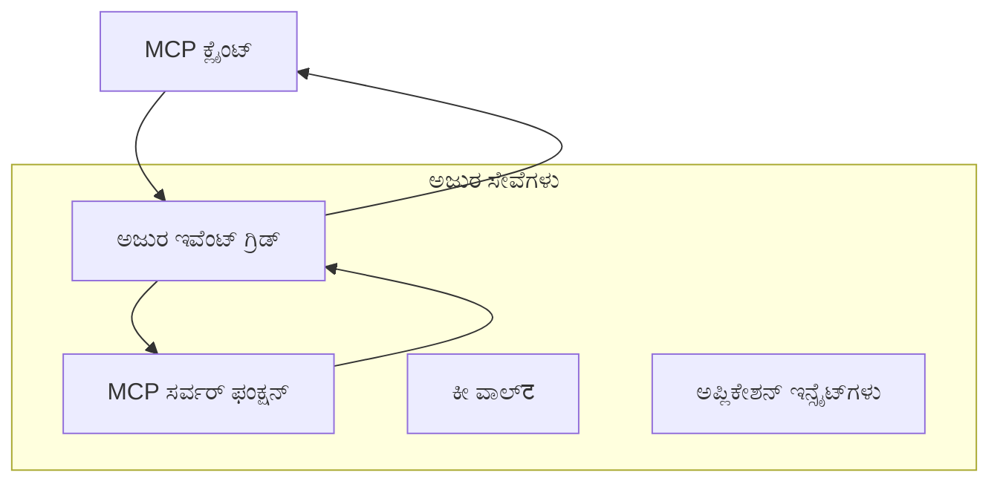
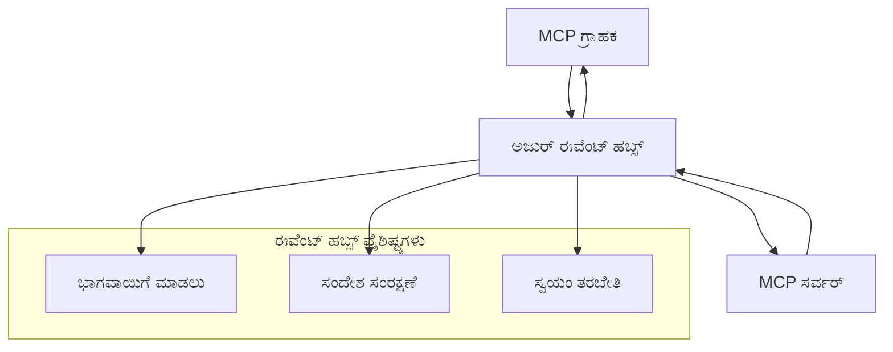

# MCP ಕಸ್ಟಮ್ ಟ್ರಾನ್ಸ್‌ಪೋರ್ಟ್‌ಗಳು - ಉನ್ನತ ಸುಧಾರಣಾ ಮಾರ್ಗದರ್ಶಿ

ಮಾದರಿ ಸನ್ನಿವೆದನೆ ಪ್ರೋಟೋಕಾಲ್ (MCP) ಟ್ರಾನ್ಸ್‌ಪೋರ್ಟ್ ಯಂತ್ರಾಂಗಗಳಲ್ಲಿ ಲವಚಿಕತೆ ಒದಗಿಸುತ್ತದೆ, ವಿಶೇಷ ಎಂಟರ್ಪ್ರೈಸ್ ಪರಿಸರಗಳಿಗೆ ಕಸ್ಟಮ್ ಅನುಷ್ಠಾನಗಳನ್ನು ಅನುಮತಿಸುತ್ತದೆ. ಈ ಉನ್ನತ ಮಾರ್ಗದರ್ಶಿ, ವ್ಯಾಪಾರ್ಯವಿಲ್ಲದ, ಕ್ಲೌಡ್-ಸ್ವದೇಶಿ MCP ಪರಿಹಾರಗಳನ್ನು ನಿರ್ಮಿಸಲು ಆಧುನಿಕ ಉದಾಹರಣೆಗಳಾಗಿ Azure ಈವೆಂಟ್ ಗ್ರಿಡ್ ಮತ್ತು Azure ಈವೆಂಟ್ ಹಬ್ಸ್ ಬಳಸಿ ಕಸ್ಟಮ್ ಟ್ರಾನ್ಸ್‌ಪೋರ್ಟ್ ಅನುಷ್ಠಾನಗಳನ್ನು ಅನ್ವೇಷಿಸುತ್ತದೆ.

> **ಮುಂದುವರೆಯುವಾಗ ಗಮನಿಸಿ:** ಈ ಮಾರ್ಗದರ್ಶಿ **MCP ಸ್ಪೆಸಿಫಿಕೇಶನ್ 2025-11-25** ಆಧಾರದ ಮೇಲೆ ಬರೆಯಲಾಗಿದೆ, ಇಲ್ಲಿ ಸೆಷನ್ ಆದೇಶವನ್ನು ಪ್ರತೀ ಸೆಷನ್ ಪ್ರಕಾರ ಉಳಿಸಬೇಕು (ಕೆಳಗಿನ ಮೆಸೇಜ್ ಪ್ರೋಟೋಕಾಲ್ ನೋಡಿ). `2026-07-28` ರಿಲೀಸ್ ಕ್ಯಾಂಡಿಡೇಟ್ ಪ್ರೋಟೋಕಾಲ್ ಮಟ್ಟದ ಸೆಷನ್ ಅನ್ನು ಸಂಪೂರ್ಣವಾಗಿ ತೆಗೆದುಹಾಕುತ್ತದೆ ಮತ್ತು ಗೇಟ್ವೇಗಳು ಮತ್ತು ಕಸ್ಟಮ್ ಟ್ರಾನ್ಸ್‌ಪೋರ್ಟ್‌ಗಳು ಆಯ್ಕೆ ಪ್ರತಿ-ಅರ್ಜಿಗೆ ಪಥ ನಿರ್ದಿಷ್ಟಗೊಳಿಸಲು `Mcp-Method`/`Mcp-Name` ಶೀರ್ಷಿಕೆಗಳಿಗೆ ಅಗತ್ಯವಿದೆ. ವಿವರಗಳಿಗೆ [MCP ಯಲ್ಲಿ ಏನು ಬದಲಾಗುತ್ತಿದೆ: 2026-07-28 ರಿಲೀಸ್ ಕ್ಯಾಂಡಿಡೇಟ್](../../01-CoreConcepts/mcp-2026-07-28-release-candidate.md) ನೋಡಿ.

## ಪರಿಚಯ

MCP ನ ಮಾನದಂಡ ಟ್ರಾನ್ಸ್‌ಪೋರ್ಟ್‌ಗಳು (stdio ಮತ್ತು HTTP ಸ್ಟ್ರೀಮಿಂಗ್) ಮುಂದಿನ ಬಹುತೆಕ ಬಳಕೆ ಪ್ರಕರಣಗಳಿಗೆ ಸೇವೆ ನೀಡಿದರೂ, ಎಂಟರ್ಪ್ರೈಸ್ ಪರಿಸರಗಳು ಹೆಚ್ಚಿಸಿದ ವಿಸ್ತಾರ, ನಿರ್ವಹಣೆ ಮತ್ತು ಇತರ ಕ್ಲೌಡ್ ಮೂಲಸೌಕರ್ಯಗಳ ಜೊತೆ ಸಂಯೋಜನೆಯಿಗಾಗಿ ವಿಶೇಷ ಟ್ರಾನ್ಸ್‌ಪೋರ್ಟ್ ಯಂತ್ರಾಂಗಗಳನ್ನು ನಿರೀಕ್ಷಿಸುತ್ತವೆ. ಕಸ್ಟಮ್ ಟ್ರಾನ್ಸ್‌ಪೋರ್ಟ್‌ಗಳು MCP ಗೆ ಅಸಿಂಕ್ರೋನಸ್ ಸಂವಹನ, ಈವೆಂಟ್ ಚಾಲಿತ ವಾಸ್ತುಶಿಲ್ಪ ಮತ್ತು ವಿತರಣಾ ಸಂಸ್ಕರಣೆಗೆ ಕ್ಲೌಡ್-ಸ್ವದೇಶಿ ಮೆಸೇಜಿಂಗ್ ಸೇವೆಗಳನ್ನು ಉಪಯೋಗಿಸಲು ಶಕ್ತಿಯನ್ನು ನೀಡುತ್ತವೆ.

ಈ ಪಾಠವು ಇತ್ತೀಚಿನ MCP ಸ್ಪೆಸಿಫಿಕೇಶನ್ (2025-11-25), Azure ಮೆಸೇಜಿಂಗ್ ಸೇವೆಗಳು ಮತ್ತು ಮೌಲ್ಯಯುಕ್ತ ಎಂಟರ್ಪ್ರೈಸ್ ಸಂಯೋಜನಾ ಮಾದರಿಗಳ ಆಧಾರದ ಮೇಲೆ ಉನ್ನತ ಟ್ರಾನ್ಸ್‌ಪೋರ್ಟ್ ಅನುಷ್ಠಾನಗಳನ್ನು ಅನ್ವೇಷಿಸುತ್ತದೆ.

### **MCP ಟ್ರಾನ್ಸ್‌ಪೋರ್ಟ್ ವಾಸ್ತುಶಿಲ್ಪ**

**MCP ಸ್ಪೆಸಿಫಿಕೇಶನ್ (2025-11-25) ಅಡಿಯಲ್ಲಿ:**

- **ಮಾನದಂಡ ಟ್ರಾನ್ಸ್‌ಪೋರ್ಟ್‌ಗಳು**: stdio (ಶಿಫಾರಸುಮಾಡಲಾಗಿದೆ), ರಿಮೋಟ್ ಸಂದರ್ಭದಲ್ಲಿ HTTP ಸ್ಟ್ರೀಮಿಂಗ್
- **ಕಸ್ಟಮ್ ಟ್ರಾನ್ಸ್‌ಪೋರ್ಟ್‌ಗಳು**: MCP ಮೆಸೇಜ್ ವಿನಿಮಯ ಪ್ರೋಟೋಕಾಲ್ ಅನ್ನು ಅನುಷ್ಠಾನಗೊಳ್ಳುವ ಯಾವುದೇ ಟ್ರಾನ್ಸ್‌ಪೋರ್ಟ್
- **ಮೆಸೇಜ್ ಸ್ವರೂಪ**: MCP-ನಿರ್ದಿಷ್ಟ ರೂಪಾಂತರಗಳೊಂದಿಗೆ JSON-RPC 2.0
- **ಎರಡು ದಿಕ್ಕಿನ ಸಂವಹನ**: ಅಧಿಸೂಚನೆ ಮತ್ತು ಪ್ರತಿಕ್ರಿಯೆಗಳಿಗಾಗಿ ಪೂರ್ಣ ಡುಪ್ಲೆಕ್ಸ್ ಸಂವಹನ ಅಗತ್ಯ

## ಕಲಿಕೆ ಗುರಿಗಳು

ಈ ಉನ್ನತ ಪಾಠದ ಅಂತ್ಯಕ್ಕೆ ನೀವು ಮಾಡಲು ಸಾಧ್ಯವಾಗುತ್ತದೆ:

- **ಕಸ್ಟಮ್ ಟ್ರಾನ್ಸ್‌ಪೋರ್ಟ್ ಅಗತ್ಯಗಳ ಅರಿವು**: MCP ಪ್ರೋಟೋಕಾಲ್ ಅನ್ನು ಯಾವುದೇ ಟ್ರಾನ್ಸ್‌ಪೋರ್ಟ್ ಲೇಯರ್ ಮೇಲೆ ಅನುಷ್ಠಾನಗೊಳಿಸಿ, ಅನುಕೂಲದೊಂದಿಗೆ
- **Azure ಈವೆಂಟ್ ಗ್ರಿಡ್ ಟ್ರಾನ್ಸ್‌ಪೋರ್ಟ್ ನಿರ್ಮಿಸಿ**: ಸರ್ವರ್‌ಲೆಸ್ ವಿಸ್ತಾರಕ್ಕಾಗಿ ಈವೆಂಟ್ ಚಾಲಿತ MCP ಸರ್ವರ್‌ಗಳನ್ನು ರಚಿಸಿ
- **Azure ಈವೆಂಟ್ ಹಬ್ಸ್ ಟ್ರಾನ್ಸ್‌ಪೋರ್ಟ್ ಅನುಷ್ಠಾನ ಮಾಡಿ**: ರಿಯಲ್-ಟೈಮ್ ಸ್ಟ್ರೀಮಿಂಗ್‌ಗಾಗಿ Azure ಈವೆಂಟ್ ಹಬ್ಸ್ ಬಳಸಿ ಉನ್ನತ ಬಳಕೆದಾರ MCP ಪರಿಹಾರಗಳನ್ನು ವಿನ್ಯಾಸಗೊಳಿಸಿ
- **ಎಂಟರ್ಪ್ರೈಸ್ ಮಾದರಿಗಳನ್ನು ಅನ್ವಯಿಸಿ**: ಮಾಡಲಾದ Azure ಮೂಲಸೌಕರ್ಯ ಮತ್ತು ಭದ್ರತಾ ಮಾದರಿಗಳೊಂದಿಗೆ ಕಸ್ಟಮ್ ಟ್ರಾನ್ಸ್‌ಪೋರ್ಟ್‌ಗಳನ್ನು ಸಂಯೋಜಿಸಿ
- **ಟ್ರಾನ್ಸ್‌ಪೋರ್ಟ್ ವಿಶ್ವಾಸಾರ್ಹತೆಯನ್ನು ನಿರ್ವಹಿಸಿ**: ಎಂಟರ್ಪ್ರೈಸ್ ಸಂದರ್ಭಗಳಿಗೆ ಮೆಸೇಜ್ ಸ್ಥಿರತೆ, ಆದೇಶ, ದೋಷ ನಿರ್ವಹಣೆ ಅನುಷ್ಠಾನಗೊಳಿಸಿ
- **ಕಾರ್ಯಕ್ಷಮತೆಯನ್ನು ಉತ್ತಮಗೊಳಿಸಿ**: ವಿಸ್ತರಣೆ, ವಿಳಂಬ ಮತ್ತು ಥ್ರೂಪುಟ್ ಅಗತ್ಯಗಳಿಗೆ ತಕ್ಕಂತೆ ಟ್ರಾನ್ಸ್‌ಪೋರ್ಟ್ ಪರಿಹಾರಗಳನ್ನು ವಿನ್ಯಾಸಗೊಳಿಸಿ

## **ಟ್ರಾನ್ಸ್‌ಪೋರ್ಟ್ ಅಗತ್ಯಗಳು**

### **MCP ಸ್ಪೆಸಿಫಿಕೇಶನ್ (2025-11-25) ನಿಂದ ಪ್ರಮುಖ ಅಗತ್ಯಗಳು:**

```yaml
Message Protocol:
  format: "JSON-RPC 2.0 with MCP extensions"
  bidirectional: "Full duplex communication required"
  ordering: "Message ordering must be preserved per session"
  
Transport Layer:
  reliability: "Transport MUST handle connection failures gracefully"
  security: "Transport MUST support secure communication"
  identification: "Each session MUST have unique identifier"
  
Custom Transport:
  compliance: "MUST implement complete MCP message exchange"
  extensibility: "MAY add transport-specific features"
  interoperability: "MUST maintain protocol compatibility"
```

## **Azure ಈವೆಂಟ್ ಗ್ರಿಡ್ ಟ್ರಾನ್ಸ್‌ಪೋರ್ಟ್ ಅನುಷ್ಠಾನ**

Azure ಈವೆಂಟ್ ಗ್ರಿಡ್ ಸರ್ವರ್‌ಲೆಸ್ ಈವೆന്റ് ನಿಯಂತ್ರಣ ಸೇವೆಯನ್ನು ಒದಗಿಸುತ್ತದೆ, ಇದು ಈವೆಂಟ್ ಚಾಲಿತ MCP ವಾಸ್ತುಶಿಲ್ಪಗಳಿಗೆ ಸೂಕ್ತವಾಗಿದೆ. ಈ ಅನುಷ್ಠಾನವು ವಿಸ್ತರಿಸಬಹುದಾದ, ಸ್ವಾತಂತ್ರ್ಯವಾಗಿ ಜೋಡಣೆ ಹೊಂದಿದ MCP ವ್ಯವಸ್ಥೆಗಳನ್ನು ಹೇಗೆ ನಿರ್ಮಿಸಲು ಎಂಬುದನ್ನು ತೋರಿಸುತ್ತದೆ.

### **ವಾಸ್ತುಶಿಲ್ಪ ಅವಲೋಕನ**



### **C# ಅನುಷ್ಠಾನ - ಈವೆಂಟ್ ಗ್ರಿಡ್ ಟ್ರಾನ್ಸ್‌ಪೋರ್ಟ್**

```csharp
using Azure.Messaging.EventGrid;
using Microsoft.Extensions.Azure;
using System.Text.Json;

public class EventGridMcpTransport : IMcpTransport
{
    private readonly EventGridPublisherClient _publisher;
    private readonly string _topicEndpoint;
    private readonly string _clientId;
    
    public EventGridMcpTransport(string topicEndpoint, string accessKey, string clientId)
    {
        _publisher = new EventGridPublisherClient(
            new Uri(topicEndpoint), 
            new AzureKeyCredential(accessKey));
        _topicEndpoint = topicEndpoint;
        _clientId = clientId;
    }
    
    public async Task SendMessageAsync(McpMessage message)
    {
        var eventGridEvent = new EventGridEvent(
            subject: $"mcp/{_clientId}",
            eventType: "MCP.MessageReceived",
            dataVersion: "1.0",
            data: JsonSerializer.Serialize(message))
        {
            Id = Guid.NewGuid().ToString(),
            EventTime = DateTimeOffset.UtcNow
        };
        
        await _publisher.SendEventAsync(eventGridEvent);
    }
    
    public async Task<McpMessage> ReceiveMessageAsync(CancellationToken cancellationToken)
    {
        // Event Grid is push-based, so implement webhook receiver
        // This would typically be handled by Azure Functions trigger
        throw new NotImplementedException("Use EventGridTrigger in Azure Functions");
    }
}

// Azure Function for receiving Event Grid events
[FunctionName("McpEventGridReceiver")]
public async Task<IActionResult> HandleEventGridMessage(
    [EventGridTrigger] EventGridEvent eventGridEvent,
    ILogger log)
{
    try
    {
        var mcpMessage = JsonSerializer.Deserialize<McpMessage>(
            eventGridEvent.Data.ToString());
        
        // Process MCP message
        var response = await _mcpServer.ProcessMessageAsync(mcpMessage);
        
        // Send response back via Event Grid
        await _transport.SendMessageAsync(response);
        
        return new OkResult();
    }
    catch (Exception ex)
    {
        log.LogError(ex, "Error processing Event Grid MCP message");
        return new BadRequestResult();
    }
}
```

### **TypeScript ಅನುಷ್ಠಾನ - ಈವೆಂಟ್ ಗ್ರಿಡ್ ಟ್ರಾನ್ಸ್‌ಪೋರ್ಟ್**

```typescript
import { EventGridPublisherClient, AzureKeyCredential } from "@azure/eventgrid";
import { McpTransport, McpMessage } from "./mcp-types";

export class EventGridMcpTransport implements McpTransport {
    private publisher: EventGridPublisherClient;
    private clientId: string;
    
    constructor(
        private topicEndpoint: string,
        private accessKey: string,
        clientId: string
    ) {
        this.publisher = new EventGridPublisherClient(
            topicEndpoint,
            new AzureKeyCredential(accessKey)
        );
        this.clientId = clientId;
    }
    
    async sendMessage(message: McpMessage): Promise<void> {
        const event = {
            id: crypto.randomUUID(),
            source: `mcp-client-${this.clientId}`,
            type: "MCP.MessageReceived",
            time: new Date(),
            data: message
        };
        
        await this.publisher.sendEvents([event]);
    }
    
    // ಇವೆಂಟ್ ಚಾಲಿತ ಸ್ವೀಕರಣವು ಅಜೂರ್ ಫಂಕ್ಷನ್‌ಗಳ ಮೂಲಕ
    onMessage(handler: (message: McpMessage) => Promise<void>): void {
        // ರೂಪಾಯಣೆಗೆ ಅಜೂರ್ ಫಂಕ್ಷನ್‌ಗಳ ಇವೆಂಟ್ ಗ್ರಿಡ್ ಟ್ರಿಗರ್ ಬಳಸಲಾಗುವುದು
        // ಇದು ವೆಬ್‌ಹುಕ್ ಸ್ವೀಕರಿಸುವಗಿನ ಸಂಯುಕ್ತ ಆಂತರ್ಫೇಸ್
    }
}

// ಅಜೂರ್ ಫಂಕ್ಷನ್‌ಗಳ ರೂಪಾಯಣೆ
import { app, InvocationContext, EventGridEvent } from "@azure/functions";

app.eventGrid("mcpEventGridHandler", {
    handler: async (event: EventGridEvent, context: InvocationContext) => {
        try {
            const mcpMessage = event.data as McpMessage;
            
            // MCP ಸಂದೇಶವನ್ನು ಪ್ರಕ್ರಿಯೆ ಮಾಡು
            const response = await mcpServer.processMessage(mcpMessage);
            
            // ಇವೆಂಟ್ ಗ್ರಿಡ್ ಮೂಲಕ ಪ್ರತಿಕ್ರಿಯೆಯನ್ನು ಕಳುಹಿಸು
            await transport.sendMessage(response);
            
        } catch (error) {
            context.error("Error processing MCP message:", error);
            throw error;
        }
    }
});
```

### **Python ಅನುಷ್ಠಾನ - ಈವೆಂಟ್ ಗ್ರಿಡ್ ಟ್ರಾನ್ಸ್‌ಪೋರ್ಟ್**

```python
from azure.eventgrid import EventGridPublisherClient, EventGridEvent
from azure.core.credentials import AzureKeyCredential
import asyncio
import json
from typing import Callable, Optional
import uuid
from datetime import datetime

class EventGridMcpTransport:
    def __init__(self, topic_endpoint: str, access_key: str, client_id: str):
        self.client = EventGridPublisherClient(
            topic_endpoint, 
            AzureKeyCredential(access_key)
        )
        self.client_id = client_id
        self.message_handler: Optional[Callable] = None
    
    async def send_message(self, message: dict) -> None:
        """Send MCP message via Event Grid"""
        event = EventGridEvent(
            data=message,
            subject=f"mcp/{self.client_id}",
            event_type="MCP.MessageReceived",
            data_version="1.0"
        )
        
        await self.client.send(event)
    
    def on_message(self, handler: Callable[[dict], None]) -> None:
        """Register message handler for incoming events"""
        self.message_handler = handler

# ಮಾಡಲ್ ಕಾರ್ಯಾಚರಣೆಗಳು
import azure.functions as func
import logging

def main(event: func.EventGridEvent) -> None:
    """Azure Functions Event Grid trigger for MCP messages"""
    try:
        # ಇವೆಂಟ್ ಗ್ರಿಡ್ ಘಟನೆಯಿಂದ MCP ಸಂದೇಶವನ್ನು ಪಾರ್ಸ್ ಮಾಡಿ
        mcp_message = json.loads(event.get_body().decode('utf-8'))
        
        # MCP ಸಂದೇಶವನ್ನು ಪ್ರಕ್ರಿಯೆಗೊಳಿಸಿ
        response = process_mcp_message(mcp_message)
        
        # ಇವೆಂಟ್ ಗ್ರಿಡ್ ಮೂಲಕ ಪ್ರತಿಕ್ರಿಯೆಯನ್ನು ಹಿಂಪಡೆಯಿರಿ
        # (ಅಮರ್ಪಣೆ ಹೊಸ ಇವೆಂಟ್ ಗ್ರಿಡ್ ಗ್ರಾಹಕನನ್ನು ಸೃಷ್ಟಿಸುವುದು)
        
    except Exception as e:
        logging.error(f"Error processing MCP Event Grid message: {e}")
        raise
```

## **Azure ಈವೆಂಟ್ ಹಬ್ಸ್ ಟ್ರಾನ್ಸ್‌ಪೋರ್ಟ್ ಅನುಷ್ಠಾನ**

Azure ಈವೆಂಟ್ ಹಬ್ಸ್ ಕಡಿಮೆ ವಿಳಂಬ ಮತ್ತು ಹೆಚ್ಚಿನ ಮೆಸೇಜ್ ಪ್ರಮಾಣವನ್ನು ಅವಶ್ಯಕಪಡಿಸುವ MCP ಸಂದರ್ಭಗಳಿಗೆ ಉನ್ನತ ಥ್ರೂಪುಟ್, ರಿಯಲ್-ಟೈಮ್ ಸ್ಟ್ರೀಮಿಂಗ್ ಸಾಮರ್ಥ್ಯಗಳನ್ನು ಒದಗಿಸುತ್ತದೆ.

### **ವಾಸ್ತುಶಿಲ್ಪ ಅವಲೋಕನ**



### **C# ಅನುಷ್ಠಾನ - ಈವೆಂಟ್ ಹಬ್ಸ್ ಟ್ರಾನ್ಸ್‌ಪೋರ್ಟ್**

```csharp
using Azure.Messaging.EventHubs;
using Azure.Messaging.EventHubs.Producer;
using Azure.Messaging.EventHubs.Consumer;
using System.Text;

public class EventHubsMcpTransport : IMcpTransport, IDisposable
{
    private readonly EventHubProducerClient _producer;
    private readonly EventHubConsumerClient _consumer;
    private readonly string _consumerGroup;
    private readonly CancellationTokenSource _cancellationTokenSource;
    
    public EventHubsMcpTransport(
        string connectionString, 
        string eventHubName,
        string consumerGroup = "$Default")
    {
        _producer = new EventHubProducerClient(connectionString, eventHubName);
        _consumer = new EventHubConsumerClient(
            consumerGroup, 
            connectionString, 
            eventHubName);
        _consumerGroup = consumerGroup;
        _cancellationTokenSource = new CancellationTokenSource();
    }
    
    public async Task SendMessageAsync(McpMessage message)
    {
        var messageBody = JsonSerializer.Serialize(message);
        var eventData = new EventData(Encoding.UTF8.GetBytes(messageBody));
        
        // Add MCP-specific properties
        eventData.Properties.Add("MessageType", message.Method ?? "response");
        eventData.Properties.Add("MessageId", message.Id);
        eventData.Properties.Add("Timestamp", DateTimeOffset.UtcNow);
        
        await _producer.SendAsync(new[] { eventData });
    }
    
    public async Task StartReceivingAsync(
        Func<McpMessage, Task> messageHandler)
    {
        await foreach (PartitionEvent partitionEvent in _consumer.ReadEventsAsync(
            _cancellationTokenSource.Token))
        {
            try
            {
                var messageBody = Encoding.UTF8.GetString(
                    partitionEvent.Data.EventBody.ToArray());
                var mcpMessage = JsonSerializer.Deserialize<McpMessage>(messageBody);
                
                await messageHandler(mcpMessage);
            }
            catch (Exception ex)
            {
                // Handle deserialization or processing errors
                Console.WriteLine($"Error processing message: {ex.Message}");
            }
        }
    }
    
    public void Dispose()
    {
        _cancellationTokenSource?.Cancel();
        _producer?.DisposeAsync().AsTask().Wait();
        _consumer?.DisposeAsync().AsTask().Wait();
        _cancellationTokenSource?.Dispose();
    }
}
```

### **TypeScript ಅನುಷ್ಠಾನ - ಈವೆಂಟ್ ಹಬ್ಸ್ ಟ್ರಾನ್ಸ್‌ಪೋರ್ಟ್**

```typescript
import { 
    EventHubProducerClient, 
    EventHubConsumerClient, 
    EventData 
} from "@azure/event-hubs";

export class EventHubsMcpTransport implements McpTransport {
    private producer: EventHubProducerClient;
    private consumer: EventHubConsumerClient;
    private isReceiving = false;
    
    constructor(
        private connectionString: string,
        private eventHubName: string,
        private consumerGroup: string = "$Default"
    ) {
        this.producer = new EventHubProducerClient(
            connectionString, 
            eventHubName
        );
        this.consumer = new EventHubConsumerClient(
            consumerGroup,
            connectionString,
            eventHubName
        );
    }
    
    async sendMessage(message: McpMessage): Promise<void> {
        const eventData: EventData = {
            body: JSON.stringify(message),
            properties: {
                messageType: message.method || "response",
                messageId: message.id,
                timestamp: new Date().toISOString()
            }
        };
        
        await this.producer.sendBatch([eventData]);
    }
    
    async startReceiving(
        messageHandler: (message: McpMessage) => Promise<void>
    ): Promise<void> {
        if (this.isReceiving) return;
        
        this.isReceiving = true;
        
        const subscription = this.consumer.subscribe({
            processEvents: async (events, context) => {
                for (const event of events) {
                    try {
                        const messageBody = event.body as string;
                        const mcpMessage: McpMessage = JSON.parse(messageBody);
                        
                        await messageHandler(mcpMessage);
                        
                        // ಕನಿಷ್ಠ-ಒಮ್ಮೆ ವಿತರಣೆಗೆ ಚೆಕ್ ಪಾಯಿಂಟ್ ನವೀಕರಿಸಿ
                        await context.updateCheckpoint(event);
                    } catch (error) {
                        console.error("Error processing Event Hubs message:", error);
                    }
                }
            },
            processError: async (err, context) => {
                console.error("Event Hubs error:", err);
            }
        });
    }
    
    async close(): Promise<void> {
        this.isReceiving = false;
        await this.producer.close();
        await this.consumer.close();
    }
}
```

### **Python ಅನುಷ್ಠಾನ - ಈವೆಂಟ್ ಹಬ್ಸ್ ಟ್ರಾನ್ಸ್‌ಪೋರ್ಟ್**

```python
from azure.eventhub import EventHubProducerClient, EventHubConsumerClient
from azure.eventhub import EventData
import json
import asyncio
from typing import Callable, Dict, Any
import logging

class EventHubsMcpTransport:
    def __init__(
        self, 
        connection_string: str, 
        eventhub_name: str,
        consumer_group: str = "$Default"
    ):
        self.producer = EventHubProducerClient.from_connection_string(
            connection_string, 
            eventhub_name=eventhub_name
        )
        self.consumer = EventHubConsumerClient.from_connection_string(
            connection_string,
            consumer_group=consumer_group,
            eventhub_name=eventhub_name
        )
        self.is_receiving = False
    
    async def send_message(self, message: Dict[str, Any]) -> None:
        """Send MCP message via Event Hubs"""
        event_data = EventData(json.dumps(message))
        
        # MCP-ನಿರ್ದಿಷ್ಟ ಗುಣಲಕ್ಷಣಗಳನ್ನು ಸೇರಿಸಿ
        event_data.properties = {
            "messageType": message.get("method", "response"),
            "messageId": message.get("id"),
            "timestamp": "2025-01-14T10:30:00Z"  # ನಿಜವಾದ ಸಮಯಮುದ್ರಣವನ್ನು ಬಳಸಿ
        }
        
        async with self.producer:
            event_data_batch = await self.producer.create_batch()
            event_data_batch.add(event_data)
            await self.producer.send_batch(event_data_batch)
    
    async def start_receiving(
        self, 
        message_handler: Callable[[Dict[str, Any]], None]
    ) -> None:
        """Start receiving MCP messages from Event Hubs"""
        if self.is_receiving:
            return
        
        self.is_receiving = True
        
        async with self.consumer:
            await self.consumer.receive(
                on_event=self._on_event_received(message_handler),
                starting_position="-1"  # ಆರಂಭದಿಂದ ಪ್ರಾರಂಭಿಸಿ
            )
    
    def _on_event_received(self, handler: Callable):
        """Internal event handler wrapper"""
        async def handle_event(partition_context, event):
            try:
                # ಇವೆಂಟ್ ಹಬ್ಸ್ ಇವೆಂಟ್‌ನಿಂದ MCP ಸಂದೇಶವನ್ನು ವಿಶ್ಲೇಷಿಸಿ
                message_body = event.body_as_str(encoding='UTF-8')
                mcp_message = json.loads(message_body)
                
                # MCP ಸಂದೇಶವನ್ನು ಪ್ರಕ್ರಿಯೆ ಮಾಡಿ
                await handler(mcp_message)
                
                # ಕನಿಷ್ಠ ಒಂದು ಬಾರಿ ವಿತರಣೆಗೆ ಚೆಕ್‌ಪಾಯಿಂಟ್ ಅನ್ನು ನವೀಕರಿಸಿ
                await partition_context.update_checkpoint(event)
                
            except Exception as e:
                logging.error(f"Error processing Event Hubs message: {e}")
        
        return handle_event
    
    async def close(self) -> None:
        """Clean up transport resources"""
        self.is_receiving = False
        await self.producer.close()
        await self.consumer.close()
```

## **ಉನ್ನತ ಟ್ರಾನ್ಸ್‌ಪೋರ್ಟ್ ಮಾದರಿಗಳು**

### **ಮೆಸೇಜ್ ಸ್ಥಿರತೆ ಮತ್ತು ವಿಶ್ವಾಸಾರ್ಹತೆ**

```csharp
// Implementing message durability with retry logic
public class ReliableTransportWrapper : IMcpTransport
{
    private readonly IMcpTransport _innerTransport;
    private readonly RetryPolicy _retryPolicy;
    
    public async Task SendMessageAsync(McpMessage message)
    {
        await _retryPolicy.ExecuteAsync(async () =>
        {
            try
            {
                await _innerTransport.SendMessageAsync(message);
            }
            catch (TransportException ex) when (ex.IsRetryable)
            {
                // Log and retry
                throw;
            }
        });
    }
}
```

### **ಟ್ರಾನ್ಸ್‌ಪೋರ್ಟ್ ಭದ್ರತಾ ಸಂಯೋಜನೆ**

```csharp
// Integrating Azure Key Vault for transport security
public class SecureTransportFactory
{
    private readonly SecretClient _keyVaultClient;
    
    public async Task<IMcpTransport> CreateEventGridTransportAsync()
    {
        var accessKey = await _keyVaultClient.GetSecretAsync("EventGridAccessKey");
        var topicEndpoint = await _keyVaultClient.GetSecretAsync("EventGridTopic");
        
        return new EventGridMcpTransport(
            topicEndpoint.Value.Value,
            accessKey.Value.Value,
            Environment.MachineName
        );
    }
}
```

### **ಟ್ರಾನ್ಸ್‌ಪೋರ್ಟ್ ಬಳಕೆಯ ಮಾನಿಟರಿಂಗ್ ಮತ್ತು ತೀಕ್ಷ್ಣತೆ**

```csharp
// Adding telemetry to custom transports
public class ObservableTransport : IMcpTransport
{
    private readonly IMcpTransport _transport;
    private readonly ILogger _logger;
    private readonly TelemetryClient _telemetryClient;
    
    public async Task SendMessageAsync(McpMessage message)
    {
        using var activity = Activity.StartActivity("MCP.Transport.Send");
        activity?.SetTag("transport.type", "EventGrid");
        activity?.SetTag("message.method", message.Method);
        
        var stopwatch = Stopwatch.StartNew();
        
        try
        {
            await _transport.SendMessageAsync(message);
            
            _telemetryClient.TrackDependency(
                "EventGrid",
                "SendMessage",
                DateTime.UtcNow.Subtract(stopwatch.Elapsed),
                stopwatch.Elapsed,
                true
            );
        }
        catch (Exception ex)
        {
            _telemetryClient.TrackException(ex);
            throw;
        }
    }
}
```

## **ಎಂಟರ್ಪ್ರೈಸ್ ಸಂಯೋಜನಾ ಸಂದರ್ಭಗಳು**

### **ಸಂದರ್ಭ 1: ವಿತರಿತ MCP ಸಂಸ್ಕರಣೆ**

MCP ಬರೆದಿರುವ ವಿನಂತಿಗಳನ್ನು ಅನೇಕ ಸಂಸ್ಕರಣಾ ನೇಡ್‌ಗಳಿಗೆ ವಿತರಿಸಲು Azure ಈವೆಂಟ್ ಗ್ರಿಡ್ ಬಳಕೆ:

```yaml
Architecture:
  - MCP Client sends requests to Event Grid topic
  - Multiple Azure Functions subscribe to process different tool types
  - Results aggregated and returned via separate response topic
  
Benefits:
  - Horizontal scaling based on message volume
  - Fault tolerance through redundant processors
  - Cost optimization with serverless compute
```

### **ಸಂದರ್ಭ 2: ರಿಯಲ್-ಟೈಮ್ MCP ಸ್ಟ್ರೀಮಿಂಗ್**

ಹೆಚ್ಚಿನ ಆವೃತ್ತಿಯ MCP ಪರಸ್ಪರ ಕ್ರಿಯೆಗಳಿಗೆ Azure ಈವೆಂಟ್ ಹಬ್ಸ್ ಬಳಕೆ:

```yaml
Architecture:
  - MCP Client streams continuous requests via Event Hubs
  - Stream Analytics processes and routes messages
  - Multiple consumers handle different aspect of processing
  
Benefits:
  - Low latency for real-time scenarios
  - High throughput for batch processing
  - Built-in partitioning for parallel processing
```

### **ಸಂದರ್ಭ 3: ಸಂಯುಕ್ತ ಟ್ರಾನ್ಸ್‌ಪೋರ್ಟ್ ವಾಸ್ತುಶಿಲ್ಪ**

ವಿವಿಧ ಬಳಕೆ ಪ್ರಕರಣಗಳಿಗೆ ಅನೇಕ ಟ್ರಾನ್ಸ್‌ಪೋರ್ಟ್‌ಗಳನ್ನು ಸಂಯೋಜಿಸುವುದು:

```csharp
public class HybridMcpTransport : IMcpTransport
{
    private readonly IMcpTransport _realtimeTransport; // Event Hubs
    private readonly IMcpTransport _batchTransport;    // Event Grid
    private readonly IMcpTransport _fallbackTransport; // HTTP Streaming
    
    public async Task SendMessageAsync(McpMessage message)
    {
        // Route based on message characteristics
        var transport = message.Method switch
        {
            "tools/call" when IsRealtime(message) => _realtimeTransport,
            "resources/read" when IsBatch(message) => _batchTransport,
            _ => _fallbackTransport
        };
        
        await transport.SendMessageAsync(message);
    }
}
```

## **ಕಾರ್ಯಕ್ಷಮತೆ ಉತ್ತಮಗೊಳಿಸುವಿಕೆ**

### **ಈವೆಂಟ್ ಗ್ರಿಡ್‌ಗಾಗಿ ಮೆಸೇಜ್ ಬ್ಯಾಚಿಂಗ್**

```csharp
public class BatchingEventGridTransport : IMcpTransport
{
    private readonly List<McpMessage> _messageBuffer = new();
    private readonly Timer _flushTimer;
    private const int MaxBatchSize = 100;
    
    public async Task SendMessageAsync(McpMessage message)
    {
        lock (_messageBuffer)
        {
            _messageBuffer.Add(message);
            
            if (_messageBuffer.Count >= MaxBatchSize)
            {
                _ = Task.Run(FlushMessages);
            }
        }
    }
    
    private async Task FlushMessages()
    {
        List<McpMessage> toSend;
        lock (_messageBuffer)
        {
            toSend = new List<McpMessage>(_messageBuffer);
            _messageBuffer.Clear();
        }
        
        if (toSend.Any())
        {
            var events = toSend.Select(CreateEventGridEvent);
            await _publisher.SendEventsAsync(events);
        }
    }
}
```

### **ಈವೆಂಟ್ ಹಬ್ಸ್‌ಗಾಗಿ ವಿಭಾಗೀಕರಣ ಕ್ರಮ**

```csharp
public class PartitionedEventHubsTransport : IMcpTransport
{
    public async Task SendMessageAsync(McpMessage message)
    {
        // Partition by client ID for session affinity
        var partitionKey = ExtractClientId(message);
        
        var eventData = new EventData(JsonSerializer.SerializeToUtf8Bytes(message))
        {
            PartitionKey = partitionKey
        };
        
        await _producer.SendAsync(new[] { eventData });
    }
}
```

## **ಕಸ್ಟಮ್ ಟ್ರಾನ್ಸ್‌ಪೋರ್ಟ್‌ಗಳ ಪರೀಕ್ಷೆ**

### **ಟೆಸ್ಟ್ ಡಬಲ್ಸ್ ಮೂಲಕ ಘಟಕ ಪರೀಕ್ಷೆ**

```csharp
[Test]
public async Task EventGridTransport_SendMessage_PublishesCorrectEvent()
{
    // Arrange
    var mockPublisher = new Mock<EventGridPublisherClient>();
    var transport = new EventGridMcpTransport(mockPublisher.Object);
    var message = new McpMessage { Method = "tools/list", Id = "test-123" };
    
    // Act
    await transport.SendMessageAsync(message);
    
    // Assert
    mockPublisher.Verify(
        x => x.SendEventAsync(
            It.Is<EventGridEvent>(e => 
                e.EventType == "MCP.MessageReceived" &&
                e.Subject == "mcp/test-client"
            )
        ),
        Times.Once
    );
}
```

### **Azure ಟೆಸ್ಟ್ ಕಂಟೈನರ್‌ಗಳೊಂದಿಗೆ ಸಂಯೋಜನಾ ಪರೀಕ್ಷೆ**

```csharp
[Test]
public async Task EventHubsTransport_IntegrationTest()
{
    // Using Testcontainers for integration testing
    var eventHubsContainer = new EventHubsContainer()
        .WithEventHub("test-hub");
    
    await eventHubsContainer.StartAsync();
    
    var transport = new EventHubsMcpTransport(
        eventHubsContainer.GetConnectionString(),
        "test-hub"
    );
    
    // Test message round-trip
    var sentMessage = new McpMessage { Method = "test", Id = "123" };
    McpMessage receivedMessage = null;
    
    await transport.StartReceivingAsync(msg => {
        receivedMessage = msg;
        return Task.CompletedTask;
    });
    
    await transport.SendMessageAsync(sentMessage);
    await Task.Delay(1000); // Allow for message processing
    
    Assert.That(receivedMessage?.Id, Is.EqualTo("123"));
}
```

## **ಉತ್ತಮ ಅಭ್ಯಾಸಗಳು ಮತ್ತು ಮಾರ್ಗಸೂಚಿ**

### **ಟ್ರಾನ್ಸ್‌ಪೋರ್ಟ್ ವಿನ್ಯಾಸ ಸಿದ್ಧಾಂತಗಳು**

1. **ಐಡಿಂಪೋಟೆನ್ಸಿ**: ಪ್ರತಿಮೂಲ್ಯಗಳ ನಿರ್ವಹಣೆಗೆ ಮೆಸೇಜ್ ಪ್ರಕ್ರಿಯೆಯನ್ನು ಐಡಿಂಪೋಟೆಂಟ್ ಆಗಿರಿಸಿ
2. **ದೋಷ ನಿರ್ವಹಣೆ**: ಸಮಗ್ರ ದೋಷ ನಿರ್ವಹಣೆ ಮತ್ತು ಡೆಡ್ ಲೆಟರ್ 큐ಗಳು ಅನುಷ್ಠಾನಗೊಳಿಸಿ
3. **ಮಾನದಂಡ ನಿರೀಕ್ಷಣೆ**: ವಿಶದ ಟೆಲಿಮೆಟ್ರಿ ಮತ್ತು ಆರೋಗ್ಯ ಪರಿಶೀಲನೆಗಳನ್ನು ಸೇರಿಸಿ
4. **ಭದ್ರತೆ**: ನಿರ್ವಹಿತ ಗುರುತುಗಳ ಮತ್ತು ಕನಿಷ್ಠ ಹಕ್ಕು ಪ್ರಾಪ್ತಿಯನ್ನು ಬಳಸಿ
5. **ಪ್ರದರ್ಶನ**: ನಿಮ್ಮ ವಿಶೇಷ ವಿಳಂಬ ಮತ್ತು ಥ್ರೂಪುಟ್ ಅಗತ್ಯಗಳಿಗೆ ವಿನ್ಯಾಸಗೊಳಿಸಿ

### **Azure-ನಿರ್ದಿಷ್ಟ ಶಿಫಾರಸುಗಳು**

1. **ನಿರ್ವಹಿತ ಗುರುತು ಬಳಸಿ**: ಉತ್ಪಾದನದಲ್ಲಿ ಸಂಪರ್ಕ ಸ್ಟ್ರಿಂಗ್‌ಗಳನ್ನು ತಪ್ಪಿಸಿ
2. **ಸರ್ಕ್ಯೂಟ್ ಬ್ರೇಕರ್‌ಗಳನ್ನು ಅನುಷ್ಠಾನಗೊಳಿಸಿ**: Azure ಸೇವೆಗಳ ಸ್ಥಗಿತಗಳಿಗೆ ವಿರುದ್ಧ ರಕ್ಷಿಸಿ
3. **ವೆಚ್ಚವನ್ನು ಗಮನಿಸಿ**: ಮೆಸೇಜ್ ಪ್ರಮಾಣ ಮತ್ತು ಪ್ರಕ್ರಿಯೆ ವೆಚ್ಚಗಳನ್ನು ನಿಗದಿಗೊಳಿಸಿ
4. **ವಿಸ್ತಾರಕ್ಕೆ ಯೋಜಿಸಿ**: ಆರಂಭದಲ್ಲಿ ವಿಭಾಗೀಕರಣ ಮತ್ತು ವಿಸ್ತರಣೆ ಕ್ರಮಗಳನ್ನು ವಿನ್ಯಾಸಗೊಳಿಸಿ
5. **ಪೂರ್ಣವಾಗಿ ಪರೀಕ್ಷಿಸಿ**: ವೆಚ್ಚಪರೀಕ್ಷೆಗೆ Azure DevTest ಲ್ಯಾಬ್‌ಗಳನ್ನು ಬಳಸಿ

## **ನಿರ್ಧಾರ**

ಕಸ್ಟಮ್ MCP ಟ್ರಾನ್ಸ್‌ಪೋರ್ಟ್‌ಗಳು Azure ಮೆಸೇಜಿಂಗ್ ಸೇವೆಗಳನ್ನು ಬಳಸಿ ಶಕ್ತಿಶಾಲಿ ಎಂಟರ್ಪ್ರೈಸ್ ಸಂದರ್ಭಗಳನ್ನು സാധ್ಯಪಡಿಸುತ್ತವೆ. ಈವೆಂಟ್ ಗ್ರಿಡ್ ಅಥವಾ ಈವೆಂಟ್ ಹಬ್ಸ್ ಟ್ರಾನ್ಸ್‌ಪೋರ್ಟ್‌ಗಳನ್ನು ಅನುಷ್ಠಾನಗೊಳಿಸುವ ಮೂಲಕ, ನೀವು ವಿಸ್ತರಿಸಬಹುದಾದ, ವಿಶ್ವಾಸಾರ್ಹ MCP ಪರಿಹಾರಗಳನ್ನು ನಿರ್ವಹಣೆючи Azure ಮೂಲಸೌಕರ್ಯಗಳೊಂದಿಗೆ ಹೊಂದಾಣಿಕೆ ಮಾಡಬಹುದು.

ನೀಡಲಾದ ಉದಾಹರಣೆಗಳು MCP ಪ್ರೋಟೋಕಾಲ್ ಅನುಕೂಲ ನಿಯಮ ಮತ್ತು Azure ಉತ್ತಮ ಅಭ್ಯಾಸಗಳನ್ನು ಉಳಿಸಿಕೊಂಡುಕೊಂಡು ಕಸ್ಟಮ್ ಟ್ರಾನ್ಸ್‌ಪೋರ್ಟ್‌ಗಳ ಉತ್ಪಾದನಾ ಸಿದ್ಧ ಮಾದರಿಗಳನ್ನು ತೋರಿಸುತ್ತವೆ.

## **ಅತिरिक्त ಸಂಪನ್ಮೂಲಗಳು**

- [MCP ಸ್ಪೆಸಿಫಿಕೇಶನ್ 2025-11-25](https://modelcontextprotocol.io/specification/2025-11-25/)
- [Azure ಈವೆಂಟ್ ಗ್ರಿಡ್ ಡಾಕ್ಯುಮೆಂಟೇಶನ್](https://docs.microsoft.com/azure/event-grid/)
- [Azure ಈವೆಂಟ್ ಹಬ್ಸ್ ಡಾಕ್ಯುಮೆಂಟೇಶನ್](https://docs.microsoft.com/azure/event-hubs/)
- [Azure ಫಂಕ್ಷನ್‌ಗಳು ಈವೆಂಟ್ ಗ್ರಿಡ್ ಟ್ರಿಗರ್](https://docs.microsoft.com/azure/azure-functions/functions-bindings-event-grid)
- [Azure SDK ನ .NET](https://github.com/Azure/azure-sdk-for-net)
- [Azure SDK TypeScript](https://github.com/Azure/azure-sdk-for-js)
- [Azure SDK Python](https://github.com/Azure/azure-sdk-for-python)

---

> *ಈ ಮಾರ್ಗದರ್ಶಿ MCP ಉತ್ಪಾದನಾ ವ್ಯವಸ್ಥೆಗಳ ಪ್ರಾಯೋಗಿಕ ಅನುಷ್ಠಾನ ಮಾದರಿಗಳ ಮೇಲೆ ಕೇಂದ್ರೀಕೃತವಾಗಿದೆ. ನಿಮ್ಮ ವಿಶೇಷ ಅಗತ್ಯಗಳು ಮತ್ತು Azure ಸೇವಾ ಮಿತಿ ಗಳ ವಿರುದ್ಧ ಟ್ರಾನ್ಸ್‌ಪೋರ್ಟ್ ಅನುಷ್ಠಾನಗಳನ್ನು ಸದಾ ಪರಿಶೀಲಿಸಿ.*
> **ಪ್ರಸ್ತುತ ಮಾನದಂಡ**: ಈ ಮಾರ್ಗದರ್ಶಿ [MCP ಸ್ಪೆಸಿಫಿಕೇಶನ್ 2025-11-25](https://modelcontextprotocol.io/specification/2025-11-25/) ಟ್ರಾನ್ಸ್‌ಪೋರ್ಟ್ ಅಗತ್ಯಗಳು ಮತ್ತು ಎಂಟರ್ಪ್ರೈಸ್ ಪರಿಸರಗಳಿಗೆ ಉನ್ನತ ಟ್ರಾನ್ಸ್‌ಪೋರ್ಟ್ ಮಾದರಿಗಳನ್ನು ಬಿಂಬಿಸುತ್ತದೆ.


## ಮುಂದೇನು
- [6. ಸಮುದಾಯ ಕೊಡುಗೆಗಳು](../../06-CommunityContributions/README.md)

---

<!-- CO-OP TRANSLATOR DISCLAIMER START -->
**ಅಸ್ವೀಕಾರ**:
ಈ ದಸ್ತಾವೇಜು AI ಅನುವಾದ ಸೇವೆ [Co-op Translator](https://github.com/Azure/co-op-translator) ಬಳಸಿ ಅನುವಾದಿಸಲಾಗಿದೆ. ನಾವು ನಿಖರತೆಯನ್ನು ಸಾಧಿಸಲು ಪ್ರಯತ್ನಿಸುತ್ತಿದ್ದರೂ, ದಯವಿಟ್ಟು ಗಮನಿಸಿ, ಸ್ವಯಂಚಾಲಿತ ಅನುವಾದಗಳಲ್ಲಿ ದೋಷಗಳು ಅಥವಾ ಅಸಡ್ಡೆಗಳು ಇರಬಹುದು. ಮೂಲ ಭಾಷೆಯಲ್ಲಿರುವ ಮೂಲ ದಸ್ತಾವೇಜು ಪ್ರಾಮಾಣಿಕ ಮೂಲವೆಂದು ಪರಿಗಣಿಸಬೇಕು. ಪ್ರಮುಖ ಮಾಹಿತಿಗಾಗಿ, ವೃತ್ತಿಪರ ಮಾನವ ಅನುವಾದವನ್ನು ಶಿಫಾರಸು ಮಾಡಲಾಗುತ್ತದೆ. ಈ ಅನುವಾದವನ್ನು ಬಳಸುವ ಮೂಲಕ ಉಂಟಾಗುವ ಯಾವುದೇ ತಪ್ಪು ಅರ್ಥಗಳ ಅಥವಾ ತಪ್ಪು ವ್ಯಾಖ್ಯಾನಗಳ ಬಗ್ಗೆ ನಾವು ಹೊಣೆಗಾರರಲ್ಲ.
<!-- CO-OP TRANSLATOR DISCLAIMER END -->