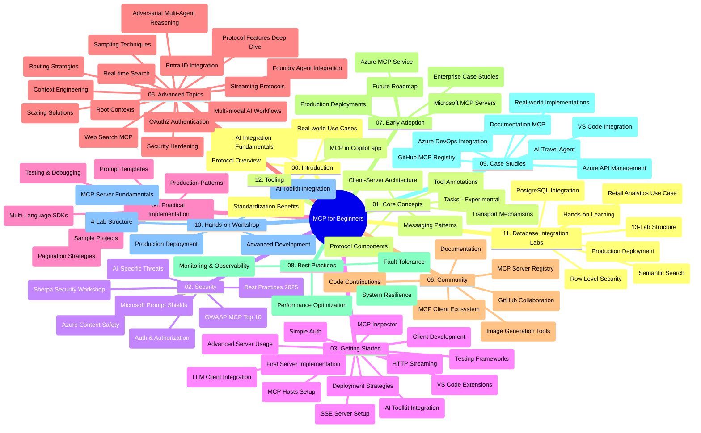

# ಆರಂಭಿಕರಿಗಾಗಿ ಮಾದರಿ ಪರಿಧಿ ಪ್ರೋಟೋಕಾಲ್ (MCP) - ಅಧ್ಯಯನ ಮಾರ್ಗದರ್ಶಿ

ಈ ಅಧ್ಯಯನ ಮಾರ್ಗದರ್ಶಿ "ಆರಂಭಿಕರಿಗಾಗಿ ಮಾದರಿ ಪರಿಧಿ ಪ್ರೋಟೋಕಾಲ್ (MCP)" ದೃಷ್ಟಿಕೋನೋಪವರ್ಧಿತರಿಗಾಗಿ ರೆಪೋಸಿಟರಿ ರಚನೆ ಮತ್ತು ವಿಷಯದ ಅವಲೋಕನವನ್ನು ನೀಡುತ್ತದೆ. ಈ ಮಾರ್ಗದರ್ಶಿಯನ್ನು ಬಳಸಿ ರೆಪೋಸಿಟರಿಯನ್ನು ಪರಿಣಾಮಕಾರಿಯಾಗಿ ನ್ಯಾವಿಗೇಟ್ ಮಾಡಿ ಮತ್ತು ಲಭ್ಯವಿರುವ ಸಂಪನ್ಮೂಲಗಳನ್ನು ಹೆಚ್ಚಿನ ಪರಿಣಾಮಕಾರಿತ್ವದಲ್ಲಿ ಬಳಸಿ.

## ರೆಪೋಸಿಟರಿ ಅವಲೋಕನ

ಮಾದರಿ ಪರಿಧಿ ಪ್ರೋಟೋಕಾಲ್ (MCP) AI ಮಾದರಿಗಳ ಮತ್ತು ಕ್ಲೈಂಟ್ ಅಪ್ಲಿಕೇಶನ್ಗಳ ನಡುವಿನ ಸಂವಾದಗಳಗಾಗಿ ಒಂದು ಮಾನಕೃತ ಚಟುವಟಿಕೆ ಚಟುವಟಿಕೆ ಸಿದ್ಧತೆಯಾಗಿದೆ. ಆರಂಭದಲ್ಲಿ Anthropic ರವರಿಂದ ರಚಿತಗೊಂಡ MCP ಈಗ ಅಧಿಕೃತ GitHub ಸಂಘಟನೆಯ ಮೂಲಕ MCP ಸಮುದಾಯದಿಂದ ನಿರ್ವಹಿಸಲಾಗಿದೆ. ಈ ರೆಪೋಸಿಟರಿ C#, Java, JavaScript, Python ಮತ್ತು TypeScript ನಲ್ಲಿ ನೈಪुण್ಯಪೂರ್ಣ ಕೋಡ್ ಉದಾಹರಣೆಗಳುಳ್ಳ ಸಂಪೂರ್ಣ ಪಾಠಕ್ರಮವನ್ನು ಒದಗಿಸುತ್ತದೆ, AI ಅಭಿವೃದ್ಧಿಪಡಿಸುವವರು, ವ್ಯವಸ್ಥಾ ವಿನ್ಯಾಸಕಾರರು ಮತ್ತು ಸಾಫ್ಟ್‌ವೇರ್ ಇಂಜಿನಿಯರ್‌ಗಳಿಗೆ ರೂಪಿಸಲಾಗಿದೆ.

## ದೃಶ್ಯ ಪಾಠಕ್ರಮ ನಕ್ಷೆ

## ರೆಪೋಸಿಟರಿ ರಚನೆ

ರೆಪೋಸಿಟರಿ ಹನ್ನೆರಡು ಪ್ರಮುಖ ವಿಭಾಗಗಳಿಗೆ ವಿಂಗಡಿತವಾಗಿದೆ, ಪ್ರತಿಯೊಂದು MCP ಯ ವಿಭಿನ್ನ ಅಂಶಗಳ ಮೇಲೆ ಕೇಂದ್ರೀಕೃತವಾಗಿದೆ:

1. **ಪರಿಚಯ (00-Introduction/)**
   - ಮಾದರಿ ಪರಿಧಿ ಪ್ರೋಟೋಕಾಲ್‌ನ ಅವಲೋಕನ
   - AI ಪೈಪ್ಲೈನ್ಗಳಲ್ಲಿ ಮಾನಕೊೃತಿ ಏಕೆ ಪ್ರಮುಖವಾಗಿದೆ
   - ಪ್ರಾಯೋಗಿಕ ಬಳಕೆ ಮತ್ತು ಲಾಭಗಳು

2. **ಮೂಲ ತತ್ವಗಳು (01-CoreConcepts/)**
   - ಕ್ಲೈಂಟ್-ಸರ್ವರ್ ವಾಸ್ತುಶಿಲ್ಪ
   - ಪ್ರಮುಖ ಪ್ರೋಟೋಕಾಲ್ ಘಟಕಗಳು
   - MCP ಯ ಸಂದೇಶ ವಿನ್ಯಾಸಗಳು
   - ಮುಂದಿನ ದೃಷ್ಟಿಗೆ: [MCP ನಲ್ಲಿ ಏನೇನಾಗುತ್ತಿದೆ: 2026-07-28 ಬಿಡುಗಡೆ ಅಭ್ಯರ್ಥಿ](./01-CoreConcepts/mcp-2026-07-28-release-candidate.md) — ಸ್ಥಿತಿಸ್ಥಾಪಕವಲ್ಲದ ಪ್ರೋಟೋಕಾಲ್ ಕೋರ್, ವಿಸ್ತರಣೆಗಳ ಚಟುವಟಿಕೆ, ಮತ್ತು Roots/Sampling/Logging ನಿಷೇಧಗಳು ಮುಂದಿನ ವಿಶೇಷಣ ಆವೃತ್ತಿಯಲ್ಲಿ ನಿರೀಕ್ಷಿತವಾಗಿವೆ

3. **ಸುರಕ್ಷತೆ (02-Security/)**
   - MCP ಆಧಾರಿತ ವ್ಯವಸ್ಥೆಗಳಲ್ಲಿ ಸುರಕ್ಷತಾ ಅಪಾಯಗಳು
   - ಅನುಷ್ಠಾನಗಳನ್ನು ಸುರಕ್ಷಿತಗೊಳಿಸುವ ಉತ್ತಮ ಅಭ್ಯಾಸಗಳು
   - ಪ್ರಾಮಾಣೀಕರಣ ಮತ್ತು ಪ್ರಾಧಿಕರಣ ತಂತ್ರಗಳು
   - **ವಿಸ್ತೃತ ಸುರಕ್ಷತಾ ಡಾಕ್ಯುಮೆಂಟೇಶನ್**:
     - MCP ಸುರಕ್ಷತಾ ಉತ್ತಮ ಅಭ್ಯಾಸಗಳು 2025
     - ಅಜೂರ್ ವಿಷಯ ಸುರಕ್ಷತೆ ಅನುಷ್ಠಾನ ಮಾರ್ಗದರ್ಶಿ
     - MCP ಸುರಕ್ಷತಾ ನಿಯಂತ್ರಣಗಳು ಮತ್ತು ತಂತ್ರಗಳು
     - MCP ಉತ್ತಮ ಅಭ್ಯಾಸಗಳು ತ್ವರಿತ ಉಲ್ಲೇಖ
   - **ಪ್ರಮುಖ ಸುರಕ್ಷತಾ ವಿಷಯಗಳು**:
     - ಪ್ರಾಂಪ್ಟ್ ಇಂಜೆಕ್ಷನ್ ಮತ್ತು ಸಾಧನ ವಿಷಕಾರಕ ದಾಳಿಗಳು
     - ಸೆಷನ್ ಹೈಜಾಕ್ ಮತ್ತು ಗೊಂದಲಕ್ಕೊಳಗಿನ ಡೆಪ್ಯೂಟಿ ಸಮಸ್ಯೆಗಳು
     - ಟೋಕನ್ ಪಾಸ್ತ್ರೂ ಬ್ಯಾಕ್ ದುರ್ಬಲತೆಗಳು
     - ಅತಿರೇಕ ಅನುಮತಿಗಳು ಮತ್ತು ಪ್ರವೇಶ ನಿಯಂತ್ರಣ
     - AI ಘಟಕಗಳ ಸರಬರಾಜು ಸರಪಳಿಯ ಸುರಕ್ಷತೆ
     - ಮೈಕ್ರೋಸಾಫ್ಟ್ ಪ್ರಾಂಪ್ಟ್ ಶೀಲ್ಡ್‌ಗಳ ಏಕೆಪಡುವಿಕೆ

4. **ಆರಂಭಿಸುವಿಕೆ (03-GettingStarted/)**
   - ಪರಿಸರ ಸಜ್ಜುಗೊಳಿಕೆ ಮತ್ತು ಸಂರಚನೆ
   - ಮೂಲ MCP ಸರ್ವರ್ ಮತ್ತು ಕ್ಲೈಂಟ್ ರಚನೆ
   - ಇತರೆ ಅಪ್ಲಿಕೇಶನ್‌ಗಳೊಂದಿಗೆ ಸಂಯೋಜನೆ
   - ವಿಭಾಗಗಳನ್ನು ಒಳಗೊಂಡಿದೆ:
     - ಮೊದಲ ಸರ್ವರ್ ಅನುಷ್ಠಾನ
     - ಕ್ಲೈಂಟ್ ಅಭಿವೃದ್ಧಿ
     - LLM ಕ್ಲೈಂಟ್ ಸಂಯೋಜನೆ
     - VS ಕೋಡ್ ಸಂಯೋಜನೆ
     - ಸರ್ವರ್-ಸೆಂಟ್ ಇವೆಂಟ್ಸ್ (SSE) ಸರ್ವರ್
     - ಪ್ರಗತಿಶೀಲ ಸರ್ವರ್ ಬಳಕೆ
     - HTTP ಸ್ಟ್ರೀಮಿಂಗ್
     - AI ಉಪಕರಣ ಸಂಯೋಜನೆ
     - ಪರೀಕ್ಷಾ ತಂತ್ರಗಳು
     - ನಿಯೋಜನೆ ಮಾರ್ಗಸೂಚಿಗಳು

5. **ಪ್ರಾಯೋಗಿಕ ಅನುಷ್ಠಾನ (04-PracticalImplementation/)**
   - ವಿವಿಧ ಪ್ರೋಗ್ರಾಮಿಂಗ್ ಭಾಷೆಗಳಲ್ಲಿನ SDK ಗಳ ಬಳಕೆ
   - ಡಿಬಗ್ಗಿಂಗ್, ಪರೀಕ್ಷೆ, ಮತ್ತು ಪರಿಶೋಧನಾ ತಂತ್ರಗಳು
   - ಮರುಬಳಕೆ ಮಾಡಬಹುದಾದ ಪ್ರಾಂಪ್ಟ್ ಟೆಂಪ್ಲೇಟ್ಸ್ ಮತ್ತು ಕೆಲಸಪ್ರವಾಹಗಳನ್ನು ರಚನೆ
   - ಅನುಷ್ಠಾನ ಉದಾಹರಣೆಗಳ ಸಹಿತ ಮಾದರಿ ಯೋಜನೆಗಳು

6. **ಅಗತ್ಯ ವಿಷಯಗಳು (05-AdvancedTopics/)**
   - ಪರಿಧಿ ಎಂಜಿನಿಯರಿಂಗ್ ತಂತ್ರಗಳು
   - ಫೌಂಡ್ರಿ ಏಜೆಂಟ್ ಸಂಯೋಜನೆ
   - ಬಹು-ಮಾದರಿ AI ಕೆಲಸಪ್ರವಾಹಗಳು
   - OAuth2 ಪ್ರಾಮಾಣೀಕರಣ ಪ್ರದರ್ಶನಗಳು
   - ರಿಯಲ್-ಟೈಮ್ ಹುಡುಕು ಸಾಮರ್ಥ್ಯಗಳು
   - ರಿಯಲ್-ಟೈಮ್ ಸ್ಟ್ರೀಮಿಂಗ್
   - ರೂಟ್ ಪರಿಧಿಗಳು ಅನುಷ್ಠಾನ
   - ಮಾರ್ಗದರ್ಶನ ತಂತ್ರಗಳು
   - ಮಾದರಿ ಸ್ಯಾಂಪ್ಲಿಂಗ್ ತಂತ್ರಗಳು
   - ವಿಸ್ತರಣೆ ವಿಧಾನಗಳು
   - ಸುರಕ್ಷತಾ ಪರಿಗಣನೆಗಳು
   - ಎಂಟ್ರಾ ID ಸುರಕ್ಷತಾ ಸಂಯೋಜನೆ
   - ವೆಬ್ ಹುಡುಕು ಸಂಯೋಜನೆ
   - ಪ್ರತಿಕೂಲ ಬಹು-ಏಜೆಂಟ್ ತರ್ಕ (ಚರ್ಚೆ ಮಾದರಿಗಳು)

7. **ಸಮುದಾಯ ಕೊಡುಗೆಗಳು (06-CommunityContributions/)**
   - ಕೋಡ್ ಮತ್ತು ಡಾಕ್ಯುಮೆಂಟೇಶನ್ ನೀಡುವ ವಿಧಾನಗಳು
   - GitHub ಮೂಲಕ ಸಹಕರಿಸುವಿಕೆ
   - ಸಮುದಾಯ ಚಾಲಿತ ಸುಧಾರಣೆಗಳು ಮತ್ತು ಪ್ರತಿಕ್ರಿಯೆಗಳು
   - ವಿವಿಧ MCP ಕ್ಲೈಂಟುಗಳ (Claude ಡೆಸ್ಕ್‌ಟಾಪ್, Cline, VSCode) ಬಳಕೆ
   - জনপ্রಿಯ MCP ಸರ್ವರ್‌ಗಳೊಂದಿಗೆ ಕೆಲಸ ಮಾಡುವಿಕೆ ಇಮೇಜ್ ಉತ್ಪಾದನೆ ಸೇರಿದಂತೆ

8. **ಆರಂಭಿಕ ಅನುಮೋದನೆ ಪಾಠಗಳು (07-LessonsfromEarlyAdoption/)**
   - ನೈಜ ಜಗತ್ತಿನ ಅನುಷ್ಠಾನ ಮತ್ತು ಯಶಸ್ಸಿನ ಕಥೆಗಳು
   - MCP ಆಧಾರಿತ ಪರಿಹಾರಗಳನ್ನು ನಿರ್ಮಿಸುವಿಕೆ ಮತ್ತು ನಿಯೋಜಿಸುವಿಕೆ
   - ಪ್ರವೃತ್ತಿಗಳು ಮತ್ತು ಭವಿಷ್ಯ ಪಥಸೂಚಿ
   - **Microsoft MCP ಸರ್ವರ್ ಮಾರ್ಗದರ್ಶಿ**: 10 ಉತ್ಪಾದನಾ-ಸಿದ್ಧ Microsoft MCP ಸರ್ವರ್‌ಗಳ ಸಮಗ್ರ ಮಾರ್ಗದರ್ಶಿ ಇವುಗಳೊಂದಿಗೆ:
     - Microsoft Learn Docs MCP ಸರ್ವರ್
     - Azure MCP ಸರ್ವರ್ (15+ ವಿಶಿಷ್ಟ ಕನೆಕ್ಟರ್‌ಗಳು)
     - GitHub MCP ಸರ್ವರ್
     - Azure DevOps MCP ಸರ್ವರ್
     - MarkItDown MCP ಸರ್ವರ್
     - SQL ಸರ್ವರ್ MCP ಸರ್ವರ್
     - Playwright MCP ಸರ್ವರ್
     - Dev Box MCP ಸರ್ವರ್
     - Microsoft Foundry MCP ಸರ್ವರ್
     - Microsoft 365 ಏಜೆಂಟ್ಸ್ ಟೂಲ್‌ಕಿಟ್ MCP ಸರ್ವರ್

9. **ಉತ್ತಮ ಅಭ್ಯಾಸಗಳು (08-BestPractices/)**
   - ಕಾರ್ಯಕ್ಷಮತೆ ಸMash್‍ಟಿ ಮತ್ತು ಸುಧಾರಣೆ
   - ತಪ್ಪು ತಡೆಗಟ್ಟುವ MCP ವ್ಯವಸ್ಥೆಗಳ ವಿನ್ಯಾಸ
   - ಪರೀಕ್ಷೆ ಮತ್ತು ಪ್ರತಿರೂಪಣ ತಂತ್ರಗಳು

10. **ಕೇಸ್ ಅಧ್ಯಯನಗಳು (09-CaseStudy/)**
    - **ಏಳನ್ನು ಸಮಗ್ರ ಕೇಸ್ ಅಧ್ಯಯನಗಳು** ವಿವಿಧ ಸ್ಥಿತಿಗಳಲ್ಲಿ MCP ವಿವಿಧತೆ ಪ್ರದರ್ಶಿಸುವವು:
    - **ಅಜೂರ್ AI ಪ್ರಯಾಣ ಏಜೆಂಟ್‌ಗಳು**: ಅಜೂರ್ OpenAI ಮತ್ತು AI ಹುಡುಕಾಟದೊಂದಿಗೆ ಬಹು-ಏಜೆಂಟ್ ಸಂಯೋಜನೆ
    - **ಅಜೂರ್ ಡೆವ್‌ಆಪ್ಸ್ ಸಂಯೋಜನೆ**: YouTube ಡೇಟಾ ನವೀಕರಣಗಳೊಂದಿಗೆ ಕೆಲಸಪ್ರವಾಹದ ಸ್ವಯಂಚಾಲಿತಗೊಳಿಸುವಿಕೆ
    - **ರಿಯಲ್-ಟೈಮ್ ಡಾಕ್ಯುಮೆಂಟೇಶನ್ ಹಿಂತೆಗೆದುಕೊಳ್ಳುವುದು**: Python ಕಂಸೋಲ್ ಕ್ಲೈಂಟ್ HTTP ಸ್ಟ್ರೀಮಿಂಗ್ ಜೊತೆಗೆ
    - **ಸಂವಾದಾತ್ಮಕ ಅಧ್ಯಯನ ಯೋಜನೆ ರಚನೆ**: Chainlit ವೆಬ್ ಅಪ್ಲಿಕೇಶನ್ ಮಾತನಾಡುವ AI ಜೊತೆಗೆ
    - **ಎಡಿಟರ್ ಒಳಗಿನ ಡಾಕ್ಯುಮೆಂಟೇಶನ್**: VS ಕೋಡ್ ಸಂಯೋಜನೆ GitHub Copilot ಕೆಲಸಪ್ರವಾಹಗಳೊಂದಿಗೆ
    - **ಅಜೂರ್ API ನಿರ್ವಹಣೆ**: ಸಂಸ್ಥೆಯ API ಸಂಯೋಜನೆ MCP ಸರ್ವರ್ ರಚನೆಯೊಂದಿಗೆ
    - **GitHub MCP ರೆಜಿಸ್ಟ್ರೀ**: ಪರಿಸರ ಅಭಿವೃದ್ಧಿ ಮತ್ತು ಏಜೆಂಟಿಕ್ ಸಂಯೋಜನಾ ವೇದಿಕೆ
    - ಸಂಸ್ಥೆಯ ಸಂಯೋಜನೆ, ಅಭಿವೃದ್ಧಿಪಡಿಸುವವರ ಉತ್ಪಾದಕತೆ ಮತ್ತು ಪರಿಸರ ಅಭಿವೃದ್ಧಿ ವ್ಯಾಪ್ತಿಯ ಅನುಷ್ಠಾನ ಉದಾಹರಣೆಗಳು

11. **ಹ್ಯಾಂಡ್‌ಸ್-ಆನ್ ಕಾರ್ಯಾಗಾರ (10-StreamliningAIWorkflowsBuildingAnMCPServerWithAIToolkit/)**
    - MCP ಮತ್ತು AI ಉಪಕರಣಗಳ ಕಲಿತಕಿ ಕಾರ್ಯಾಗಾರ ಸಂಯೋಜನೆ
    - ನೈಜ ಜಗತ್ತಿನ ಸಾಧನಗಳೊಂದಿಗೆ AI ಮಾದರಿಗಳನ್ನು ಸೇರುವ ಎಐ ಅಪ್ಲಿಕೇಶನ್‌ಗಳು ನಿರ್ಮಿಸುವಿಕೆ
    - ಮೂಲಭೂತ ಖಂಡಗಳು, ಕಸ್ಟಮ್ ಸರ್ವರ್ ಅಭಿವೃದ್ಧಿ ಮತ್ತು ಉತ್ಪಾದನಾ ನಿಯೋಜನೆ ತಂತ್ರಗಳನ್ನು ಒಳಗೊಂಡ ಪ್ರಾಯೋಗಿಕ ಘಟಕಗಳು
    - **ಲ್ಯಾಬ್ ರಚನೆ**:
      - ಲ್ಯಾಬ್ 1: MCP ಸರ್ವರ್ ಮೂಲತತ್ವಗಳು
      - ಲ್ಯಾಬ್ 2: ಸುಧಾರಿತ MCP ಸರ್ವರ್ ಅಭಿವೃದ್ಧಿ
      - ಲ್ಯಾಬ್ 3: AI ಉಪಕರಣ ಸಂಯೋಜನೆ
      - ಲ್ಯಾಬ್ 4: ಉತ್ಪಾದನಾ ನಿಯೋಜನೆ ಮತ್ತು ವಿಸ್ತರಣೆ
    - ಹಂತಹಂತವಾಗಿ ಸೂಚನೆಗಳೊಂದಿಗೆ ಲ್ಯಾಬ್ ಆಧಾರಿತ ಅಧ್ಯಯನ ವಿಧಾನ

12. **MCP ಸರ್ವರ್ ಡೇಟಾಬೇಸ್ ಸಂಯೋಜನೆ ಲ್ಯಾಬ್‌ಗಳು (11-MCPServerHandsOnLabs/)**
    - ಉತ್ಪಾದನಾ-ಸಿದ್ಧ MCP ಸರ್ವರ್‌ಗಳ PostgreSQL ಸಂಯೋಜನೆಯೊಂದಿಗೆ ಸಮಗ್ರ 13-ಲ್ಯಾಬ್ ಕಲಿಕೆಯ ಮಾರ್ಗ
    - ಜಾವಾ ರಿಟೇಲ್ ಉಪಯೋಗದ ಮೂಲಕ ನೈಜ ಜಗತ್ತಿನ ಚಿಲ್ಲರೆ ವಿಶ್ಲೇಷಣೆಯ ಅನುಷ್ಠಾನ
    - ಸಂಸ್ಥೆಯ ಮಟ್ಟದ ಮಾದರಿಗಳು, ಸಾಲಿನ ಮಟ್ಟದ ಸುರಕ್ಷತೆ (RLS), ಅರ್ಥಪೂರ್ಣ ಹುಡುಕು ಮತ್ತು ಬಹು-ಟೆನಂಟ್ ಡೇಟಾ ಪ್ರವೇಶ ಸೇರಿವೆ
    - **ಪೂರ್ಣ ಲ್ಯಾಬ್ ರಚನೆ**:
      - **ಲ್ಯಾಬ್‌ಗಳು 00-03: ಆಧಾರಗಳು** - ಪರಿಚಯ, ವಾಸ್ತುಶಿಲ್ಪ, ಸುರಕ್ಷತೆ, ಪರಿಸರ ಸಜ್ಜುಗೊಳಿಕೆ
      - **ಲ್ಯಾಬ್‌ಗಳು 04-06: MCP ಸರ್ವರ್ ನಿರ್ಮಾಣ** - ಡೇಟಾಬೇಸ್ ವಿನ್ಯಾಸ, MCP ಸರ್ವರ್ ಅನುಷ್ಠಾನ, ಸಾಧನಾಭಿವೃದ್ಧಿ
      - **ಲ್ಯಾಬ್‌ಗಳು 07-09: ಸುಧಾರಿತ ವೈಶಿಷ್ಟ್ಯಗಳು** - ಅರ್ಥಪೂರ್ಣ ಹುಡುಕು, ಪರೀಕ್ಷೆ ಮತ್ತು ಡಿಬಗ್ಗಿಂಗ್, VS ಕೋಡ್ ಸಂಯೋಜನೆ
      - **ಲ್ಯಾಬ್‌ಗಳು 10-12: ಉತ್ಪಾದನೆ ಮತ್ತು ಉತ್ತಮ ಅಭ್ಯಾಸಗಳು** - ನಿಯೋಜನೆ, ಗಮನವಾಣಿ, ಸುಧಾರಣೆ
    - **ಸಂವಹನ ತಂತ್ರಜ್ಞಾನಗಳು**: FastMCP ಫ್ರೇಮ್ವರ್ಕ್, PostgreSQL, ಅಜೂರ್ OpenAI, ಅಜೂರ್ ಕಂಟೈನರ್ ಅಪ್ಸ್, ಅಪ್ಲಿಕೇಶನ್ ಇನ್ಸೈಟ್ಸ್
    - **ಕಲಿಕೆಯ ಫಲಿತಾಂಶಗಳು**: ಉತ್ಪಾದನಾ-ಸಿದ್ಧ MCP ಸರ್ವರ್‌ಗಳು, ಡೇಟಾಬೇಸ್ ಸಂಯೋಜನೆ ಮಾದರಿಗಳು, AI ಚಾಲಿತ ವಿಶ್ಲೇಷಣೆಗಳು, ಸಂಸ್ಥೆಯ ಸುರಕ್ಷತೆ

13. **ಉಪಕರಣಗಳು (12-tooling/)**
    - MCP ಅನ್ನು Copilot ಅಪ್ಲಿಕೇಶನ್ ಮತ್ತು ಇತರ ಉಪಕರಣಗಳಲ್ಲಿ ಹೇಗೆ ಬಳಸುವುದು ಕಲಿಯಿರಿ

## ಹೆಚ್ಚುವರಿ ಸಂಪನ್ಮೂಲಗಳು

ರೆಪೋಸಿಟರಿ ಪೂರಕ ಸಂಪನ್ಮೂಲಗಳನ್ನು ಒಳಗೊಂಡಿದೆ:

- **ಚಿತ್ರಗಳು ಫೋಲ್ಡರ್**: ಪಾಠಕ್ರಮದ ಅಂಗವಾಗಿ ಬಳಕೆಯಲ್ಲಿರುವ ಚಿತ್ರರೂಪಗಳು ಮತ್ತು ಚಿತ್ರಣಗಳು
- **ಭಾಷಾಂತರಗಳು**: ಸಾಕ್ಷರತಾ ಡಾಕ್ಯುಮೆಂಟ್‌ಗಳ ಸ್ವಯಂಚಾಲಿತ ಭಾಷಾಂತರಗಳೊಂದಿಗೆ ಬಹುಭಾಷಾ ಬೆಂಬಲ
- **ಅಧಿಕೃತ MCP ಸಂಪನ್ಮೂಲಗಳು**:
  - [MCP ಡಾಕ್ಯುಮೆಂಟೇಶನ್](https://modelcontextprotocol.io/)
  - [MCP ವಿಶೇಷಣ](https://spec.modelcontextprotocol.io/)
  - [MCP GitHub ರೆಪೋಸಿಟರಿ](https://github.com/modelcontextprotocol)

## ಈ ರೆಪೋಸಿಟರಿಯನ್ನು ಹೇಗೆ ಬಳಸುವುದು

1. **ಕ್ರಮಬದ್ಧ ಕಲಿಕೆ**: ಬಾಧ್ಯತಾಪೂರ್ವಕ ಕಲಿಕೆಯ ಅನುಭವಕ್ಕಾಗಿ ಅಧ್ಯಾಯಗಳನ್ನು ಕ್ರಮವಾಗಿ (00 ರಿಂದ 11 ರವರೆಗೆ) ಅನುಸರಿಸಿ.
2. **ಭಾಷಾ-ನಿಗದಿತ ಗಮನ**: ನೀವು ವಿಶೇಷ ಪ್ರೋಗ್ರಾಮಿಂಗ್ ಭಾಷೆಯಲ್ಲಿ ಆಸಕ್ತಿ ಹೊಂದಿದ್ದರೆ, ಇಚ್ಛಿತ ಭಾಷೆಯ ಅನುಷ್ಠಾನಗಳಿಗಾಗಿ ಮಾದರಿ ಡೈರೆಕ್ಟರಿಗಳನ್ನು ಪರಿಶೀಲಿಸಿ.
3. **ಪ್ರಾಯೋಗಿಕ ಅನುಷ್ಠಾನ**: ನಿಮ್ಮ ಪರಿಸರವನ್ನು ಸಜ್ಜುಗೊಳಿಸಲು ಮತ್ತು ನಿಮ್ಮ ಮೊದಲ MCP ಸರ್ವರ್ ಮತ್ತು ಕ್ಲೈಂಟ್ ರಚಿಸಲು "ಆರಂಭಿಸುವಿಕೆ" ವಿಭಾಗದಿಂದ ಪ್ರಾರಂಭಿಸಿ.
4. **ಅಗತ್ಯ ಅನ್ವೇಷಣೆ**: ಮೂಲಭೂತ ವಿಷಯಗಳೊಂದಿಗೆ ಸವಲಾತಾ ಆಗಿದ್ದ ನಂತರ, ಹೆಚ್ಚಿನ ಮಾಹಿತಿಗೆ ಅಗತ್ಯ ವಿಷಯಗಳೊಳಗೆ ಮುಳುಗಿ ಗಮನವನ್ನು ವಿಸ್ತರಿಸಿ.
5. **ಸಮುದಾಯ ಸಕ್ರಿಯತೆ**: MCP ಸಮುದಾಯಕ್ಕಾಗಿ GitHub ಚರ್ಚೆಗಳು ಮತ್ತು Discord ಚಾನಲ್‌ಗಳ ಮೂಲಕ ಸೇರಿ ಪರಿಣತೆ ಮತ್ತು ಸಹೋದ್ಯೋಗಿಗಳನ್ನು ಸಂಪರ್ಕಿಸಿ.

## MCP ಕ್ಲೈಂಟುಗಳು ಮತ್ತು ಉಪಕರಣಗಳು

ಪಾಠಕ್ರಮವು ವಿವಿಧ MCP ಕ್ಲೈಂಟ್‌ಗಳು ಮತ್ತು ಉಪಕರಣಗಳನ್ನು ಒಳಗೊಂಡಿದೆ:

1. **ಅಧಿಕೃತ ಕ್ಲೈಂಟ್‌ಗಳು**:
   - Visual Studio Code 
   - Visual Studio Code ಯಲ್ಲಿನ MCP
   - Claude ಡೆಸ್ಕ್‌ಟಾಪ್
   - VSCode ಯಲ್ಲಿನ Claude
   - Claude API

2. **ಸಮುದಾಯ ಕ್ಲೈಂಟ್‌ಗಳು**:
   - Cline (ಟರ್ಮಿನಲ್ ಆಧಾರಿತ)
   - Cursor (ಕೋಡ್ ಎಡಿಟರ್)
   - ChatMCP
   - Windsurf

3. **MCP ನಿರ್ವಹಣಾ ಉಪಕರಣಗಳು**:
   - MCP CLI
   - MCP ಮ್ಯಾನೇಜರ್
   - MCP ಲಿಂಕೆರ್
   - MCP ರೌಟರ್

## ಜನಪ್ರಿಯ MCP ಸರ್ವರ್‌ಗಳು

ರೆಪೋಸಿಟರಿ ವಿವಿಧ MCP ಸರ್ವರ್‌ಗಳನ್ನು ಪರಿಚಯಿಸುತ್ತದೆ, ಇವುಗಳ ಒಳಗೊಂಡಿದೆ:

1. **ಅಧಿಕೃತ Microsoft MCP ಸರ್ವರ್‌ಗಳು**:
   - Microsoft Learn Docs MCP ಸರ್ವರ್
   - Azure MCP ಸರ್ವರ್ (15+ ವಿಶಿಷ್ಟ ಕನೆಕ್ಟರ್‌ಗಳು)
   - GitHub MCP ಸರ್ವರ್
   - Azure DevOps MCP ಸರ್ವರ್
   - MarkItDown MCP ಸರ್ವರ್
   - SQL ಸರ್ವರ್ MCP ಸರ್ವರ್
   - Playwright MCP ಸರ್ವರ್
   - Dev Box MCP ಸರ್ವರ್
   - Microsoft Foundry MCP ಸರ್ವರ್
   - Microsoft 365 ಏಜೆಂಟ್ಸ್ ಟೂಲ್‌ಕಿಟ್ MCP ಸರ್ವರ್

2. **ಅಧಿಕೃತ ಉಲ್ಲೇಖ ಸರ್ವರ್‌ಗಳು**:
   - ಫೈಲ್‌ಸಿಸ್ಟಮ್
   - ಫೆಚ್
   - ಮೆಮೊರಿ
   - ಕ್ರಮ ಅಂತಿಮ ಚಿಂತನ

3. **ಚಿತ್ರ ಉತ್ಪಾದನೆ**:
   - ಅಜೂರ್ OpenAI DALL-E 3
   - ಸ್ಥಿರ ವಿತರಣ ವೆಬ್UI
   - ರೆಪ್ಲಿಕೇಟ್

4. **ಅಭಿವೃದ್ಧಿ ಉಪಕರಣಗಳು**:
   - Git MCP
   - ಟರ್ಮಿನಲ್ ನಿಯಂತ್ರಣ
   - ಕೋಡ್ ಸಹಾಯಕ

5. **ವಿಶೇಷ ಸರ್ವರ್‌ಗಳು**:
   - Salesforce
   - Microsoft Teams
   - Jira ಮತ್ತು Confluence

## ಕೊಡುಗೆ ನೀಡುವುದು

ಈ ರೆಪೋಸಿಟರಿ ಸಮುದಾಯದಿಂದ ಕೊಡುಗೆಗಳನ್ನು ಸ್ವಾಗತಿಸುತ್ತದೆ. MCP ಪರಿಸರದ ಪ್ರಭಾವಕಾರಿಯಾದ ಕೊಡುಗೆ ನೀಡುವಿಕೆಗಾಗಿ ಸಮುದಾಯ ಕೊಡುಗೆ ವಿಭಾಗವನ್ನು ನೋಡಿ ಮಾರ್ಗದರ್ಶನ ಪಡೆಯಿರಿ.

----

*ಈ ಅಧ್ಯಯನ ಮಾರ್ಗದರ್ಶಿ ಕೊನೆಯದಾಗಿ ಫೆಬ್ರವರಿ 5, 2026 ರಂದು ಅಪ್‌ಡೇಟ್ ಮಾಡಲಾಗಿದೆ, ಇತ್ತೀಚಿನ MCP ವಿಶೇಷಣ 2025-11-25 ನ್ನು ಪ್ರತಿಬಿಂಬಿಸುತ್ತದೆ ಮತ್ತು ಆ ದಿನಾಂಕದ ರೆಪೋಸಿಟರಿ ಸಮಗ್ರ ಪ್ರತಿಕೃಯೆಯನ್ನು ನೀಡುತ್ತದೆ. ಅದರ ನಂತರ ರೆಪೋಸಿಟರಿ ವಿಷಯಗಳನ್ನು ನವೀಕರಿಸಬಹುದು.*

*ಸಂಯೋಜನೆ (ಜುಲೈ 2, 2026): `2026-07-28` MCP ವಿಶೇಷಣ ಬಿಡುಗಡೆ ಅಭ್ಯರ್ಥಿಯ ಪಾಠವು [01-CoreConcepts](./01-CoreConcepts/mcp-2026-07-28-release-candidate.md) ಅಡಿಯಲ್ಲಿ ಸೇರಿಸಲಾಗಿದೆ; ಪಾಠಕ್ರಮದ ಮೂಲಭೂತಾವಸ್ಥೆ 2025-11-25 ಆಗಿದೆ ಹತ್ತಿರ ಹೊಸ ವಿಶೇಷಣ ಬಿಡುಗಡೆಯಾಗುವವರೆಗೆ.*

---

<!-- CO-OP TRANSLATOR DISCLAIMER START -->
**ಅಸ್ವೀಕಾರ**:
ಈ ದಸ್ತಾವೇಜು AI ಅನುವಾದ ಸೇವೆ [Co-op Translator](https://github.com/Azure/co-op-translator) ಬಳಸಿ ಅನುವಾದಿಸಲಾಗಿದೆ. ನಾವು ನಿಖರತೆಯನ್ನು ಸಾಧಿಸಲು ಪ್ರಯತ್ನಿಸುತ್ತಿದ್ದರೂ, ದಯವಿಟ್ಟು ಗಮನಿಸಿ, ಸ್ವಯಂಚಾಲಿತ ಅನುವಾದಗಳಲ್ಲಿ ದೋಷಗಳು ಅಥವಾ ಅಸಡ್ಡೆಗಳು ಇರಬಹುದು. ಮೂಲ ಭಾಷೆಯಲ್ಲಿರುವ ಮೂಲ ದಸ್ತಾವೇಜು ಪ್ರಾಮಾಣಿಕ ಮೂಲವೆಂದು ಪರಿಗಣಿಸಬೇಕು. ಪ್ರಮುಖ ಮಾಹಿತಿಗಾಗಿ, ವೃತ್ತಿಪರ ಮಾನವ ಅನುವಾದವನ್ನು ಶಿಫಾರಸು ಮಾಡಲಾಗುತ್ತದೆ. ಈ ಅನುವಾದವನ್ನು ಬಳಸುವ ಮೂಲಕ ಉಂಟಾಗುವ ಯಾವುದೇ ತಪ್ಪು ಅರ್ಥಗಳ ಅಥವಾ ತಪ್ಪು ವ್ಯಾಖ್ಯಾನಗಳ ಬಗ್ಗೆ ನಾವು ಹೊಣೆಗಾರರಲ್ಲ.
<!-- CO-OP TRANSLATOR DISCLAIMER END -->