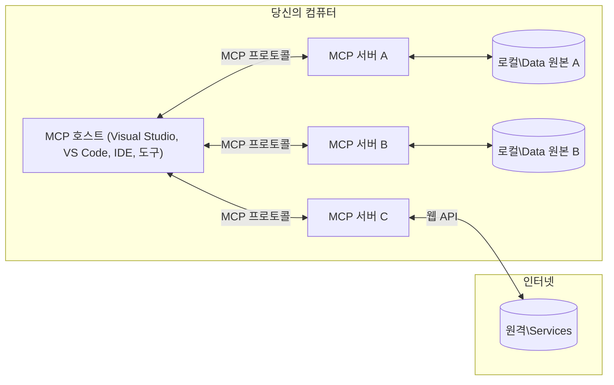

# MCP 핵심 개념: AI 통합을 위한 모델 컨텍스트 프로토콜 마스터하기

[](https://youtu.be/earDzWGtE84)

_(위 이미지를 클릭하면 이 수업의 비디오를 볼 수 있습니다)_

[Model Context Protocol (MCP)](https://github.com/modelcontextprotocol)는 대규모 언어 모델(LLM)과 외부 도구, 애플리케이션, 데이터 소스 간의 통신을 최적화하는 강력하고 표준화된 프레임워크입니다.
이 가이드는 MCP의 핵심 개념을 안내합니다. 클라이언트-서버 아키텍처, 필수 구성요소, 통신 메커니즘 및 구현 모범 사례에 대해 배울 수 있습니다.

- **명시적 사용자 동의**: 모든 데이터 접근 및 작업 수행은 실행 전에 명시적 사용자 승인이 필요합니다. 사용자는 어떤 데이터에 접근할지, 어떤 작업이 수행될지 명확히 이해해야 하며 세부적인 권한 및 승인 제어가 제공되어야 합니다.

- **데이터 개인정보 보호**: 사용자 데이터는 명시적 동의가 있을 때만 노출되며 상호작용 전체 과정에서 강력한 접근 제어로 보호되어야 합니다. 구현체는 무단 데이터 전송을 방지하고 엄격한 개인정보 경계를 유지해야 합니다.

- **도구 실행 안전성**: 모든 도구 호출은 도구의 기능, 매개변수 및 가능한 영향을 명확히 이해한 뒤 명시적 사용자 동의를 받아야 합니다. 견고한 보안 경계로 의도치 않거나 위험하거나 악의적인 도구 실행을 방지해야 합니다.

- **전송 계층 보안**: 모든 통신 채널에는 적절한 암호화 및 인증 메커니즘을 사용해야 합니다. 원격 연결은 보안 전송 프로토콜 및 적절한 자격 증명 관리를 구현해야 합니다.

#### 구현 지침:

- **권한 관리**: 사용자가 접근 가능한 서버, 도구, 리소스를 세밀하게 제어할 수 있는 권한 시스템 구현
- **인증 및 승인**: 적절한 토큰 관리 및 만료가 포함된 안전한 인증 방식(OAuth, API 키) 사용
- **입력 검증**: 정의된 스키마에 따라 모든 매개변수 및 데이터 입력 검증, 인젝션 공격 방지
- **감사 로깅**: 보안 모니터링 및 컴플라이언스를 위한 모든 작업에 대한 포괄적 로그 유지

## 개요

이 수업에서는 모델 컨텍스트 프로토콜(MCP) 생태계를 구성하는 기본 아키텍처와 구성 요소를 탐구합니다. 클라이언트-서버 아키텍처, 핵심 컴포넌트, MCP 상호작용의 통신 메커니즘에 대해 배울 것입니다.

## 주요 학습 목표

이 수업이 끝나면, 여러분은:

- MCP 클라이언트-서버 아키텍처를 이해합니다.
- 호스트, 클라이언트, 서버의 역할과 책임을 식별합니다.
- MCP를 유연한 통합 계층으로 만드는 핵심 기능을 분석합니다.
- MCP 생태계 내 정보 흐름 방식을 배웁니다.
- .NET, Java, Python, JavaScript 코드 예제를 통해 실무적인 통찰을 얻습니다.

## MCP 아키텍처: 심층 분석

MCP 생태계는 클라이언트-서버 모델을 기반으로 구축됩니다. 이 모듈식 구조를 통해 AI 애플리케이션은 도구, 데이터베이스, API, 컨텍스트 리소스와 효율적으로 상호작용할 수 있습니다. 이 아키텍처를 핵심 구성 요소로 나누어 살펴봅시다.

MCP는 본질적으로 클라이언트-서버 아키텍처를 따르며, 호스트 애플리케이션이 여러 서버에 연결할 수 있습니다:



- **MCP 호스트**: MCP를 통해 데이터에 접근하려는 VSCode, Claude Desktop, IDE, AI 도구 같은 프로그램
- **MCP 클라이언트**: 서버와 1:1 연결을 유지하는 프로토콜 클라이언트
- **MCP 서버**: 표준화된 모델 컨텍스트 프로토콜을 통해 특정 기능을 노출하는 경량 프로그램
- **로컬 데이터 소스**: MCP 서버가 안전하게 접근할 수 있는 컴퓨터의 파일, 데이터베이스, 서비스
- **원격 서비스**: 인터넷을 통해 MCP 서버가 API로 연결할 수 있는 외부 시스템

MCP 프로토콜은 날짜 기반 버저닝(YYYY-MM-DD 형식)을 사용하는 진화하는 표준입니다. 현재 프로토콜 버전은 <strong>2025-11-25</strong>입니다. 최신 업데이트는 [프로토콜 명세](https://modelcontextprotocol.io/specification/2025-11-25/)에서 확인할 수 있습니다.

> **미리보기:** 다음 명세 버전인 **2026-07-28** 릴리스 후보가 2026년 5월에 발표되었으며, 2026년 7월 28일에 배포될 예정입니다. 이 버전은 전송 계층에서 상태 비유지(stateless)를 구현하여 `initialize` 핸드셰이크와 세션 ID를 제거하고, Extensions 프레임워크를 공식화하며, Roots, Sampling, Logging을 폐지하고 새로운 패턴으로 대체합니다. 자세한 내용은 [MCP의 변경 사항: 2026-07-28 릴리스 후보](./mcp-2026-07-28-release-candidate.md)를 참조하세요.

### 1. 호스트

모델 컨텍스트 프로토콜(MCP)에서 <strong>호스트</strong>는 사용자가 프로토콜과 상호작용하는 기본 인터페이스 역할을 하는 AI 애플리케이션입니다. 호스트는 각 서버 연결마다 전용 MCP 클라이언트를 생성하여 여러 MCP 서버와의 연결을 조정하고 관리합니다. 호스트의 예는 다음과 같습니다:

- **AI 애플리케이션**: Claude Desktop, Visual Studio Code, Claude Code
- **개발 환경**: MCP 통합이 포함된 IDE 및 코드 편집기
- **맞춤 애플리케이션**: 목적 특화 AI 에이전트 및 도구

<strong>호스트</strong>는 AI 모델 상호작용을 조정하는 애플리케이션입니다. 역할은 다음과 같습니다:

- **AI 모델 오케스트레이션**: LLM 실행 또는 상호작용하여 응답 생성 및 AI 워크플로우 조정
- **클라이언트 연결 관리**: MCP 서버 연결마다 하나의 MCP 클라이언트 생성 및 유지
- **사용자 인터페이스 제어**: 대화 흐름, 사용자 상호작용, 응답 표시 처리
- **보안 시행**: 권한, 보안 제한 및 인증 제어
- **사용자 동의 처리**: 데이터 공유 및 도구 실행에 대한 사용자 승인 관리


### 2. 클라이언트

<strong>클라이언트</strong>는 호스트와 MCP 서버 간 전용 1:1 연결을 유지하는 핵심 구성요소입니다. 각 MCP 클라이언트는 호스트가 특정 MCP 서버에 연결하려고 인스턴스화하며 조직적이고 안전한 통신 채널을 보장합니다. 여러 클라이언트를 통해 호스트는 여러 서버에 동시에 연결할 수 있습니다.

<strong>클라이언트</strong>는 호스트 애플리케이션 내 연결자 역할을 합니다. 역할은 다음과 같습니다:

- **프로토콜 통신**: 프롬프트 및 명령과 함께 JSON-RPC 2.0 요청을 서버로 전송
- **기능 협상**: 초기화 과정에서 지원하는 기능과 프로토콜 버전을 서버와 협상
- **도구 실행**: 모델의 도구 실행 요청을 관리하고 응답 처리
- **실시간 업데이트**: 서버로부터 알림 및 실시간 업데이트 처리
- **응답 처리**: 사용자에게 표시할 서버 응답 처리 및 형식화

### 3. 서버

<strong>서버</strong>는 MCP 클라이언트에 컨텍스트, 도구 및 기능을 제공하는 프로그램입니다. 로컬(호스트와 동일한 컴퓨터) 또는 원격(외부 플랫폼)에서 실행할 수 있으며 클라이언트 요청을 처리하고 구조화된 응답을 제공합니다. 서버는 표준화된 모델 컨텍스트 프로토콜을 통해 특정 기능을 노출합니다.

<strong>서버</strong>는 컨텍스트와 기능을 제공하는 서비스입니다. 역할은 다음과 같습니다:

- **기능 등록**: 클라이언트에 사용 가능한 원시 자원(리소스, 프롬프트, 도구) 등록 및 노출
- **요청 처리**: 클라이언트로부터 도구 호출, 리소스 요청, 프롬프트 요청 수신 및 실행
- **컨텍스트 제공**: 모델 응답 개선을 위한 컨텍스트 정보 및 데이터 제공
- **상태 관리**: 세션 상태 유지 및 필요 시 상태 기반 상호작용 처리
- **실시간 알림**: 기능 변경 및 업데이트에 대한 알림을 연결된 클라이언트에 전송

서버는 누구나 개발해 특수 기능으로 모델 기능을 확장할 수 있으며 로컬 및 원격 배포 시나리오 모두를 지원합니다.

### 4. 서버 원시 자원(Primitives)

모델 컨텍스트 프로토콜(MCP) 서버는 클라이언트, 호스트, 언어 모델 간 풍부한 상호작용을 위한 기본 빌딩 블록을 정의하는 세 가지 핵심 <strong>원시 자원</strong>을 제공합니다. 이 원시 자원은 프로토콜을 통해 사용할 수 있는 컨텍스트 정보 및 작업 유형을 지정합니다.

MCP 서버는 다음 세 가지 핵심 원시 자원을 조합하여 노출할 수 있습니다:

#### 리소스

<strong>리소스</strong>는 AI 애플리케이션에 컨텍스트 정보를 제공하는 데이터 소스입니다. 모델 이해 및 의사결정을 향상하는 정적 또는 동적 콘텐츠를 나타냅니다:

- **컨텍스트 데이터**: AI 모델이 사용할 수 있는 구조화된 정보 및 컨텍스트
- **지식 기반**: 문서 저장소, 기사, 매뉴얼 및 연구 논문
- **로컬 데이터 소스**: 파일, 데이터베이스, 로컬 시스템 정보
- **외부 데이터**: API 응답, 웹 서비스, 원격 시스템 데이터
- **동적 콘텐츠**: 외부 조건에 따라 업데이트되는 실시간 데이터

리소스는 URI로 식별되며 `resources/list`를 통한 검색과 `resources/read`를 통한 조회를 지원합니다:

```text
file://documents/project-spec.md
database://production/users/schema
api://weather/current
```

#### 프롬프트

<strong>프롬프트</strong>는 언어 모델과의 상호작용을 구조화하는 재사용 가능한 템플릿입니다. 표준화된 상호작용 패턴과 템플릿 워크플로우를 제공합니다:

- **템플릿 기반 상호작용**: 사전 구성된 메시지와 대화 시작문
- **워크플로우 템플릿**: 일반 작업과 상호작용을 위한 표준화된 순서
- **Few-shot 예시**: 모델 지침을 위한 예시 기반 템플릿
- **시스템 프롬프트**: 모델 동작과 컨텍스트를 정의하는 기본 프롬프트들
- **동적 템플릿**: 특정 컨텍스트에 맞게 조정되는 매개변수화된 프롬프트

프롬프트는 변수 치환을 지원하며 `prompts/list`로 검색되고 `prompts/get`으로 조회됩니다:

```markdown
Generate a {{task_type}} for {{product}} targeting {{audience}} with the following requirements: {{requirements}}
```

#### 도구

<strong>도구</strong>는 AI 모델이 특정 작업을 수행하기 위해 호출할 수 있는 실행 가능한 함수입니다. MCP 생태계의 "동사" 역할을 하며 모델이 외부 시스템과 상호작용할 수 있게 합니다:

- **실행 가능한 함수**: 특정 매개변수로 모델이 호출할 수 있는 개별 작업들
- **외부 시스템 통합**: API 호출, 데이터베이스 쿼리, 파일 작업, 계산
- **고유 식별성**: 각 도구는 고유한 이름, 설명, 매개변수 스키마를 가짐
- **구조화된 입출력**: 도구는 검증된 매개변수를 받고 구조화되고 유형화된 응답을 반환함
- **행동 기능**: 모델이 실제 작업을 수행하고 실시간 데이터를 조회할 수 있도록 함

도구는 매개변수 검증을 위한 JSON 스키마로 정의되며 `tools/list`로 검색, `tools/call`로 실행됩니다. UI 표현 향상을 위해 <strong>아이콘</strong> 같은 추가 메타데이터도 포함할 수 있습니다.

**도구 어노테이션**: 도구는 읽기 전용인지 파괴적인지 등을 설명하는 행동 어노테이션(`readOnlyHint`, `destructiveHint` 등)을 지원해 클라이언트가 도구 실행 여부를 판단하는 데 도움을 줍니다.

도구 정의 예시:

```typescript
server.tool(
  "search_products", 
  {
    query: z.string().describe("Search query for products"),
    category: z.string().optional().describe("Product category filter"),
    max_results: z.number().default(10).describe("Maximum results to return")
  }, 
  async (params) => {
    // 검색을 실행하고 구조화된 결과를 반환합니다
    return await productService.search(params);
  }
);
```

## 클라이언트 원시 자원

모델 컨텍스트 프로토콜(MCP)에서 <strong>클라이언트</strong>는 서버가 호스트 애플리케이션에 추가 기능을 요청할 수 있도록 하는 원시 자원을 노출할 수 있습니다. 이러한 클라이언트 측 원시 자원은 AI 모델 기능과 사용자 상호작용에 접근할 수 있는 풍부하고 대화형 서버 구현을 가능하게 합니다.

### 샘플링

> **폐지 안내:** `2026-07-28` 릴리스 후보는 LLM 공급자 API와의 직접 통합을 선호하여 샘플링을 폐지 대상으로 지정했습니다. `2025-11-25` 버전과 폐지 후 최소 1년 동안은 작동하지만, 새 설계는 대체 패턴을 권장합니다. 자세한 내용은 [MCP의 변경 사항: 2026-07-28 릴리스 후보](./mcp-2026-07-28-release-candidate.md)를 참고하세요.

<strong>샘플링</strong>은 서버가 클라이언트 AI 애플리케이션에서 언어 모델 완성을 요청할 수 있게 하는 원시 자원입니다. 이를 통해 서버는 자체 모델 의존성 없이 LLM 기능에 접근할 수 있습니다:

- **모델 독립적 접근**: 서버는 LLM SDK를 포함하거나 모델 접근 관리를 하지 않고 완성 요청 가능
- **서버 주도 AI**: 서버가 클라이언트의 AI 모델을 사용해 자율적으로 콘텐츠 생성
- **재귀적 LLM 상호작용**: 서버가 AI 지원이 필요한 복잡한 시나리오 지원
- **동적 콘텐츠 생성**: 호스트 모델을 사용해 컨텍스트 응답 생성 허용
- **도구 호출 지원**: 서버는 샘플링 중 클라이언트 모델이 도구를 호출할 수 있도록 `tools`와 `toolChoice` 매개변수 포함 가능

샘플링은 `sampling/complete` 메서드를 통해 서버가 클라이언트에게 완성 요청을 전송하여 시작됩니다.

### 루트

> **폐지 안내:** `2026-07-28` 릴리스 후보는 도구 매개변수, 리소스 URI, 서버 구성으로 대체하기 위해 루트를 폐지 대상으로 지정했습니다. `2025-11-25` 버전과 폐지 후 최소 1년간은 작동합니다. 자세한 내용은 [MCP의 변경 사항: 2026-07-28 릴리스 후보](./mcp-2026-07-28-release-candidate.md)를 참고하세요.

<strong>루트</strong>는 클라이언트가 서버에게 파일 시스템 경계 정보를 표준화된 방식으로 노출하여, 서버가 접근 가능한 디렉토리와 파일을 이해하도록 돕습니다:

- **파일 시스템 경계**: 서버가 작업할 수 있는 파일 시스템 내 경계 정의
- **접근 제어**: 서버가 접근 권한이 있는 디렉토리와 파일 인지 지원
- **동적 업데이트**: 루트 목록 변경 시 클라이언트가 서버에 알림 전송 가능
- **URI 기반 식별**: 루트는 접근 가능한 디렉토리와 파일을 `file://` URI로 식별

루트는 `roots/list` 메서드를 통해 검색되고 루트 변경 시 클라이언트가 `notifications/roots/list_changed`를 전송합니다.

### 유도(Elicitation)  

<strong>유도</strong>는 서버가 클라이언트 인터페이스를 통해 사용자에게 추가 정보 요청이나 확인을 요구할 수 있도록 합니다:

- **사용자 입력 요청**: 도구 실행에 필요한 추가 정보를 서버가 요청할 수 있음
- **확인 대화 상자**: 민감하거나 영향력 있는 작업에 대한 사용자 승인을 요청
- **대화형 워크플로우**: 서버가 단계별 사용자 상호작용을 생성할 수 있도록 지원
- **동적 매개변수 수집**: 도구 실행 중 누락되거나 선택적 매개변수를 수집

유도 요청은 `elicitation/request` 메서드를 통해 클라이언트 인터페이스로 사용자 입력을 수집합니다.

**URL 모드 유도**: 서버가 사용자에게 외부 웹 페이지로 이동하도록 요청하여 인증, 확인, 데이터 입력 등을 수행하게끔 할 수 있습니다.

### 로깅


> **중단 공지:** `2026-07-28` 릴리스 후보에서는 stdio 전송용 `stderr`와 구조화된 가시성을 위한 OpenTelemetry를 선호함에 따라 Logging이 더 이상 사용되지 않도록 표시되었습니다. 이 기능은 `2025-11-25` 버전과 중단 이후 최소 1년간 계속 작동합니다. 자세한 내용은 [MCP 변경 사항: 2026-07-28 릴리스 후보](./mcp-2026-07-28-release-candidate.md)를 참조하세요.

<strong>Logging</strong>은 서버가 디버깅, 모니터링 및 운영 가시성을 위해 클라이언트에 구조화된 로그 메시지를 전송할 수 있도록 합니다:

- **디버깅 지원**: 문제 해결을 위한 자세한 실행 로그 제공 활성화
- **운영 모니터링**: 클라이언트에 상태 업데이트 및 성능 지표 전송
- **오류 보고**: 자세한 오류 컨텍스트 및 진단 정보 제공
- **감사 추적**: 서버 작업 및 결정의 포괄적 로그 생성

로그 메시지는 서버 작업의 투명성을 제공하고 디버깅을 용이하게 하기 위해 클라이언트로 전송됩니다.

## MCP 내 정보 흐름

모델 컨텍스트 프로토콜(MCP)은 호스트, 클라이언트, 서버 및 모델 간의 구조화된 정보 흐름을 정의합니다. 이 흐름을 이해하면 사용자 요청 처리 방식과 외부 도구 및 데이터가 모델 응답에 통합되는 과정을 명확히 알 수 있습니다.

- **호스트가 연결 시작**  
  IDE나 채팅 인터페이스 같은 호스트 애플리케이션이 일반적으로 STDIO, WebSocket 또는 다른 지원되는 전송 방식을 통해 MCP 서버에 연결을 설정합니다.

- **기능 협상**  
  호스트에 내장된 클라이언트와 서버가 지원하는 기능, 도구, 리소스, 프로토콜 버전에 대해 정보를 교환하여 세션에서 사용 가능한 기능을 서로 확인합니다.

- **사용자 요청**  
  사용자가 호스트와 상호 작용(예: 프롬프트나 명령 입력)하며, 호스트가 이 입력을 수집하여 클라이언트로 전달해 처리합니다.

- **리소스 또는 도구 사용**  
  - 클라이언트는 모델의 이해를 풍부하게 하기 위해 서버에서 파일, 데이터베이스 항목, 지식 베이스 문서 같은 추가 컨텍스트나 리소스를 요청할 수 있습니다.
  - 모델이 도구 사용이 필요하다고 판단하면(예: 데이터 가져오기, 계산 수행, API 호출), 클라이언트가 도구 이름과 매개변수를 지정하여 서버에 도구 호출 요청을 보냅니다.

- **서버 실행**  
  서버가 리소스 또는 도구 요청을 수신하고 함수 실행, 데이터베이스 조회, 파일 검색 등 필요한 작업을 수행하여 결과를 구조화된 형식으로 클라이언트에 반환합니다.

- **응답 생성**  
  클라이언트가 서버의 응답(리소스 데이터, 도구 출력 등)을 현재 모델 상호작용에 통합하여 모델이 포괄적이고 문맥에 맞는 응답을 생성하도록 합니다.

- **결과 제공**  
  호스트가 클라이언트로부터 최종 출력을 받아 사용자에게 제공하며, 여기에는 일반적으로 모델이 생성한 텍스트와 도구 실행이나 리소스 조회 결과가 포함됩니다.

이 흐름은 MCP가 외부 도구와 데이터 소스를 모델에 원활히 연결하여 고급, 인터랙티브 및 문맥 인식 AI 애플리케이션을 지원하도록 합니다.

## 프로토콜 아키텍처 및 계층

MCP는 완전한 통신 프레임워크를 제공하기 위해 함께 작동하는 두 가지 구분된 아키텍처 계층으로 구성됩니다:

### 데이터 계층

<strong>데이터 계층</strong>은 <strong>JSON-RPC 2.0</strong>을 기반으로 MCP 프로토콜의 핵심을 구현합니다. 이 계층은 메시지 구조, 의미론, 상호작용 패턴을 정의합니다:

#### 핵심 구성 요소:

- **JSON-RPC 2.0 프로토콜**: 모든 통신은 메서드 호출, 응답, 알림을 위한 표준화된 JSON-RPC 2.0 메시지 형식 사용
- **수명 주기 관리**: 클라이언트 및 서버 간 연결 초기화, 기능 협상, 세션 종료 처리
- **서버 프리미티브**: 서버가 도구, 리소스 및 프롬프트를 통해 핵심 기능 제공 가능
- **클라이언트 프리미티브**: 서버가 LLM 샘플링 요청, 사용자 입력 유도, 로그 메시지 전송 가능
- **실시간 알림**: 폴링 없이 동적 업데이트를 위한 비동기 알림 지원

#### 주요 특징:

- **프로토콜 버전 협상**: 호환성을 보장하기 위해 날짜 기반 버전 관리(YYYY-MM-DD) 사용
- **기능 탐색**: 클라이언트와 서버가 초기화 중 지원 기능 정보를 교환
- **상태 유지 세션**: 여러 상호작용에 걸쳐 연결 상태를 유지하여 문맥 연속성 확보

### 전송 계층

<strong>전송 계층</strong>은 MCP 참가자 간 통신 채널, 메시지 프레이밍, 인증을 관리합니다:

#### 지원되는 전송 메커니즘:

1. **STDIO 전송**:
   - 표준 입력/출력 스트림을 사용하여 프로세스 간 직접 통신
   - 네트워크 오버헤드 없이 동일 기기 내 로컬 프로세스에 최적화됨
   - 일반적으로 로컬 MCP 서버 구현에 사용

2. **스트리밍 가능한 HTTP 전송**:
   - 클라이언트에서 서버로 메시지를 HTTP POST 방식으로 전송  
   - 서버에서 클라이언트로는 선택적 서버 발행 이벤트(SSE)를 통한 스트리밍 지원
   - 네트워크를 통한 원격 서버 통신 가능
   - 표준 HTTP 인증(베어러 토큰, API 키, 맞춤 헤더) 지원
   - 안전한 토큰 기반 인증을 위해 MCP는 OAuth를 권장

#### 전송 추상화:

전송 계층은 데이터 계층으로부터 통신 세부 정보를 추상화하여 모든 전송 메커니즘에 대해 동일한 JSON-RPC 2.0 메시지 형식을 사용할 수 있게 합니다. 이를 통해 애플리케이션은 로컬과 원격 서버 간 전환을 원활히 수행할 수 있습니다.

### 보안 고려사항

MCP 구현은 모든 프로토콜 작업에서 안전하고 신뢰할 수 있으며 보안이 유지된 상호 작용을 보장하기 위해 여러 중요한 보안 원칙을 준수해야 합니다:

- **사용자 동의 및 통제**: 데이터 접근이나 작업 수행 전에 사용자의 명시적 동의를 받아야 합니다. 어떤 데이터가 공유되고 어떤 작업이 승인되는지 명확하게 통제할 수 있어야 하며, 활동 검토 및 승인에 대한 직관적인 사용자 인터페이스를 제공해야 합니다.

- **데이터 프라이버시**: 사용자 데이터는 명시적 동의가 있을 때만 노출되어야 하며 적절한 접근 제어로 보호해야 합니다. MCP 구현은 무단 데이터 전송을 방지하고 모든 상호작용 전반에 걸쳐 프라이버시가 유지되도록 보장해야 합니다.

- **도구 안전성**: 도구 호출 전에 명시적 사용자 동의가 필요합니다. 사용자는 각 도구의 기능을 명확히 이해해야 하며, 의도하지 않았거나 안전하지 않은 도구 실행을 방지하기 위해 견고한 보안 경계를 반드시 시행해야 합니다.

이러한 보안 원칙을 준수함으로써 MCP는 모든 프로토콜 상호작용에서 사용자 신뢰, 프라이버시, 안전성을 유지하면서 강력한 AI 통합을 가능하게 합니다.

## 코드 예제: 주요 구성 요소

아래는 여러 인기 프로그래밍 언어로 작성된 MCP 서버 주요 구성 요소 및 도구 구현 예제입니다.

### .NET 예제: 도구가 포함된 간단한 MCP 서버 생성

여기에 사용자 정의 도구를 포함한 간단한 MCP 서버 구현을 보여주는 실용적인 .NET 코드 예제가 있습니다. 이 예제는 도구 정의 및 등록, 요청 처리, 모델 컨텍스트 프로토콜을 통한 서버 연결 방식을 보여줍니다.

```csharp
using System;
using System.Threading.Tasks;
using ModelContextProtocol.Server;
using ModelContextProtocol.Server.Transport;
using ModelContextProtocol.Server.Tools;

public class WeatherServer
{
    public static async Task Main(string[] args)
    {
        // Create an MCP server
        var server = new McpServer(
            name: "Weather MCP Server",
            version: "1.0.0"
        );
        
        // Register our custom weather tool
        server.AddTool<string, WeatherData>("weatherTool", 
            description: "Gets current weather for a location",
            execute: async (location) => {
                // Call weather API (simplified)
                var weatherData = await GetWeatherDataAsync(location);
                return weatherData;
            });
        
        // Connect the server using stdio transport
        var transport = new StdioServerTransport();
        await server.ConnectAsync(transport);
        
        Console.WriteLine("Weather MCP Server started");
        
        // Keep the server running until process is terminated
        await Task.Delay(-1);
    }
    
    private static async Task<WeatherData> GetWeatherDataAsync(string location)
    {
        // This would normally call a weather API
        // Simplified for demonstration
        await Task.Delay(100); // Simulate API call
        return new WeatherData { 
            Temperature = 72.5,
            Conditions = "Sunny",
            Location = location
        };
    }
}

public class WeatherData
{
    public double Temperature { get; set; }
    public string Conditions { get; set; }
    public string Location { get; set; }
}
```

### Java 예제: MCP 서버 구성 요소

위 .NET 예제와 동일한 MCP 서버 및 도구 등록을 Java로 구현한 예제입니다.

```java
import io.modelcontextprotocol.server.McpServer;
import io.modelcontextprotocol.server.McpToolDefinition;
import io.modelcontextprotocol.server.transport.StdioServerTransport;
import io.modelcontextprotocol.server.tool.ToolExecutionContext;
import io.modelcontextprotocol.server.tool.ToolResponse;

public class WeatherMcpServer {
    public static void main(String[] args) throws Exception {
        // MCP 서버 생성
        McpServer server = McpServer.builder()
            .name("Weather MCP Server")
            .version("1.0.0")
            .build();
            
        // 날씨 도구 등록
        server.registerTool(McpToolDefinition.builder("weatherTool")
            .description("Gets current weather for a location")
            .parameter("location", String.class)
            .execute((ToolExecutionContext ctx) -> {
                String location = ctx.getParameter("location", String.class);
                
                // 날씨 데이터 가져오기 (간소화됨)
                WeatherData data = getWeatherData(location);
                
                // 형식화된 응답 반환
                return ToolResponse.content(
                    String.format("Temperature: %.1f°F, Conditions: %s, Location: %s", 
                    data.getTemperature(), 
                    data.getConditions(), 
                    data.getLocation())
                );
            })
            .build());
        
        // stdio 전송을 사용하여 서버 연결
        try (StdioServerTransport transport = new StdioServerTransport()) {
            server.connect(transport);
            System.out.println("Weather MCP Server started");
            // 프로세스가 종료될 때까지 서버 실행 유지
            Thread.currentThread().join();
        }
    }
    
    private static WeatherData getWeatherData(String location) {
        // 구현은 날씨 API를 호출함
        // 예제 목적으로 간소화됨
        return new WeatherData(72.5, "Sunny", location);
    }
}

class WeatherData {
    private double temperature;
    private String conditions;
    private String location;
    
    public WeatherData(double temperature, String conditions, String location) {
        this.temperature = temperature;
        this.conditions = conditions;
        this.location = location;
    }
    
    public double getTemperature() {
        return temperature;
    }
    
    public String getConditions() {
        return conditions;
    }
    
    public String getLocation() {
        return location;
    }
}
```

### Python 예제: MCP 서버 구축

이 예제는 fastmcp 패키지를 사용하므로 먼저 설치해 주세요:

```python
pip install fastmcp
```
Code Sample:

```python
#!/usr/bin/env python3
import asyncio
from fastmcp import FastMCP
from fastmcp.transports.stdio import serve_stdio

# FastMCP 서버 생성
mcp = FastMCP(
    name="Weather MCP Server",
    version="1.0.0"
)

@mcp.tool()
def get_weather(location: str) -> dict:
    """Gets current weather for a location."""
    return {
        "temperature": 72.5,
        "conditions": "Sunny",
        "location": location
    }

# 클래스를 사용한 대체 접근 방식
class WeatherTools:
    @mcp.tool()
    def forecast(self, location: str, days: int = 1) -> dict:
        """Gets weather forecast for a location for the specified number of days."""
        return {
            "location": location,
            "forecast": [
                {"day": i+1, "temperature": 70 + i, "conditions": "Partly Cloudy"}
                for i in range(days)
            ]
        }

# 클래스 도구 등록
weather_tools = WeatherTools()

# 서버 시작
if __name__ == "__main__":
    asyncio.run(serve_stdio(mcp))
```

### JavaScript 예제: MCP 서버 생성

이 예제는 JavaScript에서 MCP 서버를 생성하고 두 개의 날씨 관련 도구를 등록하는 방법을 보여줍니다.

```javascript
// 공식 모델 컨텍스트 프로토콜 SDK 사용
import { McpServer } from "@modelcontextprotocol/sdk/server/mcp.js";
import { StdioServerTransport } from "@modelcontextprotocol/sdk/server/stdio.js";
import { z } from "zod"; // 매개변수 유효성 검사용

// MCP 서버 생성
const server = new McpServer({
  name: "Weather MCP Server",
  version: "1.0.0"
});

// 날씨 도구 정의
server.tool(
  "weatherTool",
  {
    location: z.string().describe("The location to get weather for")
  },
  async ({ location }) => {
    // 일반적으로 날씨 API를 호출함
    // 시연을 위해 단순화됨
    const weatherData = await getWeatherData(location);
    
    return {
      content: [
        { 
          type: "text", 
          text: `Temperature: ${weatherData.temperature}°F, Conditions: ${weatherData.conditions}, Location: ${weatherData.location}` 
        }
      ]
    };
  }
);

// 예보 도구 정의
server.tool(
  "forecastTool",
  {
    location: z.string(),
    days: z.number().default(3).describe("Number of days for forecast")
  },
  async ({ location, days }) => {
    // 일반적으로 날씨 API를 호출함
    // 시연을 위해 단순화됨
    const forecast = await getForecastData(location, days);
    
    return {
      content: [
        { 
          type: "text", 
          text: `${days}-day forecast for ${location}: ${JSON.stringify(forecast)}` 
        }
      ]
    };
  }
);

// 도우미 함수들
async function getWeatherData(location) {
  // API 호출 시뮬레이션
  return {
    temperature: 72.5,
    conditions: "Sunny",
    location: location
  };
}

async function getForecastData(location, days) {
  // API 호출 시뮬레이션
  return Array.from({ length: days }, (_, i) => ({
    day: i + 1,
    temperature: 70 + Math.floor(Math.random() * 10),
    conditions: i % 2 === 0 ? "Sunny" : "Partly Cloudy"
  }));
}

// stdio 전송을 사용하여 서버 연결
const transport = new StdioServerTransport();
server.connect(transport).catch(console.error);

console.log("Weather MCP Server started");
```

이 JavaScript 예제는 Model Context Protocol SDK를 사용하여 MCP 서버를 생성하는 방법을 시연합니다. `weatherTool`과 `forecastTool`이라는 두 도구를 등록하고 `StdioServerTransport`를 통해 MCP 클라이언트에 제공하는 방식을 보여줍니다.

## 보안 및 권한 부여

MCP는 프로토콜 전반에 걸친 보안 및 권한 관리를 위해 여러 기본 개념과 메커니즘을 포함합니다:

1. **도구 권한 제어**:  
  클라이언트는 세션 중 모델이 사용할 수 있는 도구를 지정할 수 있습니다. 이를 통해 명시적으로 승인된 도구만 접근 가능하게 하여 의도치 않거나 안전하지 않은 작업 위험을 줄입니다. 권한은 사용자 선호, 조직 정책, 상호작용 문맥에 따라 동적으로 구성할 수 있습니다.

2. <strong>인증</strong>:  
  서버는 도구, 리소스, 민감한 작업에 대한 접근 권한 부여 전에 인증을 요구할 수 있습니다. 이는 API 키, OAuth 토큰, 기타 인증 체계를 포함할 수 있습니다. 적절한 인증은 신뢰할 수 있는 클라이언트와 사용자만이 서버 기능을 호출할 수 있게 보장합니다.

3. <strong>검증</strong>:  
  모든 도구 호출에 대해 매개변수 검증이 시행됩니다. 각 도구는 매개변수의 예상 타입, 형식, 제약조건을 정의하며 서버는 들어오는 요청을 이에 맞게 검증합니다. 이는 잘못되거나 악의적인 입력이 도구 구현에 도달하는 것을 방지해 작업 무결성을 유지합니다.

4. **속도 제한**:  
  서버 자원 남용 방지 및 공정한 사용 보장을 위해 MCP 서버는 도구 호출 및 리소스 접근에 대해 속도 제한을 구현할 수 있습니다. 제한은 사용자별, 세션별, 전역 적용 가능하며 서비스 거부 공격이나 과도한 자원 소비를 차단합니다.

이러한 메커니즘 조합으로 MCP는 언어 모델과 외부 도구 및 데이터 소스 통합에 대한 안전한 기반을 제공하면서 사용자와 개발자에게 세밀한 접근 및 사용 제어를 부여합니다.

## 프로토콜 메시지 및 통신 흐름

MCP 통신은 명확하고 신뢰 가능한 상호작용을 촉진하는 구조화된 **JSON-RPC 2.0** 메시지를 사용합니다. 프로토콜은 다양한 작업 유형에 대해 특정 메시지 패턴을 정의합니다:

### 핵심 메시지 유형:

#### **초기화 메시지**
- **`initialize` 요청**: 연결을 설정하고 프로토콜 버전 및 기능을 협상
- **`initialize` 응답**: 지원 기능 및 서버 정보 확인  
- **`notifications/initialized`**: 초기화 완료 및 세션 준비 상태 알림

#### **탐색 메시지**
- **`tools/list` 요청**: 서버에서 사용 가능한 도구 탐색
- **`resources/list` 요청**: 사용 가능한 리소스(데이터 소스) 목록 조회
- **`prompts/list` 요청**: 사용 가능한 프롬프트 템플릿 검색

#### **실행 메시지**  
- **`tools/call` 요청**: 특정 도구를 제공된 매개변수로 실행
- **`resources/read` 요청**: 특정 리소스의 콘텐츠 검색
- **`prompts/get` 요청**: 선택적 매개변수와 함께 프롬프트 템플릿 가져오기

#### **클라이언트 측 메시지**
- **`sampling/complete` 요청**: 서버가 클라이언트로부터 LLM 완성 요청
- **`elicitation/request`**: 서버가 클라이언트 인터페이스를 통해 사용자 입력 요청
- **로깅 메시지**: 서버가 클라이언트에 구조화된 로그 메시지 전송

#### **알림 메시지**
- **`notifications/tools/list_changed`**: 도구 변경 사항을 클라이언트에 알림
- **`notifications/resources/list_changed`**: 리소스 변경 사항을 클라이언트에 알림  
- **`notifications/prompts/list_changed`**: 프롬프트 변경 사항을 클라이언트에 알림

### 메시지 구조:

모든 MCP 메시지는 JSON-RPC 2.0 형식을 따르며:
- **요청 메시지**: `id`, `method`, 선택적 `params` 포함
- **응답 메시지**: `id` 및 `result` 또는 `error` 포함  
- **알림 메시지**: `method` 및 선택적 `params` 포함 (`id`나 응답 기대 안 함)

이 구조적 통신은 실시간 업데이트, 도구 연쇄, 견고한 오류 처리 같은 고급 시나리오를 지원하는 신뢰 가능하고 추적 가능하며 확장 가능한 상호작용을 보장합니다.

### 작업(실험적)

> **미리 보기:** `2026-07-28` 릴리스 후보에서는 작업이 실험적 핵심 명세에서 전용 작업 확장으로 격상되어 재설계된 수명 주기(`tasks/get`, `tasks/update`, `tasks/cancel`; `tasks/list`는 삭제)로 분리됩니다. 아래 설명된 실험적 API를 기반으로 구축하는 경우 마이그레이션을 계획하세요. 자세한 내용은 [MCP 변경 사항: 2026-07-28 릴리스 후보](./mcp-2026-07-28-release-candidate.md) 참조.

<strong>작업</strong>은 MCP 요청에 대해 지연된 결과 조회 및 상태 추적을 가능하게 하는 내구성 실행 래퍼를 제공하는 실험적 기능입니다:

- **장시간 실행 작업**: 비용이 많이 드는 계산, 워크플로우 자동화, 배치 처리 추적
- **지연 결과**: 작업 상태를 폴링하고 작업 완료 시 결과를 조회
- **상태 추적**: 정의된 수명 주기 상태를 통해 작업 진행 모니터링
- **다단계 작업**: 여러 상호작용에 걸친 복잡한 워크플로우 지원

작업은 즉시 완료할 수 없는 작업에 대해 비동기 실행 패턴을 가능하게 하기 위해 표준 MCP 요청을 래핑합니다.

## 주요 요약

- <strong>아키텍처</strong>: MCP는 호스트가 여러 클라이언트 연결을 서버와 관리하는 클라이언트-서버 아키텍처를 사용
- <strong>참여자</strong>: 에코시스템에는 호스트(AI 애플리케이션), 클라이언트(프로토콜 연결자), 서버(기능 제공자)가 포함
- **전송 메커니즘**: STDIO(로컬) 및 스트리밍 가능한 HTTP와 선택적 SSE(원격)를 지원
- **핵심 프리미티브**: 서버는 도구(실행 가능한 함수), 리소스(데이터 소스), 프롬프트(템플릿)를 노출
- **클라이언트 프리미티브**: 서버는 샘플링(도구 호출 지원 포함 LLM 완성), 사용자 입력 유도(URL 모드 포함), 루트(파일 시스템 경계), 로깅을 클라이언트에 요청 가능
- **실험적 기능**: 작업은 장시간 실행 작업을 위한 내구성 실행 래퍼 제공
- **프로토콜 기반**: JSON-RPC 2.0 및 날짜 기반 버전 관리(현재: 2025-11-25) 위에 구축
- **실시간 기능**: 동적 업데이트 및 실시간 동기화를 위한 알림 지원
- **보안 우선**: 명시적 사용자 동의, 데이터 프라이버시 보호, 안전한 전송이 핵심 요구 사항

## 연습 문제

자신의 도메인에서 유용할 간단한 MCP 도구를 설계하세요. 다음을 정의하세요:
1. 도구 이름
2. 수락할 매개변수
3. 반환할 출력
4. 모델이 이 도구를 사용하여 사용자 문제를 해결하는 방법


---

## 다음 단계

다음: [2장: 보안](../02-Security/README.md)


`2025-11-25` 이후에 무엇이 올지 궁금하신가요? [MCP에서 변경되는 사항: 2026-07-28 릴리스 후보](./mcp-2026-07-28-release-candidate.md)를 읽어보세요.

---

<!-- CO-OP TRANSLATOR DISCLAIMER START -->
**면책 조항**:
이 문서는 AI 번역 서비스 [Co-op Translator](https://github.com/Azure/co-op-translator)를 사용하여 번역되었습니다. 정확성을 기하기 위해 노력하고 있으나, 자동 번역은 오류나 부정확한 부분이 있을 수 있음을 유의하시기 바랍니다. 원본 문서의 원어본이 권위 있는 자료로 간주되어야 합니다. 중요한 정보의 경우, 전문가의 인간 번역을 권장합니다. 이 번역 사용으로 인해 발생하는 오해나 잘못된 해석에 대해 당사는 책임을 지지 않습니다.
<!-- CO-OP TRANSLATOR DISCLAIMER END -->