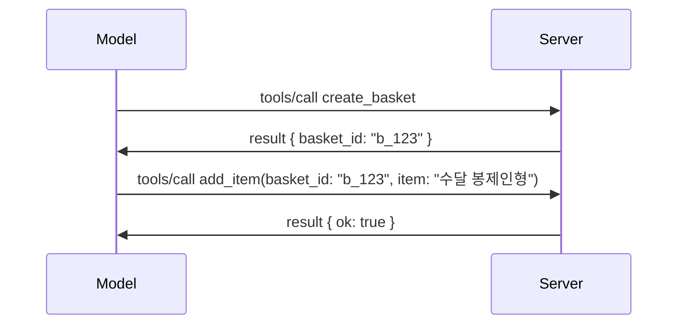

# MCP에서 변경되는 내용: 2026-07-28 릴리스 후보

> **상태:** 릴리스 후보. `2026-07-28` 명세는 작성 시점에 최종 버전이 아닙니다. 2026년 5월 21일에 발표되었으며 2026년 7월 28일에 배포될 예정입니다. 이 강의의 모든 내용은 릴리스 후보를 설명하며, 빌드하기 전에 최신 상태를 위해 [초안 명세](https://modelcontextprotocol.io/specification/draft)와 그 [변경 로그](https://modelcontextprotocol.io/specification/draft/changelog)를 확인하세요. 이 커리큘럼의 나머지 부분은 현재 안정 버전인 <strong>MCP 명세 2025-11-25</strong>를 기준으로 작성되었으며 `2026-07-28`가 배포되면 업데이트됩니다.

## 개요

`2026-07-28`은 MCP가 출시된 이후 가장 큰 개정입니다. 여섯 개의 명세 향상 제안(SEPs)은 프로토콜 수준 세션을 제거하고 전송 계층에서 MCP를 무상태(stateless)로 만들며, 확장 기능이 1급 버전 관리 메커니즘이 되고, 이 커리큘럼에서 이전에 배운 여러 기능(루트, 샘플링, 로깅)이 새로운 수명 주기 정책 하에 폐기 예정으로 표시됩니다. 이 강의에서는 무엇이 변경되었는지, 왜 중요한지, `2025-11-25`를 기준으로 이미 작성한 코드에 어떤 의미가 있는지 요약합니다.

출처: [2026-07-28 MCP 명세 릴리스 후보](https://blog.modelcontextprotocol.io/posts/2026-07-28-release-candidate/) (Model Context Protocol 블로그, David Soria Parra와 Den Delimarsky).

## 학습 목표

이 강의가 끝나면 다음을 할 수 있습니다:

- MCP가 무상태 프로토콜 코어로 이동하는 이유와 수평 확장 배포에서 해결하는 문제 설명
- `initialize`/`initialized` 핸드셰이크 및 `Mcp-Session-Id` 헤더가 어떻게 대체되는지 설명
- 새로운 `Mcp-Method` 및 `Mcp-Name` 헤더와 `ttlMs`/`cacheScope` 캐싱 메타데이터 확인
- 확장 프레임워크 및 이번 릴리스와 함께 배포되는 두 가지 확장(MCP 앱과 작업) 인식
- OAuth 2.0 / OIDC 정렬을 강화하는 여섯 가지 권한 부여 SEP 나열
- 어떤 핵심 기능들(루트, 샘플링, 로깅)이 이제 폐기 예정인지, 그리고 그것이 실제로 의미하는 바 설명
- 도구의 `inputSchema`/`outputSchema`에 대한 전체 JSON 스키마 2020-12 변경 설명

## 무상태 프로토콜

주요 변경 사항: MCP가 프로토콜 계층에서 무상태가 됩니다.

### 이전(2025-11-25): 세션은 서버 인스턴스에 고정됨

스트리머블 HTTP를 통한 도구 호출은 `initialize` 핸드셰이크로 시작합니다. 서버는 이후 모든 요청에 반드시 포함되어야 하는 `Mcp-Session-Id` 헤더로 응답합니다:

```http
POST /mcp HTTP/1.1
Mcp-Session-Id: 1868a90c-3a3f-4f5b
Content-Type: application/json

{"jsonrpc":"2.0","id":2,"method":"tools/call",
 "params":{"name":"search","arguments":{"q":"otters"}}}
```

세션이 발급한 서버 인스턴스에 묶여 있기 때문에, 수평 확장 배포에서는 로드 밸런서에서 <strong>스티키 라우팅</strong>과 인스턴스 간 <strong>공유 세션 저장소</strong>가 필요합니다.

### 이후(2026-07-28): 모든 요청이 자체 완전함

```http
POST /mcp HTTP/1.1
MCP-Protocol-Version: 2026-07-28
Mcp-Method: tools/call
Mcp-Name: search
Content-Type: application/json

{"jsonrpc":"2.0","id":1,"method":"tools/call",
 "params":{"name":"search","arguments":{"q":"otters"},
           "_meta":{"io.modelcontextprotocol/clientInfo":{"name":"my-app","version":"1.0"}}}}
```

어떤 서버 인스턴스도 이 요청을 처리할 수 있습니다. 주요 변경 사항:

- **`initialize`/`initialized` 핸드셰이크가 제거됨** ([SEP-2575](https://github.com/modelcontextprotocol/modelcontextprotocol/pull/2575)). 프로토콜 버전, 클라이언트 정보, 클라이언트 기능이 모든 요청의 `_meta`로 이동합니다. 클라이언트가 필요할 때 서버 기능을 미리 가져올 수 있는 새로운 `server/discover` 메서드가 추가됩니다.
- **`Mcp-Session-Id` 헤더와 프로토콜 수준 세션이 제거됨** ([SEP-2567](https://github.com/modelcontextprotocol/modelcontextprotocol/pull/2567)). 프로토콜 계층에서는 더 이상 스티키 라우팅이나 공유 세션 저장소가 필요하지 않습니다.

### 무상태 프로토콜, 상태를 가진 애플리케이션

프로토콜 수준 세션을 제거한다고 해서 서버가 상태를 가질 수 없다는 의미는 아닙니다. 권장 패턴은 HTTP API가 항상 사용해 온 것과 동일합니다: 한 도구 호출에서 명시적 핸들(`basket_id`, `browser_id`)을 발급하고, 모델이 이후 호출에서 해당 핸들을 일반 인수로 반환하도록 합니다.



이렇게 하면 상태가 전송 메타데이터에 숨겨지지 않고 모델에 명확히 보이게 되며, 어떤 서버 인스턴스도 호출을 처리할 수 있습니다.

### 서버-클라이언트 요청, 재구성됨

무상태 프로토콜이라도 서버가 호출 중간에 클라이언트에게 무언가를 요청할 방법이 필요합니다(예: 유도 프롬프트):

- **서버 시작 요청은 서버가 클라이언트 요청을 적극적으로 처리하는 동안에만 발행 가능** ([SEP-2260](https://github.com/modelcontextprotocol/modelcontextprotocol/pull/2260)) — 이전에는 권장 사항이었으나 이제 필수입니다. 사용자가 갑자기 프롬프트되지 않습니다.
- **다중 왕복 요청** ([SEP-2322](https://github.com/modelcontextprotocol/modelcontextprotocol/pull/2322))는 SSE 스트림을 계속 유지하는 대신 사용됩니다. 서버는 대신 `InputRequiredResult`를 반환합니다:

  ```json
  {
    "resultType": "inputRequired",
    "inputRequests": {
      "confirm": {
        "type": "elicitation",
        "message": "Delete 3 files?",
        "schema": { "type": "boolean" }
      }
    },
    "requestState": "eyJzdGVwIjoxLCJmaWxlcyI6WyJhIiwiYiIsImMiXX0="
  }
  ```

  클라이언트는 답변을 수집하여 원래 호출을 `inputResponses`와 함께 다시 보냅니다(에코된 `requestState` 포함). 필요한 모든 정보가 페이로드에 있으므로 어떤 서버 인스턴스도 재시도를 처리할 수 있습니다.

### 라우팅 가능, 캐시 가능, 추적 가능

세 가지 작은 변경 사항이 무상태 트래픽 운영을 더 쉽게 만듭니다:

- **`Mcp-Method` 및 `Mcp-Name` 헤더가 스트리머블 HTTP에서 필수로 지정됨** ([SEP-2243](https://github.com/modelcontextprotocol/modelcontextprotocol/pull/2243)), 로드 밸런서, 게이트웨이, 속도 제한기가 JSON 본문을 검사하지 않고도 작업을 라우팅할 수 있습니다. 헤더와 본문이 일치하지 않으면 서버가 요청을 거부합니다.
- **`tools/list` 및 리소스 읽기 결과에 `ttlMs`와 `cacheScope` 포함** ([SEP-2549](https://github.com/modelcontextprotocol/modelcontextprotocol/pull/2549)), HTTP `Cache-Control`을 모델링. 클라이언트는 리스트 결과가 얼마나 신선한지, 사용자 간 안전하게 공유 가능한지 알 수 있으며, 변경 사항 알림을 위한 오래 지속되는 SSE 스트림이 필요 없습니다.
- **`_meta`의 W3C Trace Context 전파 문서화** ([SEP-414](https://github.com/modelcontextprotocol/modelcontextprotocol/pull/414)), `traceparent`, `tracestate`, `baggage` 키 이름을 고정하여 분산 추적이 클라이언트 SDK, MCP 서버, 다운스트림 시스템의 [OpenTelemetry](https://opentelemetry.io/) 호환 백엔드를 따라갈 수 있습니다.

## 확장 기능이 1급이 됨

확장 기능은 `2025-11-25`에 비공식적으로 존재했습니다. [SEP-2133](https://github.com/modelcontextprotocol/modelcontextprotocol/pull/2133)이 이를 공식화합니다:

- 확장 기능은 역 DNS ID로 식별됩니다.
- 클라이언트 및 서버 기능의 `extensions` 맵을 통해 협상됩니다.
- 자체 `ext-*` 저장소에 독립 유지관리자가 있고 핵심 명세와 독립적으로 버전 관리됩니다.
- SEP 프로세스에서 새로운 확장 트랙이 실험 단계에서 공식 단계로 이동하는 경로를 제공합니다.

이번 릴리스에서는 두 가지 공식 확장을 제공합니다.

### MCP 앱: 서버 렌더링 사용자 인터페이스

[MCP 앱](https://blog.modelcontextprotocol.io/posts/2026-01-26-mcp-apps/) ([SEP-1865](https://github.com/modelcontextprotocol/modelcontextprotocol/pull/1865))은 서버가 샌드박스된 iframe에서 호스트가 렌더링하는 인터랙티브 HTML 인터페이스를 제공할 수 있게 합니다. 도구는 UI 템플릿을 사전에 선언하여 호스트가 사전 가져오기, 캐싱, 보안 검토를 할 수 있게 합니다. 이미 [레슨 15: MCP 앱](../03-GettingStarted/15-mcp-apps/README.md)에서 이 기본을 다뤘습니다 — 확장 프레임워크 하에 MCP 앱은 이제 실험적 핵심 기능이 아니라 공식 확장 기능입니다.

### 작업은 확장으로 승격됨

작업은 `2025-11-25`에서 실험적 핵심 기능으로 배포되었습니다. 실전 사용에서 리디자인이 충분히 드러나 확장 기능이 적절한 자리임을 보여줍니다: [Tasks 확장](https://github.com/modelcontextprotocol/modelcontextprotocol/pull/2663)은 무상태 모델 주기로 재구성했습니다 — 서버는 `tools/call`에 작업 핸들을 응답하고 클라이언트는 `tasks/get`, `tasks/update`, `tasks/cancel`로 작업을 진행합니다. 작업 생성은 서버 주도로, 클라이언트가 확장을 광고하고 서버가 작업 실행 시기를 결정합니다. 세션이 없으면 안전하게 범위 지정할 수 없으므로 `tasks/list`는 완전히 제거되었습니다.

> **마이그레이션 참고:** 실험적 `2025-11-25` Tasks API를 구현했으면 새 확장 수명 주기로 마이그레이션해야 합니다 — 이전 버전과 호환되지 않습니다.

## 권한 부여 강화

여섯 개의 SEP가 [권한 부여 명세](https://modelcontextprotocol.io/specification/draft/basic/authorization)를 강화하여 실제 OAuth 2.0 / OpenID Connect 배포에 더 가깝게 조정합니다:

| SEP | 변경 사항 |
|---|---|
| [SEP-2468](https://github.com/modelcontextprotocol/modelcontextprotocol/pull/2468) | 클라이언트는 권한 부여 응답의 `iss` 매개변수를 [RFC 9207](https://www.rfc-editor.org/rfc/rfc9207) 기준으로 검증해야 하며, MCP의 단일 클라이언트 다중 서버 패턴에서 흔한 혼동 공격을 완화합니다. 향후 버전에서는 `iss`가 누락된 응답을 거부합니다. |
| [SEP-837](https://github.com/modelcontextprotocol/modelcontextprotocol/pull/837) | 클라이언트는 동적 클라이언트 등록 시 OpenID Connect `application_type`을 선언하여 권한 부여 서버가 데스크톱/CLI 클라이언트를 `"web"`으로 기본 처리하지 않고 로컬호스트 리디렉션 URI를 거부하지 않도록 합니다. |
| [SEP-2352](https://github.com/modelcontextprotocol/modelcontextprotocol/pull/2352) | 클라이언트는 등록된 자격증명을 발급 권한 부여 서버의 `issuer`에 묶고, 자원이 권한 부여 서버 간에 이동할 경우 재등록합니다. |
| [SEP-2207](https://github.com/modelcontextprotocol/modelcontextprotocol/pull/2207) | OpenID Connect 스타일 권한 부여 서버에서 리프레시 토큰 요청 방법을 문서화합니다. |
| [SEP-2350](https://github.com/modelcontextprotocol/modelcontextprotocol/pull/2350) | 단계 상승 권한 부여 중 범위 누적을 명확히 합니다. |
| [SEP-2351](https://github.com/modelcontextprotocol/modelcontextprotocol/pull/2351) | `.well-known` 검색 접미사를 명확히 합니다. |

오늘날 MCP용 권한 부여 서버를 구축 중이라면, 지금부터 권한 부여 응답에서 `iss`를 제공하기 시작하세요 — 현재 권한 부여 지침은 [02-Security](../02-Security/README.md)를 참조하세요.

## 루트, 샘플링, 로깅은 폐기 예정

새로운 [기능 수명주기 정책](https://github.com/modelcontextprotocol/modelcontextprotocol/pull/2577) ([SEP-2577](https://github.com/modelcontextprotocol/modelcontextprotocol/pull/2577))에 따라, [핵심 개념](./README.md#roots)에서 배운 세 가지 핵심 클라이언트 원시 기능이 **폐기 예정** 상태로 이동합니다:

| 기능 | 권장 대체 |
|---|---|
| 루트 | 도구 매개변수, 리소스 URI 또는 서버 구성 |
| 샘플링 | LLM 공급자 API와 직접 통합 |
| 로깅 | stdio 전송용 `stderr`; 구조화된 관측성용 OpenTelemetry |

이는 <strong>주석 용 폐기</strong>입니다: 이 릴리스와 이후 1년 동안 발표된 모든 명세 버전에서 메서드, 유형, 기능 플래그는 계속 작동합니다. 완전 제거는 수명주기 정책에 따른 별도 SEP가 필요하므로 오늘날 여러분의 기존 [샘플링](../03-GettingStarted/14-sampling/README.md) 샘플에는 아무런 영향을 미치지 않지만 새 서버는 위의 대체 패턴을 선호해야 합니다.

## 도구용 전체 JSON Schema 2020-12

도구의 `inputSchema`와 `outputSchema`가 전체 [JSON Schema 2020-12](https://json-schema.org/draft/2020-12)로 업그레이드 됨 ([SEP-2106](https://github.com/modelcontextprotocol/modelcontextprotocol/pull/2106)):

- 입력 스키마는 `type: "object"` 루트 제약 조건을 유지하지만 이제 조합(`oneOf`, `anyOf`, `allOf`), 조건부, 참조(`$ref`, `$defs`)를 허용합니다.
- 출력 스키마에는 제한이 없으며, `structuredContent`는 이제 객체뿐 아니라 모든 JSON 값이 될 수 있습니다.
- 구현체는 외부 `$ref` URI를 자동 역참조하지 말아야 하며 스키마 깊이와 검증 시간을 제한해야 합니다 (서버 측에서 스키마를 검증할 때 고려해야 할 서비스 거부 문제).

별도로, 누락된 리소스에 대한 오류 코드는 MCP 고유 `-32002`에서 JSON-RPC 표준 `-32602` (잘못된 매개변수)로 변경됩니다 ([SEP-2164](https://github.com/modelcontextprotocol/modelcontextprotocol/pull/2164)). 클라이언트가 `-32002` 값에 의존하면 업데이트해야 합니다.

## 여기서부터 프로토콜 발전

이번 릴리스에는 파괴적 변경 사항이 포함되어 있지만 MCP 관리자는 이것이 앞으로 표준이 되길 원하지 않습니다. 세 가지 거버넌스 SEP가 반복을 방지하는 것을 목표로 합니다:

- <strong>기능 수명주기 정책</strong>은 모든 기능에 12개월 이상의 폐기 기간을 포함하는 Active → Deprecated → Removed 경로를 제공합니다.
- <strong>확장 프레임워크</strong>는 새로운 기능을 옵트인 확장으로 배포하고 안정화시킨 뒤 (필요할 경우) 핵심 명세에 합류하도록 합니다.

- 스탠다드 트랙 SEP는 [컨포먼스 스위트](https://github.com/modelcontextprotocol/conformance) ([SEP-2484](https://github.com/modelcontextprotocol/modelcontextprotocol/pull/2484))에 매칭되는 시나리오가 포함되기 전까지는 더 이상 최종 상태에 도달할 수 없습니다 — 이는 [SDK 티어 시스템](https://github.com/modelcontextprotocol/modelcontextprotocol/pull/1777)이 공식 SDK를 평가하는 같은 스위트입니다.

## 릴리스 일정 및 검증

- 릴리스 후보는 2026년 5월 21일에 고정되었습니다.
- 최종 사양은 2026년 7월 28일로 예정되어 있습니다.
- 이 두 날짜 사이의 10주 기간 동안 SDK 유지 관리자와 클라이언트 구현자들이 실제 워크로드에 대해 변경 사항을 검증할 수 있습니다; 1티어 SDK는 [SDK 티어 시스템](https://modelcontextprotocol.io/docs/sdk)에 따라 이 기간 내에 지원을 제공해야 합니다.
- 전체 변경 사항은 [초안 사양](https://modelcontextprotocol.io/specification/draft)과 그 [변경 로그](https://modelcontextprotocol.io/specification/draft/changelog)에서 확인하세요.

## 이 커리큘럼이 의미하는 바

지금까지 이 과정에서 배운 모든 내용은 현재 안정 사양인 <strong>2025-11-25</strong>를 대상으로 하며, `2026-07-28`이 릴리스되기 전까지 유효합니다. 구체적으로:

- **세션과 `initialize` 핸드셰이크** ([Core Concepts](./README.md)와 [Lesson 6: HTTP Streaming](../03-GettingStarted/06-http-streaming/README.md)에서 다룸)는 현재 문서화된 대로 동작하지만, `2026-07-28` 호환 SDK로 업그레이드하면 위의 상태 없는 요청 모델로 대체될 것입니다.
- **샘플링과 루츠** ([Core Concepts](./README.md)에서도 다룸)는 완전히 동작하지만 더 이상 권장되지 않습니다 — 새로운 설계는 위에 나열된 대체 패턴을 선호해야 합니다.
- <strong>실험적인 Tasks 기능</strong>을 사용했다면, Tasks 확장의 새 수명주기로 마이그레이션해야 합니다.
- **MCP 앱** ([Lesson 15](../03-GettingStarted/15-mcp-apps/README.md))은 실질적으로 영향을 받지 않으며, 단지 공식 확장 프레임워크 밑으로 이동합니다.

## 추가 자료

- [2026-07-28 MCP 사양 릴리스 후보 (블로그 게시물)](https://blog.modelcontextprotocol.io/posts/2026-07-28-release-candidate/)
- [MCP 전송의 미래](https://blog.modelcontextprotocol.io/posts/2025-12-19-mcp-transport-future/)
- [MCP 초안 사양](https://modelcontextprotocol.io/specification/draft)
- [MCP 초안 변경 로그](https://modelcontextprotocol.io/specification/draft/changelog)
- [SEP 가이드라인](https://modelcontextprotocol.io/community/sep-guidelines)
- [MCP SDK 티어 시스템](https://modelcontextprotocol.io/docs/sdk)

## 다음 단계

[Core Concepts](./README.md)로 돌아가거나 [Security](../02-Security/README.md)로 계속 진행하여 오늘의 `2025-11-25` 지침이 앞으로 어떻게 적용될지 확인하세요.

---

<!-- CO-OP TRANSLATOR DISCLAIMER START -->
**면책 조항**:
이 문서는 AI 번역 서비스 [Co-op Translator](https://github.com/Azure/co-op-translator)를 사용하여 번역되었습니다. 정확성을 기하기 위해 노력하고 있으나, 자동 번역은 오류나 부정확한 부분이 있을 수 있음을 유의하시기 바랍니다. 원본 문서의 원어본이 권위 있는 자료로 간주되어야 합니다. 중요한 정보의 경우, 전문가의 인간 번역을 권장합니다. 이 번역 사용으로 인해 발생하는 오해나 잘못된 해석에 대해 당사는 책임을 지지 않습니다.
<!-- CO-OP TRANSLATOR DISCLAIMER END -->