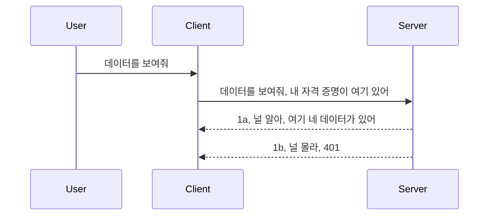

# 간단한 인증

MCP SDK는 OAuth 2.1 사용을 지원합니다. 솔직히 말해서 OAuth 2.1은 인증 서버, 리소스 서버, 자격 증명 전송, 코드 받기, 코드를 베어러 토큰으로 교환한 후 마침내 리소스 데이터를 가져오는 과정 등 꽤 복잡한 절차를 포함합니다. OAuth에 익숙하지 않은 경우(구현하기 좋은 방식이지만) 기본 수준의 인증부터 시작해 보안을 점점 강화해 나가는 것이 좋습니다. 그래서 이 장이 존재합니다. 더 고급 인증으로 여러분을 안내하기 위해서입니다.

## 인증, 우리가 의미하는 것은?

인증은 authentication과 authorization의 줄임말입니다. 여기에는 두 가지 작업이 필요합니다:

- **Authentication(인증)**: 누군가가 우리 집에 들어올 권리가 있는지, 즉 MCP 서버 기능이 있는 리소스 서버에 접근할 권리가 있는지를 확인하는 과정입니다.
- **Authorization(권한 부여)**: 사용자가 요청한 특정 리소스(예: 주문 또는 제품)에 접근할 권한이 있는지, 혹은 예를 들어 읽기 권한은 있지만 삭제 권한은 없는지 등을 확인하는 과정입니다.

## 자격 증명: 시스템에 나를 알리는 방법

대부분의 웹 개발자는 서버에 제공하는 자격 증명, 즉 해당 사용자가 여기 있을 수 있다는 인증 정보를 생각합니다. 이 자격 증명은 보통 사용자 이름과 비밀번호를 base64로 인코딩 한 것이거나 특정 사용자를 고유 식별하는 API 키입니다.

이는 보통 "Authorization"이라는 헤더에 다음과 같이 전송됩니다:

```json
{ "Authorization": "secret123" }
```

보통 이를 기본 인증(basic authentication)이라고 합니다. 전반적인 흐름은 다음과 같습니다:



흐름을 이해했으니, 어떻게 구현할 수 있을까요? 대부분의 웹 서버에는 미들웨어 개념이 있어 요청의 일부로 실행되어 자격 증명을 확인하고, 유효하면 요청을 통과시키고 그렇지 않으면 인증 오류를 반환합니다. 구현 예는 다음과 같습니다:

**Python**

```python
class AuthMiddleware(BaseHTTPMiddleware):
    async def dispatch(self, request, call_next):

        has_header = request.headers.get("Authorization")
        if not has_header:
            print("-> Missing Authorization header!")
            return Response(status_code=401, content="Unauthorized")

        if not valid_token(has_header):
            print("-> Invalid token!")
            return Response(status_code=403, content="Forbidden")

        print("Valid token, proceeding...")
       
        response = await call_next(request)
        # 응답에 고객 헤더를 추가하거나 어떤 식으로든 변경하세요
        return response


starlette_app.add_middleware(CustomHeaderMiddleware)
```

여기서는:

- `AuthMiddleware`라는 미들웨어를 만들고, 웹 서버가 `dispatch` 메서드를 호출합니다.
- 웹 서버에 미들웨어를 추가했습니다:

    ```python
    starlette_app.add_middleware(AuthMiddleware)
    ```

- Authorization 헤더가 있는지, 그리고 전송된 비밀이 유효한지 확인하는 검증 로직을 작성했습니다:

    ```python
    has_header = request.headers.get("Authorization")
    if not has_header:
        print("-> Missing Authorization header!")
        return Response(status_code=401, content="Unauthorized")

    if not valid_token(has_header):
        print("-> Invalid token!")
        return Response(status_code=403, content="Forbidden")
    ```

    비밀이 존재하고 유효하면 `call_next`를 호출해 요청을 통과시키고 응답을 반환합니다.

    ```python
    response = await call_next(request)
    # 응답에 고객 헤더를 추가하거나 어떤 방식으로든 변경하세요
    return response
    ```

웹 요청이 서버로 들어오면 미들웨어가 호출되어 구현에 따라 요청을 통과시키거나 권한이 없다는 오류를 반환합니다.

**TypeScript**

Express 프레임워크로 미들웨어를 만들어 MCP 서버에 도달하기 전에 요청을 가로챕니다. 코드는 다음과 같습니다:

```typescript
function isValid(secret) {
    return secret === "secret123";
}

app.use((req, res, next) => {
    // 1. Authorization 헤더가 존재합니까?
    if(!req.headers["Authorization"]) {
        res.status(401).send('Unauthorized');
    }
    
    let token = req.headers["Authorization"];

    // 2. 유효성을 확인하세요.
    if(!isValid(token)) {
        res.status(403).send('Forbidden');
    }

   
    console.log('Middleware executed');
    // 3. 요청을 요청 파이프라인의 다음 단계로 전달합니다.
    next();
});
```

이 코드는:

1. Authorization 헤더가 있는지 확인하고 없으면 401 오류를 보냅니다.
2. 자격 증명/토큰이 유효한지 확인하고 유효하지 않으면 403 오류를 보냅니다.
3. 요청 파이프라인에서 요청을 통과시켜 요구받은 리소스를 반환합니다.

## 연습: 인증 구현하기

지금까지 배운 내용을 사용해 구현해 봅시다. 계획은 다음과 같습니다:

서버

- 웹 서버와 MCP 인스턴스를 만듭니다.
- 서버에 미들웨어를 구현합니다.

클라이언트

- 자격 증명을 헤더를 통해 웹 요청으로 보냅니다.

### -1- 웹 서버와 MCP 인스턴스 생성

> **미리 보기:** 아래 TypeScript 예제에서는 HTTP 전송을 `mcp-session-id`로 키를 지정한 `transports` 맵으로 추적합니다(2025-11-25 MCP 사양 기준). `2026-07-28` 릴리스 후보는 `initialize` 핸드셰이크와 세션 ID를 완전히 제거하여 이 세션별 전송 맵이 사라지고 상태 없는 독립 요청으로 대체됩니다. 자세한 내용은 [MCP 변경 사항: 2026-07-28 릴리스 후보](../../01-CoreConcepts/mcp-2026-07-28-release-candidate.md)를 참조하십시오.

첫 단계로, 웹 서버 인스턴스와 MCP 서버를 생성해야 합니다.

**Python**

여기서는 MCP 서버 인스턴스를 만들고 starlette 웹 앱을 생성한 뒤 uvicorn으로 호스팅합니다.

```python
# MCP 서버 생성 중

app = FastMCP(
    name="MCP Resource Server",
    instructions="Resource Server that validates tokens via Authorization Server introspection",
    host=settings["host"],
    port=settings["port"],
    debug=True
)

# starlette 웹 앱 생성 중
starlette_app = app.streamable_http_app()

# uvicorn을 통해 앱 제공 중
async def run(starlette_app):
    import uvicorn
    config = uvicorn.Config(
            starlette_app,
            host=app.settings.host,
            port=app.settings.port,
            log_level=app.settings.log_level.lower(),
        )
    server = uvicorn.Server(config)
    await server.serve()

run(starlette_app)
```

이 코드에서:

- MCP 서버를 생성했습니다.
- MCP 서버에서 `app.streamable_http_app()`으로 starlette 웹 앱을 생성했습니다.
- uvicorn을 사용해 웹 앱을 호스팅 및 서비스했습니다 (`server.serve()`).

**TypeScript**

여기서는 MCP 서버 인스턴스를 생성합니다.

```typescript
const server = new McpServer({
      name: "example-server",
      version: "1.0.0"
    });

    // ... 서버 리소스, 도구, 그리고 프롬프트를 설정합니다 ...
```

MCP 서버 생성은 POST /mcp 라우트 정의 내에서 이루어져야 하므로 위 코드를 다음과 같이 옮깁니다:

```typescript
import express from "express";
import { randomUUID } from "node:crypto";
import { McpServer } from "@modelcontextprotocol/sdk/server/mcp.js";
import { StreamableHTTPServerTransport } from "@modelcontextprotocol/sdk/server/streamableHttp.js";
import { isInitializeRequest } from "@modelcontextprotocol/sdk/types.js"

const app = express();
app.use(express.json());

// 세션 ID로 전송 수단을 저장하는 맵
const transports: { [sessionId: string]: StreamableHTTPServerTransport } = {};

// 클라이언트에서 서버로의 통신을 위한 POST 요청 처리
app.post('/mcp', async (req, res) => {
  // 기존 세션 ID 확인
  const sessionId = req.headers['mcp-session-id'] as string | undefined;
  let transport: StreamableHTTPServerTransport;

  if (sessionId && transports[sessionId]) {
    // 기존 전송 수단 재사용
    transport = transports[sessionId];
  } else if (!sessionId && isInitializeRequest(req.body)) {
    // 새 초기화 요청
    transport = new StreamableHTTPServerTransport({
      sessionIdGenerator: () => randomUUID(),
      onsessioninitialized: (sessionId) => {
        // 세션 ID로 전송 수단 저장
        transports[sessionId] = transport;
      },
      // DNS 리바인딩 보호는 하위 호환성을 위해 기본적으로 비활성화되어 있습니다. 이 서버를
      // 로컬에서 실행 중이라면, 다음을 설정해야 합니다:
      // enableDnsRebindingProtection: true,
      // allowedHosts: ['127.0.0.1'],
    });

    // 닫힐 때 전송 수단 정리
    transport.onclose = () => {
      if (transport.sessionId) {
        delete transports[transport.sessionId];
      }
    };
    const server = new McpServer({
      name: "example-server",
      version: "1.0.0"
    });

    // ... 서버 리소스, 도구 및 프롬프트 설정 ...

    // MCP 서버에 연결
    await server.connect(transport);
  } else {
    // 잘못된 요청
    res.status(400).json({
      jsonrpc: '2.0',
      error: {
        code: -32000,
        message: 'Bad Request: No valid session ID provided',
      },
      id: null,
    });
    return;
  }

  // 요청 처리
  await transport.handleRequest(req, res, req.body);
});

// GET 및 DELETE 요청에 재사용 가능한 핸들러
const handleSessionRequest = async (req: express.Request, res: express.Response) => {
  const sessionId = req.headers['mcp-session-id'] as string | undefined;
  if (!sessionId || !transports[sessionId]) {
    res.status(400).send('Invalid or missing session ID');
    return;
  }
  
  const transport = transports[sessionId];
  await transport.handleRequest(req, res);
};

// SSE를 통한 서버에서 클라이언트로의 알림을 위한 GET 요청 처리
app.get('/mcp', handleSessionRequest);

// 세션 종료를 위한 DELETE 요청 처리
app.delete('/mcp', handleSessionRequest);

app.listen(3000);
```

이제 MCP 서버 생성이 `app.post("/mcp")` 안으로 옮겨진 것을 볼 수 있습니다.

다음 단계인 미들웨어 생성으로 넘어가 들어오는 자격 증명을 검증해 보겠습니다.

### -2- 서버에 미들웨어 구현하기

이제 미들웨어 부분입니다. `Authorization` 헤더의 자격 증명을 찾고 검증하는 미들웨어를 만들 겁니다. 허용 가능하면 요청은 계속 진행되어 도구 목록을 가져오거나 리소스를 읽거나 클라이언트가 요청한 MCP 기능을 실행합니다.

**Python**

미들웨어를 생성하기 위해 `BaseHTTPMiddleware`를 상속받는 클래스를 만들어야 합니다. 여기에서 중요한 두 가지가 있습니다:

- 요청 `request`: 헤더 정보를 읽습니다.
- `call_next`: 클라이언트가 허용할 수 있는 자격증명을 가져왔으면 호출할 콜백입니다.

먼저 `Authorization` 헤더가 없을 때를 처리해야 합니다:

```python
has_header = request.headers.get("Authorization")

# 헤더가 없으면 401로 실패하고, 그렇지 않으면 계속 진행합니다.
if not has_header:
    print("-> Missing Authorization header!")
    return Response(status_code=401, content="Unauthorized")
```

이 코드에서는 인증 실패 시 401 미승인 메시지를 보냅니다.

다음으로 자격 증명이 제출되었을 경우, 유효성을 이렇게 확인합니다:

```python
 if not valid_token(has_header):
    print("-> Invalid token!")
    return Response(status_code=403, content="Forbidden")
```

위 코드에서는 403 금지 메시지를 보내는 것을 볼 수 있습니다. 전체 미들웨어 구현은 다음과 같습니다:

```python
class AuthMiddleware(BaseHTTPMiddleware):
    async def dispatch(self, request, call_next):

        has_header = request.headers.get("Authorization")
        if not has_header:
            print("-> Missing Authorization header!")
            return Response(status_code=401, content="Unauthorized")

        if not valid_token(has_header):
            print("-> Invalid token!")
            return Response(status_code=403, content="Forbidden")

        print("Valid token, proceeding...")
        print(f"-> Received {request.method} {request.url}")
        response = await call_next(request)
        response.headers['Custom'] = 'Example'
        return response

```

훌륭합니다. 그런데 `valid_token` 함수는 뭘까요? 아래에 있습니다:

```python
# 프로덕션에서는 사용하지 마세요 - 개선하세요 !!
def valid_token(token: str) -> bool:
    # "Bearer " 접두어를 제거하세요
    if token.startswith("Bearer "):
        token = token[7:]
        return token == "secret-token"
    return False
```

분명히 개선이 필요합니다.

중요: 이런 비밀 값은 절대로 코드에 직접 해서는 안 됩니다. 실제로는 데이터 소스나 IDP(아이덴티티 서비스 제공자)에서 값을 가져오거나, 더 나아가 IDP가 자체 검증하도록 하는 것이 이상적입니다.

**TypeScript**

Express에서 구현하려면 미들웨어 함수를 인자로 받는 `use` 메서드를 호출해야 합니다.

우리는:

- 요청 객체의 `Authorization` 속성에서 자격 증명을 확인합니다.
- 자격 증명을 검증하고 유효하면 요청이 진행되어 클라이언트 MCP 요청이 수행되도록 합니다(예: 도구 목록 가져오기, 자원 읽기, 기타 MCP 관련 기능).

여기에서는 `Authorization` 헤더가 없으면 요청을 차단합니다:

```typescript
if(!req.headers["authorization"]) {
    res.status(401).send('Unauthorized');
    return;
}
```

헤더가 없으면 401 오류를 받습니다.

다음으로 자격 증명이 유효한지 확인하고 유효하지 않으면 이번에는 조금 다른 메시지로 요청을 중단합니다:

```typescript
if(!isValid(token)) {
    res.status(403).send('Forbidden');
    return;
} 
```

이제 403 오류임을 알 수 있습니다.

전체 코드는 다음과 같습니다:

```typescript
app.use((req, res, next) => {
    console.log('Request received:', req.method, req.url, req.headers);
    console.log('Headers:', req.headers["authorization"]);
    if(!req.headers["authorization"]) {
        res.status(401).send('Unauthorized');
        return;
    }
    
    let token = req.headers["authorization"];

    if(!isValid(token)) {
        res.status(403).send('Forbidden');
        return;
    }  

    console.log('Middleware executed');
    next();
});
```

웹 서버를 설정해 클라이언트가 보내는 자격 증명을 검사하는 미들웨어를 받도록 했습니다. 클라이언트 쪽은 어떻게 할까요?

### -3- 자격 증명을 헤더를 통해 담아 웹 요청 보내기

클라이언트가 헤더로 자격 증명을 전달하는지 확인해야 합니다. MCP 클라이언트를 사용할 것이므로 그 방법을 파악해야 합니다.

**Python**

클라이언트에서는 다음과 같이 자격 증명을 헤더에 전달해야 합니다:

```python
# 값을 하드코딩하지 말고 최소한 환경 변수나 더 안전한 저장소에 저장하세요
token = "secret-token"

async with streamablehttp_client(
        url = f"http://localhost:{port}/mcp",
        headers = {"Authorization": f"Bearer {token}"}
    ) as (
        read_stream,
        write_stream,
        session_callback,
    ):
        async with ClientSession(
            read_stream,
            write_stream
        ) as session:
            await session.initialize()
      
            # TODO, 클라이언트에서 하고 싶은 작업, 예: 도구 목록 표시, 도구 호출 등
```

`headers = {"Authorization": f"Bearer {token}"}` 처럼 `headers` 속성을 채우는 것을 주목하세요.

**TypeScript**

두 단계로 해결할 수 있습니다:

1. 자격 증명으로 구성 객체를 채웁니다.
2. 구성 객체를 전송(transport)에 전달합니다.

```typescript

// 여기처럼 값을 하드코딩하지 마세요. 최소한 환경 변수로 두고 개발 모드에서는 dotenv 같은 것을 사용하세요.
let token = "secret123"

// 클라이언트 전송 옵션 객체를 정의하세요
let options: StreamableHTTPClientTransportOptions = {
  sessionId: sessionId,
  requestInit: {
    headers: {
      "Authorization": "secret123"
    }
  }
};

// 옵션 객체를 전송에 전달하세요
async function main() {
   const transport = new StreamableHTTPClientTransport(
      new URL(serverUrl),
      options
   );
```

위에서 `options` 객체를 만들고 `requestInit` 속성 아래에 헤더를 배치한 부분을 볼 수 있습니다.

중요: 이 구현은 개선여지가 있습니다. 일단 HTTPS를 사용하지 않으면 이런 방식으로 자격 증명을 전달하는 건 꽤 위험합니다. 그리고 있더라도 자격 증명이 도난당할 수 있으므로 토큰을 쉽게 취소하고, 요청이 너무 빈번한지(봇 행동), 요청이 어디서 오는지 등 다양한 추가 검증이 필요합니다. 이 밖에도 고려할 점이 많습니다.

하지만 인증 없는 API 호출을 원하지 않는 아주 간단한 API에는 지금 방식도 좋은 출발점이 됩니다.

그럼, JSON 웹 토큰(JWT 또는 "JOT" 토큰) 같은 표준 형식을 사용해 보안을 강화해 봅시다.

## JSON 웹 토큰, JWT

간단한 자격 증명 전달보다 개선하고자 할 때 JWT 채택의 즉각적인 이점은 무엇일까요?

- **보안 향상**: 기본 인증에선 사용자 이름과 비밀번호를 base64 인코딩이나 API 키로 계속 전송해 위험이 커집니다. JWT는 사용자 이름과 비밀번호로 토큰을 받아서 사용하고, 이 토큰은 만료 시간이 있어 일정 기간 후 만료됩니다. JWT는 역할, 권한 범위 등을 통한 세밀한 접근 제어도 쉽게 해줍니다.
- **무상태성 및 확장성**: JWT는 모든 사용자 정보를 자체 포함(self-contained)하고 있어 서버 측 세션 저장이 필요 없으며, 토큰 검증도 클라이언트나 로컬에서 할 수 있습니다.
- **상호운용성과 연합(federation)**: JWT는 Open ID Connect의 핵심이며 Entra ID, Google Identity, Auth0 같은 알려진 ID 제공자와 같이 사용됩니다. 단일 로그인(SSO) 등 엔터프라이즈급 기능 지원도 가능합니다.
- **모듈성과 유연성**: JWT는 Azure API Management, NGINX 등 API 게이트웨이와 함께 사용할 수 있고, 인증 시나리오와 서버 간 통신(대리 및 위임 포함)도 지원합니다.
- **성능 및 캐싱**: JWT는 디코딩 후 캐싱할 수 있어 파싱 필요를 줄입니다. 고트래픽 앱의 처리량 향상과 인프라 부하 감소에 도움 됩니다.
- **고급 기능**: 서버에서 유효성을 검사하는 introspection(내부 점검)과 토큰 무효화(revocation)도 지원합니다.

이러한 이점들을 바탕으로 구현을 한 단계 올려봅시다.

## 기본 인증을 JWT로 변환하기

높은 수준에서 필요한 변경 사항은 다음과 같습니다:

- **JWT 토큰을 생성하는 법을 배우기**: 클라이언트에서 서버로 보낼 준비를 합니다.
- **JWT 토큰을 검증하기**: 검증 후 클라이언트가 리소스에 접근할 수 있게 합니다.
- **토큰 안전하게 저장하기**: 토큰을 어떻게 저장할지 결정합니다.
- **라우트 보호하기**: 우리 경우 MCP 기능과 경로를 보호합니다.
- **리프레시 토큰 추가하기**: 단기 토큰과 장기 리프레시 토큰을 만들어, 만료되면 새 토큰을 얻을 수 있게 하고, 리프레시 엔드포인트와 교체 전략도 마련합니다.

### -1- JWT 토큰 생성하기

우선 JWT 토큰은 다음 부분들로 구성됩니다:

- <strong>헤더</strong>, 사용 알고리즘과 토큰 타입.
- <strong>페이로드</strong>, sub(토큰이 나타내는 사용자/엔티티, 인증 시 보통 사용자 ID), exp(만료 시간), 역할(role) 같은 클레임.
- <strong>서명</strong>, 비밀키나 개인키로 서명한 부분.

이를 위해 헤더, 페이로드, 인코딩된 토큰을 생성해야 합니다.

**Python**

```python

import jwt
import jwt
from jwt.exceptions import ExpiredSignatureError, InvalidTokenError
import datetime

# JWT 서명에 사용되는 비밀 키
secret_key = 'your-secret-key'

header = {
    "alg": "HS256",
    "typ": "JWT"
}

# 사용자 정보 및 해당 클레임과 만료 시간
payload = {
    "sub": "1234567890",               # 주제 (사용자 ID)
    "name": "User Userson",                # 사용자 정의 클레임
    "admin": True,                     # 사용자 정의 클레임
    "iat": datetime.datetime.utcnow(),# 발급 시간
    "exp": datetime.datetime.utcnow() + datetime.timedelta(hours=1)  # 만료 시간
}

# 인코딩하기
encoded_jwt = jwt.encode(payload, secret_key, algorithm="HS256", headers=header)
```

위 코드에서:

- 알고리즘 HS256과 타입 JWT를 지정한 헤더를 정의했습니다.
- 사용자 ID(sub), 사용자 이름(name), 역할(role), 발급 시각(iat), 만료 시간(exp)을 포함한 페이로드를 구성해 앞서 언급한 만료 시간 제한성을 구현했습니다.

**TypeScript**

JWT 토큰 작성에 도움이 될 종속성이 필요합니다.

종속성

```sh

npm install jsonwebtoken
npm install --save-dev @types/jsonwebtoken
```

준비가 됐으니 헤더와 페이로드를 만들고 인코딩된 토큰을 생성해 봅시다.

```typescript
import jwt from 'jsonwebtoken';

const secretKey = 'your-secret-key'; // 프로덕션에서 환경 변수를 사용하세요

// 페이로드를 정의하세요
const payload = {
  sub: '1234567890',
  name: 'User usersson',
  admin: true,
  iat: Math.floor(Date.now() / 1000), // 발행 시간
  exp: Math.floor(Date.now() / 1000) + 60 * 60 // 1시간 후 만료
};

// 헤더 정의 (선택 사항, jsonwebtoken이 기본값을 설정함)
const header = {
  alg: 'HS256',
  typ: 'JWT'
};

// 토큰 생성하기
const token = jwt.sign(payload, secretKey, {
  algorithm: 'HS256',
  header: header
});

console.log('JWT:', token);
```

이 토큰은:

HS256 알고리즘으로 서명됨
유효 기간은 1시간
sub, name, admin, iat, exp 같은 클레임을 포함함

### -2- 토큰 검증하기

토큰 검증도 필요합니다. 서버에서 토큰 구조와 유효성을 확인해야합니다. 추가로 사용자가 우리 시스템에 등록된 지 등 여러 검증도 고려하는 것이 좋습니다.

토큰 검증을 위해 디코딩하고 내용을 읽은 후 유효성을 검사합니다:

**Python**

```python

# JWT를 디코딩하고 검증하기
try:
    decoded = jwt.decode(token, secret_key, algorithms=["HS256"])
    print("✅ Token is valid.")
    print("Decoded claims:")
    for key, value in decoded.items():
        print(f"  {key}: {value}")
except ExpiredSignatureError:
    print("❌ Token has expired.")
except InvalidTokenError as e:
    print(f"❌ Invalid token: {e}")

```


이 코드에서는 토큰, 비밀 키 및 선택한 알고리즘을 입력으로 사용하여 `jwt.decode`를 호출합니다. 유효성 검사 실패 시 오류가 발생하므로 try-catch 구문을 사용하는 점에 주목하세요.

**TypeScript**

여기서는 토큰을 디코딩한 버전을 얻기 위해 `jwt.verify`를 호출해야 하며, 이 토큰을 더 분석할 수 있습니다. 이 호출이 실패하면 토큰의 구조가 올바르지 않거나 더 이상 유효하지 않다는 뜻입니다.

```typescript

try {
  const decoded = jwt.verify(token, secretKey);
  console.log('Decoded Payload:', decoded);
} catch (err) {
  console.error('Token verification failed:', err);
}
```

참고: 앞서 언급했듯이, 이 토큰이 우리 시스템의 사용자를 가리키는지, 그리고 사용자가 주장하는 권한을 가지고 있는지 추가 확인을 수행해야 합니다.

다음으로 역할 기반 접근 제어, 즉 RBAC에 대해 살펴보겠습니다.

## 역할 기반 접근 제어 추가

다양한 역할에 따라 권한이 다르다는 것을 표현하고자 합니다. 예를 들어, 관리자는 모든 작업이 가능하고, 일반 사용자는 읽기/쓰기가 가능하며, 게스트는 읽기만 가능하다고 가정합니다. 따라서 다음과 같은 권한 수준이 있습니다:

- Admin.Write 
- User.Read
- Guest.Read

이러한 제어를 미들웨어로 구현하는 방법을 살펴보겠습니다. 미들웨어는 각 경로별로 추가할 수도 있고 모든 경로에 대해 추가할 수도 있습니다.

**Python**

```python
from starlette.middleware.base import BaseHTTPMiddleware
from starlette.responses import JSONResponse
import jwt

# 비밀 정보를 코드에 직접 포함하지 마세요, 이것은 시연 목적으로만 사용됩니다. 안전한 곳에서 읽어오세요.
SECRET_KEY = "your-secret-key" # 이것을 환경 변수에 넣으세요
REQUIRED_PERMISSION = "User.Read"

class JWTPermissionMiddleware(BaseHTTPMiddleware):
    async def dispatch(self, request, call_next):
        auth_header = request.headers.get("Authorization")
        if not auth_header or not auth_header.startswith("Bearer "):
            return JSONResponse({"error": "Missing or invalid Authorization header"}, status_code=401)

        token = auth_header.split(" ")[1]
        try:
            decoded = jwt.decode(token, SECRET_KEY, algorithms=["HS256"])
        except jwt.ExpiredSignatureError:
            return JSONResponse({"error": "Token expired"}, status_code=401)
        except jwt.InvalidTokenError:
            return JSONResponse({"error": "Invalid token"}, status_code=401)

        permissions = decoded.get("permissions", [])
        if REQUIRED_PERMISSION not in permissions:
            return JSONResponse({"error": "Permission denied"}, status_code=403)

        request.state.user = decoded
        return await call_next(request)


```

미들웨어를 추가하는 몇 가지 방법은 다음과 같습니다:

```python

# 대안 1: starlette 앱을 구성하는 동안 미들웨어 추가
middleware = [
    Middleware(JWTPermissionMiddleware)
]

app = Starlette(routes=routes, middleware=middleware)

# 대안 2: starlette 앱이 이미 구성된 후에 미들웨어 추가
starlette_app.add_middleware(JWTPermissionMiddleware)

# 대안 3: 경로별로 미들웨어 추가
routes = [
    Route(
        "/mcp",
        endpoint=..., # 핸들러
        middleware=[Middleware(JWTPermissionMiddleware)]
    )
]
```

**TypeScript**

`app.use`와 모든 요청에 대해 실행되는 미들웨어를 사용할 수 있습니다.

```typescript
app.use((req, res, next) => {
    console.log('Request received:', req.method, req.url, req.headers);
    console.log('Headers:', req.headers["authorization"]);

    // 1. 권한 헤더가 전송되었는지 확인하세요

    if(!req.headers["authorization"]) {
        res.status(401).send('Unauthorized');
        return;
    }
    
    let token = req.headers["authorization"];

    // 2. 토큰이 유효한지 확인하세요
    if(!isValid(token)) {
        res.status(403).send('Forbidden');
        return;
    }  

    // 3. 토큰 사용자가 우리 시스템에 존재하는지 확인하세요
    if(!isExistingUser(token)) {
        res.status(403).send('Forbidden');
        console.log("User does not exist");
        return;
    }
    console.log("User exists");

    // 4. 토큰에 올바른 권한이 있는지 검증하세요
    if(!hasScopes(token, ["User.Read"])){
        res.status(403).send('Forbidden - insufficient scopes');
    }

    console.log("User has required scopes");

    console.log('Middleware executed');
    next();
});

```

미들웨어에서 수행해야 할 여러 가지 작업과 반드시 해야 하는 작업이 있습니다:

1. 인증 헤더가 존재하는지 확인
2. 토큰이 유효한지 확인 — JWT 토큰의 무결성과 유효성을 검사하는 우리가 작성한 `isValid` 메서드를 호출합니다.
3. 사용자가 우리 시스템에 존재하는지 확인

   ```typescript
    // DB 내 사용자
   const users = [
     "user1",
     "User usersson",
   ]

   function isExistingUser(token) {
     let decodedToken = verifyToken(token);

     // TODO, DB에 사용자가 존재하는지 확인하기
     return users.includes(decodedToken?.name || "");
   }
   ```

   위에서는 아주 단순한 `users` 목록을 만들었는데, 실제로는 데이터베이스에 있어야 합니다.

4. 추가로, 토큰이 올바른 권한을 가지고 있는지도 확인해야 합니다.

   ```typescript
   if(!hasScopes(token, ["User.Read"])){
        res.status(403).send('Forbidden - insufficient scopes');
   }
   ```

   위 미들웨어 코드에서는 토큰에 User.Read 권한이 포함되어 있는지 확인하고, 없으면 403 오류를 반환합니다. 아래는 `hasScopes` 헬퍼 메서드입니다.

   ```typescript
   function hasScopes(scope: string, requiredScopes: string[]) {
     let decodedToken = verifyToken(scope);
    return requiredScopes.every(scope => decodedToken?.scopes.includes(scope));
  }
   ```

Have a think which additional checks you should be doing, but these are the absolute minimum of checks you should be doing.

Using Express as a web framework is a common choice. There are helpers library when you use JWT so you can write less code.

- `express-jwt`, helper library that provides a middleware that helps decode your token.
- `express-jwt-permissions`, this provides a middleware `guard` that helps check if a certain permission is on the token.

Here's what these libraries can look like when used:

```typescript
const express = require('express');
const jwt = require('express-jwt');
const guard = require('express-jwt-permissions')();

const app = express();
const secretKey = 'your-secret-key'; // put this in env variable

// Decode JWT and attach to req.user
app.use(jwt({ secret: secretKey, algorithms: ['HS256'] }));

// Check for User.Read permission
app.use(guard.check('User.Read'));

// multiple permissions
// app.use(guard.check(['User.Read', 'Admin.Access']));

app.get('/protected', (req, res) => {
  res.json({ message: `Welcome ${req.user.name}` });
});

// Error handler
app.use((err, req, res, next) => {
  if (err.code === 'permission_denied') {
    return res.status(403).send('Forbidden');
  }
  next(err);
});

```

이제 인증과 권한 부여에 미들웨어를 사용할 수 있다는 것을 보았습니다. MCP의 경우는 어떨까요? 인증 방법이 달라질까요? 다음 섹션에서 알아봅시다.

### -3- MCP에 RBAC 추가

지금까지 미들웨어를 통해 RBAC를 추가하는 방법을 보았지만, MCP에서는 기능별 RBAC를 쉽게 추가할 수 있는 방법이 없습니다. 그렇다면 어떻게 할까요? 클라이언트가 특정 도구를 호출할 권한이 있는지 확인하는 코드를 추가해야 합니다:

기능별 RBAC를 달성하는 몇 가지 방법이 있습니다. 그 중 일부는 다음과 같습니다:

- 권한 수준을 확인해야 하는 각 도구, 리소스, 프롬프트에 대한 체크를 추가합니다.

   **python**

   ```python
   @tool()
   def delete_product(id: int):
      try:
          check_permissions(role="Admin.Write", request)
      catch:
        pass # 클라이언트가 인증에 실패했습니다, 인증 오류를 발생시킵니다
   ```

   **typescript**

   ```typescript
   server.registerTool(
    "delete-product",
    {
      title: Delete a product",
      description: "Deletes a product",
      inputSchema: { id: z.number() }
    },
    async ({ id }) => {
      
      try {
        checkPermissions("Admin.Write", request);
        // 할 일, ID를 productService와 원격 항목에 전송하기
      } catch(Exception e) {
        console.log("Authorization error, you're not allowed");  
      }

      return {
        content: [{ type: "text", text: `Deletected product with id ${id}` }]
      };
    }
   );
   ```


- 고급 서버 접근 방식과 요청 핸들러를 사용하여 권한 체크를 해야 하는 위치를 최소화합니다.

   **Python**

   ```python
   
   tool_permission = {
      "create_product": ["User.Write", "Admin.Write"],
      "delete_product": ["Admin.Write"]
   }

   def has_permission(user_permissions, required_permissions) -> bool:
      # user_permissions: 사용자가 가진 권한 목록
      # required_permissions: 도구에 필요한 권한 목록
      return any(perm in user_permissions for perm in required_permissions)

   @server.call_tool()
   async def handle_call_tool(
     name: str, arguments: dict[str, str] | None
   ) -> list[types.TextContent]:
    # request.user.permissions가 사용자의 권한 목록이라고 가정
     user_permissions = request.user.permissions
     required_permissions = tool_permission.get(name, [])
     if not has_permission(user_permissions, required_permissions):
        # "도구 {name}을 호출할 권한이 없습니다" 오류 발생
        raise Exception(f"You don't have permission to call tool {name}")
     # 계속 진행하여 도구 호출
     # ...
   ```   
   

   **TypeScript**

   ```typescript
   function hasPermission(userPermissions: string[], requiredPermissions: string[]): boolean {
       if (!Array.isArray(userPermissions) || !Array.isArray(requiredPermissions)) return false;
       // 사용자가 최소한 하나의 필요한 권한을 가지고 있으면 true를 반환합니다
       
       return requiredPermissions.some(perm => userPermissions.includes(perm));
   }
  
   server.setRequestHandler(CallToolRequestSchema, async (request) => {
      const { params: { name } } = request;
  
      let permissions = request.user.permissions;
  
      if (!hasPermission(permissions, toolPermissions[name])) {
         return new Error(`You don't have permission to call ${name}`);
      }
  
      // 계속 진행하세요..
   });
   ```

   참고: 위 코드가 간단해지려면 미들웨어가 요청의 user 속성에 디코딩된 토큰을 할당해야 합니다.

### 요약

이제 일반적인 RBAC와 MCP용 RBAC 추가 방법에 대해 논의했습니다. 개념을 확실히 이해했는지 직접 보안 구현을 시도해볼 차례입니다.

## 과제 1: 기본 인증을 사용하여 mcp 서버와 mcp 클라이언트 구축하기

여기서는 헤더를 통해 자격 증명을 전송하는 방법을 배웁니다.

## 해답 1

[해답 1](./code/basic/README.md)

## 과제 2: 과제 1의 해답을 JWT를 사용하도록 업그레이드하기

첫 번째 해답을 가져와 이번에는 개선해봅시다.

Basic Auth 대신 JWT를 사용합시다.

## 해답 2

[해답 2](./solution/jwt-solution/README.md)

## 도전 과제

"MCP에 RBAC 추가" 항목에서 설명한 기능별 RBAC를 추가해보세요.

## 요약

이번 장에서 보안이 전혀 없는 상태에서 기본 보안, JWT를 거쳐 MCP에 어떻게 적용하는지 많은 것을 배웠기를 바랍니다.

우리는 맞춤형 JWT로 견고한 기반을 구축했지만, 확장함에 따라 표준 기반의 아이덴티티 모델로 나아가고 있습니다. Entra나 Keycloak 같은 IdP를 채택하면 토큰 발급, 유효성 검사, 수명 관리 작업을 신뢰받는 플랫폼에 위임할 수 있어 앱 로직과 사용자 경험에 집중할 수 있습니다.

이에 대한 더 자세한 내용은 [Entra 고급 장](../../05-AdvancedTopics/mcp-security-entra/README.md)에서 확인할 수 있습니다.

## 다음은

- 다음: [MCP 호스트 설정](../12-mcp-hosts/README.md)

---

<!-- CO-OP TRANSLATOR DISCLAIMER START -->
**면책 조항**:
이 문서는 AI 번역 서비스 [Co-op Translator](https://github.com/Azure/co-op-translator)를 사용하여 번역되었습니다. 정확성을 기하기 위해 노력하고 있으나, 자동 번역은 오류나 부정확한 부분이 있을 수 있음을 유의하시기 바랍니다. 원본 문서의 원어본이 권위 있는 자료로 간주되어야 합니다. 중요한 정보의 경우, 전문가의 인간 번역을 권장합니다. 이 번역 사용으로 인해 발생하는 오해나 잘못된 해석에 대해 당사는 책임을 지지 않습니다.
<!-- CO-OP TRANSLATOR DISCLAIMER END -->