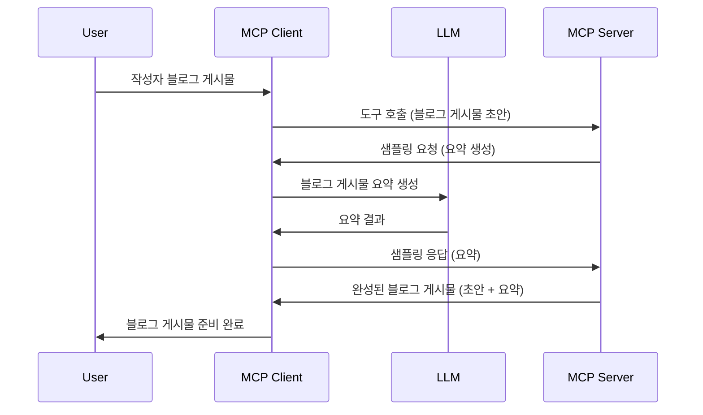

# 샘플링 - 클라이언트에 기능 위임하기

> **사용 중단 알림:** `2026-07-28` MCP 사양 릴리스 후보는 샘플링을 LLM 공급자 API와의 직접 통합으로 대체함에 따라 샘플링을 사용 중단으로 표기합니다. 샘플링은 `2025-11-25`과 공식 사용 중단 이후 최소 1년간 계속 작동하므로, 이 수업의 내용은 모두 유효하지만 새로운 서버 설계에서는 대체 패턴을 평가해야 합니다. 자세한 내용은 [MCP 변경사항: 2026-07-28 릴리스 후보](../../01-CoreConcepts/mcp-2026-07-28-release-candidate.md)를 참고하세요.

때로는 MCP 클라이언트와 MCP 서버가 공동 목적을 달성하기 위해 협력해야 할 때가 있습니다. 예를 들어, 서버가 클라이언트에 위치한 LLM의 도움이 필요할 수 있습니다. 이런 상황에선 샘플링을 사용해야 합니다.

몇 가지 사용 사례와 샘플링을 포함하는 솔루션 구축 방법을 알아봅시다.

## 개요

이번 수업에서는 샘플링을 언제 어디서 사용해야 하는지, 그리고 이를 어떻게 구성하는지에 중점을 둡니다.

## 학습 목표

이 장에서는 다음을 다룹니다:

- 샘플링이 무엇이고 언제 사용하는지 설명합니다.
- MCP에서 샘플링을 구성하는 방법을 보여줍니다.
- 샘플링 사용 사례 예시를 제공합니다.

## 샘플링이란 무엇이며 왜 사용하는가?

샘플링은 다음과 같이 작동하는 고급 기능입니다:



### 샘플링 요청

이제 신뢰할 만한 시나리오의 개요를 살펴봤으니, 서버가 클라이언트로 보내는 샘플링 요청에 대해 이야기해 봅시다. JSON-RPC 형식에서 이 요청은 다음과 같이 생겼을 수 있습니다:

```json
{
  "jsonrpc": "2.0",
  "id": 1,
  "method": "sampling/createMessage",
  "params": {
    "messages": [
      {
        "role": "user",
        "content": {
          "type": "text",
          "text": "Create a blog post summary of the following blog post: <BLOG POST>"
        }
      }
    ],
    "modelPreferences": {
      "hints": [
        {
          "name": "claude-3-sonnet"
        }
      ],
      "intelligencePriority": 0.8,
      "speedPriority": 0.5
    },
    "systemPrompt": "You are a helpful assistant.",
    "maxTokens": 100
  }
}
```

여기서 몇 가지 주목할 점이 있습니다:

- content -> text 아래의 프롬프트는 LLM에게 블로그 게시물 내용을 요약하라는 지시문입니다.

- **modelPreferences**. 이 부분은 단순한 선호도, 즉 LLM에 사용할 설정 추천입니다. 사용자는 이 권장 사항을 따를지 아니면 변경할지 선택할 수 있습니다. 여기에는 사용하는 모델과 속도 및 지능 우선 순위에 대한 권장 사항이 포함되어 있습니다.
- <strong>systemPrompt</strong>는 LLM에 개성을 부여하고 안내 지침을 포함하는 일반적인 시스템 프롬프트입니다.
- <strong>maxTokens</strong>는 작업에 사용할 권장 최대 토큰 수를 나타내는 속성입니다.

### 샘플링 응답

이 응답은 MCP 클라이언트가 MCP 서버에 보내는 것으로, 클라이언트가 LLM을 호출하고 그 응답을 기다린 후 이 메시지를 구성한 결과입니다. JSON-RPC 형식은 다음과 같습니다:

```json
{
  "jsonrpc": "2.0",
  "id": 1,
  "result": {
    "role": "assistant",
    "content": {
      "type": "text",
      "text": "Here's your abstract <ABSTRACT>"
    },
    "model": "gpt-5",
    "stopReason": "endTurn"
  }
}
```

요청한 대로 블로그 게시물 요약이 포함된 응답임을 확인할 수 있습니다. 또한 사용한 `model`이 요청한 "claude-3-sonnet"가 아니라 "gpt-5"인 점도 주목하세요. 이는 사용자가 사용할 모델을 바꿀 수 있다는 점과 샘플링 요청이 권장 사항임을 나타냅니다.

자, 이제 주요 흐름과 "블로그 게시물 생성 + 요약" 작업에 유용한 샘플링의 이해를 바탕으로 실제 작동시키기 위해 필요한 사항을 살펴봅시다.

### 메시지 유형

샘플링 메시지는 단순 텍스트에 국한되지 않고 이미지와 오디오도 전송할 수 있습니다. JSON-RPC의 차이점은 다음과 같습니다:

<strong>텍스트</strong>

```json
{
  "type": "text",
  "text": "The message content"
}
```

**이미지 콘텐츠**

```json
{
  "type": "image",
  "data": "base64-encoded-image-data",
  "mimeType": "image/jpeg"
}
```

**오디오 콘텐츠**

```json
{
  "type": "audio",
  "data": "base64-encoded-audio-data",
  "mimeType": "audio/wav"
}
```

> 참고: 샘플링에 대한 더 자세한 정보는 [공식 문서](https://modelcontextprotocol.io/specification/2025-11-25/client/sampling)를 참고하세요.

## 클라이언트에서 샘플링 구성 방법

> 참고: 서버만 구축하는 경우 여기서 많은 작업을 할 필요가 없습니다.

클라이언트에서는 다음과 같이 해당 기능을 지정해야 합니다:

```json
{
  "capabilities": {
    "sampling": {}
  }
}
```

선택한 클라이언트가 서버와 초기화할 때 이 구성이 적용됩니다.

## 샘플링 실행 예시 - 블로그 게시물 작성

샘플링 서버를 함께 코딩해 봅시다. 다음을 수행해야 합니다:

1. 서버에 도구를 생성합니다.
1. 도구는 샘플링 요청을 생성해야 합니다.
1. 도구는 클라이언트 샘플링 요청에 대한 응답을 기다려야 합니다.
1. 도구 결과가 생성되어야 합니다.

코드를 단계별로 살펴봅시다:

### -1- 도구 생성

**python**

```python
@mcp.tool()
async def create_blog(title: str, content: str, ctx: Context[ServerSession, None]) -> str:
    """Create a blog post and generate a summary"""

```

### -2- 샘플링 요청 생성

도구에 다음 코드를 추가하세요:

**python**

```python
post = BlogPost(
        id=len(posts) + 1,
        title=title,
        content=content,
        abstract=""
    )

prompt = f"Create an abstract of the following blog post: title: {title} and draft: {content} "

result = await ctx.session.create_message(
        messages=[
            SamplingMessage(
                role="user",
                content=TextContent(type="text", text=prompt),
            )
        ],
        max_tokens=100,
)

```

### -3- 응답 대기 및 응답 반환

**python**

```python
post.abstract = result.content.text

posts.append(post)

# 완성된 제품을 반환하십시오
return json.dumps({
    "id": post.title,
    "abstract": post.abstract
})
```

### -4- 전체 코드

**python**

```python
from starlette.applications import Starlette
from starlette.routing import Mount, Host

from mcp.server.fastmcp import Context, FastMCP

from mcp.server.session import ServerSession
from mcp.types import SamplingMessage, TextContent

import json


from uuid import uuid4
from typing import List
from pydantic import BaseModel


mcp = FastMCP("Blog post generator")

# app = FastAPI()

posts = []

class BlogPost(BaseModel):
    id: int
    title: str
    content: str
    abstract: str

posts: List[BlogPost] = []

@mcp.tool()
async def create_blog(title: str, content: str, ctx: Context[ServerSession, None]) -> str:
    """Create a blog post and generate a summary"""

    post = BlogPost(
        id=len(posts) + 1,
        title=title,
        content=content,
        abstract=""
    )

    prompt = f"Create an abstract of the following blog post: title: {title} and draft: {content} "

    result = await ctx.session.create_message(
        messages=[
            SamplingMessage(
                role="user",
                content=TextContent(type="text", text=prompt),
            )
        ],
        max_tokens=100,
    )

    post.abstract = result.content.text

    posts.append(post)

    # 전체 블로그 게시물을 반환합니다
    return json.dumps({
        "id": post.title,
        "abstract": post.abstract
    })

if __name__ == "__main__":
    print("Starting server...")
    # mcp.run()
    mcp.run(transport="streamable-http")

# 다음 명령어로 앱을 실행합니다: python server.py
```

### -5- Visual Studio Code에서 테스트하기

Visual Studio Code에서 테스트하려면 다음 단계를 따르세요:

1. 터미널에서 서버 시작
1. <em>mcp.json</em>에 추가하고 (서버가 시작되어 있는지 확인) 예를 들어 다음과 같이:

   ```json
   "servers": {
      "blog-server": {
        "type": "http",
        "url": "http://localhost:8000/mcp"
      }
   }
   ```

1. 프롬프트 입력:

   ```text
   create a blog post named "Where Python comes from", the content is "Python is actually named after Monty Python Flying Circus"
   ```

1. 샘플링이 진행되도록 허용하세요. 처음 테스트하면 추가 대화상자가 나타나니 승인한 후 도구 실행을 묻는 일반 대화상자가 표시됩니다.

1. 결과를 확인하세요. GitHub Copilot Chat에서 보기 좋게 렌더링된 결과와 함께 원시 JSON 응답도 검사할 수 있습니다.

<strong>보너스</strong>. Visual Studio Code 도구는 샘플링 지원이 탁월합니다. 설치된 서버에 대해 샘플링 접근 권한을 다음과 같이 구성할 수 있습니다:

1. 확장 섹션으로 이동합니다.
1. "MCP SERVERS - INSTALLED" 섹션에서 설치된 서버의 톱니바퀴 아이콘을 선택합니다.
1. "모델 접근 구성"을 선택하면 GitHub Copilot이 샘플링 수행 시 어떤 모델을 사용할 수 있는지 선택할 수 있습니다. "샘플링 요청 보기"를 선택하면 최근 발생한 모든 샘플링 요청을 확인할 수 있습니다.

## 과제

이 과제에서는 약간 다른 샘플링, 즉 상품 설명 생성을 지원하는 샘플링 통합을 구축합니다. 시나리오는 다음과 같습니다:

<strong>시나리오</strong>: 전자상거래 백오피스 직원이 상품 설명 생성을 위해 너무 많은 시간이 소요되고 있습니다. 따라서 "title"과 "keywords"를 인수로 받아 완성된 상품과 "description" 필드를 클라이언트 LLM으로 채우는 "create_product" 도구를 호출할 수 있는 솔루션을 구축해야 합니다.

TIP: 앞서 배운 내용을 활용하여 이 서버와 도구를 샘플링 요청으로 구축하세요.

## 솔루션

[솔루션](./solution/README.md)

## 핵심 요점

샘플링은 서버가 LLM 도움을 필요로 할 때 클라이언트로 작업을 위임할 수 있게 하는 강력한 기능입니다.

## 다음 단계

- [4장 - 실무 구현](../../04-PracticalImplementation/README.md)

---

<!-- CO-OP TRANSLATOR DISCLAIMER START -->
**면책 조항**:
이 문서는 AI 번역 서비스 [Co-op Translator](https://github.com/Azure/co-op-translator)를 사용하여 번역되었습니다. 정확성을 기하기 위해 노력하고 있으나, 자동 번역은 오류나 부정확한 부분이 있을 수 있음을 유의하시기 바랍니다. 원본 문서의 원어본이 권위 있는 자료로 간주되어야 합니다. 중요한 정보의 경우, 전문가의 인간 번역을 권장합니다. 이 번역 사용으로 인해 발생하는 오해나 잘못된 해석에 대해 당사는 책임을 지지 않습니다.
<!-- CO-OP TRANSLATOR DISCLAIMER END -->