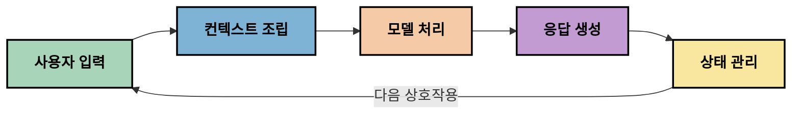
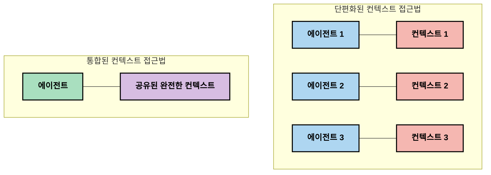
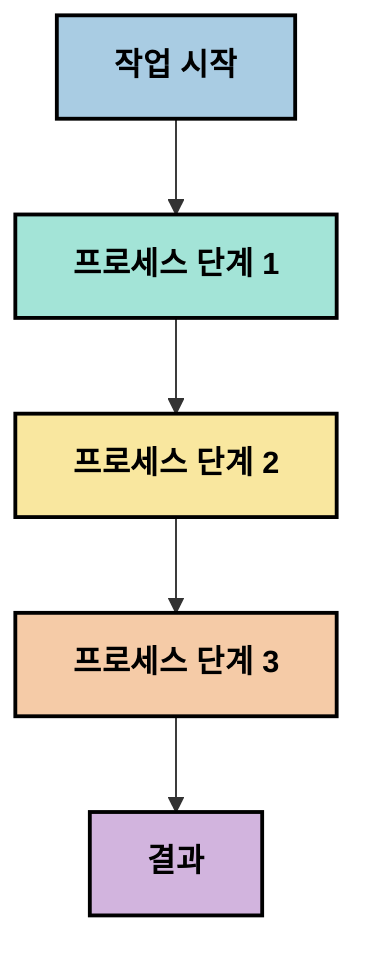
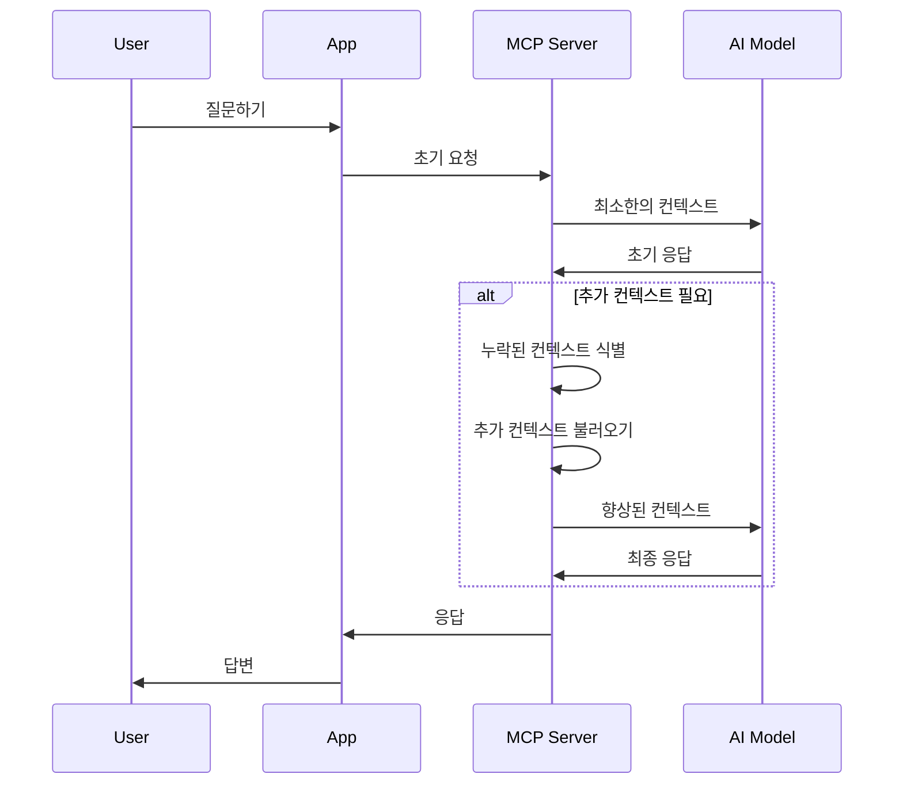
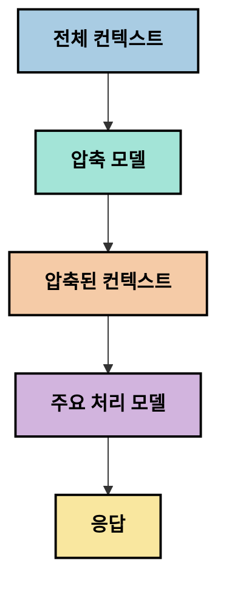
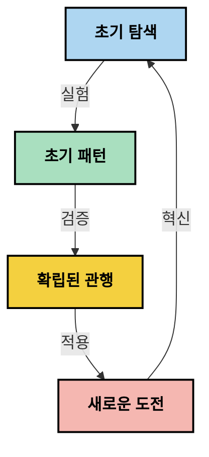

# 컨텍스트 엔지니어링: MCP 생태계의 새로운 개념

## 개요

컨텍스트 엔지니어링은 AI 공간에서 떠오르는 개념으로, 클라이언트와 AI 서비스 간의 상호작용 전반에서 정보가 어떻게 구조화되고 전달되며 유지되는지를 탐구합니다. Model Context Protocol (MCP) 생태계가 발전함에 따라, 컨텍스트를 효과적으로 관리하는 방법에 대한 이해가 점점 더 중요해지고 있습니다. 이 모듈에서는 컨텍스트 엔지니어링의 개념을 소개하고 MCP 구현에서의 잠재적 응용을 탐색합니다.

## 학습 목표

이 모듈을 마칠 때쯤 여러분은:

- 컨텍스트 엔지니어링이라는 새로운 개념과 그것이 MCP 응용에 미칠 잠재적 역할을 이해할 수 있습니다
- MCP 프로토콜 설계가 해결하는 컨텍스트 관리의 주요 과제를 식별할 수 있습니다
- 더 나은 컨텍스트 처리를 통해 모델 성능을 향상시키는 기술을 탐구할 수 있습니다
- 컨텍스트의 효과성을 측정하고 평가하는 접근 방식을 고려할 수 있습니다
- MCP 프레임워크를 통해 이러한 새로운 개념을 적용하여 AI 경험을 개선할 수 있습니다

## 컨텍스트 엔지니어링 소개

컨텍스트 엔지니어링은 사용자, 애플리케이션, AI 모델 간 정보 흐름을 의도적으로 설계하고 관리하는 데 초점을 맞춘 새로운 개념입니다. 프롬프트 엔지니어링과 같은 확립된 분야와 달리, 컨텍스트 엔지니어링은 AI 모델에 적절한 정보를 적시에 제공하는 고유한 과제를 해결하기 위해 실무자들이 정의해 나가고 있는 과정입니다.

대형 언어 모델(LLM)이 발전함에 따라, 컨텍스트의 중요성이 점점 명확해졌습니다. 제공하는 컨텍스트의 품질, 관련성, 구조는 모델 출력에 직접적인 영향을 미칩니다. 컨텍스트 엔지니어링은 이 관계를 탐구하고 효과적인 컨텍스트 관리 원칙을 개발하려고 합니다.

> "2025년, 모델들은 매우 지능적입니다. 하지만 가장 똑똑한 인간도 자신에게 요구되는 작업의 맥락 없이는 효과적으로 일을 수행할 수 없습니다... '컨텍스트 엔지니어링'은 프롬프트 엔지니어링의 다음 단계입니다. 동적 시스템에서 이를 자동으로 처리하는 것입니다." — Walden Yan, Cognition AI

컨텍스트 엔지니어링은 다음을 포함할 수 있습니다:

1. **컨텍스트 선택**: 주어진 작업에 관련 있는 정보를 결정
2. **컨텍스트 구조화**: 모델의 이해를 극대화하기 위해 정보를 조직
3. **컨텍스트 전달**: 정보를 모델에 보낼 때와 방법 최적화
4. **컨텍스트 유지**: 시간 경과에 따른 상태 및 컨텍스트 진화 관리
5. **컨텍스트 평가**: 컨텍스트의 효과를 측정하고 개선

이러한 주제들은 LLM에 컨텍스트를 제공하는 표준화된 방법을 제시하는 MCP 생태계에 특히 관련이 깊습니다.


## 컨텍스트 여정 관점

컨텍스트 엔지니어링을 시각화하는 한 가지 방법은 MCP 시스템 내에서 정보가 거치는 여정을 추적하는 것입니다:



### 컨텍스트 여정의 주요 단계:

1. **사용자 입력**: 사용자로부터 받은 원본 정보(텍스트, 이미지, 문서)
2. **컨텍스트 조립**: 사용자 입력과 시스템 컨텍스트, 대화 이력 및 기타 검색 정보를 결합
3. **모델 처리**: 조립된 컨텍스트를 AI 모델이 처리
4. **응답 생성**: 제공된 컨텍스트를 기반으로 모델이 출력 생성
5. **상태 관리**: 상호작용을 기반으로 시스템 내부 상태 업데이트

이 관점은 AI 시스템에서 컨텍스트의 동적 특성을 강조하며 각 단계에서 정보를 최적으로 관리하는 방법에 대한 중요한 질문을 제기합니다.

## 컨텍스트 엔지니어링의 새로운 원칙

컨텍스트 엔지니어링 분야가 형성됨에 따라, 실무자들 사이에서 몇 가지 초기 원칙들이 등장하고 있습니다. 이들 원칙은 MCP 구현 선택에 도움을 줄 수 있습니다:

### 원칙 1: 컨텍스트를 완전히 공유하라

컨텍스트는 시스템의 모든 구성 요소 간에 단편화되지 않고 완전하게 공유되어야 합니다. 컨텍스트가 분산되면 시스템의 한 부분에서 내려진 결정이 다른 부분의 결정과 충돌할 수 있습니다.



MCP 응용에서 이는 컨텍스트가 파이프라인 전체를 원활하게 흐르도록 설계한다는 것을 의미합니다. 분할되어 별도로 다뤄지는 대신 말입니다.

### 원칙 2: 행동이 내포하는 암묵적 결정을 인식하라

모델이 취하는 각 행동은 컨텍스트를 해석하는 방법에 관한 암묵적 결정을 포함합니다. 여러 구성 요소가 서로 다른 컨텍스트에 따라 행동할 경우 이러한 암묵적 결정이 충돌하여 일관성 없는 결과를 낳을 수 있습니다.

이 원칙은 MCP 응용에 중요한 시사점을 가집니다:
- 분할된 컨텍스트로 병행 실행하기보다는 복잡한 작업을 선형 처리하는 것을 선호
- 모든 결정 지점이 동일한 컨텍스트 정보에 접근할 수 있도록 보장
- 후속 단계가 이전 결정의 전체 컨텍스트를 볼 수 있도록 시스템 설계

### 원칙 3: 컨텍스트 깊이와 윈도우 한계 간 균형을 맞춰라

대화 및 프로세스가 길어지면 컨텍스트 윈도우는 결국 초과됩니다. 효과적인 컨텍스트 엔지니어링은 포괄적인 컨텍스트와 기술적 한계 간의 이 긴장을 관리하는 접근법들을 탐구합니다.

탐색 중인 잠재적 접근법은 다음과 같습니다:
- 중요한 정보를 유지하면서 토큰 사용량을 줄이는 컨텍스트 압축
- 현재 필요에 따른 관련성 기반 점진적 컨텍스트 로딩
- 주요 결정 및 사실을 보존하며 이전 상호작용 요약

## 컨텍스트 과제와 MCP 프로토콜 설계

Model Context Protocol (MCP)은 컨텍스트 관리의 고유한 과제를 인식하여 설계되었습니다. 이 과제들을 이해하면 MCP 프로토콜 설계의 주요 측면을 설명하는 데 도움이 됩니다:


### 과제 1: 컨텍스트 윈도우 제한
대부분의 AI 모델은 고정된 컨텍스트 윈도우 크기를 가지고 있어 한 번에 처리할 수 있는 정보량이 제한됩니다.

**MCP 설계 대응:**
- 프로토콜은 효율적으로 참조할 수 있는 구조화된 자원 기반 컨텍스트를 지원
- 자원은 페이지 단위로 나누어 점진적으로 로드 가능

### 과제 2: 관련성 판단
컨텍스트에 포함할 가장 관련성 높은 정보를 결정하는 것은 어렵습니다.

**MCP 설계 대응:**
- 필요에 따라 정보를 동적으로 검색할 수 있는 유연한 도구 제공
- 일관된 컨텍스트 구성을 가능하게 하는 구조화된 프롬프트 지원

### 과제 3: 컨텍스트 지속성
상호작용 간 상태 관리는 컨텍스트를 세심하게 추적해야 합니다.

**MCP 설계 대응:**
- 표준화된 세션 관리
- 컨텍스트 진화를 위한 명확한 상호작용 패턴 정의

### 과제 4: 멀티모달 컨텍스트
텍스트, 이미지, 구조화 데이터 등 다양한 유형의 데이터는 각각 다른 처리가 필요합니다.

**MCP 설계 대응:**
- 다양한 콘텐츠 유형을 수용하는 프로토콜 설계
- 멀티모달 정보를 표준화된 표현으로 관리

### 과제 5: 보안 및 개인 정보 보호
컨텍스트에는 민감한 정보가 포함되어 있어 보호가 필요합니다.

**MCP 설계 대응:**
- 클라이언트와 서버 책임 간 명확한 경계 설정
- 데이터 노출을 최소화하는 로컬 처리 옵션 제공

이러한 과제와 MCP가 이를 어떻게 해결하는지를 이해하면 더 진보된 컨텍스트 엔지니어링 기술 탐색의 기초가 됩니다.

## 새로운 컨텍스트 엔지니어링 접근법

컨텍스트 엔지니어링 분야가 발전함에 따라 여러 유망한 접근법이 나타나고 있습니다. 이는 확립된 최선의 관행이 아닌 현재의 사고를 반영하며 MCP 구현 경험이 쌓임에 따라 발전할 것입니다.

### 1. 단일 스레드 선형 처리

컨텍스트를 분산하는 다중 에이전트 아키텍처와 달리, 일부 실무자들은 단일 스레드 선형 처리가 더 일관된 결과를 낸다는 것을 발견하고 있습니다. 이는 통합된 컨텍스트 유지를 강조하는 원칙과 일치합니다.



이 접근법은 병렬 처리보다 덜 효율적으로 보일 수 있지만, 각 단계가 이전 결정의 완전한 이해를 기반으로 하기 때문에 더 일관되고 신뢰할 수 있는 결과를 자주 제공합니다.

### 2. 컨텍스트 청킹 및 우선순위 지정

큰 컨텍스트를 관리 가능한 조각으로 나누고 가장 중요한 부분에 우선순위를 부여합니다.

```python
# 개념적 예시: 컨텍스트 청킹 및 우선순위 지정
def process_with_chunked_context(documents, query):
    # 1. 문서를 더 작은 청크로 나눕니다
    chunks = chunk_documents(documents)
    
    # 2. 각 청크에 대한 관련성 점수를 계산합니다
    scored_chunks = [(chunk, calculate_relevance(chunk, query)) for chunk in chunks]
    
    # 3. 관련성 점수에 따라 청크를 정렬합니다
    sorted_chunks = sorted(scored_chunks, key=lambda x: x[1], reverse=True)
    
    # 4. 가장 관련성 높은 청크를 컨텍스트로 사용합니다
    context = create_context_from_chunks([chunk for chunk, score in sorted_chunks[:5]])
    
    # 5. 우선순위가 지정된 컨텍스트로 처리합니다
    return generate_response(context, query)
```

위 개념은 대형 문서를 관리 가능한 조각으로 나누고 컨텍스트에 가장 관련 있는 부분만 선택하는 방법을 보여줍니다. 이 방법은 컨텍스트 윈도우 제한 내에서 작업하면서도 방대한 지식 기반을 활용하는 데 도움을 줄 수 있습니다.

### 3. 점진적 컨텍스트 로딩

필요한 만큼 점진적으로 컨텍스트를 로딩하고 한 번에 모두 로드하지 않습니다.



점진적 컨텍스트 로딩은 최소한의 컨텍스트로 시작하여 필요할 때만 확장합니다. 단순 질의에서는 토큰 사용량을 크게 줄이면서도 복잡한 질문을 처리할 수 있는 능력을 유지할 수 있습니다.

### 4. 컨텍스트 압축 및 요약

핵심 정보를 보존하면서 컨텍스트 크기를 줄입니다.



컨텍스트 압축은 다음에 중점을 둡니다:
- 중복 정보 제거
- 긴 내용을 요약
- 핵심 사실 및 세부 사항 추출
- 중요한 컨텍스트 요소 보존
- 토큰 효율성 최적화

이 접근법은 긴 대화를 컨텍스트 윈도우 내에서 유지하거나 대용량 문서를 효율적으로 처리하는 데 특히 유용합니다. 일부 실무자들은 대화 이력의 컨텍스트 압축 및 요약을 위해 특화된 모델을 사용하고 있습니다.


## 탐색적 컨텍스트 엔지니어링 고려사항

컨텍스트 엔지니어링 분야를 탐구하면서 MCP 구현 시 염두에 두어야 할 몇 가지 고려사항이 있습니다. 이는 권고되는 최선의 관행이 아니라 특정 사용 사례에서 개선을 가져올 수 있는 탐색 영역입니다.

### 컨텍스트 목표 명확히 하기

복잡한 컨텍스트 관리 솔루션을 구현하기 전에 달성하고자 하는 바를 명확히 하십시오:
- 모델이 성공하기 위해 필요한 구체적인 정보는 무엇인가?
- 필수 정보와 보조 정보는 무엇인가?
- 성능 제약 조건(지연, 토큰 제한, 비용)은 무엇인가?

### 계층적 컨텍스트 접근법 탐색

일부 실무자들은 개념적 계층으로 배열된 컨텍스트에서 성공을 보고 있습니다:
- **핵심 계층**: 모델이 항상 필요한 필수 정보
- **상황별 계층**: 현재 상호작용에 특화된 컨텍스트
- **지원 계층**: 도움이 될 수 있는 추가 정보
- **대체 계층**: 필요할 때만 접근하는 정보

### 검색 전략 조사

컨텍스트의 효과성은 정보를 검색하는 방식에 따라 달라집니다:
- 개념적으로 관련 있는 정보를 찾기 위한 의미 검색 및 임베딩
- 특정 사실 세부 정보를 위한 키워드 기반 검색
- 여러 검색 방법을 결합한 하이브리드 접근법
- 카테고리, 날짜, 출처 등에 근거한 메타데이터 필터링으로 범위 축소

### 컨텍스트 일관성 실험

컨텍스트의 구조와 흐름은 모델 이해에 영향을 줄 수 있습니다:
- 관련 정보를 함께 그룹화
- 일관된 형식과 조직 사용
- 적절한 경우 논리적 또는 시간적 순서 유지
- 모순된 정보 피하기

### 다중 에이전트 아키텍처의 트레이드오프 평가

다중 에이전트 아키텍처는 많은 AI 프레임워크에서 인기가 있지만, 컨텍스트 관리에는 상당한 어려움이 따릅니다:
- 컨텍스트 단편화로 에이전트 간 결정의 불일치 발생 가능
- 병렬 처리가 조화시키기 어려운 충돌 초래 가능
- 에이전트 간 통신 오버헤드로 인해 성능 이익 상쇄 가능
- 일관성을 유지하기 위한 복잡한 상태 관리 필요

많은 경우, 단일 에이전트 접근법이 분산된 컨텍스트를 가진 다중 전문 에이전트보다 더 신뢰할 수 있는 결과를 낼 수 있습니다.

### 평가 방법 개발

컨텍스트 엔지니어링을 지속적으로 개선하려면 성공을 어떻게 측정할지 고려하십시오:
- 다양한 컨텍스트 구조에 대한 A/B 테스트
- 토큰 사용량과 응답 시간 모니터링
- 사용자 만족도 및 작업 완료율 추적
- 컨텍스트 전략 실패 시점 및 이유 분석

이러한 고려사항은 컨텍스트 엔지니어링 분야의 활발한 탐색 영역을 나타냅니다. 분야가 성숙함에 따라 더 명확한 패턴과 관행이 등장할 것입니다.

## 컨텍스트 효과성 측정: 발전하는 프레임워크

컨텍스트 엔지니어링이 개념으로 떠오르면서, 실무자들은 그 효과를 어떻게 측정할지 탐구하기 시작했습니다. 아직 확립된 프레임워크는 없으나, 향후 작업을 안내할 수 있는 다양한 메트릭이 고려되고 있습니다.

### 잠재적 측정 차원


#### 1. 입력 효율성 고려사항

- **컨텍스트 대 응답 비율**: 응답 크기에 비해 얼마나 많은 컨텍스트가 필요한가?
- **토큰 활용도**: 제공된 컨텍스트 토큰 중 얼마나 많은 비율이 응답에 영향을 미치는가?
- **컨텍스트 축소**: 원시 정보를 얼마나 효과적으로 압축할 수 있는가?

#### 2. 성능 고려사항

- **지연 영향**: 컨텍스트 관리는 응답 시간에 어떤 영향을 미치는가?
- **토큰 경제성**: 토큰 사용을 효과적으로 최적화하고 있는가?
- **검색 정밀도**: 검색된 정보의 관련성은 어느 정도인가?
- **자원 활용도**: 필요한 계산 자원은 어느 정도인가?

#### 3. 품질 고려사항

- **응답 관련성**: 응답이 질의에 얼마나 잘 부합하는가?
- **사실 정확도**: 컨텍스트 관리가 사실 정확도를 개선하는가?
- <strong>일관성</strong>: 유사한 질의에 대해 응답이 일관적인가?
- <strong>환상률</strong>: 더 좋은 컨텍스트가 모델의 오류를 줄이는가?

#### 4. 사용자 경험 고려사항

- **추가 질의율**: 사용자가 얼마나 자주 명확한 설명을 요청하는가?
- **작업 완료율**: 사용자가 목표를 성공적으로 달성하는가?
- **만족도 지표**: 사용자가 경험을 어떻게 평가하는가?

### 측정을 위한 탐색적 접근법

MCP 구현에서 컨텍스트 엔지니어링을 실험할 때 다음 탐색적 접근법을 고려하십시오:

1. **기준선 비교**: 복잡한 방법을 시험하기 전에 단순한 컨텍스트 접근법으로 기준선을 설정

2. **점진적 변화**: 한 번에 한 가지 요소만 변경하여 그 효과를 분리

3. **사용자 중심 평가**: 정량적 메트릭과 질적 사용자 피드백 결합

4. **실패 분석**: 컨텍스트 전략이 실패한 사례를 조사하여 개선점 이해

5. **다차원 평가**: 효율성, 품질, 사용자 경험 간의 트레이드오프 고려

이 실험적이고 다면적인 측정 접근법은 떠오르는 컨텍스트 엔지니어링의 성격과 일치합니다.

## 마무리 생각

컨텍스트 엔지니어링은 효과적인 MCP 응용에 중심이 될 수 있는 새로운 탐색 영역입니다. 시스템 내에서 정보가 흐르는 방식을 신중하게 고려하면, 더 효율적이고 정확하며 사용자에게 가치 있는 AI 경험을 만들 수 있습니다.

이 모듈에서 설명한 기술과 접근법은 이 분야 초기의 사고를 반영할 뿐, 확립된 관행은 아닙니다. AI 역량이 발전하고 이해가 깊어짐에 따라 컨텍스트 엔지니어링은 보다 정의된 학문이 될 수 있습니다. 지금은 실험과 신중한 측정을 결합한 접근법이 가장 생산적일 것으로 보입니다.

## 전망 가능한 미래 방향

컨텍스트 엔지니어링 분야는 아직 초기 단계이지만 다음과 같은 유망한 방향들이 있습니다:

- 컨텍스트 엔지니어링 원칙이 모델 성능, 효율성, 사용자 경험 및 신뢰성에 큰 영향을 미칠 수 있음
- 포괄적 컨텍스트 관리를 갖춘 단일 스레드 접근법이 많은 사용 사례에서 다중 에이전트 아키텍처보다 성능이 우수할 수 있음
- 전문화된 컨텍스트 압축 모델이 AI 파이프라인의 표준 구성요소가 될 가능성
- 컨텍스트 완전성과 토큰 제한 간 긴장이 컨텍스트 처리 혁신을 견인할 전망
- 모델이 인간과 효율적 소통을 더욱 잘하게 되면 진정한 다중 에이전트 협업이 보다 실현 가능해질 전망
- MCP 구현이 현재 실험에서 나타나는 컨텍스트 관리 패턴을 표준화하는 방향으로 발전할 수 있음



## 자료

### 공식 MCP 자료
- [Model Context Protocol Website](https://modelcontextprotocol.io/)
- [Model Context Protocol Specification](https://github.com/modelcontextprotocol/modelcontextprotocol)

- [MCP 문서](https://modelcontextprotocol.io/docs)
- [MCP C# SDK](https://github.com/modelcontextprotocol/csharp-sdk)
- [MCP Python SDK](https://github.com/modelcontextprotocol/python-sdk)
- [MCP TypeScript SDK](https://github.com/modelcontextprotocol/typescript-sdk)
- [MCP Inspector](https://github.com/modelcontextprotocol/inspector) - MCP 서버용 시각적 테스트 도구

### 컨텍스트 엔지니어링 아티클
- [멀티 에이전트 구축하지 마세요: 컨텍스트 엔지니어링 원칙](https://cognition.ai/blog/dont-build-multi-agents) - Walden Yan의 컨텍스트 엔지니어링 원칙에 대한 통찰
- [에이전트 구축 실용 가이드](https://cdn.openai.com/business-guides-and-resources/a-practical-guide-to-building-agents.pdf) - OpenAI의 효과적인 에이전트 설계 가이드
- [효과적인 에이전트 구축법](https://www.anthropic.com/engineering/building-effective-agents) - Anthropic의 에이전트 개발 접근법

### 관련 연구
- [대형 언어 모델을 위한 동적 검색 증강](https://arxiv.org/abs/2310.01487) - 동적 검색 방법에 관한 연구
- [중간에 잃다: 언어 모델의 긴 컨텍스트 사용법](https://arxiv.org/abs/2307.03172) - 컨텍스트 처리 패턴에 대한 중요한 연구
- [CLIP Latents를 활용한 계층적 텍스트 조건 이미지 생성](https://arxiv.org/abs/2204.06125) - 컨텍스트 구조에 대한 통찰이 담긴 DALL-E 2 논문
- [대형 언어 모델 아키텍처에서 컨텍스트 역할 탐구](https://aclanthology.org/2023.findings-emnlp.124/) - 최근 컨텍스트 처리 연구
- [다중 에이전트 협업: 설문조사](https://arxiv.org/abs/2304.03442) - 다중 에이전트 시스템과 그 도전과제에 관한 연구

### 추가 자료
- [컨텍스트 윈도우 최적화 기법](https://learn.microsoft.com/en-us/azure/ai-services/openai/concepts/context-window)
- [고급 RAG 기법](https://www.microsoft.com/en-us/research/blog/retrieval-augmented-generation-rag-and-frontier-models/)
- [Semantic Kernel 문서](https://github.com/microsoft/semantic-kernel)
- [컨텍스트 관리를 위한 AI 툴킷](https://github.com/microsoft/aitoolkit)

## 다음 단계

- [5.15 MCP 커스텀 전송](../mcp-transport/README.md)

---

<!-- CO-OP TRANSLATOR DISCLAIMER START -->
**면책 조항**:
이 문서는 AI 번역 서비스 [Co-op Translator](https://github.com/Azure/co-op-translator)를 사용하여 번역되었습니다. 정확성을 기하기 위해 노력하고 있으나, 자동 번역은 오류나 부정확한 부분이 있을 수 있음을 유의하시기 바랍니다. 원본 문서의 원어본이 권위 있는 자료로 간주되어야 합니다. 중요한 정보의 경우, 전문가의 인간 번역을 권장합니다. 이 번역 사용으로 인해 발생하는 오해나 잘못된 해석에 대해 당사는 책임을 지지 않습니다.
<!-- CO-OP TRANSLATOR DISCLAIMER END -->