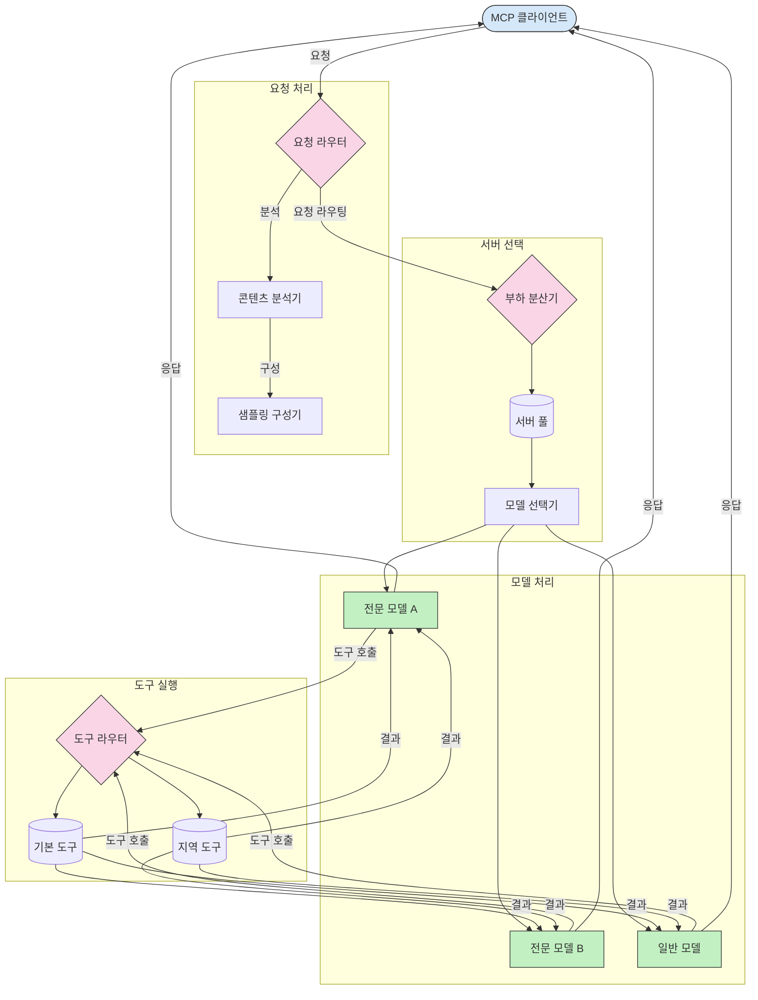

# 모델 컨텍스트 프로토콜에서의 라우팅

라우팅은 MCP 생태계 내에서 요청을 적절한 모델, 도구 또는 서비스로 전달하는 데 필수적입니다.

## 소개

모델 컨텍스트 프로토콜(MCP)에서의 라우팅은 콘텐츠 유형, 사용자 컨텍스트, 시스템 부하와 같은 다양한 기준에 따라 요청을 가장 적합한 모델이나 서비스로 전달하는 것을 포함합니다. 이는 효율적인 처리와 최적의 자원 활용을 보장합니다.

## 학습 목표

이 강의를 마치면 다음을 할 수 있습니다:

- MCP에서 라우팅 원칙을 이해합니다.
- 콘텐츠 기반 라우팅을 구현하여 요청을 특화된 서비스로 전달합니다.
- 자원 활용을 최적화하기 위한 지능형 부하 분산 전략을 적용합니다.
- 요청 컨텍스트에 따라 동적으로 도구 라우팅을 구현합니다.

## 콘텐츠 기반 라우팅

콘텐츠 기반 라우팅은 요청의 콘텐츠에 따라 요청을 특화된 서비스로 전달합니다. 예를 들어, 코드 생성 관련 요청은 특화된 코드 모델로 라우팅되고, 창작 글쓰기 요청은 창작 글쓰기 모델로 전달될 수 있습니다.

다양한 프로그래밍 언어로 구현한 예제를 살펴보겠습니다.

<details>
<summary>.NET</summary>

```csharp
// .NET Example: Content-based routing in MCP
public class ContentBasedRouter
{
    private readonly Dictionary<string, McpClient> _specializedClients;
    private readonly RoutingClassifier _classifier;
    
    public ContentBasedRouter()
    {
        // Initialize specialized clients for different domains
        _specializedClients = new Dictionary<string, McpClient>
        {
            ["code"] = new McpClient("https://code-specialized-mcp.com"),
            ["creative"] = new McpClient("https://creative-specialized-mcp.com"),
            ["scientific"] = new McpClient("https://scientific-specialized-mcp.com"),
            ["general"] = new McpClient("https://general-mcp.com")
        };
        
        // Initialize content classifier
        _classifier = new RoutingClassifier();
    }
    
    public async Task<McpResponse> RouteAndProcessAsync(string prompt, IDictionary<string, object> parameters = null)
    {
        // Classify the prompt to determine the best specialized service
        string category = await _classifier.ClassifyPromptAsync(prompt);
        
        // Get the appropriate client or fall back to general
        var client = _specializedClients.ContainsKey(category) 
            ? _specializedClients[category] 
            : _specializedClients["general"];
            
        Console.WriteLine($"Routing request to {category} specialized service");
        
        // Send request to the selected service
        return await client.SendPromptAsync(prompt, parameters);
    }
    
    // Simple classifier for routing decisions
    private class RoutingClassifier
    {
        public Task<string> ClassifyPromptAsync(string prompt)
        {
            prompt = prompt.ToLowerInvariant();
            
            if (prompt.Contains("code") || prompt.Contains("function") || 
                prompt.Contains("program") || prompt.Contains("algorithm"))
            {
                return Task.FromResult("code");
            }
            
            if (prompt.Contains("story") || prompt.Contains("creative") || 
                prompt.Contains("imagine") || prompt.Contains("design"))
            {
                return Task.FromResult("creative");
            }
            
            if (prompt.Contains("science") || prompt.Contains("research") || 
                prompt.Contains("analyze") || prompt.Contains("study"))
            {
                return Task.FromResult("scientific");
            }
            
            return Task.FromResult("general");
        }
    }
}
```

이전 코드에서 우리는:

- 프롬프트의 콘텐츠를 기반으로 요청을 라우팅하는 `ContentBasedRouter` 클래스를 생성했습니다.
- 다양한 도메인(코드, 창작, 과학, 일반)에 특화된 클라이언트를 초기화했습니다.
- 프롬프트의 카테고리를 결정하고 적절한 특화 서비스로 라우팅하는 간단한 분류기를 구현했습니다.
- 특화된 서비스가 없을 경우 일반 서비스로 라우팅하는 대체 메커니즘을 사용했습니다.
- 요청을 효율적으로 처리하기 위해 비동기 처리 방식을 적용했습니다.
- 콘텐츠 카테고리를 특화된 MCP 클라이언트에 매핑하기 위해 사전을 사용했습니다.
- 프롬프트를 분석하고 적절한 카테고리를 반환하는 단순 분류기를 구현했습니다.
- 요청을 전송하고 응답을 받기 위해 특화된 클라이언트를 사용했습니다.
- 프롬프트가 어떤 특화 카테고리와도 일치하지 않는 경우 일반 서비스로 라우팅하는 처리를 했습니다.

</details>

## 지능형 부하 분산

부하 분산은 MCP 서비스의 자원 활용을 최적화하고 고가용성을 확보합니다. 라운드로빈, 가중 응답 시간, 콘텐츠 인지 전략 등 다양한 부하 분산 구현 방식이 있습니다.

다음 예제 구현에서는 다음 전략을 사용합니다:

- <strong>라운드로빈</strong>: 요청을 사용 가능한 서버 전체에 고르게 분배합니다.
- **가중 응답 시간**: 평균 응답 시간을 기준으로 서버로 요청을 라우팅합니다.
- **콘텐츠 인지**: 요청의 콘텐츠에 따라 특화된 서버로 라우팅합니다.

<details>
<summary>Java</summary>

```java
// Java 예제: MCP 서버를 위한 지능형 부하 분산
public class McpLoadBalancer {
    private final List<McpServerNode> serverNodes;
    private final LoadBalancingStrategy strategy;
    
    public McpLoadBalancer(List<McpServerNode> nodes, LoadBalancingStrategy strategy) {
        this.serverNodes = new ArrayList<>(nodes);
        this.strategy = strategy;
    }
    
    public McpResponse processRequest(McpRequest request) {
        // 전략에 따라 최적의 서버 선택
        McpServerNode selectedNode = strategy.selectNode(serverNodes, request);
        
        try {
            // 선택된 노드로 요청 라우팅
            return selectedNode.processRequest(request);
        } catch (Exception e) {
            // 실패 처리 - 재시도 또는 폴백 로직 구현
            System.err.println("Error processing request on node " + selectedNode.getId() + ": " + e.getMessage());
            
            // 노드를 잠재적으로 비정상 상태로 표시
            selectedNode.recordFailure();
            
            // 폴백으로 다음 최적 노드 시도
            List<McpServerNode> remainingNodes = new ArrayList<>(serverNodes);
            remainingNodes.remove(selectedNode);
            
            if (!remainingNodes.isEmpty()) {
                McpServerNode fallbackNode = strategy.selectNode(remainingNodes, request);
                return fallbackNode.processRequest(request);
            } else {
                throw new RuntimeException("All MCP server nodes failed to process the request");
            }
        }
    }
    
    // 노드 건강 상태 점검 작업
    public void startHealthChecks(Duration interval) {
        ScheduledExecutorService scheduler = Executors.newScheduledThreadPool(1);
        scheduler.scheduleAtFixedRate(() -> {
            for (McpServerNode node : serverNodes) {
                try {
                    boolean isHealthy = node.checkHealth();
                    System.out.println("Node " + node.getId() + " health status: " + 
                                      (isHealthy ? "HEALTHY" : "UNHEALTHY"));
                } catch (Exception e) {
                    System.err.println("Health check failed for node " + node.getId());
                    node.setHealthy(false);
                }
            }
        }, 0, interval.toMillis(), TimeUnit.MILLISECONDS);
    }
    
    // 부하 분산 전략을 위한 인터페이스
    public interface LoadBalancingStrategy {
        McpServerNode selectNode(List<McpServerNode> nodes, McpRequest request);
    }
    
    // 라운드로빈 전략
    public static class RoundRobinStrategy implements LoadBalancingStrategy {
        private AtomicInteger counter = new AtomicInteger(0);
        
        @Override
        public McpServerNode selectNode(List<McpServerNode> nodes, McpRequest request) {
            List<McpServerNode> healthyNodes = nodes.stream()
                .filter(McpServerNode::isHealthy)
                .collect(Collectors.toList());
            
            if (healthyNodes.isEmpty()) {
                throw new RuntimeException("No healthy nodes available");
            }
            
            int index = counter.getAndIncrement() % healthyNodes.size();
            return healthyNodes.get(index);
        }
    }
    
    // 가중 응답 시간 전략
    public static class ResponseTimeStrategy implements LoadBalancingStrategy {
        @Override
        public McpServerNode selectNode(List<McpServerNode> nodes, McpRequest request) {
            return nodes.stream()
                .filter(McpServerNode::isHealthy)
                .min(Comparator.comparing(McpServerNode::getAverageResponseTime))
                .orElseThrow(() -> new RuntimeException("No healthy nodes available"));
        }
    }
    
    // 컨텐츠 인식 전략
    public static class ContentAwareStrategy implements LoadBalancingStrategy {
        @Override
        public McpServerNode selectNode(List<McpServerNode> nodes, McpRequest request) {
            // 요청 특성 결정
            boolean isCodeRequest = request.getPrompt().contains("code") || 
                                   request.getAllowedTools().contains("codeInterpreter");
            
            boolean isCreativeRequest = request.getPrompt().contains("creative") || 
                                       request.getPrompt().contains("story");
            
            // 전문화된 노드 찾기
            Optional<McpServerNode> specializedNode = nodes.stream()
                .filter(McpServerNode::isHealthy)
                .filter(node -> {
                    if (isCodeRequest && node.getSpecialization().equals("code")) {
                        return true;
                    }
                    if (isCreativeRequest && node.getSpecialization().equals("creative")) {
                        return true;
                    }
                    return false;
                })
                .findFirst();
            
            // 전문화된 노드 또는 가장 부하가 적은 노드 반환
            return specializedNode.orElse(
                nodes.stream()
                    .filter(McpServerNode::isHealthy)
                    .min(Comparator.comparing(McpServerNode::getCurrentLoad))
                    .orElseThrow(() -> new RuntimeException("No healthy nodes available"))
            );
        }
    }
}
```

이전 코드에서 우리는:

- MCP 서버 노드 목록을 관리하고 선택한 부하 분산 전략에 따라 요청을 라우팅하는 `McpLoadBalancer` 클래스를 생성했습니다.
- `RoundRobinStrategy`, `ResponseTimeStrategy`, `ContentAwareStrategy`라는 다양한 부하 분산 전략을 구현했습니다.
- `ScheduledExecutorService`를 사용해 서버 노드의 상태를 주기적으로 확인했습니다.
- 건강 검사 후 노드 상태를 건강 또는 비건강으로 표시하는 건강 검사 메커니즘을 구현했습니다.
- 고가용성을 보장하기 위해 오류 처리 및 대체 로직과 함께 요청 처리를 구현했습니다.
- 개별 MCP 서버 노드를 나타내는 `McpServerNode` 클래스를 사용했으며, 여기에는 건강 상태, 평균 응답 시간, 현재 부하가 포함됩니다.
- 프롬프트 및 허용된 도구 등 요청 세부 정보를 캡슐화한 `McpRequest` 클래스를 구현했습니다.
- Java 스트림을 사용해 건강 상태와 특화 상태를 기준으로 노드를 필터링하고 선택했습니다.

</details>

## 동적 도구 라우팅

도구 라우팅은 도구 호출이 컨텍스트에 따라 가장 적합한 서비스로 전달되도록 합니다. 예를 들어, 날씨 도구 호출은 사용자의 지역에 따라 지역 엔드포인트로 전달되어야 하며, 계산기 도구는 특정 API 버전을 사용해야 할 수 있습니다.

요청 분석, 지역 엔드포인트, 버전 관리 지원에 기반한 동적 도구 라우팅을 보여주는 예제 구현을 살펴보겠습니다.

<details>
<summary>Python</summary>

```python
# 파이썬 예제: 요청 분석에 따른 동적 도구 라우팅
class McpToolRouter:
    def __init__(self):
        # 사용 가능한 도구 엔드포인트 등록
        self.tool_endpoints = {
            "weatherTool": "https://weather-service.example.com/api",
            "calculatorTool": "https://calculator-service.example.com/compute",
            "databaseTool": "https://database-service.example.com/query",
            "searchTool": "https://search-service.example.com/search"
        }
        
        # 전역 분배를 위한 지역 엔드포인트
        self.regional_endpoints = {
            "us": {
                "weatherTool": "https://us-west.weather-service.example.com/api",
                "searchTool": "https://us.search-service.example.com/search"
            },
            "europe": {
                "weatherTool": "https://eu.weather-service.example.com/api",
                "searchTool": "https://eu.search-service.example.com/search"
            },
            "asia": {
                "weatherTool": "https://asia.weather-service.example.com/api",
                "searchTool": "https://asia.search-service.example.com/search"
            }
        }
        
        # 도구 버전 관리 지원
        self.tool_versions = {
            "weatherTool": {
                "default": "v2",
                "v1": "https://weather-service.example.com/api/v1",
                "v2": "https://weather-service.example.com/api/v2",
                "beta": "https://weather-service.example.com/api/beta"
            }
        }
    
    async def route_tool_request(self, tool_name, parameters, user_context=None):
        """Route a tool request to the appropriate endpoint based on context"""
        endpoint = self._select_endpoint(tool_name, parameters, user_context)
        
        if not endpoint:
            raise ValueError(f"No endpoint available for tool: {tool_name}")
        
        # 선택한 엔드포인트에 실제 요청 수행
        return await self._execute_tool_request(endpoint, tool_name, parameters)
    
    def _select_endpoint(self, tool_name, parameters, user_context=None):
        """Select the most appropriate endpoint based on context"""
        # 레지스트리에서 기본 엔드포인트 가져오기
        if tool_name not in self.tool_endpoints:
            return None
            
        base_endpoint = self.tool_endpoints[tool_name]
        
        # 특정 도구 버전을 사용해야 하는지 확인
        if tool_name in self.tool_versions:
            version_info = self.tool_versions[tool_name]
            
            # 지정된 버전 사용 또는 기본값 사용
            requested_version = parameters.get("_version", version_info["default"])
            if requested_version in version_info:
                base_endpoint = version_info[requested_version]
        
        # 사용자의 지역이 알려진 경우 지역 라우팅 확인
        if user_context and "region" in user_context:
            user_region = user_context["region"]
            
            if user_region in self.regional_endpoints:
                regional_tools = self.regional_endpoints[user_region]
                
                if tool_name in regional_tools:
                    # 지역별 엔드포인트 사용
                    return regional_tools[tool_name]
        
        # 데이터 거주 요건 확인
        if user_context and "data_residency" in user_context:
            # 지정된 관할 구역 내 데이터 유지 논리 구현
            pass
        
        # 지연 시간 기반 라우팅 확인
        if user_context and "latency_sensitive" in user_context and user_context["latency_sensitive"]:
            # 가장 낮은 지연 시간 엔드포인트 선택 논리 구현
            pass
            
        return base_endpoint
        
    async def _execute_tool_request(self, endpoint, tool_name, parameters):
        """Execute the actual tool request to the selected endpoint"""
        try:
            async with aiohttp.ClientSession() as session:
                async with session.post(
                    endpoint,
                    json={"toolName": tool_name, "parameters": parameters},
                    headers={"Content-Type": "application/json"}
                ) as response:
                    if response.status == 200:
                        result = await response.json()
                        return result
                    else:
                        error_text = await response.text()
                        raise Exception(f"Tool execution failed: {error_text}")
        except Exception as e:
            # 재시도 로직 또는 대체 전략 구현
            print(f"Error executing tool {tool_name} at {endpoint}: {str(e)}")
            raise
```

이전 코드에서 우리는:

- 요청 분석, 지역 엔드포인트, 버전 관리 지원에 기반하여 도구 라우팅을 관리하는 `McpToolRouter` 클래스를 생성했습니다.
- 사용 가능한 도구 엔드포인트 및 글로벌 배포를 위한 지역 엔드포인트를 등록했습니다.
- 사용자 컨텍스트(지역 및 데이터 거주 요구사항 등)에 따라 적합한 엔드포인트를 선택하는 동적 라우팅 로직을 구현했습니다.
- 사용자가 도구의 버전을 지정할 수 있도록 도구에 대한 버전 관리를 구현했습니다.
- 비동기 HTTP 요청을 사용하여 도구 호출을 실행하고 응답을 처리했습니다.

</details>

## MCP에서 샘플링 및 라우팅 아키텍처

샘플링은 모델 컨텍스트 프로토콜(MCP)의 중요한 구성요소로, 효율적인 요청 처리와 라우팅을 가능하게 합니다. 이는 콘텐츠 유형, 사용자 컨텍스트, 시스템 부하 등의 다양한 기준에 근거해 가장 적합한 모델 또는 서비스를 결정하기 위해 들어오는 요청을 분석하는 것을 포함합니다.

샘플링과 라우팅을 결합하면 자원 활용을 최적화하고 고가용성을 보장하는 견고한 아키텍처를 만들 수 있습니다. 샘플링 과정은 요청을 분류하는 데 사용되며, 라우팅은 이를 적절한 모델이나 서비스로 전달합니다.

아래 다이어그램은 샘플링과 라우팅이 포괄적인 MCP 아키텍처에서 어떻게 함께 작동하는지 보여줍니다:



## 다음 단계

- [5.6 샘플링](../mcp-sampling/README.md)

---

<!-- CO-OP TRANSLATOR DISCLAIMER START -->
**면책 조항**:
이 문서는 AI 번역 서비스 [Co-op Translator](https://github.com/Azure/co-op-translator)를 사용하여 번역되었습니다. 정확성을 기하기 위해 노력하고 있으나, 자동 번역은 오류나 부정확한 부분이 있을 수 있음을 유의하시기 바랍니다. 원본 문서의 원어본이 권위 있는 자료로 간주되어야 합니다. 중요한 정보의 경우, 전문가의 인간 번역을 권장합니다. 이 번역 사용으로 인해 발생하는 오해나 잘못된 해석에 대해 당사는 책임을 지지 않습니다.
<!-- CO-OP TRANSLATOR DISCLAIMER END -->