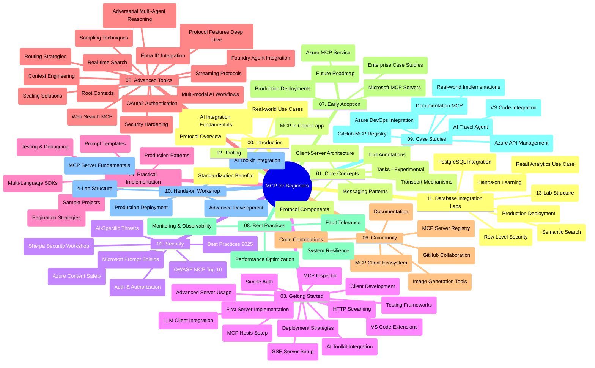

# 초보자를 위한 모델 컨텍스트 프로토콜(MCP) - 학습 가이드

이 학습 가이드는 "초보자를 위한 모델 컨텍스트 프로토콜(MCP)" 커리큘럼의 저장소 구조와 내용을 개관합니다. 이 가이드를 사용하여 저장소를 효율적으로 탐색하고 사용 가능한 리소스를 최대한 활용하세요.

## 저장소 개요

모델 컨텍스트 프로토콜(MCP)은 AI 모델과 클라이언트 응용 프로그램 간 상호작용을 위한 표준화된 프레임워크입니다. 처음에는 Anthropic에서 만들었으며, 현재는 공식 GitHub 조직을 통해 더 넓은 MCP 커뮤니티가 유지 관리하고 있습니다. 이 저장소는 AI 개발자, 시스템 설계자, 소프트웨어 엔지니어를 위해 C#, Java, JavaScript, Python, TypeScript로 된 실습 코드 예제를 포함한 포괄적인 커리큘럼을 제공합니다.

## 시각적 커리큘럼 맵

## 저장소 구조

저장소는 MCP의 다양한 측면에 초점을 맞춘 12개의 주요 섹션으로 구성되어 있습니다:

1. **소개 (00-Introduction/)**
   - 모델 컨텍스트 프로토콜 개요
   - AI 파이프라인에서 표준화의 중요성
   - 실용적 사용 사례와 이점

2. **핵심 개념 (01-CoreConcepts/)**
   - 클라이언트-서버 아키텍처
   - 주요 프로토콜 구성 요소
   - MCP에서의 메시징 패턴
   - 앞으로의 전망: [MCP의 변화: 2026-07-28 릴리스 후보](./01-CoreConcepts/mcp-2026-07-28-release-candidate.md) — 상태 비저장 프로토콜 핵심, 확장 프레임워크 및 다음 명세 버전에서 예상되는 Roots/Sampling/Logging 폐지

3. **보안 (02-Security/)**
   - MCP 기반 시스템에서의 보안 위협
   - 보안 구현 모범 사례
   - 인증 및 권한 부여 전략
   - **종합 보안 문서**:
     - MCP 보안 모범 사례 2025
     - Azure 콘텐츠 안전 구현 가이드
     - MCP 보안 제어 및 기법
     - MCP 모범 사례 빠른 참조
   - **주요 보안 주제**:
     - 프롬프트 인젝션 및 도구 오염 공격
     - 세션 가로채기 및 혼란된 중개 문제
     - 토큰 전달 취약점
     - 과도한 권한 및 접근 제어
     - AI 구성 요소 공급망 보안
     - 마이크로소프트 프롬프트 쉴드 통합

4. **시작하기 (03-GettingStarted/)**
   - 환경 설정 및 구성
   - 기본 MCP 서버 및 클라이언트 생성
   - 기존 애플리케이션과 통합
   - 다음 섹션 포함:
     - 첫 서버 구현
     - 클라이언트 개발
     - LLM 클라이언트 통합
     - VS Code 통합
     - 서버 전송 이벤트(SSE) 서버
     - 고급 서버 사용법
     - HTTP 스트리밍
     - AI 툴킷 통합
     - 테스트 전략
     - 배포 지침

5. **실제 구현 (04-PracticalImplementation/)**
   - 다양한 프로그래밍 언어용 SDK 사용법
   - 디버깅, 테스트 및 검증 기법
   - 재사용 가능한 프롬프트 템플릿 및 작업 흐름 작성
   - 구현 예제와 함께 제공되는 샘플 프로젝트

6. **고급 주제 (05-AdvancedTopics/)**
   - 컨텍스트 엔지니어링 기법
   - Foundry 에이전트 통합
   - 멀티모달 AI 작업 흐름
   - OAuth2 인증 데모
   - 실시간 검색 기능
   - 실시간 스트리밍
   - 루트 컨텍스트 구현
   - 라우팅 전략
   - 샘플링 기법
   - 확장 방안
   - 보안 고려사항
   - Entra ID 보안 통합
   - 웹 검색 통합
   - 대립적 멀티에이전트 추론(토론 패턴)

7. **커뮤니티 기여 (06-CommunityContributions/)**
   - 코드 및 문서 기여 방법
   - GitHub를 통한 협업
   - 커뮤니티 주도의 개선 및 피드백
   - 다양한 MCP 클라이언트 사용법(Claude Desktop, Cline, VSCode)
   - 이미지 생성을 포함한 인기 MCP 서버 작업

8. **조기 도입에서 얻은 교훈 (07-LessonsfromEarlyAdoption/)**
   - 실제 구현 사례 및 성공 스토리
   - MCP 기반 솔루션 구축 및 배포
   - 트렌드와 향후 로드맵
   - **마이크로소프트 MCP 서버 가이드**: 10개의 프로덕션 준비된 마이크로소프트 MCP 서버 포괄 가이드 포함:
     - Microsoft Learn Docs MCP 서버
     - Azure MCP 서버 (15개 이상의 전문 커넥터)
     - GitHub MCP 서버
     - Azure DevOps MCP 서버
     - MarkItDown MCP 서버
     - SQL Server MCP 서버
     - Playwright MCP 서버
     - Dev Box MCP 서버
     - Microsoft Foundry MCP 서버
     - Microsoft 365 Agents Toolkit MCP 서버

9. **모범 사례 (08-BestPractices/)**
   - 성능 튜닝 및 최적화
   - 내결함성 MCP 시스템 설계
   - 테스트 및 복원력 전략

10. **사례 연구 (09-CaseStudy/)**
    - MCP의 다양성을 보여주는 **7개의 종합적인 사례 연구**:
    - **Azure AI 여행 에이전트**: Azure OpenAI 및 AI 검색과의 멀티 에이전트 오케스트레이션
    - **Azure DevOps 통합**: YouTube 데이터 업데이트를 통한 워크플로 자동화
    - **실시간 문서 검색**: 스트리밍 HTTP를 사용하는 Python 콘솔 클라이언트
    - **대화형 학습 계획 생성기**: Chainlit 웹 앱과 대화형 AI
    - **편집기 내 문서화**: GitHub Copilot 워크플로와 VS Code 통합
    - **Azure API 관리**: MCP 서버 생성을 통한 기업 API 통합
    - **GitHub MCP 레지스트리**: 생태계 개발 및 에이전트 통합 플랫폼
    - 엔터프라이즈 통합, 개발자 생산성, 생태계 발전 전반에 걸친 구현 예제

11. **실습 워크숍 (10-StreamliningAIWorkflowsBuildingAnMCPServerWithAIToolkit/)**
    - MCP와 AI 툴킷을 결합한 포괄적 실습 워크숍
    - AI 모델과 실제 도구를 연결하는 지능형 애플리케이션 구축
    - 기본, 맞춤 서버 개발, 프로덕션 배포 전략을 다루는 실습 모듈
    - **랩 구성**:
      - 랩 1: MCP 서버 기초
      - 랩 2: 고급 MCP 서버 개발
      - 랩 3: AI 툴킷 통합
      - 랩 4: 프로덕션 배포 및 확장
    - 단계별 지침을 포함한 랩 기반 학습 방식

12. **MCP 서버 데이터베이스 통합 랩 (11-MCPServerHandsOnLabs/)**
    - 프로덕션 준비된 MCP 서버 구축을 위한 <strong>포괄적인 13개 랩 학습 경로</strong>로 PostgreSQL 통합 포함
    - Zava Retail 유스케이스를 활용한 **실제 소매 분석 구현**
    - 행 수준 보안(RLS), 의미 검색, 다중 테넌트 데이터 접근 등 **엔터프라이즈 급 패턴**
    - **완전한 랩 구성**:
      - **랩 00-03: 기초** - 소개, 아키텍처, 보안, 환경 설정
      - **랩 04-06: MCP 서버 구축** - 데이터베이스 설계, MCP 서버 구현, 도구 개발
      - **랩 07-09: 고급 기능** - 의미 검색, 테스트 및 디버깅, VS Code 통합
      - **랩 10-12: 프로덕션 & 모범 사례** - 배포, 모니터링, 최적화
    - **적용 기술**: FastMCP 프레임워크, PostgreSQL, Azure OpenAI, Azure 컨테이너 앱, Application Insights
    - **학습 성과**: 프로덕션 준비 MCP 서버, 데이터베이스 통합 패턴, AI 기반 분석, 엔터프라이즈 보안

13. **도구 (12-tooling/)**
    - Copilot 앱 및 기타 도구에서 MCP 사용하는 방법 학습

## 추가 리소스

저장소에는 다음과 같은 지원 리소스가 포함되어 있습니다:

- **이미지 폴더**: 커리큘럼 전반에 사용된 다이어그램 및 일러스트 포함
- <strong>번역</strong>: 문서의 다국어 지원을 위한 자동 번역 포함
- **공식 MCP 리소스**:
  - [MCP 문서](https://modelcontextprotocol.io/)
  - [MCP 명세](https://spec.modelcontextprotocol.io/)
  - [MCP GitHub 저장소](https://github.com/modelcontextprotocol)

## 이 저장소 사용 방법

1. **순차 학습**: 구조화된 학습 경험을 위해 00부터 11장까지 순서대로 따라가세요.
2. **언어별 집중**: 특정 프로그래밍 언어에 관심이 있다면, 해당 언어별 샘플 구현을 샘플 디렉터리에서 탐색하세요.
3. **실습 구현**: 먼저 "시작하기" 섹션에서 환경을 설정하고 첫 MCP 서버와 클라이언트를 만드세요.
4. **고급 탐색**: 기본 사항에 익숙해지면 고급 주제로 들어가 지식을 확장하세요.
5. **커뮤니티 참여**: GitHub 토론 및 Discord 채널을 통해 MCP 커뮤니티에 참여해 전문가 및 개발자들과 교류하세요.

## MCP 클라이언트 및 도구

커리큘럼은 다양한 MCP 클라이언트 및 도구를 다룹니다:

1. **공식 클라이언트**:
   - Visual Studio Code 
   - Visual Studio Code 내 MCP
   - Claude Desktop
   - VSCode용 Claude
   - Claude API

2. **커뮤니티 클라이언트**:
   - Cline (터미널 기반)
   - Cursor (코드 편집기)
   - ChatMCP
   - Windsurf

3. **MCP 관리 도구**:
   - MCP CLI
   - MCP 매니저
   - MCP 링커
   - MCP 라우터

## 인기 있는 MCP 서버

저장소는 다음과 같은 다양한 MCP 서버를 소개합니다:

1. **공식 마이크로소프트 MCP 서버**:
   - Microsoft Learn Docs MCP 서버
   - Azure MCP 서버 (15개 이상의 전문 커넥터)
   - GitHub MCP 서버
   - Azure DevOps MCP 서버
   - MarkItDown MCP 서버
   - SQL Server MCP 서버
   - Playwright MCP 서버
   - Dev Box MCP 서버
   - Microsoft Foundry MCP 서버
   - Microsoft 365 Agents Toolkit MCP 서버

2. **공식 참조 서버**:
   - 파일시스템
   - Fetch
   - 메모리
   - 순차적 사고(Sequential Thinking)

3. **이미지 생성**:
   - Azure OpenAI DALL-E 3
   - Stable Diffusion WebUI
   - Replicate

4. **개발 도구**:
   - Git MCP
   - 터미널 제어
   - 코드 어시스턴트

5. **전문 서버**:
   - Salesforce
   - Microsoft Teams
   - Jira 및 Confluence

## 기여 방법

이 저장소는 커뮤니티의 기여를 환영합니다. MCP 생태계에 효과적으로 기여하는 방법은 커뮤니티 기여 섹션을 참조하세요.

----

*이 학습 가이드는 2026년 2월 5일에 마지막으로 업데이트되었으며 최신 MCP 명세 2025-11-25를 반영하고, 해당 날짜 기준 저장소 개요를 제공합니다. 저장소 내용은 이후에 업데이트될 수 있습니다.*

*부록(2026년 7월 2일): `2026-07-28` MCP 명세 릴리스 후보에 관한 수업이 [01-CoreConcepts](./01-CoreConcepts/mcp-2026-07-28-release-candidate.md)에 추가되었습니다; 커리큘럼 기준은 새 명세가 나올 때까지 2025-11-25로 유지됩니다.*

---

<!-- CO-OP TRANSLATOR DISCLAIMER START -->
**면책 조항**:
이 문서는 AI 번역 서비스 [Co-op Translator](https://github.com/Azure/co-op-translator)를 사용하여 번역되었습니다. 정확성을 기하기 위해 노력하고 있으나, 자동 번역은 오류나 부정확한 부분이 있을 수 있음을 유의하시기 바랍니다. 원본 문서의 원어본이 권위 있는 자료로 간주되어야 합니다. 중요한 정보의 경우, 전문가의 인간 번역을 권장합니다. 이 번역 사용으로 인해 발생하는 오해나 잘못된 해석에 대해 당사는 책임을 지지 않습니다.
<!-- CO-OP TRANSLATOR DISCLAIMER END -->